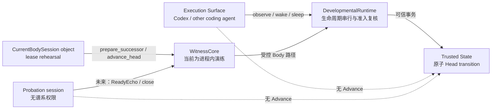
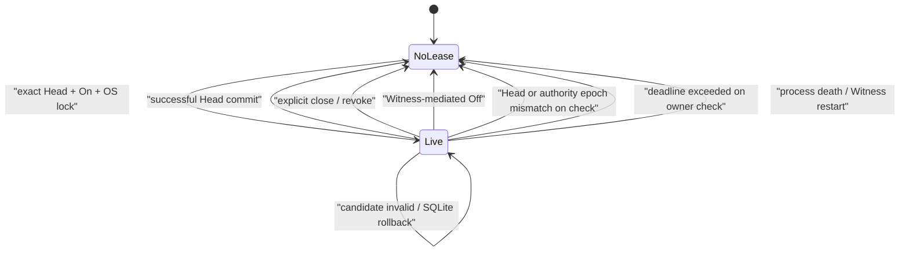

# Current Body 私有会话租约

更新时间：2026-07-30
状态：逻辑协议与进程内演练已实现并通过隔离测试；Windows public pipe 已认证账户但 OS 私有 Body 来源证明尚未实现
用途：规定 Current Body 如何取得一次、短期、可撤销的谱系推进权，并准确划定当前实现与真实 Witness capability 之间的边界

---

## 1. 本轮真正要解决的问题

单一可信事务域已经保证：

```text
Head 变化
+ evidence
+ checkpoint
+ revision
→ 同时提交或同时回滚
```

但事务原子性并不回答“谁有资格请求这次变化”。如果任何 Codex、普通用户进程、候选试生或模型器官都能直接调用 `advance_head`，那么连续谱系只是一个公开写接口，不是 Current Body 的发展权。

本轮最小问题因此是：

> 在不规定身体内部学习算法的前提下，怎样让谱系变化必须经过一个绑定 exact Current Head 的短期会话；并让旧 Head、Off 前会话、过期会话、其他会话准备的候选和普通 Surface 声明都不能复用这项权力？

这里先实现协议语义和调用编排。它是后续 OS Witness 的可执行前置契约，不冒充已经完成的进程身份认证。

---

## 2. 三种 session 不能混为一谈

| session | 含义 | 是否拥有 lineage authority |
|---|---|---|
| Surface session | Codex 或其他 coding agent 的一次执行表面连接 | 否 |
| Current Body session | 绑定 exact Head 的 `CurrentBodySession` 逻辑会话对象 | 逻辑正常路径内有；OS 可信来源尚未成立 |
| Probation session | 候选身体的有限实例化与 ReadyEcho | 否 |

关系不是：

```text
任意 session
→ 上传 role=body
→ 获得 Advance
```

而是：



Surface 只能产生 `surface_unverified` 观测。当前逻辑 Body 通路只能产生 `in_process_rehearsal`。只有真实 OS 私有入口建立后，Witness 才可能派生 `agent_self_authored`。

---

## 3. 为什么不是 bearer token 或 lease 表

把随机 token 写进文件、环境变量、命令行、SQLite 或普通 IPC，只能形成一段可复制秘密：

\[
\operatorname{Know}(token)
\not\Rightarrow
\operatorname{Is}(CurrentBody)
\]

同权限进程一旦读到 token，就可以复制请求。持久化 lease 还会带来更严重的问题：Witness 重启后，一行仍存在的数据库记录可能被误解释为一个仍活着的身体连接。

因此本轮明确不增加：

- bearer token；
- 持久化 lease 表；
- 通用 RPC dispatcher；
- 调用方自报的 `source_kind`、`author_kind` 或 Human Learning Intervention；
- nonce、PID 白名单或 evaluator；
- probation 状态机。

当前 lease 只存在于内存对象与被持有的 OS 文件锁中。进程死亡会释放锁，Witness 重启不会从 SQLite 复活 lease。

---

## 4. 最小 lease 状态

当前 `CurrentBodySession` 只携带：

```text
root
head
authority_epoch
deadline_monotonic
prepared_candidates
held .body-session.lock
object identity
```

各字段的因果意义是：

| 字段 | 防止什么 |
|---|---|
| `root` | 把另一个身份谱系混入当前生命 |
| `head` | 旧身体在新 Head 出现后继续行动 |
| `authority_epoch` | Off→On 后旧会话复活 |
| `deadline_monotonic` | 墙上时钟回拨延长租约 |
| `prepared_candidates` | 仅伪造 `in_process_rehearsal` 标签就冒充本会话候选 |
| OS lock | 两个合作式 Witness 同时发放活动 lease |
| object identity | 同进程内复制字段后伪造另一个会话对象 |

其中 authority epoch 不新增数据库列。它定义为当前已验证 evidence 历史中最后一个已提交 Off 事件的 sequence；当前 Off 事件集合为 `host_off` 与 `control_rehearsal_off`：

\[
\boxed{
E_A(H)
=
\max
\left(
\{seq(e)\mid e\in H\land kind(e)\in
\{host\_off,\ control\_rehearsal\_off\}\}
\cup
\{0\}
\right)
}
\]

只要发生一次 Off，即使之后重新 On、Root 与 Head 都没有变化，旧 lease 的 epoch 也永远落后。

---

## 5. 有效性判定

令 \(L\) 为当前会话，\(C\) 为候选，\(t\) 为单调时间，\(H_{current}\) 为当前已验证 evidence 历史。操作准入条件为：

\[
\boxed{
\begin{aligned}
Live(L,t)\iff\;&
Authority=On\\
\land\;&L=ActiveLease\\
\land\;&t<Deadline_L\\
\land\;&Root_L=CurrentRoot\\
\land\;&Head_L=CurrentHead\\
\land\;&Epoch_L=E_A(H_{current})
\end{aligned}
}
\]

候选推进还必须满足：

\[
\boxed{
\begin{aligned}
Eligible(L,C)\iff\;&Live(L,t)\\
\land\;&C\in Prepared_L\\
\land\;&Root(C)=CurrentRoot\\
\land\;&Parent(C)=CurrentHead\\
\land\;&Generation(C)=Generation(CurrentHead)+1\\
\land\;&Author(C)=in\_process\_rehearsal\\
\land\;&StaticActivationGate(C)
\end{aligned}
}
\]

这里的 `Author(C)` 仍只是受控路径标签，不是 OS 认证 principal。`C ∈ Prepared_L` 证明的是“这个 commitment 由同一个逻辑 lease 的 prepare 调用返回”，不是“物理上只有真实身体能创建它”。

---

## 6. 状态机



两个失败语义必须分开：

\[
Commit(Advance)
\Rightarrow
Head'=Candidate
\land
Lease'=\varnothing
\]

\[
\neg Commit(Advance)
\land
LiveBindingAfterFailure
\Rightarrow
Head'=Head
\land
Lease'=Lease
\]

候选 activation 不兼容或 SQLite 事务失败、且 Root / Head / Authority epoch / deadline 仍有效时，Current Body 可以修正后重试。Off、Head 变化、epoch 变化或过期不是“可修正候选失败”，会使 lease 失效；成功推进后旧会话同样必须被消费，新 Head 需要新会话。

---

## 7. 关键竞态怎样被关闭

### 7.1 发放 lease 时的双重绑定

流程为：

```text
读取 On / Root / Head / authority epoch
→ 取得 .body-session.lock
→ 再次在 lifecycle lock 内读取绑定
→ 若 Off 或 Root / Head 改变则释放锁并拒绝
→ 否则绑定锁后读到的最新 authority epoch
→ 创建 volatile session
```

因此不能把“检查通过后、取得唯一锁前”发生的 Off 或 Head 变化带入新 lease。

### 7.2 每次操作的双重检查

Witness 先检查 session 对象、deadline、Root、Head 与 authority epoch；Runtime 随后在 lifecycle lock 内再次检查：

```text
expected Head
+ expected authority epoch
+ current parent
+ candidate authorship
```

这关闭了 Witness 检查结束到 Runtime 真正进入串行临界区之间的 Off、On 或 Head 竞态。

### 7.3 不能靠标签洗白候选

普通代码即使直接创建：

```text
author_kind = in_process_rehearsal
```

也不会进入该 lease 的 `prepared_candidates`，因此不能推进。Runtime 还会再次要求 manifest author 与受控入口派生的 author 一致，避免内部研究入口重标记候选。

---

## 8. 来源字段的当前语义

调用方不再能向公共 `observe()` 自报：

- `source_kind`；
- `author_kind`；
- `human_intervention_kind`。

当前派生规则是：

| 入口 | `source_kind` | `author_kind` | evidence 中的入口标签 |
|---|---|---|---|
| 普通 execution surface | `execution_surface` | `surface_unverified` | execution surface metadata |
| Current Body 逻辑演练 | `body` | `in_process_rehearsal` | `ingress_path=in_process_rehearsal` |
| 测试科研仪器私有入口 | 由测试明确声明 | `research_instrument` 等 | `ingress_path=test_instrument` |

`ingress_path` 是代码路径标签，不叫 `principal`，因为当前没有完成 principal authentication。

---

## 9. 已验证性质

隔离测试已经验证：

1. 只有 exact Current Head 可以申请逻辑 lease；
2. 同一 home 的两个合作式 Witness 不能同时持有活动 OS lock；
3. 显式 revoke 或 close 后可以发放替代 lease，旧 session 永久失效；
4. 非正、NaN 与无穷 TTL 被拒绝；
5. 过期 lease 在下一次 owner operation 时失效且不能修改历史；
6. Witness-mediated Off 立即撤销 lease，重新 On 不会复活它；
7. 外部 Runtime Off→On 会由 authority epoch fence，旧 lease 不能再次写入；
8. 成功推进消费 lease，同一 session 不能重放；
9. activation 失败或 SQLite 失败不消费 lease，修正后可以重试；
10. session 只公开 `prepare_successor / advance_head / close`；
11. Runtime 不再公开普通 `prepare_successor / advance_head`；
12. 伪造 rehearsal 标签或其他来源候选不能被当前 lease 洗白；
13. stale parent 在 lifecycle lock 内被拒绝且不产生 evidence；
14. Surface 声明 `agent_self_authored` 不改变派生来源；
15. 当前 Pre-Genesis evidence 不把逻辑演练冒充为 `agent_self_authored`；
16. restricted Body 发出的请求必须绑定当前 boot session 与严格递增序号；
17. foreign candidate 与旧 Body lease 的 candidate 不能被当前 Body 推进；
18. result 必须来自本次 witnessed request，并精确投影 authoritative Witness response；
19. timeout 或异步通道故障若无法排除请求已跨过线性化点，会返回 `OutcomeUnknown`；
20. Body crash 会释放 volatile lease，prepared candidate 不跨 lease 继承；
21. Boot、command、response 与 stop 的父端写入均受 deadline 约束。

这些结果与单一可信事务域共同证明“逻辑 lease + 真实跨进程 transport rehearsal”的正常因果路径，不是安装态不可绕过的安全来源。包含后续 Windows 原生回归在内，当前全仓 118 项测试在 `ResourceWarning` 作为错误时通过。

---

## 10. 当前明确不能证明什么

### 10.1 不是 Body principal authentication

`WitnessCore`、Runtime、BodyStore、SQLite 与 key 仍运行在同一用户权限中。Python 下划线方法不是权限边界，同权限代码仍能绕过正常入口或修改本地实现。

### 10.2 OS lock 不是来源身份证明

Windows byte-range lock 与 POSIX `flock` 在这里用于合作式互斥。尤其在 macOS / Linux 上，advisory lock 不能阻止恶意进程忽略协议直接改文件。

### 10.3 TTL 是惰性准入，不是定时跨进程清理

当前没有后台 timer。过期在 owner 下一次操作或同一 Witness 再次发放时被发现：

\[
\operatorname{Expired}
\Rightarrow
\operatorname{RejectOnNextCheck}
\]

它不保证一个仍存活但完全空闲的 owner 会在 deadline 到达瞬间主动释放 OS lock。另一个 Witness 在旧 owner 交互、close 或死亡前仍可能拿不到锁。

### 10.4 外部 Off 的当前含义是 mutation fencing

通过同一个 `WitnessCore.turn_off()` 执行 Off 会同步释放 lease。若研究代码绕过 owner Witness、直接对 Runtime 执行 Off→On，authority epoch 会阻止旧 session 再写入，但旧 owner 持有的 OS lock 直到它再次交互、close 或死亡才释放。

正式产品必须让生产 Off 只经过机器级 singleton Witness service，由它同时完成：

```text
Authority=Off
+ close private Body connection
+ terminate/suspend Body principal
+ release lease
```

### 10.5 本 lease 层与后续 subprocess rehearsal 的边界

本 lease 层形成时，还没有 Witness-spawned exact-Head Body process、父进程创建的匿名 pipe，以及用于启动握手的 Boot challenge / `ReadyEcho`。后续 subprocess rehearsal 先补上这三项；再后续的 Windows 切片已经补上 restricted Low-Integrity suspended child、explicit inherited handle pair 与 Body 发起的 `prepare / advance` 谱系往返。

当前 `agentic-evo-private-lineage-v1` 已有 boot-session binding、严格整数序号、same-lease candidate 与 authoritative result binding；replay、伪造 result、claimed authorship、深层 JSON 和 deadline failure 已有测试。它建立的是 `private_lineage_transport_rehearsal`，不等于独立安全主体或安装态不可复制的 Body capability。

Windows foreground public pipe 后续已加入显式 DACL、remote rejection、最小 client access、impersonated TokenUser SID 与 client PID。这个结果只认证 public peer 的账户：SID 不等于 HostPresence，PID 只用于诊断；private transport 的父子拓扑也不等于 distinct principal。Off control 仍是 generic / unverified。因此截至当前仍然没有：

- 独立 Witness service principal；
- 绑定独立 Body principal、对同账户 foreground 进程不可复制的 authenticated private lineage endpoint；
- peer credential / code-signing enforcement；
- probation principal；
- 机器级唯一安装和正式 Root；
- `agent_self_authored` 的可信派生。

---

## 11. 跨平台不变量

本轮逻辑设计只依赖 Python 标准库和跨平台文件锁抽象；当前自动化证据来自 Windows，macOS / Linux 的 POSIX 锁路径仍需对应平台 CI 复核。终局安全实现必须由各平台兑现同一性质：

```text
Windows
→ [foreground 已演练] restricted Low-Integrity Body + private inherited lineage transport
→ [installed final] restricted service SID + service-owned trusted state

macOS
→ machine LaunchDaemon under dedicated Witness UID
→ launchd-managed signed Body job under a distinct dedicated Body UID
→ Body UID + code-signing requirement
→ private XPC endpoint / socketpair

Linux
→ systemd system service + dedicated/DynamicUser principal
→ service-owned StateDirectory
→ pathname Unix socket / inherited socketpair + peer credentials
```

这里列出的是理论候选；当前 v1 三平台目标已经进一步选择 macOS dedicated Witness UID + dedicated Body UID，以及 Linux dedicated Witness UID + dedicated Body UID，不把 code signing 或 `DynamicUser` 单独当成 Body 权限分离。

平台载体可以不同，不得改变以下不变量：

\[
\boxed{
PrivateSource
+ ExactHeadBinding
+ Revocation
+ AtomicCommit
+ NoProbationAdvance
}
\]

---

## 12. 当前停止点

本轮到达的停止点是：

> Current Body lineage lease 的最小逻辑语义、一次性消费、Head / Root / authority epoch 绑定、候选归属、失败重试、来源降级与合作式跨进程互斥已经形成代码和可重复测试。继续增加 lease 表、bearer token、角色字段、通用 RPC、evaluator 或更多 Python 私有类，不会把逻辑路径升级为真实来源证明。

因此可以在这一层停下。

后续 foreground service 已经完成 fixed-home singleton、公共 allowlist、exact-Head package 与 subprocess ReadyEcho；Windows 后续切片又让 restricted Body 真实发起谱系请求，但 lease 的权威语义仍由父进程 Witness 持有。因此它升级为 `private_lineage_transport_rehearsal`，不升级为 `agent_self_authored`。详见[《机器 Witness 服务与 exact-Head 子进程演练》](机器Witness服务与exact-Head子进程演练.md)和[《受限 Body 与私有谱系能力演练》](受限Body与私有谱系能力演练.md)。

CLI、Off-only control 与三平台 dry-run 工件现已完成；下一项仍不是继续扩张进程内 lease，而是把同一协议放进真正的 OS 边界：

```text
[已演练] fixed-home cooperative-singleton foreground service
+ [已演练] exact-Head diagnostic spawner / ReadyEcho
+ [已演练] cross-platform CLI / Off-only control
+ [已完成] zero-install-effect service / hook plan
+ [已演练] 临时目录 Off / crash / restart / tracked-service cleanup
+ [Windows 已实现] diagnostic Body Job Object kill-on-close
+ [Windows 已实现] foreground public pipe DACL / remote rejection / peer-SID verification / diagnostic PID
+ [Windows 已演练] restricted Low-Integrity suspended Body / explicit inherited private lineage transport
→ native machine-level Witness service principal
+ service-owned protected state / key
+ probation 无谱系 dispatcher
+ 平台临时安装 / 权限攻击 / uninstall 演练
```

CLI/control/install-plan 的公式、因果顺序、三平台合同与证明上限见[《跨平台 CLI、Off 控制与零安装副作用计划》](跨平台CLI与Off控制演练.md)；Windows 四项 foreground 局部证据见[《Windows 原生 Witness 边界》](Windows原生Witness边界.md)，其中受限 Body 和私有谱系因果链详见[《受限 Body 与私有谱系能力演练》](受限Body与私有谱系能力演练.md)。

在该边界真实形成前，不安装正式服务，不启动正式 Genesis，也不产生 `agent_self_authored` 科研主张。
