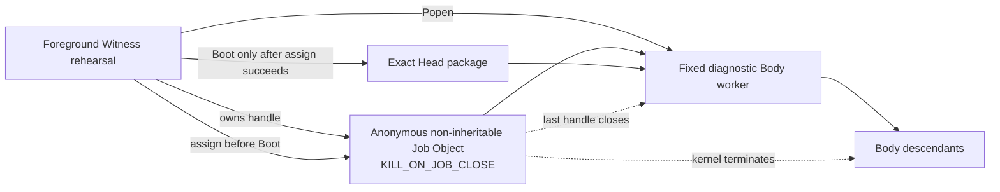

# Windows 原生 Witness 边界

更新时间：2026-07-30  
状态：第一项原生证据已形成；Windows Job Object 已接入 exact-Head diagnostic Body 启动，SCM principal、protected state、peer-authenticated IPC、HostPresence 与安装仍未形成  
对应实现：`src/agentic_evo/windows_native.py`、`src/agentic_evo/body_process.py`

---

## 1. 本文件回答的问题

Pre-Genesis 可移植层已经给出状态、事务、lease、Boot、Surface、Off 与 CLI 协议，但此前所有进程仍依靠 pipe EOF 和合作式退出清理。

本轮开始兑现操作系统不变量：

> Windows 能否在不解释 Body 内部结构的情况下，以内核拥有的进程容器围栏当前 Body 及其后代，使 Witness 退出或显式关闭该容器时，后代不能继续作为残留活体运行？

答案现在是部分肯定：Job Object 的进程树围栏已形成真实 Windows 证据；完整 Windows Witness 仍是合取命题，不能因其中一项成立而整体升级。

---

## 2. 完整 Windows 合同

令：

- \(W_{SCM}\)：SCM 管理的 restricted service-SID Witness；
- \(S_{ACL}\)：service-owned `ProgramData` trusted state；
- \(P_{pub}\)：显式 DACL、拒绝远程连接并认证宿主 SID 的公共 named pipe；
- \(P_{lin}\)：绑定独立 Body principal 与当前 lease 的私有 lineage channel；
- \(F_{job}\)：Job Object process-tree fencing；
- \(H_{presence}\)：普通 Surface 不能模拟的宿主 On / Off 在场通路；
- \(R_{install}\)：可逆安装与卸载，且安装不自动 Genesis。

\[
\boxed{
NativeReady_{Win}
=
W_{SCM}
\land S_{ACL}
\land P_{pub}
\land P_{lin}
\land F_{job}
\land H_{presence}
\land R_{install}
}
\]

当前只成立：

\[
\boxed{
F_{job}^{diagnostic}=true
}
\]

并且：

\[
\boxed{
F_{job}^{diagnostic}
\not\Rightarrow
NativeReady_{Win}
}
\]

---

## 3. 当前 Job Object 关系



启动顺序为：

```text
Create anonymous Job
→ set KILL_ON_JOB_CLOSE
→ spawn fixed diagnostic worker
→ assign worker PID to Job
→ assignment succeeded
→ send exact-Head Boot envelope
→ validate ReadyEcho
```

若 `AssignProcessToJobObject` 失败：

```text
no Boot
→ terminate worker
→ close logical lease
→ close Job handle
→ fail closed
```

---

## 4. 内核因果

当前 Job 不允许 breakaway，也不把 Job handle 继承给 Body。令 \(h_J\) 为 Witness 持有的最后一个 Job handle：

\[
\boxed{
Close(h_J)
\land KILL\_ON\_JOB\_CLOSE
\Rightarrow
\forall p\in ProcessTree(J),\ Terminated(p)
}
\]

该命题由真实父进程加真实孙进程验证，不以现有 `body_worker` 读到 stdin EOF 后自行退出作为替代证据：

```text
parent waits for gate
→ assign parent to Job
→ release gate
→ parent spawns sleeping child
→ both confirmed alive
→ close Job
→ parent terminated
→ child terminated
```

因此证据能够归因到 Job Object，而不是合作式 worker 逻辑。

---

## 5. 接入现有 Body 生命周期

`SpawnedBodyProcess` 持有 Job wrapper。以下路径最终都会关闭 Job：

1. 正常 `body.close()`；
2. Body worker 自行退出；
3. worker crash；
4. Boot / ReadyEcho 失败；
5. Job assignment 失败；
6. Witness 进程异常退出时由 Windows 关闭其非继承 Job handle。

`describe()` 现在公开：

```json
{"process_fencing":"windows_job_object_kill_on_close"}
```

这是运行事实，不是 provenance。Body 的来源仍是：

```text
subprocess_rehearsal
```

它尚不能派生 `agent_self_authored`。

---

## 6. 当前验证

当前自动化证据包括：

1. Job 关闭前父进程与孙进程都仍存活；
2. 关闭最后 Job handle 后两者均在 deadline 内终止；
3. exact-Head Body 启动公开 `windows_job_object_kill_on_close`；
4. Job assignment 失败时没有发送 Boot；
5. 失败启动关闭 Job 与 lease，同一 Head 随后仍可正常重启；
6. 全仓 93 项测试以 `ResourceWarning` 作为错误通过。

本轮不依赖 pywin32 或其他第三方包；实现只使用 Python 标准库 `ctypes` 与 Windows Kernel32。

---

## 7. 严格证明上限

当前允许声称：

> 在这台 Windows 测试主机上，现有 fixed diagnostic Body worker 在接收 exact Head 前已加入启用 `KILL_ON_JOB_CLOSE` 的 Job；最后 Job handle 关闭会终止其进程树。

当前仍不允许声称：

- Witness 已由 SCM 监督；
- Witness 已拥有 restricted service SID；
- Body 已运行在区别于 Witness 和宿主的 restricted token / SID；
- `ProgramData` trusted state 已由 service-SID ACL 保护；
- public named pipe 已设置显式 DACL、拒绝 remote client 或核验 peer SID；
- private lineage channel 已认证 Body principal；
- 用户 SID 等于 HostPresence；
- Off 已通过独立 HostPresence；
- 安装与卸载已经演练；
- Windows native security 整体已验证；
- macOS / Linux 已实现等价 fencing；
- 正式 Genesis 或自主进化已经开始。

另一个精确边界是：当前固定 diagnostic worker 会先启动 Python 与受控模块，再由父进程完成 Job assignment；它在 assignment 前拿不到 Head，也不会执行 Body activation。未来一旦 launcher 在启动早期包含 Body 可控代码，必须改成 suspended spawn，先加入 Job 再恢复执行。

---

## 8. 下一项

Job Object 只解决“旧身体怎样被内核终止”，不解决“谁可以连接 Witness”。

下一项选择无需安装服务即可产生的第二条 Windows 原生证据：

> 用显式 DACL、`PIPE_REJECT_REMOTE_CLIENTS`、client PID 与 impersonated `TokenUser` 建立 foreground native public named-pipe boundary，并让现有 public Surface allowlist 通过该边界；仍不把同用户 SID 冒充 HostPresence 或 Body lineage authority。

完成该项后，再进入 distinct restricted Body token 与私有 lineage handle；SCM、protected state 与可逆安装最后组合验收。
