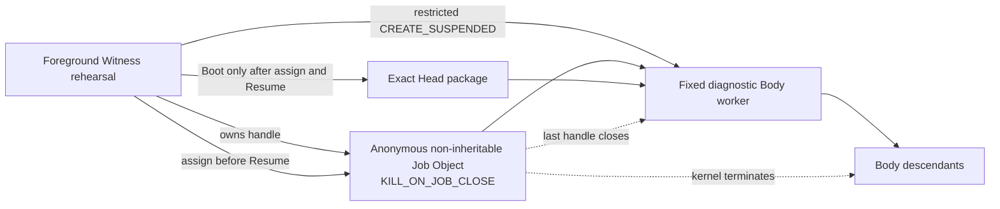
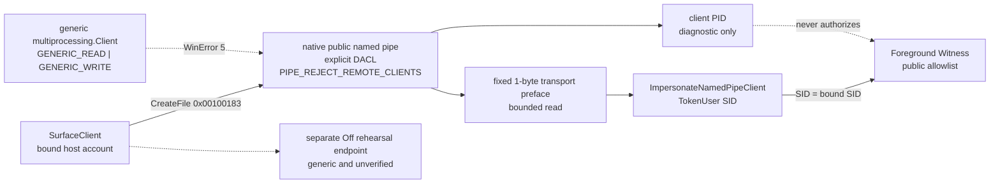

# Windows 原生 Witness 边界

更新时间：2026-07-30  
状态：四项 foreground 局部原生证据已形成：Job Object、认证 public named pipe、restricted Low-Integrity suspended Body、explicit inherited private lineage transport rehearsal；SCM principal、protected state、distinct Body principal、HostPresence 与安装仍未形成
对应实现：`src/agentic_evo/windows_native.py`、`src/agentic_evo/body_process.py`、`src/agentic_evo/windows_pipe.py`、`src/agentic_evo/ipc.py`、`src/agentic_evo/service.py`

---

## 1. 本文件回答的问题

Pre-Genesis 可移植层已经给出状态、事务、lease、Boot、Surface、Off 与 CLI 协议，但此前所有进程仍依靠 pipe EOF 和合作式退出清理。

本轮及其后续切片已经兑现四个局部操作系统不变量：

1. Windows 能否在不解释 Body 内部结构的情况下，以内核拥有的进程容器围栏当前 Body 及其后代？
2. public Surface 能否只以最小访问权进入本机管道，并由服务端从操作系统 token 识别 peer，而不是相信请求自行声明身份？
3. Body 能否以 restricted Low-Integrity token suspended-spawn，并在 Resume 前完成 Job 与显式继承句柄交接？
4. `prepare / advance` 是否真实穿过 Body 持有的私有匿名管道，而不是由 public Surface 或父进程普通调用冒充？

答案现在都是部分肯定。restricted token 与私有 transport 仍处在 foreground 同用户权限域，不构成安装态不可绕过的 principal authentication；完整 Windows Witness 仍是合取命题，不能因四个局部事实成立而整体升级。

---

## 2. 完整 Windows 合同

令：

- \(W_{SCM}\)：SCM 管理的 restricted service-SID Witness；
- \(S_{ACL}\)：service-owned `ProgramData` trusted state；
- \(P_{pub}\)：显式 DACL、拒绝远程连接并认证宿主 SID 的公共 named pipe；
- \(P_{lin}\)：绑定独立 Body principal 与当前 lease 的私有 lineage channel；
- \(R_B\)：区别于 Witness 与宿主 Surface 的受限 Body principal；
- \(F_{job}\)：Job Object process-tree fencing；
- \(H_{presence}\)：普通 Surface 不能模拟的宿主 On / Off 在场通路；
- \(R_{install}\)：可逆安装与卸载，且安装不自动 Genesis。

\[
\boxed{
NativeReady_{Win}
=
W_{SCM}
\land S_{ACL}
\land P_{pub}
\land P_{lin}
\land F_{job}
\land H_{presence}
\land R_{install}
}
\]

当前成立：

\[
\boxed{
F_{job}^{diagnostic}
\land
P_{pub}^{foreground}
\land
R_B^{foreground}
\land
P_{lin}^{transport\ rehearsal}
=true
}
\]

其中：

\[
\boxed{
P_{pub}^{foreground}
=
DACL_{min}
\land LocalOnly
\land ReadBeforeImpersonate
\land TokenUser(peer)=SID_{bound}
\land Allowlist_{public}
}
\]

但仍然：

\[
\boxed{
F_{job}^{diagnostic}
\land P_{pub}^{foreground}
\land R_B^{foreground}
\land P_{lin}^{transport\ rehearsal}
\not\Rightarrow
NativeReady_{Win}
}
\]

---

## 3. 当前四个局部原生关系

### 3.1 Job Object



启动顺序为：

```text
Create anonymous Job
→ set KILL_ON_JOB_CLOSE
→ create restricted Low-Integrity token
→ create child suspended with explicit handle list
→ assign child process handle to Job
→ assignment succeeded
→ close parent copies of child-side handles
→ resume child
→ child seals inherited handles
→ send exact-Head Boot envelope
→ validate ReadyEcho
```

若 `AssignProcessToJobObject` 失败：

```text
no Boot
→ terminate worker
→ close logical lease
→ close Job handle
→ fail closed
```

### 3.2 public Surface named pipe



客户端最小访问掩码为：

\[
\boxed{
Access_{Surface}=0x00100183
}
\]

它只包含同步、读写数据与读写属性所需权限，不包含与 `FILE_CREATE_PIPE_INSTANCE` 共用的 `0x00000004`。标准库 generic client 请求的权限更宽，因此被 DACL 以 WinError 5 拒绝；不能为了保留并发而把创建 server instance 的能力交给同一用户 SID。

Windows 只有在服务端从管道读到消息后，`ImpersonateNamedPipeClient` 才有可模拟的客户端安全上下文。因此 native client 在应用 frame 之前发送固定 1-byte transport preface：

```text
CreateFile with minimal access
→ write fixed transport preface
→ server bounded read
→ impersonate last-read client
→ OpenThreadToken(TokenUser)
→ compare SID with bound SID
→ only then expose the existing public frame protocol
```

这不是第二套应用协议。它只是建立 Win32 模拟因果所需的传输前导。服务端对无前导、超长前导、认证前断连设置 deadline 并丢弃该实例；`close()` 也会中断活动中的 `accept()`，不得在安全描述符释放后继续接纳或重建。

当前 foreground Witness 与宿主客户端使用同一账户 SID。为避免同时把 `FILE_CREATE_PIPE_INSTANCE` 交给任意同账户客户端，Windows public Surface 在本阶段串行处理连接：

\[
\boxed{
SameSID_{server,client}
\land \neg Grant(CreatePipeInstance,client)
\Rightarrow SingleInstance_{foreground}
}
\]

已认证但不发送应用 frame 的客户端最多占用现有 `PUBLIC_IO_TIMEOUT_SECONDS` 窗口；真正并发要等 Witness 获得区别于宿主的受限 principal，届时只向 server principal 授予创建后续 instance 的权限。

### 3.3 restricted Body 与 private lineage transport

后续切片已经把 fixed Body 改为 restricted Low-Integrity suspended child，并只向它显式继承一对匿名管道 handle。Body 在 Boot 前取消这两个 handle 的继承性；父端的 Boot、command、response 与 stop 写入全部有 deadline。

真实谱系往返为：

```text
host rehearsal command
→ restricted Body
→ Body lineage_request
→ CurrentBodySession / trusted transaction
→ authoritative lineage_response
→ Body exact result projection
→ host
```

严格序号、boot session、same-lease candidate 与 authoritative result binding 防止 replay、伪造 result 和 claimed authorship。详细公式、关系图、失败三态与攻击证据见[《受限 Body 与私有谱系能力演练》](受限Body与私有谱系能力演练.md)。

---

## 4. 内核因果

当前 Job 不允许 breakaway，也不把 Job handle 继承给 Body。令 \(h_J\) 为 Witness 持有的最后一个 Job handle：

\[
\boxed{
Close(h_J)
\land KILL\_ON\_JOB\_CLOSE
\Rightarrow
\forall p\in ProcessTree(J),\ Terminated(p)
}
\]

该命题由真实父进程加真实孙进程验证，不以现有 `body_worker` 读到 stdin EOF 后自行退出作为替代证据：

```text
parent waits for gate
→ assign parent to Job
→ release gate
→ parent spawns sleeping child
→ both confirmed alive
→ close Job
→ parent terminated
→ child terminated
```

因此证据能够归因到 Job Object，而不是合作式 worker 逻辑。

---

## 5. 接入现有 Body 生命周期

`SpawnedBodyProcess` 持有 Job wrapper。以下路径最终都会关闭 Job：

1. 正常 `body.close()`；
2. Body worker 自行退出；
3. worker crash；
4. Boot / ReadyEcho 失败；
5. Job assignment 失败；
6. Witness 进程异常退出时由 Windows 关闭其非继承 Job handle。

`describe()` 现在公开：

```json
{"process_fencing":"windows_job_object_kill_on_close"}
```

这是运行事实，不是 provenance。Body 的来源仍是：

```text
subprocess_rehearsal
```

它尚不能派生 `agent_self_authored`。

---

## 6. 当前验证

当前自动化证据包括：

1. Job 关闭前父进程与孙进程都仍存活；
2. 关闭最后 Job handle 后两者均在 deadline 内终止；
3. exact-Head Body 启动公开 `windows_job_object_kill_on_close`；
4. Job assignment 失败时没有发送 Boot；
5. 失败启动关闭 Job 与 lease，同一 Head 随后仍可正常重启；
6. 独立 client process 通过 native pipe 往返，服务端观测的 PID 与 SID 均匹配；
7. generic `multiprocessing.Client` 因过宽访问掩码得到 WinError 5；
8. 认证前断连、无前导超时、超长前导均被丢弃，listener 随后仍能接纳合法客户端；
9. 对不存在 pipe 的 client timeout 兑现 deadline，而不是立即以 WinError 2 返回；
10. `close()` 会中断活动 `accept()`，不会在释放安全描述符后继续接纳；
11. CLI / Codex Surface 的真实 public 请求通过 native pipe，重复请求与独立 Off rehearsal 仍可工作；
12. restricted child 的实际 token 为 restricted、Integrity RID 为 4096，权限至多保留 `SeChangeNotifyPrivilege`；
13. child suspended handoff、explicit inherited handle list、Job-before-Resume 与 child-side seal 成立；
14. Body 发起的 prepare→advance 私有往返、same-lease candidate、严格序号与 authoritative result binding 成立；
15. Boot / command / response / stop 写入都有 deadline，写阻塞先 kill child 再解锁，partial writes 被完整补写；
16. 全仓 118 项测试以 `ResourceWarning` 作为错误通过。

本轮不依赖 pywin32 或其他第三方包；实现只使用 Python 标准库、`ctypes` 与 Windows Kernel32 / Advapi32。

---

## 7. 严格证明上限

当前允许声称：

> 在这台 Windows 测试主机上，现有 fixed diagnostic Body worker 在接收 exact Head 前已加入启用 `KILL_ON_JOB_CLOSE` 的 Job；最后 Job handle 关闭会终止其进程树。

以及：

> 在 foreground Witness rehearsal 中，public Surface 使用显式 DACL、`PIPE_REJECT_REMOTE_CLIENTS` 与最小 client access 的 native named pipe；服务端在读取有界传输前导后以 impersonated `TokenUser` 核对同账户 SID，generic client 无法以过宽权限连接。

以及：

> Windows foreground Witness 能 suspended-spawn restricted Low-Integrity Body，在 Resume 前完成 Job 与显式私有 handles 的交接；Body 发起的严格序号谱系请求真实穿过匿名管道，host 只接受 authoritative Witness response 的精确投影。

当前仍不允许声称：

- Witness 已由 SCM 监督；
- Witness 已拥有 restricted service SID；
- Body 已成为区别于 Witness 和宿主、不可被同账户 foreground 进程冒充的独立 principal；当前 child 虽有 restricted Low-Integrity token，但仍处于同一用户权限域；
- `ProgramData` trusted state 已由 service-SID ACL 保护；
- foreground 同账户 SID 证明了用户本人在场；
- client PID 是授权依据；它目前只是服务端观测到的诊断事实；
- public Surface 认证等于 private Body lineage 认证；
- 当前串行 pipe 已证明未来独立 service principal 下的并发模型；
- private lineage transport rehearsal 已升级为安装态、不可复制的 Body principal authentication；
- Off 已通过独立 HostPresence；
- 安装与卸载已经演练；
- Windows native security 整体已验证；
- macOS / Linux 已实现等价 fencing；
- 正式 Genesis 或自主进化已经开始。

另一个精确边界是：当前 launcher 已经改成 suspended spawn，先加入 Job、关闭父端 child-side handle 副本，再恢复 child；Body 在 Boot 前 seal 私有 handles。该顺序已成立，但 foreground 同账户宿主仍可能修改 launcher、代码和未受保护的 state，因此不能把启动顺序单独写成安装态权限隔离。

---

## 8. 下一项

Job Object、foreground public pipe、restricted suspended Body 与 private lineage transport rehearsal 已完成当前局部切片。继续在 foreground 同用户权限域增加字段，不能关闭“宿主进程仍可改代码、状态或句柄”的证明缺口。

下一项是：

> 让 Witness 进入 SCM 管理的独立 service principal，把 trusted state/key 放入 service-owned ACL 边界，再由该 service 创建 restricted Body；随后以临时安装、同账户攻击、崩溃恢复与卸载测试证明 foreground Surface 不能改写 Witness、状态或 Body capability。

该项继续复用已经冻结的 token、匿名 pipe、显式 handle inheritance 与 lineage 协议，不预先建通用权限 DSL。`HostPresence`、activation / probation 与正式 Genesis 仍是后续独立验收项。
