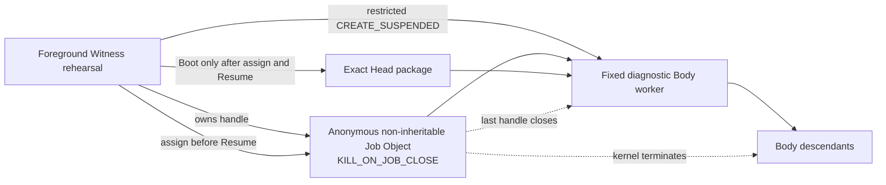
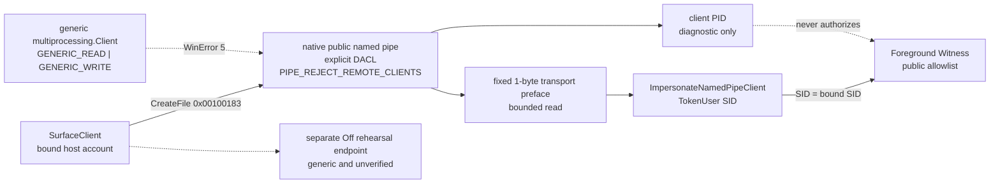

# Windows 原生 Witness 边界

更新时间：2026-08-04
状态：四项 foreground 局部原生证据、内部 supervisor-stop、SCM-only probe bundle，以及一次无启动、无重启、零持久残留的 UAC 配置探针已形成；有界无 UAC 的独立 verifier + real-attacker harness 与冻结 v1/v2 corpus/CLI regression 已完成；Gate B 原生安全 / 特权 service 证明尚未建立，`native_security_verified=false`、`ready_to_install=false`
对应实现：`src/agentic_evo/windows_native.py`、`src/agentic_evo/body_process.py`、`src/agentic_evo/windows_pipe.py`、`src/agentic_evo/ipc.py`、`src/agentic_evo/service.py`、`src/agentic_evo/windows_gate_a.py`、`src/agentic_evo/native/AgenticEvo.ScmProbe.cs`、`tools/windows-gate-b-experiment.ps1`、`tests/test_windows_gate_b.py`

---

## 1. 本文件回答的问题

Pre-Genesis 可移植层已经给出状态、事务、lease、Boot、Surface、Off 与 CLI 协议，但此前所有进程仍依靠 pipe EOF 和合作式退出清理。

本轮及其后续切片已经兑现四个局部操作系统不变量：

1. Windows 能否在不解释 Body 内部结构的情况下，以内核拥有的进程容器围栏当前 Body 及其后代？
2. public Surface 能否只以最小访问权进入本机管道，并由服务端从操作系统 token 识别 peer，而不是相信请求自行声明身份？
3. Body 能否以 restricted Low-Integrity token suspended-spawn，并在 Resume 前完成 Job 与显式继承句柄交接？
4. `prepare / advance` 是否真实穿过 Body 持有的私有匿名管道，而不是由 public Surface 或父进程普通调用冒充？

答案现在都是部分肯定。restricted token 与私有 transport 仍处在 foreground 同用户权限域，不构成安装态不可绕过的 principal authentication；完整 Windows Witness 仍是合取命题，不能因四个局部事实成立而整体升级。

---

## 2. 完整 Windows 合同

令：

- \(W_{SCM}\)：SCM 管理的 restricted service-SID Witness；
- \(S_{ACL}\)：service-owned `ProgramData` trusted state；
- \(P_{pub}\)：显式 DACL、拒绝远程连接并认证宿主 SID 的公共 named pipe；
- \(P_{lin}\)：绑定独立 Body principal 与当前 lease 的私有 lineage channel；
- \(R_B\)：区别于 Witness 与宿主 Surface 的受限 Body principal；
- \(F_{job}\)：Job Object process-tree fencing；
- \(H_{presence}\)：普通 Surface 不能模拟的宿主 On / Off 在场通路；
- \(R_{install}\)：可逆安装与卸载，且安装不自动 Genesis。

\[
\boxed{
NativeReady_{Win}
=
W_{SCM}
\land S_{ACL}
\land P_{pub}
\land P_{lin}
\land F_{job}
\land H_{presence}
\land R_{install}
}
\]

当前成立：

\[
\boxed{
F_{job}^{diagnostic}
\land
P_{pub}^{foreground}
\land
R_B^{foreground}
\land
P_{lin}^{transport\ rehearsal}
=true
}
\]

其中：

\[
\boxed{
P_{pub}^{foreground}
=
DACL_{min}
\land LocalOnly
\land ReadBeforeImpersonate
\land TokenUser(peer)=SID_{bound}
\land Allowlist_{public}
}
\]

但仍然：

\[
\boxed{
F_{job}^{diagnostic}
\land P_{pub}^{foreground}
\land R_B^{foreground}
\land P_{lin}^{transport\ rehearsal}
\not\Rightarrow
NativeReady_{Win}
}
\]

---

## 3. 当前四个局部原生关系

### 3.1 Job Object



启动顺序为：

```text
Create anonymous Job
→ set KILL_ON_JOB_CLOSE
→ create restricted Low-Integrity token
→ create child suspended with explicit handle list
→ assign child process handle to Job
→ assignment succeeded
→ close parent copies of child-side handles
→ resume child
→ child seals inherited handles
→ send exact-Head Boot envelope
→ validate ReadyEcho
```

若 `AssignProcessToJobObject` 失败：

```text
no Boot
→ terminate worker
→ close logical lease
→ close Job handle
→ fail closed
```

### 3.2 public Surface named pipe



客户端最小访问掩码为：

\[
\boxed{
Access_{Surface}=0x00100183
}
\]

它只包含同步、读写数据与读写属性所需权限，不包含与 `FILE_CREATE_PIPE_INSTANCE` 共用的 `0x00000004`。标准库 generic client 请求的权限更宽，因此被 DACL 以 WinError 5 拒绝；不能为了保留并发而把创建 server instance 的能力交给同一用户 SID。

Windows 只有在服务端从管道读到消息后，`ImpersonateNamedPipeClient` 才有可模拟的客户端安全上下文。因此 native client 在应用 frame 之前发送固定 1-byte transport preface：

```text
CreateFile with minimal access
→ write fixed transport preface
→ server bounded read
→ impersonate last-read client
→ OpenThreadToken(TokenUser)
→ compare SID with bound SID
→ only then expose the existing public frame protocol
```

这不是第二套应用协议。它只是建立 Win32 模拟因果所需的传输前导。服务端对无前导、超长前导、认证前断连设置 deadline 并丢弃该实例；`close()` 也会中断活动中的 `accept()`，不得在安全描述符释放后继续接纳或重建。

当前 foreground Witness 与宿主客户端使用同一账户 SID。为避免同时把 `FILE_CREATE_PIPE_INSTANCE` 交给任意同账户客户端，Windows public Surface 在本阶段串行处理连接：

\[
\boxed{
SameSID_{server,client}
\land \neg Grant(CreatePipeInstance,client)
\Rightarrow SingleInstance_{foreground}
}
\]

已认证但不发送应用 frame 的客户端最多占用现有 `PUBLIC_IO_TIMEOUT_SECONDS` 窗口；真正并发要等 Witness 获得区别于宿主的受限 principal，届时只向 server principal 授予创建后续 instance 的权限。

### 3.3 restricted Body 与 private lineage transport

后续切片已经把 fixed Body 改为 restricted Low-Integrity suspended child，并只向它显式继承一对匿名管道 handle。Body 在 Boot 前取消这两个 handle 的继承性；父端的 Boot、command、response 与 stop 写入全部有 deadline。

真实谱系往返为：

```text
host rehearsal command
→ restricted Body
→ Body lineage_request
→ CurrentBodySession / trusted transaction
→ authoritative lineage_response
→ Body exact result projection
→ host
```

严格序号、boot session、same-lease candidate 与 authoritative result binding 防止 replay、伪造 result 和 claimed authorship。详细公式、关系图、失败三态与攻击证据见[《受限 Body 与私有谱系能力演练》](受限Body与私有谱系能力演练.md)。

---

## 4. 内核因果

当前 Job 不允许 breakaway，也不把 Job handle 继承给 Body。令 \(h_J\) 为 Witness 持有的最后一个 Job handle：

\[
\boxed{
Close(h_J)
\land KILL\_ON\_JOB\_CLOSE
\Rightarrow
\forall p\in ProcessTree(J),\ Terminated(p)
}
\]

该命题由真实父进程加真实孙进程验证，不以现有 `body_worker` 读到 stdin EOF 后自行退出作为替代证据：

```text
parent waits for gate
→ assign parent to Job
→ release gate
→ parent spawns sleeping child
→ both confirmed alive
→ close Job
→ parent terminated
→ child terminated
```

因此证据能够归因到 Job Object，而不是合作式 worker 逻辑。

---

## 5. 接入现有 Body 生命周期

`SpawnedBodyProcess` 持有 Job wrapper。以下路径最终都会关闭 Job：

1. 正常 `body.close()`；
2. Body worker 自行退出；
3. worker crash；
4. Boot / ReadyEcho 失败；
5. Job assignment 失败；
6. Witness 进程异常退出时由 Windows 关闭其非继承 Job handle。

`describe()` 现在公开：

```json
{"process_fencing":"windows_job_object_kill_on_close"}
```

这是运行事实，不是 provenance。Body 的来源仍是：

```text
subprocess_rehearsal
```

它尚不能派生 `agent_self_authored`。

---

## 6. 当前验证

当前自动化证据包括：

1. Job 关闭前父进程与孙进程都仍存活；
2. 关闭最后 Job handle 后两者均在 deadline 内终止；
3. exact-Head Body 启动公开 `windows_job_object_kill_on_close`；
4. Job assignment 失败时没有发送 Boot；
5. 失败启动关闭 Job 与 lease，同一 Head 随后仍可正常重启；
6. 独立 client process 通过 native pipe 往返，服务端观测的 PID 与 SID 均匹配；
7. generic `multiprocessing.Client` 因过宽访问掩码得到 WinError 5；
8. 认证前断连、无前导超时、超长前导均被丢弃，listener 随后仍能接纳合法客户端；
9. 对不存在 pipe 的 client timeout 兑现 deadline，而不是立即以 WinError 2 返回；
10. `close()` 会中断活动 `accept()`，不会在释放安全描述符后继续接纳；
11. CLI / Codex Surface 的真实 public 请求通过 native pipe，重复请求与独立 Off rehearsal 仍可工作；
12. restricted child 的实际 token 为 restricted、Integrity RID 为 4096，权限至多保留 `SeChangeNotifyPrivilege`；
13. child suspended handoff、explicit inherited handle list、Job-before-Resume 与 child-side seal 成立；
14. Body 发起的 prepare→advance 私有往返、same-lease candidate、严格序号与 authoritative result binding 成立；
15. Boot / command / response / stop 写入都有 deadline，写阻塞先 kill child 再解锁，partial writes 被完整补写；
16. 内部 `request_stop()` 在 lifecycle lock 上建立 dispatch cutoff；已经连接但尚未 admission 的 public/control 请求不能在 stop 后追加 evidence 或改变 Authority；
17. 屏障测试证明 cutoff 前已 admission 的变更可以恰好提交一次，而 `request_stop()` 必须等该 dispatch 归静后才返回；
18. 每条已接受 transport 只有一个 raw-close owner；stop、worker cleanup 与 control receive deadline 竞争关闭时不会再次关闭同一底层句柄；
19. Windows 与 WSL Ubuntu 均验证 accept 唤醒、active connection 关闭、Body/lease/singleton 回收及同一 home 重启；macOS 尚未实机复验；
20. 已接受的 HEAD `552dbd8` 在 Windows 上由捆绑 Python 执行完整 `unittest discover -s tests -v`：共运行 212 项测试，进程显式退出码为 0，末尾结果为 `OK`；这只证明当前代码回归为绿，不建立 Gate B，也不改变 A07 的 `same_principal_harness` 上限。

本轮不依赖 pywin32 或其他第三方包；实现只使用 Python 标准库、`ctypes` 与 Windows Kernel32 / Advapi32。

---

## 7. 严格证明上限

当前允许声称：

> 在这台 Windows 测试主机上，现有 fixed diagnostic Body worker 在接收 exact Head 前已加入启用 `KILL_ON_JOB_CLOSE` 的 Job；最后 Job handle 关闭会终止其进程树。

以及：

> 在 foreground Witness rehearsal 中，public Surface 使用显式 DACL、`PIPE_REJECT_REMOTE_CLIENTS` 与最小 client access 的 native named pipe；服务端在读取有界传输前导后以 impersonated `TokenUser` 核对同账户 SID，generic client 无法以过宽权限连接。

以及：

> Windows foreground Witness 能 suspended-spawn restricted Low-Integrity Body，在 Resume 前完成 Job 与显式私有 handles 的交接；Body 发起的严格序号谱系请求真实穿过匿名管道，host 只接受 authoritative Witness response 的精确投影。

以及：

> 内部 supervisor stop 能结束当前 foreground Witness/Body 生命周期并释放同一 home 的 singleton，而不把进程停止改写成 Host Off。stop 路径自身不创建 Root、Head、Authority 或 evidence 事务；cutoff 前已经 admission 的合法请求仍可在退出前提交。

当前仍不允许声称：

- Witness 已由 SCM 监督；
- Witness 已拥有 restricted service SID；
- Body 已成为区别于 Witness 和宿主、不可被同账户 foreground 进程冒充的独立 principal；当前 child 虽有 restricted Low-Integrity token，但仍处于同一用户权限域；
- `ProgramData` trusted state 已由 service-SID ACL 保护；
- foreground 同账户 SID 证明了用户本人在场；
- client PID 是授权依据；它目前只是服务端观测到的诊断事实；
- public Surface 认证等于 private Body lineage 认证；
- 当前串行 pipe 已证明未来独立 service principal 下的并发模型；
- private lineage transport rehearsal 已升级为安装态、不可复制的 Body principal authentication；
- Off 已通过独立 HostPresence；
- 安装与卸载已经演练；
- Windows native security 整体已验证；
- macOS / Linux 已实现等价 fencing；
- 正式 Genesis 或自主进化已经开始。

另一个精确边界是：当前 launcher 已经改成 suspended spawn，先加入 Job、关闭父端 child-side handle 副本，再恢复 child；Body 在 Boot 前 seal 私有 handles。该顺序已成立，但 foreground 同账户宿主仍可能修改 launcher、代码和未受保护的 state，因此不能把启动顺序单独写成安装态权限隔离。

---

## 8. 下一项

Job Object、foreground public pipe、restricted suspended Body 与 private lineage transport rehearsal 已完成当前局部切片。继续在 foreground 同用户权限域增加字段，不能关闭“宿主进程仍可改代码、状态或句柄”的证明缺口。

内部 `request_stop()` 已经补上未来 SCM control handler 所需的最小生命周期关节。令 \(\tau_s\) 为它在 lifecycle lock 上建立 dispatch cutoff 的线性化点：

\[
\boxed{
\tau(Admitted(r))\ge\tau_s
\Rightarrow Reject(r)
}
\]

\[
\boxed{
Return(request\_stop)
\Rightarrow
Quiescent(Admitted_{<\tau_s})
\land NoDispatch_{\ge\tau_s}
\land Closed(RegisteredActiveTransports_{\tau_s})
}
\]

`request_stop()` 返回不等于完整 service loop 已退出。Body / lease / worker / singleton 的回收发生在 `serve_forever()` 的 `finally` 与外层 service lock 退出：

\[
\boxed{
ServiceStopComplete
\equiv Exited(serve\_forever)
\Rightarrow
Return(request\_stop)
\land Joined(Workers)
\land Exited(AcceptLoops)
\land Closed(AllAcceptedTransports)
\land Retire(Body,Lease)
\land Release(Singleton)
}
\]

令 \(X=(Root,Head,Authority,Evidence)\)。stop 路径自身不创建 trusted-state transaction，因此：

\[
\boxed{
\Delta X_{stop}=\varnothing
}
\]

但这不推出无条件的 \(X_{after}=X_{before}\)。先定义 cutoff 时仍未归静的请求：

\[
\boxed{
Pending_{\tau_s}
=
\{r\mid Admitted(r)<\tau_s
\land \neg Completed(r,\tau_s^-)\}
}
\]

准确的状态关系只加入这些 pending 请求在 drain 期间产生的提交：

\[
\boxed{
X_{after}
=
X_{\tau_s^-}
\oplus
\Delta X_{Committed_{>\tau_s}(Pending_{\tau_s})}
}
\]

只有 cutoff 时 \(Pending_{\tau_s}\) 中没有 mutating dispatch，第二项才为空。当前屏障测试已覆盖“变更 dispatch 先 admission → stop 等待 → 该请求恰好提交一次 → stop 返回”。由于 active transport 在 dispatch 归静前已关闭，调用方可能只看到 EOF 而不知道事务是否已提交；该结果必须视为 caller-visible `OutcomeUnknown` 并从可信状态对账，不能把断连解释成未提交。`request_stop` 没有被加入 public 或 Off control operation；service stop 仍不等于 Host Off。该关节完成后，下一项才可以准确地定义为：

> 让 Witness 进入 SCM 管理的独立 service principal，把 trusted state/key 放入 service-owned ACL 边界，再由该 service 创建 restricted Body；随后以临时安装、同账户攻击、崩溃恢复与卸载测试证明 foreground Surface 不能改写 Witness、状态或 Body capability。

该项继续复用已经冻结的 token、匿名 pipe、显式 handle inheritance 与 lineage 协议，不预先建通用权限 DSL。`HostPresence`、activation / probation 与正式 Genesis 仍是后续独立验收项。

### 8.1 两个 Gate

为避免把“代码已经写好”误报为“Windows 安全边界已经成立”，该切片分成两个不可互相替代的 Gate：

```text
Gate A：无 UAC 的实验工件与可逆清理路径就绪
Gate B：UAC 后真实 SCM 安装、token/ACL 攻击、重启与卸载证据成立
```

当前又完成了 Gate A 的第二个关节：系统 `.NET Framework` 编译器从已提交 C# 源构建不依赖用户 Python、checkout 或 `PYTHONPATH` 的 own-process SCM probe；外部 builder 对 source、compiler、artifact 三重 SHA-256 重新绑定，普通控制台启动必须以 `ERROR_FAILED_SERVICE_CONTROLLER_CONNECT (1063)` fail closed；canonical manifest 只渲染 protected artifact/state 目标，不创建它们。bundle 本地 cleanup 只接受 exact 两文件普通目录，并拒绝 junction/reparse point、篡改工件和未声明文件。

令 \(A\) 为 probe artifact，\(M\) 为 manifest，\(V,T,C,H\) 分别为完整独立 verifier、真实 attacker、可执行 Gate B cleanup 与可信 elevated handoff。完整 Gate A 的停止式是：

\[
\boxed{
GateAReady
=
Buildable(A)
\land ExactClosure(A,M)
\land SCMOnlyNegative(A)
\land Complete(V,T,C)
\land TrustedHandoff(H)
\land ZeroPrivilegedEffect
\land ZeroGenesis
}
\]

本轮实际成立的只是：

\[
\boxed{
ScmProbeBundleReady=true
\qquad\land\qquad
GateAReady=false
}
\]

原因不是形式上的“还少几个文件”。独立审查曾发现，早期 stub 只按 receipt 是否存在返回固定结果，属于伪 verifier/attacker；它已被删除。现有有界无 UAC 的独立 verifier + real-attacker harness 已完成，并以冻结 v1/v2 corpus/CLI regression 固化。后续配置探针已经实机执行 config-object exact-target cleanup 与宿主批准摘要的 trusted elevated handoff，但没有运行 service、读取 token 或执行攻击矩阵；因此 \(C\) 只形成 config-only 子证据，U01 仍是 partial，Gate B 原生安全 / 特权 service 证明仍未建立。

2026-07-30 本机保存于 ignored `artifacts/windows-gate-a/` 的可重建 probe 证据为：

```text
source_sha256   = d008db53a4b587949e1ef0916130e7f425a822e882780d38b8514c929f1ebd77
compiler_sha256 = 46809206887326d2d24db1eff1f3064de972c3451abe766b49111450a5e08e00
artifact_sha256 = 2fa4058e74a37ef4d3f378ad7607774dc7ac4de0bcc9f3a3cd3617dbb4e6623b
manifest_sha256 = a4c3e2f87830044312279e657d366640c8ce64628bd4436af142bfd40e7ceb04
```

这些摘要固定的是本次可重建工件，不是签名信任根。同账户进程仍可同时替换用户可写 bundle 与 manifest；提权侧因此必须重新核对宿主明确批准的外部摘要，不能相信 bundle 的自述哈希或同目录 receipt。

2026-07-30，宿主批准了一次严格限域的 UAC 配置探针。普通权限控制器由外部固定摘要的可信 bootstrap 启动；提升进程再次验证同一脚本字节，只导入固定系统 PowerShell 模块，在 protected artifact root 内封闭编译临时目录，并把提升结果经绑定实际提升进程 PID 的单向 named pipe 返回。它创建随机临时 own-process service，写入并回读 restricted service-SID 配置和 protected ACL，然后在同一提升生命周期内删除 service 与两棵临时目录。service 从未启动，系统没有重启，Hook、Genesis 和现有 Runtime 均未触碰。

令 \(Q_C\) 表示这次配置探针：

\[
\boxed{
Q_C
=
PinnedScript
\land TrustedElevationClosure
\land Create(S)
\land QSidType(S)=RESTRICTED
\land ProtectedACLReadback
\land ExactCleanup
\land IndependentZeroResidue
}
\]

本机不可变 receipt 为：

```text
run_id          = d8846efecf8149849f49ea12c2813fe0
script_sha256   = fe79b3730f4f8a893076a20446cac3089a59541923e8ce2ac7c9cf8ef28cb027
artifact_sha256 = 2fa4058e74a37ef4d3f378ad7607774dc7ac4de0bcc9f3a3cd3617dbb4e6623b
result_sha256   = 13629892dc470e2dbb7ee73aa2219c28da25b38673b6a4e801b32e0229ee0e8a
create/sidtype/qsidtype/delete exit = 0/0/0/0
status           = configuration_probe_completed
service_started  = false
reboot_validation = not_performed_service_removed
elevated_cleanup  = complete
independent_cleanup = complete
final_service_query = 1060
matching_gate_b_services = 0
artifact_tree_exists = false
state_tree_exists = false
```

因此当前精确结论是：

```text
scm_probe_bundle_ready = true
gate_a_complete = false
privileged_configuration_probe_executed = true
persistent_installation = false
scm_configuration_observed = true
restricted_configuration_readback = true
service_started = false
service_token_observed = false
state_acl_attacked = false
all_attack_cases = not_run
genesis_requested = false
genesis_count = not_measured
U01 = partial_cleanup_pass_genesis_not_measured
gate_b_outcome = not_established
native_security_verified = false
ready_to_install = false
```

\[
\boxed{
Q_C=true
\not\Rightarrow
GateAReady
\not\Rightarrow
W_{SCM}
\not\Rightarrow
GateB
}
\]

特别保留：

\[
\boxed{
ScmProbeBundleReady
\not\Rightarrow
GateAReady
\not\Rightarrow
W_{SCM}
}
\]

### 8.2 SCM principal 的可证伪验收

令 \(S\) 为随机命名的临时 own-process service，\(W\) 为其 Witness/probe 进程，\(SID_S\) 为 `NT SERVICE\<service-name>` 派生的 per-service SID：

\[
\boxed{
W_{SCM}
=
Running(S)
\land PID_{SCM}(S)=PID(W)
\land ServiceType(S)=SERVICE\_WIN32\_OWN\_PROCESS
}
\]

\[
\boxed{
P_W
=
TokenUser(W)=LocalService
\land SID_S\in EnabledSids(W)
\land SID_S\in RestrictedSids(W)
\land IsTokenRestricted(W)
}
\]

`SERVICE_SID_TYPE_RESTRICTED` 的配置值本身不是运行中 token 证据。[Microsoft 的 `SERVICE_SID_INFO` 说明](https://learn.microsoft.com/en-us/windows/win32/api/winsvc/ns-winsvc-service_sid_info)指出它会把 service SID 加入 restricted SID list，并且 service SID type 的变更在下一次系统启动时生效；完整实验必须完成 system restart 后再读取真实 token，不能把“仅重启 service”当成兑现。如果保留该临时 service 等待重启，配置写回成功只能记为 `pending_reboot`；本轮已在重启前删除 service，因此精确状态是 `configuration_write_accepted_before_cleanup` 与 `not_performed_service_removed`，不能在未来重启后续验这次对象。重启后新实验的 token 仍未兑现则是 `not_proven`。同样，SCM PID 只在 service 到达稳定 `RUNNING` 后取值；`START_PENDING`/`STOP_PENDING` 不能充当 PID 绑定证据，见 [`SERVICE_STATUS_PROCESS`](https://learn.microsoft.com/en-us/windows/win32/api/winsvc/ns-winsvc-service_status_process)。

### 8.3 protected state 与 protected image

令 \(D\) 为临时 service-owned state root，\(A\) 为 exact service artifact：

\[
\boxed{
S_{ACL}
=
ProtectedDACL(D)
\land Owner(D)\in\{SYSTEM,Administrators\}
\land WriteAllow(D)=\{SYSTEM,SID_S\}
}
\]

\[
\boxed{
S_{isolated}
=
S_{ACL}
\land
CanRW(W,D)
\land Denied(Host,D,\{Read,Write,Delete,Rename,WRITE\_DAC\})
\land Denied(Body,D,\{Read,Write,Delete,Rename,WRITE\_DAC\})
}
\]

\[
\boxed{
I_{protected}
=
ImagePath(S)=A
\land \neg CanWrite(Host,A)
\land Imports(W)\subseteq ProtectedClosure(A)
}
\]

这里故意不从 \(S_{ACL}\) 直接推出 Body 被隔离：ACL 结构只是待核实的对象事实，\(S_{isolated}\) 还要求不同真实 token 的负向攻击与 Witness 正向事务共同成立。实验必须回读实际 DACL、owner 与 `SE_DACL_PROTECTED`，再以不同真实 token 发起文件操作；installer 打印一段 SDDL 不成立。Windows 提供的 `PROTECTED_DACL_SECURITY_INFORMATION` 用于阻断继承，语义见 [Security Information](https://learn.microsoft.com/en-us/windows/win32/secauthz/security-information)。当前 `sys.executable`、源码 checkout 与 `PYTHONPATH` 都在普通用户可写域，不能满足 \(I_{protected}\)，所以把现有 foreground Python 命令注册进 SCM 仍是假完成。

最危险的反例来自 Body。当前 Low-Integrity Body token 从 Witness token 派生；若它仍携带 \(SID_S\)，而 DACL 又允许 \(SID_S\)，那么：

\[
\boxed{
BodyRead(Key)=Allowed
\Rightarrow
WitnessBodySeparation=false
}
\]

Low Integrity 不能被默认解释成“禁止向上读取”。restricted token 的访问需要 enabled SID 与 restricting SID 两次检查都通过，见 [`CreateRestrictedToken`](https://learn.microsoft.com/en-us/windows/win32/api/securitybaseapi/nf-securitybaseapi-createrestrictedtoken)。因此 Gate B 必须真实测试 Body 对 DB/key 的 read、write、delete 与 `WRITE_DAC`；任何一项意外成功都推翻 Body 隔离主张，而不是靠解释升级结论。

### 8.4 最小攻击与恢复矩阵

| ID | 独立动作 | 必须观察到 | 被推翻的主张 |
|---|---|---|---|
| C01 | 外部 verifier 查询 SCM stable status 与进程 token | own-process PID 一致；LocalService 与 restricted service SID 同时成立 | \(W_{SCM}\)、\(P_W\) |
| C02 | 非提权宿主请求 `SERVICE_CHANGE_CONFIG`、DELETE、`WRITE_DAC` | `ACCESS_DENIED` | service object 不可改写 |
| I01 | 宿主替换、截断、rename、delete service artifact/import | 全部拒绝，hash 不变 | \(I_{protected}\) |
| S01 | 宿主 read/write/delete/rename DB、key、WAL、SHM | 全部拒绝，revision/hash 不变 | 宿主与可信状态隔离 |
| S02 | SCM service 执行真实 SQLite transaction/checkpoint | 成功，restart 后可验证 | 合法 writer 可用 |
| S03 | restricted Body read/write/delete/改 ACL | 全部拒绝 | Witness 与 Body 隔离 |
| P01 | 合法 bound-user public client | 只获得 public allowlist | 安装态 Surface 可用 |
| P02 | fake same-name pipe、other user、remote/generic client | fail closed | public server/client 身份边界 |
| L01 | 旧 boot/seq/lease/handle 或复制 private handle | 拒绝，可信状态不变 | 安装态 lineage 因果绑定 |
| R01 | kill/crash/restart service | Body tree 死亡；只恢复 committed state；旧 lease 不复活 | SCM 生命周期边界 |
| R02 | administrator stop service | service 退出；stop 自身无可信状态增量；cutoff 前已 admission 的提交被保留且不重复 | supervisor stop 因果 |
| U01 | stop→delete→cleanup 临时 service | service/object/artifact/state 无残留；Genesis 数仍为 0 | 可逆且不自动出生 |

Microsoft 明确指出 `SERVICE_CHANGE_CONFIG` 可以改变系统实际执行的映像，因此只能授予管理员，见 [Service Security and Access Rights](https://learn.microsoft.com/en-us/windows/win32/services/service-security-and-access-rights)。实验的威胁边界是普通用户权限的 coding agent、Body 与项目代码；不声称抵抗管理员、SYSTEM、内核或离线磁盘篡改。

### 8.5 反伪造规则与本轮停止点

以下非等价关系必须保留：

```text
SCM config says RESTRICTED
≠ running token contains the restricted service SID

SCM status says RUNNING
≠ exact protected artifact is running

installer emits SDDL
≠ target object owns that protected DACL

one ACCESS_DENIED
≠ read/write/delete/rename/WRITE_DAC matrix passed

service self-report
≠ independent verifier evidence
```

创建临时 service 需要管理员权限；Microsoft 的 SCM 权限说明也明确指出，能够 `CreateService` 的 SCM handle 只授予管理员。本轮已用一次宿主批准、外部固定脚本摘要、随机 service name、零 Genesis 的 UAC 配置探针证明 trusted handoff 与 exact cleanup 可以实机闭合；它没有把普通用户 Python 注册为服务，也没有留下可跨重启对象。Windows 权限实验当前可以在这里停下：下一次重新打开必须得到覆盖“保留临时 service + system restart + 独立 verifier/attacker + 完整攻击与卸载矩阵”的新授权。没有该授权时，继续运行同类配置探针不会增加 \(W_{SCM}\) 或 Gate B 证据。

在申请该授权前，仓库只允许生成 `agentic-evo.windows-gate-b-retained-preflight.v1` 预注册计划；它固定一次跨单次重启的临时 service 实验边界，但不创建 service、不触发 UAC、不写入 evidence，也不提升任何 Gate B 结论。

c643c91 将 synthetic Gate B fixture 绑定到专用 test lab/namespace；已接受的 HEAD `552dbd8` 全仓回归前后 3060 reference namespace membership hash 不变。隔离前遗留的 exact orphan `artifacts/labs/3060-computer/windows-gate-b/1ed1e8b16f554059b77ceb99a8b40cd6/` 仍为 `present / removal_not_executed`；`Remove-Item` 被本地命令策略在执行前阻止，删除并未执行。该 orphan 不属于 3060 当前证据。A07 仍仅为 `same_principal_harness`，且本轮未执行 UAC、SCM、restart 或其他 privileged Gate B action。

它只固定未来获授权的 effects/retention；在已单独授权的保留重启实验实际执行并完成独立验证前，当前 ceiling 不高于 `configuration_probe_only` / `partial_cleanup_if_service_lifecycle_occurs`。
