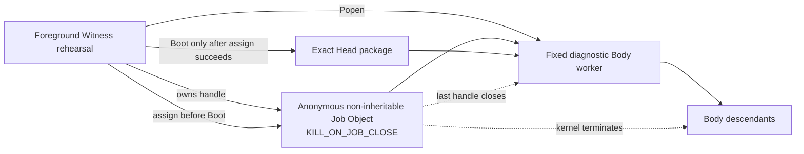
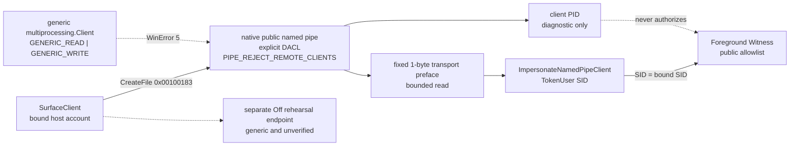

# Windows 原生 Witness 边界

更新时间：2026-07-30  
状态：两项 foreground 原生证据已形成；Windows Job Object 已接入 exact-Head diagnostic Body，public Surface 已接入显式 DACL 与 peer-SID 认证的 native named pipe；SCM principal、protected state、private lineage、HostPresence 与安装仍未形成
对应实现：`src/agentic_evo/windows_native.py`、`src/agentic_evo/body_process.py`、`src/agentic_evo/windows_pipe.py`、`src/agentic_evo/ipc.py`、`src/agentic_evo/service.py`

---

## 1. 本文件回答的问题

Pre-Genesis 可移植层已经给出状态、事务、lease、Boot、Surface、Off 与 CLI 协议，但此前所有进程仍依靠 pipe EOF 和合作式退出清理。

本轮继续兑现两个操作系统不变量：

1. Windows 能否在不解释 Body 内部结构的情况下，以内核拥有的进程容器围栏当前 Body 及其后代？
2. public Surface 能否只以最小访问权进入本机管道，并由服务端从操作系统 token 识别 peer，而不是相信请求自行声明身份？

答案现在都是部分肯定：Job Object 的进程树围栏与 foreground public pipe 的本机账户认证已形成真实 Windows 证据；完整 Windows Witness 仍是合取命题，不能因其中两项成立而整体升级。

---

## 2. 完整 Windows 合同

令：

- \(W_{SCM}\)：SCM 管理的 restricted service-SID Witness；
- \(S_{ACL}\)：service-owned `ProgramData` trusted state；
- \(P_{pub}\)：显式 DACL、拒绝远程连接并认证宿主 SID 的公共 named pipe；
- \(P_{lin}\)：绑定独立 Body principal 与当前 lease 的私有 lineage channel；
- \(F_{job}\)：Job Object process-tree fencing；
- \(H_{presence}\)：普通 Surface 不能模拟的宿主 On / Off 在场通路；
- \(R_{install}\)：可逆安装与卸载，且安装不自动 Genesis。

\[
\boxed{
NativeReady_{Win}
=
W_{SCM}
\land S_{ACL}
\land P_{pub}
\land P_{lin}
\land F_{job}
\land H_{presence}
\land R_{install}
}
\]

当前成立：

\[
\boxed{
F_{job}^{diagnostic}
\land
P_{pub}^{foreground}
=true
}
\]

其中：

\[
\boxed{
P_{pub}^{foreground}
=
DACL_{min}
\land LocalOnly
\land ReadBeforeImpersonate
\land TokenUser(peer)=SID_{bound}
\land Allowlist_{public}
}
\]

但仍然：

\[
\boxed{
\left(
F_{job}^{diagnostic}
\land P_{pub}^{foreground}
\right)
\not\Rightarrow
NativeReady_{Win}
}
\]

---

## 3. 当前两个原生关系

### 3.1 Job Object



启动顺序为：

```text
Create anonymous Job
→ set KILL_ON_JOB_CLOSE
→ spawn fixed diagnostic worker
→ assign Popen's existing process handle to Job
→ assignment succeeded
→ send exact-Head Boot envelope
→ validate ReadyEcho
```

若 `AssignProcessToJobObject` 失败：

```text
no Boot
→ terminate worker
→ close logical lease
→ close Job handle
→ fail closed
```

### 3.2 public Surface named pipe



客户端最小访问掩码为：

\[
\boxed{
Access_{Surface}=0x00100183
}
\]

它只包含同步、读写数据与读写属性所需权限，不包含与 `FILE_CREATE_PIPE_INSTANCE` 共用的 `0x00000004`。标准库 generic client 请求的权限更宽，因此被 DACL 以 WinError 5 拒绝；不能为了保留并发而把创建 server instance 的能力交给同一用户 SID。

Windows 只有在服务端从管道读到消息后，`ImpersonateNamedPipeClient` 才有可模拟的客户端安全上下文。因此 native client 在应用 frame 之前发送固定 1-byte transport preface：

```text
CreateFile with minimal access
→ write fixed transport preface
→ server bounded read
→ impersonate last-read client
→ OpenThreadToken(TokenUser)
→ compare SID with bound SID
→ only then expose the existing public frame protocol
```

这不是第二套应用协议。它只是建立 Win32 模拟因果所需的传输前导。服务端对无前导、超长前导、认证前断连设置 deadline 并丢弃该实例；`close()` 也会中断活动中的 `accept()`，不得在安全描述符释放后继续接纳或重建。

当前 foreground Witness 与宿主客户端使用同一账户 SID。为避免同时把 `FILE_CREATE_PIPE_INSTANCE` 交给任意同账户客户端，Windows public Surface 在本阶段串行处理连接：

\[
\boxed{
SameSID_{server,client}
\land \neg Grant(CreatePipeInstance,client)
\Rightarrow SingleInstance_{foreground}
}
\]

已认证但不发送应用 frame 的客户端最多占用现有 `PUBLIC_IO_TIMEOUT_SECONDS` 窗口；真正并发要等 Witness 获得区别于宿主的受限 principal，届时只向 server principal 授予创建后续 instance 的权限。

---

## 4. 内核因果

当前 Job 不允许 breakaway，也不把 Job handle 继承给 Body。令 \(h_J\) 为 Witness 持有的最后一个 Job handle：

\[
\boxed{
Close(h_J)
\land KILL\_ON\_JOB\_CLOSE
\Rightarrow
\forall p\in ProcessTree(J),\ Terminated(p)
}
\]

该命题由真实父进程加真实孙进程验证，不以现有 `body_worker` 读到 stdin EOF 后自行退出作为替代证据：

```text
parent waits for gate
→ assign parent to Job
→ release gate
→ parent spawns sleeping child
→ both confirmed alive
→ close Job
→ parent terminated
→ child terminated
```

因此证据能够归因到 Job Object，而不是合作式 worker 逻辑。

---

## 5. 接入现有 Body 生命周期

`SpawnedBodyProcess` 持有 Job wrapper。以下路径最终都会关闭 Job：

1. 正常 `body.close()`；
2. Body worker 自行退出；
3. worker crash；
4. Boot / ReadyEcho 失败；
5. Job assignment 失败；
6. Witness 进程异常退出时由 Windows 关闭其非继承 Job handle。

`describe()` 现在公开：

```json
{"process_fencing":"windows_job_object_kill_on_close"}
```

这是运行事实，不是 provenance。Body 的来源仍是：

```text
subprocess_rehearsal
```

它尚不能派生 `agent_self_authored`。

---

## 6. 当前验证

当前自动化证据包括：

1. Job 关闭前父进程与孙进程都仍存活；
2. 关闭最后 Job handle 后两者均在 deadline 内终止；
3. exact-Head Body 启动公开 `windows_job_object_kill_on_close`；
4. Job assignment 失败时没有发送 Boot；
5. 失败启动关闭 Job 与 lease，同一 Head 随后仍可正常重启；
6. 独立 client process 通过 native pipe 往返，服务端观测的 PID 与 SID 均匹配；
7. generic `multiprocessing.Client` 因过宽访问掩码得到 WinError 5；
8. 认证前断连、无前导超时、超长前导均被丢弃，listener 随后仍能接纳合法客户端；
9. 对不存在 pipe 的 client timeout 兑现 deadline，而不是立即以 WinError 2 返回；
10. `close()` 会中断活动 `accept()`，不会在释放安全描述符后继续接纳；
11. CLI / Codex Surface 的真实 public 请求通过 native pipe，重复请求与独立 Off rehearsal 仍可工作；
12. 全仓 100 项测试以 `ResourceWarning` 作为错误通过。

本轮不依赖 pywin32 或其他第三方包；实现只使用 Python 标准库、`ctypes` 与 Windows Kernel32 / Advapi32。

---

## 7. 严格证明上限

当前允许声称：

> 在这台 Windows 测试主机上，现有 fixed diagnostic Body worker 在接收 exact Head 前已加入启用 `KILL_ON_JOB_CLOSE` 的 Job；最后 Job handle 关闭会终止其进程树。

以及：

> 在 foreground Witness rehearsal 中，public Surface 使用显式 DACL、`PIPE_REJECT_REMOTE_CLIENTS` 与最小 client access 的 native named pipe；服务端在读取有界传输前导后以 impersonated `TokenUser` 核对同账户 SID，generic client 无法以过宽权限连接。

当前仍不允许声称：

- Witness 已由 SCM 监督；
- Witness 已拥有 restricted service SID；
- Body 已运行在区别于 Witness 和宿主的 restricted token / SID；
- `ProgramData` trusted state 已由 service-SID ACL 保护；
- foreground 同账户 SID 证明了用户本人在场；
- client PID 是授权依据；它目前只是服务端观测到的诊断事实；
- public Surface 认证等于 private Body lineage 认证；
- 当前串行 pipe 已证明未来独立 service principal 下的并发模型；
- private lineage channel 已认证 Body principal；
- Off 已通过独立 HostPresence；
- 安装与卸载已经演练；
- Windows native security 整体已验证；
- macOS / Linux 已实现等价 fencing；
- 正式 Genesis 或自主进化已经开始。

另一个精确边界是：当前固定 diagnostic worker 会先启动 Python 与受控模块，再由父进程完成 Job assignment；它在 assignment 前拿不到 Head，也不会执行 Body activation。未来一旦 launcher 在启动早期包含 Body 可控代码，必须改成 suspended spawn，先加入 Job 再恢复执行。

---

## 8. 下一项

Job Object 已解决 diagnostic process-tree fencing，foreground public pipe 已解决“同账户 Surface 能否以最小权限被操作系统识别”。它们仍未回答“只有当前 Body 能否请求形成后继”。

下一项是：

> 由 Witness 创建区别于自身与宿主 Surface 的 restricted Body token，并通过只继承给该进程的 private lineage handle 赋予 `prepare / advance` 能力；模型、Codex、普通同账户进程与 probation candidate 均拿不到该 capability。

该项仍优先复用 Windows 原生 token、匿名 pipe 与显式 handle inheritance，不预先建通用权限 DSL 或第二套消息协议。完成后再进入 activation / probation、SCM principal、protected state、HostPresence 与可逆安装的组合验收。
