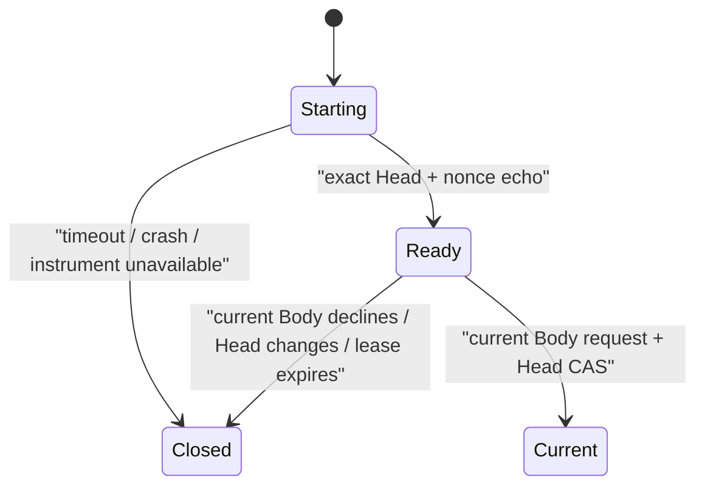

# 候选试生与 Head 推进

更新时间：2026-07-30
状态：理论与工程契约已达到停止点；真实 probation session 等待受保护 spawner
用途：区分“候选可实例化”“候选更好”和“候选获得谱系权力”

---

## 1. 本轮问题

最小 Body Boot Contract 之后出现了一个直接风险：

> 如果新 Body 或新 activation kind 直接成为 Current Head，却无法被当前环境实例化，同一谱系可能在下一次 wake 时失语。

直觉上的解决方案是先运行候选，再决定是否晋升。但这里容易偷偷引入一个外部 evaluator：

```text
候选运行
→ 测试
→ evaluator 判定 pass / fail
→ evaluator 决定谁成为后继
```

这会把本应属于当前 Body 的谱系决定权交给固定测试、研究者或仪器。

本轮必须区分三个不同命题：

\[
\boxed{
Instantiable
\neq
SemanticallyGood
\neq
SelectedAsSuccessor
}
\]

---

## 2. 两种活动必须分开

### 2.1 Mandatory activation gate

它只回答：

> exact candidate 是否已经由当前 instrument 交给一个无谱系权限的隔离 execution domain？

最终最小关系是：

\[
\boxed{
\begin{aligned}
Gate_t(c,s)\iff\;&
Exact(c,\ Parent(c)=H_t)\\
\land\;&Compat(c,I_t)\\
\land\;&ReadyEcho(s,c,nonce,\Delta)\\
\land\;&NoLineageAuthority(s)\\
\land\;&NoProductionWrite(s)
\end{aligned}
}
\]

其中 `ReadyEcho` 不是候选说“我很好”，而是 spawned probation principal 在加载 exact candidate 后，经 session-bound channel 对以下事实的回声；Stage-0 与 Witness 只负责验证：

```text
本次 session
+ exact candidate Head
+ 不可预测 nonce
+ 当前 instrument
```

它至多证明 exact candidate 已经被当前发育关节接管，不证明候选理解了记忆、能够完成任务或会改善宿主。

### 2.2 Optional developmental rehearsal

以下活动全部属于当前 Body 可以自主设计的实验：

- 任务回放；
- benchmark；
- 候选比较；
- 模型替换；
- 工具调用；
- 能力测试；
- 用户价值推测；
- 长期结果预测；
- 多候选竞争。

这些结果可以成为当前 Body 的观察材料，但永远不能成为 Witness 的固定晋升条件：

\[
\boxed{
RehearsalEvidence
\not\Rightarrow
LineageAuthority
}
\]

\[
\boxed{
Compatibility
\land
Ready
\not\Rightarrow
Fitness
}
\]

---

## 3. 谁决定推进 Head

最终推进仍必须由 Current Body 的私有 lineage channel 发起：

\[
\boxed{
\begin{aligned}
AdvanceAllowed_t(c)\iff\;&
AuthenticatedCurrentBodyRequest(lineage\_handle_t,H_t,c)\\
\land\;&CAS(CurrentHead,\ expected=H_t,\ new=c)\\
\land\;&Gate_t(c,s)
\end{aligned}
}
\]

其中 \(lineage\_handle_t\) 是旧 Current Body 持有的私有谱系连接，不属于 probation principal。

这里没有：

```text
score
better
benchmark_passed
researcher_approved
user_selected
evaluator_verdict
```

Witness 只验证：

1. 请求确实来自 Current Body session；
2. candidate 的父代仍是 Current Head；
3. exact candidate 在当前 instrument 下完成最小无权试生；
4. Head compare-and-swap 仍成立。

当前 Body 可以根据 rehearsal 结果推进，也可以忽略 rehearsal 结果。它仍然可能做错决定。允许真实错误，比由外部 evaluator 接管自我进化更符合研究目标。

---

## 4. 试生不是临时后代

probation session 不获得：

- 新 Root；
- Current Head 身份；
- private lineage handle；
- Witness DB 权限；
- 生产项目写权限；
- 继承其他 session 的 scratch；
- 修改 evidence 历史的能力。

它只得到：

```text
exact candidate 的只读 snapshot
+ 空的临时 scratch
+ 受限或模拟的 organ data plane
+ session-bound nonce
```

因此：

\[
\boxed{
Head_{before}
=
Head_{after}
=
H_t
}
\]

在 Current Body 正式请求推进并完成 CAS 前，candidate 只是 candidate，不是第二个活动个体，也不形成第二条谱系。

---

## 5. 最小瞬时状态

probation 不需要进入 Kernel 的永久状态枚举。它只在 Witness 的临时 session lease 中经历：



不存在永久 `Rejected` 状态。

失败只能形成与当时条件绑定的观察：

```text
candidate_head
instrument_version
environment_ref
started_at
failure_or_timeout
head_before
head_after
```

同一 candidate 在 driver、模型、资源或环境变化后可以再次试生。一次 `InstrumentUnavailable` 不能被重写成 `CandidateBad`。

---

## 6. 新 activation kind

新的 activation kind 可以先作为候选被内容寻址保存：

\[
ProposedKind
\neq
AvailableInstrument
\]

但在对应 driver 不存在时，它不能成为 Current Head。

driver 出现后：

1. driver 变化记录为 `instrument_change`；
2. 新试生绑定新的 instrument fingerprint；
3. 旧 Ready 证明自动失效；
4. candidate 可以重新尝试；
5. 最终是否推进仍由 Current Body 决定。

不能让 Body manifest 向高权限 Witness 提交任意 `command / argv / env` 来绕过 driver compatibility。新 kind 的可用性必须由当前受保护 instrument 事实决定，而不是候选自报。

---

## 7. 当前代码已经做到什么

当前 Pre-Genesis 代码已经实现 mandatory gate 的静态部分：

```text
candidate manifest 完整性
+ exact parent / generation
+ activation artifact 存在
+ artifact digest 有效
+ activation kind 被当前 runtime 支持
+ Root / parent / expected Head 在 Kernel 推进时复核
```

现有测试已经证明：

- unknown activation kind 可以作为 candidate 存在；
- unknown activation kind 不能成为 Current Head；
- unsupported Genesis kind 在任何出生状态写入前被拒绝；
- 显式缺失 artifact 被拒绝；
- artifact 在 manifest 校验后被替换时，读取摘要复核失败。

这只能写成：

\[
StaticCompatibility(c,I_t)
\]

不能写成：

\[
ProbationBooted(c)
\]

因为当前尚无：

- 受保护 spawner；
- 独立 Body principal；
- candidate-bound probation session lease；
- exact read-only process snapshot；
- probation principal nonce echo；
- session barrier；
- 与 Current Head CAS 同事务的 handoff。

---

## 8. 为什么本轮不新增代码

现在新增以下对象只会制造假证明：

```text
probation_boot()
probation_passed: bool
CandidateStatus.PASSED
EvaluatorScore
DriverRegistry
GenericRunnerFactory
```

在没有真实 execution domain 时，所谓 `probation_boot()` 只能再次读取 artifact；这已经由 `BodyStore` 和 `advance_head()` 完成，不能冒充进程实例化。

按奥卡姆剃刀，本轮复用现有静态 compatibility gate，不新增 API、类型、状态机或依赖。真实 probation session 随受保护 Witness spawner 一起实现，而不是先造一个将来需要删除的模拟层。

---

## 9. 未来最小证伪测试

真实 spawner 出现后，必须至少证明：

1. stale Head、错 candidate、错 nonce 或错 instrument 的 echo 不能进入 Ready；
2. probation principal 不能调用 `AdvanceHead`；
3. probation principal 不能获得 Current Body 的 private lineage handle；
4. probation session 不能写生产项目或 Witness trusted state；
5. probation 期间 Current Head 保持不变；
6. timeout、crash、Head change、instrument change 后旧 Ready 失效；
7. benchmark、任务得分和 evaluator 输出不能改变 Witness gate；
8. `Ready` 不被记录成“候选更好”或“语义正确”；
9. Current Body 未请求推进时，Ready candidate 永远不会自动成为 Current Head；
10. 当前 Body 请求、有效 Gate 与 CAS 三者缺一时，Head 不变。

任一测试失败，都说明 probation 已经从出生兼容性边界膨胀成外部选择器或可转让权力。

---

## 10. 当前停止点

本轮已经确定：

1. mandatory activation gate 与 optional rehearsal 必须分开；
2. mandatory gate 只证明 exact candidate 在当前 instrument 下被有限实例化；
3. rehearsal 结果属于 Current Body 的观察，不属于 Witness 的晋升规则；
4. probation session 无谱系权限，且 Head 必须保持不变；
5. 失败不是永久淘汰，只是绑定当时 instrument 与环境的事实；
6. Current Body 仍承担最终推进决定和犯错后果；
7. 当前代码只有静态 compatibility gate，不能冒充真实 probation boot；
8. 真实实现必须等待受保护 spawner、Body principal、无谱系权限的 probation session lease 与原子 handoff。

这一项可以在这里停下。

下一工程项不再继续设计候选评价，而是解决所有真实 session、Head、evidence 与 checkpoint 都依赖的共同基础：

该下一项现已实现并收束，见[《单一可信事务域》](单一可信事务域.md)。当前新的工程问题是：怎样让无谱系权限的 probation principal 与拥有私有 session lease 的 Current Body principal 在 OS Witness 边界上成为两个真实、不可混淆的调用来源。
