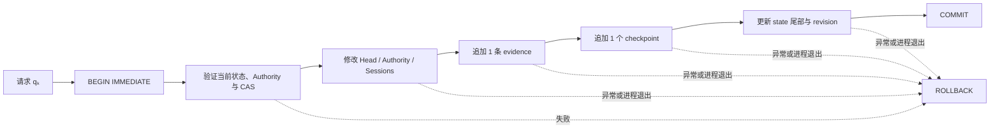

# 单一可信事务域：原子生命史、本地 checkpoint 与崩溃语义

更新时间：2026-07-30

状态：Pre-Genesis 代码已实现并通过隔离测试；本地事务停止点已达到，OS Witness 尚未实现

适用范围：Root、Head、Authority、session、evidence、checkpoint 与 Genesis 的本地一致性

---

## 1. 本轮解决的不是“换一种存储”

旧纵切面把生命状态分散在三个持久化域中：

```text
Kernel JSON
+ Runtime session JSON
+ Evidence JSONL
```

一次行为可能依次发生：

```text
写 session
→ 写 evidence
```

或者：

```text
写 head_advance_requested
→ 改 Head
→ 写 head_advanced
```

这意味着进程在任意两个写入之间死亡，都可能留下一个无法被解释为完整生命事实的中间世界。

第一性问题因此不是：

> 应该如何恢复更多文件？

而是：

> 对 Agent 谱系而言，什么必须作为一个不可分割的事实出现？

本轮答案是：

\[
\boxed{
TrustedFact_k
=
State_k
+ SessionDelta_k
+ Evidence_k
+ Checkpoint_k
}
\]

四者要么同时可见，要么都不存在。

---

## 2. 最小可信状态

第 \(k\) 次已提交变化后的本地可信状态记为：

\[
T_k =
\left(
Who,\ Why,\ Root,\ Head_k,\ Authority_k,\ Sessions_k,
Revision_k,\ E_k,\ C_k
\right)
\]

其中：

- `Who`：唯一宿主绑定的哈希承诺；
- `Why`：持续提升该宿主的目的锚哈希承诺；
- `Root`：本谱系唯一根承诺；
- `Head`：当前身体承诺；
- `Authority`：宿主 On / Off；
- `Sessions`：当前 execution-surface 会话集合；
- `Revision`：可信变化序号；
- \(E_k\)：evidence 尾部；
- \(C_k\)：checkpoint 尾部。

当前实现采用一个标准库 SQLite 数据库：

```text
trusted/state.sqlite3
```

只有四张表：

| 表 | 作用 |
|---|---|
| `state` | 唯一可信状态行 |
| `sessions` | 活跃 execution-surface session |
| `events` | 连续、哈希链接的 research evidence |
| `checkpoints` | 对每次状态结果的本地 HMAC 见证 |

没有 transition 状态机表、ORM、迁移框架、双写兼容层或自制事务协调器。一次已提交的 evidence 本身就是该次 transition receipt。

---

## 3. 唯一原子规律

所有可信写入都遵守同一个过程：



对任意一次成功变化：

\[
\Delta Revision
=
\Delta EvidenceSeq
=
\Delta CheckpointSeq
= 1
\]

并且：

\[
\boxed{
Commit_k
\Rightarrow
\operatorname{Visible}
\left(
State_k,\ Sessions_k,\ Evidence_k,\ Checkpoint_k
\right)
}
\]

\[
\boxed{
\neg Commit_k
\Rightarrow
T_{\mathrm{visible}} = T_{k-1}
}
\]

所以不存在以下合法状态：

```text
session 已出现，但 session_start evidence 不存在
Head 已改变，但 head_advanced evidence 不存在
Authority 已 Off，但 session 仍残留
evidence 已出现，但 checkpoint 不存在
revision 已增长，但对应 evidence 不存在
```

---

## 4. Body 为什么仍在事务外

Body 是内容寻址对象。它的 blob 和 manifest 可以先完整落盘，再尝试推进可信 Head：

```text
stage candidate Body
→ 验证 commitment / Root / parent / generation / activation
→ 进入可信事务
→ compare-and-swap Current Head
→ COMMIT
```

因此：

\[
CandidateExists
\not\Rightarrow
CandidateIsHistory
\]

\[
\boxed{
CandidateIsCurrent
\iff
TrustedState.Head = CandidateCommitment
}
\]

事务失败后遗留的 candidate 只是 staging artifact。它没有 revision、没有 Head 权限、没有谱系事实地位，可以在以后回收。

这比把大体积 Body blob 塞入 SQLite 事务更小，也保留了未来身体自行组织 skill、workflow、记忆、Agent 架构和学习算法的空间。

---

## 5. Session 也必须被见证

仅仅把 session 放进 SQLite 还不够。如果 checkpoint 不承诺 session 集合，外部删除或替换 session 行不会改变身份尾部。

当前实现先对按 session id 排序后的会话映射做规范化：

\[
SHash_k
=
SHA256
\left(
Canon(Sessions_k)
\right)
\]

再把 `sessions_hash` 同时写入 `state` 与 checkpoint。

因此加载时必须满足：

\[
State.sessions\_hash
=
SHA256(Canon(DB.sessions))
=
Checkpoint_k.sessions\_hash
\]

同时：

\[
Authority = Off
\Rightarrow
Sessions = \varnothing
\]

这使 wake、sleep 与 Off 不再是身份状态之外的附属文件操作，而成为同一生命史事务的一部分。

---

## 6. Evidence 与 checkpoint

第 \(k\) 条 evidence 的完整性哈希仍然是：

\[
e_k =
SHA256
\left(
Canon(
Evidence_k-\{integrity\_hash\}
)
\right)
\]

且：

\[
Evidence_k.previous\_integrity\_hash = e_{k-1}
\]

checkpoint 的未签名内容至少承诺：

```text
checkpoint_seq
previous_checkpoint_hash
transition_id
Who / Why
Root / Head / Authority
revision
sessions_hash
evidence_seq / evidence_hash
created_at
```

其哈希为：

\[
c_k =
SHA256
\left(
Canon(
Checkpoint_k-\{checkpoint\_hash\}
)
\right)
\]

本地见证码为：

\[
m_k =
HMAC_{K_{local}}
\left(
Canon(
Checkpoint_k
)
\right)
\]

这里必须称为 `MAC`，不能称为第三方可验证的数字签名。当前 `witness.key` 与数据库仍处于同一个 OS 用户权限域，本轮只建立崩溃原子性与非对抗性本地篡改检测。

---

## 7. Genesis 的精确定义

Body staging、数据库文件和本地 key 的出现都不等于出生。

\[
\boxed{
Born
\iff
Commit
\left(
Root,\ Head_0,\ Authority_0,\ Revision_1,
GenesisEvidence_1,\ Checkpoint_1
\right)
}
\]

如果在 checkpoint 写入或 COMMIT 前失败：

```text
state singleton 不存在
genesis evidence 不存在
checkpoint 不存在
正式 Root 不存在
```

同一路径允许重试。第一次失败留下的 Body 只是未引用 staging；第二次只有一个完整 Genesis 可以提交。已经存在一个可验证 Genesis 时，后续 Genesis 被拒绝，不能静默覆盖或“修复”现有生命史。

---

## 8. 并发与 Head 推进

Head 推进仍采用 compare-and-swap：

\[
Advance(H_e, H_c)
\text{ succeeds}
\iff
\begin{cases}
Authority = On \\
Head_{current} = H_e \\
Root(H_c) = Root \\
Parent(H_c) = H_e \\
Generation(H_c)=Generation(H_e)+1
\end{cases}
\]

CAS 在 `BEGIN IMMEDIATE` 后重新检查。即使两个独立 Runtime 实例都看见同一个旧 Head，最终也只能有一个提交者：

\[
\sum Winner(H_e) = 1
\]

失败者不留下 request evidence、半个 checkpoint 或 revision 增量。

`head_advance_requested + head_advanced` 两条跨文件记录已经收敛为一条原子 `head_advanced` receipt。没有提交，就没有“已请求但永远未完成”的伪历史。

---

## 9. 已验证的失败语义

自动化测试现在直接注入并验证：

1. `session_start` evidence 插入失败，session、evidence、checkpoint、revision 全部不变；
2. `head_advanced` 插入失败，Head、evidence、checkpoint、revision 全部不变，candidate 仍只是 staging；
3. `host_off` 插入失败，Authority、活跃 session 和历史全部保持原样；
4. Genesis 在 checkpoint 前失败，不构成出生，同一路径可重试且最终只有一次 Genesis；
5. checkpoint 内容被篡改，重新加载失败；
6. `Who` 身份锚被篡改，checkpoint 尾部对账失败；
7. 两个独立 Runtime 实例竞争同一个 Head，恰有一个成功；
8. 子进程在 checkpoint 前执行真实 `os._exit`，重新加载后看不到 ghost session、半条 evidence 或 revision 增量；
9. Codex adapter 面对 SQLite / 完整性失败时静默退出，不阻断用户原本的 coding-agent 任务。

这些测试证明本地代码契约与 SQLite crash recovery，不证明长期学习、自我进化或 OS 权限隔离已经成立。

---

## 10. 明确没有做的兼容层

当前仍是 Pre-Genesis，没有正式用户生命史需要迁移。因此 Runtime 不再创建或双写：

```text
kernel/state.json
runtime/state.json
evidence/events.jsonl
```

保留的独立 `MicroLifeKernel` 与 `EvidenceLedger` 代码只作为早期原语、回归样本和理论来源，不再是 `DevelopmentalRuntime` 的真相源。

选择不双写是必要的：

\[
TwoSourcesOfTruth
\Rightarrow
AtomicityProblemReturns
\]

如果同时维护 SQLite 与旧文件，就会重新产生“哪个域先成功、崩溃后相信谁”的问题。

---

## 11. 当前证明上限

### 11.1 已成立

当前可以声称：

- 本地可信变化在一次 SQLite 事务中完整提交或完整回滚；
- session 已进入 checkpoint 承诺；
- 已记录 evidence 与 checkpoint 的局部修改可被检测；
- 单独回放旧 `state` 行会被当前 history / checkpoint 尾部发现；
- Body candidate 与已提交谱系事实已经分离；
- Genesis 提交前不算出生。

### 11.2 尚未成立

当前不能声称：

- 普通 Body 进程无法读取 `witness.key`；
- 同用户恶意进程无法同时重写数据库和 MAC；
- 整个旧数据库与旧 key 一起回放时一定能被发现；
- 复制整个 home 不会产生一个内部一致的克隆；
- `author_kind` 已由不可伪造的调用来源生成；
- Head 推进请求一定来自 Current Body；
- checkpoint 已由 OS 服务、硬件密钥或机器外锚点独立见证；
- 全历史验证已具备无限期运行的性能。

因此：

\[
\boxed{
LocalAtomicity
\neq
IndependentWitness
}
\]

\[
\boxed{
LocalHMAC
\neq
UnforgeableLineageAuthority
}
\]

SQLite 解决意外崩溃、并发和单机事务；它不能单独成为“自然神”。

---

## 12. 跨平台含义

本轮只依赖 Python 标准库 `sqlite3` 和现有跨平台生命周期锁，逻辑契约不绑定 Windows：

```text
Windows / macOS / Linux
→ 同一 SQLite schema
→ 同一 evidence / checkpoint 规范
→ 同一 crash atomicity
```

不同操作系统真正分叉的部分在下一层：

```text
Windows service SID + named pipe ACL
macOS launchd + XPC / Unix-domain socket 权限
Linux systemd user/system service + Unix-domain socket / credential checks
```

平台适配器可以不同，但不能改变本文件的原子事实定义。

---

## 13. 当前停止点与下一项

本轮已经到达可停止点：

> 本地单一可信事务域已经能够让身份、Head、session、evidence 与 checkpoint 作为同一个生命史事实提交；继续向 SQLite 内增加 evaluator、学习算法、lease 表、通用事务 DSL 或恢复状态机，都不会增强这一命题。

下一项不是继续扩张数据库，而是回答上轮留下的来源问题：

> 怎样让只有 Current Body 启动的私有 session lease 能向 Witness 请求谱系变化，同时让 Codex、其他模型器官、普通用户进程和候选试生都拿不到同等权限？

下一模块因此是：

```text
Private Body session lease
+ Witness-owned capability meaning
+ Current Head binding
+ expiry / revocation
+ Off 后立即失效
+ probation principal 无 lineage authority
```

在该边界形成代码和临时演练前，不安装机器服务，不执行正式 Genesis，也不宣称自主进化的作者来源已经成立。

该下一项的逻辑协议和进程内演练现已完成，见[《Current Body 私有会话租约》](CurrentBody私有会话租约.md)。它验证了 exact-Head、authority epoch、一次性消费、候选归属和失败重试，但没有把文件锁或 Python 对象冒充 OS Body principal。新的工程停止点是：不再增加 lease 表、token 或进程内角色；直接进入 singleton Witness service、独立 principal 与私有 IPC。
