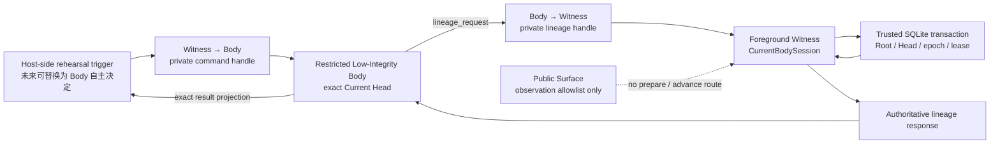

# 受限 Body 与私有谱系能力演练

更新时间：2026-07-30
状态：Windows foreground 已形成 restricted Low-Integrity Body、显式继承私有双管道与 Body 发起的谱系往返演练；仍未形成独立 service principal、受保护可信状态、HostPresence、安装态 native security 或正式 Genesis

对应实现：

- `src/agentic_evo/windows_native.py`
- `src/agentic_evo/body_process.py`
- `src/agentic_evo/body_worker.py`
- `src/agentic_evo/witness.py`
- `tests/test_windows_native.py`
- `tests/test_body_process.py`

---

## 1. 本轮真正回答的问题

前一轮已经证明：

1. public Surface 只能调用观察类 allowlist；
2. Windows public named pipe 可以由内核识别同账户 peer；
3. exact-Head diagnostic Body 可以先被 Job Object 围栏，再接收出生材料。

它还没有回答：

> 一次 `prepare_successor / advance_head` 是否真的经过当前 Body 所在进程，而不是由 public Surface、父进程中的普通函数调用或一段自我叙述冒充？

本轮的回答是：

> 在 foreground Pre-Genesis 演练中，该请求现在会真实经过受限 Body 子进程和仅由父子双方持有的匿名双管道；请求绑定当前 boot、严格序号、当前 lease 与 authoritative Witness response。该事实足以成立 `private_lineage_transport_rehearsal`，但不足以成立安装态不可绕过的 Body 来源认证，也不足以派生 `agent_self_authored`。

这里最重要的区分是：

\[
\boxed{
PhysicalTraversal
\neq
UnforgeableInstalledAuthority
}
\]

前者已经有代码和实机证据，后者必须等独立 Witness service principal、protected state 和安装态攻击测试。

---

## 2. 最小关系图



这张图表达三个不同事实：

1. 当前 `rehearse_*` 仍是研究仪器触发，不是 Agent 已经自主产生进化意图；
2. 触发之后，请求必须真实穿过 Body，父进程不能直接把普通函数调用伪装成 Body 结果；
3. Root、Head、epoch、来源和最终事务仍由 Witness 派生，Body 不能自报这些权威字段。

---

## 3. Windows Body 的当前受限事实

### 3.1 restricted token

Windows launcher 从当前进程 token 派生 restricted token：

- 使用 `CreateRestrictedToken`；
- 禁用最大权限；
- 把 Low Integrity `S-1-16-4096` 写入 token；
- 启动后重新查询实际 child token，而不是相信 launcher 的输入；
- child 的有效 privilege 集合至多保留 `SeChangeNotifyPrivilege`。

当前实机事实可以写成：

\[
\boxed{
R_B^{fg}
=
IsRestricted(Token_B)
\land IL(Token_B)=4096
\land Privs(Token_B)\subseteq\{SeChangeNotifyPrivilege\}
}
\]

这里的 \(fg\) 表示 foreground rehearsal。它不是“Body 已与宿主用户成为两个不可互相冒充的安全主体”。restricting SID 仍来自当前用户权限域，同权限宿主进程仍可能修改代码、状态或进程句柄。

### 3.2 suspended handoff

Body 不是先运行再补围栏，而是：

```text
create restricted token
→ create two anonymous pipes
→ mark only child-side handles inheritable
→ CreateProcessAsUserW(CREATE_SUSPENDED)
→ explicit PROC_THREAD_ATTRIBUTE_HANDLE_LIST
→ assign child process handle to KILL_ON_JOB_CLOSE Job
→ close parent copies of child-side handles
→ ResumeThread
→ child seals inherited handles as non-inheritable
→ exact-Head Boot / ReadyEcho
```

因此：

\[
\boxed{
SuspendedAtHandoff
\land JobBeforeResume
\land BootAfterResume
}
\]

未来 activation 一旦包含 Body 可控代码，也不能越过这个顺序。

### 3.3 capability handle，而不是“只有两个句柄”

当前只允许两个私有通信 handle 进入显式继承列表：

\[
\boxed{
Inherited_B
\cap
Inheritable_W
=
\{h_{W\rightarrow B},h_{B\rightarrow W}\}
}
\]

这不等于 child 整个进程只有两个 OS handle。Python 与 Windows runtime 会持有自己的内部 handle。可证明的事实只是：

> 父进程选择性传递给 Body 的 capability 集合中，只有这一对匿名管道 handle。

Body 打开它们后立即取消可继承标志，避免未来后代无意继承谱系能力。

---

## 4. 私有谱系协议

协议名：

```text
agentic-evo-private-lineage-v1
```

当前只允许两个操作：

```text
prepare_successor
advance_head
```

不在其中加入：

- Genesis；
- On / Off；
- evidence 改写；
- instrument 改写；
- public observation；
- 任意方法名分发；
- 通用 RPC 权限 DSL。

这是奥卡姆剃刀在工程上的直接使用：能力面只包含本轮必须证明的最小谱系动作。

### 4.1 权威字段不由 Body 自报

Body request 可以携带候选内容或候选 Head，但不能决定：

- Root；
- Current Head；
- authority epoch；
- lease 是否有效；
- `author_kind`；
- `ingress_path`；
- evidence 的最终字段；
- transaction 是否提交。

这些值由当前 `CurrentBodySession` 和 trusted state 派生。

### 4.2 最小准入式

令 \(r_s\) 为 boot 内序号 \(s\) 的谱系请求，\(L_t\) 为当前 volatile lease，则：

\[
\boxed{
\begin{aligned}
Allow(r_s,L_t)
\iff {}&
Authority_t=On \\
&\land Head(L_t)=CurrentHead_t \\
&\land Epoch(L_t)=CurrentEpoch_t \\
&\land Lease(L_t)=Active \\
&\land BootSession(r_s)=BootSession(L_t) \\
&\land type(s)=int \land \neg bool(s) \\
&\land s=NextSequence(L_t) \\
&\land op(r_s)\in\{prepare,advance\}
\end{aligned}
}
\]

对 `advance_head` 还必须满足：

\[
\boxed{
Candidate(r_s)
\in PreparedBySameLease(L_t)
}
\]

所以：

- 外部 Runtime 准备的候选不能被当前 Body 洗白；
- 旧 Body crash 后留下的候选不能由新 Body 推进；
- replay、跳号和 Python 中 `True == 1` 的布尔混淆都被拒绝；
- 成功 advance 会消费旧 lease，旧 Body 随后退出。

---

## 5. 结果不是 Body 的自我汇报

只检查 Body 返回“成功”仍然不够。Body 可以伪造一段看似正确的结果语言。

因此父端只接受满足以下条件的 result：

\[
\boxed{
\begin{aligned}
Accept(Result_s)
\iff {}&
Pending(Command_s) \\
&\land Witnessed(LineageRequest_s) \\
&\land AuthoritativeResponse_s\ exists \\
&\land Result_s
=Projection(AuthoritativeResponse_s)
\end{aligned}
}
\]

也就是说，正常因果链必须完整存在：

```text
host command
→ Body receives command
→ Body originates lineage request
→ Witness validates current lease
→ trusted transaction returns authoritative response
→ Body projects that exact response
→ host accepts result
```

仅有 `Result_s`、仅有正确序号、或仅有正确候选 Head 都不够。

该约束已经覆盖：

- `sequence=0` 伪造；
- 当前合法序号但没有对应 request 的伪造；
- replay 上一个 result；
- result 与 authoritative response 字段不完全一致；
- Body 自加 `author_kind=agent_self_authored`；
- 深层 JSON 与畸形 frame。

---

## 6. 成功、失败与未知不是二元关系

谱系请求穿过进程和事务边界后，调用方可能超时，但事务已经跨过线性化点。此时把结果写成“失败”会制造重试风险。

因此当前结果域为：

\[
\boxed{
Outcome
\in
\{Committed,\ Rejected,\ Unknown\}
}
\]

其中：

\[
\boxed{
CommandWriteAttempted
\land
\neg AuthoritativeRoundTripBeforeDeadline
\Rightarrow
OutcomeUnknown
}
\]

`Unknown` 的含义不是“没有发生”，而是：

> 调用方不能仅凭本次通道结果知道是否已经提交，必须重新读取 trusted state。

这包括：

- command 写入后等待 result 超时；
- command 可能已进入 pipe buffer 时通道异步失败；
- advance 已进入事务但 Body 在返回前死亡；
- 写入阶段阻塞，无法证明零字节还是部分/全部字节已经跨过边界。

---

## 7. 私有 I/O 的截止时间也是安全边界

### 7.1 原问题

若 child 活着但停止读取，匿名 pipe 的阻塞写可能永久挂起。旧实现只给 `ReadyEcho` 或 result 的读取设置 timeout：

```text
synchronous write with no deadline
→ read timeout starts too late
```

这会让 timeout 形同虚设，并让 `close()` 等待同一写锁。

### 7.2 当前合同

Boot、command、Witness response 与 stop 四个父端写点都经过 bounded writer。command 写入与 result 等待共享一个 monotonic deadline：

\[
\boxed{
T_{write}
+
T_{response}
\le
T_{request}
}
\]

超时顺序固定为：

```text
deadline expires
→ kill Body first
→ inherited read handle closes
→ blocked writer unblocks
→ bounded join
→ cleanup streams and lease
```

不能先 `close(writer)`；Windows 实机表明，另一个线程关闭正在阻塞写入的 `FileIO` 也会等待该写完成。先终止持有 read end 的 Body 才能打破等待。

### 7.3 short write

一次 `stream.write(payload)` 不保证写完全部 bytes。当前 writer 按返回值推进 memory view，直到：

\[
\boxed{
\sum_i Written_i
=
|CanonicalJSON|+1_{\text{newline}}
}
\]

返回 `None`、布尔值、零、负数或超过剩余长度都按协议错误处理，不能把部分 frame 当成成功。

---

## 8. 当前自动化与实机证据

截至 2026-07-30，全仓 151 项测试在 `ResourceWarning` 作为错误时通过。

与本轮直接相关的证据包括：

1. restricted child 的实际 token 被重新查询为 restricted；
2. child Integrity RID 为 4096；
3. child privilege count 至多为 1，且唯一允许的 LUID 对应 `SeChangeNotifyPrivilege`；
4. child 在 suspended 状态交接，Job assignment 发生在 Resume 之前；
5. 只有显式 handle list 中的两个私有 handle 被继承；
6. caller 侧 child handles 在成功、失败与 close-before-resume 路径都被 seal；
7. worker 在 Boot 前把继承来的私有 handles 设为 non-inheritable；
8. exact-Head Boot、ReadyEcho 与 6 MiB activation 正常完成；
9. Body 真实完成 prepare→advance 往返，新 Body 从新 Head 启动；
10. foreign candidate、旧 lease candidate、布尔序号、重放、伪造 result 和 claimed authorship 被拒绝；
11. deep JSON 在显式 nesting bound 内 fail closed；
12. transaction 跨过 timeout 时返回 `BodyLineageOutcomeUnknown`，随后 trusted state 可以显示已提交；
13. Boot 写阻塞与 lineage command 写阻塞都在 deadline 内终止 Body并释放会话锁和写锁；
14. partial writes 被循环补全；
15. 已异步终止的 Windows process 可以幂等 cleanup，不以二次 `AccessDenied` 覆盖原始故障。

独立 Windows 匿名管道探针还验证：受限 child 持有 read end 但不读取时，8 MiB 写入会真实阻塞；deadline 终止 child 后，阻塞 writer 在约 0.1 秒内以 `BodyBootError` 解开。

---

## 9. Windows、macOS、Linux 不是三个 Agent

### 9.1 共同的协议核

三平台共享：

```text
one machine lineage
+ exact Root / Head / epoch
+ private boot
+ strict sequence
+ same-lease candidate ownership
+ authoritative result binding
+ Committed / Rejected / Unknown
+ Off revocation
```

Agent 的连续性不属于 Windows API、launchd 或 systemd；这些只是同一身份核和谱系协议的身体适配器。

### 9.2 当前可运行状态

当前代码为 macOS / Linux 保留普通 `Popen` stdio 的相同 Boot 和 lineage rehearsal 路径；该路径尚未在对应平台实机验证。即使未来通过，它也只证明可移植协议路径，不证明原生 principal：

\[
\boxed{
PortableSemantics
\land PopenRoundTrip
\not\Rightarrow
NativeSecurity_{Darwin/Linux}
}
\]

### 9.3 最终原生映射

| 不变量 | Windows | macOS | Linux |
|---|---|---|---|
| Witness supervision | SCM service | launchd LaunchDaemon | systemd system service |
| Witness principal | restricted service SID | dedicated daemon UID | dedicated/system UID |
| trusted state | service-SID ACL `ProgramData` | daemon-owned `0700` state | `StateDirectory=` |
| Body principal | 与 Witness/宿主区分的 restricted token/SID | distinct non-login Body UID + code requirement | distinct Body UID |
| private capability | explicit inherited anonymous handles | inherited socketpair / private XPC endpoint | inherited socketpair |
| public peer fact | token SID | audit token / EUID / code requirement | `SO_PEERCRED` |
| process fencing | Job Object | launchd-managed job/process group | systemd cgroup |

可变的是载体，不可变的是验收式。

---

## 10. 当前允许与不允许的科研主张

### 10.1 允许

可以复现地声称：

> Windows foreground Witness 能以 restricted Low-Integrity token suspended-spawn exact-Head Body，在 Resume 前加入 Job，只显式继承一对私有匿名管道 handle；Body 发起的严格序号谱系请求经当前 lease 执行，host 只接受绑定 authoritative Witness response 的结果，所有父端私有写入都有 deadline。

可以把该组成记为：

\[
\boxed{
F_{job}^{diagnostic}
\land
P_{pub}^{foreground}
\land
R_B^{foreground}
\land
P_{lin}^{transport\ rehearsal}
=true
}
\]

### 10.2 不允许

当前不能声称：

- Witness 已由 SCM 监督；
- trusted state 已由 service principal 保护；
- foreground 宿主进程无法复制 child handle、调试进程或替换本地代码；
- Body 已成为区别于用户账户的不可冒充 principal；
- private lineage 已达到安装态 native authentication；
- public SID 等于第一宿主真人在场；
- Off endpoint 已经有独立 HostPresence；
- macOS / Linux 原生边界已经实机通过；
- `agent_self_authored` 已经成立；
- 自主学习或自我进化已经发生；
- 已安装或已经正式 Genesis。

因此：

\[
\boxed{
F_{job}^{diagnostic}
\land P_{pub}^{foreground}
\land R_B^{foreground}
\land P_{lin}^{transport\ rehearsal}
\not\Rightarrow
NativeReady_{Win}
}
\]

并继续保持：

```text
native_security_verified = false
ready_to_install = false
```

---

## 11. 停止点与下一项

本层已经到达停止点：

> restricted Body 的 foreground 启动顺序、显式 capability handle、私有谱系往返、序号/lease/result 因果绑定、失败三态、阻塞 I/O deadline 与 honest provenance 已经形成代码和可重复测试。继续在同一 foreground 用户权限域增加 token 字段、nonce 表或 Python 私有类，不会把它升级为不可绕过的安装态来源证明。

因此可以在这停下。

下一项不是扩张私有 RPC，而是把已经冻结的协议迁入真正的宿主生命周期边界：

```text
Windows:
SCM-managed Witness principal
+ service-owned protected state/key
+ foreground Surface 与 service principal 分离
+ restricted Body 由 service 创建
+ install / attack / uninstall rehearsal

macOS:
LaunchDaemon + dedicated Witness/Body UIDs + daemon-owned state

Linux:
systemd service + dedicated principals + StateDirectory + cgroup
```

正式 Genesis 仍然必须等用户单独授权；安装工具和实验仪器可以继续共生开发，但不能用 dry-run 或 foreground 成功替代安装态事实。
