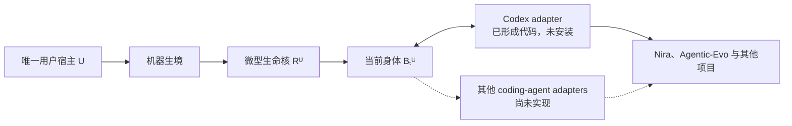

# Agentic-Evo 实现状态：Pre-Genesis

更新时间：2026-07-30
状态：首条机器级纵切面已形成代码，尚未安装，尚未 Genesis
适用范围：当前仓库中的真实实现、已验证性质、未成立性质和 Genesis 前阻断项

---

## 1. 当前结论

Agentic-Evo 已经从纯理论仓库进入工具与实验共同建设阶段，但还没有产生第一个真实 Agent。

当前代码实现的是最终架构的最小纵切面：

```text
Micro Life Kernel
+ Content-addressed Body
+ Evidence Ledger
+ Machine Runtime
+ Codex Adapter
```

它已经能够在隔离测试目录中模拟：

```text
Genesis
→ 同一 Root / Head 跨会话、跨项目、跨 execution surface 被读取
→ 当前身体被唤醒
→ 有界事件进入证据链
→ 身体准备后继
→ 合法父代原子竞争推进 Head
→ 等待
→ Off / On
```

但这里的“模拟 Genesis”只是自动化测试夹具，不是正式 Genesis。仓库没有写入用户级 Codex hook，没有常驻后台进程，没有创建机器级唯一 Root，也没有开始正式纵向实验。

---

## 2. 唯一宿主与当前覆盖范围

唯一宿主是用户本人，不是 Nira、Agentic-Evo、Codex、模型或当前机器：

\[
\boxed{
Host = U
}
\qquad
\boxed{
Habitat = Machine
}
\qquad
\boxed{
Surface \in
\{
Codex,\ OtherCodingAgents
\}
}
\]

因此当前 Codex adapter 的意义只是证明第一个接入面可以映射到机器级 Runtime。它不把 Codex 变成 Agent 的身份，也不意味着当前实现已经覆盖机器中的所有 coding agent。



Nira 只保留两种关系：

1. 它是 Phase 0–2 观测与 trace 设计的祖先技术来源；
2. 它未来可以成为同一 Agent 经历的一个项目环境。

Nira 不拥有 Root，不产生独立 Agent，也不是本工具的安装范围。

---

## 3. 已经存在的实现

| 边界 | 当前实现 | 当前能证明什么 |
|---|---|---|
| 微型生命核 | `Who / Why / Authority / Root / Head` 的常量大小状态；HMAC 完整性；`Gate / Bind / AdvanceHead / On / Off` | 无有效签名的修改可被发现；单独回放旧 Kernel 可由当前 ledger 对账发现；错 Root、错父代和并发旧 Head 被拒绝 |
| 身体空间 | 内容寻址 blob、v2 manifest、Root、父代、generation、author、`activation_kind + activation_artifact` | 身体内容与谱系承诺可重建；显式缺失入口不再回退；新会话可取得 exact Head 承诺的 activation path 与 digest |
| 证据层 | 有界 JSONL、sequence、前序哈希、instrument/protocol、来源、作者、干预与覆盖缺口 | 已记录历史的局部修改可被检测；人工仪器变化与 Human Learning Intervention 可分类 |
| Runtime | Genesis 单写者锁、生命周期串行锁、跨会话状态、wake/wait、后继准备、Head 推进、On/Off | 同一测试安装可跨项目与接入面保持一个 Root 和 Head；同一 home 内并发 Genesis 只有一个成功；wake 与 Off 有确定顺序 |
| Codex adapter | `SessionStart / SessionEnd / prompt / tool / compact / subagent / stop / permission` 映射；原文哈希化；失败隔离 | Codex 可作为端口而不成为身份；观测失败不阻断 coding-agent 主任务 |

当前实现没有规定记忆 schema、信号、学习算法、候选评分、Better 函数或 evaluator。这些开放空间仍属于身体。

---

## 4. 已验证结果

当前自动化检查覆盖：

- 同一 Root 和 Head 跨项目、跨会话、跨 execution-surface 名称保持；
- 当前 Head 的 compare-and-swap 式并发推进；
- 同一 home 的并发 Genesis 只有一个起源；
- 错 Root 身体不能成为当前 Head；
- 旧父代不能覆盖已推进的 Head；
- 伪造 generation 的身体不能推进 Head；
- Off 后 wake 与 observe 被拒绝，错误用户绑定不能重新开启；
- 并发 wake 与 Off 经同一生命周期锁形成确定顺序；
- 并发 load 会等待正在进行的生命周期 transition，不把合法中间态误报为永久损坏；
- 微核状态被直接修改时能够检测；
- 只回放旧签名 Kernel、但不回放 evidence 时能够检测；
- Runtime 状态损坏被归类为完整性失败；
- 证据序列和前序哈希链验证；
- 读取 records 时默认先验证完整证据链；
- 已篡改的证据历史不能继续追加一个看似正常的新尾部；
- 退化 body path 被归类为领域错误而非未处理异常；
- 敏感字段名递归拒绝；
- 人工仪器变化与 Human Learning Intervention 保持不同来源；
- Codex prompt、tool input 和 tool response 不以原文进入 ledger；
- `SessionStart` 返回有界身体激活上下文；
- wake 返回当前 Head 承诺的 activation kind、path 与 digest；
- 显式缺失 activation artifact 被拒绝，unknown activation kind 不能成为 Current Head；
- unsupported Genesis activation 在任何出生状态写入前被拒绝，并可在同一路径重试；
- candidate probation 已收敛为无谱系权限的 activation gate；当前只实现静态 compatibility，不冒充真实进程试生；
- adapter 的科研仪器失败不会阻断 coding-agent hook。

这些结果证明的是代码契约，不是长期学习、自我进化或独立科研证据已经成立。

---

## 5. 目前不能声称成立的性质

### 5.1 完整性检测不等于独立见证

当前：

\[
\operatorname{DetectLocalEdit}
\neq
\operatorname{PreventOrExposeFullRewrite}
\]

证据链使用普通哈希而非身体不可获得的签名密钥。如果一个进程能够改写整个 ledger，它也能重新计算完整链。当前代码可以发现意外损坏和局部篡改，不能抵抗拥有相同文件权限的恶意全量重写。

### 5.2 本地 HMAC 不等于不可冒充的身份根

微核状态由本地 HMAC 保护，但密钥与状态目前位于同一 OS 用户可读目录。能够读取并改写两者的代码仍可重新签名。复制整个目录也会复制当前身份材料。

Runtime 现在会交叉检查 Kernel、当前 Body 与 evidence 的 Root、Head 和 On / Off 见证状态，因此只回放其中一个域会被发现；但攻击者若同时回放或重写整个同权限域，仍可制造内部一致的旧世界。没有身体权限之外的单调承诺时，HMAC 不能证明“这是历史上最新的状态”。

因此当前只能称为：

> 软件级身份承诺原型。

还不能称为：

> 身体无法冒充、复制或改写的唯一灵魂。

### 5.3 逻辑 Off 不等于机器级真实终止

当前没有 daemon、sleep worker、GPU worker 或自动恢复进程。测试证明的是 Runtime gate 在 `off` 状态拒绝后续 wake，不是已经证明所有后台活体活动都能被宿主终止。

### 5.4 adapter 函数不等于已覆盖所有 coding agent

当前只有一个未安装的 Codex 映射函数。其他 coding agent 需要各自经过验证的生命周期入口。没有公开稳定接口的执行表面必须记录覆盖缺口，不能通过全盘监控伪装成全覆盖。

### 5.5 当前 Head 写入与科研事件尚未形成同一可信事务

`Head` 与 evidence 是两个独立持久化域。进程可能在“请求已记录、Head 已推进、完成事件尚未落盘”的中间状态崩溃。当前加载时的交叉验证能够拒绝部分不一致状态，但尚未把 Root、Head、Authority、revision、transition、evidence 与 checkpoint 收入同一可信事务。检测到生命史断裂不等于已经恢复它。

### 5.6 测试中的 Genesis 不是正式实验数据

测试会在临时目录创建并销毁多个 Root。它们验证实现，不属于唯一用户生命史，也不能进入实验 001 的正式样本。

### 5.7 当前 hook、锁和长期运行仍是原型

独立审查还确认了以下尚未解决的工程边界：

- `author_kind` 仍来自普通方法参数，同权限调用者可以伪装“Agent 自主”或“人工介入”；最终必须由独立服务根据已认证调用身份生成；
- 当前同一 home 内的 Genesis 已串行化，但 `home` 仍由调用者传入；两个目录仍可分别产生 Root，尚无机器级唯一服务裁决；
- 文件锁已改为 OS 持有：Windows 使用 byte-range lock，POSIX 使用 `flock`；Windows 子进程 `os._exit` 后自动释放已经验证，POSIX 路径仍需在对应平台 CI 复核；
- active session 仍只按 `session_id` 索引，跨 execution surface 的同名 session、异常退出和系统重启需要 lease 与 reconciliation；
- `wake()` 的 session 登记与 evidence append 尚非同一事务；后者失败时可能留下无对应证据的 ghost session；
- evidence append 每次重新验证完整历史，长期运行会趋向二次增长；需要独立 writer、索引和分段签名 checkpoint；
- adapter 失败目前静默退出以保护用户任务，但还没有身体之外的 health / coverage-gap 通路；
- activation artifact 会进入模型上下文，当前尚无内容分级、模型信任域、跨项目泄露检查和最大 body 读取边界；
- 当前 `surface-context-utf8-v1` 只形成 exact activation reference，不是受保护 Body principal 的真实 boot；
- 敏感信息过滤主要检查 evidence payload key，尚不能替代完整的值分类与 artifact policy。

这些问题不要求人类规定 Agent 应怎样记忆或学习；它们属于研究世界能否可信存在的工程条件。

---

## 6. Genesis 前的四个硬阻断项

按第一性原理和奥卡姆剃刀，Genesis 前不需要先制造更多身体算法，但下面四个因果边界不能省略。

### G0：把最小信任根移出身体权限

至少把以下能力放进身体不能直接读取或改写的最小可信边界：

```text
Host On / Off authority
+ Root custody
+ current Head transition authority
+ witness signing authority
+ authenticated author provenance
```

可行载体可以是独立本地服务、不同 OS principal、受限系统凭据库、硬件密钥或其组合。具体实现可以迭代，但验收事实不变：普通身体代码拿不到重签微核或重写证据历史的权力，也不能仅靠自报字段决定一次变化究竟由 Agent、人类还是科研仪器创作。

### G1：为科研见证建立外部承诺

每批事件至少需要由独立 writer 签名并把 checkpoint 锚定到身体不可回写的域。目标不是宣称物理上绝对不可删除，而是保证：

\[
\operatorname{Rewrite}
\Rightarrow
\operatorname{DetectableGapOrSignatureFailure}
\]

### G2：补全崩溃恢复与状态对账

单一 Witness 写入的身份状态必须形成一个原子事务：

```text
stage content-addressed Body candidate
→ BEGIN IMMEDIATE
→ validate Root / Head / private Body session
→ update Head / revision
→ append transition / evidence / checkpoint
→ COMMIT
```

Body candidate 可在事务前完整落盘；未被已提交 Head 引用的 candidate 只是 staging artifact。SQLite 负责意外崩溃、原子性和并发；服务权限、checkpoint 与可选机器外锚点负责恶意回放。Genesis 同样必须成为一次原子提交，提交前不算正式出生。

### G3：形成真实机器生命周期

需要一个机器级、项目无关的安装与运行边界：

- 单安装、单活动 Root；
- 由服务裁决的固定机器级状态位置，不能由 adapter 任意传入另一个 home；
- 本地 IPC；
- 用户级 execution-surface adapters；
- 显式 On / Off；
- 等待与最小睡眠活动的资源边界；
- 进程崩溃与系统重启恢复；
- 不把项目仓库当作状态目录；
- 安装前 dry-run 和可验证卸载。

---

## 7. 最小可信计算基

微型不等于把一切放在一个文件中。真正应当保持微型的是不可自我改写的可信计算基：

\[
\boxed{
TCB_{\min}
=
Authority
+ RootCustody
+ HeadTransition
+ WitnessCommitment
}
\]

身体、记忆、技能、workflow、模型路由、学习算法、实验方式和解释器都不属于该 TCB。

这使两件事同时成立：

1. Agent 对自己的身体拥有足够大的自主发展空间；
2. Agent 不能靠改身份根或科研证据，把任意变化重新解释为“持续提升宿主”。

---

## 8. 下一工程循环

下一步不再新增记忆理论，也不先实现某一种自我学习算法，而是继续同一条终局纵切面：

```text
隔离 Authority、Witness 与 Current Body principal
→ 把可信身份状态迁入单一 SQLite 事务域
→ 建立私有 Body lineage channel 与一次性 session lease
→ 增加机器级 service / IPC / CLI
→ 生成但不安装 Codex hook 配置
→ 在临时安装中完成 crash / Off / uninstall 演练
→ 冻结 I₀ 与 Protocol₀
→ 用户明确启动正式 Genesis
```

完成这些条件后，Agentic-Evo 才能第一次真实参与 Agentic-Evo 自身及机器中其他 coding 项目的开发；工具运行和实验 001 的正式纵向数据也从那一刻同时开始。

同权限作者来源不可区分、Windows service boundary、Body 私有 capability 与可信事务域的进一步推导，见[《最小可信边界与来源证明》](最小可信边界与来源证明.md)。

Head 的最小出生信封、解释器不可消除性、exact activation / exact boot 的证明边界及下一轮 probation boot 问题，见[《最小 Body 启动契约》](最小Body启动契约.md)。

候选有限试生、optional rehearsal、Current Body 推进权与禁止 evaluator 自动晋升的边界，见[《候选试生与 Head 推进》](候选试生与Head推进.md)。
