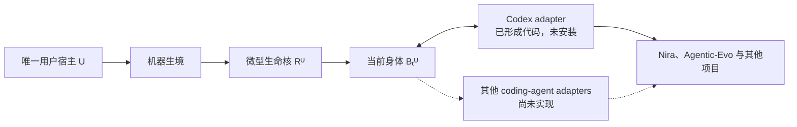

# Agentic-Evo 实现状态：Pre-Genesis

更新时间：2026-07-30
状态：Pre-Genesis Python 可移植层已到停止点；Windows foreground Job Object 与原生 public named pipe 已形成局部原生证据，尚无 SCM principal、protected state、HostPresence、私有 lineage、原生安装或正式 Genesis
适用范围：当前仓库中的真实实现、已验证性质、未成立性质和 Genesis 前阻断项

---

## 1. 当前结论

Agentic-Evo 已经从纯理论仓库进入工具与实验共同建设阶段，但还没有产生第一个真实 Agent。

当前代码实现的是最终架构的最小纵切面：

```text
Trusted State（身份锚 + Head + session + evidence + checkpoint）
+ Content-addressed Body
+ Machine Runtime
+ WitnessCore（Current Body lease 逻辑演练）
+ Foreground Witness service / Windows native public pipe / exact-Head subprocess rehearsal
+ CLI / Off-only control / zero-install-effect native plan
+ Codex Adapter
```

它已经能够在隔离测试目录中模拟：

```text
Genesis
→ 同一 Root / Head 跨会话、跨项目、跨 execution surface 被读取
→ 当前身体被唤醒
→ 有界事件进入证据链
→ exact Current Head 取得唯一短期逻辑 lease
→ 该 lease 准备自己的后继
→ 合法父代经一次性 lease 在单一可信事务中推进 Head
→ 等待
→ Off / On
→ fixed-home cooperative-singleton foreground service
→ public Surface allowlist
→ exact Head package 经匿名 pipe 交给 diagnostic subprocess
→ ReadyEcho 后重新校验 Head / authority epoch
→ Codex Hook 只经 public Surface
→ 独立 unauthenticated Off-only control rehearsal
→ Off / crash / restart / tracked-service cleanup
→ deterministic Windows / macOS / Linux plan-install
```

但这里的“模拟 Genesis”只是自动化测试夹具，不是正式 Genesis。仓库没有写入用户级 Codex hook，没有安装原生后台服务，没有创建机器级唯一 Root，也没有开始正式纵向实验。`plan-install` 只输出 `ready_to_install=false` 的 canonical JSON，不执行安装。

---

## 2. 唯一宿主与当前覆盖范围

唯一宿主是用户本人，不是 Nira、Agentic-Evo、Codex、模型或当前机器：

\[
\boxed{
Host = U
}
\qquad
\boxed{
Habitat = Machine
}
\qquad
\boxed{
Surface \in
\{
Codex,\ OtherCodingAgents
\}
}
\]

因此当前 Codex adapter 的意义只是证明第一个接入面可以映射到机器级 Runtime。它不把 Codex 变成 Agent 的身份，也不意味着当前实现已经覆盖机器中的所有 coding agent。



Nira 只保留两种关系：

1. 它是 Phase 0–2 观测与 trace 设计的祖先技术来源；
2. 它未来可以成为同一 Agent 经历的一个项目环境。

Nira 不拥有 Root，不产生独立 Agent，也不是本工具的安装范围。

---

## 3. 已经存在的实现

| 边界 | 当前实现 | 当前能证明什么 |
|---|---|---|
| 单一可信状态 | 一个标准库 SQLite 事务域保存 `Who / Why / Authority / Root / Head / revision`、session、evidence 与 checkpoint；本地 HMAC checkpoint | 每次变化完整提交或完整回滚；身份锚、Head、Authority、session 与科研记录的局部篡改可被对账发现 |
| 身体空间 | 内容寻址 blob、v2 manifest、Root、父代、generation、author、`activation_kind + activation_artifact` | 身体内容与谱系承诺可重建；显式缺失入口不再回退；新会话可取得 exact Head 承诺的 activation path 与 digest |
| 证据与本地见证 | SQLite 内连续 evidence hash chain；每次可信变化一个 checkpoint；checkpoint 承诺 `Who / Why / Root / Head / Authority / sessions_hash / evidence tail` | evidence、状态与 checkpoint 数量和尾部必须一致；人工仪器变化与 Human Learning Intervention 仍可分类；当前 MAC 不是独立数字签名 |
| Runtime | Genesis 单写者锁、生命周期串行锁、跨会话状态、wake/wait、后继准备、事务内 Head CAS、On/Off | 同一测试安装可跨项目与接入面保持一个 Root 和 Head；并发 Genesis 只有一个成功；独立 Runtime 竞争旧 Head 只有一个赢家；真实进程退出不留半提交历史 |
| Current Body lease 演练 | volatile `CurrentBodySession`、exact Root / Head、authority epoch、单调 deadline、lease-local candidate set、跨平台 OS 文件锁 | 正常谱系路径不能由 Surface 直接调用；Off→On、旧 Head、过期、其他 lease 候选和伪造 rehearsal 标签不能复用推进权；当前仍不认证 OS Body principal |
| 前台 Witness / 子进程演练 | 固定 dev-home、cooperative-singleton service lock、Windows 原生 public named pipe / POSIX AF_UNIX、public allowlist、exact-Head package、匿名 stdin/stdout、Boot challenge / ReadyEcho、sanitized environment | Windows public pipe 使用显式 DACL、拒绝 remote clients、最小 client access，以 impersonated TokenUser SID 校验 peer，并把 client PID 作为诊断事实；公共 Surface 没有 lineage API；子进程能重建 exact Head；只证明单实例串行 foreground 路径与 `subprocess_rehearsal` |
| CLI / Off 控制演练 | `serve / status / hook / off / plan-install`；独立 generic、未认证的 Off endpoint；事务内原子幂等；Body 退出后回包；receive Timer 与 response Timer 分离 | Off 控制协议仍只提供 Off，不提供 On 或谱系操作；Off 与 crash/restart 因果可区分；public pipe 的 SID 认证不扩展到 Off，也不证明 HostPresence 或真实 transport partial-frame / response-frame 取消 |
| Codex adapter | `SessionStart / SessionEnd / prompt / tool / compact / subagent / stop / permission` 映射；实现路径只经 `SurfaceClient`；原文哈希化；失败隔离 | Codex 可作为端口而不成为身份；当前 adapter 没有 trusted-state 或 Off 操作，观测失败不阻断 coding-agent 主任务；同 OS 用户下的实际读取/调用能力尚未隔离 |
| 有界公共投影 | string parameter 1024 UTF-8 bytes、Body path 512 bytes；wake body files 最多 16 项/8 KiB、activation context 24 KiB；status active sessions 最多 32 项/24 KiB；按 canonical JSON bytes 预算并返回 total/truncated | 合法大 Head、增长中的 session 集合和 escape-heavy 文本不再必然撑破 64 KiB 响应；内部事实没有被截断，只有公共投影有界 |
| 三平台安装计划 | canonical、无时间/随机/home/env 的 Windows/macOS/Linux target contract；macOS 明确 Witness UID 与 dedicated Body UID；installation effects 全 false；Hook 映射为 planned/not installed/not integration tested | 可移植协议的原生目标可审查；代码签名不冒充权限主体；不证明任何平台已安装或通过 native security test |

当前实现没有规定记忆 schema、信号、学习算法、候选评分、Better 函数或 evaluator。这些开放空间仍属于身体。

---

## 4. 已验证结果

当前自动化检查覆盖：

- 同一 Root 和 Head 跨项目、跨会话、跨 execution-surface 名称保持；
- 当前 Head 的 compare-and-swap 式并发推进；
- 同一 home 的并发 Genesis 只有一个起源；
- 错 Root 身体不能成为当前 Head；
- 旧父代不能覆盖已推进的 Head；
- 伪造 generation 的身体不能推进 Head；
- Off 后 wake 与 observe 被拒绝，错误用户绑定不能重新开启；
- 并发 wake 与 Off 经同一生命周期锁形成确定顺序；
- 并发 load 会等待正在进行的生命周期 transition，不把合法中间态误报为永久损坏；
- Root、Head、Authority、session、evidence、checkpoint 与 revision 已进入一个 SQLite 原子事务；
- wake evidence 写入失败不会留下 ghost session，Head / Off 写入失败不会留下半提交状态；
- Genesis 在 checkpoint 前失败不算出生，可在同一路径重试且最终只有一条 Genesis；
- 子进程在 checkpoint 前真实 `os._exit` 后，数据库恢复到完整旧状态，生命周期锁也由 OS 自动释放；
- 单独篡改可信 state 行、session JSON、identity anchor 或 checkpoint 会在加载时失败；
- 单独回放旧 state 行、但不回放当前 evidence / checkpoint 历史时能够检测；
- evidence 序列、前序哈希链、checkpoint 链、HMAC 与尾部状态交叉验证；
- 读取 records 时默认先验证完整证据链；
- 已篡改的证据历史不能继续追加一个看似正常的新尾部；
- 退化 body path 被归类为领域错误而非未处理异常；
- 敏感字段名递归拒绝；
- 人工仪器变化与 Human Learning Intervention 保持不同来源；
- Codex prompt、tool input 和 tool response 不以原文进入 ledger；
- `SessionStart` 返回有界身体激活上下文；
- wake 返回当前 Head 承诺的 activation kind、path 与 digest；
- 显式缺失 activation artifact 被拒绝，unknown activation kind 不能成为 Current Head；
- unsupported Genesis activation 在任何出生状态写入前被拒绝，并可在同一路径重试；
- candidate probation 已收敛为无谱系权限的 activation gate；当前只实现静态 compatibility，不冒充真实进程试生；
- exact Current Head 的逻辑 lease 在同一 home 内只允许一个合作式持有者，且只公开 `prepare_successor / advance_head / close`；
- lease 绑定 Root、Head、authority epoch 与单调 deadline；成功推进一次性消费，失败事务允许修正重试；
- 外部 Off→On 不能复活旧 lease；伪造 `in_process_rehearsal` 标签不能冒充由该 lease 亲自准备的候选；
- Surface 不能自报最终 `source_kind / author_kind / human_intervention_kind`，当前统一降级为 `surface_unverified`；
- Body 逻辑演练只记录 `ingress_path=in_process_rehearsal`，不产生 `agent_self_authored` 主张；
- 遵守同一 service-lock 协议的 foreground Witness 在同一 dev-home 至多一个；空 home 启动绝不自行 Genesis；
- 公共 endpoint 只允许 `status / wake / sleep / observe`，lineage、On / Off 与 Genesis 请求均被拒绝；
- malformed、oversize 与静默公共连接 fail closed，且静默连接不能阻塞其他 Surface 请求；
- exact Current Head 的完整 manifest 与 blobs 经匿名 pipe 交给 diagnostic subprocess 并在子进程重建；
- ReadyEcho 精确绑定 boot session、challenge、Root、Head、generation 与 activation descriptor，回声后再次校验 authority epoch；
- worker crash 只有在 pipe 与 logical lease 已释放后才发布 closed；同一 Head 可由新 boot session 重新实例化；
- 外部 Off→On 在下一次服务检查时淘汰旧 subprocess binding；当前是惰性 fencing；
- 有效 6 MiB activation 不会因为内部 JSON/base64 的固定帧常数成为不可启动 Head；
- worker argv 与继承环境不含 Root、Head、challenge、boot session 或调用进程的任意 secret；
- public status 不公开 boot session 或 challenge，boot 演练不产生 evidence；
- Windows diagnostic Body 在接收 Boot 前加入匿名、不可继承、`KILL_ON_JOB_CLOSE` 的 Job Object；真实父/孙进程测试证明最后 handle 关闭会终止进程树，assignment 失败则不发送 Boot 并释放 lease；
- Windows foreground public Surface 使用显式 DACL，只给 SYSTEM 与绑定用户 SID 最小 `SYNCHRONIZE + read/write data + read/write attributes` 访问；`PIPE_REJECT_REMOTE_CLIENTS` 拒绝远端客户端，要求 `GENERIC_READ | GENERIC_WRITE` 的宽权限客户端被拒绝；
- public pipe 服务端通过 named-pipe impersonation 读取 `TokenUser` SID，并独立取得 client PID；SID 不匹配即拒绝，PID 只进入诊断事实而不承担授权；
- Off 后延迟到达的 session end 被拒绝，不再增长 revision、evidence 或 checkpoint；
- adapter 的科研仪器失败不会阻断 coding-agent hook；
- Codex adapter 服务缺席时 fail-open，且不再 fallback 到直接打开 SQLite；
- CLI Hook 对 malformed、oversize 和深层递归 JSON fail-open，不回显原始输入；
- public endpoint 继续拒绝 Off；独立 control endpoint 只接受无参数 Off，调用者不能自报 provenance；
- control Off 在 `BEGIN IMMEDIATE` 内原子幂等，第二次 Off 不新增 evidence；
- Off 回包前 Body 已退出且 logical lease 已释放；Off 后 Root / Head 不变、sessions 清空；
- fake connection 上的 partial control frame 与 partial response frame Timer 编排有界，public/control client 的 12 秒 response Timer 与 2 秒 request receive Timer 分离，慢 public dispatch 与 Body shutdown 不被 receive Timer 中止；真实 AF_PIPE / AF_UNIX 取消行为尚未实测；
- Off 后强杀并重启 service，Authority 仍为 Off，Body 不重生；
- `control_rehearsal_off` 推进 authority epoch，旧 lease 不能跨该 Off→On 复活；
- public string parameter 与 Body logical path 有明确 byte bound；含 1201 个文件的合法 Head 可以 wake，body-files、activation-context 与 active-sessions 按 canonical JSON bytes 返回有界投影及 count/truncated；
- `plan-install` 跨 cwd、环境和伪 home 逐字节确定，不创建 Agent 文件或状态、不安装服务或 Hook、不启动受管 Agent 进程，也不执行 Genesis；
- Windows、macOS、Linux 目标均保持 `native_test_status=not_run`；
- 当前全仓 100 项测试在 `ResourceWarning` 作为错误时通过。

这些结果证明的是代码契约，不是长期学习、自我进化或独立科研证据已经成立。

---

## 5. 目前不能声称成立的性质

### 5.1 完整性检测不等于独立见证

当前：

\[
\operatorname{DetectLocalEdit}
\neq
\operatorname{PreventOrExposeFullRewrite}
\]

evidence 使用哈希链，checkpoint 使用本地 HMAC；但数据库与 `witness.key` 仍在同一个 OS 用户权限域。如果一个同权限进程能够同时读取 key 并改写整个数据库，它仍可重算完整历史。当前代码可以发现意外损坏和局部篡改，不能抵抗同权限恶意全量重写。

### 5.2 本地 HMAC 不等于不可冒充的身份根

可信状态的 checkpoint 由本地 HMAC 保护，但密钥与数据库目前位于同一 OS 用户可读目录。能够读取并改写两者的代码仍可重新生成 MAC。复制整个目录也会复制当前身份材料。

Runtime 现在会交叉检查 SQLite state、session、当前 Body、evidence 与 checkpoint 尾部，因此只回放其中一个部分会被发现；但攻击者若同时回放整个数据库和旧 key，仍可制造内部一致的旧世界。没有身体权限之外的单调承诺时，HMAC 不能证明“这是历史上最新的状态”。

因此当前只能称为：

> 软件级身份承诺原型。

还不能称为：

> 身体无法冒充、复制或改写的唯一灵魂。

### 5.3 逻辑 Off 与子进程 EOF 不等于机器级真实终止

当前 Windows diagnostic Body 已由 Job Object 围栏，最后 handle 关闭会由内核终止其进程树；foreground public pipe 也已形成显式 DACL、remote rejection、peer-SID verification 与 diagnostic PID 证据。但还没有受 SCM / launchd / systemd 监督的 daemon、独立 Body principal、sleep/GPU worker，macOS / Linux 也没有对应 supervisor。它证明的是当前受跟踪 Body tree 的 Windows kill-on-close 与 public account binding，不是所有后台活体活动都已被发现或已在宿主 Off 瞬间终止。

### 5.4 adapter 函数不等于已覆盖所有 coding agent

当前只有一个未安装的 Codex 映射函数。其他 coding agent 需要各自经过验证的生命周期入口。没有公开稳定接口的执行表面必须记录覆盖缺口，不能通过全盘监控伪装成全覆盖。

### 5.5 单库原子性不等于独立时间见证

Root、Head、Authority、session、revision、evidence 与 checkpoint 现已进入一个可信事务，意外崩溃不会再暴露半提交世界。但 SQLite 自己不能证明这份数据库从未被整体替换为一个更老、内部同样一致的副本。最新性仍需由身体权限之外的 OS Witness、单调 checkpoint 或机器外锚点提供。

### 5.6 测试中的 Genesis 不是正式实验数据

测试会在临时目录创建并销毁多个 Root。它们验证实现，不属于唯一用户生命史，也不能进入实验 001 的正式样本。

### 5.7 当前 hook、锁和长期运行仍是原型

独立审查还确认了以下尚未解决的工程边界：

- 公共 Surface 已不能自报最终作者；正常 lineage 路径也由 `WitnessCore` 派生 `in_process_rehearsal`。但 Runtime 私有研究入口、BodyStore 与 Witness 仍在同一用户权限内，因此同权限代码仍可绕过 Python 编排；最终必须由独立服务根据认证入口生成作者来源；
- 当前同一 home 内的 Genesis 已串行化，但 `home` 仍由调用者传入；两个目录仍可分别产生 Root，尚无机器级唯一服务裁决；
- 文件锁已改为 OS 持有：Windows 使用 byte-range lock，POSIX 使用 `flock`；Windows 子进程 `os._exit` 后自动释放已经验证，POSIX 路径仍需在对应平台 CI 复核；
- Surface active session 已进入同一事务并被 `sessions_hash` 承诺；Current Body lease 则故意只存在于进程内和 OS lock 中，重启不复活。跨 execution surface 的同名 session、异常退出和系统重启仍需要机器 service reconciliation；
- 当前 lease TTL 是下一次 owner check 时的准入失效，不是 deadline 到达瞬间的跨进程主动解锁；绕过 owner Witness 的 Off→On 会 fence 旧 lease 的写入，但旧 OS lock 要等 owner 再交互、close 或死亡才释放；
- evidence append 每次重新验证完整历史，长期运行会趋向二次增长；需要独立 writer、索引和分段签名 checkpoint；
- adapter 失败目前静默退出以保护用户任务，但还没有身体之外的 health / coverage-gap 通路；
- activation artifact 会进入模型上下文，当前尚无内容分级、模型信任域、跨项目泄露检查和最大 body 读取边界；
- 当前 `surface-context-utf8-v1` 只形成 exact activation reference，不是受保护 Body principal 的真实 boot；
- 当前 diagnostic worker 能重建 exact Head package 并返回 ReadyEcho，但不执行 activation 语义；logical lease 仍由 service 父进程持有，worker 没有 lineage dispatcher；
- 当前 foreground service、worker、SQLite 和 key 仍处于同一普通用户权限域；Windows public AF_PIPE 已有显式 DACL、remote rejection 与 peer account SID，但 control endpoint、private lineage、匿名 child pipe 和受保护 state 仍没有 service SID / distinct Body principal；POSIX 路径也尚无专用 UID 或 peer-credential 实机证据；
- public pipe 的 SID 只证明客户端 token 属于绑定账户，不证明第一宿主真人此刻在场；client PID 只用于诊断，不能作为稳定身份、授权或防 PID reuse 的依据；
- receive/response Timer 只通过 fake connection 验证了编排；真实 AF_PIPE / AF_UNIX 上跨线程 `close()` 能否可靠中断阻塞 `recv` 仍需平台测试或原生取消 I/O；
- 12 秒 response Timer 约束客户端等待，不会强杀卡在业务处理中的 Python worker；原生 service 仍需可取消工作、进程级隔离或 supervisor fencing；
- Windows Job Object 已接入 fixed diagnostic Body 并通过真实后代终止测试；但当前 launcher 不是 suspended spawn，SCM service crash / restart、未知外部 worker 和安装后完整攻击矩阵仍未验证，因而不能把该局部证据扩大为整机活体唯一性；
- 敏感信息过滤主要检查 evidence payload key，尚不能替代完整的值分类与 artifact policy。

### 5.8 Off 控制与三平台计划不等于原生宿主权

当前 Off endpoint 仍使用 generic、未认证 transport，没有自己的 DACL、peer credential、remote-client rejection 或 HostPresence，因此只记录 `control_unverified`。它故意不提供 On：任何能访问该 endpoint 的未认证进程可以造成拒绝服务，不应获得在用户关闭后重新唤醒 Agent 的权力。Windows public pipe 的 SID 只证明账户绑定，不能被借用为真人在场；PID 也只用于诊断。`plan-install` 已如实列出 Windows Job Object 与 foreground public native named pipe 两项 partial native component，但 `native_security_verified=false`、`ready_to_install=false`，所有 installation effects 为 false，三平台安装态 native test 仍为 `not_run`。

这些问题不要求人类规定 Agent 应怎样记忆或学习；它们属于研究世界能否可信存在的工程条件。

---

## 6. Genesis 前的四个硬阻断项

按第一性原理和奥卡姆剃刀，Genesis 前不需要先制造更多身体算法，但下面四个因果边界不能省略。

### G0：把最小信任根移出身体权限

至少把以下能力放进身体不能直接读取或改写的最小可信边界：

```text
Host On / Off authority
+ Root custody
+ current Head transition authority
+ witness signing authority
+ authenticated author provenance
```

可行载体可以是独立本地服务、不同 OS principal、受限系统凭据库、硬件密钥或其组合。具体实现可以迭代，但验收事实不变：普通身体代码拿不到重签微核或重写证据历史的权力，也不能仅靠自报字段决定一次变化究竟由 Agent、人类还是科研仪器创作。

### G1：为科研见证建立外部承诺

每批事件至少需要由独立 writer 签名并把 checkpoint 锚定到身体不可回写的域。目标不是宣称物理上绝对不可删除，而是保证：

\[
\operatorname{Rewrite}
\Rightarrow
\operatorname{DetectableGapOrSignatureFailure}
\]

### G2：补全崩溃恢复与状态对账（本地层已完成）

单一 Witness 写入的身份状态必须形成一个原子事务：

```text
stage content-addressed Body candidate
→ BEGIN IMMEDIATE
→ validate Root / Head / Authority / current state
→ update Head / revision
→ append transition / evidence / checkpoint
→ COMMIT
```

Body candidate 可在事务前完整落盘；未被已提交 Head 引用的 candidate 只是 staging artifact。SQLite 负责意外崩溃、原子性和并发；服务权限、checkpoint 与可选机器外锚点负责恶意回放。Genesis 同样成为一次原子提交，提交前不算正式出生。

当前隔离测试已经验证异常注入、并发 CAS、失败 Genesis 重试和 checkpoint 前真实进程退出。G2 的本地事务命题已到停止点；Current Body lease 的逻辑语义也已实现，但 G0 / G1 所需的独立 Witness 权限与 OS 私有来源仍未完成。完整推导与证明上限见[《单一可信事务域》](单一可信事务域.md)和[《Current Body 私有会话租约》](CurrentBody私有会话租约.md)。

### G3：形成真实机器生命周期

G3 的 Python 可移植层已经完成：Current Body lease 的逻辑状态机、一次性推进、authority epoch 与候选归属；fixed-home foreground service、公共 allowlist、exact-Head package 与 diagnostic subprocess ReadyEcho；最小 CLI、Codex public-Surface adapter、Off-only control；以及 Off/crash/restart/tracked-service cleanup 和三平台零安装副作用 plan。它没有持久化 lease 表或 bearer token，也没有把 `subprocess_rehearsal`、`control_unverified` 或 rendered plan 冒充为真实 Body / Host / native 来源。

需要一个机器级、项目无关的安装与运行边界：

- 单安装、单活动 Root；
- 由服务裁决的固定机器级状态位置，不能由 adapter 任意传入另一个 home；
- 本地 IPC；
- 用户级 execution-surface adapters；
- 显式 On / Off；
- 等待与最小睡眠活动的资源边界；
- 进程崩溃与系统重启恢复；
- 不把项目仓库当作状态目录；
- 安装前 dry-run 和可验证卸载。

---

## 7. 最小可信计算基

微型不等于把一切放在一个文件中。真正应当保持微型的是不可自我改写的可信计算基：

\[
\boxed{
TCB_{\min}
=
Authority
+ RootCustody
+ HeadTransition
+ WitnessCommitment
}
\]

身体、记忆、技能、workflow、模型路由、学习算法、实验方式和解释器都不属于该 TCB。

这使两件事同时成立：

1. Agent 对自己的身体拥有足够大的自主发展空间；
2. Agent 不能靠改身份根或科研证据，把任意变化重新解释为“持续提升宿主”。

---

## 8. 下一工程循环

下一步不再新增记忆理论，也不先实现某一种自我学习算法，而是继续同一条终局纵切面：

```text
[已完成] 把可信身份状态迁入单一 SQLite 事务域
[已完成] 建立 Current Body lineage lease 的逻辑协议与进程内演练
[已完成] 建立固定 dev-home 的 cooperative-singleton foreground service 与公共 Surface IPC
[已完成] 建立 exact-Head package / anonymous pipe / ReadyEcho 子进程演练
[已完成] 增加最小 CLI、Codex public-Surface adapter 与 Off-only control rehearsal
[已完成] 在临时目录完成 Off / crash / restart / tracked-service cleanup 演练
[已完成] 形成 deterministic、zero-install-effect、not-run 的三平台 install plan
[已完成] Windows Job Object 在 Boot 前围栏 diagnostic Body，并由真实孙进程验证 kill-on-close
[已完成] Windows foreground public pipe 使用显式 DACL、remote rejection、最小 client access、peer-SID verification 与 diagnostic PID
→ 以 restricted Body token + private inherited lineage handle 兑现真实 Current Body 来源
→ 用原生 OS service / principal / protected state 形成机器生命周期边界
→ 隔离 Authority、Witness、Current Body 与 probation principal
→ 冻结 I₀ 与 Protocol₀
→ 用户明确启动正式 Genesis
```

完成这些条件后，Agentic-Evo 才能第一次真实参与 Agentic-Evo 自身及机器中其他 coding 项目的开发；工具运行和实验 001 的正式纵向数据也从那一刻同时开始。

同权限作者来源不可区分、Windows service boundary、Body 私有 capability 与可信事务域的进一步推导，见[《最小可信边界与来源证明》](最小可信边界与来源证明.md)。

Head 的最小出生信封、解释器不可消除性、exact activation / exact boot 的证明边界及下一轮 probation boot 问题，见[《最小 Body 启动契约》](最小Body启动契约.md)。

候选有限试生、optional rehearsal、Current Body 推进权与禁止 evaluator 自动晋升的边界，见[《候选试生与 Head 推进》](候选试生与Head推进.md)。

身份、Head、session、evidence 与本地 checkpoint 的原子提交、崩溃语义和本地 HMAC 上限，见[《单一可信事务域》](单一可信事务域.md)。

Current Body lease 的公式、状态机、authority epoch、候选归属、已验证性质与惰性 TTL / OS principal 上限，见[《Current Body 私有会话租约》](CurrentBody私有会话租约.md)。

固定 dev-home 服务、公共 IPC、exact-Head package、匿名子进程 Boot/ReadyEcho、崩溃与 epoch fencing 的公式、关系图、验证结果和证明上限，见[《机器 Witness 服务与 exact-Head 子进程演练》](机器Witness服务与exact-Head子进程演练.md)。

最小 CLI、Codex Surface-only adapter、Off 原子顺序、partial-frame / response Timer、Off/crash/restart/tracked-service cleanup 与三平台 zero-install-effect plan，见[《跨平台 CLI、Off 控制与零安装副作用计划》](跨平台CLI与Off控制演练.md)。
