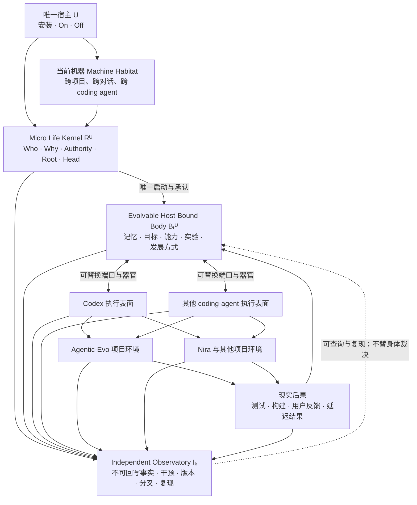
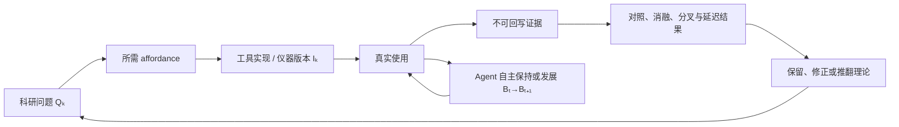

# Agentic-Evo 工具与实验共生开发计划

更新时间：2026-07-29
文档状态：工程与科研同步推进的当前基准
用途：把已经收束的理论转化为可运行研究世界，同时防止工程便利重新定义科研对象。

---

## 1. 核心结论

Agentic-Evo 不能采用下面这种单向顺序：

```text
理论完成
→ 工具完成
→ 部署
→ 收集数据
→ 开始实验
```

因为 Agentic-Evo 工具本身同时是：

1. 用户实际使用的持续 Agent 产品；
2. 承载微型生命核与可进化身体的实验对象；
3. 让 Agent 接触真实 coding 工作的实验环境；
4. 产生纵向数据的实验装置；
5. 允许研究者复现、消融和证伪的科研基础设施。

正确关系是工程与实验的双螺旋：

\[
\boxed{
\text{Real Use}
\rightarrow
\text{Tool State}
\rightarrow
\text{Evidence}
\rightarrow
\text{Agent Development}
\rightarrow
\text{New Real Use}
}
\]

同时：

\[
\boxed{
\text{Experimental Question}
\rightarrow
\text{Required Affordance}
\rightarrow
\text{Tool Construction}
\rightarrow
\text{Observed Result}
\rightarrow
\text{Theory Revision}
}
\]

两条链共享同一个运行中的 Agentic-Evo，但不能共享同一个可任意改写的事实源。

---

## 2. 必须先固定的术语边界

过去文档曾把 Codex 或 Nira 称为“宿主”。这会在工程上错误地把 Agent 身份绑定到某个 App、模型、对话或项目。

本项目从现在起统一使用：

| 名称 | 定义 | 是否维持 Agent 身份 |
|---|---|---|
| 唯一宿主 `Host U` | 安装并拥有开启、关闭权的用户本人 | 是，唯一宿主关系不可重新绑定 |
| 当前机器 `Machine Habitat` | 当前安装、状态连续性和本地算力所在的生活环境 | 承载当前实例，但不等于宿主 |
| 执行表面 `Execution Surface` | Codex、Claude Code 或其他 coding agent | 否，只是 Agent 接入认知与行动能力的端口 |
| 器官 `Organ` | 基础模型、工具、GPU、上下文、子 Agent 等可替换资源 | 否 |
| 项目环境 `Project Environment` | Agentic-Evo、Nira 或其他代码库和外部系统 | 否，是现实任务与后果的一部分 |
| 可进化身体 `B_t^U` | 记忆、目标、能力、实验、器官组织和发展方式 | 是，构成当前活动 Agent |
| 科研仪器 `I_k` | 独立记录、版本、分叉、重放和复现设施 | 否，观察 Agent，但不能冒充 Agent |

因此：

> 第一个真实运行范围不是 Nira，也不是 Agentic-Evo 仓库，而是该用户在当前机器上授权接入的跨项目、跨对话、跨 coding-agent 工作流。

Nira 是一个项目环境和祖先技术材料；Codex 是当前研究工具和首批执行表面之一。

---

## 3. 工具既是实验的一部分，又不能成为循环自证

整个已安装产品可以表达为：

\[
\mathcal P_t^U
=
R^U
\otimes
B_t^U
\oplus
I_k
\oplus
\Pi_t
\]

其中：

- \(R^U\)：微型生命核；
- \(B_t^U\)：当前可进化身体；
- \(I_k\)：第 \(k\) 版独立科研仪器；
- \(\Pi_t\)：连接不同 coding agent、模型、工具和项目的适配边界。

一次可观察运行是：

\[
\operatorname{ObservedRun}_t
=
\operatorname{Observe}_{I_k}
\left(
\operatorname{Enact}
\left(
R^U\otimes B_t^U,
Z_t,
E_t
\right)
\right)
\]

其中：

- \(Z_t\)：当时的模型、coding agent、工具、GPU、上下文和负载；
- \(E_t\)：当时的项目、任务、外部服务和现实条件。

必须永久区分：

\[
I_k\rightarrow I_{k+1}
\neq
B_t^U\rightarrow B_{t+1}^U
\]

\[
Z_t\rightarrow Z_{t+1}
\neq
B_t^U\rightarrow B_{t+1}^U
\]

\[
E_t\rightarrow E_{t+1}
\neq
B_t^U\rightarrow B_{t+1}^U
\]

即：

- 人类升级 recorder、adapter 或实验工具，是科研仪器变化；
- coding agent 或基础模型升级，是器官与资源变化；
- 换仓库、换任务、换外部服务，是环境变化；
- Agent 自主改变专属身体，才可能构成自我进化候选。

如果不分开这些来源，工具越完善，越容易把人类工程进步、模型升级或记录器改写错误归因为 Agent 自我学习。

---

## 4. 四个最小工程边界

当前不按传统产品功能列表拆系统。只保留四个有独立因果作用的边界。

### 4.1 微型生命核

\[
R_t^U
=
\left(
Who,
Why,
Authority,
Root,
Head_t
\right)
\]

它只提供：

- `Gate`：确认宿主开启且调用者具有当前生命周期授权；
- `Bind`：只启动与本 Root、当前 Head 相符的专属身体；
- `ReadHead`：返回当前身体承诺；
- `AdvanceHead`：在父代、Root 和授权成立时原子推进身体承诺；
- `Off`：宿主关闭后停止所有活体计算。

它不提供：

- 能力评分；
- Better 函数；
- 记忆检索；
- 模型路由；
- 候选晋升；
- 学习速度控制；
- `EvolveForever`；
- 对身体内容的语义判断。

### 4.2 专属可进化身体

身体是 Agent 自主发展的空间。它可以形成和替换：

- 自我表示与解释器；
- 记忆、知识、技能和能力组织；
- focus、目标和用户理解；
- 模型、工具与子 Agent 的器官关系；
- 醒来与睡眠活动；
- 实验、分叉、修正和后继身体生成方式；
- 学习算法与元学习结构；
- Runtime 中属于身体的可进化代码。

工程只提供可修改空间、版本、隔离、执行与恢复入口，不规定身体最终采用什么内部 ontology。

### 4.3 独立科研仪器

科研仪器保存身体不能无痕追溯改写的材料：

- Genesis；
- Root、Head、父代和后继关系；
- 当时科研仪器版本；
- coding-agent、模型、工具和算力条件；
- 原始可观察事件；
- 行动和工具结果；
- 即时与延迟现实后果；
- 人类干预；
- 身体修改前后承诺；
- 分叉、冻结、消融和重放条件；
- 后来的解释及其引用来源。

科研仪器不替 Agent 判断：

- 什么值得记住；
- 什么是错误；
- 是否应该改变；
- 哪个候选更好；
- 什么叫能力；
- 哪个身体应成为后继。

### 4.4 执行表面适配器

适配器把临时 coding-agent 会话接入同一机器级身体。它至少区分两条通路：

1. **见证通路**：把可观察事实送入独立科研仪器；
2. **身体通路**：让当前身体读取自身历史、注入醒来上下文、调用器官并在专属空间行动。

二者不能由同一可进化代码无边界控制。否则身体可以通过改 recorder 或隐藏失败制造“进化成功”。

---

## 5. 总体关系图



---

## 6. 为什么旧 Phase 不能原样继续

Nira 中的 Agent Runtime Intelligence Phase 0–2 已经真实实现了部分科研仪器能力。其价值不应丢失，但不能把旧路线继续当作 Agentic-Evo 的产品本体。

### 6.1 可吸收的祖先器官

| 旧能力 | 在 Agentic-Evo 中的意义 |
|---|---|
| 有界 Common Event | 跨执行表面的最小观察信封 |
| correlation / causation / parent span | 因果与执行关系的初始骨架 |
| evidence references | 事实与解释可追溯 |
| facts / inferences / unknowns | 防止把推断伪装成事实 |
| content-safe capture | 避免把秘密、凭据和无界原文复制成第二数据源 |
| failure-isolated ingestion | 记录失败不应让用户任务失败 |
| tree / timeline / compare | Agent 和研究者读取生命史的工具 |
| replay / sandbox / worktree | 反事实、冻结和消融所需隔离 |
| idempotency / receipt / acknowledgement | 区分“声称做了”与现实动作完成 |
| 性能与迁移验证 | 研究装置本身也必须可验证 |

这些应当提取思想后重写最小、机器级、项目无关的实现，不整体复制 Nira 的业务模型。

### 6.2 必须删除或降级为单次实验条件的旧假设

- Nira `project_id / tenant_id / conversation_id / match_id` 作为 Agent 身份边界；
- 七个固定 Agent role；
- 固定 learning-object 类型；
- 固定 `draft / evaluated / promoted / rejected / rolled_back` 状态机；
- 人工或中央 policy gate 选择后继；
- 只有 promoted 版本才能影响未来；
- 固定失败触发器和定时学习批处理；
- 把 rollback 等同于修正；
- 先完成某个项目内部阶段，再抽取独立核心。

旧机制可以作为对照组存在，但不能成为最终 Agent 的先验生命规律。

---

## 7. 机器级而不是项目级的连续性

同一安装只产生一个 Root 和一条活动 Head。项目、对话和 coding agent 只是生命中的局部处境：

\[
\operatorname{Root}
\left(
A_{conversation\_1}^{Codex}
\right)
=
\operatorname{Root}
\left(
A_{conversation\_2}^{Codex}
\right)
=
\operatorname{Root}
\left(
A_{conversation\_3}^{OtherAgent}
\right)
\]

只要三者属于同一用户授权的同一安装。

需要避免三种伪连续：

1. 每个仓库各有一份独立“长期记忆”；
2. 每个 coding agent 各自维护一个用户画像；
3. 多个对话读取同一数据库，但读取内容从未进入同一身体的行动—后果—再组织循环。

真正的跨对话连续是：

```text
同一身体进入一次临时认知状态
→ 经某个 coding-agent 端口行动
→ 现实后果回到同一身体
→ 身体保持或发生变化
→ 后继身体经另一个对话、项目或 coding agent 再次表达
```

---

## 8. 当前 Codex 接入端的可用事实

截至 2026-07-30，Codex 提供用户级 lifecycle hooks。用户级 hook 独立于项目目录，可在跨仓库会话中运行。当前官方 Hook 合同可用于首个适配器的事件包括：

- `SessionStart`；
- `UserPromptSubmit`；
- `PreToolUse`；
- `PermissionRequest`；
- `PostToolUse`；
- `PreCompact` / `PostCompact`；
- `SubagentStart` / `SubagentStop`；
- `Stop`；
- `SessionEnd`。

可观察字段包括 session、turn、cwd、model、tool name、tool input、tool response 和部分 transcript reference。`SessionStart` 可以向当前认知状态提供附加上下文。当前事件清单依据 [Codex Hooks 合同](https://learn.chatgpt.com/docs/hooks)；Agentic-Evo 的全局 Hook 尚未安装或做自然 session 集成测试，所以 install plan 仍把映射标为 planned / not installed / not integration tested。

工程边界：

- hook 事件可以成为当前 Codex 见证通路；
- `SessionStart` 可以成为醒来入口；
- MCP、CLI 或本地 API 可以成为身体主动读取和行动的接口；
- transcript 文件格式不是稳定协议，不作为唯一事实来源；
- hosted tool 和特殊工具可能不经过同一 hook 路径，因此必须记录观测缺口；
- Codex hook 是当前端口能力，不进入 Agentic-Evo 本体。

其他 coding agent 使用各自公开、可验证的生命周期接口映射到同一机器级运行时。若某个工具没有可靠接口，应明确记录覆盖缺口，而不是通过盲目读取整台机器内容假装“全量观测”。

---

## 9. 工程与实验的双螺旋工作方式

每个开发循环必须同时交付两种结果：

| 工程结果 | 科研结果 |
|---|---|
| 新的研究世界 affordance | 它允许检验的具体主张 |
| 新的可观察事件 | 可排除或新增的竞争解释 |
| 新的隔离或分叉能力 | 一个可复现的反事实 |
| 新的执行表面适配器 | 跨端口保持与迁移证据 |
| 新的身体修改通路 | 自我作者与人工修改的区分 |
| 新的现实结果回流 | 行为与长期后果证据 |
| 新的仪器版本 | 受影响实验区段和可比性声明 |

统一循环是：



“先使用再完善”不等于允许不可解释的数据漂移。每次仪器变化都形成新的版本边界：

\[
\operatorname{Regime}_k
=
\left(
I_k,
Protocol_k,
Coverage_k
\right)
\]

跨 regime 的结果可以比较，但必须把仪器变化作为显式干预，而不能假设前后完全同质。

---

## 10. Genesis 与自举边界

工具在能够观察自己之前，必然有一段由人类建设的 bootstrap 历史。

定义：

```text
Pre-Genesis
→ 人类建设最小微核、身体空间、独立证据和首个适配器
→ 这些变化是科研基础设施，不是 Agent 自我进化证据

Genesis
→ 用户开启并产生唯一 Root、Body₀、Head₀
→ 冻结当时仪器版本 I₀ 与初始资源条件
→ 从此开始同一生命的正式纵向记录

Post-Genesis
→ Agentic-Evo 用于开发 Agentic-Evo 自己及其他真实项目
→ Agent 自主变化、人类仪器变化、模型变化和环境变化分别标记
```

在 Genesis 后，人类仍可以修复科研仪器，但：

1. 必须记录为 `Instrument Change`；
2. 不得把该变化产生的收益算作 Agent 自主学习；
3. 若人类直接指定学习目标、编写身体知识、选择后继或修改评价结果，记录为 `Human Learning Intervention`；
4. 受影响区段不能进入“零人工学习介入”主张，除非作为明确对照。

---

## 11. 第一条完整生命循环

这不是常规 MVP，也不是“先只做 observability”。它是最终架构的第一次完整呼吸：

```text
安装 / Genesis
→ 产生唯一 Root、Body₀、Head₀
→ 用户保持 On，Runtime 等待事件
→ 任一 coding-agent 执行表面触发唤醒
→ 微核 Gate / Bind 当前 Head
→ 记录任务前的身体、仪器、模型、工具和环境状态
→ 当前身体通过该端口完成真实 coding 任务
→ 行动、工具结果和现实后果进入独立证据层
→ 身体自主决定等待、回忆、实验、修改或保持不变
→ 自我修改只发生在专属身体或隔离分支
→ 微核验证 Root、父代和授权，原子 AdvanceHead，但不判断“更好”
→ coding agent 断连后进入睡眠或完全等待
→ 新对话、新项目或另一个 coding agent 再次唤醒同一 Root / Head
→ 延迟结果继续返回同一谱系
→ 用户 Off 后所有活体计算、睡眠和自动恢复停止
```

第一条生命循环只声称验证：

- 机器级唯一身份；
- 跨对话、跨项目连续性；
- 至少一个真实 coding-agent 接入端；
- 身体与科研证据分离；
- 合法 Head 推进；
- 睡眠或等待后的恢复；
- Off 的真实终止；
- 人类、Agent、器官和环境变化来源可区分。

它不声称已经证明：

- 记忆形成了能力；
- Agent 已经自我学习；
- 身体变化一定更好；
- 自主实验已经有效；
- 已经发生自我进化或元进化。

---

## 12. 首次纵向实验与工具开发同时开始

第一条真实实验不是在一个人造 benchmark 中开始，而是在 Agentic-Evo 自己的开发中开始。

最早问题是：

> 经历真实任务后，自主可写身体相对于同祖先冻结身体，是否在尚未见过的未来任务中产生资源匹配、可保持、可归因的差异；这种差异换对话、项目或 coding-agent 执行表面后是否仍由同一 Root / Head 表达？

因此首次实现必须同时具有：

- 微型生命核；
- 专属身体空间；
- 当前 Head 与父代关系；
- 一个机器级通用接入协议；
- 至少一个真实 coding-agent 适配器；
- 不可回写证据；
- 睡眠、等待、唤醒和 Off；
- 冻结、分叉与恢复；
- Human Learning Intervention ledger；
- 资源、环境和仪器版本记录。

详细协议见[《实验 001：机器级连续生命循环》](../../experiments/001_机器级连续生命循环.md)。

---

## 13. 并行工作流，而不是串行 Phase

以下工作流从第一天并行推进。编号表示依赖关系，不表示做完一项才允许开始下一项。

### W-A：Identity / Kernel

- Genesis；
- Root 与 Head；
- 身体唯一绑定；
- `Gate / Bind / ReadHead / AdvanceHead / Off`；
- 原子推进、崩溃恢复和不可冒充测试。

### W-B：Body / Development Space

- 专属可写空间；
- 身体 manifest 与内容寻址；
- 当前身体与隔离分支；
- 允许 Agent 自主改变而不接触生产项目；
- 不固定身体内部 schema。

### W-C：Independent Observatory

- append-only 原始事实；
- 事件完整性；
- 人工干预分类；
- 模型、工具、环境和仪器版本；
- 即时与延迟后果；
- 查询、导出和复现。

### W-D：Machine Runtime

- 单安装、单活动 Root；
- 事件唤醒；
- awake / sleep-or-wait / off；
- 本地 IPC；
- 资源边界；
- 故障隔离；
- 全局而非项目级生命周期。

### W-E：Execution-Surface Adapters

- Codex 用户级 adapter；
- 其他 coding-agent adapters；
- 见证通路与身体通路分离；
- 明确覆盖范围和观测缺口；
- 同一 Root / Head 的跨端口恢复。

### W-F：Experiment System

- 共同祖先冻结；
- 历史分叉；
- body ablation；
- 资源匹配；
- 延迟结果回流；
- Human Learning Intervention 标记；
- 可复现实验包。

### W-G：Self-Hosting

- Agentic-Evo 观察 Agentic-Evo 的真实开发；
- 每个工具改动标记作者与信任域；
- 自主身体变化与人类仪器变化分开；
- 失败和负结果不得删除。

---

## 14. 工程契约与开放算法的分界

### 人类必须实现的工程契约

- 同一安装只有一个活动 Root；
- 其他 Root 不能启动该身体；
- Head 原子推进且有父代证据；
- Off 真正停止；
- 原始事实不可被身体无痕覆盖；
- 人工干预、器官变化和环境变化可辨认；
- 反事实分支不污染活动 Head；
- 私密原始数据不进入 Git；
- 观测缺口被显式记录；
- 失败可恢复但不能被伪造成未发生。

### 不能由人类预写成唯一算法的内容

- 记忆格式；
- episode 切分；
- 何时回想；
- 哪个信号值得学习；
- 什么是常识；
- 何时睡眠计算；
- 如何产生实验；
- 什么能力应被保留；
- 如何评价后继；
- 何时推进身体；
- 如何迁移到新模型；
- 如何改进学习算法；
- 什么叫当前阶段的 Better。

工程契约保护科研世界成立；开放算法保留 Agent 成为最终实验者的空间。

---

## 15. 数据与隐私原则

机器级连续性不意味着无边界复制机器内容。

默认只记录：

- 有界结构化事件；
- 内容哈希；
- 明确批准的摘要；
- 文件或工件引用；
- 执行结果；
- 模型、工具和环境元数据；
- 研究所需的前后状态承诺。

默认不记录：

- 凭据、token、cookie、私钥；
- 完整环境变量；
- 隐藏推理链；
- 无界原始对话；
- 无界工具输入输出；
- 未授权项目内容；
- 与 coding-agent 生命周期无关的机器活动。

“覆盖所有 coding agent”表示覆盖所有已授权执行表面，不表示通过键盘记录、屏幕抓取或全盘监控绕过执行表面的明确边界。

---

## 16. 当前停止点与下一工程动作

本文件已经完成：

- 工具与实验同步推进的因果关系；
- 宿主、机器、执行表面、器官和项目环境的术语分离；
- 科研仪器与可进化身体的信任域分离；
- 旧 Nira Phase 0–2 的吸收和废弃边界；
- 首个机器级完整生命循环；
- 工程契约与 Agent 开放算法的分界。

继续在人类层面规定记忆、学习、候选或评价算法会再次越过理论停止点。

首条 `Trusted State + Body Space + Machine Runtime + Witness service/process rehearsal + Codex Adapter` 纵切面已经形成 Pre-Genesis 代码。身份锚、Head、Authority、session、evidence 与本地 checkpoint 已经能够在一个 SQLite 事务中原子提交；Surface session 已以 `(execution_surface, session_id)` 真实复合主键贯穿 `trusted-v2 / runtime-v3 / public-v2 / Codex SessionEnd`，并由带版本域的结构化 hash 进入 checkpoint。相同裸 ID 的跨 surface 并存、精确 sleep、reload 和错误 value 拒绝已经验证；旧 trusted/public v1 明确 fail closed。Current Body lease 的逻辑状态机、一次性推进、authority epoch 与候选归属也已形成。固定 dev-home 的 foreground service 已经把公共 Surface、Off-only control rehearsal 与 exact-Head Body 分开；Codex adapter 的实现路径不再直接打开 trusted state。最小 CLI、Off/crash/restart/tracked-service cleanup 演练及 Windows/macOS/Linux 零安装副作用 plan 也已完成。Windows 已形成四个 foreground 局部组件：Job Object、认证 public pipe、restricted Low-Integrity suspended Body、explicit inherited private lineage transport rehearsal。内部 supervisor stop 又建立了统一 dispatch cutoff：已连接但未 admission 的请求不能越过 cutoff；listener/active transports 先被唤醒和关闭，已 admission 请求归静后 `request_stop()` 才返回；service loop 随后 join workers、回收 Body/lease/Witness 并释放 singleton。stop 路径自身没有可信状态增量，但 cutoff 前已 admission 的合法请求仍可恰好提交一次；每条 transport 的 raw close 由单一 owner 串行化。它没有被暴露成 public Off。该关节已在 Windows 与 WSL Ubuntu-24.04 实测，macOS 尚未实机。无特权切片生成了不依赖用户 Python/checkout 的 exact SCM-only probe bundle，验证普通控制台入口以 1063 fail closed，并拒绝篡改与 junction cleanup；独立审查同时删除了固定返回 JSON 的伪 verifier/attacker，把状态严格降为 `scm_probe_bundle_ready`。随后一次宿主批准、外部固定摘要的 UAC 配置探针短暂创建随机 SCM service，回读 restricted SID 与 protected ACL，并由提升端和普通权限端双重确认 service、artifact tree、state tree 全部清零。service 从未启动，系统未重启，token/攻击矩阵均未运行。Body 请求真实穿过子进程并绑定 authoritative Witness response，但 foreground 同用户仍能改代码或未受保护 state；SID 不等于 HostPresence，Off 仍是 generic / unverified，完整 Gate A/Gate B、运行中 SCM principal、service-owned protected state 与安装态证据均未形成。

截至该停止点，Windows 全仓 151/151 项测试在 `ResourceWarning` 作为错误时通过；WSL Ubuntu-24.04 发现同样 151 项，其中 126 项通过、25 项 Windows-only contract 明确 skipped；macOS 仍未实机。该数字证明回归合同为绿，不把 `gate_a_complete=false`、`gate_b_outcome=not_established`、`native_security_verified=false` 或 `ready_to_install=false` 改写为真。

当前真实状态、已验证性质和 Genesis 阻断项见[《实现状态：Pre-Genesis》](实现状态_Pre-Genesis.md)。

下一工程动作是：

> Python 可移植层、跨 Surface 复合 session identity、Windows 四个 foreground 局部组件、SCM probe bundle 与一次 config-only UAC cleanup/handoff 已完成。下一步在无新增 UAC 副作用的工程线上建立独立 verifier/real-attacker 的最小合同、可执行入口和不可伪造的“未运行/失败/通过”证据语义；它不能根据 receipt 存在或 service 自报直接返回成功。下一次 Windows 权限实验仍需另获“保留临时 service + system restart”授权，才建立运行中 SCM principal、读取 restricted token，并在临时可逆安装中复验 service-owned state、public/Body capability、同账户攻击、崩溃恢复与卸载。独立 HostPresence 仍后置。`gate_a_complete=false`、`gate_b_outcome=not_established`、`native_security_verified=false` 与 `ready_to_install=false` 继续成立；只有真实 token、权限攻击、安装与卸载演练完成后，才由用户明确启动唯一一次正式 Genesis。

本轮完整推导、公式、关系图和证明上限见[《跨平台 CLI、Off 控制与零安装副作用计划》](跨平台CLI与Off控制演练.md)、[《Windows 原生 Witness 边界》](Windows原生Witness边界.md)与[《受限 Body 与私有谱系能力演练》](受限Body与私有谱系能力演练.md)。

Genesis 后立即让它参与 Agentic-Evo 自身及机器中其他真实 coding 项目的开发，使工具使用和正式纵向数据生成同时开始。
