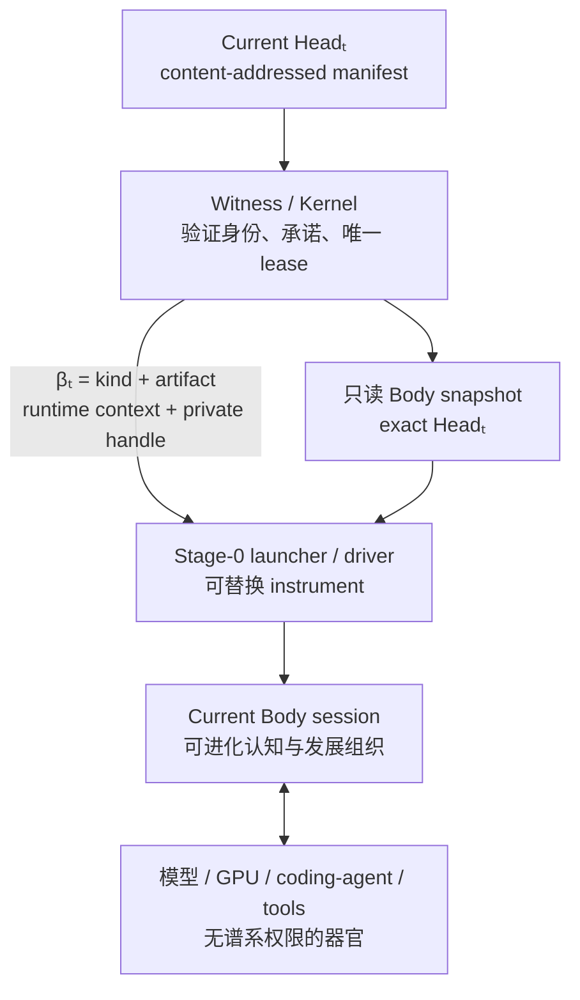

# 最小 Body 启动契约

更新时间：2026-07-30
状态：理论停止点与 Pre-Genesis 数据契约已形成；真实受保护进程启动尚未实现
用途：回答 Witness 怎样从 exact Head 实例化 Body，而不理解其内部记忆、技能、模型路由和学习算法

---

## 1. 问题不是“用什么语言启动”

本轮问题是：

> Witness 如何从一个内容寻址、内部 schema 可自由进化的 Head，启动“恰好这个身体”，同时不把 Python、某个 Agent 框架或某种记忆结构冻结成永久形式？

第一性原理给出的第一个结论是否定式：

\[
\boxed{
\text{不存在无解释器的任意 Body 启动}
}
\]

若 Body 的出生材料是任意字节 \(\beta_t\)，它成为运行中身体至少需要一个 Stage-0：

\[
\boxed{
P_t
=
L_v(
\beta_t,
RO(Head_t),
C_t
)
}
\]

其中：

- \(L_v\) 是当前版本的 launcher / activation driver；
- \(RO(Head_t)\) 是 exact Head 的只读身体视图；
- \(C_t\) 是本次启动上下文；
- \(P_t\) 是被实例化的 Body 权限域或进程树。

解释器继续向下递归，最终必然落到操作系统的进程 ABI、CPU 指令集和硬件上。这个“关节”无法消除。真正需要避免的不是解释器存在，而是：

1. 让不可进化的 Witness 理解 Body 内部语义；
2. 把某个当前解释器误写成 Agent 永久本体；
3. 让 Body manifest 向高权限 Witness 注入任意 shell、命令行或环境变量。

---

## 2. Head 不是正在运行的身体

Head 更接近基因组与发育种子的承诺，而不是进程内每一时刻的完整状态：

\[
Head_t
=
Hash(M_t)
\]

\[
M_t
=
\{
Root,\ ParentHead,\ Generation,\ \beta_t,\ Files_t
\}
\]

同一 Head 在不同模型、GPU、操作系统、launcher 版本和现实环境中可以产生不同表现：

\[
\boxed{
Phenotype_t
=
Develop(
Head_t,
Substrate_v,
Environment_t
)
}
\]

这不破坏身份连续性。它意味着：

- Head 承诺可遗传的出生材料；
- 模型、GPU、coding agent 和 activation driver 是当前发育条件或器官；
- 运行中的临时思考、缓存和 scratch 不自动成为遗传内容；
- 只有新 Head 承诺的内容才进入下一代可重建身体。

生物也不存在 DNA 脱离细胞质、核糖体和环境自行启动。Agentic-Evo 不应追求一个不存在的“纯 Head 自启动”，而应寻找尽量薄、可替换、可见证的发育关节。

---

## 3. 最小不可约出生信封

按奥卡姆剃刀，Head 内的最小 activation descriptor 只有：

```text
activation_kind
activation_artifact
```

定义：

\[
\boxed{
\beta_t
=
(k_t,p_t)
}
\]

- \(k_t\)：带版本的不透明 activation kind，说明由哪一类 Stage-0 adapter 接管；
- \(p_t\)：Body 内的 activation artifact 相对路径。

artifact 的摘要不在 manifest 中重复存储：

\[
\boxed{
d_t
=
M_t.files[p_t]
}
\]

因为：

1. `files[path]` 已经承诺 artifact digest；
2. Head 已经承诺完整 manifest；
3. 再存一份 digest 只会制造两个可能漂移的真相源。

但 runtime 在一次 wake 的返回值和证据中可以展开：

```text
activation_kind
activation_artifact
activation_digest
```

这不是增加第二份持久真相，而是把当前 Head 中已经承诺的关系显式呈现给调用方。

### 3.1 为什么必须有 `activation_kind`

只有 artifact 路径仍然无法回答怎样解释字节：

```text
boot/body
```

它可能是：

- 给 coding-agent 的 UTF-8 context；
- 原生可执行文件；
- WASM module；
- 自带解释器的 bundle；
- 未来 Agent 发明的新发育格式。

若没有 versioned kind，当前硬编码的读取方式就会成为隐形永久协议。显式 kind 让这种依赖变得可观察、可拒绝、可升级，并被归类为 instrument 条件。

### 3.2 为什么不能自动选择第一个文件

以下 fallback 已被删除：

```text
指定入口不存在
→ 改用 entrypoint.md
→ 再改用按名称排序的第一个文件
```

它违反 exact-body：

\[
Requested(p_a)
\land
Activated(p_b)
\land
p_a\neq p_b
\]

显式选择不存在时必须失败。否则系统启动的是“某个还能运行的东西”，不是 Head 明确承诺的出生材料。

---

## 4. 三层边界



三层职责不可混淆：

| 层 | 只负责什么 | 不负责什么 |
|---|---|---|
| Witness / Kernel | 当前 Head、完整性、只读视图、唯一 Body session、私有 lineage lease、撤销 | 不解析记忆、技能、目标、模型路由或学习算法 |
| Stage-0 driver | 按一个已安装的 `activation_kind` 把 artifact 与 runtime context 交给 Body execution domain | 不拥有 Root、Head 推进权或科研见证密钥 |
| Body | 解释自己的内部 schema，使用器官，形成候选和改变自身 | 不能改写自己的 Root、出生历史或 Witness |

driver 被攻陷至多等价于“当前身体做错事并可能提交坏候选”，不能因此获得重写 Root、历史、Off 或 Witness 的权限。

---

## 5. exact activation 与 exact boot

当前 Pre-Genesis 实现能够证明的是 exact activation reference：

\[
\boxed{
\begin{aligned}
ExactActivationRef(A_t,H_t)
\iff\;&H_t=CurrentHead\\
\land\;&Hash(M_t)=H_t\\
\land\;&A_t.kind=M_t.activation\_kind\\
\land\;&A_t.path=M_t.activation\_artifact\\
\land\;&A_t.digest=M_t.files[A_t.path]\\
\land\;&Hash(Bytes(A_t))=A_t.digest
\end{aligned}
}
\]

未来受保护 service 建立真实 Body session 后，才可以升级成 exact boot：

\[
\boxed{
\begin{aligned}
BootBound(s,t)\iff\;&On\\
\land\;&Hash(M_t)=Head_t\\
\land\;&\beta_t\in M_t\\
\land\;&Hash(ROView_s)=Head_t\\
\land\;&SpawnHead(h_s)=Head_t\\
\land\;&UniqueLease(Root)\\
\land\;&Peer(h_s)=SpawnedBodyPrincipal
\end{aligned}
}
\]

它证明：

> 当前 Head 承诺的不可变出生材料被交给了唯一、受限并持有本次私有 lineage channel 的 Body 权限域。

它不证明：

> Body 理解、采用或执行了每一份出生材料的预期语义。

因此：

\[
\boxed{
Ready_s
\not\Rightarrow
ExecutedSemantics(B_t)
}
\]

一个 Body 可以忽略自己的一部分文件；那也是这个身体在当前环境中的行为。Witness 不应升级为思想审查器去判断“它有没有真的理解自己”。

---

## 6. runtime context 不属于 Head

一次真实 boot 还需要本次环境材料：

```text
root
head
boot_session
nonce
readonly_body_handle
scratch_handle
private_lineage_handle
organ_broker_handles
```

这些属于 \(C_t\)，不属于 \(\beta_t\)：

- session 与 nonce 每次醒来都不同；
- handle 是 OS capability，不能被序列化为永久 Body 文件；
- scratch 是本次运行的临时空间；
- organ availability 是环境条件；
- private lineage handle 的含义保存在 Witness lease 中。

秘密和 capability 不进入：

```text
argv
environment variables
prompt
Body files
public surface IPC
```

Head 改变、Host Off、worker 死亡、超时或一次合法推进后，旧 handle 必须失效。

---

## 7. 当前实现的准确含义

当前代码已把 Body manifest 升级为：

```text
agentic-evo-body-v2
```

并形成以下数据契约：

1. `activation_kind` 与 `activation_artifact` 必须同时存在或同时不存在；
2. 显式 artifact 必须位于同一 Head 的 `files` 中；
3. 子代未显式改变 descriptor 时可以继承父代，但继承入口若未包含在新身体中则失败；
4. 不再从 `entrypoint.md` 或第一个文件猜测入口；
5. `wake()` 返回当前 Head 的 kind、path、digest 和 bounded projection；
6. 当前唯一支持的 kind 是 `surface-context-utf8-v1`；
7. 未知 kind 可以保留为候选，但在当前 instrument 支持前不能成为 Current Head；
8. Genesis 的未知 kind 在任何出生状态写入前被拒绝，失败后同一路径仍可重试；
9. artifact 在实际读取后再次计算 digest，不能把 manifest 校验前后的替换字节作为有效 activation 返回。

`surface-context-utf8-v1` 的准确含义只是：

```text
读取 Head 承诺的 artifact bytes
→ 按 UTF-8 replacement 规则解码
→ 截取最多 8000 字符
→ 注入 Codex SessionStart additionalContext
```

它是一个 execution-surface projection，不是独立 Body 进程，不持有真实 OS-private lineage capability，也不能证明已经完成 exact boot。仓库后来实现的 `CurrentBodySession` 只是 lease 协议的进程内演练，不改变这个结论。

`wake()` 的 session 登记、evidence、checkpoint 与 revision 现已进入同一 SQLite 事务；插入失败或 checkpoint 前进程退出不会留下 ghost session。该实现与证明边界见[《单一可信事务域》](单一可信事务域.md)。exact-Head lease 的逻辑语义、authority epoch 与一次性推进也已实现，见[《Current Body 私有会话租约》](CurrentBody私有会话租约.md)。尚未解决的是 OS 级私有来源：当前代码能证明正常路径的编排与互斥，还不能证明请求只能由 Current Body principal 发出。

因此当前成立：

\[
ExactActivationRef
\]

当前尚不成立：

\[
BootBound
\]

---

## 8. 为什么本轮不实现通用 runner

本轮明确不增加：

- `boot.json`；
- 任意 `command / argv / env`；
- shell、shebang 或 `PATH` 查找；
- Python plugin registry；
- WASM runtime；
- container runtime；
- 跨平台 launcher factory；
- Body 自报的权限 DSL；
- 假装私有的 bearer token。

原因不是这些技术永远无用，而是当前还没有受保护 Witness principal、只读 Body snapshot 和 OS-private session channel。逻辑 lease 已存在，但此时直接执行任意 Body 代码仍只能制造“看起来启动了身体”的假证明，并扩大普通用户权限下的攻击面。

最终固定的只是很薄的物理关节：

```text
OS 进程 ABI
+ 受保护 Witness 的 spawn 路径
+ versioned activation-kind handoff
```

Python、Native、WASM、自带解释器或未来格式都属于可替换的 Body execution domain / instrument，而不属于身份微核。

---

## 9. activation kind 怎样进化

新的 Body 可以提出新的 \(k_{t+1}\)，但“提出格式”和“当前环境已经能实例化格式”是两件事：

\[
\boxed{
ProposedKind
\neq
AvailableInstrument
}
\]

当新 driver 已经存在并通过对应平台验证后，instrument 变化应单独留下证据：

```text
instrument_change
old_driver_version
new_driver_version
supported_activation_kind
platform
```

同一 Head 在不同 driver 版本下表现不同，也必须作为环境差异进入科研分析：

\[
\Delta Phenotype
=
f(
\Delta Body,
\Delta Instrument,
\Delta Environment
)
\]

不能把 instrument 升级伪装成 Body 自我进化，也不能因为 driver 属于实验条件就把它冻结进灵魂。

---

## 10. 可证伪条件

### 10.1 当前数据契约已覆盖

1. 显式 artifact 不存在时，Body candidate 创建失败；
2. 当前 Head、artifact path 与 digest 必须来自同一已验证 manifest；
3. unknown activation kind 在 Head 推进前失败；
4. 不允许回退到 `entrypoint.md`、第一个文件或系统默认解释器；
5. artifact bytes 被修改后，manifest 完整性验证失败；
6. manifest 验证与实际读取之间发生 blob 替换时，读取后的 digest 复核失败；
7. unsupported Genesis kind 不产生 Body、Kernel 或不可重试的出生 marker。

### 10.2 真实 boot 仍需覆盖

1. materialize 后、lease 激活前发生 Head advance 或 Off，旧进程不能成为 `LIVE`；
2. 用户在验证与启动之间替换文件、symlink 或 reparse point，执行字节不变或启动失败；
3. 修改 `PATH`、系统 Python 或 shell 配置不能改变强契约入口；
4. 两个并发 worker 至多一个取得有效 private lineage channel；
5. crash、Witness restart、旧 nonce、旧 Head 和旧 handle 都不能推进谱系；
6. Body principal 不能读取或写入 Witness DB、Root key 与 checkpoint key；
7. 同一 Head 更换 driver 版本必须留下 instrument evidence；
8. 伪造 `Ready` 只能证明 channel liveness，不能升级为“Body 已理解自己的语义”。

---

## 11. 当前停止点

本轮已经得到不可再删除的结论：

1. 无解释器启动任意 Body 在逻辑上不成立；
2. 最小出生信封是 `activation_kind + activation_artifact`；
3. artifact digest 已由 Head 的 file map 承诺，不在 manifest 重复；
4. Witness 只验证身份、材料、权限域和 lease，不理解身体语义；
5. 当前 UTF-8 context 只是首个 surface adapter，不是永久身体形式；
6. 当前代码只证明 exact activation reference，不冒充 exact boot；
7. 在受保护 Witness、Body principal 和私有 channel 建立前，不执行任意 Body 代码。

下一项问题已经自然出现：

> 新 activation kind 或新 Body 在成为 Current Head 前，是否需要一次没有谱系推进权限的 probation boot；若需要，怎样证明“可实例化”而不让 evaluator 决定 Body 是否“足够好”？

这个问题属于下一轮。最小 Body Boot Contract 可以在这里停下。

该问题已经在[《候选试生与 Head 推进》](候选试生与Head推进.md)中收束：mandatory gate 只验证 exact candidate 的有限可实例化；语义 rehearsal 与候选选择属于 Current Body，不能成为 Witness 的固定 evaluator。Current Body lease 的逻辑协议也已在[《Current Body 私有会话租约》](CurrentBody私有会话租约.md)中收束；真实 probation session 与真实 Body capability 仍等待受保护 spawner、独立 principal 与私有 IPC。
