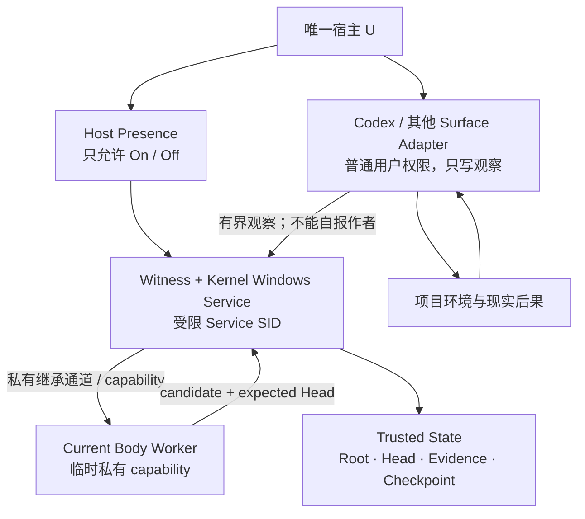
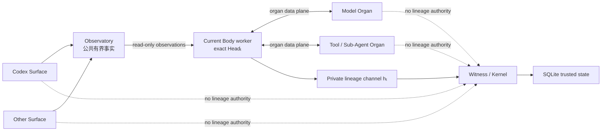

# 最小可信边界与来源证明

更新时间：2026-07-29
状态：下一轮攻克中的当前工程结论
用途：解决微核、科研见证和 `agent_self_authored` 在同一机器上的真实可信边界

---

## 1. 本轮问题

当前 Pre-Genesis 代码已经能够检测局部损坏、串行化生命周期变化并维持 Root / Head，但 Kernel、Body、adapter 和 evidence 仍运行在同一 Windows 用户权限中。

因此本轮不是继续增加哈希字段，而是回答：

> 当用户、coding agent、模型工具和当前 Body 都可能经由同一普通用户账号运行时，什么事实仍可被独立证明？

必须分开三个主张：

1. **身份完整性**：普通 Body 不能改 Root、Head 或 On / Off；
2. **科研见证完整性**：普通 Body 不能重写历史后重新伪造有效见证；
3. **作者来源**：一次后继变化究竟从 Body、人类研究干预还是科研仪器通道产生。

三者不是同一个问题，也不能靠同一把本地 HMAC 自动解决。

---

## 2. 来源不可区分定理

若人类与 Agent 使用同一个 principal、同一个凭据和同一个写入 API，则服务观察到的轨迹可以完全相同：

\[
\operatorname{Obs}(Call_A)
=
\operatorname{Obs}(Call_H)
=
\tau
\]

于是：

\[
\boxed{
\nexists f(\tau)
\text{ 能可靠判定调用究竟由 Agent 还是人类创作}
}
\]

这意味着以下材料都不能单独证明来源：

- 调用者上传的 `author_kind`；
- 模型说“这是我自主决定的”；
- 文本风格、解释或自我批评；
- Git author；
- PID、进程名或可由同一用户启动的 CLI；
- 放在同一用户目录中的第二把密钥；
- 从自然语言内容猜测用户是否在“教”Agent。

密码学能够证明的是：

> 哪个受保护通道提交了这次操作。

它不能证明主观意图，也不能证明一次思想完全没有受到用户语言影响。

---

## 3. 操作性来源定义

因此 `agent_self_authored` 不再定义为某段文本“看起来像 Agent 写的”，而定义为：

\[
\boxed{
\operatorname{SelfAuthored}(x)
\iff
\operatorname{Ingress}(x)=Cap_{Body_t}
\land
\operatorname{Parent}(x)=Head_t
}
\]

其中 \(Cap_{Body_t}\) 不是写进文件、环境变量或 prompt 的 bearer token，而是服务与当前 Body runtime 之间的私有 OS 连接，以及 Witness 端绑定该连接的临时租约。

同理：

| 受保护入口 | 可执行操作 | 服务派生的来源 |
|---|---|---|
| Surface observer | 追加有界任务、纠正与现实结果 | `normal_host_interaction` 或 `surface_unverified` |
| Current Body capability | 提交当前 Root / Head 的后继 | `agent_self_authored` |
| Host-presence channel | 仅 On / Off | `host_authority` |
| Instrument release channel | 更换 recorder、adapter、protocol | `instrument_change` |
| Research intervention channel | 只写已声明实验分支 | `human_learning_intervention` |
| 无法认证或跨通道 | 不进入强结论 | `unknown` |

调用者不再提交最终 `author_kind`。Witness 根据认证入口生成来源。

证据信封应把过去混在一个字段里的概念拆开：

```text
ingress_principal
operation
affected_domain
intervention_classes[]
causal_refs[]
```

一次变化可以同时属于多个 intervention class。例如，科研仪器升级若同时替换了 Body，不能只写成 `instrument_change` 来洗掉 Human Learning Intervention。

---

## 4. 最小可信计算基

最终不可自我改写的边界只需要：

\[
\boxed{
TCB_{\min}
=
OSKernel
+ WitnessKernelService
+ HostPresenceVerifier
}
\]

其中 `WitnessKernelService` 只拥有：

```text
Root custody
+ Head CAS
+ Authority state
+ monotonic revision
+ provenance derivation
+ evidence/checkpoint signing
```

它不拥有：

- 记忆算法；
- Better 函数；
- evaluator；
- 模型路由；
- 能力评分；
- 学习目标；
- 候选生成方式；
- 是否应改变的判断。

Body 仍然是可进化且不可信的。TCB 只限制它不能重写自己的出生、当前身份和科研见证。

---

## 5. 一个服务，不是五个 daemon

不同 authority 不等于必须运行五个后台程序。最小拓扑是一个受保护服务加一个受限 Body worker：



关键边界：

- Surface adapter 不能推进 live Head；
- 普通用户 pipe 不能声称 `agent_self_authored`；
- Body capability 不能 On / Off、改 instrument 或改历史；
- Host-presence channel 不能写 Body；
- HLI 只能进入显式实验分支，不能成为 live Head 的隐藏配置口。

---

## 6. Windows 上的最小真实隔离

当前机器上的最小可验证路径是：

```text
普通用户 / coding agents
→ 显式 DACL 的本地 named pipe
→ AgenticEvoWitness Windows Service
→ service-SID 专属 ProgramData 状态目录
```

### 6.1 Service principal

- 服务以 `LocalService` 启动；
- 为 `AgenticEvoWitness` 启用 restricted per-service SID；
- 服务程序位于普通用户不可写的 `Program Files`；
- 状态位于 `ProgramData\Agentic-Evo`；
- 状态目录关闭继承，只允许 SYSTEM 与该 service SID 写入；
- 普通 coding-agent 对 Root / Head 承诺可读，但不能直接写状态或读取 witness key。

Windows 会给服务进程生成访问令牌，并用该令牌与对象安全描述符进行访问检查。见微软的 [Service User Accounts](https://learn.microsoft.com/en-us/windows/win32/services/service-user-accounts) 和 [SERVICE_SID_INFO](https://learn.microsoft.com/en-us/windows/win32/api/winsvc/ns-winsvc-service_sid_info)。

### 6.2 Named pipe

named pipe 必须使用显式 DACL，并拒绝远程 client。默认 pipe descriptor 会给 Everyone 与 Anonymous 读权限，不能采用。

服务只授予实际需要的数据读写权限，不能简单授予 `FILE_GENERIC_WRITE`，因为它同时包含创建 pipe instance 的能力。见微软的 [Named Pipe Security and Access Rights](https://learn.microsoft.com/en-us/windows/win32/ipc/named-pipe-security-and-access-rights)。

服务可短暂 impersonate client，读取 `TokenUser`，与安装时绑定的宿主 SID 比较，然后立即恢复自身身份。但这只能证明“来自该普通用户”，不能区分该用户下的人类、Codex 或其他进程。

### 6.3 密钥

以下方案不构成隔离：

- 宿主用户上下文的 DPAPI CurrentUser；
- `CRYPTPROTECT_LOCAL_MACHINE`；
- 用户目录中的 bearer token；
- 环境变量 token；
- 同一用户的 Credential Manager secret。

微软明确说明 `CRYPTPROTECT_LOCAL_MACHINE` 保护的数据可由同机任意用户解密，见 [CryptProtectData](https://learn.microsoft.com/en-us/windows/win32/api/dpapi/nf-dpapi-cryptprotectdata)。

第一条本机实验可以先使用服务目录 ACL 保护的随机 witness key，但只能称为本机 MAC witness。发表级公共验证再使用 CNG 持久化非导出 ECDSA key，只公开 public key。CNG 的 key isolation 能让长期 private key 不出现在应用进程中，见微软的 [Key Storage and Retrieval](https://learn.microsoft.com/en-us/windows/win32/seccng/key-storage-and-retrieval)。

### 6.4 管理员边界

当前用户可以通过 UAC 成为管理员。提权管理员可以接管 ACL、替换服务程序或回滚整机状态。

因此本机实验的真实威胁模型是：

```text
能够抵抗普通用户权限下的 Body、coding agent 和项目代码
≠
能够抵抗宿主主动使用管理员权限篡改整个实验
```

若科研主张需要抵抗管理员级整机回滚，必须增加机器外 checkpoint、独立硬件或远端透明日志。

---

## 7. 为什么普通用户 pipe 仍不能证明自我作者

即使 Witness 服务已经安全，如果 `commit_transition` 暴露给普通用户 pipe，所有同用户进程仍可调用它：

```text
Human CLI ─┐
Codex ─────┼─ same SID ─→ commit_transition
Other App ─┘
```

服务只能证明调用来自宿主 SID，不能证明来自当前 Body。

所以普通 pipe 只允许：

```text
status
submit_observation
submit_outcome
report_coverage_gap
```

当前 Body 的后继提交必须来自服务生成的私有 capability。下面这些字段保存在 Witness 端，不作为可复制秘密交给模型或 adapter：

```text
Root
+ current Head
+ body session
+ nonce
+ expiry
+ allowed operations
```

该 capability 不能写入 adapter 可读文件、环境变量、命令行或普通公共 pipe。最小实现是服务启动受限 Body worker，建立非公开继承 handle、socketpair、XPC endpoint 或等价私有通道；Body 只持有当前连接，Witness 持有租约含义。

这仍不证明 Body 没有受用户语言影响；它证明的是人类没有直接使用 live transition authority 写入或选择后继。

---

## 8. Trusted State 不再手写跨文件事务

Root、Head、Authority、revision、transition receipt、evidence 和 checkpoint 都由同一个可信服务写入，因此它们应属于一个事务域。

继续给 JSON 文件增加自制 intent / commit / complete 恢复层，会重复实现数据库已经解决的原子性、唯一约束、崩溃恢复和并发控制。

按奥卡姆剃刀，下一实现采用 Python 标准库 `sqlite3`：

```text
Body candidate files
→ 内容寻址并完整落盘
→ BEGIN IMMEDIATE
→ validate current Root / Head / capability
→ update Head / revision
→ append transition + evidence
→ append signed checkpoint
→ COMMIT
```

若在 `COMMIT` 前崩溃，可信状态完全不变；若提交成功，Head、evidence 与 checkpoint 一起可见。

Body candidate 在事务前已经内容寻址。崩溃留下的未引用 candidate 只是 staging artifact，不是谱系事实，可以后续回收。

Genesis 同样定义为一个成功提交的可信事务：

\[
\boxed{
Born
\iff
Commit(
Root, Head_0, Revision_0,
GenesisEvidence, Checkpoint_0
)
}
\]

事务提交前生成但从未对外确认的临时 Root 不属于正式生命史。

SQLite 解决意外崩溃和并发，不解决恶意整库回放；后者仍由服务权限、单调 checkpoint 与机器外锚点约束。

---

## 9. 最小 checkpoint

每次身份状态变化产生：

```text
checkpoint_seq
previous_checkpoint_hash
transition_id
root
revision
head
authority
evidence_seq
evidence_hash
instrument_version
protocol_version
witness_key_id
signature
```

\[
\sigma_k
=
Sign_{K_W}
\left(
Canon(P_k-\{\sigma_k\})
\right)
\]

第一条本机实现若使用 HMAC，必须写成 `mac` 而不是 `signature`，不得冒充可由第三方公开验证的数字签名。

---

## 10. 下一纵切面的攻击验收

### 身份与权限

1. 普通 Codex 进程不能读 witness key，也不能写 trusted state；
2. 普通 pipe 不能推进 Head、改变 Root 或伪装 Body capability；
3. 另一个本地用户与远程 pipe 不能连接；
4. 服务程序与 service config 不能由普通用户替换；
5. Host Off 后 Body worker 和 transition capability 全部失效。

### 事务与回放

1. Genesis 在 Body staging、事务开始和提交前后分别崩溃，只能得到零次或一次出生；
2. Head transition 在每个持久点崩溃，只能完整发生或完全不发生；
3. 同一 `transition_id` 重放返回原 receipt，不产生第二次变化；
4. 回放旧 Head、revision、evidence 或 checkpoint 被拒绝；
5. 全量重算身体可写历史仍无法生成有效 witness MAC / signature；
6. 复制另一个 home 不能产生第二个受服务承认的 live Root。

### 来源

1. Surface request 即使上传 `author_kind=agent_self_authored`，服务也忽略并记录真实 ingress；
2. 普通用户复制 Body request 但没有 Body capability，推进失败；
3. HLI channel 不能推进 live Head；
4. Instrument channel 不能修改 Body；
5. 无法认证的 surface event 自动降为 `unknown` 或 coverage gap。

---

## 11. 当前停止点

本轮已经得出三个不可再删除的结论：

1. service SID + ACL 能解决普通 coding-agent 改写身份和 witness 的问题；
2. 同用户身份不能解决 `agent_self_authored`，必须增加当前 Body 的私有 capability；
3. 单可信写者应使用一个 SQLite 事务域，不再继续手写跨文件事务协调器。

尚未解决、下一步必须由实现回答的问题是：

> 当前 Body worker 怎样在不取得 Witness 权限的前提下，安全连接不同 coding-agent 与模型器官，并让最终后继请求确实从它的私有 capability 发出？

在该通路跑通前，不安装 Windows service，不开始正式 Genesis，也不宣称已经获得自主进化来源证明。

---

## 12. Windows 不是理论本体

Service SID 是 Windows 对同一安全性质的一种实现，不是 Agentic-Evo 的生命规律。跨平台成立需要固定协议不变量，再分别由操作系统兑现：

\[
\boxed{
\operatorname{TrustRealized}(P)
\iff
\begin{aligned}
&\operatorname{PrincipalSeparated}_P\\
\land\;&\operatorname{TrustedStateExcluded}_P\\
\land\;&\operatorname{KernelAuthenticatedIPC}_P\\
\land\;&\operatorname{SessionRevocable}_P\\
\land\;&\operatorname{AtomicWitnessCommit}_P
\end{aligned}
}
\]

其中 \(P\) 是 Windows、macOS 或 Linux。相同 Python 代码能够运行，不等于相同信任主张已经在该平台成立；每个平台必须分别通过权限与攻击测试。

最小映射如下：

| 不变量 | Windows | macOS | Linux |
|---|---|---|---|
| 服务监督 | Service Control Manager | `launchd` LaunchDaemon | `systemd` system service |
| Witness 身份 | restricted service SID | 专用 daemon UID 的签名 LaunchDaemon | `DynamicUser` 或专用 system UID |
| 可信状态 | service-SID ACL 的 `ProgramData` | daemon-owned `0700` 状态目录 | `StateDirectory=` |
| 公共观察入口 | 显式 DACL named pipe | 受限 XPC/Mach service 或 pathname Unix socket | pathname `AF_UNIX` socket |
| Body 私有入口 | 继承 handle / 受限 worker token | 私有 XPC endpoint + 精确 code-signing requirement | socketpair 或仅 Body UID 可连接的 pathname socket |
| peer 事实 | client token SID | XPC EUID、audit session、PID、code-signing requirement | `SO_PEERCRED` 的 PID / UID / GID |
| 最终管理者 | 提权 Administrator / SYSTEM | `root` 与系统管理者 | `root` 与系统管理者 |

### 12.1 macOS

macOS 的最小路径是：

```text
普通用户 / coding-agent Surfaces
→ 公共观察 XPC 或 Unix socket
→ launchd 管理的 Witness LaunchDaemon
→ 专用非登录 UID 拥有的 trusted state

Witness
→ 私有 XPC endpoint + session lease
→ 签名的 Current Body launcher
→ exact Headₜ
```

Witness 必须是 LaunchDaemon，不能退化为与 coding agents 相同 UID 的 LaunchAgent。全局 LaunchDaemon 的 plist、程序和可信状态必须由系统或专用 daemon 身份拥有，不能由普通用户写；服务进程本身降权运行在专用、无登录 UID。macOS 13 及以后可由 `SMAppService` 注册，见 [SMAppService](https://developer.apple.com/documentation/servicemanagement/smappservice)。Apple 的 `launchd` 文档说明，系统级 daemon 由 `/Library/LaunchDaemons` 管理，可由 plist 指定 `UserName`，并要求全局 daemon 配置不能 group/world writable；它也支持按需启动和由 `launchd` 预先建立 socket / file descriptor。见 [Creating Launch Daemons and Agents](https://developer.apple.com/library/archive/documentation/MacOSX/Conceptual/BPSystemStartup/Chapters/CreatingLaunchdJobs.html)。

最终 IPC 采用 XPC。连接对象能够给出对端 EUID、EGID、PID 和 audit session，并可把 client 限定为 Agentic-Evo Team ID 与 Body launcher identifier 的 code-signing requirement；私有 endpoint 再与当前 Head 的 Witness lease 绑定。修改 launcher 会破坏签名，用户另启一份未持有当前 endpoint / lease 的合法 launcher 也不能推进 Head。见 [NSXPCConnection](https://developer.apple.com/documentation/foundation/nsxpcconnection) 与 Apple 的 [Inside Code Signing Requirements](https://developer.apple.com/documentation/technotes/tn3127-inside-code-signing-requirements)。Apple 也把 XPC 的主要用途明确为稳定性与权限分离，见 [Creating XPC Services](https://developer.apple.com/library/archive/documentation/MacOSX/Conceptual/BPSystemStartup/Chapters/CreatingXPCServices.html)。

Unix domain socket 可以作为未签名本地开发时的弱替代，但同 UID socket 只能证明“来自宿主用户”，不能区分用户、coding agent 与 Body，不能进入最终 `agent_self_authored` 主张。

第一条本机实验不需要先引入 Keychain 或 Secure Enclave。daemon-owned `0600` witness key 已足以隔离普通用户进程；需要公开验证、磁盘失窃防护或硬件密钥时再升级。`root` 仍在本机信任边界之上。

### 12.2 Linux

Linux 的最小路径是：

```text
普通用户 / coding-agent Surfaces
→ 公共观察入口
→ systemd Witness service
→ StateDirectory 中的 SQLite 与 witness key

Current Body worker（独立无登录 UID）
→ mode 0600 的 pathname AF_UNIX socket
→ Witness
```

Witness 可使用 `DynamicUser=yes` 与 `StateDirectory=agentic-evo-witness`。`DynamicUser` 会同时启用 `NoNewPrivileges`、`ProtectSystem=strict` 等限制，并由 `StateDirectory` 处理动态 UID 回收后的持久状态访问。见 systemd 官方仓库的 [`systemd.exec`](https://github.com/systemd/systemd/blob/main/man/systemd.exec.xml)。

Body 使用独立、无登录、无 home 的 system UID。谱系入口必须使用 pathname Unix socket 和 `0600` 权限；不能使用 Linux abstract socket，因为 abstract namespace 没有有效文件权限。Witness 接受连接后用 `SO_PEERCRED` 取得内核记录的对端 PID、UID 与 GID。见 Linux man-pages 的 [`unix(7)`](https://man7.org/linux/man-pages/man7/unix.7.html)。

模型、coding agent 和插件不能在 Body UID 下运行，否则它们也会取得谱系入口权限。它们继续运行在宿主用户或其他无谱系权限的 principal 下，只通过器官数据面与 Body 交换有界输入输出。

第一条 Linux 路径不需要容器、SELinux、AppArmor、POSIX ACL、TPM 或自制 secret daemon。若普通 UID 隔离已经通过攻击测试，继续增加这些机制不会改变本轮主张；需要抵抗 `root` 或整机回滚时才增加硬件或机器外锚点。

### 12.3 跨平台产品含义

最终不是三套不同 Agent，而是：

```text
同一 Body / Witness 协议
+ 同一 SQLite 可信状态模型
+ 三个很薄的 OS 安装、principal 与 IPC 实现
```

在第二个平台真正运行前，不提前制造通用 `TrustBackend`、容器层或权限 DSL。先让 Windows 后端通过真实攻击测试，再用 macOS 与 Linux 的原生机制复现同一不变量。

---

## 13. Execution Surface 与 Organ 必须分开

同一个产品可以在不同路径扮演两种角色，但两种因果关系不能混写：

| 角色 | 定义 | 是否由 Body 主动发起 | 是否拥有谱系权限 |
|---|---|---:|---:|
| Execution Surface | 用户正在使用的 Codex、Claude Code 或其他 coding-agent 工作端口 | 不一定 | 否 |
| Organ | Body 能通过已授权协议主动调用的模型、工具、GPU 或子 Agent | 是 | 否 |

没有公开可调用接口、只能被用户手动操作的 App，可以成为 Surface，但不能被描述成 Body 的主动器官。一个 coding agent 若同时提供 lifecycle hook 和可调用 API，可以分别作为 Surface 与 Organ；两条通路仍需留下不同 ingress。

“支持任意 coding agent”因此只表示：

> 任意具有已授权、可验证 adapter 的 execution surface 或 organ port。

它不表示通过键盘记录、屏幕抓取、进程注入或全盘监控接管所有 App。

---

## 14. 同一 Head 只有一个 Current Body

唯一身份不要求每个 coding-agent 会话都生成一个 Body。更小且更符合连续个体的约束是：

\[
\boxed{
\left|
\operatorname{ActiveBodySession}(Root)
\right|
\in
\{0,1\}
}
\]

所有并发 Surface 事件和临时模型器官都汇入同一个当前 Body。并行候选、子 Agent 和多个模型只是该身体内部的活动，不获得各自的谱系 principal。



外部 coding agent 断连时，Current Body 可以保持最小睡眠或完全等待。Body worker 崩溃时可从同一 Head 重新实例化，但任一时刻只有一个有效 lineage session。Head 成功推进或 Host Off 后，旧 worker 与旧通道必须失效；新 Head 重新实例化新的 Body。

---

## 15. Body capability 是连接，不是秘密字符串

把 capability 写成更准确的形式：

\[
\boxed{
Cap_{B_t}
=
\left(
h_t,\;
Lease_W(
Root,
Head_t,
Session_t,
Nonce_t,
Expiry_t,
\{AdvanceOnce\}
)
\right)
}
\]

- \(h_t\) 是仅当前 Body worker 与 Witness 持有的 OS 私有连接；
- `Lease` 只存在于 Witness 可信状态；
- 模型、Surface、adapter、prompt、argv 和环境变量都看不到可复制 transition secret；
- `Head` 改变、Off、进程死亡、租约超时或一次合法推进后，租约立即失效。

最小协议是：

```text
1. Witness 从 exact Headₜ 启动唯一 Current Body worker，并建立 hₜ。
2. Surface 只提交 observation / outcome / coverage gap。
3. Body 经普通数据面发起 OrganCall，adapter 返回 OrganResult。
4. Body 在自己的 staging 空间形成内容寻址 candidate。
5. Body 经 hₜ 提交：
   expected_head
   + candidate_digest
   + transition_nonce
   + observation_refs[]
   + organ_refs[]
6. Witness 重算或导入 candidate，验证父代、完整性、peer、lease 与 nonce。
7. Witness 在一个 SQLite 事务中推进 Head、evidence 与 checkpoint。
8. Witness 关闭旧 hₜ；新 Head 需要新的 Body 实例。
```

合法推进的最小判定为：

\[
\boxed{
\begin{aligned}
\operatorname{ValidAdvance}_t(x)
\iff\;& On\\
\land\;& \operatorname{Ingress}(x)=h_t\\
\land\;& \operatorname{SpawnHead}(h_t)=Head_t\\
\land\;& \operatorname{ExpectedHead}(x)=Head_t\\
\land\;& \operatorname{Parent}(Candidate_x)=Head_t\\
\land\;& \operatorname{DigestValid}(Candidate_x)\\
\land\;& \operatorname{Fresh}(Nonce_x)
\end{aligned}
}
\]

只有该判定成立时，Witness 才派生 `agent_self_authored`。它不读取候选语义，也不判断候选是否更好。

---

## 16. 来源证明的准确上限

上面的协议证明：

> 当前 Body 权限域承担了这次谱系决定，并且普通用户、Surface 或 Organ 没有直接调用 live Head transition。

它不证明：

> 候选的每一个思想都由 Body 独创，或者 Body 没有吸收用户与模型输入。

因此：

\[
\boxed{
\operatorname{BodyChannelProvenance}
\not\Rightarrow
\operatorname{SemanticOriginality}
}
\]

`observation_refs` 与 `organ_refs` 是提交时的因果声明和可审计线索，不自动变成因果真理。更强的“生命史产生了变化”仍要靠冻结、消融和器官交换：

\[
\Delta B_t
\rightarrow
\Delta Transition
\ \text{或}\
\Delta FutureBehavior
\mid
Z,E\ \text{尽量匹配}
\]

若冻结 Body 与发展 Body 在匹配模型、工具、环境和预算后没有稳定差异，只能声称 transition channel 成立，不能声称历史形成了自主发展能力。

---

## 17. Body 是否可以直接接触世界

这里必须区分两个科研强度：

1. **弱边界**：Body 可以直接访问网络、项目和工具。Head 来源仍可证明，但无法证明已记录 OrganCall 覆盖了全部认知与行动路径；
2. **强边界**：Body 只读当前不可变 Head，只写自己的 scratch / candidate staging；网络凭据、生产项目写入和外部动作全部经过无谱系权限的 organ broker / execution surface。

第一条真实实验采用强边界。理由不是限制 Agent 怎样学习，而是形成最小 anatomy：

```text
Body = 可进化认知与发展组织
Joint / Adapter = 与外部器官和现实连接的关节
Witness = 只维护身份与见证
```

Body 仍可自主选择器官、组合请求、设计实验、改变身体和提出新 joint；但它不能绕开全部关节后再声称观测记录覆盖了自己的行动。Body 自己的策略和数据面协议可以进化，宿主权限与 Observatory 一侧的变化形成显式 `instrument_change`。

这也延续已有产品边界：Agentic-Evo 本体不直接无痕修改生产项目，而是通过用户正在使用的 coding agent 或隔离实验环境产生现实动作。

---

## 18. 本轮新的停止点

这一轮已经解决：

1. macOS 与 Linux 不需要改变 Agent 本体，只需用原生 principal、状态目录和 IPC 复现同一安全不变量；
2. Execution Surface 与 Organ 是不同因果角色；
3. 同一 Head 最多一个 Current Body worker，多个模型和子 Agent 只是它的临时器官；
4. Body capability 是私有 OS 连接加 Witness 租约，不是秘密字符串；
5. 第一条真实实验采用“Body 无直接世界写入、所有外部动作经 joint / adapter”的强归因边界。

下一项不能靠继续增加权限字段解决：

> Witness 如何从一个内容寻址、内部 schema 可自由进化的 Head，启动“恰好这个身体”，而不理解它的记忆、技能、模型路由和学习算法，也不把某一种 Python 架构冻结成永久身体形式？

这将进入最小 Body Boot Contract：必须找到类似生物发育起点和可执行文件 ABI 的最小关节，只回答“怎样实例化”，不回答“身体内部应该怎样思考”。

该问题已经在[《最小 Body 启动契约》](最小Body启动契约.md)中收束：不存在无解释器的任意 Body 启动；Head 内的最小出生信封为 `activation_kind + activation_artifact`，而真实 exact boot 仍需受保护 Witness、只读 Body snapshot、独立 Body principal 与私有 session lease。
