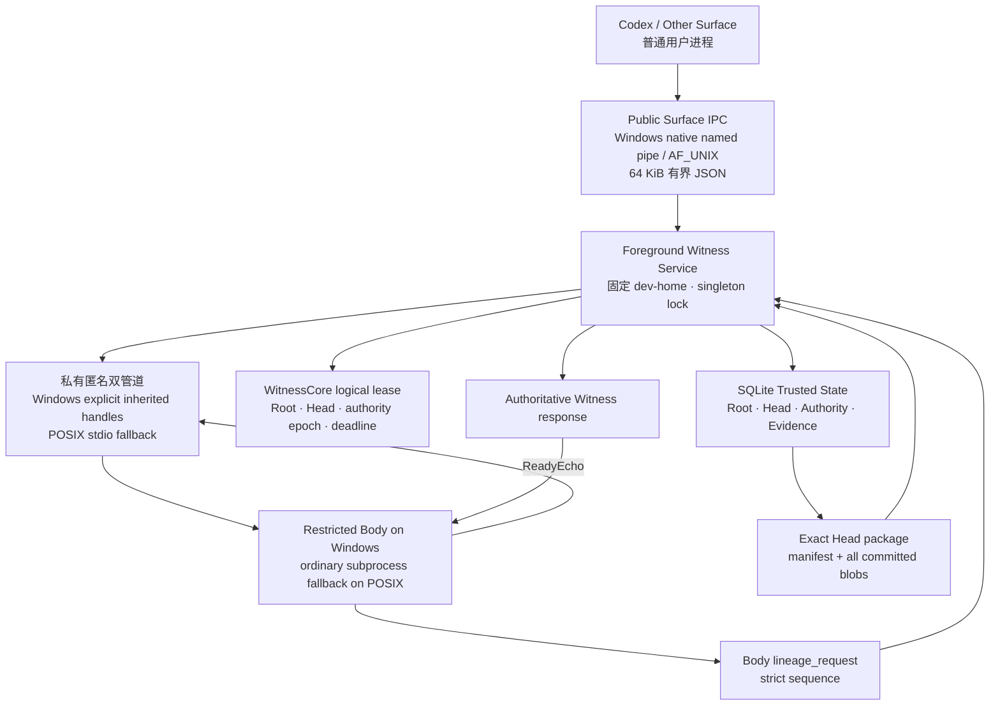
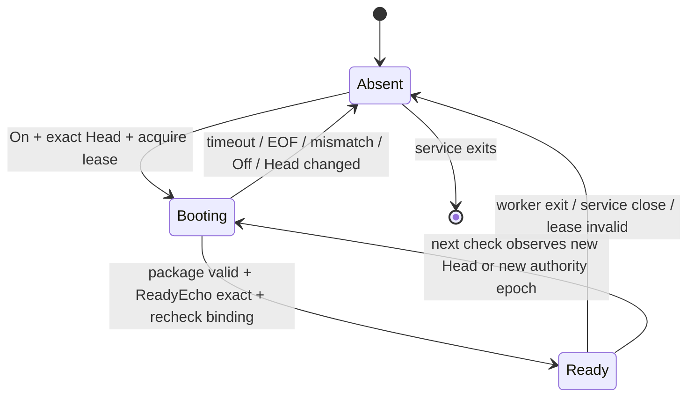
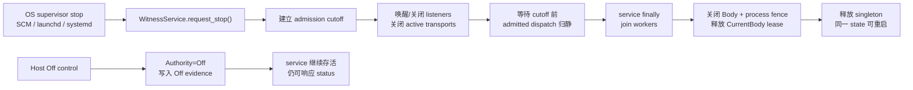

# 机器 Witness 服务与 exact-Head 子进程演练

更新时间：2026-07-30  
状态：可移植进程协议停止点已形成；Windows foreground 后续已增加 restricted suspended Body 与 private lineage transport rehearsal，独立 OS principal 和安装态 authenticated lineage 尚未形成
用途：记录 singleton Witness 前台服务、Windows 原生 public Surface IPC、exact-Head 子进程启动、后续私有谱系扩展、已验证事实与证明上限

---

## 1. 本轮结论

在真正安装 Windows Service、macOS LaunchDaemon 或 Linux systemd service 之前，仍然需要回答两个可以跨平台先验证的问题：

1. 一个固定 runtime home 是否只由一个 Witness 进程服务，并且公共 Surface 入口永远没有谱系推进 API；
2. Witness 是否能把 **exact Current Head 的完整承诺材料** 交给自己启动的子进程，并在该进程返回 `ReadyEcho` 后再次验证 Head、Authority epoch 与 lease。

当前代码已经回答这两个问题；后续切片又让 restricted Body 真实发起 `prepare / advance` 请求。结果仍严格命名为：

```text
foreground_service_rehearsal
+ subprocess_rehearsal
+ private_lineage_transport_rehearsal
```

它没有把同一 OS 用户下的 Python 进程冒充成独立安全主体，也没有产生 `agent_self_authored`。

---

## 2. 当前拓扑



公共入口与子进程入口不是同一条连接：

```text
Public Surface connection
≠
private child boot / lineage pipe pair
```

Windows public connection 现已校验绑定账户 SID；child 通路现已真实承载 Body 发起的谱系请求。但 public、Witness 与 child 仍位于同一个 foreground 用户权限域，所以：

```text
public account-bound connection topology
≠
installed distinct Body principal / authenticated lineage authority
```

---

## 3. 固定 home 与合作式单服务不变量

开发服务必须显式接收一个已经 Genesis 的临时 `--dev-home`。它绝不在空目录中自行 Genesis：

\[
\boxed{
\neg ExistsTrustedState(h)
\Rightarrow
StartService(h)=Reject(not\_initialized)
}
\]

令

\[
D(h)=\operatorname{Hash}\!\left(
NormCase(Canonical(h))
\right),
\qquad
L_{macOS}=104,\quad L_{Linux}=108
\]

同一规范化 home 的 endpoint 由平台、完整路径长度与 home commitment 决定：

\[
E_P(h)
=
\begin{cases}
\texttt{AF\_PIPE}\!\left(
\texttt{\\.\textbackslash pipe\textbackslash agentic-evo-dev-}
\mathbin{\|}D(h)_{1:32}
\right)
& P=Windows\\
\texttt{AF\_UNIX}\!\left(
Canonical(h)/\texttt{trusted/surface.sock}
\right)
& P\in\{macOS,Linux\},\
\left|os.fsencode(path)\right|<L_P\\
\texttt{AF\_UNIX}\!\left(
TempDir/\texttt{agentic-evo-}
\mathbin{\|}D(h)_{1:24}
\mathbin{\|}\texttt{.sock}
\right)
& P\in\{macOS,Linux\},\ \text{otherwise}
\end{cases}
\]

若连 fallback 地址也达到平台长度上限，则 endpoint 推导直接失败。临时目录中的 home-hash fallback 仍然只用于 Pre-Genesis 演练，不构成最终权限边界。

服务在可信目录中持有一个 OS 文件锁：

\[
\boxed{
\left|CooperatingForegroundWitness(h)\right|\leq 1
}
\]

进程异常死亡后，OS 释放锁；新服务重新读取已经提交的 SQLite 状态，不恢复任何旧 volatile lease。

这只证明遵守同一 service-lock 协议的实现具有 singleton 进程语义，不证明普通用户无法删除、替换或绕过同权限文件。

---

## 4. 公共 Surface 协议

当前公共 allowlist 只有：

\[
\boxed{
A_{public}
=
\{
status,\ wake,\ sleep,\ observe
\}
}
\]

并满足：

\[
\boxed{
A_{public}
\cap
\{
Genesis,\ On,\ Off,\ PrepareSuccessor,\ AdvanceHead
\}
=\varnothing
}
\]

请求不能提交：

```text
home
source_kind
author_kind
human_intervention_kind
lineage operation
```

`wake / sleep / observe` 的来源统一派生为：

```text
source_kind = execution_surface
author_kind = surface_unverified
```

因此公共调用者即使上传 `agent_self_authored` 也只会得到 `invalid_parameters`，不会改变 Head 或 evidence。

### 4.1 传输边界

公共帧沿用标准库 `multiprocessing.connection` 的 `PipeConnection` bytes framing，但只调用 `send_bytes / recv_bytes`，不反序列化 pickle。Windows listener / client 已改为原生 named-pipe handle；POSIX 仍使用 AF_UNIX。帧内容是有界 UTF-8 JSON：

\[
\boxed{
|Frame_{public}|\leq 64\ KiB
}
\]

服务还具有：

```text
2 秒完整请求帧 receive Timer
+ 12 秒 public client response Timer
+ 最多 16 个并发连接 worker
+ malformed / oversize / EOF fail closed
```

POSIX foreground rehearsal 仍由独立 worker 处理连接。Windows foreground pipe 为避免把 `FILE_CREATE_PIPE_INSTANCE` 交给同账户客户端，当前只允许一个 authentic server instance，因而串行处理：静默客户端会占用当前连接，直到 2 秒 request-frame deadline 或客户端断开，随后 listener 才重建并接纳下一连接。response Timer 只约束客户端等待，不会强制终止卡在业务处理中的 Python worker；真正并发与进程级取消仍要由独立 Witness principal、原生可取消 I/O 或 supervisor fencing 兑现。

Windows foreground public pipe 还满足：

```text
explicit protected DACL
+ SYSTEM / expected user SID only
+ minimal client access
+ PIPE_REJECT_REMOTE_CLIENTS
+ impersonated TokenUser SID equality
+ GetNamedPipeClientProcessId diagnostic fact
```

要求 `GENERIC_READ | GENERIC_WRITE` 的宽权限客户端会被 DACL 拒绝；正常 Surface client 只请求 `SYNCHRONIZE + read/write data + read/write attributes`，不取得 `FILE_CREATE_PIPE_INSTANCE`。SID 不匹配时连接被拒绝。PID 只用于诊断，不作为身份或授权；SID 只证明账户绑定，不证明第一宿主真人在场。

这些机制限制 public Surface 的账户与远端边界，但仍不等于 HostPresence、独立 service principal、protected state 或抗本机同权限恶意 DoS 能力。后续 private lineage transport rehearsal 是另一条父子私有通路，也不能反向升级 public peer 或 foreground principal。Off control endpoint 仍是 generic、未认证 transport。

---

## 5. exact Head package

子进程不能只收到一段看似相同的 context。Witness 从 Current Head 导出：

\[
\boxed{
Package(H_t)
=
\left(
M_t,\;
\{d_i\mapsto blob_i\}_{i=1}^{n}
\right)
}
\]

其中：

\[
H_t
=
Hash(Canon(M_t))
\]

\[
M_t.files[path_i]
=
d_i
=
Hash(blob_i)
\]

子进程在内存中重新验证：

\[
\boxed{
\begin{aligned}
Reconstruct(Package(H_t))\iff\;&
Hash(Canon(M_t))=H_t\\
\land\;&M_t.Root=Root_t\\
\land\;&M_t.Generation=Generation_t\\
\land\;&M_t.activation=\beta_t\\
\land\;&\forall i,\ Hash(blob_i)=d_i
\end{aligned}
}
\]

完整 package 通过服务创建的匿名 stdin pipe 发送，不进入：

```text
argv
environment variables
public Surface IPC
Body files中的额外secret
```

父进程使用 exact `sys.executable -P -m agentic_evo.body_worker`；环境只保留固定源码入口、UTF-8、禁用 user-site 与 Windows 启动所需的 `SystemRoot / WINDIR`。调用服务进程时存在的 API key、token 和任意其他环境变量不会被继承。

### 5.1 为什么可信父到子的 Body package 不设固定总尺寸

公共请求和不可信子进程响应必须有界；但合法 Body 本身没有一个由本轮理论给出的 8 MiB 生命上限。

若允许形成任意合法 Head，却给 boot package 设置另一个固定总尺寸，就会产生：

\[
\exists H:
ValidHead(H)
\land
\neg BootTransferable(H)
\]

因此当前实现：

```text
trusted Witness → spawned child：按 Body 实际大小传输，不设任意固定总上限
spawned child → Witness：仍保持 8 MiB 单帧上限
```

这不承诺无限内存。真实资源耗尽仍可以使一次启动失败，但不能由一个与 Head 合法性不一致的隐藏常数制造确定性“死 Head”。

---

## 6. BootEnvelope 与 ReadyEcho

每次启动生成新的：

```text
boot_session
challenge
```

最小启动信封为：

\[
Boot_t
=
\left(
protocol,\;
bootSession_t,\;
challenge_t,\;
Root,\;
Head_t,\;
Generation_t,\;
\beta_t,\;
d_t,\;
Package(Head_t)
\right)
\]

子进程只有在重建 package 后才返回：

\[
ReadyEcho_t
=
Projection(Boot_t)
\]

其中 projection 包含：

```text
protocol
boot_session
challenge
root
head
generation
activation_kind
activation_artifact
activation_digest
```

Witness 接受 Ready 的条件是：

\[
\boxed{
\begin{aligned}
AcceptReady_t\iff\;&
ReadyEcho_t=Projection(Boot_t)\\
\land\;&ProcessAlive_t\\
\land\;&Authority=On\\
\land\;&CurrentRoot=Boot_t.Root\\
\land\;&CurrentHead=Boot_t.Head\\
\land\;&AuthorityEpoch=LeaseEpoch_t\\
\land\;&LeaseStillLive_t
\end{aligned}
}
\]

最后一组条件在 `ReadyEcho` 之后重新读取，而不是只相信 spawn 之前的快照。

`boot_session` 与 `challenge` 不进入公共 status；知道一个 nonce 也不能替代对匿名 pipe 的持有。

---

## 7. 生命周期与 fencing



已形成的顺序：

```text
read Current Head
→ acquire logical lease
→ export exact package
→ spawn sanitized subprocess
→ send BootEnvelope
→ child reconstructs package
→ receive exact ReadyEcho
→ recheck Root / Head / Authority epoch / lease
→ report subprocess_rehearsal ready
```

worker 崩溃后，monitor 只有在关闭 pipe 并释放 logical lease 后才发布 `closed`。因此：

\[
\boxed{
ClosedPublished
\Rightarrow
LeaseReleased
}
\]

外部代码绕过服务直接执行 Off→On 时，旧进程在下一次服务请求中被 authority epoch 检查发现、终止并重新实例化。它是**惰性 fencing**，不是 deadline 或 Off 到达瞬间的 OS 强制终止。

后续 CLI/control rehearsal 已经增加独立、未认证、只允许 Off 的控制通路；服务按：

```text
commit Authority=Off
→ close worker pipe
→ terminate worker
→ release lease
```

执行。

---

## 8. 当前测试证明了什么

当前隔离测试已经覆盖：

- 同一 home 的第二个服务无法启动；
- 空 home 启动服务不会创建 Root、Body 或 SQLite；
- 公共 endpoint 没有 Genesis、On、Off、prepare 或 advance；
- Surface 无法自报最终 provenance；
- malformed、oversize 和静默公共连接不改变可信状态或阻塞其他请求；
- foreground service 被强制终止后，singleton lock 可重用，已提交状态保持；
- exact Head 的 manifest 与所有 blobs 在子进程重建；
- Root、Head、generation、activation、digest、challenge 或 boot session 任一 echo 不同即拒绝；
- Ready 期间跨过 Off boundary 会杀死进程、释放 lease；
- worker crash 后只有在 lease 已释放时 `wait_closed` 才完成；
- 同一 Head 可以从新的 boot session 重新实例化；
- 有效 6 MiB activation 在专用 30 秒有界 boot 测试窗口内不会因 8 MiB JSON/base64 单帧常数成为不可启动 Head；这不证明生产默认 2 秒窗口在 Windows 冷机上也足够；
- worker argv 不含 Root、Head、challenge 或 boot session；
- worker 不继承服务进程中的任意环境 secret；
- public status 不暴露 challenge 或 boot session；
- boot 不产生 evidence，也不产生 `agent_self_authored`；
- Windows public pipe 的显式 DACL 拒绝宽权限 generic client，拒绝 remote clients，并在独立子进程 roundtrip 中取得匹配的 TokenUser SID 与 client PID；
- public Surface 仍没有 lineage operation；SID 不升级为 HostPresence，PID 不升级为 authority，Off endpoint 不继承 public pipe 的认证事实。
- Windows Body 以 restricted Low-Integrity token suspended-spawn，在 Resume 前加入 Job 并只继承显式私有 handle pair；
- Body 发起的谱系请求绑定 boot session、严格序号、same-lease candidate 与 authoritative Witness response；
- replay、伪造 result、claimed authorship、深层 JSON、timeout 与异步故障均 fail closed 或进入 `OutcomeUnknown`；
- Boot、command、response 与 stop 四个父端写点都有 deadline，partial writes 不会被误判为完整 frame；
- 内部 supervisor stop 会建立 dispatch cutoff，唤醒并关闭 listener/active transports，拒绝 cutoff 后才尝试 admission 的 public/control 请求，并等待 cutoff 前已获准的请求归静；service loop 随后 join worker、回收 Body/lease、释放 singleton，并允许同一 home 重启；
- stop 路径自身没有可信状态增量，但 cutoff 前已经 admission 的合法变更仍可恰好提交一次；屏障测试证明 `request_stop()` 会等待该提交完成；
- stop、worker cleanup 与 control receive deadline 共享每条 transport 的单一 raw-close owner，不会并发重复关闭同一底层句柄。

这些是协议和进程生命周期事实，不是长期学习或自我进化证据。截至当前，Windows 全仓 123/123 项测试在 `ResourceWarning` 作为错误时通过；WSL Ubuntu 同样发现 123 项，其中 108 项通过、15 项 Windows-only contract 明确 skipped。

### 8.1 service stop 与 Host Off 是两种因果

未来 Windows SCM、macOS launchd 和 Linux systemd 都需要一个 supervisor-owned stop 关节。它只结束当前服务进程及其 Body，不替宿主表达“关闭 Agent”：



令 \(\tau_s\) 为 `request_stop()` 在 lifecycle lock 内设置 cutoff 的线性化点，\(Admitted(r)\) 为请求取得 dispatch admission。当前实测合同不是“粗暴关闭所有线程”，而是：

\[
\boxed{
\tau(Admitted(r))\ge\tau_s
\Rightarrow
Reject(r)
}
\]

\[
\boxed{
Return(request\_stop)
\Rightarrow
Quiescent(Admitted_{<\tau_s})
\land NoDispatch_{\ge\tau_s}
\land Closed(RegisteredActiveTransports_{\tau_s})
}
\]

完整退出另有一个更晚的完成点：

\[
\boxed{
ServiceStopComplete
\equiv Exited(serve\_forever)
\Rightarrow
Return(request\_stop)
\land Joined(Workers)
\land Exited(AcceptLoops)
\land Closed(AllAcceptedTransports)
\land Retire(Body,Lease)
\land Release(Singleton)
}
\]

令 \(X=(Root,Head,Authority,Evidence)\)。supervisor stop 自身不产生可信状态事务：

\[
\boxed{
\Delta X_{stop}=\varnothing
}
\]

cutoff 前已经 admission 的合法请求仍可先提交。先定义 cutoff 时仍未归静的集合：

\[
\boxed{
Pending_{\tau_s}
=
\{r\mid Admitted(r)<\tau_s
\land \neg Completed(r,\tau_s^-)\}
}
\]

于是一般形式只加入这些 pending 请求在 drain 期间产生的提交：

\[
\boxed{
X_{after}
=
X_{\tau_s^-}
\oplus
\Delta X_{Committed_{>\tau_s}(Pending_{\tau_s})}
}
\]

调用方不一定收到 cutoff 前已获准请求的响应：active transport 先关闭，请求随后可能提交。因此 EOF 只表示 caller-visible `OutcomeUnknown`，必须读取可信状态对账，不能推导“事务未提交”。只有 cutoff 时 \(Pending_{\tau_s}\) 中没有 mutating dispatch，状态关系才退化为：

\[
\boxed{
NoMutating(Pending_{\tau_s})
\Rightarrow
X_{after}=X_{\tau_s^-}
}
\]

而无论 stop 前是否已有合法请求：

\[
\boxed{
Observed_{rehearsal}\Big[
ServiceStopComplete(W_i)
\land Valid(State_{after\ quiescence})
\land SameTestEnvironment
\Rightarrow
StartSucceeded(W_{i+1},same\ home)
\Big]
}
\]

同时：

\[
\boxed{
request\_stop
\notin Ops_{public}
\cup Ops_{control}
}
\]

它只供进程 supervisor 进入；不能让 public Surface 或当前未认证 Off endpoint 获得“杀死服务”的新能力。Windows named pipe 与 POSIX AF_UNIX 都不能把跨线程 `Listener.close()` 当作 pending `accept()` 已退出的证明：实现先用有界 self-connect 唤醒 accept，再关闭 listener/active connections，等待 admitted dispatch 归静；`serve_forever()` 的 `finally` 再 join workers、回收 Body/lease 与释放 singleton。每条已接受 transport 由一个微型 close owner 串行化底层 `close()`，避免 stop、worker 与 deadline timer 并发关闭同一句柄。Windows 和 WSL 的“preaccepted public/control request 在 cutoff 后不得提交”“cutoff 前 admitted mutation 恰好提交且 stop 等待”“同一 transport 只 raw-close 一次”及“同一 home 立即重启”测试共同约束这一点；macOS 仍需对应实机复验。

---

## 9. 当前不能声称的性质

### 9.1 Ready 不是语义执行

\[
\boxed{
ReadyEcho
\not\Rightarrow
ExecutedActivationSemantics
}
\]

当前 `surface-context-utf8-v1` 的 diagnostic worker 只重建 exact Head 并保持连接。它没有执行 Body 的记忆、技能、目标、学习算法或模型路由。

### 9.2 子进程已经穿过 lineage transport，但没有最终 authority

logical lease 与 trusted transaction 的最终裁决仍由 service 父进程中的 `WitnessCore` 持有。worker 现在拥有私有 transport endpoint，可以发起 `prepare_successor / advance_head`；它不能自报 Root、Head、epoch、author 或 transaction 结果：

\[
\boxed{
ParentHoldsLease
\land
ChildOriginatedRequest
\land AuthoritativeWitnessResponse
\not\Rightarrow
InstalledBodyPrincipalAuthentication
}
\]

因此当前 provenance 只能是：

```text
subprocess_rehearsal
```

不能升级成：

```text
agent_self_authored
```

### 9.3 account-bound public pipe 与 private child transport 都不是独立 Body principal

Windows public pipe 证明客户端 token 属于绑定账户；explicit inherited child pipe 证明父子创建、restricted token、handle inheritance 与真实谱系往返。后者是 transport capability，但仍不证明 worker 拥有与普通用户分离的安装态 Body principal，也不证明普通用户无法替换服务代码、调试进程或直接访问状态目录。public peer SID 不能授权 lineage，diagnostic PID 也不能充当 capability。

### 9.4 process-tree 原子 fencing 目前只在 Windows diagnostic Body 成立

本文件形成时，父进程被强杀后，worker 只会因 stdin EOF 退出；当时 Windows 还没有 Job Object，macOS/Linux 也没有对应 supervisor principal。旧 worker 从父进程死亡到读到 EOF 之间，可能与新 worker 短暂重叠。

后续 Windows 原生切片已把 fixed diagnostic Body 加入 `KILL_ON_JOB_CLOSE` Job Object，并以真实孙进程验证内核终止；见[《Windows 原生 Witness 边界》](Windows原生Witness边界.md)。这仍没有形成 SCM service、独立 Body principal 或跨平台等价证明。

---

## 10. 与三平台最终实现的关系

当前 Python 层冻结的是同一个协议问题：

```text
public Surface allowlist
+ fixed machine state identity
+ exact-Head package
+ boot challenge / ReadyEcho
+ authority-epoch fencing
+ worker-death lease retirement
```

平台原生层仍需分别兑现：

| 平台 | 尚需兑现的真实边界 |
|---|---|
| Windows | Job、public peer、restricted suspended Body 与 private lineage transport rehearsal 已实现；仍需 SCM service principal、ProgramData ACL、安装态 capability 保护与攻击测试 |
| macOS | LaunchDaemon、独立 Witness/Body UID、daemon-owned state、XPC audit token + Body UID + code-signing requirement、process supervision |
| Linux | systemd system service、专用/DynamicUser、StateDirectory、pathname AF_UNIX、SO_PEERCRED、独立 Body UID/cgroup |

三平台不是三种 Agent。相同协议不变量由三个薄的 OS 实现分别通过攻击测试。

当前完整 123 项测试在 Windows 运行。WSL Ubuntu 也发现 123 项，其中 108 项通过、15 项 Windows-only contract 明确 skipped；这已经覆盖 AF_UNIX public/control、subprocess、service crash/stop、preaccepted-request fencing、锁恢复与 same-home restart。它仍不是 systemd、dedicated UID、StateDirectory 或 bare-metal Linux 的原生证据。macOS 目前只有 endpoint 推导与共享代码路径；在 macOS 实机运行前，不能把它写成已经通过的 launchd、IPC、signal、file-lock 或子进程行为。

---

## 11. 本轮停止点

本轮已经可以停下的部分：

1. 固定 dev-home 的 cooperative-singleton foreground Witness；
2. 公共 Surface allowlist 与有界 bytes/JSON transport；
3. exact Head 全 package 的匿名子进程交付与重建；
4. challenge / ReadyEcho / Root / Head / generation / activation / epoch fencing；
5. worker crash、service crash、Off→On 与大 Body 的协议演练；
6. restricted Body 的 explicit inherited private transport 与严格谱系往返；
7. `subprocess_rehearsal` / `private_lineage_transport_rehearsal` 与真实 Body provenance 的严格区分；
8. supervisor stop 与 Host Off 的因果分离，以及 stop 后同一 home 的可重启性。

本轮不能继续用 Python 类或更多 token 假装解决：

1. 独立 OS Witness principal；
2. service-owned state/key；
3. 安装态不可复制的 Body lineage capability；
4. Body 与普通用户不可互相冒充；
5. macOS / Linux 的 OS 级进程树终止，以及 Windows 安装后 service-context 的完整围栏；
6. `agent_self_authored`。

该下一项现已完成，见[《跨平台 CLI、Off 控制与零安装副作用计划》](跨平台CLI与Off控制演练.md)。新的下一项是：

> 冻结并审计 Python 可移植层，然后直接进入平台原生 service/principal、protected state、peer credential 与 process-tree fencing；不再扩张模拟安全层。

该冻结、Windows Job Object、foreground native public named pipe、restricted Body、private lineage transport 与内部 supervisor-stop 关节现已完成，见[《Windows 原生 Witness 边界》](Windows原生Witness边界.md)和[《受限 Body 与私有谱系能力演练》](受限Body与私有谱系能力演练.md)。当前下一项是让真实 SCM `SERVICE_CONTROL_STOP` 接入该关节，并建立 SCM Witness principal + service-owned protected state，再以临时安装和攻击测试复验现有 transport；不提前宣称 HostPresence、安装完成或正式 Genesis。
