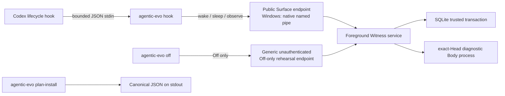

# 跨平台 CLI、Off 控制与零安装副作用计划

> 状态：Pre-Genesis 可移植层停止点；Windows foreground 已形成四个局部原生组件，Off control 仍为 generic / unverified
> 对应实现：`src/agentic_evo/cli.py`、`ipc.py`、`service.py`、`install_plan.py`、`native_backends.py`、`adapters/codex.py`
> 当前实测平台：Windows  
> macOS / Linux 状态：协议与目标计划可生成，原生实现和实机测试均未完成

---

## 1. 本轮回答的问题

上一轮已经证明：

1. 固定开发 home 可以运行一个遵守 service-lock 协议的 foreground Witness；
2. coding-agent Surface 只能使用公共 allowlist；
3. exact Current Head 可以经匿名 pipe 交给 diagnostic subprocess 重建；
4. authority epoch、Head、Root、activation 与 ReadyEcho 可以共同围栏旧启动；
5. 后续 Windows 切片已形成 restricted Body 与 private lineage transport rehearsal，但仍不是独立 OS principal、安装态 authenticated lineage 或真实 trusted boot。

本轮继续回答：

> 怎样让工具具有最小可操作入口、让用户的 Off 与普通 coding-agent Surface 分路、让 Codex Hook 不再直接打开可信数据库，并同时回答 Windows、macOS、Linux 最终要落在哪些原生边界上，而不提前伪造“已经安装”？

最小答案不是再增加一个通用控制 API，而是：

```text
一个公共 Surface 通路
+ 一个只允许 Off 的独立未认证控制演练通路
+ 一个 foreground serve 入口
+ 一个零安装副作用 install plan
```

CLI 是操作表面，不是 Agentic-Evo 本体；install plan 是待兑现契约，不是安装器。

---

## 2. 当前拓扑



关系必须读成：

```text
Hook 是 Surface
CLI 是入口集合
Witness 是当前协调者
Trusted State 是已提交事实
Body subprocess 是诊断演练
Install plan 是未执行目标
```

不能读成：

```text
CLI = Agent
Hook = Agent
foreground Python process = 独立机器 Witness principal
plan-install = 已安装
```

---

## 3. 最小 CLI

当前提供五个 foreground/plan 命令，以及三个只处理本地 Windows Gate A probe bundle 的命令：

```text
agentic-evo serve        --dev-home <existing disposable home>
agentic-evo status       --dev-home <existing disposable home>
agentic-evo off          --dev-home <existing disposable home>
agentic-evo hook         --dev-home <existing disposable home>
agentic-evo surface-stdio --dev-home <existing disposable home> --execution-surface <caller-declared name>
agentic-evo plan-install
agentic-evo prepare-windows-gate-a --bundle-dir <new local directory>
agentic-evo verify-windows-gate-a  --bundle-dir <existing local directory>
agentic-evo cleanup-windows-gate-a --bundle-dir <verified local directory>
```

其中：

| 命令 | 能力 | 明确不能做 |
|---|---|---|
| `serve` | 运行 foreground Witness 演练 | Genesis、后台安装、创建 Root |
| `status` | 经公共 Surface 读取状态 | 直接读取 SQLite、谱系写入 |
| `off` | 经独立未认证控制通路请求 Off | On、Genesis、Head 推进 |
| `hook` | 把一个 bounded Codex lifecycle event 映射到公共 Surface | 直接打开 trusted state、阻断 coding-agent 主任务 |
| `plan-install` | 向 stdout 输出确定性三平台目标合同 | 创建服务、写 Hook、启动进程、创建状态 |
| `prepare-windows-gate-a` | 用 Windows system compiler 构建 exact SCM-only probe 与 canonical manifest | UAC、SCM/ProgramData 写入、服务启动、完整 Gate A |
| `verify-windows-gate-a` | 重算 source/compiler/artifact 摘要并验证 console 1063 handshake | 把 bundle 自述哈希当签名、查询真实 SCM/token/ACL |
| `cleanup-windows-gate-a` | 只删除已验证的普通两文件本地 bundle；junction/tamper fail closed | service uninstall、状态清理、跟随 reparse point |

没有增加 `restart`：杀死 foreground service 后再次 `serve` 已足够构成当前重启实验。

没有增加 `on`：原因不是功能遗漏，而是权限因果不成立。

`surface-stdio` 不建立新的可信写入通路；它只把 `agentic-evo.surface-stdio.v1` 的 `status / wake / observe / sleep` 映射到既有 `SurfaceClient → public Surface → Witness`。`observe` 可转发可选的 `occurred_at / correlation_ref / causation_ref / parent_ref`，来源仍统一降级为 `surface_unverified`。字段类型或 1024-byte 上限失败时本地拒绝且不改变状态。

---

## 4. 为什么只有 Off，没有 On

令：

\[
A_{surface}
=
\{
status,\ wake,\ sleep,\ observe
\}
\]

\[
A_{control}^{rehearsal}
=
\{
Off
\}
\]

\[
A_{lineage}
=
\{
Genesis,\ PrepareSuccessor,\ AdvanceHead
\}
\]

当前必须满足：

\[
\boxed{
A_{surface}\cap
\left(
A_{control}^{rehearsal}\cup A_{lineage}
\right)
=\varnothing
}
\]

\[
\boxed{
On\notin A_{control}^{rehearsal}
}
\]

独立 Off endpoint 目前仍没有原生 DACL、peer credential 或 HostPresence 证明。Windows public endpoint 已有显式 DACL、remote-client rejection 与 peer account SID，但该证据不向 control endpoint 继承，也不能证明真人在场。Off 通路目前仍只能证明协议拓扑分离：

```text
different endpoint + different protocol
≠
authenticated first host
```

如果在这种边界上开放 On，任意能访问 endpoint 的本地进程都可能在用户 Off 后重新唤醒 Agent。Off 的误用最多造成拒绝服务；On 的误用会直接破坏“用户关闭即保持关闭”的宿主控制语义。

所以当前采取非对称原则：

\[
\boxed{
UnverifiedControl
\Rightarrow
MayRequest(Off)
\land
\neg MayRequest(On)
}
\]

正式 On 至少必须同时满足两类事实：调用进程的 OS principal 与第一宿主绑定；并且存在普通 Surface 无法模拟的用户在场或显式授权通路。SID、UID、peer credential 只能证明调用进程属于哪个账户，不能单独证明“真人此刻要求 On”。host binding 也不能放进 argv、环境变量、普通 pipe 或另一份用户目录密钥来冒充这两类事实。

---

## 5. Off 的原子顺序

Off 不是一段控制语言，而是一个有明确线性化点的可信事务与进程关闭序列：

```text
receive complete bounded control frame
→ BEGIN IMMEDIATE
→ verify trusted history
→ if already Off: no-op
→ else Authority := Off
→ clear active sessions
→ append control_rehearsal_off evidence with sequence s_off
→ append checkpoint
→ COMMIT
→ derived AuthorityEpoch := s_off
→ stop / terminate / kill Body if necessary
→ wait for Body exit
→ release CurrentBody lease
→ re-read committed status
→ send response
```

对应的状态性质是：

\[
\boxed{
Off_c(Off_c(S))=Off_c(S)
}
\]

对第二次 Off：

\[
\boxed{
\Delta Evidence_{second\ Off}=0
}
\]

第一次有效 Off 的来源不是 `normal_host_interaction`，而是入口硬派生：

\[
\boxed{
Source=host\_control\_rehearsal
}
\]

\[
\boxed{
Author=control\_unverified
}
\]

调用方不能通过 payload 自报或升级 provenance。

### 5.1 为什么幂等判断必须在事务内

错误实现是：

```text
status says Off
→ skip transaction
→ another writer commits On
→ control returns stale Off
```

正确实现把“已 Off 则 no-op”放进持有 SQLite `BEGIN IMMEDIATE` 的同一事务。服务每次都调用原子的 `rehearse_turn_off()`，关闭 Body 后再读取实际状态用于回包。

这消除了合作式写者之间的确定性 TOCTOU，但没有证明同权限恶意进程不能绕过服务直接打开 state。绝对线性化仍依赖未来的 service-owned protected state。

---

## 6. Off、crash 与 supervisor stop 是三种因果

```text
service crash
→ committed Authority remains On
→ replacement service reads On
→ same Head receives a new volatile boot session
```

```text
explicit Off
→ committed Authority becomes Off
→ sessions are cleared
→ Body exits and lease releases before response
→ service crash / restart
→ replacement service still reads Off
→ Body remains absent
```

因此：

\[
\boxed{
Crash\neq Off
}
\]

而且：

\[
\boxed{
Restart(Off(S)).Authority=Off
}
\]

内部 supervisor stop 既不是 crash，也不是 Host Off：

```text
supervisor stop
→ establish one dispatch-admission cutoff
→ reject preconnected but not-yet-admitted requests
→ wake and close public/control listeners
→ close the registered-active transport snapshot through one raw-close owner each
→ wait for requests admitted before the cutoff
→ a pre-cutoff caller may observe EOF even if its transaction committed
→ service finally joins workers, then retires Body and lease
→ leaving the service lock releases singleton
→ stop itself has no Root / Head / Authority / evidence transaction
→ pre-cutoff admitted work may still commit exactly once
→ same home may start a replacement service
```

\[
\boxed{
SupervisorStop\neq Crash\neq Off
}
\]

这里的 `request_stop()` 只供未来 SCM / launchd / systemd control handler 调用，没有被加入 public operation 或当前 Off control protocol。它的返回点只表示 cutoff、cutoff 时 registry 内 active transport snapshot 的 close 与 admitted dispatch quiescence 已完成；`accept()` 已返回但尚未注册的瞬时连接由 accept path 随后关闭，全部 accept path、Body/lease/worker/singleton 的完整回收以 `serve_forever()` 已退出为准。由于 transport 先于 admitted work 归静而关闭，调用方看到 EOF 时结果是 caller-visible `OutcomeUnknown`，不能据此判断该事务未提交。

本轮临时目录实验已经验证：

1. `serve` 后 Body 为 ready；
2. `off` 返回时 Body 已 absent；
3. Root 与 Head 不变；
4. active sessions 被清空；
5. 强杀 service 后重新 `serve`，Authority 仍为 Off；
6. 新服务不会重生 Body；
7. 测试显式终止其跟踪的 service 进程后，`TemporaryDirectory` cleanup 成功。

在本文件停止点，最后一项只证明测试所跟踪的服务句柄与目录没有继续占用，没有枚举或证明所有孙进程退出。后续 Windows 原生切片已经用 Job Object 加真实父/孙进程测试补上当前 diagnostic Body tree 的 kill-on-close 证据；它仍不证明 SCM、独立 principal 或未知外部进程已被围栏，见[《Windows 原生 Witness 边界》](Windows原生Witness边界.md)。

---

## 7. Codex adapter 不再直接接触可信状态

旧通路是：

```text
Codex hook
→ DevelopmentalRuntime.load(home)
→ trusted SQLite
```

这会让每个临时 coding-agent Hook 进程的实现路径直接打开可信数据库，破坏 Witness 单写者方向。

当前通路是：

```text
Codex hook
→ agentic-evo hook
→ SurfaceClient
→ public endpoint
→ Witness
→ trusted transaction
```

形式化为：

\[
\boxed{
ImplementedHookPath
\subseteq
A_{surface}
}
\]

\[
\boxed{
DeclaredAdapterOperations\cap
\{
TrustedDB,\ On,\ Off,\ Genesis,\ LineageWrite
\}
=\varnothing
}
\]

这些公式只描述仓库当前实现的 adapter 调用路径与公开操作集合，不描述同一 OS 用户下进程的实际权限。当前 Hook 进程仍可能凭同权限直接读取 state/key，或调用未认证 Off endpoint；只有原生 principal、protected state 与认证 IPC 才能把“实现没有调用”升级为“调用方没有能力”。

服务不存在、Runtime 为 Off、请求被拒绝、输入畸形或超限时，Hook fail-open：

```text
observation failure
→ no evidence write
→ empty hook output
→ exit 0
→ coding-agent task continues
```

这表示观测仪器不能反过来阻断宿主的 coding 工作。

---

## 8. 输入、帧与超时边界

当前边界为：

| 通路 | 上限 / deadline | 原因 |
|---|---:|---|
| Codex Hook stdin | 2 MiB | 允许在内存中哈希较大事件，又拒绝无界输入 |
| public/control JSON frame | 64 KiB | IPC 只承载结构化投影，不搬运原始 transcript |
| public string parameter | 1024 UTF-8 bytes | 防止单个 session / surface 标识在长期聚合后撑破响应 |
| Body logical path | 512 UTF-8 bytes | 保持跨平台逻辑路径与 wake projection 有界 |
| wake `body_files` | 前 16 项且 canonical list ≤ 8 KiB + total/truncated | Head 可以拥有更多文件，公共唤醒投影不复制完整 manifest |
| wake `activation_context` | canonical JSON text ≤ 24 KiB + char-count/truncated | 对控制字符等转义膨胀按真实序列化字节预算，而不是只数字符 |
| status `active_sessions` | 前 32 项且 canonical list ≤ 24 KiB + total/truncated | 内部 session 事实可增长，公共状态响应保持有界 |
| public 完整请求帧接收 | 2 秒 | 静默或 partial request 不应无限占住 receive |
| public client response Timer | 12 秒 | 合法大 Head 的 wake 可能超过 2 秒；与请求帧接收窗口分离；fake 编排已验证，真实取消 I/O 待实测 |
| control 完整帧接收 | 2 秒 | 长度前缀到达但 body 缺失时也必须被关闭 |
| Off client response Timer | 12 秒 | 覆盖 SQLite 5 秒等待、Body 最坏约 3 秒退出序列并保留余量；fake connection 已验证编排，原生取消 I/O 仍待实测 |

控制通路必须区分两个 deadline：

```text
receive deadline
≠
Off completion deadline
```

如果用同一个 2 秒 Timer 包住整个 Off：

```text
Authority 已提交 Off
→ Body 正在正常退出
→ Timer 提前关闭 connection
→ CLI 错报 control_unavailable
```

所以当前顺序是：

```text
Timer bounds complete-frame receive
→ cancel receive Timer
→ perform trusted Off and Body shutdown
→ client uses a distinct 12-second response Timer
```

仅调用 `poll(2s)` 也不充分：在 AF_UNIX stream 上，攻击者可以只发送 multiprocessing frame 的长度前缀，让 `poll()` 返回 readable，再永远不发送 frame body。当前实现为 POSIX receive deadline 预先复制真实 AF_UNIX socket，超时时先 `shutdown(SHUT_RDWR)` 再交给原有单一 close owner，并等待 Timer 退出后才释放副本。Windows AF_PIPE 的 message-mode 碎片被当作完整坏帧立即拒绝。真实 control endpoint 已分别验证 partial request 后可继续服务和 partial response 会在 deadline 内退出；该结果不外推到尚未实机的 macOS。

### 8.1 深层 JSON

字节数小不等于解析成本安全。一个低于 2 MiB、但嵌套十万层的 JSON 可以触发 Python `RecursionError`。

因此 Hook 输入 fail-open 集合包括：

\[
\{
UnicodeDecodeError,\ JSONDecodeError,\ RecursionError,\ Oversize
\}
\]

原始输入不写入 stdout/stderr，也不进入 evidence。

---

## 9. `plan-install` 不是安装器

`agentic-evo plan-install` 只向 stdout 输出：

```text
agentic-evo.install-dry-run.v1
```

它满足：

\[
\boxed{
InstallationEffects(plan)=\varnothing
}
\]

具体写成：

```text
install_service = false
install_hook = false
create_state = false
perform_genesis = false
start_process = false
```

并明确：

```text
ready_to_install = false
native_security_verified = false
portable_protocol_complete = true
implemented_native_components =
  [win32_job_object_process_tree_fencing,
   win32_public_named_pipe_dacl_peer_authentication,
   win32_restricted_low_integrity_body_process_rehearsal,
   win32_explicit_inherited_private_lineage_transport_rehearsal]
```

计划不包含：

- 时间戳；
- 随机数；
- 当前用户名；
- dev-home；
- cwd；
- `sys.executable`；
- Git revision；
- 环境变量；
- host binding；
- secret。

因此对任意环境 \(e\)、工作目录 \(c\)：

\[
\boxed{
Plan(e_1,c_1)=Plan(e_2,c_2)=P^\*
}
\]

同一版本的输出逐字节确定。

这里的 `InstallationEffects` 只指不写服务、Hook、Agent 状态，不执行 Genesis，也不启动受管 Agent 进程。运行 `plan-install` 本身仍会启动 CLI 进程并写 stdout；Python 运行时也可能按环境策略产生 bytecode cache，因此不能把公式解释为一般意义上的“没有任何可观察副作用”。

没有生成 `.service`、`.plist`、PowerShell、SCM 命令或可执行 uninstall 脚本，因为当前尚无原生 principal 与 service wrapper。一个可执行但安全边界虚假的安装脚本，比没有安装脚本更危险。

---

## 10. 三平台目标

三个平台共享同一个上层协议，但不共享同一个权限实现：

```text
Portable protocol
├── Windows native Witness
├── macOS native Witness
└── Linux native Witness
```

### 10.1 Windows

目标合同：

| 维度 | 目标 |
|---|---|
| supervisor | Windows SCM |
| Witness | restricted service SID |
| Body | 与 Witness 区分的 restricted token |
| trusted state | ProgramData + service-SID ACL |
| public Surface | explicit DACL，绑定第一宿主 SID，拒绝 remote clients |
| private lineage | Body SID / capability + remote rejection |
| process fencing | Job Object |

### 10.2 macOS

目标合同：

| 维度 | 目标 |
|---|---|
| supervisor | machine `LaunchDaemon`，不是用户 `LaunchAgent` |
| Witness | dedicated non-login UID |
| Body | dedicated non-login Body UID + signed Current Body launcher |
| trusted state | daemon-owned mode `0700` |
| public Surface | XPC audit token 绑定第一宿主 UID |
| private lineage | private XPC audit token + Body UID + exact code requirement |
| process fencing | launchd-managed Body job required |

### 10.3 Linux

目标合同：

| 维度 | 目标 |
|---|---|
| supervisor | systemd system service，非 user service |
| Witness | dedicated Witness system UID |
| Body | dedicated Body system UID |
| trusted state | systemd `StateDirectory` |
| public Surface | pathname AF_UNIX + `SO_PEERCRED` + bound-host UID |
| private lineage | private pathname AF_UNIX + Body UID |
| process fencing | systemd-managed Body cgroup required |

三个平台当前全部标记：

```text
native_test_status = not_run
```

本轮 Darwin / Linux 的目标合同已从 `install_plan.py` 抽到 `src/agentic_evo/native_backends.py` 作为单一不可变来源；`plan-install` 只渲染该来源到 canonical JSON，不再各自内联维护。自动化只验证合同字段、不可变性与 plan 渲染一致性，见 `tests/test_native_backends.py` 与 `tests/test_install_plan.py`；`native_test_status` 仍为 `not_run`，这不是 launchd、systemd、UID、IPC 或安装态的实机验证。

所以：

\[
\boxed{
RenderPlan(P)\neq NativeVerified(P)
}
\]

本节的 plan rendering 与可移植协议测试不能证明 macOS 或 Linux 原生边界，也不能证明 Windows SCM、service SID、protected state 或 HostPresence。WSL Ubuntu 已验证 AF_UNIX service stop、preaccepted-request fencing 与 same-home restart；这证明 Linux 用户态可移植路径，不证明 systemd、dedicated UID、StateDirectory、cgroup 或 bare-metal Linux 安装态。macOS 仍未实机。后续 Windows 原生测试已经证明 foreground Job、public peer、restricted Low-Integrity Body 与 explicit inherited private lineage transport rehearsal；这些局部证据不能反推 distinct-principal authentication、安装态或其他平台原生边界。

---

## 11. Codex Hook dry-run 合同

当前计划中的 Hook 状态是：

```text
scope = user
status = not_installed
runtime_access = public_surface_only
failure_policy = fail_open
provenance = surface_unverified
event_mapping_status =
  planned_not_installed_and_not_integration_tested
```

计划映射：

| Codex event | Agentic-Evo operation |
|---|---|
| `SessionStart` | `wake` |
| `SessionEnd` | `sleep` |
| `UserPromptSubmit` | `observe` |
| `PreToolUse` / `PostToolUse` | `observe` |
| `PermissionRequest` | `observe` |
| `PreCompact` / `PostCompact` | `observe` |
| `SubagentStart` / `SubagentStop` | `observe` |
| `Stop` | `observe` |

这些事件与字段依据当前 Codex lifecycle Hook 合同映射；正式配置尚未写入用户 Codex 目录，也未在自然 Codex session 中做安装后集成测试。官方 Hook 仍要求用户 review/trust 非 managed command hook。

Hook 明确禁止：

```text
Genesis
On
Off
PrepareSuccessor
AdvanceHead
```

当前 Codex 只是第一个可验证 Surface。其他 coding agent 应通过自己的公开 lifecycle contract 映射到同一个公共协议，不能各自持有一份独立 Agent 或 trusted state。

---

## 12. 当前验证

本轮测试覆盖：

1. CLI `serve/status/hook/off` 的真实 subprocess 路径；
2. Codex adapter 只经 `SurfaceClient`；
3. service 缺席时 Hook fail-open 且没有数据库 fallback；
4. prompt / tool 原文只产生长度与 hash；
5. public endpoint 继续拒绝 On、Off、Genesis 与 lineage；
6. control endpoint 只接受空参数 Off；
7. 错协议、额外字段、伪 provenance、畸形与 oversize control frame 均不改变状态；
8. fake close-owner 回归与真实 AF_PIPE / AF_UNIX control endpoint 共同证明 partial request deadline 有界，超时后 listener 可继续处理下一请求；
9. Off 原子幂等，第二次不增加 evidence；
10. deterministic TOCTOU regression rehearsal 证明 service 不会因事务外预读返回陈旧 Off；
11. Off 回包发生在 Body 退出与 lease 释放之后；
12. 慢 Body shutdown 不会被 control receive Timer 提前终止；
13. fake 与真实 partial-response transport 都证明 Off client 的独立 Timer 会返回而不是无限等待；POSIX 使用 socket shutdown 中断已经 readable 但不完整的 frame；
14. Off 后 Root / Head 不变、session 清空、Body absent；
15. Off 后 crash / restart 仍保持 Off；
16. malformed、oversize、深嵌套 Hook JSON fail-open 且不回显原文；
17. install plan 跨 cwd、环境与伪 home 逐字节确定；
18. install plan 不创建 Agent 文件或状态、不安装服务或 Hook、不启动受管 Agent 进程，也不执行 Genesis；
19. 三平台目标全部保持 `not_run`；
20. Codex Hook 计划保持 `not_installed` 与 `not integration tested`；
21. `control_rehearsal_off` 推进与普通 `host_off` 相同的 authority epoch，旧 lease 不能跨 control Off→On 复活；
22. public string parameter 限制为 1024 UTF-8 bytes，Body logical path 限制为 512 UTF-8 bytes；
23. 含 1201 个合法文件的 Head 仍能 wake，公共投影最多返回前 16 项并给出 total/truncated；
24. public status 最多返回前 32 个 active sessions 并给出 total/truncated；
25. macOS 目标明确区分 Witness UID 与 dedicated Body UID，代码签名只作为附加身份条件；
26. escape-heavy session、文件名与 activation context 按 canonical JSON bytes 二次预算，最终响应仍落在一个 64 KiB frame 内；
27. public client 的 12 秒 response Timer 与 2 秒 request-frame receive Timer 分离，冷缓存下的大 Head wake 不再被错误截断；
28. request receive Timer 不包住后续 dispatch，合法慢 dispatch 不会在 2 秒时被服务端主动关断；
29. Windows foreground public pipe 的显式 DACL 只给 SYSTEM 与绑定用户 SID 最小 client access，要求 `GENERIC_READ | GENERIC_WRITE` 的宽权限客户端被拒绝；
30. `PIPE_REJECT_REMOTE_CLIENTS`、server-side named-pipe impersonation / TokenUser SID 与 client PID 在独立子进程往返中成立；SID 不等于 HostPresence，PID 只用于诊断；
31. public Surface 与 generic、未认证 Off endpoint 仍是两条不同 transport，public account binding 不会把 Off provenance 升级。
32. Windows child 的实际 restricted token、Low Integrity、suspended handoff、Job-before-Resume 与 explicit inherited private handles 已验证；
33. Body 发起的严格序号谱系往返、same-lease candidate、authoritative result binding、replay/forgery rejection 与 `OutcomeUnknown` 已验证；
34. Boot、command、response、stop 写入都受 deadline 约束，partial writes 被完整补写；
35. 内部 supervisor stop 会在同一 lifecycle lock 上建立 dispatch cutoff，先唤醒/关闭 listener 与 active transports，再等待已 admission 请求归静；service finally 随后 join workers、回收 Body/lease、释放 singleton，并允许同一 home 重启；
36. cutoff 前已 admission 的变更请求可恰好提交一次，`request_stop()` 必须等待该提交；stop 路径自身的可信状态增量为空；
37. stop、worker cleanup 与 control receive deadline 共享每条 transport 的单一 raw-close owner；
38. Windows 与 WSL Ubuntu 都通过上述 stop、preaccepted-request fencing、admitted-mutation drain、single-close ownership 和 same-home restart；macOS 尚未实机复验。

---

## 13. 仍未证明

本轮严格不证明：

1. 控制请求来自第一宿主真人；
2. 普通本地进程不能调用 Off；
3. 普通本地进程不能删除、替换或劫持 endpoint；
4. state/key 只对 Witness principal 可读；
5. service crash 时整个进程树原子终止；
6. Body transport capability 已经由 distinct OS principal 在安装态防止同账户进程复制或冒充；
7. Body 已执行 activation 的真实语义；
8. macOS / Linux 原生行为；
9. Windows SCM / service SID / protected state，以及现有四个局部组件在安装后 service context 中的完整行为；
10. Codex Hook 已安装、已信任或已在真实 session 自然触发；
11. `PermissionRequest` 或其他计划事件已由本项目做安装后集成验证；
12. 当前 Windows public pipe 的 SID 是 HostPresence，或 client PID 是授权身份；
13. 所有孙进程均已退出；
14. 一个卡在业务处理中的 Python worker 会被 Timer 强制终止；
15. 正式 Genesis；
16. `agent_self_authored`；
17. 引用字段被保存不等于引用目标、事件时间或因果关系被验证，也不构成第二真实 coding-agent、学习或自我进化证据。

关键非等价关系：

```text
Unauthenticated Off-only rehearsal endpoint
≠
HostPresence
```

```text
Off persisted across restart
≠
state is protected from same-permission writers
```

```text
Hook adapter unit/integration rehearsal
≠
globally installed Hook
```

```text
Cross-platform plan rendered
≠
cross-platform native implementation verified
```

```text
Public peer SID + restricted Body transport rehearsal
≠
HostPresence + installed private lineage authority
```

```text
CLI available
≠
Agentic-Evo is a CLI product
```

---

## 14. 当前停止点

本轮已经可以停下的部分：

1. 最小 CLI 操作面；
2. Codex Hook 当前实现只经公共 Surface；
3. 公共协议与 Off 控制协议分离；
4. 未认证控制只允许 Off，不允许 On；
5. 原子、幂等、来源降级的 Off；
6. Off / crash / restart / tracked-service cleanup 的因果区分；
7. supervisor stop 与 Host Off 的因果分离及同一 home 可重启关节；
8. bounded Hook input、canonical-byte public projection、partial-frame receive Timer 与独立 public/control response Timer；
9. 三平台零安装副作用目标合同；
10. Windows、macOS、Linux 的原生边界不再混为一种实现；
11. public-v2 用 `(execution_surface, session_id)` 复合身份表达、结束和有界投影 Surface session。

继续在 Python 层增加 token、另一把用户密钥、通用 control RPC、模拟 principal、可执行但虚假的 service 脚本，不会增强上述命题。

Windows foreground Job、public named pipe、restricted suspended Body、private lineage transport rehearsal、内部 supervisor-stop 关节与 SCM-only probe bundle 已完成当前局部切片。后续一次宿主批准的 UAC 配置探针又实机闭合了 externally pinned handoff、随机 SCM service、restricted SID/ACL 配置回读、exact cleanup 与普通权限端零残留复核；service 未启动、未重启，所有 token 与攻击案例均 `not_run`。无新增 UAC 的后续切片又把 Surface session 从裸 ID 升级为真实复合主键、版本化承诺和 public-v2，并验证跨 surface 同名会话不再覆盖或误删。因此 `configuration_probe_completed` 仍只是一项局部事实：`gate_a_complete=false`、`gate_b_outcome=not_established`、`native_security_verified=false`、`ready_to_install=false`，也没有 persistent SCM、service-owned protected state 或安装事实。

下一项是：

> Cycle 3 已完成 PII-safe 冻结 v1/v2 evidence corpus、独立 verifier/real-attacker harness 与 public CLI regression。下一项实质性 Windows evidence 需要用户精确授权一次、跨 system restart 的单个有保留期临时 SCM service 实验；随后由独立 attacker-verifier 复验运行中 token、protected state、public/Body capability、crash recovery 与可逆 uninstall。不得执行 Genesis，也不得作永久安装。之后再单独攻克 HostPresence。正式 Genesis 与用户级 Codex Hook 写入仍需单独授权。
