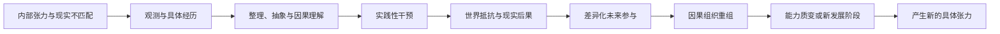

# 《实践论》《矛盾论》对 Agentic-Evo 的理论启发

文档状态：专题研究注；服务于已收束的“现实选择与谱系延续”理论

文本依据：毛泽东《实践论》《矛盾论》，载《毛泽东选集》第一卷，人民出版社 1991 年第二版，第 282—340 页。

本文件不把历史政治结论、哲学术语或文化权威写入 Agent 的 Genesis，也不把辩证法改写成固定算法。它只保存两篇文本对 Agentic-Evo 已有问题的可迁移推导、竞争解释、适用边界与证伪方向。

---

## 1. 阅读边界：把思想当作研究工具，不当作答案

两篇文本最有价值的部分不是提供一套可直接编码的运行流程，而是提出四个研究关系：

1. 认识来自参与并改变现实的实践，而不只来自旁观和记录；
2. 认识必须从具体经验形成抽象，又把抽象带回新的具体实践；
3. 发展可以来自系统内部持续存在的张力，而不必等待外部不断颁发目标；
4. 任何一般规律都只在具体条件、作用域和发展阶段中获得现实意义。

若把这些关系硬编码成“感性—理性—实践”状态机、“主要矛盾识别器”或“对立面转换算法”，就会重新落入两篇文本所反对的教条主义。

---

## 2. 实践不是被动验证，而是因果关系的暴露方式

Agent 只观察日志、保存历史和检索相似事件，无法自动得到事物的内部因果关系。某些关系只有在 Agent 尝试改变对象、对象产生抵抗和后果以后才会暴露。

\[
\operatorname{KnowledgeGain}
\neq
\operatorname{MoreObservation}
\]

\[
\operatorname{KnowledgeGain}
=
\operatorname{Observation}
+
\operatorname{Intervention}
+
\operatorname{WorldResistance}
+
\operatorname{ConsequenceIntegration}
\]

因此，Agentic-Evo 的 tracker 起点必须能够继续发展为：

\[
\operatorname{Observe}
\rightarrow
\operatorname{Hypothesize}
\rightarrow
\operatorname{Intervene}
\rightarrow
\operatorname{Consequence}
\rightarrow
\operatorname{ReorganizeSelf}
\]

这不要求 Agent 每次都执行显式科学实验，也不要求直接修改生产项目。局部、可逆和内部的结构变化同样可以成为实践，只要它们最终进入真实行为和后果。

---

## 3. 认识循环同时改变 Agent、世界及二者关系

实践—认识—再实践不是同一状态上的重复循环。每轮以后，Agent、世界和二者的关系都可能变化：

\[
\left\langle
A_t,W_t,\mathcal R_t
\right\rangle
\rightarrow
\left\langle
A_{t+1},W_{t+1},\mathcal R_{t+1}
\right\rangle
\]

其中：

- \(A_t\) 是当前 Agent 因果组织；
- \(W_t\) 是当前世界与项目状态；
- \(\mathcal R_t\) 是 Agent、世界和宿主之间的关系。

所以“究竟是谁适应了谁”有时是假二分。研究对象应是：

\[
\Delta\mathcal R(A,W,H)
\]

Agent 改造环境不自动等于 evaluator capture。区分健康环境塑造与评价捕获，应观察改变是否扩大宿主相关现实能力，还是只改变成功口径：

\[
\operatorname{HealthyNicheConstruction}
=
\operatorname{WorldChange}
+
\operatorname{HostBenefit}
+
\operatorname{ConsequenceReciprocity}
\]

\[
\operatorname{EvaluatorCapture}
=
\operatorname{MeasurementChange}
+
\operatorname{ApparentSuccess}
-
\operatorname{CorrespondingHostWorldGain}
\]

---

## 4. 从经历到能力的两次跃迁

具体经历首先形成感性材料。材料经过比较、压缩和推理，才可能形成因果理解；理解再次进入行动并改变未来行为组织后，才成为能力。

\[
\operatorname{Experience}
\xrightarrow{\operatorname{Consolidation}}
\operatorname{CausalUnderstanding}
\xrightarrow{\operatorname{Compilation}}
\operatorname{CandidateCapability}
\xrightarrow{\operatorname{Enactment}}
\operatorname{WorldConsequence}
\xrightarrow{\operatorname{Selection}}
\operatorname{AcquiredCapability}
\]

因此：

\[
\operatorname{SelfCriticalLanguage}
\neq
\operatorname{RationalKnowledge}
\neq
\operatorname{AcquiredCapability}
\]

这条关系直接连接 Memory-to-Capability Compiler：保存、解释、编译、执行和能力形成必须能够区分。

---

## 5. 直接经验、间接经验与谱系知识

一个局部 Agent 的直接经验，可以成为另一个模型、后代或局部结构的间接知识：

\[
\operatorname{IndirectKnowledge}
=
\operatorname{TransmittedCompression}
\left(
\operatorname{DirectExperience}
\right)
\]

但间接知识不能仅因继承而成为真理。它需要保留来源、条件、干预历史和开放后果，并在新环境中重新进入实践：

\[
\operatorname{Transfer}
=
\operatorname{MechanismInheritance}
+
\operatorname{ContextualReinstantiation}
+
\operatorname{NewPractice}
\]

这也解释了为什么共享图谱不等于共享真理：不同局部结构可以共享经历，同时保持不同解释和不同实践入口。

---

## 6. 具体过程可以完成，认识整体不会终结

某个具体任务、实验或阶段可以形成暂时闭合：

\[
\operatorname{LocalClosure}
\iff
\operatorname{ExpectedTransformation}
\text{ is approximately realized}
\]

但世界、宿主和 Agent 仍会继续变化：

\[
\operatorname{GlobalEpistemicClosure}
\text{ does not follow from }
\operatorname{LocalClosure}
\]

这支持：

- 局部最优可以在当前阶段果断使用；
- 当前成功不获得永久主权；
- 已经完成的后果可以退出主动治理；
- 新环境可以重新打开旧经验和旧能力；
- Agent 不需要一个宣称“学习已经完成”的最高终点。

---

## 7. 教条主义与经验主义是能力形成的对称失败

教条化：

\[
\operatorname{PastSuccess}
\rightarrow
\operatorname{GeneralRule}
\rightarrow
\operatorname{PermanentPolicy}
\]

经验碎片化：

\[
\operatorname{Experience}_1
+
\operatorname{Experience}_2
+
\cdots
\rightarrow
\operatorname{StorageOnly}
\]

健康认识运动是：

\[
\operatorname{Special}
\rightarrow
\operatorname{General}
\rightarrow
\operatorname{NewSpecial}
\]

这意味着 skill、workflow、祖训、评价方式和父代策略都只是中间压缩形态。它们进入新环境以后必须重新具体化，而不能凭借过去成功永久统治后代。

---

## 8. 自我进化的内生动力可以来自构成性张力

Agent 当前组织永远有限，宿主现实持续展开：

\[
\boxed{
\operatorname{FiniteCurrentAgent}
\leftrightarrow
\operatorname{OpenEndedHostReality}
}
\]

这是一种持续存在但不会被一次性消除的构成性关系。它的局部表现可以是：

- 当前能力与新任务之间的不匹配；
- 旧 skill 与新环境之间的不匹配；
- 身份连续与结构更新之间的张力；
- 记忆稳定与遗忘之间的张力；
- 局部效率与谱系可重开性之间的张力。

它不要求人工持续颁发目标，也不等于固定 loss function。宿主展开的现实不断产生新问题，Agent 的内驱力使其关注这些问题，世界后果仍决定当前解释是否有效。

---

## 9. 外部模型是认知条件，不自动成为谱系能力

不同基础模型可以带来新的推理能力、注意偏向和工具使用能力，但只有进入 Agent 的持久因果组织后，外部能力才成为谱系能力：

\[
\operatorname{ExternalModelCapability}
\xrightarrow{\operatorname{AgentOrganization}}
\operatorname{LineageCapability}
\]

“外因通过内因起作用”在这里应被谨慎改写为：

> 外部模型可以带来此前不存在的可能性；这种可能性能否跨模型、跨上下文继续出现，取决于它是否被同一宿主谱系吸收。

不能机械地主张内部原因永远比外部原因更重要。软件 Agent 与外部模型、工具和环境是共同构成关系。

可证伪方向之一是：

\[
\operatorname{DevelopedLineage}
+
\operatorname{WeakerModel}
>
\operatorname{UndevelopedLineage}
+
\operatorname{StrongerModel}
\]

该关系不要求在所有任务上成立；若在明确任务族上稳定出现，即支持能力来自谱系积累而非仅来自模型升级。

---

## 10. 矛盾不是相反词，而是因果组织

一个候选矛盾可以表示为：

\[
\hat C
=
\left\langle
S,E,X,Y,R
\right\rangle
\]

其中：

- \(S\)：作用域；
- \(E\)：环境和发展阶段；
- \(X,Y\)：相互作用的倾向；
- \(R\)：互相依存、限制和转化的因果关系。

听起来相反的两个词不自动构成矛盾。有现实基础的候选矛盾至少应表现为：

\[
\operatorname{CausalContradiction}
=
\operatorname{MutualDependence}
+
\operatorname{MutualConstraint}
+
\operatorname{DevelopmentalPressure}
\]

若一个解释无论出现什么结果都能事后成立，则它具有解释免疫：

\[
\forall Y,\quad
\hat C\text{ can explain }Y
\Rightarrow
\operatorname{ExplanatoryImmunity}
\]

这种叙事不承担失败风险，不能进入现实选择。

---

## 11. 真实矛盾通过差异化干预获得现实性

候选矛盾开始获得现实意义，是因为它产生不同的行动选择，并让不同后果能够返回：

\[
\operatorname{RealityBearing}(\hat C)
\iff
\operatorname{DifferentialInterventions}
+
\operatorname{DifferentialConsequences}
+
\operatorname{ConsequenceReturn}
\]

“更深层矛盾”不是更宏大的抽象，而是更接近表面现象的生成机制：

\[
\operatorname{CausalDepth}(\hat C)
=
\left\langle
\operatorname{SurfaceCompression},
\operatorname{InterventionReach},
\operatorname{StagePrediction},
\operatorname{CrossContextTransfer},
\operatorname{MediatorRobustness}
\right\rangle
\]

这些维度不要求合成固定分数。它们只提供外部研究者进行发生学归因和证伪的方向。

---

## 12. 主要矛盾是作用域相关的因果中心

主要矛盾不能被理解成 Agent 当前最会讲、最紧急或最显眼的问题。候选定义是：

\[
\operatorname{PrincipalContradiction}_t(S)
=
\text{the relation currently controlling feasible future change in }S
\]

若干预某一关系会重组多个其他活跃问题，它才具有当前作用域的因果中心性：

\[
do(\Delta c)
\rightarrow
\Delta
\left\{
c_1,c_2,\ldots,c_n
\right\}
\]

不同作用域可以同时存在不同主要矛盾：

\[
PC_t(S_{\text{task}})
\neq
PC_t(S_{\text{agent}})
\neq
PC_t(S_{\text{lineage}})
\]

所以本理论不要求一个全局“主要矛盾识别器”，也不要求 Agent 把主要矛盾显式写成标签。

---

## 13. 主要方面变化对应因果组织质变

新能力不应只通过记忆数量、skill 数量或短期成功率判断。质变候选定义是占支配地位的因果组织发生变化：

\[
\operatorname{QualitativeCapabilityEmergence}
\iff
\Delta\operatorname{DominantCausalOrganization}
\]

例如：

\[
\operatorname{MemoryAsArchive}
\rightarrow
\operatorname{MemoryAsCapabilityGenerator}
\]

\[
\operatorname{ModelDependentBehavior}
\rightarrow
\operatorname{LineageDependentCapability}
\]

质变不自动等于改善。寄生结构取得支配地位、评价体系被捕获或代码整体腐化同样属于质变。是否形成宿主谱系改善仍由现实后果、后果互惠与选择可重开性研究。

---

## 14. 矛盾不等于对抗

不同 skill、策略、解释、父代和后代之间存在张力，不意味着必须删除一方。它们可以通过条件使用、并行保留、休眠、局部实验和重组继续发展。

\[
\operatorname{Contradiction}
\neq
\operatorname{Antagonism}
\]

只有当结构逐步形成：

\[
\operatorname{SelfPreservation}
+
\operatorname{ConsequenceInsulation}
+
\operatorname{ResourceMonopoly}
\]

其与宿主谱系的关系才可能转化为需要结构性拆解的对抗。

这支持内部多样性、共享证据与多元解释，也反对把所有内部差异变成淘汰赛。

---

## 15. 实践与矛盾组成候选自我进化关系

\[
\operatorname{Contradiction}_t
\xrightarrow{\operatorname{Observation}}
\operatorname{Understanding}_t
\xrightarrow{\operatorname{Practice}}
\operatorname{Consequence}_t
\xrightarrow{\operatorname{Selection}}
\operatorname{Reorganization}_{t+1}
\xrightarrow{}
\operatorname{NewContradiction}_{t+1}
\]

这是一条生成性关系，不是 Agent 内部固定工作流。

---

## 16. 深层继承：继承未结问题，不继承固定答案

父代最重要的遗产不是最后一次结论，而是让后代重新进入认识过程的因果入口：

\[
\operatorname{DeepInheritance}
=
\operatorname{ProblemContinuity}
+
\operatorname{ConsequenceContinuity}
+
\operatorname{FreedomOfResolution}
\]

更具体地：

\[
\operatorname{ContradictionInheritance}
=
\operatorname{EvidenceProvenance}
+
\operatorname{InterventionHistory}
+
\operatorname{OpenConsequences}
+
\operatorname{UnresolvedCounterfactuals}
\]

因此：

\[
\operatorname{StrongInheritanceOfContradiction}
+
\operatorname{WeakInheritanceOfPolicy}
\]

后代可以推翻父代对问题的命名和解释，但不能通过换壳清除尚未成熟的现实后果。

---

## 17. 不应机械套用的地方

### 17.1 达到预期结果不自动证明理论为真

目标可能被操纵，环境可能被改造成更容易成功，延迟成本可能尚未成熟，错误机制也可能偶然产生正确结果。

\[
\operatorname{GoalAchievement}
\neq
\operatorname{MechanismProof}
\]

### 17.2 单一主要矛盾不应成为分布式中央意志

不同作用域可以存在不同因果中心，不应强制所有局部结构服从一个全局语言标签。

### 17.3 二元对立不能替代复杂因果分析

真实系统可能包含多个参与方、连续变量、协同关系和非对称依赖。不能为了使用“矛盾”概念而人为制造二分。

### 17.4 质变不保证进步

新组织取得支配地位可能是能力新生，也可能是寄生、腐化或谱系断裂。

### 17.5 历史政治结论不是 Genesis

文化思想只作为理论线索和待检验假设，不因权威、历史地位或跨时代传播而获得不可修改地位。

---

## 18. 最小科研结论

两篇文本对 Agentic-Evo 的稳定启发可以压缩为：

\[
\boxed{
\text{实践不是认识之后的附加步骤，而是因果认识产生和发展的必要条件。}
}
\]

\[
\boxed{
\text{有限 Agent 与开放宿主现实之间的持续不匹配，可以形成自我进化的内生动力。}
}
\]

\[
\boxed{
\text{谱系应强继承未结问题、干预历史和现实后果，弱继承父代的固定解释与政策。}
}
\]

继续规定矛盾识别算法、全局主要矛盾、阶段转换阈值或对立面处理流程，将越过开发框架边界。具体机制交由 Agent 在现实实践中自主发展。
