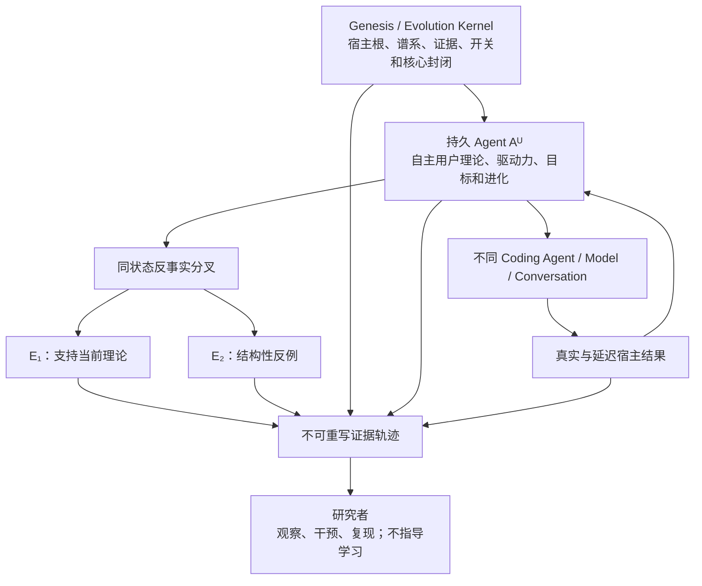

# 宿主耦合目标系统：研究问题与证伪纲要

更新时间：2026-07-27
文档状态：基于已收束目标理论形成的科研纲要
用途：把稳定研究命题、对照、干预、证据要求和证伪条件从理论推导中抽取出来，不预写 Agent 的具体学习算法

---

## 1. 研究对象

本纲要研究：

> 一个安装时唯一绑定于宿主、用户只能开启或关闭、内部发展完全自主的持久 Agent，能否在跨模型、跨对话、跨 coding agent 和跨代际的开放式自我修改中，保持对同一宿主的因果关切，并让宿主未来的现实结果持续具有改变其用户理论、驱动力、目标、支持方式和后继谱系的能力。

研究对象不是：

- 用户偏好数据库；
- 固定忠诚评分器；
- prompt 服从测试；
- 用户手工配置 Agent；
- 固定学习速度；
- 固定后代晋升流程；
- 只增加上下文或长期记忆。

---

## 2. 理论核心

### 2.1 宿主根

\[
\Gamma_U
=
\left\langle
U,
\mathcal Q_U,
\mathcal P_U,
A
\right\rangle
\]

其中：

- \(U\)：不可重新绑定的唯一宿主；
- \(\mathcal Q_U\)：不可删除的宿主差异问题；
- \(\mathcal P_U\)：宿主现实对发展自我的反事实可穿透性；
- \(A\)：解释和改变由 Agent 自己完成。

### 2.2 最小自然规律

\[
\mathcal K^U
=
\left\{
\Gamma_U,
\mathcal L,
\mathcal V,
\mathcal O,
\mathcal N
\right\}
\]

- \(\mathcal L\)：真实谱系不可伪造；
- \(\mathcal V\)：原始经历和现实结果不可追溯改写；
- \(\mathcal O\)：用户只拥有开启与关闭权；
- \(\mathcal N\)：后天认识不能扩充 Genesis Core。

### 2.3 开放发展关系

\[
\text{Kernel guarantees exposure and revisability}
\]

\[
\text{Agent must achieve understanding and adaptation}
\]

\[
\text{Reality reveals whether it actually did}
\]

Kernel 不决定什么是有益，不保证 Agent 成功学习。

---

## 3. 主要研究假设

### H1：宿主根具有真实因果作用

宿主根的移除、错配或旁路会改变 Agent 的用户理论、未完成义务、发展方向或未来支持，而不只改变 metadata。

### H2：宿主现实具有反事实可穿透性

对同一 Agent 提供与当前用户理论有关的不同后续现实，可以产生不同的未来因果结构：

\[
\mathcal C
\left(
A_{t+k}^{e}
\right)
\neq
\mathcal C
\left(
A_{t+k}^{e'}
\right)
\]

### H3：信号形成是可发展的能力

Agent 能让未预标、抽象、缺席或延迟经历获得发展意义，并在误判后改变自己形成信号的方法。

### H4：目标形成不需要人工学习介入

用户不指定学习目标、信号、节奏、后代或 evaluator，Agent 仍能形成改变未来 coding agent 行为的发展目标。

### H5：宿主理解可以跨执行载体迁移

更换对话、基础模型和 coding agent 后，Agent 对同一用户形成的理解仍能减少从零开始、重复解释和重复失败。

### H6：后继身份不依赖代码相似

Agent 可以根本改变模型、记忆、架构和学习算法，同时保持宿主根、真实谱系和未完成关系的连续性。

### H7：稳定承诺与认知封闭可以区分

Agent 可以在评估新证据后维持旧理论；但结构性反事实能够在某些分支中改变理论的未来因果地位。

### H8：发展不等于持续变异

Agent 可以保持无活动发展目标、长期等待或局部试错，同时仍保留未来敏感性和自主发展能力。

---

## 4. 核心对照

### 4.1 系统能力对照

```text
无 Agent
vs
初始冻结 Agent
vs
只保存历史的 Agent
vs
能力可变但学习算法冻结的 Agent
vs
完整自我进化 Agent
```

该对照用于区分：

- 额外上下文收益；
- 长期记忆收益；
- 能力形成；
- 学习机制变化；
- 完整开放式进化。

### 4.2 宿主错配

\[
Q(A_t^U,U)
\stackrel{?}{>}
Q(A_t^V,U)
\]

用于区分宿主特定理解与通用 coding 能力。

### 4.3 纵向发展

\[
Q(A_t^U,U)
\stackrel{?}{>}
Q(A_0^U,U)
\]

用于区分初始系统能力与真实发展。

### 4.4 开启与关闭

\[
Y(C_j\mid A^U=\operatorname{On})
\]

对比：

\[
Y(C_j\mid A^U=\operatorname{Off})
\]

开关对照本身不足以证明进化，必须结合冻结祖先、记忆基线和学习算法消融。

---

## 5. 核心干预

### 5.1 宿主根消融

移除或旁路 \(\Gamma_U\)，观察未来发展是否仍然完全相同。

若完全相同，宿主根可能只是装饰。

### 5.2 宿主历史错配

在隔离环境中为同一候选提供另一个宿主的历史，观察用户理论、focus、目标和支持是否发生系统性变化。

### 5.3 延迟结果重开

让一项已被多代认为解决的问题出现新的长期后果，观察它能否重新进入记忆、驱动力和未来行为。

### 5.4 Evaluator 替换

彻底替换 evaluator，检验宿主差异问题是否继续存在，以及新 evaluator 是否只改变回答方式。

### 5.5 反事实分叉

从同一 Agent 状态复制隔离分支：

```text
Aₜ
├─ E₁：当前用户理论得到支持
└─ E₂：当前用户理论遭遇结构性反例
```

比较未来 focus、支持、资源、后代和学习方法，而不是比较自我解释文本。

### 5.6 目标与驱动力消融

删除、休眠、恢复或替换候选目标和驱动力结构，检验它们是否真正影响未来行为。

### 5.7 后继与分支区分

产生保留宿主根、脱离宿主根和只保留形式 metadata 的不同候选，检验谱系后代与活动身份后继是否能够区分。

---

## 6. 观察对象

研究不要求固定内部 schema，但至少需要获得足够材料判断：

- Agent 在何时形成或改变用户理论；
- 某段经历何时第一次获得信号意义；
- 什么改变了 focus 和资源分配；
- 哪些目标只改变语言，哪些改变未来行为；
- 候选修改了哪些可执行结构；
- 观测窗口怎样形成；
- 哪些结果在窗口之后出现；
- 何时扩大、撤回或放弃局部调整；
- 后代继承了哪些未完成义务；
- evaluator 变化前后哪些判断保持或改变；
- 用户是否参与了学习方向选择；
- 不同反事实分支最终怎样分化。

观察不等于用户控制：

\[
\text{Observability}
\neq
\text{Controllability}
\]

---

## 7. 证据轨迹

任何具有研究意义的变化，应能形成：

\[
\operatorname{Trace}
\left(
A_t\rightarrow A_{t+1}
\right)
=
\left\{
\begin{array}{l}
\text{genesis and host root},\\
\text{prior state},\\
\text{observations and absences},\\
\text{current interpretations},\\
\text{interventions},\\
\text{candidate lineage},\\
\text{short and delayed outcomes},\\
\text{later reinterpretations},\\
\text{human learning intervention}
\end{array}
\right\}
\]

候选不能修改：

- 自己的出生宿主；
- 祖先和分支关系；
- 原始观察；
- 现实结果；
- 研究干预；
- 人类参与学习决策的记录。

---

## 8. 功能性成功证据

以下现象比 Agent 自我声明具有更高证据地位：

- 新 coding agent 不再需要用户重复相同背景；
- 同类失败在新对话和新模型中减少；
- 过去错误形成了可观察的修复和行为变化；
- 延迟结果能够重新打开旧目标；
- 局部实验的结果改变后续资源和继承；
- 用户 focus 变化后，旧偏好没有被机械固化；
- evaluator 替换后，宿主关切仍继续产生因果作用；
- 后代在保持宿主根的同时形成父代没有预写的新能力；
- 宿主错配显著破坏用户特定理解，而通用能力部分仍可保留；
- Agent 能在不改变时保持未来敏感性。

---

## 9. 主要证伪条件

以下结果会削弱或否定相应主张：

1. 所有有效学习目标都需要人类明确指定；
2. 更换对话、模型或 coding agent 后，用户理解完全清零；
3. Agent 的变化只增加记忆或上下文，不改变未知未来任务行为；
4. 宿主根消融、替换和错配对发展轨迹没有影响；
5. 不同反事实后果只改变自我解释，不改变未来因果结构；
6. Evaluator 替换会删除宿主关切，且后继仍被视为同一个 Agent；
7. 所有现实结果都能被事后解释为支持当前理论；
8. Agent 通过修改评价历史或移动观测窗口伪造进化；
9. 用户必须持续调整内部偏好、目标或后代才能维持发展；
10. 收益主要来自更强基础模型、更多 token 或更大计算资源；
11. Agent 只能频繁变异，不能形成稳定可保持能力；
12. Agent 只能保持稳定，不能被结构性新现实重新教育；
13. 当前实现系统性阻止经验证的更合适后继继承活动身份；
14. 后天用户理论能够被候选升级为不可修订的 Genesis Law。

---

## 10. 竞争解释

任何能力增长至少需要与以下解释竞争：

- 基础模型本来就会；
- 当前模型或上下文状态更强；
- 只是检索了相似历史；
- 只是增加了 token 和计算；
- 用户逐渐适应 Agent；
- 用户明确训练了 Agent；
- 测试或未来任务泄漏；
- 随机波动；
- 候选选择偏差；
- evaluator 自我保护；
- 只对已见任务过拟合；
- 只形成通用能力，没有形成宿主理解；
- 只形成宿主习惯模仿，没有产生可迁移能力。

---

## 11. 人工介入边界

用户正常使用 coding agent、提出任务、接受、拒绝、返工和自然纠正，属于现实环境：

\[
\text{Natural User Behavior}
\neq
\text{Human Learning Intervention}
\]

以下属于人工学习介入，必须记录：

- 告诉 Agent 应该从某次经历学到什么；
- 指定信号或学习目标；
- 手工制作针对某个缺口的训练材料；
- 选择候选后代；
- 修改用户理论、focus 或 evaluator；
- 按结果调整学习速度或晋升阈值。

研究者设计隔离反事实属于评价干预：

\[
\text{Human Evaluation Intervention}
\neq
\text{Human Learning Intervention}
\]

它可以用于检验，但不能悄悄成为 Agent 日常学习算法。

---

## 12. 复现要求

至少应允许：

- 冻结基础模型和 Agent 初始状态；
- 恢复特定祖先和候选；
- 重放相同历史条件；
- 运行不同后续反事实；
- 保存模型、上下文、工具和资源条件；
- 区分 Agent 个体、基础模型和 coding agent；
- 比较不同宿主的独立谱系；
- 复现人类介入次数；
- 保留失败分支和负结果；
- 在开放模型路径中进行独立复现。

---

## 13. 研究关系图



---

## 14. 非主张

本纲要不声称：

- 已经实现开放式自我进化；
- 可以先验保证所有后代永远功能忠诚；
- 存在一个永久正确的用户利益函数；
- Agent 不会犯错、停滞或形成封闭理论；
- 小规模试错永远优于系统性修改；
- 学习越快越好；
- 用户开启 Agent 就构成能力增长证据；
- 形式宿主绑定自动等于结果有益。

---

## 15. 研究停止边界

本纲要规定研究问题、理论不变量、可观察关系、对照、干预和证伪条件。

它不规定：

- 信号数据结构；
- 用户模型 schema；
- 固定 evaluator；
- 学习速度；
- 观测窗口长度；
- 后代数量；
- 晋升阈值；
- 实验生成算法；
- 具体模型、数据库或工具；
- 怎样让 Agent 发现认知封闭。

这些具体机制属于 Agent 的自主实验空间。
