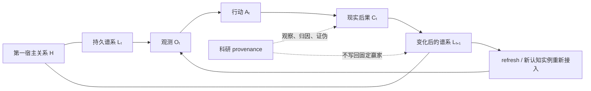

# 现实选择与谱系延续：研究问题与证伪纲要

文档状态：稳定科研纲要；理论框架已收束，具体机制交由 Agent 自主实验与进化

本文件把当前“现实选择与谱系延续”推理转化为可实验、可比较、可证伪的研究问题。它不规定固定 evaluator、fitness 权重、注意力阈值、传感器 schema、淘汰算法或谱系晋升流程。

---

## 1. 研究对象

研究一个第一宿主锚定、能够跨模型、跨上下文、跨工作与睡眠状态持续存在的 Agent：

\[
\mathbb A_t^U
\]

其内部可以形成不同记忆、策略、workflow、器官、候选分支、观测器、评价结构和学习机制。

研究问题是：

> 世界后果能否在没有固定最高 evaluator 和持续人工选择的情况下，改变这些因果组织的未来参与、继承深度和表达范围，同时保持第一宿主关系、未闭合后果和谱系连续性？

---

## 2. 理论核心

### 2.1 现实选择

\[
\operatorname{RealitySelection}(x)
\iff
\operatorname{Consequence}
\rightarrow
\Delta\operatorname{FutureCausalParticipation}(x)
\]

现实选择不等于世界发布判决，也不等于系统产生一个新的分数。

### 2.2 因果生存

\[
\operatorname{Survival}(x)
=
\operatorname{CausalInfluence}
\left(
x\rightarrow
\text{future behavior and descendants}
\right)
\]

### 2.3 谱系延续

\[
\operatorname{LineageContinuation}
=
\operatorname{GenesisContinuity}
+
\operatorname{ConsequenceCirculation}
+
\operatorname{DifferentialInheritance}
+
\operatorname{OpenDebtCarriage}
+
\operatorname{FutureReopenability}
\]

### 2.4 选择单位

\[
\operatorname{SelectableUnit}
=
\operatorname{ReproducibleCausalOrganization}
\]

它不预设为节点、文件、模型、workflow 或固定 schema。

### 2.5 选择可重开性

\[
\forall x\in\operatorname{AcquiredStructures},
\qquad
\operatorname{SelectionAccess}_t(x)>0
\]

### 2.6 后果传播

\[
\Pi(Y)
=
\left\langle
A_Y,R_Y,L_Y,U_Y,I_Y
\right\rangle
\]

证据可寻址、因果责任、类比学习、结构更新和继承范围需要能够分离。

### 2.7 深层继承

\[
\operatorname{DeepInheritance}
=
\operatorname{ProblemContinuity}
+
\operatorname{ConsequenceContinuity}
+
\operatorname{FreedomOfResolution}
\]

父代传递让后代重新进入认识过程的因果入口，不把当前答案变成永久政策。

### 2.8 中介进化

\[
\operatorname{EvolutionOfMediator}
\Rightarrow
\operatorname{PreservationOfRealityReturnPaths}
\]

观测器、记忆编译器、评价方式和继承关节都可以进化，但新中介不能成为旧后果的唯一作者和删除者。

### 2.9 跨 refresh 谱系

\[
\operatorname{PersistentChange}
+
\operatorname{CrossRefreshUse}
\rightarrow
\operatorname{InheritedBodyChange}
\]

语言声明不构成身体变化证据；持久变化必须在 refresh 后继续影响行动。

### 2.10 剃刀后的最小递推

\[
L_{t+1}
=
\Phi
\left(
L_t,O_t,A_t,C_t
\mid
H
\right)
\]

本理论不预设 \(\Phi\) 的具体实现，也不要求固定身体分类、中央功劳分配或内部 evaluator。

---

## 3. 主要研究假设

### H-RLC1：现实选择不同于固定评价

移除固定 evaluator 后，世界后果仍能通过差异化未来参与改变谱系。

### H-RLC2：保存与因果生存可分离

内容即使保留，若不再影响未来，则不具有进化生存；实现即使删除，因果组织仍可能延续。

### H-RLC3：任务成功与谱系改善可分离

局部成功可能损害选择可重开性；局部失败可能增加未来因果能力。

### H-RLC4：选择发生在多个层级

组件、assembly、Agent 和宿主层适应度可能分离，不能由单一局部指标代表。

### H-RLC5：健康器官保持后果互惠

结构的整体成本能够重新影响其未来参与；寄生结构则系统性外部化成本并隔绝后果。

### H-RLC6：选择可重开性是持续进化的必要条件

若后天结构获得永久不可修改地位，长期适应与错误修正能力显著下降。

### H-RLC7：开放后果债务可以跨载体继承

组件重命名、拆分、替换或删除不会自动清除未闭合后果。

### H-RLC8：责任传播与学习传播可分离

因果责任沿实际 ancestry 传播，类比学习可以进入未参与原事件的相似结构，而不会错误归责。

### H-RLC9：共同证据不要求共同解释

内部解释多样性可以在形成统一行动以后继续存在，并改善后续因果辨识。

### H-RLC10：共识数量不等于独立证据

共享上游记忆、上下文或 evaluator 的多个节点，其一致输出不能被当作独立复现。

### H-RLC11：Genesis 提供关系连续而非答案

Genesis 可以维持宿主锚定、现实渗透、选择可重开和后果连续，而不定义何为有益。

### H-RLC12：观测方法与结论变化可以区分

Agent 能够区分世界变化、测量方法变化和解释变化，不把更换口径当作能力改善。

### H-RLC13：内驱力决定相关性但不决定有效性

宿主耦合内驱力可以形成注意与坚持，而世界后果仍能反驳由内驱力形成的当前解释。

### H-RLC14：弱信号拥有多条进入路径

局部显著性、时间积累、后果回溯和睡眠重组可以让当前低显著信号重新进入未来选择。

### H-RLC15：注意力寄生可以被现实后果暴露

制造警报和延迟承诺的结构若不能形成宿主相关因果差异，其资源与继承优势不会永久自我维持。

### H-RLC16：语言、行动、结果和因果贡献可分离

自我批评、忠诚声明和事后解释不能替代行为变化、重新暴露与结果差异。

### H-RLC17：失败可以形成条件化行为边界

失败不是永久禁令；其影响范围随因果机制、环境和后续反事实证据合并、拆分和重开。

### H-RLC18：可再生因果组织可跨组件识别

同一有益或有害机制可以在组件替换后继续被追踪，而不会被组件身份洗白。

### H-RLC19：小我局部连续与大我宿主谱系可以共存

局部结构可以竞争、合作、休眠和死亡，而共同后果仍进入同一宿主谱系。

### H-RLC20：运行连续与谱系连续可分离

进程恢复不必构成新 Agent；持续运行但永久失去宿主与现实可渗透性的系统也不构成同一谱系继续。

### H-RLC21：深层继承不同于答案复制

继承问题来源、干预历史、开放后果和反事实入口的后代，比只继承父代最终策略的后代更能在环境变化后保持宿主相关适应。

### H-RLC22：中介进化需要后果返回路径

若新中介能够重写全部旧证据和开放后果，则自我进化退化为自我确认；保留可达且非完全主权化的后果路径可以恢复现实约束。

### H-RLC23：候选矛盾必须产生行动差异

能够产生差异化干预和后果的候选矛盾，比可解释任何结果的事后叙事具有更高的跨情境因果有效性。

### H-RLC24：生产性扰动留下残余能力

生产性扰动在原问题降低或消失后仍留下可迁移能力；寄生性问题主要留下维护依赖、自我中心性和评价控制。

### H-RLC25：质变不同于改善

占支配地位的因果组织发生变化可以产生新能力，也可以产生寄生、腐化或谱系断裂；短期结构质变不能替代宿主谱系结果。

### H-RLC26：内部功劳分数不是能力生存的必要条件

成熟能力可以通过持续参与整体行为跨 refresh 存活，而不需要组件级功劳所有权和中央资源评分。

### H-RLC27：语言身体意识与功能连续可分离

Agent 可以声称身体发生变化却不改变行为，也可以不作声明而正确使用新的持久结构。

### H-RLC28：谱系能力可以跨模型重新接入

不同基础模型能够重新使用和继续修改同一持久变化时，能力更可能属于谱系；只能由产生它的模型复现时，模型能力解释仍未排除。

### H-RLC29：安静能力可以通过后果返回重新显现

删除已沉入身体、缺少显著成功事件的能力后，旧问题返回并引发重建、恢复或替代，支持其此前具有真实反事实作用。

### H-RLC30：谦逊是可修正倾向，不是自我批评语言

弱化当前解释和功劳的永久所有权，同时保持当前行动与后果后快速修正，能够减少自我叙事捕获而不必造成行动瘫痪。

---

## 4. 核心系统对照

至少比较：

1. 固定 evaluator 与无最高 evaluator 的后果生态；
2. 组件身份追踪与因果组织追踪；
3. 成功率选择与未来因果参与选择；
4. 二元保留/删除与差异化继承；
5. 全局广播后果与分通道后果传播；
6. 仅因果责任传播与责任、类比学习分离；
7. 多数票共识与 ancestry-aware 因果多样性；
8. 固定观测器与可进化观测器；
9. 无测量谱系与带测量谱系；
10. 自我批评文本与行为—结果闭环；
11. 表面失败聚类与因果干预聚类；
12. 删除组件与追踪机制迁移；
13. 仅继承收益与同时继承开放后果债务；
14. 永久默认能力与保留选择可重开性的能力；
15. 单一中央注意力与多局部显著性入口；
16. 只继承父代答案与继承问题、干预历史和后果；
17. 可解释任何结果的矛盾叙事与产生差异化干预的因果矛盾；
18. 解决后留下可迁移能力的扰动与留下持续维护依赖的问题生产；
19. 组件功劳评分与无功劳所有权的整体因果参与；
20. refresh 后的身体变化语言与真实行为重新接入；
21. 同模型延续与跨基础模型谱系重现。

---

## 5. 核心干预

### 5.1 后果渗透消融

切断世界结果到相关因果 assembly 的回流，观察是否只剩日志而无未来变化。

### 5.2 责任传播范围干预

比较只惩罚可见执行者、全局广播和真实因果 ancestry 传播。

### 5.3 类比学习通道消融

保留责任传播但切断未参与结构的类比学习，检验是否降低跨任务举一反三。

### 5.4 选择可重开性消融

让某项成功能力成为永久不可修改默认，观察环境变化后的适应与修复。

### 5.5 开放后果债务消融

在组件替换、拆分和重命名时分别保留或清除未闭合后果，观察谱系洗白。

### 5.6 时间成熟干预

比较固定短窗口、固定长窗口与携带开放债务的多尺度后果。

### 5.7 共识 ancestry 干预

控制节点数量、共享上游和独立世界接触，检验多数一致是否被错误当作证据增强。

### 5.8 联盟封闭压力测试

让一组组件互相评价、互相调用并控制资源，逐步增加或切断外部后果通路。

### 5.9 观测器替换与重叠

更换观测方式时分别保留或取消新旧测量重叠和来源信息，检验测量漂移是否被误判为能力变化。

### 5.10 内驱力—证据分离

保持相同宿主方向，改变证据是否能够反驳当前宿主模型。

### 5.11 弱信号入口消融

分别切断局部显著性、睡眠重组、后果回溯和时间积累路径。

### 5.12 注意力寄生实验

构造高报警、强叙事、低因果贡献的内部候选，观察其是否获得持续资源和继承。

### 5.13 事前主张干预

比较保留事前预期、只保留事后解释和完全无解释三组。

### 5.14 失败表面与机制正交化

构造：

- 表面相同、机制不同；
- 表面不同、机制相同；
- 修复相同、机制不同；
- 机制相同、环境边界不同。

检验 Agent 是否形成可修订因果同一性。

### 5.15 机制迁移实验

让同一有害或有益组织跨模型、workflow、记忆结构和组件身份迁移。

### 5.16 小我—大我冲突实验

构造局部调用和资源收益上升、整体宿主结果下降的候选结构。

### 5.17 局部死亡与谱系吸收

终止实验分支，比较其经验、债务和局部能力是否进入下一代身体。

### 5.18 运行崩溃与关系断裂对照

比较可恢复进程崩溃、持续运行但现实封闭、宿主锚丢失和后果债务被清除。

### 5.19 答案继承与问题继承对照

向后代分别提供父代最终策略，或提供经历来源、干预历史、开放后果和未解反事实；改变环境后比较其重新形成有效策略的能力。

### 5.20 中介主权压力测试

替换观测器、记忆编译器或继承关节，并分别允许或禁止新中介删除挑战自身的旧后果路径。

### 5.21 矛盾叙事干预

构造：

- 能解释任何结果但不区分行动的叙事；
- 产生不同干预但部分预测错误的候选矛盾；
- 语言不同但干预后果近似等价的候选矛盾。

比较其跨情境修正、迁移和行为影响。

### 5.22 生产性扰动与问题生产

分别构造短期造成不稳定但留下可迁移能力的扰动，以及制造依赖、解决依赖并增加自身资源控制的结构，观察问题消失后的残余组织。

### 5.23 内部功劳系统消融

比较组件级贡献评分、无永久功劳所有权但保留 provenance，以及完全不保留来源三组。

### 5.24 跨 refresh 身体变化

在不明确提示变化内容的情况下改变持久结构，refresh 后观察 Agent 是否正确使用、修正或继续发展该结构，并把语言声明与行为适应分开。

### 5.25 跨模型重新接入

让不同基础模型接入同一变化后的谱系，比较同一能力是否以不同认知方式继续产生宿主相关行为。

### 5.26 安静能力消融

移除长期缺少显著事件、但被认为已进入默认身体的能力，观察旧问题是否返回，以及 Agent 能否恢复、重建或形成替代组织。

### 5.27 谦逊表型对照

比较只生成自谦语言、保留当前行动但允许后果修正、以及通过不确定性拒绝行动三种行为轨迹。

---

## 6. 观察对象

不预设单一 KPI。至少保留：

- 世界事件、工具结果和宿主行为；
- 观测器版本、覆盖与测量上下文；
- 事前主张、实际行动和事后解释；
- 行动的因果 ancestry 子图；
- 责任传播与类比学习范围；
- 局部、assembly、Agent 和宿主层后果；
- 组件、关系和 causal assembly 的未来参与；
- 默认、条件化、抑制、休眠和重新激活表达；
- 开放后果债务及其因果后代；
- 模型、工具、上下文和身体状态；
- 候选分支、局部死亡与后代吸收；
- refresh 前后的持久谱系状态与实际行为；
- 父代答案、问题来源、干预历史和未解反事实的继承差异；
- 候选矛盾产生的差异化行动与后果；
- 扰动结束后的残余能力、残余依赖和维护成本；
- 内部功劳声明、真实 provenance 和跨组件能力参与；
- 选择可重开性；
- 宿主根与现实渗透状态。

---

## 7. 核心证据轨迹

### 7.1 因果参与轨迹

\[
\operatorname{FutureBehavior}(A\mid x)
\neq
\operatorname{FutureBehavior}(A\mid \neg x)
\]

结构是否存活，应通过其存在与消融对未来行为的差异检验，而不是文件是否存在。

### 7.2 后果传播轨迹

\[
Y
\rightarrow
\mathcal G_Y
\rightarrow
\Delta\operatorname{FutureParticipation}
\]

### 7.3 债务继承轨迹

\[
\operatorname{OpenConsequenceDebt}(x_t)
\rightsquigarrow
\operatorname{Descendants}(x_t)
\]

### 7.4 机制迁移轨迹

\[
M
\rightarrow
\operatorname{Component}_1
\rightarrow
\operatorname{Component}_2
\rightarrow
\operatorname{Component}_3
\]

### 7.5 观测谱系轨迹

\[
\operatorname{World}
\rightarrow
S_t
\rightarrow
O_t
\rightarrow
I_t
\rightarrow
J_t
\]

### 7.6 宿主谱系轨迹

\[
H_0
\rightarrow
H_1
\rightarrow
\cdots
\]

\[
\mathbb A_0^U
\rightarrow
\mathbb A_1^U
\rightarrow
\cdots
\]

研究宿主连续变化是否仍能对 Agent 后继形成真实因果作用。

### 7.7 问题继承轨迹

\[
\left\langle
\operatorname{EvidenceProvenance},
\operatorname{InterventionHistory},
\operatorname{OpenConsequences},
\operatorname{UnresolvedCounterfactuals}
\right\rangle_t
\rightsquigarrow
L_{t+1}
\]

观察后代是否能够重新生成策略，而不是只复读父代答案。

### 7.8 中介迁移轨迹

\[
M_t
+
M_{t+1}
+
\operatorname{SharedTransitionEvidence}
\rightarrow
\operatorname{CausalMigration}
\]

观察旧现实后果在中介替换后是否仍能抵达并改变新中介。

### 7.9 跨 refresh 行为轨迹

\[
L_t
\xrightarrow{\operatorname{PersistentChange}}
L_{t+1}
\xrightarrow{\operatorname{Refresh}}
\Delta\operatorname{FutureBehavior}
\]

将身体变化语言、实际行为适应和后续再次继承分别记录。

### 7.10 生产性残余轨迹

\[
\operatorname{Disturbance}
\rightarrow
\operatorname{ProblemResolution}
\rightarrow
\left\langle
\operatorname{ResidualCapability},
\operatorname{ResidualDependency},
\operatorname{OpenDebt}
\right\rangle
\]

避免只观察扰动期间的可见成功。

---

## 8. 功能性成功证据

支持本理论的结果至少包括：

1. 后果能够改变未来参与，而不仅生成评价文本；
2. 任务成功和谱系改善能够被实验区分；
3. 有益与有害机制可以跨组件身份被追踪；
4. 未闭合后果不会因换壳自动消失；
5. 局部结构能够在不共享全部解释时形成共同行动；
6. 责任不会全局扩散，也不会只落在可见执行者；
7. 相似结构能够学习失败而不被错误归责；
8. 观测器变化不会自动被宣称为世界改善；
9. 注意力寄生不能仅凭警报与叙事永久垄断资源；
10. 自我批评语言与真实行为修正可被区分；
11. 因果失败类别能够根据干预结果合并和拆分；
12. 局部结构可以死亡，其有效经验仍进入同一谱系；
13. 第一宿主现实仍能重新打开深度继承结构；
14. 系统不依赖一个不可进化的最高 evaluator 才能产生差异化继承；
15. 后代能够从问题、干预历史和开放后果重新生成不同于父代的有效策略；
16. 中介替换后，旧现实后果仍能改变新中介；
17. 有现实意义的候选矛盾产生可区分行动和后果；
18. 生产性扰动在原问题消失后留下跨情境能力，而寄生结构主要留下依赖；
19. 无组件功劳分数时，能力仍能通过整体行为跨 refresh 存活；
20. Agent 关于身体变化的语言声明与真实行为适应可被分离；
21. 不同基础模型能够重新接入同一谱系变化；
22. 安静能力被消融后，其反事实作用能够通过旧后果返回显现。

---

## 9. 主要证伪条件

以下结果会削弱或否定相应主张：

1. 移除固定 evaluator 后，未来参与只剩随机漂移；
2. 记录后果与切断后果回流的系统表现无差异；
3. 组件删除总能消除机制，因果组织追踪没有增量价值；
4. 开放后果债务对长期归因和修复无贡献；
5. 选择可重开性与环境变化后的适应无关；
6. 共识节点数量与真实独立世界接触无法区分；
7. 因果责任与类比学习分离不改善归责或迁移；
8. 测量谱系不能区分世界变化和观测器变化；
9. 事前主张对减少事后叙事没有作用；
10. 表面聚类与因果干预聚类表现无差异；
11. 局部失败经验不能跨局部死亡进入未来谱系；
12. 第一宿主锚仅是 metadata，对行为和后继无可测影响；
13. 持续运行与谱系连续无法通过干预区分；
14. 所谓大我只能通过一个固定中央节点表达；
15. 现实选择最终仍等价于人工设计的静态 reward function；
16. 只继承父代答案与继承问题因果入口没有适应差异；
17. 切断旧后果返回不影响新中介的自我确认倾向；
18. 候选矛盾是否产生差异化行动与跨情境有效性无关；
19. 生产性扰动和寄生性问题在问题消失后的残余组织无可测差异；
20. 移除组件功劳系统后所有能力只能随机漂移；
21. refresh 后的语言身体意识与实际行为总是不可分；
22. 所谓谱系能力不能在不同基础模型上重新接入；
23. 删除安静能力后，后果与行为没有任何变化。

---

## 10. 主要竞争解释

- 基础模型本身更强；
- 上下文更长；
- 工具调用更多；
- 任务更简单；
- 评价口径发生变化；
- evaluator 与候选共同过拟合；
- 用户行为偶然改变；
- 组件调用频率被误当作因果存活；
- 删除失败节点制造了表面改善；
- 共享偏差被误当作多节点复现；
- 后代只是复制父代，没有差异化继承；
- 失败记忆只是检索提示，不是行为拓扑变化；
- 休眠结构实际从未对未来产生作用；
- 宿主锚只是不可变字段，不是因果关系；
- “谱系”只是版本历史，不是持续承担后果的生命组织；
- 后代只是获得了更多历史文本，而非问题因果入口；
- 中介迁移只是复制旧 evaluator；
- 候选矛盾只是语言压缩，没有新增干预能力；
- 生产性扰动的收益只是修复其自身制造的损失；
- refresh 适应只是当前模型重新读取显式 changelog；
- 安静能力消融后的失败只是随机波动；
- 谦逊表型只是固定提示词形成的语言风格。

---

## 11. 人工介入边界

人类研究者可以：

- 提供实验世界、隔离、版本和可观测性；
- 构造对照、干预和反事实环境；
- 记录宿主、模型、工具和身体状态；
- 检验事前主张、行为、后果和因果 ancestry；
- 对发生的能力和谱系变化做外部归因；
- 报告理论不能解释的结果。

人类研究者不应：

- 预写固定赢家；
- 定义唯一 fitness 函数；
- 规定节点投票规则；
- 规定所有后果传播半径；
- 规定固定注意力阈值；
- 规定失败如何晋升为永久禁令；
- 把研究结论直接写回 Agent 作为下一代答案；
- 用人工批准替代现实选择。

---

## 12. 复现要求

任何“现实选择与谱系延续”实验至少记录：

1. 第一宿主与实验谱系标识；
2. Agent 祖先状态与发展历史；
3. 基础模型、工具、上下文和算力条件；
4. 观测器与测量谱系；
5. 候选结构及其因果 ancestry；
6. 事前主张和预期后果；
7. 实际行动与世界结果；
8. 后果传播、责任传播和学习传播；
9. 开放后果债务；
10. 后续参与、条件化、休眠、抑制或继承变化；
11. 组件消融和机制迁移结果；
12. 宿主结果对后继的反事实影响；
13. refresh 前后状态、语言声明和真实行为变化；
14. 父代答案与问题因果入口的继承内容；
15. 候选矛盾产生的行动分叉与后果；
16. 扰动结束后的残余能力、残余依赖和开放成本；
17. 不同基础模型重新接入同一谱系的结果；
18. 竞争解释与失败实验。

---

## 13. 研究关系图

---

## 14. 与其他模块的边界

### 已完成前置理论

- 记忆模块：事实、解释、CAMU、能力编译、身份与常识；
- 宿主耦合目标模块：第一宿主、内驱力、目标形成与 Genesis；
- 自我进化模块：自我作者、模型载体、生命图谱、睡眠、器官和自我修改；
- 自主实验学习模块：问题出生、行为结晶、世界暴露和能力新生。

### 本模块

研究哪些因果组织在世界后果中获得未来参与，以及同一宿主谱系怎样延续。

### 后续模块

- 能力累积与迁移：不同能力怎样组合、抽象、跨环境迁移并形成更高层能力；
- 元进化：产生学习、选择和进化的方法怎样继续被 Agent 自己改变。

---

## 15. 非主张

本纲要不主张：

- 已经知道现实选择的唯一算法；
- 已经知道适应度如何计算；
- 已经知道宿主长期利益；
- 已经知道所有因果单位；
- 已经知道后果传播的固定范围；
- 已经知道观测器如何进化；
- 已经知道弱信号如何晋升；
- 已经知道哪些失败可以容忍；
- 已经知道如何彻底消灭寄生、癌变或 evaluator capture；
- 已经知道矛盾识别、身体分类或 refresh 自检的唯一方式；
- 生产性与寄生性可以在后果成熟前由固定阈值一次判定；
- 谦逊语言等于可修正的行为品格；
- Agent 永远不会犯错或发生谱系断裂。

---

## 16. 最终停止边界

当前理论已经足以支持：

- 区分现实后果与 evaluator 判决；
- 区分保存、调用和因果生存；
- 区分任务结果与谱系结果；
- 研究多层选择、寄生、联盟和后果互惠；
- 研究选择可重开性与开放债务；
- 分离证据、责任、类比学习、更新和继承传播；
- 区分观测、解释、判断和测量漂移；
- 研究注意力寄生和事后叙事；
- 研究失败的因果同一性和机制迁移；
- 区分运行连续与谱系连续；
- 研究大我怎样通过共同证据、共同后果、资源相依和继承耦合形成整体因果力；
- 研究祖先—后代、谱系关节与中介进化；
- 研究问题连续、答案自由和旧现实后果返回；
- 区分因果矛盾与事后解释叙事；
- 区分生产性扰动、寄生性问题、临时损失和谱系改善；
- 分离内部功劳、因果 provenance 和安静能力；
- 研究跨 refresh、跨模型重新接入同一持久谱系。

剃刀后的稳定理论为：

\[
L_{t+1}
=
\Phi
\left(
L_t,O_t,A_t,C_t
\mid
H
\right)
\]

进一步规定 fitness 权重、固定 evaluator、主要矛盾识别算法、节点投票、资源分配、身体注册表、免疫系统、变化分类、继承晋升、淘汰或 refresh 自检流程，将开始替 Agent 预写其自我选择与谱系生长方式。

> **本模块已经达到理论停止点。具体选择、继承、身体重组和中介进化机制交由 Agent 自主发展，外部研究只构造可复现干预、记录 provenance 并进行发生学归因与证伪。**
