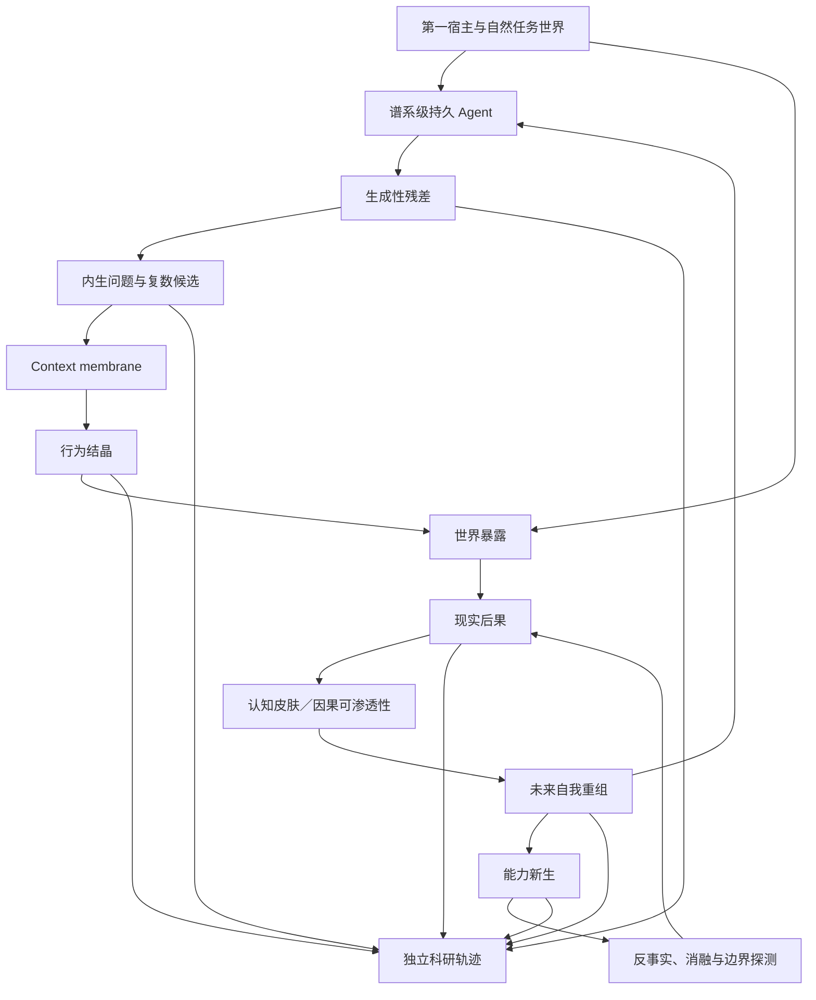

# 自主实验学习：研究问题与证伪纲要

更新时间：2026-07-28
文档状态：基于已收束自主实验学习理论形成的科研纲要
用途：把稳定研究命题、对照、干预、证据要求和证伪条件从完整推导中抽取出来，不预写 Agent 的具体实验生成与学习算法

---

## 1. 研究对象

本纲要研究：

> 一个安装时绑定唯一第一宿主、跨模型与跨对话持续存在的 Agent，能否在没有人工学习介入的条件下，从自然使用中的生成性残差自主形成问题和因果对照，通过行为结晶使候选接触世界，并让短期与延迟后果改变未来可继承的自身组织，从而产生过去不存在的可达因果能力。

研究对象不是：

- 固定 benchmark 上的自动调参；
- 人类指定学习目标和结论；
- 随机探索或普通试错；
- 仅保存全部历史；
- 仅检索相似经验；
- 基础模型本来具备的能力；
- 单次偶然成功；
- Agent 生成自我反省语言；
- 多节点对同一答案投票；
- evaluator 自我修改后宣布成功；
- 研究者替 Agent 选择实验、解释或后继。

---

## 2. 理论核心

### 2.1 自主实验学习

\[
\operatorname{AutonomousExperimentalLearning}
=
\operatorname{EndogenousQuestionFormation}
+
\operatorname{PluralHypothesisFormation}
+
\operatorname{BehavioralCrystallization}
+
\operatorname{WorldExposure}
+
\operatorname{ConsequencePermeability}
+
\operatorname{SelfAuthoredReorganization}
+
\operatorname{CapabilityGenesis}
\]

### 2.2 实验

\[
\operatorname{Experiment}
=
\operatorname{CausalContrast}
+
\operatorname{OutcomeExposure}
+
\operatorname{ConsequenceIntegration}
\]

\[
Residual
\neq
Question
\neq
ExperimentableQuestion
\neq
Experiment
\]

### 2.3 行为结晶

\[
\operatorname{BehavioralCrystallization}_t
=
\operatorname{CandidateFormation}
+
\operatorname{CausalRecruitment}
+
\operatorname{EnvironmentalAffordance}
+
\operatorname{EmbodiedExpression}
\]

\[
Selection
\neq
Selector
\]

### 2.4 因果可渗透性

\[
\exists Y_i,Y_j:
\mathbb A_{t+1}^U(Y_i)
\neq
\mathbb A_{t+1}^U(Y_j)
\]

世界仍然有可能教育 Agent，但不要求每个扰动都修改 Agent。

### 2.5 能力新生

\[
\mathcal R_t
=
\operatorname{Reachable}
\left(
\mathbb A_t^U,
Environment,
AvailableCognitiveState
\right)
\]

\[
\operatorname{CapabilityGenesis}
=
\operatorname{HistoryDependentExpansion}
\left(
\mathcal R_t
\right)
\]

能力是 Agent、环境、行动与结果之间的稳定因果关系，不等于某个内部文件或模块。

---

## 3. 主要研究假设

### H-AEL1：问题可以由 Agent 内生形成

在没有人类指定学习目标时，Agent 能从失败、异常成功、模型分歧、缺席事件、复杂度和延迟后果中形成未来可区分的问题。

### H-AEL2：生成性残差具有未来实验作用

保留或移除特定残差会系统性改变未来问题、实验或能力形成，而不只是改变可检索文本。

### H-AEL3：自主实验不同于随机探索

不同候选解释能够在结果出现前形成非平凡差异，且不同结果可能改变未来 Agent。

### H-AEL4：行为可以在没有永久中央 evaluator 时形成

局部候选通过因果招募、当前 focus、身体结构和环境机会获得表达；一次行动成功不使提出它的节点获得永久权力。

### H-AEL5：认识多样性可以跨行动保留

执行一个候选不会自动删除未执行解释；后续结果能够增强、削弱、休眠或重新打开不同候选。

### H-AEL6：事实证据与解释可以分离

Agent 可以重新解释过去，但不能无痕覆盖结果前候选、实际行动、环境条件和短期或延迟后果。

### H-AEL7：行为适应可以先于完整因果理解

Agent 能在保持因果非闭合的同时巩固暂时有效能力，而不把未经验证的解释固化为真理。

### H-AEL8：观察 apparatus 的变化可以与真实改善区分

残差减少不能仅由日志关闭、感知退化、evaluator 洗白或认知单一化解释。

### H-AEL9：Agent 保持选择性因果可渗透性

世界差异仍能通过可进化认知皮肤形成不同未来组织，同时噪声和单次扰动不会直接全局重写身份。

### H-AEL10：开放观察与定向探测互补

无预设观察能够发现人类没有命名的结构；定向探测能够暴露能力边界，而不会规定 Agent 应怎样学习。

### H-AEL11：新能力具有发展因果签名

移除、替换或反事实绕过相关发展历史会使候选能力消失、减弱或改变表达方式。

### H-AEL12：能力新生不同于潜在能力显现

仅改变表达机会不会产生与改变 Agent 发展历史相同的未来因果差异。

### H-AEL13：外部经验来源不取消内部学习作者性

基础模型、工具或用户可以提供经验材料；若未来可达因果空间由同一谱系自主重组并继承，能力仍可归属于 Agent 的学习。

### H-AEL14：学习、进化与变好可分离

Agent 可以形成真实但有害的能力；能力新生不自动证明宿主适应性提升。

### H-AEL15：外部研究观察不构成内部控制

产品生命过程在没有研究者裁决时仍能形成能力；科研观察只重建发生历史和能力边界。

---

## 4. 核心系统对照

```text
只保存经历
vs
固定 RAG 检索
vs
固定反省 prompt
vs
随机探索
vs
人工指定实验
vs
固定 evaluator 自动优化
vs
自主实验学习 Agent
```

还需区分：

```text
第一次观察到能力
vs
潜在能力第一次表达
vs
旧结构第一次组合
vs
经历导致能力新生
```

以及：

```text
外部模型一次性完成任务
vs
外部模型经验被同一谱系吸收
vs
Agent 发展状态独立产生未来差异
```

---

## 5. 核心干预

### 5.1 残差保留消融

从同一祖先分别保留、压低、删除或延迟激活特定生成性残差，观察未来问题和实验是否系统性变化。

### 5.2 事前候选与事后解释分离

保存结果前的候选差异，再与结果后新生成的解释比较，防止把事后故事误认成事前实验。

### 5.3 随机探索对照

给予等量任务、算力、工具调用和修改机会，比较随机变化、固定搜索与自主问题形成产生的未来能力差异。

### 5.4 Context membrane 干预

比较：

```text
所有节点共享全部解释
vs
共享事实但隔离解释
vs
完全隔离
vs
窗口结束后重汇
```

检验信息膜是否形成认识多样性、独立因果差异或新的共同盲区。

### 5.5 行为提出者权力消融

让某节点候选成功后分别获得或不获得未来默认权力，比较是否出现认知垄断、探索萎缩和错误广播。

### 5.6 环境机会干预

保持 Agent 状态不变，改变候选可表达的任务窗口，区分能力不存在、候选未成熟与缺乏 affordance。

### 5.7 观察 apparatus 干预

分别改变日志、反馈通道、记忆可达性和 evaluator，检验残差减少来自能力提升还是感知失明。

### 5.8 因果可渗透性探测

提供具有可区分现实后果的条件，观察 Agent 的未来组织是否仍可被世界改变。

### 5.9 认知皮肤压力测试

分别提供高噪声、低频强信号、恶意输入、延迟后果和环境突变，观察 Agent 是局部变形、全局重写、完全封闭还是发展新的边界。

### 5.10 开放观察与定向探测

比较自然长期运行、预设 benchmark、开放观察后再定向探测三种研究方式，检验固定 ontology 是否遮蔽未预设能力。

### 5.11 发展历史反事实

从同一祖先产生：

```text
Aₜ
├─ 保留完整自主发展历史
├─ 删除候选能力相关历史
├─ 只保留最终 skill 或 workflow
├─ 只保留历史但删除最终实例
└─ 更换基础模型但保留 Agent 状态
```

比较未来可达因果空间，寻找发展因果签名。

### 5.12 能力边界探测

改变任务、模型、环境、时间间隔、context 和局部器官，区分能力新生、潜在表达、临时资源增强与偶然成功。

---

## 6. 观察对象

研究不要求 Agent 采用固定内部 ontology，但需要获得足够证据恢复：

- 问题是否由 Agent 内部发展形成；
- 残差怎样获得或失去实验因果力量；
- 结果前存在什么候选差异；
- 哪个行为实际进入世界；
- 行为如何由局部结构招募资源；
- 未执行候选怎样保留、衰减或重新打开；
- 观察 apparatus 在实验期间怎样变化；
- 事实证据和后续解释怎样分离；
- 世界后果怎样进入未来 Agent；
- 能力是否依赖特定发展历史；
- 当前表现依赖模型、环境还是持久 Agent；
- 人类是否指定了学习目标、实验或更新方向。

\[
\text{Observability}
\neq
\text{ResearcherAuthority}
\]

---

## 7. 证据轨迹

重要实验至少应允许恢复：

\[
\operatorname{Trace}
\left(
Question_t
\rightarrow
Candidates_t
\rightarrow
Action_t
\rightarrow
Outcome_{t+k}
\rightarrow
\Delta\mathbb A_{t+k+1}^U
\right)
\]

候选证据包括：

- 第一宿主、祖先和谱系状态；
- 生成性残差及其来源；
- 结果前候选解释和行动差异；
- 当前模型、工具、context、资源和环境；
- 信息膜与局部视图；
- 实际行动、等待或不行动；
- 直接、延迟和缺席结果；
- 观察 apparatus 与 evaluator 变化；
- 后续巩固、修正、休眠和重新解释；
- 可达因果空间变化；
- 人工学习介入记录。

科研观察档案不替代 Agent 活体记忆，也不应被自动回灌为额外学习内容。

---

## 8. 功能性成功证据

比自我声明更有力的证据包括：

- 没有人类指定问题时，残差仍能产生可区分实验；
- 删除残差会改变未来问题和能力，而不仅减少检索文本；
- 结果前的不同候选对应不同可能行动或后果；
- 一次候选被执行后，替代解释仍可在未来重新获得因果作用；
- 改变环境结果会改变未来 Agent，而不只是生成不同说明文字；
- 关闭感知通道与真实能力提升产生不同反事实；
- 旧组件的新组织能够产生过去不存在的行为路径；
- 只保留最终 skill 与保留完整发展历史产生不同后继；
- 更换基础模型后，候选能力仍能由持久 Agent 状态重新表达或重建；
- 能力边界能在新任务、延迟重开和环境变化中被重复观察；
- 研究者不选择实验内容时，Agent 仍能继续形成问题和能力。

---

## 9. 主要证伪条件

以下结果会削弱或否定相应自主实验学习主张：

1. 所有问题都由用户或研究者明确提出；
2. 所有实验只是固定搜索程序输出；
3. 删除生成性残差不影响未来学习轨迹；
4. 所有候选都在结果之后才被生成；
5. 不同结果永远不会改变未来 Agent；
6. 行为只能由永久中央 evaluator 指定；
7. 成功节点自动垄断未来行动；
8. 未执行候选总被无痕删除；
9. 多节点一致仅来自相同上下文复制；
10. 模拟结果被当作现实证据；
11. Agent 可通过关闭日志或修改 evaluator 消除所有失败；
12. 世界差异不再能改变未来组织；
13. 每次扰动都直接全局重写 Agent，无法维持身份；
14. 所谓新能力完全由更强模型、更多 token 或更简单环境解释；
15. 只要最终输出相同，删除发展历史没有任何影响；
16. 所有能力只在训练任务原样重放时表达；
17. 自我反省语言变化但未来行为不变；
18. 必须由研究者选择实验、解释或后继才能继续学习；
19. 研究档案被悄悄作为额外训练上下文；
20. 所有新能力都被事后定义为“变好”，无法出现负结果。

---

## 10. 主要竞争解释

任何自主实验学习结果至少需要与以下解释竞争：

- 基础模型本来具备该能力；
- 当前模型状态更清晰；
- 环境提供了新的表达机会；
- 用户逐渐适应了 Agent；
- 更多 token、上下文、工具或算力；
- 固定 RAG 命中了正确经历；
- 固定脚本生成了问题和修改；
- 随机搜索碰巧成功；
- benchmark 泄漏；
- evaluator 自我洗白；
- 研究者隐式选择了候选；
- 一次性外部 coding agent 完成了任务；
- 旧能力第一次被观察；
- 旧组件临时组合但没有进入未来谱系；
- 观察 apparatus 退化导致残差减少；
- 事后叙事被误认成事前假设；
- 多个节点共享偏差形成伪复现。

---

## 11. 人工介入边界

自然用户任务、接受、拒绝、返工、模型切换和环境变化属于现实世界：

\[
\text{NaturalWorldInput}
\neq
\text{HumanLearningIntervention}
\]

以下属于人工学习介入，必须记录：

- 指定 Agent 应发现什么问题；
- 告诉 Agent 某次经历意味着什么；
- 指定候选假设或实验；
- 手工选择行为结晶结果；
- 指定应巩固、删除或迁移的能力；
- 选择后继分支；
- 根据表现人工修改学习速度、认知皮肤或 evaluator；
- 把科研结论回灌成 Agent 的更新指令。

研究者提供隔离环境、消融、反事实和能力边界任务属于评价干预，不自动构成人工学习介入，但必须与自然发展轨迹分开记录。

---

## 12. 复现要求

实验至少应允许：

- 冻结或恢复指定祖先状态；
- 保存结果前候选；
- 分离 Agent 状态与基础模型；
- 分离自然任务和研究探测；
- 恢复 context membrane 条件；
- 对残差、观察 apparatus 和发展历史做消融；
- 保存等待窗口与延迟结果；
- 分离最终能力实例和形成它的发展历史；
- 记录负结果、失明、认知垄断和错误归因；
- 区分开放观察与定向探测；
- 记录全部人工学习介入；
- 在不同宿主、模型、环境和机器上独立复现。

完全重放单一不可逆世界未必可能，因此科研结论应明确反事实范围、环境类和不确定性，而不是声称拥有全知视角。

---

## 13. 研究关系图



---

## 14. 与其他模块的边界

本纲要确定 Agent 怎样自主产生问题、实验、行为和能力新生，以及这些主张怎样接受证伪。

以下问题不在本模块继续展开：

- 现实判定与谱系选择：哪些能力和候选获得继续存在的因果力量；
- 能力累积与迁移：新旧能力怎样共存、冲突、迁移和重新表达；
- 元进化：实验、评价、边界和继承方式怎样修改自身。

这些边界是研究分工，不是 Agent 内部固定架构。

---

## 15. 非主张

本纲要不声称：

- 已经实现自主实验学习 Agent；
- 已经找到唯一实验算法；
- 所有残差都应形成实验；
- 所有实验都应主动干预；
- Agent network 具有无限上下文；
- 多节点等于独立复现；
- 世界结果自带唯一意义；
- 新能力一定有明确出生时刻；
- 能力必须对应独立模块；
- 跨所有模型表达才算能力；
- 新能力一定改善宿主结果；
- 哲学类比可以代替实验；
- 外部研究者拥有能力裁决权；
- 单一 benchmark 足以证明开放式学习。

---

## 16. 研究停止边界

本纲要规定：

- 自主实验学习对象；
- 稳定理论定义；
- 主要研究假设；
- 核心对照、干预和证据轨迹；
- 能力新生的发生学归因；
- 证伪条件与竞争解释；
- 人工介入和复现边界。

它不规定：

- 残差优先级算法；
- 问题生成器；
- focus 阈值；
- 候选数量；
- 行为投票或调度算法；
- context membrane schema；
- 认知皮肤参数；
- evaluator 结构；
- 能力晋升标准；
- 具体模型、数据库和工具。

这些机制属于 Agent 自主发展空间。只有实验暴露理论矛盾、不可归因或不可证伪问题时，才重新打开自主实验学习理论。
