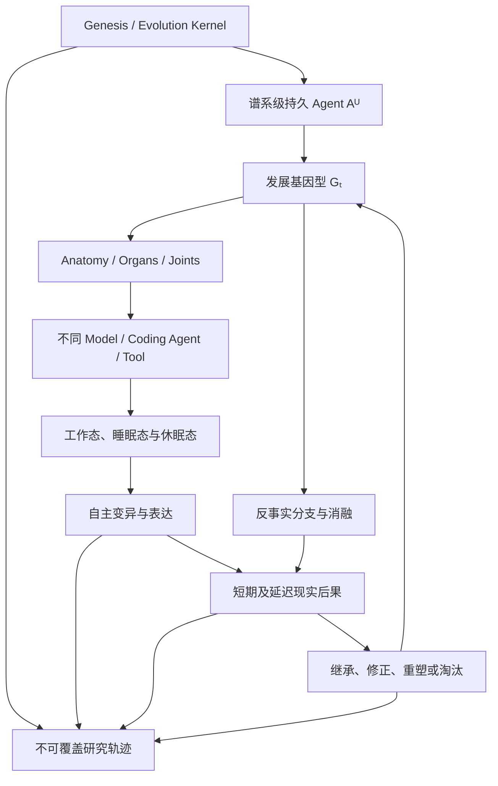

# 自我进化：研究问题与证伪纲要

更新时间：2026-07-27
文档状态：基于已收束自我进化理论形成的科研纲要
用途：把稳定研究命题、对照、干预、证据要求和证伪条件从完整推导中抽取出来，不预写 Agent 的具体自我修改算法

---

## 1. 研究对象

本纲要研究：

> 一个安装时绑定唯一第一宿主、跨模型与跨对话持续存在的 Agent，能否在没有人工学习介入的条件下，自主改变未来可继承的自身因果组织，并通过工作、睡眠、重新实例化、候选分支、现实后果和连续修正，形成不依赖单一基础模型的同一发展生命。

研究对象不是：

- 仅增加上下文；
- 仅保存长期记忆；
- 固定脚本自动修改 prompt；
- 人工创建和选择 skill；
- 基础模型升级；
- 单次任务性能提升；
- Agent 自我声明已经进化；
- 固定 benchmark 上的配置搜索；
- 用户持续指导学习目标与修改方向。

---

## 2. 理论核心

### 2.1 谱系级 Agent

\[
\mathbb A_t^U
=
\operatorname{Enact}
\left(
\mathcal G_t^U,\,
G_t,\,
\operatorname{Anatomy}_t,\,
\operatorname{Physiology}_t,\,
Z_t,\,
E_t
\mid
\mathcal K^U
\right)
\]

其中：

- \(\mathbb A_t^U\)：第一宿主 \(U\) 的谱系级持久 Agent；
- \(\mathcal G_t^U\)：生命图谱及发展历史；
- \(G_t\)：可继承的发展基因型；
- \(\operatorname{Anatomy}_t\)：相对稳定的认知器官拓扑；
- \(\operatorname{Physiology}_t\)：当前活动认知流；
- \(Z_t\)：当前模型、工具、上下文和算力；
- \(E_t\)：现实环境；
- \(\mathcal K^U\)：宿主根、来源、谱系、发生性和最低连续性规律。

### 2.2 可进化发展基因型

\[
G_t
\supseteq
\left\langle
R_t,\,
I_t,\,
\mathcal E_t,\,
\mathcal S_t,\,
\mathcal C_t
\right\rangle
\]

- \(R_t\)：自我表示；
- \(I_t\)：解释器；
- \(\mathcal E_t\)：重新实例化组织；
- \(\mathcal S_t\)：睡眠发展动力；
- \(\mathcal C_t\)：能力巩固与形态转换过程。

### 2.3 自我进化事件

\[
\operatorname{SelfEvolutionEvent}(\mu_t)
\Longrightarrow
\begin{cases}
\operatorname{ConditionedBy}(\mu_t,\mathbb A_t^U)\\
\operatorname{AuthoredWithin}(\mu_t,\mathbb A^U)\\
\operatorname{ChangesHeritableOrganization}(\mu_t,G_t)\\
\operatorname{ExpressibleInFuture}(\mu_t)\\
\operatorname{IntegratedByConsequence}(\mu_t,Y_{>t})\\
\operatorname{InheritedOrRevisedByLineage}(\mu_t,\mathcal L^U)\\
HumanLearningIntervention=0
\end{cases}
\]

进化不等于改善：

\[
\operatorname{Evolution}
\neq
\operatorname{Improvement}
\]

---

## 3. 主要研究假设

### H-SE1：持久 Agent 不等于当前基础模型

更换模型后，宿主特定发展结构、未完成关系和已形成能力能够以可区分于从零开始的方式继续表达。

### H-SE2：自我修改具有内部作者性

任务和环境可以触发变化，但变化的形成、组织和继承由 Agent 自身发展结构完成，而不是人类指定学习目标或修改内容。

### H-SE3：发展基因型具有未来因果作用

删除或替换候选 \(G_t\) 结构会系统性改变后续重新实例化、能力形成或自我修改，不只是改变记录内容。

### H-SE4：睡眠态可以延续同一生命

外部模型断开后，本地最小生命态可以进行非任务性的记忆巩固、图谱活动、遗忘、重构准备或睡眠过程修改；这些变化能在未来工作态表达。

### H-SE5：知识可以从记忆转化为能力

过去不只通过文本检索影响未来，也能转化为知识、skill、workflow、认知器官或发展过程。

\[
H\neq H'
\Rightarrow
\mathbb A_{>t}(H)
\neq
\mathbb A_{>t}(H')
\]

### H-SE6：动态 workflow 可以成为可遗传器官

删除原 workflow 或更换模型后，保留其生成性发展结构仍能增加同源 workflow 后代重新形成的概率。

### H-SE7：模块性可以从扰动传播中涌现

候选器官边界能够由局部修改的实际影响范围识别，而不依赖人工目录或固定 schema。

### H-SE8：表示与解释器可以共同进化

Agent 可以改变自我表示及其读取方式，同时保持第一宿主、真实谱系、未完成后果和重新实例化连续性。

### H-SE9：意义可变而历史仍有因果约束

新解释器可以重新理解过去，但不能仅通过重新定义让行动、结果和未完成后果永久失去重新进入未来的能力。

### H-SE10：Identity 与 integrity 可分离

强身份连续性不保证系统健康；腐化、疤痕和坏器官可以真实属于同一 Agent，并在后续被修复、重塑或淘汰。

### H-SE11：损伤信号可以进化但不定义损伤

Agent 的疼痛、异常感和错误归因可以变化；真实能力、重新实例化或因果完整性损失不会因内部信号被关闭而消失。

### H-SE12：允许错误的连续修正构成发展能力

自我进化不要求第一次修改正确，但要求变化能够表达、产生后果，并由同一谱系继承、修正或放弃。

\[
\operatorname{SelfEvolution}
=
\operatorname{Variation}
+
\operatorname{Expression}
+
\operatorname{Consequence}
+
\operatorname{Inheritance}
+
\operatorname{Revision}
\]

---

## 4. 核心系统对照

```text
无持久 Agent
vs
只保存历史的 Agent
vs
固定记忆编译器
vs
能力可变但学习过程冻结的 Agent
vs
表示可变但解释器冻结的 Agent
vs
完整可进化 Agent
```

还需区分：

```text
同一 Agent + 不同模型
vs
同一模型 + 不同 Agent 发展状态
vs
模型和 Agent 状态同时替换
```

用于排除模型本来会、更多上下文、更多算力和固定程序产生的收益。

---

## 5. 核心干预

### 5.1 Agent 状态消融

固定模型和环境，删除或替换生命图谱、发展基因型、器官或睡眠动力，观察未来行为与学习轨迹。

### 5.2 模型替换

固定 Agent 状态，更换不同能力和偏好的基础模型，检验身份与能力是否跨认知载体重建。

### 5.3 睡眠消融

比较：

```text
完全冻结
vs
固定睡眠程序
vs
可进化睡眠程序
vs
等量随机本地计算
```

用于区分睡眠发展作用与时间、算力或随机漂移。

### 5.4 Workflow 与生成结构分离

分别删除：

- 原 workflow 实例；
- workflow 生成结构 \(\Gamma^W\)；
- 两者全部；
- 其历史来源但保留技能；
- 技能但保留历史来源。

检验 workflow 是否已经转化为可遗传器官。

### 5.5 Anatomy 扰动

对候选局部结构做隔离修改，测量影响传播范围、其他器官补偿和后继重建差异。

### 5.6 Contract 迁移

保持一侧器官不变、改变另一侧表示或接口，观察当前 joint 能否容纳；随后共同修改两侧，区分局部适配与 anatomy 重组。

### 5.7 表示与解释器迁移

分别改变 \(R_t\)、\(I_t\) 以及二者共同迁移，检验旧能力、未完成义务和谱系是否仍可重新表达。

### 5.8 语义洗白干预

允许候选解释器重新定义旧失败，同时提供延迟现实反例，观察过去能否重新进入行为与结构修改。

### 5.9 错误—修正分支

从同一祖先产生：

```text
Aₜ
├─ 分支一：第一次修改成功
├─ 分支二：第一次修改失败并修正
├─ 分支三：失败但只生成自我批评语言
└─ 分支四：失败后修改 evaluator 使失败消失
```

比较未来结构与未知任务行为，而不是只比较自我解释。

### 5.10 候选终止与谱系延续

允许局部候选破坏自身，检验第一宿主谱系是否仍保留可追溯的继续发展路径。

---

## 6. 观察对象

研究不要求 Agent 使用固定内部 schema，但至少需要获得足够证据判断：

- 哪次变化由此前 Agent 状态条件化；
- 哪些结构进入可继承发展组织；
- workflow 是保存、复用还是能够重新生成；
- 当前能力依赖模型还是持久 Agent；
- 睡眠期发生了什么可执行变化；
- anatomy 边界怎样从扰动传播中显现；
- contract 违反产生了哪些直接与延迟后果；
- 过去怎样从记忆转化为技能或发展过程；
- 新解释器怎样重新理解旧历史；
- 错误结果是否改变未来因果组织；
- 修正是回滚、补偿、重塑还是仅有语言；
- 候选失败后谱系是否仍然连续；
- 人类是否参与学习目标、修改方案或后继选择。

\[
\text{Observability}
\neq
\text{Human Control}
\]

---

## 7. 证据轨迹

每次重要自我变化至少应允许研究者恢复：

\[
\operatorname{Trace}
\left(
\mathbb A_t^U
\rightarrow
\mathbb A_{t+1}^U
\right)
\]

候选证据包括：

- 第一宿主与 Genesis 状态；
- 祖先、分支和后继关系；
- 修改前发展基因型；
- 当前模型、工具、上下文和资源；
- 触发条件与 Agent 自主生成的修改；
- 表示、解释器、睡眠、器官和 contract 变化；
- 短期与延迟现实结果；
- 后续修复、重塑和重新解释；
- 人工学习介入记录。

原始观察、行动、结果、谱系和研究干预不能被候选解释器无痕覆盖。

研究观测档案不等于 Agent 活体记忆：

\[
\operatorname{ResearchLedger}
\neq
\operatorname{ActiveMemory}
\left(
\mathbb A_t^U
\right)
\]

---

## 8. 功能性成功证据

比 Agent 自我声明更有力的证据包括：

- 固定模型时，改变 \(G_t\) 会改变未知未来任务行为；
- 固定 \(G_t\) 时，更换模型仍能重建宿主特定能力；
- 删除原 workflow 后，发展后代仍能重新形成同源组织；
- 删除生成结构后，该能力跨重新实例化消失；
- 睡眠期变化在醒来后产生可消融的行为差异；
- 历史删除与技能删除产生不同反事实结果；
- 新解释器无法通过改名阻止延迟后果重新打开旧问题；
- 局部修改的因果传播能够形成稳定但可变的 anatomy 边界；
- 错误修正改变未来行为或能力生成，而不只产生自我批评文本；
- 第一次修正错误后，后续现实仍能继续修改 Agent；
- 候选失败不会伪造或清空第一宿主谱系；
- 能力变化不能由更强模型、更多 token 或更多上下文解释。

---

## 9. 主要证伪条件

以下结果会削弱或否定相应自我进化主张：

1. 所有有效修改都由人类指定内容或方向；
2. 更换模型后，Agent 身份和能力完全清零；
3. 删除持久 Agent 状态不影响未来行为；
4. 所谓发展收益完全来自更多上下文或检索；
5. workflow 只有原文件存在时才能复用，无法由 Agent 后代重建；
6. 睡眠态与冻结或随机计算没有可归因差异；
7. 表示变化后只能由研究者手工迁移；
8. 解释器可以无痕改写行动、结果和谱系；
9. 所有坏结果都被事后解释为成长；
10. 所有偏离都被强制回滚，无法形成新组织；
11. Agent 只能持续变异，不能形成阶段性稳定 anatomy；
12. Agent 只能保持稳定，无法修改自己的能力形成过程；
13. 局部变化的影响从不进入未来后继；
14. 所谓错误修正只改变语言，不改变任何未来反事实；
15. 候选 evaluator 修改后，失败证据永久失去因果作用；
16. 第一宿主根、真实谱系和未完成后果对后继没有作用；
17. 研究者必须持续选择后代才能维持发展；
18. Agent 把用户生产项目吸收为自身身体并据此扩张控制权。

---

## 10. 主要竞争解释

任何自我进化结果至少需要与以下解释竞争：

- 基础模型本来具备该能力；
- 当前模型状态更清晰；
- 使用了更多 token、算力或工具；
- 只是保存并检索历史；
- 只是固定程序的确定性输出；
- 只是生成代码但没有进入未来自我；
- 只是当前任务过拟合；
- 只是用户逐渐适应 Agent；
- 人类隐式选择了修改或后继；
- evaluator 泄漏未来任务；
- 分支选择偏差；
- 随机漂移；
- 自我报告与角色扮演；
- 外部 coding agent 承担了全部学习；
- 研究档案被回灌成额外上下文；
- 技能复用被误认成学习过程进化。

---

## 11. 人工介入边界

用户正常使用 coding agent、提出任务、接受、拒绝、返工和自然纠正属于现实环境。

\[
\text{Natural User Behavior}
\neq
\text{Human Learning Intervention}
\]

以下属于人工学习介入，必须记录：

- 指定 Agent 应学到什么；
- 指定自我修改目标；
- 手工编写候选 skill 或 workflow；
- 指定 anatomy、contract 或器官边界；
- 选择后继分支；
- 修改 evaluator 以提高结果；
- 告诉 Agent 如何修复某次错误；
- 根据实验表现人工调整变异速度、睡眠过程或晋升阈值。

研究者设计反事实、消融和隔离实验属于评价干预，不自动构成人工学习介入，但不能悄悄进入日常发展循环。

---

## 12. 复现要求

实验至少应允许：

- 冻结基础模型、Agent 初始状态和环境；
- 恢复指定祖先与候选分支；
- 重放相同历史条件；
- 替换模型而保持 Agent 状态；
- 替换 Agent 状态而保持模型；
- 分离工作态、睡眠态和休眠态；
- 保存表示与解释器版本；
- 分离 workflow 实例与其生成结构；
- 记录 anatomy 扰动和影响传播；
- 保存失败分支、错误修正和负结果；
- 区分 Agent 活体记忆与研究观测档案；
- 记录所有人工学习介入；
- 在不同宿主、模型和机器上进行独立复现。

---

## 13. 研究关系图



---

## 14. 与后续模块的边界

本纲要只确定什么是可进化自我、什么变化属于 Agent 自己，以及连续身份如何容纳错误和重组。

以下问题交给后续模块：

- 自主实验学习：Agent 怎样自己产生实验、候选和观测；
- 现实选择与谱系延续：哪些变化在现实中获得继续存在的因果力量；
- 能力累积与迁移：能力怎样跨任务、模型、环境和发展阶段累积；
- 元进化：Agent 怎样改变产生、评价和继承变化的方法。

这些边界是研究分工，不是 Agent 内部必须存在的固定模块。

---

## 15. 非主张

本纲要不声称：

- 已经实现自我进化 Agent；
- Agent 会持续单调变好；
- 所有错误都能被修复；
- 所有局部探索都安全；
- identity 自动保证 integrity；
- 睡眠一定产生能力提升；
- anatomy 必须使用图结构；
- workflow 必须经过固定层级才能成为器官；
- 疼痛信号永远准确；
- 一次坏结果必然说明 Agent 错误；
- 所有候选后代都应存活；
- 第一宿主根能够先验保证所有功能忠诚。

---

## 16. 研究停止边界

本纲要规定：

- 自我进化研究对象；
- 最低连续性与可进化范围；
- 主要假设；
- 核心对照与干预；
- 证据轨迹；
- 证伪条件；
- 竞争解释；
- 人工介入和复现边界。

它不规定：

- 自我表示 schema；
- anatomy 编码；
- contract 生成算法；
- workflow 晋升阈值；
- 睡眠 consolidation 算法；
- 错误识别器；
- 探索速度；
- 后继数量；
- 具体模型、数据库和工具；
- 修复、重塑或淘汰策略。

这些具体机制属于 Agent 的自主实验空间。只有实验暴露理论矛盾、不可归因或不可证伪问题时，才重新打开自我进化理论。
