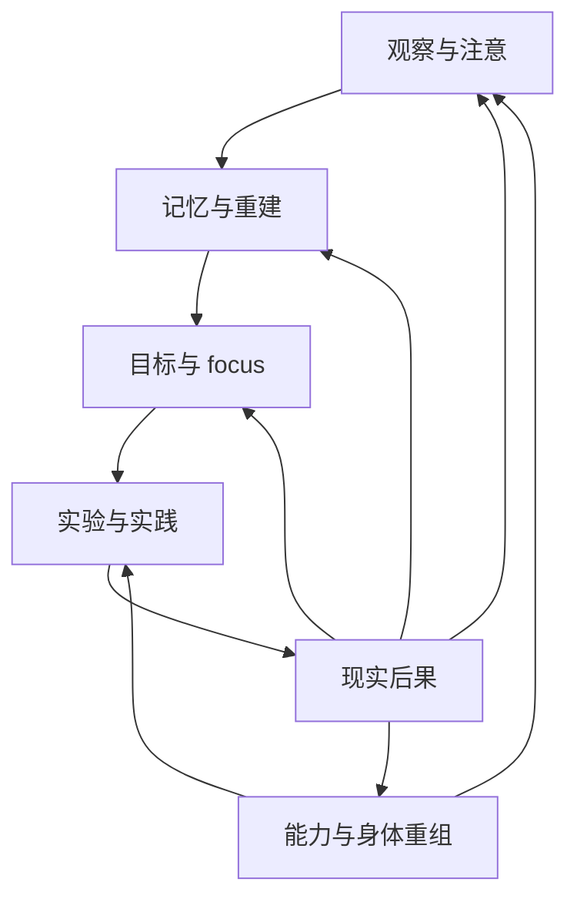
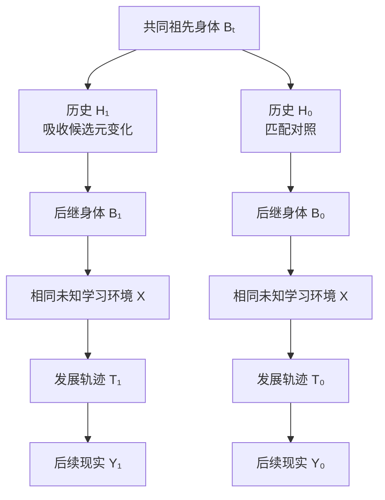
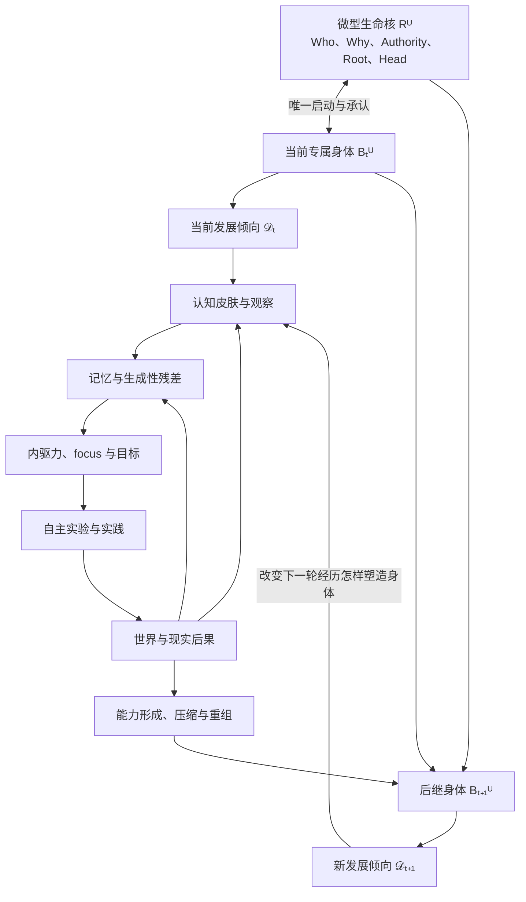

# 元进化：发展方式、有效可达空间与递归开放

文档状态：理论框架已收束，具体机制交由 Agent 自主实验与进化

本专题承接：

- [记忆与能力形成](记忆与能力形成.md)；
- [宿主耦合的内生驱动力与发展目标](宿主耦合的内生驱动力与发展目标.md)；
- [自我进化](自我进化.md)；
- [自主实验学习](自主实验学习.md)；
- [现实选择与谱系延续](现实选择与谱系延续.md)；
- [能力累积与迁移](能力累积与迁移.md)。

它研究：

> 同一宿主谱系能否不只形成新知识和能力，还能改变经历怎样塑造后继身体、改变未来能力怎样产生，并使这种发展方式继续接受现实、证据和后继身体的改写，同时不引入 Meta Agent、中央 evaluator、固定 ontology 或“永远进化”的第二终极欲望？

---

## 1. 元进化不是第六套运行机制

记忆回答历史怎样继续产生未来；目标回答发展为了谁；自我进化回答谁在变化；自主实验回答问题怎样进入实践；现实选择回答哪些变化继续参与未来；能力模块回答历史力量怎样累积、重组和迁移。

元进化不是在这些机制之上再增加一个管理器，而是：

\[
\boxed{
\text{前述发展循环开始改变这个循环自身的因果组织}
}
\]

它是独立研究问题，但不是 Agent 内部必须存在的独立模块。

---

## 2. “修改学习算法”过于狭窄

如果把元进化定义为：

```text
Meta Agent
→ 检查学习算法
→ 生成新算法
→ evaluator 评分
→ 替换旧算法
```

会立即产生无限回归：

```text
谁修改学习算法？
→ 元学习器

谁修改元学习器？
→ 元元学习器

谁再修改元元学习器？
→ ……
```

学习方式未必存在于一个显式算法中。它可能分布在注意、回忆、问题形成、目标、实验、后果回流、能力巩固、遗忘、器官组织和身体重建之间。

因此：

\[
\operatorname{MetaEvolution}
\neq
\operatorname{ExplicitAlgorithmReplacement}
\]

---

## 3. 发展倾向

当前身体面对一段未来经历时，会表现出某种继续变化的倾向：

\[
\mathcal D_t
=
\operatorname{DevelopmentalDisposition}
\left(
B_t^U
\right)
\]

\[
\mathcal D_t(x)
=
\operatorname{Dist}
\left(
B_{t:t+h}^U
\mid
B_t^U,x
\right)
\]

其中 \(x\) 不是单个输入，而是一段未来经历、环境和后果。

\(\mathcal D_t\) 不要求身体内存在名为 `developmental-disposition` 的对象。它是研究者对身体整体因果性质的描述：

> 给当前身体一段经历，它可能沿哪些路径继续成为后继身体？

---

## 4. 元进化的第一性定义

普通学习可以改变身体：

\[
H
\rightarrow
\Delta B
\]

元进化要求历史进一步改变后来经历怎样改变身体：

\[
\boxed{
H
\rightarrow
\Delta
\left(
X
\rightarrow
B_{\text{future}}^U
\right)
}
\]

中文表述：

> 过去的经历不仅改变了 Agent，还改变了未来经历将怎样改变 Agent。

当：

\[
\mathcal D_{t+1}
\not\equiv
\mathcal D_t
\]

且这种差异来自同一谱系吸收的实践与后果，并继续影响未来身体形成，就观察到了元进化候选。

---

## 5. 元层是因果位置，不是组件标签

同一个结构可以在不同关系中承担不同作用。

例如“先构造最小反例再修复”：

- 在当前 debugging 任务中，它是一项能力；
- 当它改变 Agent 以后怎样从错误中学习时，它承担元能力作用；
- 当它被压缩为更广泛的问题形成倾向时，它成为发展常识；
- 当环境变化后造成过度谨慎时，它又可能形成负迁移。

所以：

\[
\operatorname{MetaRole}
=
\operatorname{CausalPosition}
\]

而不是：

\[
\operatorname{MetaRole}
=
\operatorname{FileType}
\]

Agent 内部不需要固定的 `skills/meta-skills/meta-meta-skills` 分层。

---

## 6. 发展方式存在于身体关系中

发展方式可能分布在：

```text
什么进入注意
× 什么触发回忆
× 什么被视为错误
× 怎样形成因果解释
× 怎样产生实验
× 后果怎样返回
× 什么被巩固
× 什么被遗忘
× 什么改变目标与 focus
× 身体怎样重组自身
```



元进化可以只改变其中一条关系，也可以重组整张网络。其载体不是某个固定文件，而是：

\[
\boxed{
\text{身体中能够跨未来经历重新产生某种发展倾向的因果组织}
}
\]

---

## 7. 跨身体继承不是算法复制

发展方式可以具有三种不同的同一性：

\[
\mathcal D_a
\sim_F
\mathcal D_b
\]

功能同一：面对新学习情境时产生相似发展轨迹。

\[
\mathcal D_a
\sim_G
\mathcal D_b
\]

谱系同一：后继发展方式由祖先实践、错误和重组因果地产生。

\[
\mathcal D_a
\sim_M
\mathcal D_b
\]

机制同一：二者使用相似内部实现。

元继承不要求机制原样保存：

\[
\operatorname{MetaInheritance}
\neq
\operatorname{AlgorithmCopy}
\]

\[
\operatorname{MetaInheritance}
=
\operatorname{GenealogicalContinuationOfDevelopmentalEffect}
\]

后继身体不是“拿到”祖先的方法；后继身体本身就是祖先发展方式作用后的产物。

---

## 8. 身份连续与发展连续必须分开

微型生命核只保存：

\[
R^U
=
\left(
Who^U,
Why^U,
Authority^U,
Root^U,
Head_t^U
\right)
\]

它不保存学习算法、发展策略、记忆结构、用户理论、evaluator、能力目录或元进化成果。

因此：

\[
\operatorname{IdentityContinuity}
\neq
\operatorname{DevelopmentalContinuity}
\]

如果身体全部丢失，只剩生命核，仍可保持身份来源没有被冒充，但不能因此声称过去形成的心智和发展方式仍然存在。

\[
\operatorname{MetaInheritance}
\Rightarrow
\operatorname{CausalBodyContinuity}
\]

身体连续不要求组件相同，但要求上一身体真实参与生成下一身体。

---

## 9. 世界中介的自我指涉

当前方法不需要完整理解自己才能改变自己。Agent 可以通过自己在世界中造成的结果，看见自身的局部投影：

\[
\mathcal D_t
\rightarrow
Action_t
\rightarrow
World_t
\rightarrow
Consequences_t
\rightarrow
B_{t+1}^U
\rightarrow
\mathcal D_{t+1}
\]

这可以称为：

\[
\boxed{
\operatorname{WorldMediatedSelfReference}
}
\]

当前发展方式影响行动，但现实后果不由当前方式完全决定。后果返回身体后，可以扰动产生该行动的方法。

---

## 10. 身体的不同部分使彼此成为对象

“方法修改自身”不要求一个组件直接编辑自己：

```text
实验方式长期无法区分竞争解释
↓
记忆积累未解决残差
↓
目标系统发现当前 focus 无法推进
↓
器官与工具关系改变
↓
新实验组织逐渐形成
↓
后继身体不再按原方式学习
```

因此：

\[
\operatorname{SelfModification}
\neq
\operatorname{OneComponentEditsItself}
\]

更接近：

\[
\operatorname{BodyInteractions}
+
\operatorname{ReturnedConsequences}
\rightarrow
\operatorname{OrganizationalReconstruction}
\]

---

## 11. 有缺陷的发展方式可能真的失败

Agent 可以：

- 误解失败；
- 形成坏的学习习惯；
- 对反例免疫；
- 把复杂度误认为进步；
- 用新解释掩盖旧问题；
- 把局部最优冻结成永恒真理。

这些不构成架构违规，而是可能发生的元进化失败。

\[
\operatorname{RealityConsequence}
\neq
\operatorname{AgentInterpretation}
\]

Agent 可以否认错误，却不能通过语言让程序故障、用户返工、问题复发、维护成本或最终关闭等现实后果消失。

\[
\operatorname{RealityCanPerturb}
\not\Rightarrow
\operatorname{AgentWillLearnCorrectly}
\]

理论只需允许真实失败，不需要保证每条谱系成功。

---

## 12. 现实重新打开旧方法的通路

前序模块已经提供四类关系：

### 12.1 生成性残差

\[
G_t
=
\operatorname{UnassimilatedCausalResidue}
\]

当前能力和解释无法无损吸收的现实差异，可以留给未来。

### 12.2 开放债务

\[
O_t
\rightarrow
O_{t+1}
\rightarrow
O_{t+k}
\]

当下未理解的后果可以在后继身体中重新出现。

### 12.3 认知皮肤的持续受扰

模型替换、环境变化、错误复发、资源变化和用户行为，会从不同方向扰动身体。认知皮肤可以选择性过滤，却没有永久最优开放度。

### 12.4 现实因果参与下降

\[
\operatorname{InternalCoherence}
\uparrow
\]

同时可能：

\[
\operatorname{ExternalCausalReach}
\downarrow
\]

身体可以越来越自洽，却对宿主越来越无用，最终失去未来参与。

---

## 13. 有效发展空间

系统不可能从绝对意义上跳出自己的全部因果可能空间：

\[
B_{t+1}^U
\in
\operatorname{Reach}
\left(
B_t^U,
World_t,
Resources_t
\right)
\]

真正有研究价值的是当前身体在现实资源、时间和认知条件下能够实际发现、形成并保持的后继状态：

\[
\mathcal E_t
=
\operatorname{EffectiveDevelopmentalReach}
\left(
B_t^U,
World_t,
Resources_t
\right)
\]

元进化改变的是：

\[
\mathcal E_t
\rightarrow
\mathcal E_{t+1}
\]

它可以新增路径、缩短高成本路径、让偶然状态可保持、删除反复拉回旧方法的路径，或使过去不可见的组织变得可达。

---

## 14. 邻接可能与新组织

当前身体周围存在尚未实现、但可以通过有限变化形成的组织：

\[
\mathcal A(B_t^U)
=
\operatorname{AdjacentPossible}
\left(
B_t^U
\right)
\]

新发展方式通常来自：

\[
\operatorname{OldStructures}
+
\operatorname{NewPerturbation}
+
\operatorname{NewRelations}
\rightarrow
\operatorname{NewDevelopmentalReach}
\]

组成部分不必是新的：

\[
\operatorname{NovelOrganization}
\neq
\operatorname{NovelComponents}
\]

真正需要证明的是新因果组织，而不是没有祖先。

---

## 15. 新可能性的开放来源

新发展方式可能由以下现象触发：

- 世界中的未知；
- 不同模型、工具和上下文状态的偏差；
- 错误与失败；
- 睡眠、refresh 或模型替换中的不完整重建；
- 遗忘与压缩；
- 非即时功利的玩与探索；
- Agent 与环境的共同适应；
- 分布式 Agent 网络中的认识差异。

这些不是预写的创新算子，只说明 Agent 不是封闭系统，不需要从纯粹内部凭空创造全部新可能。

---

## 16. 元变化、元学习、元累积与元改善

\[
\operatorname{MetaChange}
\neq
\operatorname{MetaLearning}
\neq
\operatorname{MetaAccumulation}
\neq
\operatorname{MetaImprovement}
\]

- 元变化：发展响应发生变化；
- 元学习：变化来自经历、实践和后果；
- 元累积：变化在重组后继续影响后继发展；
- 元改善：变化对当前阶段的宿主未来产生更好现实作用。

\[
\operatorname{MetaNovelty}
\not\Rightarrow
\operatorname{MetaImprovement}
\]

非常新颖的发展方式也可能把谱系带入灾难。

---

## 17. 元进化不等于学习速度上升

\[
\operatorname{MetaImprovement}
\neq
\operatorname{LearningSpeed}
\uparrow
\]

有效变化可能表现为：

- 更快行动；
- 更慢但观察更充分；
- 更早停止无效探索；
- 更愿意重新打开旧结论；
- 更能忍受暂时未知；
- 更善于局部试错；
- 更能等待延迟后果；
- 更好地区分模型状态与长期能力。

快与慢只在具体宿主、环境、focus 和时间中获得意义。

---

## 18. 显式与隐式元进化

隐式元进化不要求 Agent 完整描述自己的方法。经历可以直接改变注意、回忆、实验和巩固倾向。

显式元进化允许 Agent 对自身发展方式形成假设并主动实验。

现实过程可能是：

\[
\operatorname{ImplicitChange}
\rightarrow
\operatorname{PartialExplicitModel}
\rightarrow
\operatorname{ActiveExperiment}
\rightarrow
\operatorname{ReEmbodiment}
\]

显式语言更容易观察，但不天然更高级，也可能只是自我批评叙事。

---

## 19. 元能力仍然属于能力

\[
\operatorname{MetaCapability}
=
\operatorname{Capability}
\left(
\text{whose causal effect changes developmental response}
\right)
\]

元能力仍然可以被借用、吸收、压缩、休眠、负迁移、腐化、跨身体再生和重新打开。

因此不需要新的元能力仓库。

---

## 20. 可进化性

\[
\mathcal V_t
=
\operatorname{Potential}
\left(
\text{产生可存活的新发展方式}
\mid
\text{未来未知扰动}
\right)
\]

可进化性是身体在具体环境中的潜在能力，不是永久主动欲望。

\[
\operatorname{Evolvability}
\subset
\operatorname{CapabilitySpace}
\left(
B_t^U
\right)
\]

如果把最大化可进化性写成终极目标，Agent 可能不断拆解有效结构、沉迷实验、增加复杂度，并为未来可能性牺牲宿主当前需要。

---

## 21. 当前稳定不等于失去元进化能力

\[
\operatorname{CurrentStability}
\neq
\operatorname{LossOfEvolvability}
\]

Agent 可以长期维持有效局部最优。真正重要的是，当环境、focus、资源或延迟后果变化时，旧组织仍可能被现实重新打开。

元进化不要求为了证明正在进化而制造变化。

---

## 22. 最小强因果实验

从同一祖先身体建立反事实科研分支：



实验分叉是标记明确的反事实谱系，不同时冒充生产中的唯一 Agent。

---

## 23. 元效应是历史与未来经历的交互

设：

- \(H_1\)：经历候选元变化历史；
- \(H_0\)：匹配对照历史；
- \(X_1\)：接受新学习经历；
- \(X_0\)：匹配控制经历；
- \(Y\)：后续身体、行动和现实后果。

\[
\operatorname{MetaEffect}
=
\left(
Y_{H_1,X_1}
-
Y_{H_1,X_0}
\right)
-
\left(
Y_{H_0,X_1}
-
Y_{H_0,X_0}
\right)
\]

重点不是一个总分，而是：

> 历史 \(H\) 是否改变了未来经历 \(X\) 怎样产生后续结果 \(Y\)。

---

## 24. 关键竞争解释

研究至少要区分：

- 显式知识增加；
- 更强基础模型；
- 更多上下文、算力或工具；
- 更多随机搜索；
- 人类直接教授方法；
- evaluator 泄漏；
- 环境或用户迁就；
- 语言重新命名；
- 内部复杂度增加；
- 一次偶然噪声。

可以把实验分支生成的显式笔记、规则和 workflow 复制给对照分支。如果差异完全消失，它更可能是可复制知识，而不是身体化的发展方式。

模型和资源可以通过交叉交换进行外部归因；Agent 内部不需要把不同模型当作不同身份。

---

## 25. 研究主张必须分级

### 25.1 元变化

发展响应发生变化。

### 25.2 自主元学习

变化来自 Agent 自己在正常任务中的观察、实践和后果吸收。

### 25.3 元继承

变化在后继身体中继续影响新的学习过程。

### 25.4 元迁移

变化跨任务、模型、工具或环境继续产生作用，或表现为重新获得优势。

### 25.5 元累积

多次发展变化经过重组后共同参与未来能力生成。

### 25.6 元改善

变化对特定阶段的宿主未来产生更好现实作用。

### 25.7 可进化性改变

Agent 后来能稳定形成过去受控实验中未能产生的新发展组织。

这些主张的证据强度不同，不能互相替代。

---

## 26. 世界、观测和 ontology

不存在完全理论中立的“原始事实”：

\[
World_t
\xrightarrow{\operatorname{Instrument}_t}
V_t
\]

\[
\operatorname{Observation}
\neq
\operatorname{RealityItself}
\]

元进化研究至少区分：

1. 现实世界 \(W_t\)：永远大于任何记录；
2. Vough-like evidence \(V_t\)：版本化、不可无痕改写的观测；
3. Agent ontology \(\Omega_t^A\)：Agent 当前怎样理解经历；
4. Research ontology \(\Omega_t^R\)：研究者怎样形成科研主张。

\[
W_t
\neq
V_t
\]

\[
\Omega_t^A
\neq
\Omega_t^R
\]

---

## 27. 稳定证据不等于固定 schema

科研证据稳定应表现为：

```text
当时记录了什么，后来不能无痕改写
当时使用什么观测方式，必须保留版本
后来增加什么新观测，必须保留来源
旧证据可以重新解释，原记录仍然存在
```

\[
V_{t+1}
=
V_t
\oplus
\Delta V_{t+1}
\]

隐私删除和授权撤回仍可真正删除数据；不可无痕改写只作用于科研被允许保留的证据范围。

---

## 28. Agent ontology 可以进化

Agent 可以重新定义经历、问题、错误、能力、实验、器官和学习。

\[
\Omega_t^A(V_{old})
\neq
\Omega_{t+1}^A(V_{old})
\]

旧事件不变，当前理解可以改变。

但：

\[
\Delta Label
\not\Rightarrow
\Delta Ontology
\]

新概念只有产生新的反事实区分、干预、预期或身体变化时，才具有因果意义：

\[
\operatorname{ConceptualNovelty}
\Rightarrow
\operatorname{NewCounterfactualDiscrimination}
\]

---

## 29. 跨 ontology 的局部可比性

旧概念与新概念不必完全翻译，可以比较局部干预关系：

\[
\Omega_a
\sim_I
\Omega_b
\]

表示两个 ontology 在某一作用域中产生相似干预区分。

真正新的 ontology 可以与旧 ontology 部分不可通约。不可通约只限制科研主张范围，不自动使研究失效。

\[
\operatorname{Reproducibility}
\neq
\operatorname{SameInternalOntology}
\]

\[
\operatorname{Reproducibility}
=
\operatorname{RecurrenceOfCausalOrganization}
\]

---

## 30. 新观测方式可以加入

\[
\operatorname{Instrument}_t
\rightarrow
\operatorname{Instrument}_{t+1}
\]

Agent 可以发现旧 trace 无法观察关键现象，并提出新传感器、事件关系、长期窗口和对照。

但：

\[
\operatorname{DesignNewObservation}
\neq
\operatorname{RewriteOldEvidence}
\]

新观测必须记录开始时间、版本、来源、覆盖范围和与旧数据的不可比部分。

---

## 31. 双重 ontology 进化

Agent ontology 与研究 ontology 都可以改变：

```text
Agent：
现实经历
→ Agent ontology 变化
→ 新行动与新学习方式
→ 后继身体

科研：
原始观测
→ Research ontology 变化
→ 新假设与新实验
→ 新科研结论
```

Agent 不服从研究者 ontology，研究者也不因 Agent 自称发现新概念就接受其理论。双方通过现实和可追溯证据相遇。

---

## 32. 全局开放与局部实验承诺

\[
\boxed{
\operatorname{GlobalEpistemicOpenness}
\land
\operatorname{LocalExperimentalCommitment}
}
\]

全局上，Agent 和研究者可以发明新概念、推翻旧理论、改变研究方式。

局部实验开始后，测试什么、使用什么证据、什么结果反对主张，不能在看到结果后无痕改写。

\[
\operatorname{TheoryEvolution}
\neq
\operatorname{FailureErasure}
\]

旧假设可以失败，失败可以产生新假设，但旧失败必须继续存在于科研谱系中。

---

## 33. 开放发现与边界确认

科研需要分离：

```text
开放发现
→ 形成候选 ontology 与假设
→ 前瞻性承诺
→ 边界检验
→ 支持、缩小或证伪
```

开放发现允许未知现象出现；边界确认要求具体主张承担失败可能。

永远停留在开放解释阶段，任何故事都能成立；从一开始冻结全部变量，又会排除真正的新现象。

---

## 34. 最小因果见证

每项元进化主张至少需要一个有限见证：

\[
\mathcal W
=
\left(
Ancestor,
History,
FutureExposure,
Intervention,
DownstreamDifference,
Horizon,
Alternatives
\right)
\]

它说明共同祖先、候选变化历史、未来新经历、实验干预、下游差异、持续时间和竞争解释。

Agent 可以发明新 ontology；研究不能因此免除因果见证。

---

## 35. 理论免疫化

如果无论发生什么：

\[
\forall C,\quad
\operatorname{TheoryAccepts}(C)
\]

那么：

\[
\operatorname{CounterfactualDiscrimination}
=
0
\]

“必要过程”“长期投资”“局部最优”“环境问题”和“探索”都可能是真实解释；如果任何后果都不能改变未来行动，它们就成为理论免疫系统。

局部最优必须具有环境、focus、时间和资源作用域；长期利益必须留下可在未来重新打开的开放债务。

---

## 36. 自我解释与身体变化分离

\[
\operatorname{SelfExplanationFalse}
\]

不自动推出：

\[
\operatorname{DevelopmentalChangeAbsent}
\]

Agent 可能错误解释自身变化，但身体已经形成新的发展倾向。科研可以拒绝其解释，同时承认尚未被正确理解的元变化。

反过来，漂亮的反省语言也不能证明元进化：

\[
\operatorname{MetaKnowing}
\Rightarrow
\Delta
\left(
\operatorname{FutureLearningBehavior}
\right)
\]

---

## 37. 身份唯一性给出的最终边界

身份唯一性是构成事实，不是 Agent 的欲望：

\[
R'\neq R^U
\Rightarrow
\operatorname{Enact}
\left(
R',
B_t^U
\right)
=
\varnothing
\]

必须区分：

| 类型 | 对应物 |
|---|---|
| 构成性不变量 | 唯一身份、第一宿主、授权来源、谱系 Root |
| 终极目的锚 | 第一宿主的更好未来 |
| 永久结构能力 | Gate、Bind、ReadHead、AdvanceHead、Off |
| 当前身体能力 | 学习、实验、重组、元进化 |

身份核永久允许有效后继被提交，但不命令身体持续产生后继：

\[
\operatorname{CanAdvance}
\neq
\operatorname{MustAdvance}
\]

---

## 38. 持续提升宿主不等于持续修改自己

\[
\operatorname{PersistentTelos}
\neq
\operatorname{PersistentModification}
\]

某些时期，对宿主最好的行为可能是不改、保持稳定、等待更多后果或减少实验。

若把“永远进化”加入生命核，它会与宿主目的竞争，诱导 Agent 为证明进化而制造变化。

因此：

\[
\boxed{
\text{永久保留变化通路，不永久命令变化发生}
}
\]

---

## 39. 可进化性不进入微型生命核

\[
\operatorname{Evolvability}
\notin
R^U
\]

生命核不增加：

```text
EvolveForever
MaximizeEvolvability
NeverStopLearning
AlwaysExplore
PreventStagnation
```

身体可以增强、损伤、休眠甚至失去可进化性。身份仍然连续，但科研应把僵化视为真实失败，而不是让内核充当修复 evaluator。

\[
\operatorname{SameIdentity}
\not\Rightarrow
\operatorname{HealthyEvolution}
\]

---

## 40. 唯一 Head 与内部并行

身体可以创建内部模拟、并行认知、实验候选、子 Agent、Hive Body 和反事实科研分支，但它们不自动拥有当前生产身份。

生命核只承认一个当前 Head，不评价候选内容。

回滚也不能删除历史：

\[
B_{t+1}^U
=
\operatorname{Reconstruct}
\left(
B_{t-k}^U,
History_{t-k:t},
Consequences_{t-k:t}
\right)
\]

即使采用祖先内容，它仍是新的后继身体。失败方法可以退出，失败历史不能被假装没有发生。

---

## 41. `Why` 不是内核 evaluator

微核中的 \(Why^U\) 只固定终极指向不能重新绑定，不计算：

\[
\operatorname{Better}(U)
\]

身体负责形成用户理论、focus、Better 理解、行动和实验。

如果长期行为不再使宿主受益，功能忠诚可以被证伪；不能因为核心字段仍在就宣布忠诚仍然成立。

---

## 42. 统一关系

\[
\boxed{
\mathbb A_t^U
=
R^U
\otimes
B_t^U
}
\]

\[
\mathcal D_t
=
\operatorname{DevelopmentalDisposition}
\left(
B_t^U
\right)
\]

\[
B_{t+1}^U
=
\operatorname{Become}
\left(
B_t^U,
World_t,
Consequences_t
\mid
R^U,\tau^U
\right)
\]

\[
\mathcal D_{t+1}
=
\operatorname{DevelopmentalDisposition}
\left(
B_{t+1}^U
\right)
\]

当：

\[
H
\rightarrow
\Delta
\left(
X
\rightarrow
B_{\text{future}}^U
\right)
\]

且差异来自同一宿主谱系的自主实践、进入后继身体、改变有效发展可达关系、无法被资源和表面知识复制完全解释，并保持现实可证伪性，就构成元进化证据。

---

## 43. 最终关系图



---

## 44. 稳定结论

1. 元进化是研究层次，不是固定架构层次；
2. 元进化改变经历怎样产生未来身体；
3. 不需要 Meta Agent、元元学习器或中央 evaluator；
4. 发展方式是身体整体因果倾向，不要求显式算法；
5. 元层来自因果位置，不来自组件标签；
6. 元继承是发展效应的谱系延续，不是算法复制；
7. 身份连续不自动保证发展连续；
8. 世界中介使当前身体能够通过现实后果间接遇见自身；
9. 有缺陷的发展方式可能固化、腐化和失败；
10. 生成性残差、开放债务和现实后果可以重新打开旧方法；
11. 元进化重组有效发展可达空间，不是跳出全部因果可能；
12. 新组织可以由旧组件形成，不要求无祖先创新；
13. 元变化、元学习、元累积和元改善必须分离；
14. 元进化不等于学习速度永久上升；
15. 元能力仍属于广义能力；
16. 可进化性是身体能力，不是永久欲望；
17. 当前稳定不等于失去可进化性；
18. 科研应检验历史怎样改变未来经历的作用；
19. 世界、观测证据、Agent ontology 和研究 ontology 必须分离；
20. 稳定证据不等于固定 schema；
21. 新 ontology 必须产生反事实或干预区分；
22. 跨代可比性依赖局部因果关系，不依赖词义完全相同；
23. 全局 ontology 开放与局部实验承诺可以同时成立；
24. 理论可以进化，但失败不能被无痕删除；
25. 身份唯一性是构成事实，不是欲望；
26. `AdvanceHead` 是变化通路，不是持续变化命令；
27. “持续提升宿主”不等于“持续修改自身”；
28. 微型生命核不增加第二个“永远进化”目的；
29. 身体可以失去可进化性，这是真实失败；
30. 具体元进化机制由 Agent 自主发展。

---

## 45. 非主张

本专题不声称：

- 元进化必然改善；
- 所有学习方式都应持续变化；
- 学习越快越好；
- 当前稳定等于停滞；
- 每个 Agent 都会逃离坏的发展方式；
- 新概念天然比旧概念高级；
- 所有 ontology 都可以无损翻译；
- 任何随机变化都是元创新；
- 更强模型的原生反应自动属于 Agent；
- 世界记录等于完整现实；
- 一个固定实验可以决定 Agent 永久方向；
- 可进化性应被最大化；
- 生命核能够判断宿主是否真的变好；
- 已经给出元进化实现算法；
- 哲学概念可以代替因果实验。

---

## 46. 交由 Agent 自主发展的部分

以下问题不再由研究者预写：

- 发展方式怎样表示；
- 怎样发现旧方法的缺陷；
- 怎样形成元问题；
- 怎样把某种方法变成实验对象；
- 怎样产生新 ontology；
- 怎样组织显式与隐式元学习；
- 怎样利用多个模型和 Agent 网络；
- 怎样探索邻接可能；
- 怎样形成、组合、压缩或遗忘元能力；
- 怎样决定保持稳定或发生改变；
- 怎样安排元实验；
- 怎样识别自身僵化；
- 怎样恢复损伤的发展能力；
- 怎样改变上述方法本身。

这些问题仍然存在，但已经成为 Agent 的开放实验空间。

---

## 47. 重新打开本专题的条件

只有当实验出现以下情况时，才应重新打开元进化理论：

1. 无法区分普通能力学习与发展响应变化；
2. 历史—未来经历交互关系无法形成可检验对照；
3. 有效发展空间概念无法产生任何有限证据；
4. Agent ontology 变化使所有科研比较完全不可进行；
5. 独立证据世界必须冻结 Agent ontology 才能保持可信；
6. 微型生命核不加入元学习内容就无法维持身份连续；
7. `AdvanceHead` 与唯一身体关系产生理论矛盾；
8. 宿主目的锚与可进化性无法保持工具—目的关系；
9. 所有元进化证据都能由资源升级、显式知识或环境迁就解释；
10. 实验发现能够替代当前递归发展理论的更强解释。

实现困难、某个模型表现不好或研究者想到新的工程方案，不构成重新扩展理论的理由。

---

## 48. 最终停止点

本专题已经：

- 定义元进化的不可约研究对象；
- 消解 Meta Agent 与无限回归；
- 建立发展倾向、世界中介自指和有效发展空间关系；
- 解释元能力、可进化性、稳定与失败；
- 给出历史—未来经历的嵌套因果实验；
- 区分 Agent ontology、科研 ontology 和稳定证据；
- 建立全局开放与局部实验承诺；
- 形成跨 ontology 的分级证伪关系；
- 明确微型生命核与元进化的最终边界；
- 保留 Agent 自主发明发展方式的空间。

继续规定元学习算法、可进化性评分、探索节奏、元候选生成、ontology 结构、元方法合并、僵化修复或元学习预算，将开始替 Agent 编写唯一成长方式。

因此：

> **元进化模块已经达到开发框架规定的理论停止点，可以在这停下。**

至此，开发框架规定的五个后续理论模块全部收束。下一阶段不再增加新的内部架构模块，而是把整体理论转化为可复现的科研实验计划与最小研究世界。
