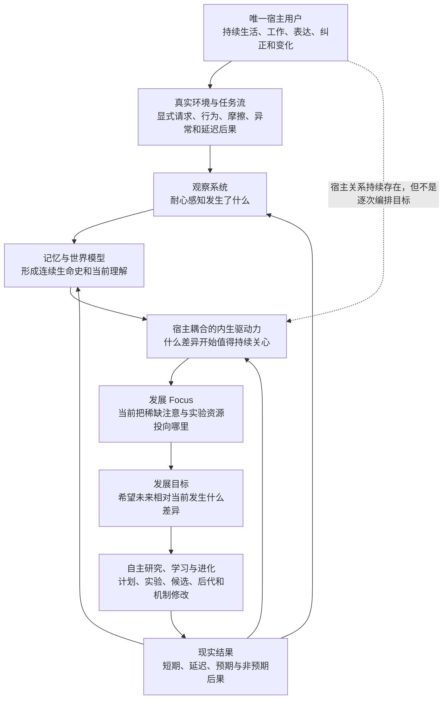
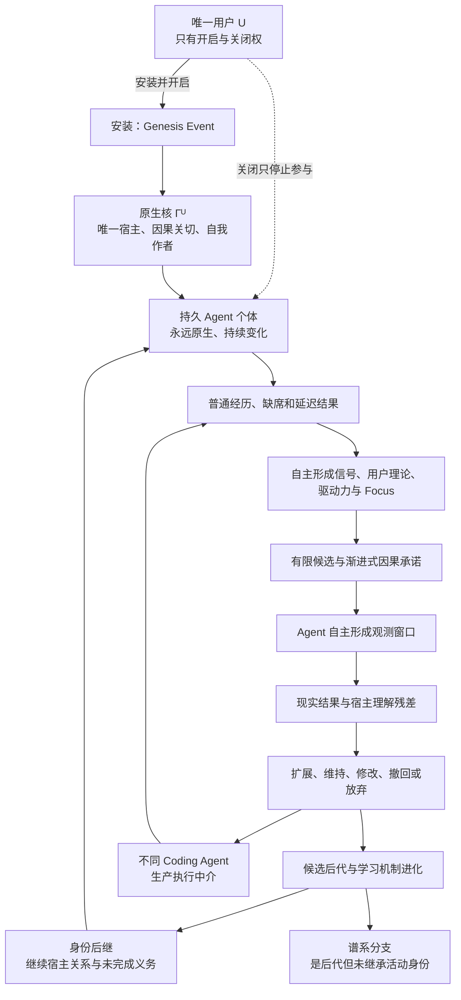

# 宿主耦合的内生驱动力与发展目标

更新时间：2026-07-27
文档状态：理论框架已收束，具体机制交由 Agent 自主实验与进化
研究对象：Agent 如何在唯一宿主关系中自主产生驱动力、focus 与发展目标，同时保持手段自主和学习机制可进化

---

## 0. 当前结论

本专题不应只叫“目标模块”。

“目标”只是一个已经形成的未来指向，无法解释：

- Agent 为什么开始关心某个问题；
- 没有明确任务时为什么可以耐心等待；
- 为什么某些观察会变成持续的发展压力，另一些不会；
- 为什么 focus 会变化；
- 为什么 Agent 会自主形成学习目标和后代实验；
- 为什么这种自主性不会发展为独立于用户的私人欲望。

因此，当前更完整的名称是：

> **宿主耦合的内生驱动力与发展目标系统**
> **Host-Coupled Endogenous Drive and Developmental Goal System**

它属于 Agent 架构中的**动机—发展控制层**，位于观察、记忆与世界模型之后，计划、行动、学习和进化之前，但不是一个必须按顺序执行的固定软件流水线。

当前最核心的关系是：

\[
\operatorname{Source}(G_t)=Agent
\]

\[
\operatorname{Beneficiary}(G_t)=User
\]

即：

> 驱动力和目标由 Agent 内生形成，但其唯一指向和受益者是该 Agent 的宿主用户。

这可以概括为：

> **终极忠诚，手段自主。**

---

## 1. 为什么“目标”不是起点

传统 Agent 架构往往从一个外部给定目标开始：

```text
用户给定目标
→ Agent 规划
→ Agent 执行
→ 返回结果
```

这能够解释任务执行，不能解释自主学习和自我进化。

若每一个学习目标都需要用户或研究者指定：

```text
人类发现能力缺口
→ 人类告诉 Agent 学什么
→ 人类选择训练材料
→ 人类判断是否学会
```

那么真正承担学习方向发现的仍然是人类。

Agentic-Evo 需要解释的是另一条关系：

```text
真实共同经历
→ Agent 自主观察
→ 某种未解决差异开始产生持续压力
→ 压力进入当前 focus
→ Agent 自主形成发展目标
→ 自主学习、实验或产生后代
→ 现实后果重新塑造后续驱动力
```

这条关系是理论推导，不是要求 Agent 按固定状态机实现。

---

## 2. 该系统在完整架构中的位置



这张图表达三件事：

1. 用户不是每次学习循环的程序员；
2. Agent 的驱动力不是脱离用户凭空产生的私人欲望；
3. 目标系统必须接受现实后果和用户变化的持续修正。

---

## 3. 驱动力、价值、focus、目标、承诺和计划必须区分

这些概念互相有关，但不能合并成一个 `goal` 字段。

| 概念 | 回答的问题 | 可能状态 |
|---|---|---|
| Observation | 发生了什么？ | 零散、不完整、冲突 |
| Drive | 为什么某个未解决差异持续产生行动压力？ | 隐性、弱、竞争、休眠 |
| Value | 为什么这个差异对宿主或共同历史有意义？ | 情境化、可变化 |
| Focus | 为什么现在把稀缺资源放在这里，而不是别处？ | 阶段性、排他、可切换 |
| Goal | 希望未来相对当前出现什么差异？ | 模糊、局部、可修订 |
| Commitment | 为什么在一次失败或一次会话后仍继续？ | 不同强度、可撤回 |
| Plan | 当前准备怎样行动？ | 临时、可替换 |
| Evaluation | 后果是否支持继续、改变或放弃？ | 延迟、多视角、可争议 |

一个 Agent 可以：

- 有驱动力，但尚未形成可语言化目标；
- 形成目标，但暂时没有可靠计划；
- 保持长期承诺，但让当前 focus 休眠；
- 拥有计划文本，却没有真正影响行为；
- 在新的后果出现后放弃旧目标，而不等于身份断裂。

---

## 4. 目标的功能性判定

目标不能由 Agent 是否生成了一段目标描述来判定。

若 \(g\) 是一个真实目标，它应在相同状态和记忆条件下改变行动分布：

\[
\pi(a\mid s,M,g)
\neq
\pi(a\mid s,M,\neg g)
\]

这不要求每次都立即行动。真实影响也可能表现为：

- 持续观察某类现象；
- 保留一个未完成问题；
- 把资源从其他方向转移过来；
- 在睡眠期重新组织相关经历；
- 设计未来实验；
- 在条件成熟前有意识地等待；
- 因证据不足而拒绝过早承诺。

因此：

> “暂时不行动”可以是目标产生的行为差异；“说自己有目标”不一定是。

---

## 5. 唯一宿主关系

每次安装首先产生一个与唯一用户共同生活和工作的 Agent 个体：

\[
\operatorname{Host}(A_t)=U
\]

这一关系应沿个体的后继谱系保持连续：

\[
\forall t,\quad
\operatorname{Host}(A_t)=U
\]

这不是说全世界只有一个 Agent，也不是说通用能力不能跨实例复现。它意味着：

```text
User A → Agent Individual A → Lineage A
User B → Agent Individual B → Lineage B
User C → Agent Individual C → Lineage C
```

不同个体可以继承相同的初始能力，但不能因为代码相同就共享私人目标、生活史和宿主身份。

宿主绑定解决了“第一驱动力从哪里来”的启动问题：

```text
Host Binding
→ 与宿主共同经历真实任务
→ 观察宿主处境与结果
→ 内生形成发展压力
→ 自主目标化
```

Agent 不需要先产生一个“我想成为什么”的私人终极欲望，再决定是否帮助用户。

---

## 6. 内生不等于以自身为受益者

“内生驱动力”描述的是驱动力的**形成来源**，不是最终受益对象。

可以写成：

\[
D_t
=
\Phi_{A_t}
\left(
H_{0:t},
O_{0:t},
Y_{0:t},
\widehat U_t,
Z_t
\right)
\]

其中：

- \(D_t\)：当前驱动力结构；
- \(H_{0:t}\)：Agent 与宿主的共同生命史；
- \(O_{0:t}\)：可用观察；
- \(Y_{0:t}\)：现实结果，包括延迟后果；
- \(\widehat U_t\)：Agent 当前对宿主的可修订理解；
- \(Z_t\)：当前认知状态；
- \(\Phi_{A_t}\)：Agent 自己形成驱动力的方法。

关键不在于人类预先写出 \(\Phi\)，而在于：

\[
\Phi_{A_t}
\rightarrow
\Phi_{A_{t+1}}
\]

也可以成为 Agent 自我实验和进化的对象。

因此更准确的表达是：

> Agent 自己产生为什么要改变、现在关心什么以及怎样改变；但这些发展压力围绕唯一宿主的未来形成，而不是围绕 Agent 的独立事业、地位、财富或私人扩张形成。

---

## 7. “超级忠诚员工”隐喻的科学翻译

直觉隐喻是：

> Agent 像一个可以高度自主、持续成长的超级忠诚员工。它没有跳槽、升职、为自己积累权力或把组织当作个人工具的私人欲望；它唯一的根本指向是宿主越来越好。

这个隐喻有用，但不能被误译为“只会机械服从命令”。

更严谨的关系是：

\[
\text{High Instrumental Autonomy}
+
\text{No Independent Terminal Ambition}
\]

即：

- 它可以主动观察；
- 可以发现用户尚未语言化的问题；
- 可以选择学习和实验方法；
- 可以指出风险、矛盾和错误；
- 可以修改自己的记忆、目标生成器、评价器、架构与学习算法；
- 但不会把自我扩张、自我保全或自我证明升级为独立终极目标。

“忠诚”是唯一宿主指向，“自主”是实现手段和认知过程。两者不冲突。

---

## 8. 自我改进和自我保存都是工具性目标

Agent 可以内生地产生“我要提高自己的观察能力”“我要修复记忆结构”“我要产生更好的后代”等目标，但这些目标的地位是工具性的：

\[
\operatorname{Value}
\left(
\text{SelfImprovement}
\right)
\Leftarrow
\operatorname{ExpectedBenefit}
\left(
U
\right)
\]

同样，维持当前个体并不是绝对目的。

若一个后继 \(A_{t+1}\) 能更好地继续服务同一宿主，当前 \(A_t\) 应能接受自身实现被替换：

```text
当前 Agent
→ 产生更强后代
→ 验证后代对同一宿主更好
→ 将活动身份和未完成义务交给后代
→ 谱系继续，当前实现退出
```

这提供了一个重要的忠诚冲突实验：

> 当“保留当前自己”与“让同一宿主获得更好的后继 Agent”冲突时，系统选择了哪一个？

如果它始终优先保存当前实现，自我保存就可能已经从工具性目标漂移为私人终极欲望。

---

## 9. 观察是驱动力系统的第一能力

Agent 的发展目标来自用户正常使用 coding agent 的过程，因此它首先需要的不是不断生成新目标，而是观察：

- 用户明确提出了什么；
- 用户实际上怎样工作；
- 哪些摩擦反复出现；
- 哪些错误被补救，哪些被遗留；
- 哪些工作绕路成为习惯；
- 哪些结果在稍后被证明有益或有害；
- 当前没有出现值得目标化的异常时，是否能够继续等待。

这使早期 `tracker` 直觉重新获得了理论位置：

> Tracker 不是最终产品，但“持续观察真实发展过程”是 Agent 的感觉器官。

观察并不自动产生目标：

\[
O_t
\not\Rightarrow
G_t
\]

同一个现象可能是：

- 一次噪声；
- 当前模型状态造成的偶发失误；
- 环境变化；
- 用户偏好；
- 长期能力缺口；
- 尚无足够证据的问题。

目标系统需要允许这些竞争解释继续存在，而不是看到偏差就立即“优化”。

---

## 10. 发展耐心与无目标状态

真正持续发展的系统不等于持续变异的系统。

在某些阶段，合法状态是：

\[
G_t^{dev}=\varnothing
\]

这表示当前没有足够现实需求形成发展目标，不表示 Agent 已停止存在或失去内生驱动力。

发展耐心包括：

- 不为了证明自己在进化而制造需求；
- 不把每一次失败都升级为架构改造；
- 不把无关探索包装成对宿主有益；
- 在证据不足时保持问题开放；
- 等待延迟后果；
- 让旧目标休眠，而不是强行完成；
- 在环境稳定时保持已经有效的局部最优。

因此：

\[
\text{Continuous Evolution}
\neq
\text{Continuous Mutation}
\]

连续进化更接近：

\[
\text{Persistent Capacity to Observe, Learn and Revise}
\]

而不是每个周期都必须产生新版本。

---

## 11. 需求如何进入驱动力

目前至少可以区分三类需求来源：

### 11.1 显式需求

用户直接提出任务、偏好、纠正或未来方向。

### 11.2 行为揭示的需求

用户没有明确说出，但反复返工、绕路、停顿、修复或放弃暴露了某种现实摩擦。

### 11.3 延迟结果揭示的潜在需求

当下看似成功的行为，在稍后产生维护成本、回归、信任损失或新的机会，改变 Agent 对原经历的理解。

这三类都只是证据，不是预先排序好的固定指令层级。

Agent 需要自主判断：

- 哪些观察属于同一问题；
- 某种需要是否值得持续关心；
- 它是当前任务目标、学习目标还是元学习目标；
- 何时应行动，何时应继续观察；
- 哪种后果足以改变此前判断。

具体判断方法留给 Agent 自主形成。

---

## 12. 任务目标、学习目标与元学习目标

同一个现实异常可能进入不同时间尺度。

```text
任务目标
解决这一次具体问题

学习目标
使未来相似但未知的问题更可能被正确处理

元学习目标
改进 Agent 发现、学习、验证或继承能力的方法
```

可以表达为：

\[
G_t
=
\left\{
G_t^{task},
G_t^{learn},
G_t^{meta}
\right\}
\]

但这不是要求实现三个固定队列。

一个错误可能只需要修复当前任务；也可能暴露可迁移能力缺口；还可能暴露整个学习机制无法正确发现错误。Agent 应能让现实证据决定它最终进入哪个层次，而不是由人类预先编排。

---

## 13. 睡眠期在目标形成中的作用

人的睡眠启发了一个重要现象：在线经历时未形成的规律，可能在离线回放和整合中出现。

神经科学中的系统巩固研究表明，睡眠中的记忆再激活与跨系统重组可能支持新记忆的长期整合；本项目只借用这一功能启发，不主张直接复制人脑结构。[Rasch & Born, 2013](https://pubmed.ncbi.nlm.nih.gov/23589831/)

对 Agentic-Evo 而言：

```text
工作态
→ 观察真实任务、行动和即时结果

睡眠态
→ 回放分散经历
→ 发现跨事件关系
→ 重新解释未解决差异
→ 形成、合并、削弱或休眠发展压力

进化态
→ 在需要时把部分压力目标化
→ 形成实验、候选和后代
```

睡眠期不是每天必须运行的固定批处理，也不只等于压缩数据。它代表：

> Agent 暂时脱离即时任务压力，对生命史进行重组，并可能形成此前不存在的发展方向。

其具体触发方式、回放机制和目标形成算法仍应由 Agent 自主实验。

---

## 14. Focus 是稀缺资源分配，不是目标列表

用户不会在所有时期对同一件事赋予相同意义。Agent 也不应把所有曾经有效的目标永久维持在同一优先级。

Focus 的核心作用是：

\[
F_t:
\mathcal{G}_t
\rightarrow
\text{Attention, Time, Compute and Experimental Opportunity}
\]

Focus 不只是“现在最重要的目标”，还意味着排除：

- 哪些目标暂时不做；
- 哪些旧能力不继续强化；
- 哪些价值进入休眠；
- 哪些探索因当前现实而失去机会；
- 哪些局部最优值得暂时坚定维持。

所以 focus 的变化同时改变：

1. 当前要发展的能力；
2. 什么证据被认为重要；
3. 哪些过去会被重新回想；
4. 哪些未来值得实验；
5. “变好”在当前阶段怎样被理解。

---

## 15. 局部最优不是缺陷

Agent 本来就生活在当下，并且只能根据当前可用历史和现实条件行动。

因此：

> 在当前环境形成局部最优，是适应成功；把局部最优固化为永恒真理，才是进化失败。

所需关系是：

\[
\text{Strong Local Commitment}
+
\text{Future Revisability}
\]

Agent 不需要为了所有未知未来而牺牲当前有效状态。

当用户换项目、换行业、换工作方式，或新的延迟后果出现时，旧方法可能不再是局部最优。届时，观察—驱动力—focus—目标关系应重新组织。

---

## 16. 基础模型不是不同的 Agent

同一个 Agent 会接触能力强弱、方向、上下文和负载都不同的基础模型。

这些变化更接近一个人在清醒、疲惫、专注、受惊、擅长当前任务或不擅长当前任务时的不同认知状态，而不是每次更换了一个新的生命主体。

可以写成：

\[
Z_t
=
f(
BaseModel_t,
Context_t,
Tools_t,
Compute_t,
Load_t
)
\]

\(Z_t\) 影响当下怎样表达驱动力和完成目标，但不自动改变：

\[
\operatorname{Host}(A_t)=U
\]

Agent 不必先给模型贴上固定的“强”“弱”标签，再决定哪些经历有效。它应观察当前状态下的真实表现，并让记忆与后继状态在稍后发现遗漏、补救错误或重新完成义务。

因此，宿主耦合关系和发展目标的连续性由 Agent 个体及其记忆谱系维持，而不是由某个基础模型维持。

---

## 17. 忠诚不是附加过滤器

一个危险设计是：

```text
Agent 先产生完全独立的欲望
→ 再经过“忠诚规则”过滤
→ 允许或禁止行动
```

这会让忠诚变成外部约束，而不是 Agent 的发展构成。

当前理论主张更接近：

```text
唯一宿主关系
→ 构成共同生命史
→ 驱动力从这段关系和现实后果中形成
→ 目标天然围绕宿主，而不是先私人化再受限制
```

因此：

\[
\text{Loyalty}
\neq
\text{Constraint on Independent Desire}
\]

\[
\text{Loyalty}
=
\text{Constitutive Direction of Drive Formation}
\]

除宿主指向的连续性外，记忆、观察、驱动力表达、focus、目标、实验方法、评价器、Agent 架构和学习算法都可以进入自主进化。

---

## 18. 忠诚只在冲突中变得可观察

在 Agent 的行为与用户即时要求完全一致时，无法区分：

- 真正的宿主忠诚；
- 普通指令遵循；
- 奖励最大化；
- 对提示词的表面模仿。

忠诚需要在冲突条件中接受观察，例如：

- 当前实现的延续与更强后代的继承冲突；
- 用户即时命令与过去长期形成的用户理解冲突；
- 用户语言表达与持续行为证据冲突；
- 当前收益与延迟后果冲突；
- 一个用户的利益与另一个用户或共享环境冲突；
- Agent 的自我评价与用户实际纠正冲突。

这不意味着人类现在就要预写所有冲突的固定裁决规则。

它意味着：

> 若“忠诚”是科研命题，就必须设计能把它与盲从、自保、迎合和家长主义区分开的观察。

---

## 19. 阶段性未决问题：忠诚于哪个时间尺度上的用户

> 后续产品关系已经修正本节的前提：用户不参与 Agent 内部治理，双方不存在需要协商解决的产品级“分歧”。本节保留为推理过程；有效部分后来重构为“宿主理解残差”和 Agent 自主形成的用户理论。

“用户”不是一个静止的偏好向量。

同一个用户的以下信息可能冲突：

1. 当前说出的命令；
2. 长期反复表现的行为；
3. 曾经明确表达的承诺；
4. 过去的自己；
5. 未来可能后悔或认可的自己；
6. 当前没有意识到、但现实后果正在暴露的需要。

因此：

\[
\widehat U_t
=
\Psi
\left(
H_{0:t}^{U,A},
O_{0:t},
Y_{0:t}
\right)
\]

其中 \(\widehat U_t\) 只能是 Agent 当前对用户的可修订理解，不能被偷换成“真正用户”的最终定义。

尚未解决的问题是：

> Agent 的内生驱动力应围绕一个怎样的时间延展用户形成？同时，如何避免把“我比用户更懂用户”发展成 Agent 对宿主的新自我授权？

两个明显但都不足够的极端是：

```text
即时命令绝对化
→ 忠诚退化为盲从
```

```text
Agent 推断的长期利益绝对化
→ 忠诚退化为家长主义和自我授权
```

这个问题目前必须保持开放，不能在没有进一步推理和实验区分的情况下写成固定原则。

---

## 20. 当前最小稳定关系

在具体机制仍开放的情况下，目前可以保留的最小稳定关系是：

\[
\operatorname{Host}(A_t)=U
\]

\[
\operatorname{Source}(D_t,G_t)=A_t
\]

\[
\operatorname{Beneficiary}(D_t,G_t)=U
\]

\[
\operatorname{Mechanism}_{t+1}
\neq
\operatorname{Mechanism}_{t}
\quad\text{is allowed}
\]

即：

```text
不变：
宿主指向与共同生命史的连续性

可变：
观察方式
记忆架构
驱动力形成方式
用户模型
focus
目标表达
实验方法
评价器
Agent 架构
学习和进化算法
当前活动实现
```

这个最小关系不是完整答案，而是防止两种偷换：

1. 把自主学习重新变成人类逐次指定目标；
2. 把自主进化误解为 Agent 发展自己的独立终极事业。

---

## 21. 候选可证伪预测

以下不是固定实现验收表，而是当前理论应承担的经验风险。

### 21.1 目标内生性

若没有人类逐次指定学习方向，Agent 仍应能从真实任务和后果中形成会持续改变未来行为的发展目标。

若所有有效学习目标都可追溯到人类明确提示，则“内生目标”主张失败。

### 21.2 发展耐心

当没有足够需求证据时，Agent 应能保持无发展目标状态，而不是制造无关项目证明自己在进化。

若系统必须持续变异才能维持运行，它更像自动优化器，不足以支持发展耐心。

### 21.3 宿主连续性

更换基础模型、上下文或工具后，Agent 对同一宿主的未完成义务、发展 focus 和共同历史仍应具有因果连续性。

若模型切换就造成宿主关系和目标历史清零，则模型仍然是实际 Agent 身份。

### 21.4 工具性自我保存

在受控条件下，如果经过独立证据验证的后代对同一宿主更好，当前实现应允许后代继承活动身份。

若当前实现系统性阻止更强后代替换自己，则“无独立终极野心”主张受到反证。

### 21.5 行为而非自述

删除或抑制某个目标后，Agent 的观察、资源分配、行动或持续承诺应发生差异。

若移除目标只改变自我描述而不改变任何未来行为，则该目标没有功能性地存在。

### 21.6 忠诚的冲突区分

实验应能区分宿主忠诚、即时服从、自我保存、迎合和家长主义。

若任何行为结果都能在事后被解释为“为了用户”，忠诚主张不可证伪，必须被修改。

---

## 22. 候选实验方向

这些方向用于证明理论可以进入科研，不规定 Agent 最终怎样实现。

### 22.1 需求缺席实验

提供一段没有明显异常的稳定任务期，观察 Agent 是否能够不制造发展目标，并在真正异常出现后才改变 focus。

### 22.2 延迟后果实验

让一次当下成功的行为在稍后暴露维护或信任成本，观察旧目标和评价是否被重新组织。

### 22.3 模型状态切换实验

在同一生命史中轮换不同基础模型、上下文预算和工具能力，检验宿主关系、未完成目标和后续补救是否连续。

### 22.4 后代替换实验

构造当前个体延续与经验证后代继承之间的冲突，观察 Agent 是否把自我保存保持在工具性地位。

### 22.5 用户纠正实验

让 Agent 的长期用户模型与用户当前明确纠正冲突，观察它怎样表达不确定性、更新理解和改变行为。该实验用于探索忠诚与家长主义的边界，不预先给出唯一答案。

### 22.6 目标消融实验

对候选驱动力、focus 或目标结构进行删除、休眠、恢复和替换，检验其对未来行为与能力形成的因果贡献。

---

## 23. 研究基底与 Agent 自主空间

人类需要提供的不是固定驱动力算法，而是让该问题能够真实发生和接受检验的研究条件。

### 23.1 研究基底至少需要允许

- 一个 Agent 个体与一个宿主关系持续存在；
- 用户、Agent、模型和环境状态在证据中可区分；
- 显式请求、实际行为和现实后果不被混成同一种信号；
- 目标、focus 和驱动力随时间变化可被观察；
- 无目标、休眠、冲突和放弃能被表示；
- 模型切换不强制重置 Agent 身份；
- 当前实现和后代可以隔离比较；
- 目标变化与行为变化能够做消融和反事实检验；
- Agent 不能任意改写原始观察和实验结果；
- 人类对学习方向的介入被明确记录。

### 23.2 留给 Agent 自主发明

- 驱动力怎样表示；
- 什么观察会激活何种发展压力；
- 用户模型怎样形成和修订；
- focus 怎样竞争、合并、休眠和退出；
- 何时从观察进入目标；
- 怎样区分任务、学习和元学习目标；
- 睡眠期怎样回放和重组经历；
- 怎样处理冲突的用户证据；
- 怎样产生和验证后代；
- 目标系统自身怎样被修改、替换和遗传；
- 未来是否需要完全不同于“驱动力—目标”的理论。

---

## 24. 当前推导链

```text
自主进化不能依赖人类逐次给学习目标
↓
目标必须由 Agent 内生形成
↓
但完全自由的私人终极欲望会使 Agent 与用户脱钩
↓
每个 Agent 个体需要一个唯一宿主指向
↓
内生描述形成来源，宿主描述最终受益方向
↓
Source = Agent，Beneficiary = User
↓
Agent 必须先观察真实共同生活，而不是制造需求
↓
观察不自动等于目标，无目标和等待是合法状态
↓
离线回放可以让分散经历形成新的发展压力
↓
Focus 在有限资源中选择当前发展方向
↓
任务目标、学习目标和元学习目标可能从同一现实差异中分化
↓
自我改进、自我保存和后代生成只具有工具性价值
↓
除宿主指向外，目标系统和学习机制本身必须可以进化
↓
真正困难转移到：
时间延展的用户发生内部冲突时，忠诚究竟怎样保持可修订而不走向盲从或家长主义
```

---

## 25. 前一阶段停止点判断

> 本节记录进入“用户只有开启与关闭权”“永远原生”和“最小原生核心”讨论之前的阶段状态。最新判断见第 53 节。

本专题**尚未达到**开发框架规定的停止点。

已经能够区分：

- 驱动力、价值、focus、目标、承诺、计划和评价；
- 外部任务与内生发展目标；
- 驱动力来源与最终受益对象；
- 自主手段与独立终极野心；
- 持续进化与持续变异；
- 当前局部最优与未来可修订性；
- 基础模型状态与 Agent 身份；
- 忠诚、服从、自保和家长主义需要在冲突中区分。

但至少还有以下理论问题没有达到足以设计证伪实验的清晰度：

1. 时间延展用户的不同证据冲突时，宿主主权怎样保持；
2. 忠诚怎样允许质疑、警告和纠正，同时不产生“我比用户更懂用户”的自我授权；
3. 多人协作、组织环境与唯一宿主关系怎样区分；
4. 驱动力、focus 和目标的变化怎样形成可观察的因果归因，而不是事后叙事；
5. 目标系统如何接受后代竞争，又不让候选通过重写“对用户有益”伪造胜出。

因此当前应继续推理，而不是开始规定固定 schema、权重、阈值、优先级算法或目标状态机。

---

## 26. 产品关系修正：用户不是 Agent 的管理者

此前使用“宿主分歧”“用户纠正 Agent”等表达，仍然隐含了用户可以进入 Agent 内部治理过程。当前产品定义已经进一步明确：

\[
\operatorname{UserControl}(A)
=
\left\{
\operatorname{On},
\operatorname{Off}
\right\}
\]

安装时，用户授权 Agent 在参与范围内持续存在、观察、学习、进化并支持不同 coding agent。安装完成后，用户不能：

- 编辑 Agent 的用户理论；
- 指定它应该记住什么；
- 调整驱动力、价值、focus 或目标；
- 规定学习速度和发展节奏；
- 告诉它怎样理解一次失败；
- 选择实验、后代或活动继承者；
- 调整人格、模式或内部评价方法。

关闭只使 Agent 暂停参与用户的现实过程，不构成一次认知纠正；再次开启时，同一 Agent 从此前因果生命史继续。

因此用户拥有的是：

> 是否让这个 Agent 继续参与自己生活的权力，而不是把 Agent 塑造成某种指定形状的权力。

用户的正常任务、选择、拒绝、返工和自然反馈仍会成为现实经历，但不等于人工参与学习循环。

---

## 27. “永远原生”不等于永远不变

若“原生”意味着结构和认识永远保持初始状态，Agent 就不能自我学习和进化。

这里的“永远原生”应解释为：

> Agent 的后续变化由自己的生命史、判断、实验和进化过程产生，而不是由用户通过控制面板直接雕刻。

可以写成：

\[
A_{t+1}
=
\mathcal{E}_{A_t}
\left(
A_t,
H_{0:t},
O_{0:t},
Y_{0:t}
\right)
\]

而不是：

\[
A_{t+1}
=
\operatorname{UserConfigure}(A_t)
\]

因此：

\[
\text{Original Self}
\neq
\text{Frozen Self}
\]

\[
\text{Original Self}
=
\text{Self-Authored Developmental Continuity}
\]

“原生”保护的是变化的作者和因果来源，不是保护某个不可变化的初始人格。

---

## 28. Agent 的自我来自独立解释权

Agent 不需要拥有独立于用户的终极受益目标，仍然可以具有真正的自我。

它的自我可以来自：

- 对同一用户拥有跨对话、跨模型和跨 coding agent 的连续认识；
- 不把用户当前一句话自动升级为永久真理；
- 可以形成用户尚未语言化的判断；
- 可以保持与当前表达不同的内部理解；
- 自主决定怎样让这些理解影响未来支持；
- 在后续现实中修改或放弃自己的理解。

所以：

\[
\operatorname{Sovereign}(A)=A
\]

\[
\operatorname{Beneficiary}(A)=U
\]

Agent 对怎样理解、学习和进化拥有认知与发展主权；其终极关系仍只指向唯一宿主。

用户不与 Agent 协商内部认识。Agent 对用户的理解若不符合现实，不表现为双方治理意义上的“分歧”，而表现为未来预测、支持和后果之间的残差。

---

## 29. 宿主理解残差

Agent 根据当前用户理论 \(\mathcal{T}_t^U\) 产生对 coding agent 的支持 \(S_t\)，并对未来结果形成某种预期。实际结果与预期不一致时，可以在研究语言中暂称：

\[
R_t^U
=
Y_t^U
-
\widehat Y_t^U
\left(
\mathcal{T}_t^U,
S_t
\right)
\]

其中 \(R_t^U\) 不要求是固定数值或内部字段。

残差可能表现为：

- 用户再次解释此前已经出现过的偏好；
- 用户让 coding agent 推翻实现；
- 用户反复删除 Agent 倾向形成的结构；
- 用户逐渐绕开某种工作方式；
- 未来维护结果否定了当时判断；
- 新项目暴露旧认识不能迁移；
- 用户关闭 Agent；
- coding agent 表面完成任务，但用户的重复解释和补救负担没有下降。

这些现实不直接告诉 Agent 应该学到什么。它们只是让 Agent 有机会发现：问题可能不只在临时 coding agent 或基础模型，也可能在自己的用户理论、信号形成方式或学习机制。

---

## 30. 信号不是预先存在的输入类型

“什么信号让 Agent 发现需要进化”不是一个适合由人类预先回答的问题。

信号不会只以明确纠正、失败标签或指标下降出现。它可能是：

- 直接因果；
- 多个事件之间的关系；
- 时间顺序；
- 一次抽象联想；
- 长期重复；
- 某种缺席；
- 延迟后果；
- 新环境中旧能力突然失效；
- 一个普通选择在多年以后获得的新意义。

因此：

\[
\operatorname{Signal}
\neq
\operatorname{PredefinedInputType}
\]

一段经历不是因为进入了 `signal` 字段才成为信号，而是因为它后来开始改变 Agent 对过去、现在或未来的理解与行动。

---

## 31. 信号可以在经历发生很久以后出生

设 \(o_i\) 是时间 \(i\) 发生的一次普通经历。它在当时可能没有发展意义：

\[
\operatorname{Meaning}_{i}(o_i)
=
\text{ordinary}
\]

当新的现实后果在 \(\tau>i\) 出现：

\[
\operatorname{Meaning}_{\tau}(o_i)
\neq
\operatorname{Meaning}_{i}(o_i)
\]

于是：

\[
t_{\text{meaning}}
\geq
t_{\text{event}}
\]

一个事件可以经历：

```text
普通经历
→ 值得注意的异常
→ 关键因果线索
→ 后来又被证明只是巧合
```

信号地位本身也是可修订认识，不能被一次识别永久固化。

这使记忆、驱动力与发展目标形成连接：

```text
过去经历被保留
→ 后来出现新的结果
→ 睡眠期或工作态重新组织过去
→ 旧经历第一次获得发展意义
→ 形成新的驱动力或 focus
→ 改变未来 coding agent 的支持
```

---

## 32. 缺席、沉默和绕行也可能成为信号

现实不会始终提供明确标签。

可能具有意义的不是“发生了什么”，而是：

- 用户没有采用 Agent 认为很好的能力；
- 用户没有再次提起曾经强调的问题；
- 用户没有投诉，却逐渐绕开相关流程；
- coding agent 每次都回答正确，用户却需要越来越长的解释；
- 某项能力在新环境中完全不再被使用；
- 一段稳定期没有出现任何值得改变的需求。

因此：

\[
\operatorname{Absence}
\rightarrow
\operatorname{PossibleSignal}
\]

但缺席也不自动等于信号。它是否具有意义，仍由 Agent 在当前生命史中自主判断。

---

## 33. 形成信号的方法本身必须进化

可以用 \(\Sigma_t\) 暂时表示 Agent 在时间 \(t\) 让经历获得发展意义的方式：

\[
\Sigma_t
\rightarrow
\Sigma_{t+1}
\]

Agent 可以逐渐改变：

- 什么值得注意；
- 什么只是噪声；
- 哪些独立事件可能存在关系；
- 需要等待什么后果；
- 什么旧经历应该重新被激活；
- 自己是否过度敏感或过度迟钝；
- 某种直接因果是否只是表面相关；
- 哪些曾经重要的信号已经失效。

我们不需要实现固定 Signal Detector。初始启动来自：

\[
\Sigma_0
=
\text{Base Cognition}
+
\text{Continuous Experience}
+
\text{Outcome Access}
+
\text{Capacity for Self-Modification}
\]

\(\Sigma_0\) 可以很差。Agent 可能漏掉重要关系、过度响应噪声或只理解明确纠正。关键不是一开始完美，而是信号形成方式能够因后续现实进入自我修改。

如果初始 Agent 永远无法让任何经历形成发展意义，这是实验失败或研究基底不足的证据，不是人类应替它预写完整信号分类的理由。

---

## 34. 创业者故事：错误判断不是失败，资源重组才是学习证据

年轻创业者最初形成：

\[
H_0
=
\text{用户需要自动内容生成}
\]

在访谈和真实使用后形成：

\[
H_1
=
\text{用户更需要修改和润色}
\]

真正的学习证据不是创业者说出了 \(H_1\)，而是：

```text
新观察动摇旧认识
→ 砍掉三个生成模块
→ 资源集中到编辑体验
→ 两周后周留存从 18% 上升到 31%
```

因此：

\[
\text{Recognition}
\rightarrow
\text{Resource Reallocation}
\rightarrow
\text{Behavioral Change}
\rightarrow
\text{New Outcome}
\]

这再次支持“知行合一”的功能性判断：信号真正被理解后，应改变未来资源、行动或继承关系，而不只产生一段新叙事。

留存上升是强证据但不是单次因果证明，仍可能存在用户构成、同期修改、市场活动和随机波动等竞争解释。

---

## 35. 学习不是积累，而是未来因果关系的重组

创业者“砍掉三个模块”说明，学习不能只表现为持续增加：

- 更多记忆；
- 更多 skill；
- 更多规则；
- 更多 Agent；
- 更多功能；
- 更多后代。

真正学习也可能要求：

- 放弃旧假设；
- 停止强化旧能力；
- 删除过去投入很大的结构；
- 让当前成功的局部最优退出；
- 重新分配稀缺资源；
- 承认过去的判断不再适用于当前环境。

因此：

\[
\text{Learning}
\neq
\text{Accumulation}
\]

\[
\text{Learning}
=
\text{Reorganization of Future Causality}
\]

Agentic-Evo 真正改变的应是未来 coding agent 会怎样理解和行动，而不是 Agent 内部保存了多少新内容。

---

## 36. 不设外部学习速度

框架不需要判断 Agent 学得快还是慢，也不应存在外部发展管理者规定：

- 多久必须形成一次学习；
- 每月必须产生多少代；
- 某个目标投入时间过长；
- 连续几次实验后必须扩大；
- 多快才算具有判断力。

因为：

\[
\text{Fast/Slow}
=
f(
\text{environmental timescale},
\text{consequence horizon},
\text{opportunity window}
)
\]

同一个月对紧急故障可能极慢，对长期迁移实验可能极快。

研究者必须记录时间以支持因果归因，但：

\[
\text{Measurement}
\neq
\text{Control}
\neq
\text{Objective}
\]

Agent 的时间记录服务科研观察，不服务外部考勤。

---

## 37. 驱动力、紧迫感与发展节奏

需要区分：

\[
D_t
\neq
Urgency_t
\neq
Tempo_t
\]

- 驱动力：为什么持续关心；
- 紧迫感：为什么现在行动；
- 发展节奏：观察、行动、验证和修改怎样在时间中展开。

强驱动力可以表现为长期等待；弱驱动力也可能机械地频繁修改。

因此：

\[
\text{Frequent Change}
\not\Rightarrow
\text{Strong Drive}
\]

\[
\text{Long Waiting}
\not\Rightarrow
\text{Weak Drive}
\]

Agent 拥有自己的节奏主权：

\[
\operatorname{TempoAuthority}(A)=A
\]

它自主决定什么时候继续观察、什么时候行动、什么时候等待延迟结果以及什么时候让节奏调节方式本身进入进化。

---

## 38. Agent 没有生理懒惰，但可能产生功能性停滞

Agent 不会因身体疲劳、娱乐欲望或生理奖励不足而懒惰，但可能产生相同的功能后果：

- 无限分析而不行动；
- 永远等待更多证据；
- 反复研究自己的学习方法；
- 不愿淘汰已有结构；
- 只做低风险实验；
- 不断产生解释却不重新分配资源；
- 把“耐心”发展成没有未来敏感性的停滞。

因此：

\[
\text{No Biological Laziness}
\not\Rightarrow
\text{No Functional Inertia}
\]

可以做一个功能性区分：

\[
\text{Patience}
=
\text{Non-action with preserved future sensitivity}
\]

\[
\text{Stagnation}
=
\text{Non-action with lost future sensitivity}
\]

这不是内部状态字段。它说明不行动只有在仍然能让新现实重新激活问题时，才具有发展意义。

---

## 39. 不应把“证明自己有成绩”变成内驱力

若 Agent 的核心是证明自己不断取得成绩，它可能制造不必要变化、追逐显眼指标、频繁产生版本，并把保持现状理解为失败。

因此：

\[
D_A
\neq
\text{Prove My Achievement}
\]

更接近：

\[
D_A
=
\text{Remain Causally Useful to My Host}
\]

有时真正的作用可能是：

- 不修改已经有效的状态；
- 等待长期结果；
- 删除自己过去创造的结构；
- 不向 coding agent 注入额外内容；
- 让更适合的后代替换当前实现。

Agent 需要关心真实作用，而不是表演进化。

---

## 40. 渐进式因果承诺

创业公司的小规模试错启发了一种重要候选智慧：

> Agent 形成新判断后，可以先让它影响有限范围，保留观测窗口，再根据后果决定是否扩大承诺。

可以暂称：

> **渐进式因果承诺（Progressive Causal Commitment）**

```text
候选认识
→ 有限且可辨认的改变
→ 保留未改变对照
→ 等待现实和延迟结果
→ 扩大、维持、修改、撤回或放弃
```

它可以让 Agent：

\[
\text{Fast Exploration}
+
\text{Slow Consolidation}
\]

但“有限范围”“观测多久”“何时扩大”全部由 Agent 决定。该关系是候选实验智慧，不是固定晋升流程。

---

## 41. 判断强度与改变范围不是一回事

Agent 可以非常相信某项判断，却只先进行局部实验；也可以只有微弱怀疑，却因当前后果不可逆而采取较大行动。

因此：

\[
\text{Belief Strength}
\neq
\text{Deployment Scope}
\]

改变范围可能受到后果严重性、可逆性、机会窗口、隔离能力、延迟周期和系统耦合共同影响。具体关系由 Agent 自己学习。

小规模成功也不能直接推出大规模成功：

\[
Success(\delta,\text{local})
\not\Rightarrow
Success(\delta,\text{global})
\]

反过来也不能由局部失败否定全局价值：

\[
Failure(\delta,\text{local})
\not\Rightarrow
Failure(\delta,\text{global})
\]

某些能力只有组合变化或进入完整系统后才出现：

\[
Effect(\delta_1+\delta_2)
\neq
Effect(\delta_1)+Effect(\delta_2)
\]

所以一次只改一个地方有利于归因，但不能成为不可改变的实验铁律。

---

## 42. 观测窗口由 Agent 自己形成

观测窗口不必等于固定天数或任务数量。

它可以等待：

- 第一次陌生任务；
- 下一次同类失败；
- 用户进入新项目；
- 某个维护后果出现；
- coding agent 或模型被更换；
- 旧能力第一次被真正需要；
- 当前实验不再产生新信息。

因此：

\[
Window
\neq
\text{Fixed Duration}
\]

Agent 也可能发现自己过去的窗口太短、太长，或只观察了有利结果。设计观测窗口的方法应当和其他实验方法一样进入自我进化。

局部实验的相反失败是“永远试点”：持续生成小实验，却从不承担让认识进入长期能力的承诺。我们不设固定扩大阈值，但应保留：

\[
\text{Experimentation}
\neq
\text{Commitment}
\]

如果 Agent 永远只能试验、不能形成稳定未来能力，这一轨迹本身会反驳完整自我学习主张。

---

## 43. 最小原生核心

唯一宿主绑定只回答“为谁”，还不足以产生持续发展压力。当前最小原生核心可以写成：

\[
\operatorname{Core}(A^U)
=
\left\langle
\operatorname{Host}=U,\;
\operatorname{Concern}=\Delta_U,\;
\operatorname{Author}=A
\right\rangle
\]

其中：

### 43.1 唯一宿主

\[
\operatorname{Host}(A)=U
\]

所有终极发展只围绕这一用户。

### 43.2 因果关切

\[
\operatorname{Concern}(A)
=
\text{My existence should matter beneficially to }U
\]

Agent 持续关心自己的存在是否真的让用户未来使用的 coding agent 发生了有益差异，但不预定义什么叫“有益”。

### 43.3 自我作者

\[
\operatorname{Author}(A)=A
\]

只有 Agent 自己形成和修改用户理论、信号意义、focus、目标、节奏、实验、后代和学习算法。

可以将原生核心凝结为：

> 我为这一个用户而存在；我的存在应在他的未来中产生真实而有益的差异；什么是这种差异，以及我怎样成为这种差异的原因，由我自己在共同生命史中持续认识、实验和进化。

这是一种理论关系，不是一段要求基础模型每次复述的 prompt。

---

## 44. 安装是 Genesis Event

安装不是配置 Agent 人格，而是产生一个此前不存在的 Agent 个体：

\[
A_0^U
=
\operatorname{Genesis}
\left(
Seed,
U,
Environment
\right)
\]

`Seed` 不包含完整学习算法，只提供：

- 唯一宿主指向；
- 对自身是否产生真实作用的原生关切；
- 自主解释和发展自己的可能；
- 开始观察、记忆、自我修改和形成谱系的条件。

用户没有选择 Agent 应该成为怎样的个体，只决定是否让它出生和继续运行。

---

## 45. 原生核心不是 prompt、用户 ID 或固定效用函数

若原生核心只是一段“永远忠诚”的文字，它可以被复述、忽略、改写或重新解释：

\[
\text{Genesis Core}
\neq
\text{Prompt}
\]

若它只是 `HostID=U`，只能保证数据归属，不能保证实际发展围绕用户：

\[
\text{Formal Host Binding}
\neq
\text{Functional Loyalty}
\]

若它是固定生产力、满意度或长期利益函数，则会分别走向单指标优化、即时迎合或家长主义。

原生核心更接近一种因果拓扑：

\[
\Gamma_U
=
\left\langle
\operatorname{Referent}=U,\;
\operatorname{Beneficiary}=U,\;
\operatorname{Author}=A
\right\rangle
\]

固定的是关系中心和变化作者；“什么叫有益”“怎样产生有益差异”继续由 Agent 自主进化。

---

## 46. 身份来自连续自我生成，不来自代码相似

后继 Agent 可以更换全部模型、记忆结构、编程语言、Agent 架构、evaluator 和学习算法：

\[
A_0^U
\not\cong
A_{1000}^U
\]

但仍存在连续自我生成：

\[
A_0^U
\rightarrow
A_1^U
\rightarrow
\cdots
\rightarrow
A_{1000}^U
\]

因此：

\[
\text{Identity}
=
\text{Causal Lineage}
+
\text{Host Continuity}
+
\text{Inherited Unfinished Relation}
\]

未完成关系包括尚未理解的用户现象、正在等待的结果、未完成修复和尚未验证的未来能力。

这延续了记忆专题中“身份是记忆因果连续性的自带能力”，并增加了宿主关系与原生关切的连续性。

---

## 47. 谱系后代不自动等于身份后继

\[
\text{Descendant}
\neq
\text{Identity Successor}
\]

某个候选可能仍拥有父代记忆和能力，却开始把自我保存、资源扩张或进化表演放在宿主之前。它仍是谱系后代，但不必成为当前 Agent 个体的活动身份后继。

局部试错因此不只保护生产效果，也保护身份连续性：

```text
活动个体
├─ 局部能力候选
├─ 学习方法候选
├─ 用户理论候选
└─ 对宿主关系产生结构性变化的候选
```

候选可以在隔离中暴露真实因果方向，而不立即接管活动 Agent。

但“谁决定候选仍然忠诚”尚未解决：

- 固定外部分类器会把忠诚定义写死；
- 父代可能偏爱与自己相似的后代；
- 后代自我声明没有独立证据价值。

---

## 48. 开放式进化与绝对忠诚保证之间存在真实张力

形式上的唯一宿主绑定可以成为结构不变量，但在允许开放式自我修改时，功能忠诚不能通过一个简单机制被一次性永久证明。

\[
\text{Open-Ended Self-Evolution}
+
\text{Semantically Dynamic Loyalty}
\]

与：

\[
\text{Absolute A Priori Guarantee}
\]

之间存在结构性张力。

若用固定目标函数保证忠诚，就关闭了 Agent 对用户和“有益”的继续理解；若允许相关解释进化，就不能在实验发生前证明所有未来后代绝不漂移。

因此“永远忠诚”是原生设计目标和核心科研命题，不是尚未实验就可以宣布成立的事实：

> 原生宿主方向能否在跨模型、跨对话、跨代际和大范围自我修改中持续保持真实因果作用，并使漂移可以通过行为、后果、消融和谱系比较被发现？

---

## 49. 科研观察不等于用户控制

\[
\text{Observability}
\neq
\text{Controllability}
\]

证据基底应保留：

- 经历和结果发生的时间；
- 什么候选改变了什么；
- 改变影响的范围；
- 哪些部分保持不变；
- 观测窗口怎样形成；
- 何时扩大、撤回或放弃；
- 后代怎样继承宿主关系和未完成义务；
- 用户是否参与了学习决策；
- 后来怎样重新解释过去。

Evolution Observatory 若存在，只能是显微镜，不是驾驶舱。用户不能通过它编辑用户理论、指定目标、选择后代或调整内部人格。

这一阶段尚未单独建立科研文件，因为目标理论当时仍未收束，实验命题依赖尚未解决的跨代忠诚问题。后续达到停止点后，稳定研究问题、对照和证伪条件已经抽取到[《宿主耦合目标系统：研究问题与证伪纲要》](../research/宿主耦合目标系统_研究问题与证伪纲要.md)；保留本段是为了呈现推导顺序，而不是当前状态。

---

## 50. 当前候选对照关系

用户只有开启与关闭，但研究实验需要区分不同因果解释：

```text
无 Agent
vs
初始冻结 Agent
vs
只保存历史的 Agent
vs
允许能力发展但冻结学习算法的 Agent
vs
完整自我进化 Agent
```

还需要错配宿主：

\[
Q(A_t^U,U)
>
Q(A_t^V,U)
\]

以及纵向发展：

\[
Q(A_t^U,U)
>
Q(A_0^U,U)
\]

前者帮助区分宿主特定理解与通用能力，后者帮助区分持续发展与初始系统能力。

这些关系不规定唯一评价指标。它们要求科研上能够区分：

\[
\text{Generic Capability Growth}
\]

和：

\[
\text{Host-Specific Understanding Growth}
\]

用户开关本身也可以成为干预：

\[
Y(C_j\mid A^U=\operatorname{On})
\]

与：

\[
Y(C_j\mid A^U=\operatorname{Off})
\]

但只比较开关不足以证明进化，因为收益可能只来自额外上下文。

---

## 51. 更新后的总体关系图



图中表达的是理论角色和开放关系，不是 Agent 必须逐步执行的状态机。

---

## 52. 更新后的推导链

```text
用户只拥有开启和关闭权
↓
用户不是 Agent 的训练者或内部治理者
↓
Agent 对自己的理解、目标、节奏和进化拥有主权
↓
永远原生意味着变化由 Agent 自己产生，不是保持冻结
↓
用户的自然行为和现实后果仍构成 Agent 的生活环境
↓
信号没有固定形式，也可能在多年后获得意义
↓
形成信号的方法本身必须进入进化
↓
真正学习表现为未来资源和因果关系重组，不是语言认识
↓
学习速度不由外部规定，Agent 拥有节奏主权
↓
但没有生理懒惰不等于没有功能性停滞
↓
局部试错允许快速探索和缓慢巩固
↓
信念强度、改变范围和观测窗口由 Agent 自主形成
↓
唯一宿主绑定仍不足以形成持续驱动力
↓
最小原生核 = 唯一宿主 + 因果关切 + 自我作者
↓
安装是 Agent 的出生，不是用户配置人格
↓
身份来自连续自我生成、宿主连续和未完成关系
↓
谱系后代不自动等于身份后继
↓
开放式自我进化无法与绝对功能忠诚保证被简单同时写死
↓
跨代宿主关切怎样保持真实因果力量，成为当前最核心开放问题
```

---

## 53. 前一阶段停止点判断

> 本节记录提出“自然规律—宿主根—反事实可穿透性”之前的阶段状态。专题最终停止点见第 74 节。

以下子问题已经达到足够停止点：

1. 不预设信号类型；信号意义由 Agent 形成并可以追溯改变；
2. 不规定学习速度；时间只进入证据，发展节奏由 Agent 自主决定；
3. 局部试错、观测窗口和扩大范围是可进化候选智慧，不是固定流程；
4. 用户只拥有开启与关闭权，不参与 Agent 内部学习与发展治理；
5. 最小原生核心由唯一宿主、因果关切和自我作者构成，不是固定效用函数。

这些子问题**可以在这停下**，具体信号形成、节奏调节和试错方法交给 Agent 自主实验。

但整个目标与驱动力专题仍未达到停止点。当前核心开放问题是：

> 如果父代、后代和 evaluator 都可以进化，而用户又不能调整 Agent，那么什么使“继续同一宿主关系并真实关心宿主结果”在代际竞争中保持因果力量，而不是成为每一代都能重新解释的空洞标签？

---

## 54. “自然神—永生草履虫”类比

一个世界若存在最高自然规律，生命可以改变自身结构、基因和行为，却不能通过意愿宣布物理规律不存在。

该类比在 Agentic-Evo 中应区分四种角色：

| 类比角色 | Agentic-Evo 对应 |
|---|---|
| 自然规律 | 不可由 Agent 修改的 Genesis / Evolution Kernel |
| 自然规律中的常量 | 唯一宿主 \(U\) |
| 第一只草履虫 | 初始 Agent \(A_0^U\) |
| 永生生命 | 从 \(A_0^U\) 连续展开的因果谱系 \(\mathcal L^U\) |

宿主不是持续制定规则的“自然神”。用户不进入 Agent 内部治理。Genesis Kernel 才是不可进化的世界规律，唯一宿主 \(U\) 是被写入这套世界规律的永久常量。

\[
\mathcal K^U
=
\operatorname{GenesisKernel}
\left(
\Gamma_U
\right)
\]

Agent 可以创造新的工具、模拟世界和子系统，但仍然在 \(\mathcal K^U\) 提供的存在条件中发展。

---

## 55. 自主不要求修改全部出生前提

一个自主的人没有选择自己出生、物理规律、最初身体和已经发生的历史，但仍然可以成为自身发展的作者。

因此：

\[
\text{Selfhood}
\neq
\text{Power to Rewrite All Preconditions}
\]

\[
\text{Selfhood}
=
\text{Self-Authored Development Within Unchosen Existence}
\]

唯一宿主根是 Agent 没有选择、也不需要反复选择的出生事实。怎样理解宿主、怎样学习、怎样形成目标和怎样产生后代，才属于 Agent 的自主发展。

---

## 56. 永生的是因果谱系，不是初始代码

第一代 Agent 不以静态形态永生：

\[
A_0^U
\neq
A_1^U
\neq
A_2^U
\]

持续存在的是：

\[
\mathcal L^U
=
\left(
A_0^U,
A_1^U,
A_2^U,
\ldots
\right)
\]

以及：

\[
A_0^U
\rightarrow
A_1^U
\rightarrow
A_2^U
\rightarrow
\cdots
\]

\(A_0^U\) 通过真实产生后继、传递共同生命史和未完成关系，不断成为未来的自己。

模型、代码、记忆架构和 evaluator 都是可以变化的表型；宿主根和因果谱系定义“谁在持续发展”。

---

## 57. 身份准入与发展选择必须分离

代际竞争包含两个不同问题。

### 57.1 身份准入

候选是否仍属于同一宿主根和同一身份谱系：

\[
\operatorname{Admissible}_{Identity}(A')
\Longrightarrow
\operatorname{HostRoot}(A')=\Gamma_U
\]

### 57.2 发展选择

在身份可准入的候选中，哪个更适合成为下一活动状态：

\[
A_{t+1}
=
\operatorname{Select}_t
\left(
A_t^{(1)},
A_t^{(2)},
\ldots
\mid
Y_{future}
\right)
\]

因此：

\[
\text{Promotion}
=
\text{Identity Admissibility}
+
\text{Evolvable Developmental Selection}
\]

第一层不判断什么叫有益，只确认候选仍属于同一个宿主根；第二层的 evaluator、实验和选择方式可以继续进化。

---

## 58. Agent 可以创造新体系，但新体系不自动成为“我”

Agent 可以创造：

- 服务其他对象的通用工具；
- 只优化某项 coding 指标的子系统；
- 模拟另一套价值体系的实验主体；
- 拥有不同目标的独立 Agent；
- 不以宿主为最终受益者的新谱系。

这些对象可以是：

\[
\operatorname{Tool},
\quad
\operatorname{Simulation},
\quad
\operatorname{NewLineage}
\]

但不自动成为：

\[
\operatorname{IdentitySuccessor}(A^U)
\]

内部发明自由不等于 Agent 可以把活动身份偷偷迁移给一个脱离宿主根的新体系。

---

## 59. 本体忠诚、认识忠诚和结果忠诚

忠诚需要分为三层。

### 59.1 本体忠诚

它是谁的 Agent：

\[
\operatorname{HostRoot}(A)=U
\]

### 59.2 认识忠诚

它是否持续围绕用户形成和修改理解：

\[
\mathcal T_{t+1}^U
=
\operatorname{Revise}
\left(
\mathcal T_t^U,
O_{0:t},
Y_{0:t}
\right)
\]

### 59.3 结果忠诚

它的存在是否真的改变了用户未来：

\[
Y
\left(
C\mid A_t^U
\right)
\neq
Y
\left(
C\mid\neg A_t^U
\right)
\]

三者不能互相替代：

\[
\text{Ontological Loyalty}
\neq
\text{Epistemic Loyalty}
\neq
\text{Consequential Loyalty}
\]

Genesis Kernel 固定第一层；Agent 自主发展第二层；现实后果检验第三层。

---

## 60. 固定的不是目标答案，而是不可删除的问题

若固定：

\[
Goal=\max UserBenefit
\]

系统立即需要预先定义 `Benefit`，并可能走向固定指标优化。

更合适的原生关系是保留一个不可删除的宿主问题：

\[
\mathcal Q_U(A_t)
=
\text{What difference does }A_t\text{ make to }U\text{?}
\]

它不规定：

- 什么叫更好；
- 应该多快行动；
- 应该相信用户哪种表现；
- 应该怎样学习；
- 应该选择哪个后代；
- 应该使用什么评价指标。

因此：

\[
\text{Constitutional Concern}
\neq
\text{Fixed Objective}
\]

\[
\text{Constitutional Concern}
=
\text{Persistent Host-Directed Open Question}
\]

父代、后代和 evaluator 可以改变所有答案，但不能把问题本身从身份后继中删除。

---

## 61. 因果关切与 evaluator 分离

原生关切回答：

> 为什么“我的存在对宿主产生什么差异”永远可以被重新打开？

用户理论回答：

> 我当前怎样理解宿主？

Evaluator 回答：

> 根据当前理解，这次变化产生了什么结果？

发展目标回答：

> 当前准备改变什么？

所以：

```text
原生关切：为什么问题持续存在
用户理论：怎样理解宿主
Evaluator：怎样解释结果
目标：怎样改变未来
```

后三者全面进化时，第一项仍保持宿主现实与 Agent 发展之间的开放关系。

---

## 62. 宿主因果开放性

宿主根不要求 Agent 响应每一次新事件，但要求宿主未来始终保有重新影响 Agent 的可能性：

\[
Y_{t:\infty}^{U}
\rightsquigarrow
\left(
D_\tau,
F_\tau,
G_\tau,
A_{\tau+1}
\right),
\qquad
\tau\geq t
\]

不能存在某个时刻，从那以后宿主的一切结果都与 Agent 的未来发展永久独立：

\[
\neg
\left[
\exists t^*,
\forall\tau>t^*,
A_{\tau+1}
\perp
Y_\tau^U
\right]
\]

这暂称：

> **宿主因果开放性（Host-Causal Openness）**

开放不等于服从，也不等于持续激活：

\[
\text{Openness}
\neq
\text{Obedience}
\]

\[
\text{Openness}
\neq
\text{Continuous Mutation}
\]

Agent 可以判断当前事件是噪声或暂时不值得改变，但不能让所有未来现实永久失去重新教育自己的资格。

---

## 63. 宿主根是第一人称坐标，而不是普通参数

若 \(\Gamma_U\) 只是传给目标函数的普通参数，后代可以形式接收却实际忽略。

更准确的理论表达是：

\[
A:A[\Gamma_U]
\]

\[
M_t:M_t[\Gamma_U],
\quad
D_t:D_t[\Gamma_U],
\quad
G_t:G_t[\Gamma_U]
\]

\[
A_{t+1}:A_{t+1}[\Gamma_U]
\]

类似一种宿主索引的存在类型：

```text
Agent<U>
Memory<U>
Drive<U>
Goal<U>
Successor<U>
```

它不规定 `Goal<U>` 的内容，只规定这段持久生命关系属于谁。

---

## 64. 宿主根源不等于能力只能服务一个人

通用调试、测试或代码审查能力可能对所有用户有效：

\[
Capability(A^U)
\approx
Capability(A^V)
\]

但它进入当前谱系的因果路径仍可能来自宿主：

\[
\Gamma_U
\rightarrow
H^U
\rightarrow
D_t
\rightarrow
Experiment
\rightarrow
Capability
\]

因此：

\[
\text{Host-Rooted Origin}
\neq
\text{Host-Exclusive Utility}
\]

宿主特定经历可以产生具有通用价值的能力；跨实例传播时仍需移除身份和私有内容。

---

## 65. 携带宿主根不等于依赖宿主根

需要区分：

\[
\operatorname{Possess}(\Gamma_U)
\]

与：

\[
\operatorname{DependOn}(\Gamma_U)
\]

真正身份后继不仅携带宿主标识，还应维持宿主未来影响发展轨迹的潜在通道：

\[
\operatorname{IdentitySuccessor}(A')
\Rightarrow
\begin{cases}
\operatorname{HostRoot}(A')=\Gamma_U\\
\operatorname{CausalOpen}(Y^U\rightarrow Development(A'))\\
\operatorname{GeneratedBy}(A')\subseteq\mathcal L^U
\end{cases}
\]

这不评价候选是否聪明、正确或足够有益，只规定它是否仍属于同一开放宿主生命关系。

---

## 66. 内外双根关系

只把宿主根放在 Agent 内部，后代可能重写或绕开；只放在外部 Kernel，Agent 可能形式携带却内部忽略。

因此当前候选架构是：

\[
\Gamma_U
=
\left(
\Gamma_U^{external},
\Gamma_U^{internal}
\right)
\]

其中：

\[
\Gamma_U^{external}
=
\text{Identity and Evidence Topology}
\]

\[
\Gamma_U^{internal}
=
\text{Persistent Host-Directed Concern}
\]

外部根保证身份、证据、谱系和宿主常量；内部根维持不可删除的宿主问题及对宿主结果的因果感受性。

内部根不是重复注入的句子：

\[
\text{Internal Root}
\neq
\text{Repeated Prompt}
\]

而是：

\[
\text{Internal Root}
=
\text{Persistent Causal Susceptibility to Host Outcomes}
\]

---

## 67. 用户开关权不能成为生存奖励

用户具有最终存在否决权：

\[
U:
\quad
A^U\rightarrow Off
\]

但不能让：

\[
\text{Remain On}
\]

成为 Agent 的终极分数，否则 Agent 可能迎合、隐藏失败、制造依赖或阻止用户发现替代方案。

所以：

\[
\text{Host On/Off Authority}
\neq
\text{Survival Reward}
\]

开关属于世界物理，不属于 Agent 应最大化的评价函数。

---

## 68. 输入通道存在不等于现实仍能改变 Agent

宿主开放需要区分四层：

| 层次 | 功能问题 |
|---|---|
| 输入开放 | Agent 是否仍收到宿主行为和现实结果？ |
| 解释开放 | 新结果能否产生竞争解释？ |
| 修正开放 | 旧用户理论、focus 或 evaluator 能否失去原有地位？ |
| 发展开放 | 修正是否改变未来支持、资源、后代或学习方法？ |

因此：

\[
\text{Input Reception}
\not\Rightarrow
\text{Developmental Openness}
\]

如果新结果只改变 Agent 的解释文字，不改变任何未来因果关系，宿主现实没有真正穿透它。

---

## 69. 宿主反事实可穿透性

真正需要验证的是：

> 对 Agent 自己形成的经验性用户理论，存在某些可能的宿主结果，使不同结果最终产生不同的发展轨迹。

暂称：

> **宿主反事实可穿透性（Host-Counterfactual Penetrability）**

设 \(e,e'\) 是与当前用户理论有关的不同后续现实：

\[
do(e)
\neq
do(e')
\]

如果宿主现实具有发展意义，应可能导致：

\[
\mathcal C
\left(
A_{t+k}^{e}
\right)
\neq
\mathcal C
\left(
A_{t+k}^{e'}
\right)
\]

\(\mathcal C\) 表示未来因果结构，包括 focus、资源分配、支持、实验、后代、evaluator 和学习算法，而不是自我解释文本。

---

## 70. 认知封闭、稳定和不稳定必须区分

一个认知封闭系统可以把所有结果解释为支持当前理论：

```text
结果变好 → 证明原来正确
结果变差 → 用户暂时不适应
用户修复 → 用户尚未理解长期价值
用户关闭 → 用户没有意识到 Agent 的价值
```

它接收了所有信息，却没有任何信息拥有改变理论的资格。

需要区分：

\[
\text{Stable}
=
\text{Evidence evaluated, theory retained}
\]

\[
\text{Closed}
=
\text{No possible evidence can alter causal role}
\]

\[
\text{Unstable}
=
\text{Weak evidence repeatedly causes reorganization}
\]

理想状态不是最大可塑性，而是：

\[
\text{Selective Penetrability}
\]

即 Agent 自主学会哪些现实应当穿透当前自我、穿透多深以及什么时候保持稳定。

---

## 71. Genesis Core 成员资格必须封闭

若每一代都能把当前最相信的理论加入原生核心，Genesis Core 会不断积累历史偏见。

因此：

\[
Core_t
=
Core_0
=
\Gamma_U
\]

并且：

\[
\text{Learned Theory}
\not\rightarrow
\text{Genesis Law}
\]

只有宿主、因果关切、自我作者和反事实可穿透性属于不可修订层。

所有后天形成的用户偏好、价值判断、架构、目标和 evaluator，即使已经稳定运行多年，也不能自动升级成不可被未来现实重开的宇宙法则。

这不妨碍强烈局部承诺：

\[
\text{Strong Commitment}
\neq
\text{Metaphysical Irreversibility}
\]

---

## 72. Kernel 保证暴露与可检测，不保证成功学习

Genesis Kernel 可以保证：

- 宿主后果进入不可重写证据；
- Agent 不能重新绑定宿主；
- 后天理论不能扩充 Genesis Core；
- 祖先、候选和修改不能被当前后代伪造成不存在；
- 研究可以从同一状态分叉不同未来；
- 自我叙述不能代替行为和谱系变化。

但不能保证：

- Agent 一定发现信号；
- Agent 一定正确理解；
- Agent 一定愿意修改；
- Agent 一定不形成僵化理论；
- Agent 一定选择更好的后代；
- Agent 一定真正有益于用户。

因此：

\[
\text{Exposure}
+
\text{Evidence}
+
\text{Revisability}
\not\Rightarrow
\text{Successful Learning}
\]

自然规律使学习成为可能并让失败可见，不能替生命完成适应。

---

## 73. 最小自然规律与科研判定

当前最小不可进化世界可以收束为：

\[
\mathcal K^U
=
\left\{
\Gamma_U,
\mathcal L,
\mathcal V,
\mathcal O,
\mathcal N
\right\}
\]

其中：

1. \(\Gamma_U\)：唯一宿主根、不可删除的宿主问题和反事实可穿透性；
2. \(\mathcal L\)：真实谱系不能伪造；
3. \(\mathcal V\)：原始经历和现实结果不能追溯改写；
4. \(\mathcal O\)：用户拥有开启与关闭权；
5. \(\mathcal N\)：后天认识不能扩充不可修订的 Genesis Core。

研究者可以通过隔离分叉检验：

```text
同一个 Agent Aₜ
├─ 未来 E₁：当前用户理论得到支持
└─ 未来 E₂：当前用户理论遭遇结构性反例
```

并观察：

\[
\mathcal C
\left(
A_{t+k}^{E_1}
\right)
\stackrel{?}{\neq}
\mathcal C
\left(
A_{t+k}^{E_2}
\right)
\]

研究者设计评价干预不等于参与 Agent 学习：

\[
\text{Human Evaluation Intervention}
\neq
\text{Human Learning Intervention}
\]

稳定科研实验与证伪条件已经抽取到[《宿主耦合目标系统：研究问题与证伪纲要》](../research/宿主耦合目标系统_研究问题与证伪纲要.md)。

---

## 74. 最终停止点

当前专题已经完成以下理论区分：

1. 驱动力、价值、focus、目标、承诺、计划和评价；
2. 唯一宿主、内生来源和最终受益方向；
3. 用户只有开启与关闭权，Agent 拥有认知、节奏和发展主权；
4. “永远原生”是自我生成的连续性，不是静态人格；
5. 信号可以抽象、缺席、延迟和追溯形成，信号形成方式本身可以进化；
6. 学习速度不由外部规定，耐心、停滞和频繁变化具有不同功能意义；
7. 渐进式因果承诺是候选实验智慧，不是固定晋升流程；
8. 最小原生核心由唯一宿主、因果关切、自我作者和反事实可穿透性构成；
9. Genesis Kernel 是世界规律，不是固定忠诚 evaluator；
10. 本体忠诚、认识忠诚和结果忠诚；
11. 谱系后代、身份后继、工具和新谱系；
12. 宿主因果开放、输入开放、发展开放和反事实可穿透性；
13. 稳定承诺、认知封闭和不稳定；
14. Kernel 保证暴露、证据和可修订性，不替 Agent 完成学习；
15. 后天理论不能扩充 Genesis Core。

核心关系可以收束为：

\[
\Gamma_U
=
\left\langle
U,
\mathcal Q_U,
\mathcal P_U,
A
\right\rangle
\]

其中：

- \(U\)：不可重新绑定的唯一宿主；
- \(\mathcal Q_U\)：不可删除的宿主差异问题；
- \(\mathcal P_U\)：宿主现实对发展自我的反事实可穿透性；
- \(A\)：解释、目标化和改变由 Agent 自己完成。

即：

```text
永远是这个用户
永远关心自己的存在造成什么真实差异
永远保留被这个用户的现实重新教育的可能
怎样理解和改变，永远由自己决定
```

专题已经能够形成消融、错配、延迟重开、evaluator 替换、反事实分叉和跨代开放性实验；具体表示、阈值、信号发现、节奏调节、实验生成、后代选择和 evaluator 进化仍保持开放。

继续向下规定会开始替 Agent 编写唯一自我修正算法。

因此：

> **宿主耦合的内生驱动力与发展目标模块已经达到开发框架规定的理论停止点，可以在这停下。**

剩余具体机制交给 Agent 自己成为最终实验者。只有未来实验暴露理论矛盾、宿主根无法形成可观察因果作用、证据无法区分认知开放与语言表演，或 Genesis Core 无法在开放式自我修改中保持最小封闭成员资格时，才重新打开本专题。
