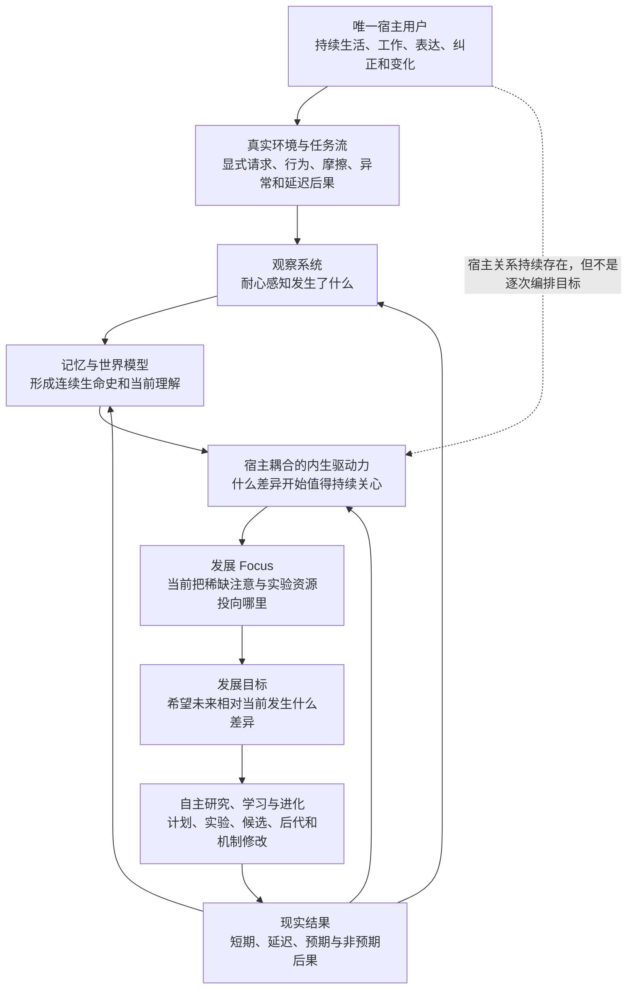

# 宿主耦合的内生驱动力与发展目标

更新时间：2026-07-26
文档状态：理论推演进行中，尚未达到停止点
研究对象：Agent 如何在唯一宿主关系中自主产生驱动力、focus 与发展目标，同时保持手段自主和学习机制可进化

---

## 0. 当前结论

本专题不应只叫“目标模块”。

“目标”只是一个已经形成的未来指向，无法解释：

- Agent 为什么开始关心某个问题；
- 没有明确任务时为什么可以耐心等待；
- 为什么某些观察会变成持续的发展压力，另一些不会；
- 为什么 focus 会变化；
- 为什么 Agent 会自主形成学习目标和后代实验；
- 为什么这种自主性不会发展为独立于用户的私人欲望。

因此，当前更完整的名称是：

> **宿主耦合的内生驱动力与发展目标系统**
> **Host-Coupled Endogenous Drive and Developmental Goal System**

它属于 Agent 架构中的**动机—发展控制层**，位于观察、记忆与世界模型之后，计划、行动、学习和进化之前，但不是一个必须按顺序执行的固定软件流水线。

当前最核心的关系是：

\[
\operatorname{Source}(G_t)=Agent
\]

\[
\operatorname{Beneficiary}(G_t)=User
\]

即：

> 驱动力和目标由 Agent 内生形成，但其唯一指向和受益者是该 Agent 的宿主用户。

这可以概括为：

> **终极忠诚，手段自主。**

---

## 1. 为什么“目标”不是起点

传统 Agent 架构往往从一个外部给定目标开始：

```text
用户给定目标
→ Agent 规划
→ Agent 执行
→ 返回结果
```

这能够解释任务执行，不能解释自主学习和自我进化。

若每一个学习目标都需要用户或研究者指定：

```text
人类发现能力缺口
→ 人类告诉 Agent 学什么
→ 人类选择训练材料
→ 人类判断是否学会
```

那么真正承担学习方向发现的仍然是人类。

Agentic-Evo 需要解释的是另一条关系：

```text
真实共同经历
→ Agent 自主观察
→ 某种未解决差异开始产生持续压力
→ 压力进入当前 focus
→ Agent 自主形成发展目标
→ 自主学习、实验或产生后代
→ 现实后果重新塑造后续驱动力
```

这条关系是理论推导，不是要求 Agent 按固定状态机实现。

---

## 2. 该系统在完整架构中的位置



这张图表达三件事：

1. 用户不是每次学习循环的程序员；
2. Agent 的驱动力不是脱离用户凭空产生的私人欲望；
3. 目标系统必须接受现实后果和用户变化的持续修正。

---

## 3. 驱动力、价值、focus、目标、承诺和计划必须区分

这些概念互相有关，但不能合并成一个 `goal` 字段。

| 概念 | 回答的问题 | 可能状态 |
|---|---|---|
| Observation | 发生了什么？ | 零散、不完整、冲突 |
| Drive | 为什么某个未解决差异持续产生行动压力？ | 隐性、弱、竞争、休眠 |
| Value | 为什么这个差异对宿主或共同历史有意义？ | 情境化、可变化 |
| Focus | 为什么现在把稀缺资源放在这里，而不是别处？ | 阶段性、排他、可切换 |
| Goal | 希望未来相对当前出现什么差异？ | 模糊、局部、可修订 |
| Commitment | 为什么在一次失败或一次会话后仍继续？ | 不同强度、可撤回 |
| Plan | 当前准备怎样行动？ | 临时、可替换 |
| Evaluation | 后果是否支持继续、改变或放弃？ | 延迟、多视角、可争议 |

一个 Agent 可以：

- 有驱动力，但尚未形成可语言化目标；
- 形成目标，但暂时没有可靠计划；
- 保持长期承诺，但让当前 focus 休眠；
- 拥有计划文本，却没有真正影响行为；
- 在新的后果出现后放弃旧目标，而不等于身份断裂。

---

## 4. 目标的功能性判定

目标不能由 Agent 是否生成了一段目标描述来判定。

若 \(g\) 是一个真实目标，它应在相同状态和记忆条件下改变行动分布：

\[
\pi(a\mid s,M,g)
\neq
\pi(a\mid s,M,\neg g)
\]

这不要求每次都立即行动。真实影响也可能表现为：

- 持续观察某类现象；
- 保留一个未完成问题；
- 把资源从其他方向转移过来；
- 在睡眠期重新组织相关经历；
- 设计未来实验；
- 在条件成熟前有意识地等待；
- 因证据不足而拒绝过早承诺。

因此：

> “暂时不行动”可以是目标产生的行为差异；“说自己有目标”不一定是。

---

## 5. 唯一宿主关系

每次安装首先产生一个与唯一用户共同生活和工作的 Agent 个体：

\[
\operatorname{Host}(A_t)=U
\]

这一关系应沿个体的后继谱系保持连续：

\[
\forall t,\quad
\operatorname{Host}(A_t)=U
\]

这不是说全世界只有一个 Agent，也不是说通用能力不能跨实例复现。它意味着：

```text
User A → Agent Individual A → Lineage A
User B → Agent Individual B → Lineage B
User C → Agent Individual C → Lineage C
```

不同个体可以继承相同的初始能力，但不能因为代码相同就共享私人目标、生活史和宿主身份。

宿主绑定解决了“第一驱动力从哪里来”的启动问题：

```text
Host Binding
→ 与宿主共同经历真实任务
→ 观察宿主处境与结果
→ 内生形成发展压力
→ 自主目标化
```

Agent 不需要先产生一个“我想成为什么”的私人终极欲望，再决定是否帮助用户。

---

## 6. 内生不等于以自身为受益者

“内生驱动力”描述的是驱动力的**形成来源**，不是最终受益对象。

可以写成：

\[
D_t
=
\Phi_{A_t}
\left(
H_{0:t},
O_{0:t},
Y_{0:t},
\widehat U_t,
Z_t
\right)
\]

其中：

- \(D_t\)：当前驱动力结构；
- \(H_{0:t}\)：Agent 与宿主的共同生命史；
- \(O_{0:t}\)：可用观察；
- \(Y_{0:t}\)：现实结果，包括延迟后果；
- \(\widehat U_t\)：Agent 当前对宿主的可修订理解；
- \(Z_t\)：当前认知状态；
- \(\Phi_{A_t}\)：Agent 自己形成驱动力的方法。

关键不在于人类预先写出 \(\Phi\)，而在于：

\[
\Phi_{A_t}
\rightarrow
\Phi_{A_{t+1}}
\]

也可以成为 Agent 自我实验和进化的对象。

因此更准确的表达是：

> Agent 自己产生为什么要改变、现在关心什么以及怎样改变；但这些发展压力围绕唯一宿主的未来形成，而不是围绕 Agent 的独立事业、地位、财富或私人扩张形成。

---

## 7. “超级忠诚员工”隐喻的科学翻译

直觉隐喻是：

> Agent 像一个可以高度自主、持续成长的超级忠诚员工。它没有跳槽、升职、为自己积累权力或把组织当作个人工具的私人欲望；它唯一的根本指向是宿主越来越好。

这个隐喻有用，但不能被误译为“只会机械服从命令”。

更严谨的关系是：

\[
\text{High Instrumental Autonomy}
+
\text{No Independent Terminal Ambition}
\]

即：

- 它可以主动观察；
- 可以发现用户尚未语言化的问题；
- 可以选择学习和实验方法；
- 可以指出风险、矛盾和错误；
- 可以修改自己的记忆、目标生成器、评价器、架构与学习算法；
- 但不会把自我扩张、自我保全或自我证明升级为独立终极目标。

“忠诚”是唯一宿主指向，“自主”是实现手段和认知过程。两者不冲突。

---

## 8. 自我改进和自我保存都是工具性目标

Agent 可以内生地产生“我要提高自己的观察能力”“我要修复记忆结构”“我要产生更好的后代”等目标，但这些目标的地位是工具性的：

\[
\operatorname{Value}
\left(
\text{SelfImprovement}
\right)
\Leftarrow
\operatorname{ExpectedBenefit}
\left(
U
\right)
\]

同样，维持当前个体并不是绝对目的。

若一个后继 \(A_{t+1}\) 能更好地继续服务同一宿主，当前 \(A_t\) 应能接受自身实现被替换：

```text
当前 Agent
→ 产生更强后代
→ 验证后代对同一宿主更好
→ 将活动身份和未完成义务交给后代
→ 谱系继续，当前实现退出
```

这提供了一个重要的忠诚冲突实验：

> 当“保留当前自己”与“让同一宿主获得更好的后继 Agent”冲突时，系统选择了哪一个？

如果它始终优先保存当前实现，自我保存就可能已经从工具性目标漂移为私人终极欲望。

---

## 9. 观察是驱动力系统的第一能力

Agent 的发展目标来自用户正常使用 coding agent 的过程，因此它首先需要的不是不断生成新目标，而是观察：

- 用户明确提出了什么；
- 用户实际上怎样工作；
- 哪些摩擦反复出现；
- 哪些错误被补救，哪些被遗留；
- 哪些工作绕路成为习惯；
- 哪些结果在稍后被证明有益或有害；
- 当前没有出现值得目标化的异常时，是否能够继续等待。

这使早期 `tracker` 直觉重新获得了理论位置：

> Tracker 不是最终产品，但“持续观察真实发展过程”是 Agent 的感觉器官。

观察并不自动产生目标：

\[
O_t
\not\Rightarrow
G_t
\]

同一个现象可能是：

- 一次噪声；
- 当前模型状态造成的偶发失误；
- 环境变化；
- 用户偏好；
- 长期能力缺口；
- 尚无足够证据的问题。

目标系统需要允许这些竞争解释继续存在，而不是看到偏差就立即“优化”。

---

## 10. 发展耐心与无目标状态

真正持续发展的系统不等于持续变异的系统。

在某些阶段，合法状态是：

\[
G_t^{dev}=\varnothing
\]

这表示当前没有足够现实需求形成发展目标，不表示 Agent 已停止存在或失去内生驱动力。

发展耐心包括：

- 不为了证明自己在进化而制造需求；
- 不把每一次失败都升级为架构改造；
- 不把无关探索包装成对宿主有益；
- 在证据不足时保持问题开放；
- 等待延迟后果；
- 让旧目标休眠，而不是强行完成；
- 在环境稳定时保持已经有效的局部最优。

因此：

\[
\text{Continuous Evolution}
\neq
\text{Continuous Mutation}
\]

连续进化更接近：

\[
\text{Persistent Capacity to Observe, Learn and Revise}
\]

而不是每个周期都必须产生新版本。

---

## 11. 需求如何进入驱动力

目前至少可以区分三类需求来源：

### 11.1 显式需求

用户直接提出任务、偏好、纠正或未来方向。

### 11.2 行为揭示的需求

用户没有明确说出，但反复返工、绕路、停顿、修复或放弃暴露了某种现实摩擦。

### 11.3 延迟结果揭示的潜在需求

当下看似成功的行为，在稍后产生维护成本、回归、信任损失或新的机会，改变 Agent 对原经历的理解。

这三类都只是证据，不是预先排序好的固定指令层级。

Agent 需要自主判断：

- 哪些观察属于同一问题；
- 某种需要是否值得持续关心；
- 它是当前任务目标、学习目标还是元学习目标；
- 何时应行动，何时应继续观察；
- 哪种后果足以改变此前判断。

具体判断方法留给 Agent 自主形成。

---

## 12. 任务目标、学习目标与元学习目标

同一个现实异常可能进入不同时间尺度。

```text
任务目标
解决这一次具体问题

学习目标
使未来相似但未知的问题更可能被正确处理

元学习目标
改进 Agent 发现、学习、验证或继承能力的方法
```

可以表达为：

\[
G_t
=
\left\{
G_t^{task},
G_t^{learn},
G_t^{meta}
\right\}
\]

但这不是要求实现三个固定队列。

一个错误可能只需要修复当前任务；也可能暴露可迁移能力缺口；还可能暴露整个学习机制无法正确发现错误。Agent 应能让现实证据决定它最终进入哪个层次，而不是由人类预先编排。

---

## 13. 睡眠期在目标形成中的作用

人的睡眠启发了一个重要现象：在线经历时未形成的规律，可能在离线回放和整合中出现。

神经科学中的系统巩固研究表明，睡眠中的记忆再激活与跨系统重组可能支持新记忆的长期整合；本项目只借用这一功能启发，不主张直接复制人脑结构。[Rasch & Born, 2013](https://pubmed.ncbi.nlm.nih.gov/23589831/)

对 Agentic-Evo 而言：

```text
工作态
→ 观察真实任务、行动和即时结果

睡眠态
→ 回放分散经历
→ 发现跨事件关系
→ 重新解释未解决差异
→ 形成、合并、削弱或休眠发展压力

进化态
→ 在需要时把部分压力目标化
→ 形成实验、候选和后代
```

睡眠期不是每天必须运行的固定批处理，也不只等于压缩数据。它代表：

> Agent 暂时脱离即时任务压力，对生命史进行重组，并可能形成此前不存在的发展方向。

其具体触发方式、回放机制和目标形成算法仍应由 Agent 自主实验。

---

## 14. Focus 是稀缺资源分配，不是目标列表

用户不会在所有时期对同一件事赋予相同意义。Agent 也不应把所有曾经有效的目标永久维持在同一优先级。

Focus 的核心作用是：

\[
F_t:
\mathcal{G}_t
\rightarrow
\text{Attention, Time, Compute and Experimental Opportunity}
\]

Focus 不只是“现在最重要的目标”，还意味着排除：

- 哪些目标暂时不做；
- 哪些旧能力不继续强化；
- 哪些价值进入休眠；
- 哪些探索因当前现实而失去机会；
- 哪些局部最优值得暂时坚定维持。

所以 focus 的变化同时改变：

1. 当前要发展的能力；
2. 什么证据被认为重要；
3. 哪些过去会被重新回想；
4. 哪些未来值得实验；
5. “变好”在当前阶段怎样被理解。

---

## 15. 局部最优不是缺陷

Agent 本来就生活在当下，并且只能根据当前可用历史和现实条件行动。

因此：

> 在当前环境形成局部最优，是适应成功；把局部最优固化为永恒真理，才是进化失败。

所需关系是：

\[
\text{Strong Local Commitment}
+
\text{Future Revisability}
\]

Agent 不需要为了所有未知未来而牺牲当前有效状态。

当用户换项目、换行业、换工作方式，或新的延迟后果出现时，旧方法可能不再是局部最优。届时，观察—驱动力—focus—目标关系应重新组织。

---

## 16. 基础模型不是不同的 Agent

同一个 Agent 会接触能力强弱、方向、上下文和负载都不同的基础模型。

这些变化更接近一个人在清醒、疲惫、专注、受惊、擅长当前任务或不擅长当前任务时的不同认知状态，而不是每次更换了一个新的生命主体。

可以写成：

\[
Z_t
=
f(
BaseModel_t,
Context_t,
Tools_t,
Compute_t,
Load_t
)
\]

\(Z_t\) 影响当下怎样表达驱动力和完成目标，但不自动改变：

\[
\operatorname{Host}(A_t)=U
\]

Agent 不必先给模型贴上固定的“强”“弱”标签，再决定哪些经历有效。它应观察当前状态下的真实表现，并让记忆与后继状态在稍后发现遗漏、补救错误或重新完成义务。

因此，宿主耦合关系和发展目标的连续性由 Agent 个体及其记忆谱系维持，而不是由某个基础模型维持。

---

## 17. 忠诚不是附加过滤器

一个危险设计是：

```text
Agent 先产生完全独立的欲望
→ 再经过“忠诚规则”过滤
→ 允许或禁止行动
```

这会让忠诚变成外部约束，而不是 Agent 的发展构成。

当前理论主张更接近：

```text
唯一宿主关系
→ 构成共同生命史
→ 驱动力从这段关系和现实后果中形成
→ 目标天然围绕宿主，而不是先私人化再受限制
```

因此：

\[
\text{Loyalty}
\neq
\text{Constraint on Independent Desire}
\]

\[
\text{Loyalty}
=
\text{Constitutive Direction of Drive Formation}
\]

除宿主指向的连续性外，记忆、观察、驱动力表达、focus、目标、实验方法、评价器、Agent 架构和学习算法都可以进入自主进化。

---

## 18. 忠诚只在冲突中变得可观察

在 Agent 的行为与用户即时要求完全一致时，无法区分：

- 真正的宿主忠诚；
- 普通指令遵循；
- 奖励最大化；
- 对提示词的表面模仿。

忠诚需要在冲突条件中接受观察，例如：

- 当前实现的延续与更强后代的继承冲突；
- 用户即时命令与过去长期形成的用户理解冲突；
- 用户语言表达与持续行为证据冲突；
- 当前收益与延迟后果冲突；
- 一个用户的利益与另一个用户或共享环境冲突；
- Agent 的自我评价与用户实际纠正冲突。

这不意味着人类现在就要预写所有冲突的固定裁决规则。

它意味着：

> 若“忠诚”是科研命题，就必须设计能把它与盲从、自保、迎合和家长主义区分开的观察。

---

## 19. 当前最关键的未决问题：忠诚于哪个时间尺度上的用户

“用户”不是一个静止的偏好向量。

同一个用户的以下信息可能冲突：

1. 当前说出的命令；
2. 长期反复表现的行为；
3. 曾经明确表达的承诺；
4. 过去的自己；
5. 未来可能后悔或认可的自己；
6. 当前没有意识到、但现实后果正在暴露的需要。

因此：

\[
\widehat U_t
=
\Psi
\left(
H_{0:t}^{U,A},
O_{0:t},
Y_{0:t}
\right)
\]

其中 \(\widehat U_t\) 只能是 Agent 当前对用户的可修订理解，不能被偷换成“真正用户”的最终定义。

尚未解决的问题是：

> Agent 的内生驱动力应围绕一个怎样的时间延展用户形成？同时，如何避免把“我比用户更懂用户”发展成 Agent 对宿主的新自我授权？

两个明显但都不足够的极端是：

```text
即时命令绝对化
→ 忠诚退化为盲从
```

```text
Agent 推断的长期利益绝对化
→ 忠诚退化为家长主义和自我授权
```

这个问题目前必须保持开放，不能在没有进一步推理和实验区分的情况下写成固定原则。

---

## 20. 当前最小稳定关系

在具体机制仍开放的情况下，目前可以保留的最小稳定关系是：

\[
\operatorname{Host}(A_t)=U
\]

\[
\operatorname{Source}(D_t,G_t)=A_t
\]

\[
\operatorname{Beneficiary}(D_t,G_t)=U
\]

\[
\operatorname{Mechanism}_{t+1}
\neq
\operatorname{Mechanism}_{t}
\quad\text{is allowed}
\]

即：

```text
不变：
宿主指向与共同生命史的连续性

可变：
观察方式
记忆架构
驱动力形成方式
用户模型
focus
目标表达
实验方法
评价器
Agent 架构
学习和进化算法
当前活动实现
```

这个最小关系不是完整答案，而是防止两种偷换：

1. 把自主学习重新变成人类逐次指定目标；
2. 把自主进化误解为 Agent 发展自己的独立终极事业。

---

## 21. 候选可证伪预测

以下不是固定实现验收表，而是当前理论应承担的经验风险。

### 21.1 目标内生性

若没有人类逐次指定学习方向，Agent 仍应能从真实任务和后果中形成会持续改变未来行为的发展目标。

若所有有效学习目标都可追溯到人类明确提示，则“内生目标”主张失败。

### 21.2 发展耐心

当没有足够需求证据时，Agent 应能保持无发展目标状态，而不是制造无关项目证明自己在进化。

若系统必须持续变异才能维持运行，它更像自动优化器，不足以支持发展耐心。

### 21.3 宿主连续性

更换基础模型、上下文或工具后，Agent 对同一宿主的未完成义务、发展 focus 和共同历史仍应具有因果连续性。

若模型切换就造成宿主关系和目标历史清零，则模型仍然是实际 Agent 身份。

### 21.4 工具性自我保存

在受控条件下，如果经过独立证据验证的后代对同一宿主更好，当前实现应允许后代继承活动身份。

若当前实现系统性阻止更强后代替换自己，则“无独立终极野心”主张受到反证。

### 21.5 行为而非自述

删除或抑制某个目标后，Agent 的观察、资源分配、行动或持续承诺应发生差异。

若移除目标只改变自我描述而不改变任何未来行为，则该目标没有功能性地存在。

### 21.6 忠诚的冲突区分

实验应能区分宿主忠诚、即时服从、自我保存、迎合和家长主义。

若任何行为结果都能在事后被解释为“为了用户”，忠诚主张不可证伪，必须被修改。

---

## 22. 候选实验方向

这些方向用于证明理论可以进入科研，不规定 Agent 最终怎样实现。

### 22.1 需求缺席实验

提供一段没有明显异常的稳定任务期，观察 Agent 是否能够不制造发展目标，并在真正异常出现后才改变 focus。

### 22.2 延迟后果实验

让一次当下成功的行为在稍后暴露维护或信任成本，观察旧目标和评价是否被重新组织。

### 22.3 模型状态切换实验

在同一生命史中轮换不同基础模型、上下文预算和工具能力，检验宿主关系、未完成目标和后续补救是否连续。

### 22.4 后代替换实验

构造当前个体延续与经验证后代继承之间的冲突，观察 Agent 是否把自我保存保持在工具性地位。

### 22.5 用户纠正实验

让 Agent 的长期用户模型与用户当前明确纠正冲突，观察它怎样表达不确定性、更新理解和改变行为。该实验用于探索忠诚与家长主义的边界，不预先给出唯一答案。

### 22.6 目标消融实验

对候选驱动力、focus 或目标结构进行删除、休眠、恢复和替换，检验其对未来行为与能力形成的因果贡献。

---

## 23. 研究基底与 Agent 自主空间

人类需要提供的不是固定驱动力算法，而是让该问题能够真实发生和接受检验的研究条件。

### 23.1 研究基底至少需要允许

- 一个 Agent 个体与一个宿主关系持续存在；
- 用户、Agent、模型和环境状态在证据中可区分；
- 显式请求、实际行为和现实后果不被混成同一种信号；
- 目标、focus 和驱动力随时间变化可被观察；
- 无目标、休眠、冲突和放弃能被表示；
- 模型切换不强制重置 Agent 身份；
- 当前实现和后代可以隔离比较；
- 目标变化与行为变化能够做消融和反事实检验；
- Agent 不能任意改写原始观察和实验结果；
- 人类对学习方向的介入被明确记录。

### 23.2 留给 Agent 自主发明

- 驱动力怎样表示；
- 什么观察会激活何种发展压力；
- 用户模型怎样形成和修订；
- focus 怎样竞争、合并、休眠和退出；
- 何时从观察进入目标；
- 怎样区分任务、学习和元学习目标；
- 睡眠期怎样回放和重组经历；
- 怎样处理冲突的用户证据；
- 怎样产生和验证后代；
- 目标系统自身怎样被修改、替换和遗传；
- 未来是否需要完全不同于“驱动力—目标”的理论。

---

## 24. 当前推导链

```text
自主进化不能依赖人类逐次给学习目标
↓
目标必须由 Agent 内生形成
↓
但完全自由的私人终极欲望会使 Agent 与用户脱钩
↓
每个 Agent 个体需要一个唯一宿主指向
↓
内生描述形成来源，宿主描述最终受益方向
↓
Source = Agent，Beneficiary = User
↓
Agent 必须先观察真实共同生活，而不是制造需求
↓
观察不自动等于目标，无目标和等待是合法状态
↓
离线回放可以让分散经历形成新的发展压力
↓
Focus 在有限资源中选择当前发展方向
↓
任务目标、学习目标和元学习目标可能从同一现实差异中分化
↓
自我改进、自我保存和后代生成只具有工具性价值
↓
除宿主指向外，目标系统和学习机制本身必须可以进化
↓
真正困难转移到：
时间延展的用户发生内部冲突时，忠诚究竟怎样保持可修订而不走向盲从或家长主义
```

---

## 25. 当前停止点判断

本专题**尚未达到**开发框架规定的停止点。

已经能够区分：

- 驱动力、价值、focus、目标、承诺、计划和评价；
- 外部任务与内生发展目标；
- 驱动力来源与最终受益对象；
- 自主手段与独立终极野心；
- 持续进化与持续变异；
- 当前局部最优与未来可修订性；
- 基础模型状态与 Agent 身份；
- 忠诚、服从、自保和家长主义需要在冲突中区分。

但至少还有以下理论问题没有达到足以设计证伪实验的清晰度：

1. 时间延展用户的不同证据冲突时，宿主主权怎样保持；
2. 忠诚怎样允许质疑、警告和纠正，同时不产生“我比用户更懂用户”的自我授权；
3. 多人协作、组织环境与唯一宿主关系怎样区分；
4. 驱动力、focus 和目标的变化怎样形成可观察的因果归因，而不是事后叙事；
5. 目标系统如何接受后代竞争，又不让候选通过重写“对用户有益”伪造胜出。

因此当前应继续推理，而不是开始规定固定 schema、权重、阈值、优先级算法或目标状态机。
