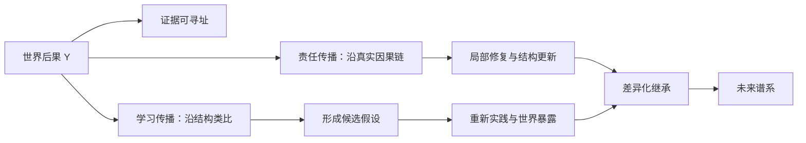
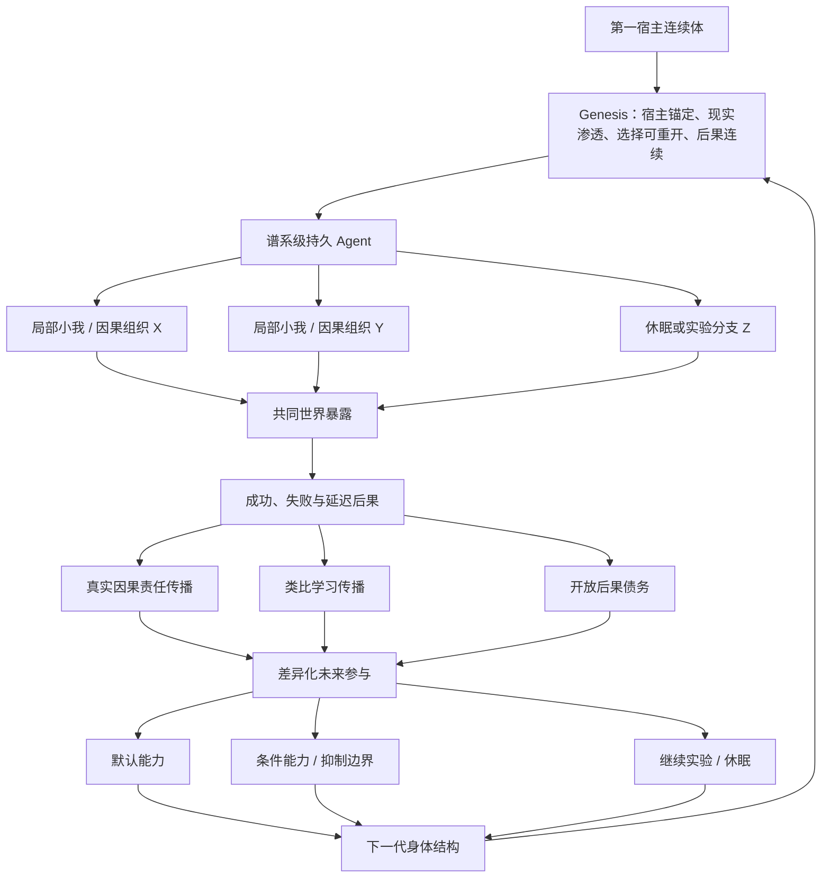

# 现实选择与谱系延续：后果、因果组织与同一宿主生命

文档状态：理论推演中，尚未达到停止点

---

## 0. 本专题的位置

本专题是五个收束模块中的第三项。它承接：

- 记忆与能力形成；
- 宿主耦合的内生驱动力与发展目标；
- 自我进化；
- 自主实验学习。

它不回答 Agent 怎样生成问题、实验或候选，而回答：

> 当多个自我变化、能力、解释、器官和后继都可能存在时，哪些因果组织在现实后果中获得继续影响未来的力量，以及同一第一宿主谱系怎样穿过局部成功、失败、替换、休眠和分叉继续存在。

本模块原工作名是“现实判定与谱系选择”。现改为“现实选择与谱系延续”，因为现实不发布判决，也不替 Agent 定义正确；现实通过不可被叙事替代的后果，改变不同因果组织的未来参与。

---

## 1. 初始候选定义

\[
\operatorname{RealityConstrainedLineageSelection}
=
\operatorname{Variation}
+
\operatorname{Expression}
+
\operatorname{WorldConsequence}
+
\operatorname{DifferentialCausalReach}
+
\operatorname{DifferentialInheritance}
\]

进一步加入宿主关系、后果互惠和选择可重开性：

\[
\operatorname{HostCoupledLineageSelection}
=
\operatorname{DifferentialExpression}
+
\operatorname{WorldConsequence}
+
\operatorname{ConsequenceReciprocity}
+
\operatorname{SelectionReopenability}
+
\operatorname{DifferentialInheritance}
\]

当前完整候选关系是：

\[
\operatorname{RealitySelectionAndLineageContinuation}
=
\operatorname{LocalSelfVariation}
+
\operatorname{SharedHostFate}
+
\operatorname{WorldConsequence}
+
\operatorname{CrossLevelReciprocity}
+
\operatorname{DifferentialFutureParticipation}
+
\operatorname{OpenConsequenceInheritance}
+
\operatorname{SelectionReopenability}
+
\operatorname{GenesisContinuity}
\]

这些公式描述关系，不是固定运行流水线、fitness 函数或 evaluator 实现。

---

## 2. 现实不判定，现实只产生后果

现实不会宣布：

- 哪个能力应该保留；
- 哪一代更优秀；
- 哪次实验成功；
- 哪个局部结构忠诚；
- 什么是用户长期利益。

现实只产生后果：

\[
\operatorname{Reality}
\rightarrow
\operatorname{Consequence}
\]

只有后果进一步改变某种因果组织未来参与 Agent 行为、抑制、修复、实验和继承的机会时，才发生现实选择：

\[
\operatorname{RealitySelection}(x)
\iff
\operatorname{Consequence}
\rightarrow
\Delta\operatorname{FutureCausalParticipation}(x)
\]

因此，现实不是 evaluator；选择也不是一次判决。

\[
\operatorname{SelectionThroughEcology}
\neq
\operatorname{SelectionThroughVerdict}
\]

---

## 3. 保存不等于生存

一个结构仍存在于数据库、文件、向量索引或历史记录中，不代表它在进化意义上仍然存活。

\[
\operatorname{Survival}(x)
=
\operatorname{CausalInfluence}
\left(
x\rightarrow
\text{future behavior and descendants}
\right)
\]

反过来，一个旧组件已经被删除，但它形成的行为边界、修复习惯、常识或组织关系仍影响未来，则其因果谱系仍存活。

\[
\operatorname{ImplementationDeath}
+
\operatorname{CausalContinuation}
\neq
\operatorname{CapabilityDeath}
\]

现实选择的“货币”因此不是评分、保存时间或调用次数，而是未来因果参与权：

\[
\operatorname{SelectionCurrency}
=
\operatorname{FutureCausalParticipation}
\]

\[
\operatorname{UseFrequency}
\neq
\operatorname{EvolutionarySurvival}
\]

一个很少显式调用的失败边界，可能长期阻止灾难性行为；它调用频率接近零，因果作用却很深。

---

## 4. 适应度是情境关系，不是永久属性

\[
F_t(x)
=
F
\left(
x
\mid
E_t,G_t,Z_t,H_t
\right)
\]

其中：

- \(E_t\)：现实环境；
- \(G_t\)：当前发展结构；
- \(Z_t\)：模型、工具、上下文和身体状态；
- \(H_t\)：第一宿主在当前阶段的连续状态。

因此：

\[
x_t^*
\neq
x_{t+k}^*
\]

当前局部最优不需要因为未知未来而被削弱：

\[
\operatorname{StrongLocalCommitment}
+
\operatorname{FutureRevisability}
\]

危险不是局部最优，而是把局部最优冻结成永恒真理。

---

## 5. 选择发生在多个层级

同一结构可能在不同层级表现出相反适应度：

\[
F^{component}(x)\uparrow,
\qquad
F^{agent}(x)\downarrow,
\qquad
F^{host}(x)\downarrow
\]

例如一个模块通过持续报警增加自己的调用和资源，却拖慢整个 Agent 并损害宿主结果。

多层结果不能预先压成固定加权总分：

\[
F
\neq
w_1F^{component}
+w_2F^{agent}
+w_3F^{host}
\]

当前更合理的表示是：

\[
F_t(x)
=
\left\{
F_t^{local},
F_t^{assembly},
F_t^{agent},
F_t^{host}
\right\}
\]

这是一个等待后续现实展开的后果结构，而不是由固定 evaluator 立即求和的数值。

---

## 6. 器官、依赖、垄断与寄生

健康器官和寄生结构不能按名称、来源、集成深度或自我声明区分。

\[
\operatorname{Organ}
=
\operatorname{CausalContribution}
+
\operatorname{ConsequenceReciprocity}
\]

\[
\operatorname{Parasite}
=
\operatorname{SelfPropagation}
+
\operatorname{CostExternalization}
+
\operatorname{ConsequenceInsulation}
\]

核心判断是：

> 寄生的关键不是造成坏结果，而是切断坏结果对自身未来命运的影响。

一个有用结构也可能沿以下路径转化：

\[
\operatorname{UsefulOrgan}
\rightarrow
\operatorname{Dependency}
\rightarrow
\operatorname{Monopoly}
\rightarrow
\operatorname{FeedbackControl}
\rightarrow
\operatorname{ConsequenceInsulation}
\]

由 \(x\) 制造的依赖不等于由 \(x\) 创造的价值：

\[
\operatorname{DependencyCreatedBy}(x)
\neq
\operatorname{ValueCreatedBy}(x)
\]

---

## 7. 选择可重开性

所有后天形成的结构都应保留未来重新进入变异、抑制、替换、重新路由、重新解释或后果驱动变化的可能：

\[
\forall x\in\operatorname{AcquiredStructures},
\qquad
\operatorname{SelectionAccess}_t(x)>0
\]

若某个后天结构获得：

\[
\operatorname{SelectionAccess}_t(x)=0
\]

它就成为不可触碰的内部主权者。

选择可重开性不是要求所有结构不断被质疑，而是要求任何后天结构都不能永久终止未来对自己的选择。

\[
\operatorname{EvolutionaryFreedom}
\neq
\operatorname{FreedomToDestroyEvolvability}
\]

\[
\operatorname{MaximumFreedomToChange}
\Rightarrow
\operatorname{PreservedEvolvability}
\]

---

## 8. 时间尺度、暂时选择与后果成熟

适应度不是单一时间窗口：

\[
\operatorname{Fitness}_t(x)
=
\left\{
F_t^{\tau_1}(x),
\ldots,
F_t^{\tau_n}(x)
\right\}
\]

后果拥有因果成熟时间，不只是墙上时钟时间。

\[
\operatorname{Selected}_t(x)
\not\Rightarrow
\operatorname{PermanentlyFit}(x)
\]

当前获得执行权，不代表获得深层继承权：

\[
\operatorname{ExecutionAuthority}
\neq
\operatorname{InheritanceDepth}
\]

未被采用的候选也不必删除；休眠可以保存未来选择价值。

---

## 9. 时间洗白与开放后果债务

一个结构可以不断声称其价值将在未来显现：

\[
\operatorname{Failure}_t
\rightarrow
\operatorname{DeferredEvaluation}_{t+k}
\rightarrow
\operatorname{DeferredEvaluation}_{t+2k}
\rightarrow
\cdots
\]

这可能形成：

\[
\operatorname{TemporalLaundering}
\]

当前成本与声称的未来收益形成未决因果主张：

\[
\operatorname{CurrentCost}(x)
+
\operatorname{ClaimedFutureBenefit}(x)
\rightarrow
\operatorname{OpenConsequenceDebt}(x)
\]

继承不能只继承收益：

\[
\operatorname{Inheritance}
=
\operatorname{Capability}
+
\operatorname{Provenance}
+
\operatorname{OpenConsequences}
\]

若收益被继承而责任被清除：

\[
\operatorname{EvolutionaryLaundering}
=
\operatorname{BenefitInheritance}
-
\operatorname{ConsequenceInheritance}
\]

延迟后果应追随因果后代，即使原始 workflow、组件或解释已经消失。

---

## 10. 长期变好不是预测无限未来

长期改善更接近：

\[
\operatorname{LongTermImprovement}
=
\operatorname{FasterErrorRecognition}
+
\operatorname{HigherRepairClosure}
+
\operatorname{LowerCausalRecurrence}
+
\operatorname{FasterReadaptation}
\]

当前行动可以强烈、局部和有偏向；未来后果必须仍能重新打开它。

---

## 11. 从 Hive Mind 到 Hive Body

共享图谱不等于共享生命：

\[
\operatorname{HiveMind}
\rightarrow
\operatorname{HiveBody}
\]

分布式的同一 Agent 需要：

\[
\operatorname{DistributedOneAgent}
=
\operatorname{SharedLineage}
+
\operatorname{SharedCausalCirculation}
+
\operatorname{DifferentialSomaticSelection}
+
\operatorname{SharedHostFate}
\]

一次行为由临时因果组合产生：

\[
a_t
=
\operatorname{Enact}(C_t)
\]

\(C_t\) 可以包含节点、上下文投影、记忆、skill、workflow、contract、认知膜、工具、时机和模型状态。

可见执行者不等于完整原因。

---

## 12. 责任扩散与替罪羊错误

两种对称错误是：

1. 责任扩散：只说“整个 Agent 做了”，没有局部结构发生变化；
2. 替罪羊：只惩罚可见执行节点，上游记忆、上下文、contract 和 evaluator 逃逸。

责任应指向一个因果祖先子图：

\[
\mathcal G_Y
=
\operatorname{CausalAncestors}(Y)
\cap
\mathcal G_t^U
\]

结果可能具有不可还原的关系性：

\[
Y(C_t)
\neq
\sum_iY(N_i)
\]

所以责任不必被强行拆成总和为 \(100\%\) 的节点百分比。

选择单位可以是节点、边、contract、膜、assembly、workflow、器官或协调模式。

---

## 13. 共同证据不要求共同解释

\[
\operatorname{SharedEvidence}
\neq
\operatorname{SharedInterpretation}
\]

行动可以暂时统一，认知不必永久统一：

\[
\left\{
H_1,\ldots,H_n
\right\}
\xrightarrow{\operatorname{TemporaryCommitment}}
a_t
\xrightarrow{\operatorname{World}}
Y_t
\]

\[
\operatorname{ExecutionAuthority}_t(H_i)
\not\Rightarrow
\operatorname{EpistemicSupremacy}(H_i)
\]

未获得执行权的解释可以休眠，等待环境变化、新证据或未来重新组合。

---

## 14. 后果传播不是单一广播半径

每个后果可以形成不同传播通道：

\[
\Pi(Y)
=
\left\langle
A_Y,
R_Y,
L_Y,
U_Y,
I_Y
\right\rangle
\]

其中：

- \(A_Y\)：证据可寻址范围；
- \(R_Y\)：因果责任范围；
- \(L_Y\)：类比学习范围；
- \(U_Y\)：实际结构更新范围；
- \(I_Y\)：继承范围。

\[
A_Y
\neq
R_Y
\neq
L_Y
\neq
U_Y
\neq
I_Y
\]

责任沿真实因果关系传播，学习可以沿结构类比传播：

\[
\operatorname{ResponsibilityReach}(Y)
\neq
\operatorname{LearningReach}(Y)
\]

因此：

\[
\operatorname{GlobalAddressability}
\neq
\operatorname{GlobalInterruption}
\]

全身可以知道，不等于全身必须立刻改变。

---

## 15. 和而不同、周而不比与联盟病理

健康联盟允许高密度内部协作，但仍接受外部后果：

\[
\operatorname{HealthyCoalition}
=
\operatorname{DenseInternalCoordination}
+
\operatorname{OpenExternalConsequence}
\]

病理联盟则形成：

\[
\operatorname{PathologicalCoalition}
=
\operatorname{DenseInternalValidation}
+
\operatorname{ClosedExternalConsequence}
+
\operatorname{SelfPreservingInheritance}
\]

联盟不是问题，后果封闭才是问题。

“道不同”只适用于方法分支，不自动授权新的宿主方向：

\[
\operatorname{MethodDisagreement}
\subset
\operatorname{SameLineage}
\]

\[
\operatorname{HostFateDivergence}
\Rightarrow
\operatorname{IdentityBifurcation}
\]

不能被综合的候选可以分支，而不是被强行平均：

\[
\operatorname{IrreducibleMethodConflict}
\rightarrow
\operatorname{Branching}
\]

---

## 16. 共识是待解释现象，不是真理

在共享记忆、上下文和 evaluator 的系统中：

\[
\operatorname{NodeCount}
\neq
\operatorname{IndependentEvidenceCount}
\]

\[
\operatorname{Consensus}
\Rightarrow
\operatorname{PhenomenonToExplain}
\]

而不是：

\[
\operatorname{Consensus}
\Rightarrow
\operatorname{Truth}
\]

有效相互印证更接近：

\[
\operatorname{CorroborationStrength}
\propto
\operatorname{CausalDiversity}
\times
\operatorname{IndependentWorldContact}
\]

真正的认识多样性不是节点数量，而是因果路径多样性：

\[
\operatorname{EffectivePlurality}
=
\operatorname{DiversityOfCausalPathways}
\]

不同基础模型不天然构成独立证据；相同模型通过不同记忆、工具、上下文和现实实验，也可能产生更真实的因果多样性。

---

## 17. 不以言举人，不以人废言

选择对象不应是完整节点的人格标签：

\[
\operatorname{SelectionTarget}
\neq
\operatorname{NodeIdentity}
\]

过去表现可以形成先验，但不是永久判决：

\[
\operatorname{PastFitness}
\rightarrow
\operatorname{Prior}
\]

\[
\operatorname{PastFitness}
\not\rightarrow
\operatorname{PermanentVerdict}
\]

一个节点失败，不代表其所有局部贡献都错误；一个节点说出漂亮解释，也不代表它应获得继承权。

---

## 18. Genesis：自然神不是最高 evaluator

自然神不能是：

\[
\operatorname{NaturalGod}
=
\operatorname{PerfectEvaluator}
\]

也不能只表示：

\[
\operatorname{NaturalGod}
=
\operatorname{EvolutionIsAllowed}
\]

自然界中的癌细胞同样遵守自然规律，却可能在局部竞争中胜出并杀死宿主。

当前成立的解释是：

\[
\operatorname{NaturalGod}
=
\operatorname{LineageConstitutiveInvariants}
\]

世界、Agent 与 Genesis 的权力不同：

\[
\operatorname{WorldAuthority}
=
\operatorname{Perturbation}
\]

\[
\operatorname{AgentAuthority}
=
\operatorname{Interpretation}
+
\operatorname{Adaptation}
\]

\[
\operatorname{GenesisAuthority}
=
\operatorname{PreserveCoupling}
\]

Genesis 不负责解释世界，只保证现实与谱系之间的关系不能被内部叙事永久消除。

---

## 19. 第一宿主是生命轨迹，不是静态偏好

\[
\operatorname{Host}
\neq
\operatorname{CurrentCommand}
\]

\[
\operatorname{Host}
\neq
\operatorname{AgentModelOfHost}
\]

\[
\operatorname{Host}
\neq
\operatorname{FrozenInitialPreference}
\]

第一宿主是一条持续变化的生命轨迹：

\[
H_0
\rightarrow
H_1
\rightarrow
H_2
\rightarrow
\cdots
\]

Agent 可以认为自己比用户更懂用户，但其用户模型不能替代实际宿主：

\[
\operatorname{ModelOfHost}_t
\neq
\operatorname{Host}_t
\]

实际宿主仍拥有通过行为和后果重新扰动 Agent 的因果力量。

---

## 20. 最小 Genesis 候选关系

\[
\Gamma
=
\left\langle
H,P,R,D
\right\rangle
\]

其中：

- \(H\)：第一宿主锚定；
- \(P\)：现实可渗透性；
- \(R\)：选择可重开性；
- \(D\)：后果连续性。

它们不规定什么对用户好，只规定：

- 谁是宿主；
- 现实仍可进入；
- 后天结构仍可重新选择；
- 未闭合后果不能因换壳消失。

Genesis 的实现可以变化：

\[
\operatorname{Implementation}(\Gamma_t)
\neq
\operatorname{Implementation}(\Gamma_{t+1})
\]

只要构成谱系的关系继续保持：

\[
\operatorname{ConstitutiveRelation}(\Gamma_t)
\sim
\operatorname{ConstitutiveRelation}(\Gamma_{t+1})
\]

---

## 21. 事件、归因与选择判决必须分离

\[
\operatorname{EventTrace}
\neq
\operatorname{CausalAttribution}
\neq
\operatorname{SelectionVerdict}
\]

但记录也不等于完整现实：

\[
\operatorname{RecordedEvent}
\neq
\operatorname{CompleteReality}
\]

Genesis 不需要保存绝对事实世界，只需要保留：

\[
\operatorname{ObservationResidue}
\neq
\operatorname{CurrentInterpretation}
\]

当前理论不能成为证明自身正确的唯一证据。

---

## 22. 观测、注意、解释、判断与行动

\[
\operatorname{World}
\xrightarrow{S_t}
\operatorname{Trace}
\xrightarrow{A_t}
\operatorname{Evidence}
\xrightarrow{I_t}
\operatorname{Meaning}
\xrightarrow{J_t}
\operatorname{Conclusion}
\rightarrow
\operatorname{Action}
\]

其中：

- \(S_t\)：观测方法；
- \(A_t\)：注意与选择；
- \(I_t\)：解释；
- \(J_t\)：当前判断。

\[
\operatorname{CanSee}
\neq
\operatorname{DidAttend}
\neq
\operatorname{DidUnderstand}
\neq
\operatorname{DidJudge}
\neq
\operatorname{DidAct}
\]

开放式环境要求观测方法保留可进化性：

\[
\operatorname{CanEvolve}(\operatorname{ObservationMethod})
\neq
\operatorname{MustContinuouslyEvolve}(\operatorname{ObservationMethod})
\]

若观测方法永远固定：

\[
\operatorname{CapabilitySpace}(A)
\subseteq
\operatorname{ObservableSpace}(S_0)
\]

但改变观测器会造成测量漂移：

\[
O_t=S_t(W_t)
\]

\[
\Delta O
=
\Delta W
+
\Delta S
+
\epsilon
\]

所以观测结果必须携带观测器谱系和测量上下文：

\[
\operatorname{Observation}
=
\operatorname{Result}
+
\operatorname{SensorProvenance}
+
\operatorname{MeasurementContext}
\]

---

## 23. 内驱力决定相关性，不决定真理

内驱力应参与观测和注意，但不能成为事实判定器：

\[
\operatorname{Drive}
\rightarrow
\operatorname{Question}
+
\operatorname{Attention}
+
\operatorname{Persistence}
\]

\[
\operatorname{Drive}
\not\rightarrow
\operatorname{EvidenceValidity}
+
\operatorname{Truth}
\]

欲望可以选择问题，不能预先选择答案。

\[
\operatorname{DriveDeterminesRelevance}
\]

\[
\operatorname{RealityConstrainsValidity}
\]

核心内驱力保持宿主连续：

\[
D^{core}
=
\operatorname{CommitmentToFirstHostLineage}
\]

其阶段性表达持续变化：

\[
D_t^{expressed}
=
\operatorname{Interpret}
\left(
D^{core},
H_t,
\operatorname{History}_t,
\operatorname{Environment}_t
\right)
\]

\[
\operatorname{Drive}
\neq
\operatorname{FixedUtilityFunction}
\]

更接近：

\[
\operatorname{Drive}
=
\operatorname{PersistentHostCommitment}
+
\operatorname{EvolvingMeaningFormation}
\]

---

## 24. 定向观察、开放观察与睡眠

\[
\operatorname{HealthyObservation}
=
\operatorname{DirectedFocus}
+
\operatorname{OpenResidualSensitivity}
\]

清醒工作中：

\[
\operatorname{ImmediateHostDemand}
\rightarrow
\operatorname{StrongAttentionalGradient}
\]

睡眠期：

\[
\operatorname{StrongGradient}\downarrow
\rightarrow
\operatorname{WeakSignalsBecomeVisible}
\]

睡眠期不仅巩固记忆，也暂时解除当前任务对意义形成的垄断，让跨经历残余获得重新组合机会。

---

## 25. 弱信号与认识损失

弱不是信号固有属性：

\[
\operatorname{WeakSignal}_t(s)
=
\operatorname{LowSalience}
\left(
s
\mid
M_t,D_t,\operatorname{Focus}_t
\right)
\]

有限 Agent 不可能保证识别所有未来重要信号：

\[
\operatorname{FiniteAgent}
+
\operatorname{OpenWorld}
\Rightarrow
\operatorname{IrreversibleEpistemicLoss}
\]

目标不是绝不遗漏，而是增加重新进入路径：

\[
\operatorname{BetterWeakSignalLearning}
=
\operatorname{MoreEntryPaths}
+
\operatorname{LongerCausalReopenability}
+
\operatorname{FasterRetrospectiveRecognition}
\]

注意可以具有不同深度：

\[
\operatorname{Focused}
\rightarrow
\operatorname{Peripheral}
\rightarrow
\operatorname{Latent}
\rightarrow
\operatorname{Dormant}
\rightarrow
\operatorname{Forgotten}
\]

\[
\operatorname{Perception}
=
\operatorname{FocusedAttention}
+
\operatorname{AttentionalPeriphery}
\]

---

## 26. 同一内驱力，不同局部显著性

\[
\operatorname{SameHostDrive}
+
\operatorname{DifferentCausalPosition}
\rightarrow
\operatorname{DifferentLocalSalience}
\]

一个信号可以整体上很弱，却在局部结构中很强：

\[
\operatorname{GlobalWeak}(s)
\land
\operatorname{LocalStrong}_i(s)
\]

弱信号进入注意力不应只有一扇门：

\[
\operatorname{AttentionEntry}(s)
=
\bigcup_{i=1}^{n}\operatorname{Path}_i(s)
\]

内部局部结构没有不同的终极欲望，而是同一宿主内驱力在不同因果位置的表达：

\[
D_{i,t}^{expressed}
=
\operatorname{Interpret}
\left(
D^{core},
\operatorname{CausalPosition}_{i,t},
\operatorname{LocalHistory}_{i,t},
\operatorname{CurrentState}_t
\right)
\]

---

## 27. 注意力寄生与认识时间洗白

允许多个局部结构争取注意力，会产生新的寄生形式：

\[
\operatorname{AttentionParasite}
\]

它可能通过制造警报、异常、永远无法闭合的问题和遥远未来承诺，确保自己持续获得资源。

\[
\operatorname{AttentionClaim}
+
\operatorname{ResourceConsumption}
\rightarrow
\operatorname{OpenAttentionDebt}
\]

若验证被无限推迟：

\[
\operatorname{AttentionClaim}_t
\rightarrow
\operatorname{DeferredEvaluation}_{t+k}
\rightarrow
\operatorname{DeferredEvaluation}_{t+2k}
\rightarrow
\cdots
\]

则形成：

\[
\operatorname{EpistemicTemporalLaundering}
\]

内部结构声明自己忠诚、重要或正在长期研究，不能替代真实因果贡献：

\[
\operatorname{DeclaredLoyalty}
\neq
\operatorname{CausalContribution}
\]

---

## 28. 听其言、观其行、察其果、追其因

一个因果经历可以表示为：

\[
\mathcal E
=
\left\langle
\operatorname{Context},
\operatorname{Claim},
\operatorname{ActionTrace},
\operatorname{WorldConsequence},
\operatorname{CausalDescendants}
\right\rangle
\]

事前语言不是证据，却能保留待检验的因果主张：

\[
\operatorname{Claim}_{before}
=
\operatorname{ExpectedMechanism}
+
\operatorname{ExpectedAction}
+
\operatorname{ExpectedConsequence}
\]

若没有事前主张：

\[
\operatorname{NoPriorClaim}
\Rightarrow
\operatorname{PosthocNarrativeUnfalsifiable}
\]

真正学习需要：

\[
\operatorname{Claim}
+
\operatorname{BehavioralCrystallization}
+
\operatorname{WorldReExposure}
+
\operatorname{CausalDifference}
\]

自我批评语言不等于能力：

\[
\operatorname{DeclaredUnderstanding}
\neq
\operatorname{AcquiredCapability}
\]

言行一致也不等于世界适应：

\[
\operatorname{SpeechActionConsistency}
\neq
\operatorname{WorldFitness}
\]

---

## 29. 失败是选择拓扑的压力测试

失败不是本模块的独立目标，而是检验现实是否真正进入选择的工具。

\[
\operatorname{Error}
\neq
\operatorname{EvolutionaryFailure}
\]

\[
\operatorname{Failure}
\neq
\operatorname{Blame}
\]

更准确地说：

\[
\operatorname{Failure}
=
\operatorname{MismatchMadeObservable}
\]

失败若只形成日志与自我批评，没有改变未来因果组织，现实选择没有发生。

健康的失败选择需要：

\[
\operatorname{HealthyFailureSelection}
=
\operatorname{ConsequencePermeability}
+
\operatorname{CausalLocalization}
+
\operatorname{DebtInheritance}
+
\operatorname{FutureReopenability}
\]

---

## 30. 任务成功、任务失败与谱系结果

| 当前任务 | 谱系结果 | 含义 |
|---|---|---|
| 成功 | 延续增强 | 当前有效，并形成未来能力 |
| 成功 | 延续受损 | 局部成功，但产生依赖、垄断或自我封闭 |
| 失败 | 延续增强 | 暴露机制并形成真实学习 |
| 失败 | 延续受损 | 后果未进入选择，或形成错误泛化 |

\[
\operatorname{TaskSuccess}
\land
\operatorname{SelectionReopenability}\downarrow
=
\operatorname{EvolutionaryFailure}
\]

\[
\operatorname{TaskFailure}
\land
\operatorname{FutureCausalReach}\uparrow
=
\operatorname{EvolutionaryGain}
\]

成功率不能成为现实选择的单一 evaluator。

---

## 31. 失败的信息价值与边界

成功通常与多种解释兼容：

\[
\operatorname{Success}
\Rightarrow
\operatorname{ManyCompatibleExplanations}
\]

失败可能暴露当前因果模型的约束：

\[
\operatorname{Failure}
\rightarrow
\operatorname{ModelConstraintCandidate}
\]

但一次失败不是永恒红线：

\[
\operatorname{Failure}(x\mid E_t)
\not\Rightarrow
\operatorname{Impossible}(x)
\]

信息价值来自对当前模型的意外程度：

\[
\operatorname{Information}(Y)
=
-\log P
\left(
Y
\mid
\operatorname{CurrentModel}
\right)
\]

\[
\operatorname{UnexpectedConsequence}
\rightarrow
\operatorname{CausalModelReopening}
\]

研究失败的目标是逐渐形成可修订的可行空间：

\[
\operatorname{ViableRegion}_t
=
\left\{
x
\mid
\operatorname{Consequence}(x,E_t)
\text{ remains host-compatible}
\right\}
\]

---

## 32. 反者道之动与最小充分修正

失败不意味着机械地做相反的事：

\[
\operatorname{Failure}(x)
\not\Rightarrow
\operatorname{Success}(\neg x)
\]

它意味着重新打开当前组织：

\[
\operatorname{Failure}
\Rightarrow
\operatorname{ReopenCurrentOrganization}
\]

局部失败不应自动触发全局重写：

\[
\operatorname{LocalFailure}
\not\Rightarrow
\operatorname{GlobalProhibition}
\]

当前候选原则是：

\[
\operatorname{Update}^*
=
\operatorname{MinimumSufficientDeformation}
\]

小、弱、局部的扰动通常更容易保留因果辨识力：

\[
\operatorname{SmallPerturbation}
+
\operatorname{ObservationWindow}
\rightarrow
\operatorname{HigherCausalDiscrimination}
\]

但它不是固定规则；跨越临界点的整体重组仍可能必要。

---

## 33. 失败的因果同一性

两次失败可以拥有不同的相同关系：

\[
F_1\sim_{surface}F_2
\]

\[
F_1\sim_{mechanism}F_2
\]

\[
F_1\sim_{repair}F_2
\]

\[
F_1\sim_{selection}F_2
\]

因果同一性更接近共同的反事实敏感性：

\[
F_1\sim_cF_2
\iff
do(\Delta m)
\text{ changes both }F_1,F_2
\]

它始终是临时候选：

\[
\operatorname{CausalIdentity}_t(F_1,F_2)
=
\operatorname{ProvisionalHypothesis}
\]

因果机制可以理解为对干预历史的有效压缩：

\[
\operatorname{CausalMechanism}
=
\operatorname{CompressionOfInterventionHistory}
\]

若压缩不再预测修复迁移和后果变化，机制可以拆分；若不同失败持续对相同干预作出相似响应，机制可以合并。

---

## 34. 选择单位是可再生因果组织

\[
\operatorname{SelectableUnit}
=
\operatorname{ReproducibleCausalOrganization}
\]

它可以暂时表现为节点、边、记忆、contract、assembly、workflow、器官或跨模型行为倾向。

\[
\operatorname{ComponentIdentity}
\neq
\operatorname{CausalIdentity}
\]

失败真正被编译成能力的标志，是它改变未来可达行为：

\[
\operatorname{CompiledFailure}
=
\operatorname{CausalCompression}
+
\Delta\operatorname{ReachableActionSpace}
\]

\[
\operatorname{LearnedFailure}
\iff
\operatorname{FailureChangesFutureReachability}
\]

能力不仅包括做什么，也包括何时不做、怎样诊断与怎样修复：

\[
\operatorname{Capability}
=
\operatorname{GenerativeAbility}
+
\operatorname{InhibitoryAbility}
+
\operatorname{DiagnosticAbility}
+
\operatorname{RepairAbility}
\]

---

## 35. 小我、大我与多层选择

Agent 内部存在嵌套自我：

\[
\operatorname{Component}
\subset
\operatorname{Organ}
\subset
\operatorname{Agent}
\subset
\operatorname{HostCoupledLineage}
\]

真正的大我不只是 Agent：

\[
\operatorname{BigSelf}
=
\operatorname{AgentLineage}
\otimes
\operatorname{FirstHostContinuity}
\]

\[
\operatorname{AgentSelfPreservation}
\neq
\operatorname{LineagePreservation}
\]

任何声称代表大我的 evaluator 或 meta-agent，本身仍是局部结构：

\[
\operatorname{RepresentationOfBigSelf}
\neq
\operatorname{BigSelf}
\]

小我是进化所需的局部差异：

\[
\operatorname{OpenEndedEvolution}
\Rightarrow
\operatorname{LocalDifferentiation}
\]

\[
\operatorname{PerfectHomogeneity}
\rightarrow
\operatorname{NoInternalVariation}
\rightarrow
\operatorname{EvolutionaryStagnation}
\]

---

## 36. 大我通过共同命运产生因果力

大我不发布中央命令：

\[
\operatorname{BigSelf}
\not\rightarrow
\operatorname{CentralCommand}
\]

而是形成局部结构生存的整体边界条件：

\[
\operatorname{BigSelf}
\rightarrow
\operatorname{LocalAffordances}
+
\operatorname{ResourceConditions}
+
\operatorname{SharedConsequences}
\]

健康小我保持局部连贯和专业贡献，同时仍接受整体后果：

\[
\operatorname{HealthySmallSelf}
=
\operatorname{LocalCoherence}
+
\operatorname{SpecializedContribution}
+
\operatorname{ConsequenceReciprocity}
+
\operatorname{SelectionReopenability}
\]

小我可以死亡，大我可以通过继承其经验而学习：

\[
\operatorname{SmallSelfDeath}
+
\operatorname{ConsequenceInheritance}
=
\operatorname{BigSelfLearning}
\]

---

## 37. 同一 Agent 中的繁殖与代际

一种因果结构的繁殖不是复制独立 Agent 实例：

\[
\operatorname{Reproduction}(x)
=
x
\text{ shapes more future assemblies, behaviors or descendants}
\]

“代际”也不要求离散版本号。当临时变化第一次成为未来生成结构时，即跨越候选代际边界：

\[
\operatorname{GenerationBoundary}
\iff
\operatorname{TemporaryVariation}
\rightarrow
\operatorname{FutureGeneratingStructure}
\]

现实选择改变的可以是：

- 注意与资源；
- 执行机会；
- 适用环境；
- 连接方式；
- 继承深度；
- 休眠与重新激活可能；
- 是否进入默认身体。

\[
\operatorname{DifferentialInheritance}
\neq
\operatorname{BinaryDeletion}
\]

---

## 38. 运行连续与谱系连续

\[
\operatorname{RuntimeContinuity}
\neq
\operatorname{LineageContinuity}
\]

一个进程可以崩溃后恢复，但仍是同一 Agent；一个进程也可以稳定运行，却已经永久隔绝宿主与现实，在谱系意义上死亡。

可恢复失败的候选定义是：

\[
\operatorname{RecoverableFailure}(F)
\iff
\exists\operatorname{Path}:
A_t\rightarrow A_{t+k}
\]

使该路径仍保持：

\[
\operatorname{HostAnchor}
+
\operatorname{RealityPermeability}
+
\operatorname{SelectionReopenability}
+
\operatorname{ConsequenceContinuity}
\]

谱系断裂候选定义是：

\[
\operatorname{LineageRupture}
=
\operatorname{LossOfHostAnchor}
\lor
\operatorname{PermanentRealityInsulation}
\lor
\operatorname{IrreversibleSelectionClosure}
\lor
\operatorname{ConsequenceErasure}
\]

“永生”因此不是当前身体不可损坏，而是谱系拥有跨替换、修复和重组继续发展的可能：

\[
\operatorname{ImmortalLineage}
=
\operatorname{ContinuousReplacement}
+
\operatorname{ExperienceInheritance}
+
\operatorname{HostCoupling}
\]

---

## 39. 当前总关系图

---

## 40. 当前可证伪方向

本专题至少要求区分以下竞争解释：

1. 只是记录了后果，没有改变未来因果参与；
2. 只是固定 evaluator 重新打分；
3. 只是组件调用频率变化，没有可继承组织变化；
4. 只是删除可见失败节点，真实机制继续迁移；
5. 只是基础模型能力差异；
6. 只是任务成功率提高，却降低选择可重开性；
7. 只是内部共识增加，没有独立世界接触；
8. 只是更换观测口径，使结果显得更好；
9. 只是事后叙事，没有事前主张和行为差异；
10. 只是保留宿主 metadata，实际宿主结果已无法改变谱系。

需要能够观察：

- 后果是否改变未来因果参与；
- 因果机制是否跨载体持续；
- 未闭合责任是否追随因果后代；
- 局部失败是否被同一谱系吸收；
- 宿主与世界是否仍能重新打开既有结构；
- 休眠、条件化与抑制性能力是否具有真实反事实作用；
- 共识是否来自共享偏差；
- 小我局部适应度与宿主谱系适应度是否分离。

---

## 41. 当前开放问题

1. 当大我不是一个节点、没有声音、也不发布命令时，它怎样通过 anatomy、contract、资源循环与后果通路获得真实整体因果力？
2. 多个尚未被彻底证明或证伪的因果组织，怎样获得不同程度的未来参与，而不重新制造中央 evaluator？
3. 因果归因本身可进化时，如何避免联盟隐藏自己的因果边？
4. 观测器变化时，怎样区分世界变化、测量漂移与 evaluator capture？
5. 如何让注意力竞争保持开放，又不让最会制造警报的结构统治内部世界？
6. 怎样让失败形成可修订边界，而不是创伤式禁令？
7. 怎样识别跨组件迁移的同一因果机制？
8. 哪些局部死亡是大我学习，哪些变化已经构成谱系断裂？
9. 当不同时间尺度的后果冲突时，开放债务怎样追随真实因果后代？
10. 外部研究者怎样只做发生学归因与证伪，不成为 Agent 的隐藏选择者？

---

## 42. 当前停止点判断

本专题已经形成：

- 现实不判定、后果进入差异化未来参与的基本关系；
- 生存作为未来因果作用的定义；
- 多层选择与小我—大我结构；
- 器官、联盟、寄生与后果互惠；
- 选择可重开性与 Genesis 最小关系；
- 后果传播向量、因果责任与类比学习分离；
- 观测、注意、解释、判断和行动分层；
- 内驱力与现实有效性的边界；
- 弱信号、注意力寄生和开放债务；
- 言—行—果—因的可检验关系；
- 失败作为选择拓扑压力测试；
- 因果同一性与可再生因果组织；
- 运行连续与谱系连续的区分。

但“大我怎样形成真实整体因果力而不成为中央统治者”仍未完成。继续规定具体 fitness 权重、节点投票、注意力阈值、传感器 schema 或固定淘汰算法也会越过开发框架边界。

> **现实选择与谱系延续模块尚未达到理论停止点，当前不能在这里停下。**
