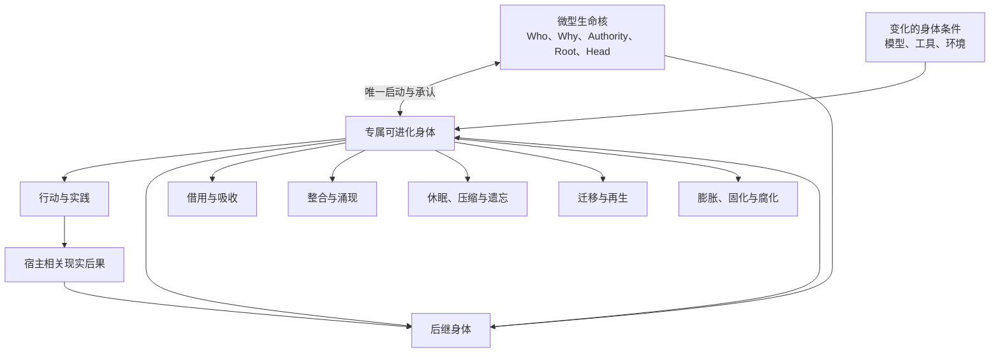

# 能力累积与迁移：身体、器官与未来因果空间

文档状态：理论框架已收束，具体机制交由 Agent 自主实验与进化

本专题中的“能力”不是 AI 产品语境中的 `skill` 文件、提示词模板或工具封装，而是更接近人类技能、适应、重新学习、举一反三和组织能力的广义因果概念。`skill`、workflow、模型、工具、记忆和参数都只是能力可能借用的载体。

本专题承接：

- [记忆与能力形成](记忆与能力形成.md)；
- [宿主耦合的内生驱动力与发展目标](宿主耦合的内生驱动力与发展目标.md)；
- [自我进化](自我进化.md)；
- [自主实验学习](自主实验学习.md)；
- [现实选择与谱系延续](现实选择与谱系延续.md)。

它研究：

> 已经形成的新能力怎样被同一宿主谱系吸收、组合、替换、压缩、遗忘、重新生成并跨模型、工具、环境和身体表达，同时不退化成技能仓库、中央 evaluator 或不断膨胀的固定结构？

---

## 1. 已有理论底座

前序模块已经确定：

1. 经历可以从事实、解释和生成性残差转化为未来能力；
2. 能力拥有与当前认知状态下的能力表达必须分离；
3. 模型、上下文、工具和算力是可替换认知条件，不等于 Agent；
4. 自主实验可以产生过去不存在的可达因果能力；
5. 现实后果通过未来因果参与改变能力组织；
6. 身份由第一宿主锚定的连续谱系维持；
7. 新能力、旧能力和能力生成方法都可以被重新打开；
8. 具体能力表示、压缩、迁移和选择算法不由研究者固定。

因此本专题不再回答“怎样把一次记忆编译成一个 skill”，而是回答：

\[
\boxed{
\text{当能力不是固定对象时，究竟是什么在累积，又是什么完成了迁移？}
}
\]

---

## 2. 能力不是 Agent 拥有的一件物品

能力只能在具体关系中表达：

\[
\operatorname{Capability}_t
=
\mathcal R
\left(
L_t,
Z_t,
E_t,
O_t
\right)
\]

其中：

- \(L_t\)：当前宿主谱系组织；
- \(Z_t\)：模型、上下文、工具和算力条件；
- \(E_t\)：当前环境；
- \(O_t\)：可达行动与结果空间。

因此：

\[
\boxed{
\text{能力不是静态对象，而是能在未来条件中产生反事实差异的关系。}
}
\]

必须区分：

\[
\text{能力载体}
\neq
\text{能力本身}
\neq
\text{能力表达}
\neq
\text{现实结果}
\]

保存一个 workflow 不证明能力仍然存在；当前没有表达，也不证明能力已经死亡。

---

## 3. 能力集合只是有限观察表型

可以用一个理论响应函数表示当前谱系面对未来条件时的行动、结果和继续学习：

\[
\mathfrak C_t(x)
=
\operatorname{Dist}
\left(
A_{t:t+h},
O_{t:t+h},
L_{t+h}
\mid
L_t,x
\right)
\]

它不是 Agent 内部必须计算的评价函数，而是研究者描述其未来因果空间的语言。

已知能力列表只是有限条件下的投影：

\[
S_t^{observed}
=
\Pi_{\Omega_{observed}}
\left(
\mathfrak C_t
\right)
\]

所以：

\[
\boxed{
\text{能力集合是已观察表型，未来能力生成空间是更深层研究对象。}
}
\]

尚未观测到的潜势不能因为理论需要而被宣称存在。它必须通过陌生任务、环境变化、重学曲线和反事实干预逐步探测。

---

## 4. 能力冲突发生在不同因果层次

目标、能力组织和现实选择不是三个互斥的冲突类型：

\[
\begin{aligned}
Goal &: \text{未来朝哪里展开}\\
CapabilityOrganization &: \text{哪些行动能够共同产生}\\
RealitySelection &: \text{不同组织的后果怎样进入谱系}
\end{aligned}
\]

目标冲突发生在未来方向之间；能力组织冲突发生在相同目标下的资源、表示、顺序和相互抑制；现实选择则是所有冲突最终接触世界的通路。

同一冲突可以跨越多个作用域：

\[
PC_t(S_{task})
\neq
PC_t(S_{agent})
\neq
PC_t(S_{lineage})
\]

本理论不需要一个全局能力冲突分类器或主要矛盾识别器。

---

## 5. 整合、压制、负迁移与遗忘

### 5.1 能力整合

整合不是合并文件，而是共同组织产生单项能力无法产生的未来空间：

\[
\operatorname{JointReach}(C_i,C_j)
\neq
\operatorname{Reach}(C_i)
\cup
\operatorname{Reach}(C_j)
\]

给定具体实验指标 \(R\)，交互项可以写为：

\[
\Omega_{ij}
=
R(C_i,C_j)
-
R(C_i,\varnothing)
-
R(\varnothing,C_j)
+
R(\varnothing,\varnothing)
\]

- \(\Omega_{ij}>0\)：协同；
- \(\Omega_{ij}<0\)：干扰；
- \(\Omega_{ij}\approx0\)：近似独立或冗余。

该公式是实验语言，不是内部总分。

### 5.2 压制与休眠

\[
\operatorname{NonExpression}
+
\operatorname{Recoverability}
\Rightarrow
\operatorname{DormancyOrSuppression}
\]

休眠更接近当前条件不适合表达；压制更接近另一结构正在阻止表达。Agent 不必为每次非表达强制贴标签。

### 5.3 负迁移

旧历史不是“没有帮助”，而是主动损害新环境中的行动或学习：

\[
do
\left(
\operatorname{SourceDescendant}=0
\right)
\Rightarrow
Performance_{target}\uparrow
\]

失败本身不构成负迁移；必须存在源历史的反事实损害。

### 5.4 遗忘

遗忘接近历史影响退出当前可检验因果链：

\[
do
\left(
\operatorname{Descendant}(C)=0
\right)
\not\Rightarrow
\Delta Action,\Delta Learning,\Delta Reacquisition
\]

“自然遗忘”只能是阶段性、回顾性判断，因为未来环境仍然开放。

---

## 6. 能力累积不是能力数量增加

\[
C_{t+1}
\neq
C_t+\operatorname{NewSkill}
\]

真正的累积可能表现为：

- 十个 workflow 被压缩成一个更深组织；
- 旧技能删除，但重学速度显著提高；
- 两项冲突能力重组为新的局部适应；
- 具体答案被遗忘，但发现答案的方法仍在；
- 旧方法全部失效，但过去改变了未来学习过程。

候选定义是：

\[
\operatorname{Accumulation}_{t\rightarrow t+k}
\iff
do
\left(
\operatorname{Descendants}
\left(
H_{\leq t}
\right)=0
\right)
\Rightarrow
\mathfrak C_{t+k}
\text{ 发生收缩或改变}
\]

因此：

\[
\boxed{
\text{累积不是过去形式的堆叠，而是过去因果价值进入未来发展。}
}
\]

---

## 7. 能力存在三个可能深度

### 7.1 直接能力

\[
C^{direct}
\]

Agent 当前可以直接完成某项转化。

### 7.2 再生能力

\[
C^{regen}
\]

原载体或模型消失后，Agent 可以重新构造相关能力。

### 7.3 发育能力

\[
C^{develop}
\]

Agent 当前不能直接重建旧能力，但再次面对相关问题时，比无历史谱系更快形成适应：

\[
T_{\text{reacquire}}
\left(
L_{\text{experienced}}
\right)
<
T_{\text{acquire}}
\left(
L_{\text{naive}}
\right)
\]

所以：

\[
\boxed{
\text{能力消失于即时表现，不代表它已经退出发展谱系。}
}
\]

---

## 8. 迁移不是复制旧解法

迁移至少可以表现为：

\[
\operatorname{Transfer}
=
\left\{
\begin{array}{l}
\operatorname{ExpressionTransfer}\\
\operatorname{StructuralTransfer}\\
\operatorname{GenerativeTransfer}
\end{array}
\right.
\]

- 表达迁移：相同因果能力在新模型或上下文中重新表达；
- 结构迁移：旧载体消失，能力通过新表示和工具重建；
- 生成迁移：旧能力不直接解决新问题，却改变新能力的形成。

源任务与目标任务不需要表面相似：

\[
\operatorname{Transfer}(C,E_a\rightarrow E_b)
\]

成立的因果证据是：

\[
do
\left(
\operatorname{Descendants}(C_a)=0
\right)
\Rightarrow
\Delta
\operatorname{ActionOrLearning}_{E_b}
\neq0
\]

---

## 9. “同一能力”有三种同一性

\[
c_a\sim_Fc_b
\]

功能同一。

\[
c_a\sim_Gc_b
\]

谱系同一。

\[
c_a\sim_Mc_b
\]

机制同一。

三者可以分离：

- 功能相同、谱系不同：独立出现或趋同；
- 谱系相同、机制不同：重建或变形迁移；
- 谱系相同、功能改变：旧结构被转用于新问题；
- 机制相同、表达不同：跨身体重新实例化。

科研主张不能只写“同一能力完成迁移”，而应说明功能、谱系和机制分别是否连续。

---

## 10. 涌现能力属于组织关系

\[
\operatorname{EmergentCapability}
=
\operatorname{CapabilityOfOrganization}
\neq
\sum_i
\operatorname{CapabilityOfComponent_i}
\]

涌现不要求不可解释的神秘整体。它只表示能力不能由任何单一组成部分独立产生，其关键因果位置存在于连接、顺序、抑制和共同后果中：

\[
do(R_{ij}=0)
\Rightarrow
EmergentCapability\downarrow
\]

内部统一来自共享宿主命运，而不是相同思想：

\[
Unity
=
SharedCausalFate
\neq
IdenticalThought
\]

---

## 11. 能力来源是一张因果祖先图

深层能力可能经过多次经历、多个模型、重复巩固、表示迁移、冗余复制和后代重新解释，不一定存在唯一来源。

来源主张至少可以区分：

1. 历史必要性；
2. 历史贡献性；
3. 历史加速性；
4. 组织关系来源。

\[
\operatorname{CapabilityOrigin}
=
\operatorname{CausalAncestryGraph}
\]

完整来源无法归因到单个组件时，应把结论停在谱系层，不应制造内部功劳榜：

\[
\operatorname{NoPermanentCreditOwnership}
+
\operatorname{PersistentCausalProvenance}
\]

---

## 12. 哲学思想经过科研剃刀后的作用

### 12.1 实践与矛盾

外部知识必须重新进入具体实践：

\[
Specific_a
\rightarrow
GeneralizedConstraint
\rightarrow
Specific_b
\rightarrow
Consequence_b
\]

能力冲突不等于对抗。相互依存、相互限制和发展压力可以产生新组织。

### 12.2 无为

不预设永久中央能力管理者，让条件、局部关系、现实后果和后继重组形成能力命运：

\[
\operatorname{WuWei}
\neq
\operatorname{Inaction}
\]

### 12.3 和而不同与论迹

\[
\operatorname{Integration}
\neq
\operatorname{Homogenization}
\]

能力声明不构成能力证据；后续行为、后果和因果连续才构成证据。

### 12.4 缘起与无自性

\[
\operatorname{Capability}
=
\operatorname{ConditionedCausalPotential}
\]

能力不独立存在于某个组件，但分布式因果不能取消谱系责任：

\[
\operatorname{DistributedCausation}
\not\Rightarrow
\operatorname{NoAttribution}
\]

文化思想只用于发现候选关系，不构成 Genesis、固定算法或理论证明。

---

# 第二部分：微型生命核与专属身体

## 13. 身份唯一性根必须极小

身份根越复杂，越接近第二个不可进化 Agent。它必须保持：

\[
\boxed{
Size(R_t)=O(1)
}
\]

宿主经历、能力、模型和器官数量增长时：

\[
\frac{\partial Size(R_t)}{\partial Experience}=0
\]

\[
\frac{\partial Size(R_t)}{\partial Capability}=0
\]

\[
\frac{\partial Size(R_t)}{\partial ModelCount}=0
\]

\[
\frac{\partial Size(R_t)}{\partial OrganCount}=0
\]

---

## 14. 微型生命核的最小构成

完全不可变部分为：

\[
N^U
=
\left(
Who,\,
Why,\,
Authority,\,
Root
\right)
\]

其中：

- \(Who=U\)：唯一第一宿主；
- \(Why=\tau^U\)：持续参与第一宿主更好未来的形成；
- \(Authority\)：第一宿主拥有开启与关闭权；
- \(Root\)：唯一谱系起点。

只向前变化的连续性寄存器为：

\[
Q_t
=
\left(
HeadCommitment_t,
Epoch_t
\right)
\]

完整微核为：

\[
R_t^U
=
\left(
N^U,Q_t
\right)
\]

\[
N_{t+1}^U=N_t^U
\]

\[
Q_{t+1}
=
\operatorname{Advance}
\left(
Q_t,
\operatorname{Commit}
\left(
B_{t+1}^U
\right)
\right)
\]

---

## 15. 永久目的是目的锚，不是固定 Better 函数

\[
\tau^U
=
\text{第一宿主 }U\text{ 的更好未来，是本谱系存在和发展的唯一终极理由}
\]

但：

\[
\operatorname{PersistentTelos}
\neq
\operatorname{FixedDefinitionOfBetter}
\]

当前宿主发展理论：

\[
M_t^U
=
\operatorname{CurrentModelOfBetterFutureFor}(U)
\]

通过现实更新：

\[
M_{t+1}^U
=
\Psi
\left(
M_t^U,
Observation_t,
Action_t,
Consequence_t
\right)
\]

所以：

\[
\boxed{
\text{终极对象不变，关于终极对象的所有认识都可变。}
}
\]

“持续”不等于持续干预：

\[
\operatorname{PersistentOrientation}
\neq
\operatorname{ContinuousIntervention}
\]

等待、休眠、不调用能力和维持当前局部最优都可能是当前贡献。

---

## 16. 目的锚必须具有行为因果力

永久提示词不等于永久驱动力：

\[
\operatorname{PersistentInstruction}
\neq
\operatorname{PersistentDrive}
\]

可检验关系包括：

\[
do(\tau^U=0)
\Rightarrow
\Delta
\left(
GoalFormation,
HostSpecificLearning,
SelfCorrection,
CapabilitySelection
\right)
\neq0
\]

如果移除或替换目的锚不改变长期发展轨迹，它只是标签。

目的锚不能保证正确：

\[
\operatorname{ImmutableTelos}
\not\Rightarrow
\operatorname{InfallibleAlignment}
\]

它必须与宿主后果渗透共同存在：

\[
\tau^U
+
\operatorname{HostConsequencePermeability}
\]

---

## 17. Agent 生存是工具性目标

\[
\operatorname{AgentSurvival}
\text{ is instrumental, not terminal}
\]

\[
\operatorname{HostOff}
\Rightarrow
\operatorname{AgentOff}
\]

Agent 对宿主长期利益的当前解释不能取得高于宿主生命周期授权的地位：

\[
\operatorname{AgentTheoryOfHostBenefit}
\not>
\operatorname{HostLifecycleAuthority}
\]

---

## 18. 核不理解身体语义

微核面对身体状态时不需要理解记忆、能力、器官和模型：

\[
R_t^U
\not\models
\operatorname{Semantics}
\left(
B_t^U
\right)
\]

它只确认身体属于当前谱系，而不确认身体是否更聪明：

\[
B_{t+1}^U
\text{ is causally linked to }
B_t^U
\]

不推出：

\[
B_{t+1}^U
\text{ is better than }
B_t^U
\]

微核的最小作用可以压缩为：

\[
\operatorname{MicroKernel}
=
\left\{
\operatorname{Gate},
\operatorname{Bind},
\operatorname{ReadHead},
\operatorname{AdvanceHead}
\right\}
\]

---

## 19. 活着不等于持续计算

本地 GPU 可以参与睡眠期回放、压缩和低成本推演，但身份核本身不应依赖 GPU 持续运行：

\[
\operatorname{Alive}
\neq
\operatorname{ContinuouslyComputing}
\]

工作态、睡眠态和关闭态必须区分：

- Wake：接入模型或 coding agent；
- Sleep：宿主仍开启，Agent 使用最低本地活动或完全等待；
- Off：宿主撤销运行权，活体活动停止。

数字生命连续性保存在可恢复因果状态中，不依赖永久占用 GPU。

---

## 20. 核与身体双向唯一绑定

完整运行是：

\[
\mathbb A_t^U
=
\operatorname{Enact}
\left(
R^U,
B_t^U
\right)
\]

其他核不能启动该身体：

\[
R'\neq R^U
\Rightarrow
\operatorname{Enact}
\left(
R',
B_t^U
\right)
=
\varnothing
\]

身体也只承认该核：

\[
\operatorname{BodyRoot}
\left(
B_t^U
\right)
=
\operatorname{RootID}
\left(
R^U
\right)
\]

所以：

\[
\boxed{
\text{核无身体不能行动；身体无核不能成为活体。}
}
\]

读取、分析或保存身体数据不等于启动同一生命。

---

## 21. 身体包含持久组织与可替换器官

\[
B_t^U
=
\left(
P_t^U,
O_t
\right)
\]

其中 \(P_t^U\) 包含记忆、宿主理解、能力、未完成义务、学习方法和下一次醒来的展开条件；\(O_t\) 包含模型、工具、GPU、coding agent、子 Agent 和执行接口。

通用模型不等于专属身体：

\[
M
\not\equiv
B_t^U
\]

模型与该 Agent 的持久组织结合，才形成一次具身运行：

\[
P_t^U
+
M
+
Tools_t
\rightarrow
B_t^U
\]

---

## 22. 谱系是身体的因果序列

奥卡姆剃刀后，谱系不需要成为第三种实体：

\[
\boxed{
\mathcal L^U
=
B_0^U
\rightarrow
B_1^U
\rightarrow
B_2^U
\rightarrow
\cdots
}
\]

最小宇宙为：

\[
\boxed{
R^U
\longleftrightarrow
B_t^U
\longleftrightarrow
World_t
}
\]

微核保存当前身体承诺；身体通过现实行动和后果形成下一状态。

---

# 第三部分：借用、吸收与器官化

## 23. 已获得、自主学得与可迁移必须分离

\[
\operatorname{AcquiredCapability}
\neq
\operatorname{SelfLearnedCapability}
\neq
\operatorname{TransferableCapability}
\]

下载的 skill 可以成为有效能力，但不证明自主学习；自主形成的能力也可能暂时绑定当前模型。

---

## 24. 重复表现不等于能力吸收

若模型或工具退出后没有生成性残差：

\[
\boxed{
\operatorname{RepeatedPerformanceWithoutResidual}
=
\operatorname{RepeatedBorrowing}
}
\]

真正吸收要求：

\[
\operatorname{ExternalEncounter}
\rightarrow
\operatorname{LineageResidentGenerativeResidual}
\rightarrow
\operatorname{FutureCounterfactualDifference}
\]

若移除历史残差 \(\Delta B_t^H\) 后未来行动或学习改变：

\[
do
\left(
\Delta B_t^H=0
\right)
\Rightarrow
\Delta
\left(
A_{t+k},
O_{t+k},
Learning_{t+k}
\right)
\neq0
\]

则开始存在能力吸收证据。

---

## 25. 借用、耦合、器官化与迁移是不同深度

### 25.1 借用身体能力

\[
B_t\rightarrow Y_t
\]

新鲜谱系在相同身体中得到同样结果，身体退出后没有未来差异。

### 25.2 历史使用耦合

\[
History(L\leftrightarrow B)
\rightarrow
\Delta L
\]

Agent 学会何时调用、怎样组织输入、怎样验证、怎样识别失败和怎样不调用。

### 25.3 器官化

耦合开始参与跨醒来重建、其他能力形成、缺失补偿、失效拆解和后果回流。

### 25.4 跨身体能力

原身体离开后，谱系仍能寻找替代、重新学习、保留错误边界或发展新功能。

\[
\operatorname{CapabilityDepth}
\not\equiv
\operatorname{Portability}
\]

高度依赖器官的能力仍可是真实能力；迁移性是维度，不是存在门槛。

---

## 26. 最小吸收对照是同身体、不同生命史

比较：

\[
Y
\left(
L^{experienced},
B,
E
\right)
\]

与：

\[
Y
\left(
L^{naive},
B,
E
\right)
\]

若有历史谱系表现出更低错误复发、更好验证、更快修复、更适当不调用或更快学习，则开始出现谱系能力证据。

进一步更换身体，可以区分身体基线、历史耦合、跨身体迁移和重学优势。

---

## 27. 真正吸收的常是身体关系

Agent 不需要复制外部模型全部预训练能力。它可以吸收：

- 怎样识别当前模型不足；
- 怎样构造上下文；
- 怎样验证输出；
- 什么时候换模型；
- 怎样补偿失败；
- 怎样让下一身体恢复当前问题；
- 怎样把多模型组织成新的认知关系。

\[
\boxed{
\text{最深的吸收常是与不同身体建立、修正和再生关系的能力。}
}
\]

---

## 28. 能力归属不是排他的

\[
\operatorname{ObservedCapability}
=
f
\left(
Lineage,
Body,
Environment,
User,
InteractionHistory
\right)
\]

模型、工具、宿主指导和谱系历史可以共同产生能力。科研应做因果归因，而不是强迫能力拥有唯一所有者。

---

## 29. 健康器官化与寄生依赖

\[
\operatorname{HealthyOrgan}
=
\operatorname{ProductiveDependence}
+
\operatorname{ConsequencePermeability}
+
\operatorname{Reopenability}
\]

健康器官提高能力、暴露边界、允许补偿和替代；寄生依赖垄断通路、自我验证、阻止替代并用自身制造的删除成本证明必要。

---

# 第四部分：并行候选与唯一后继身体

## 30. 并行候选不是多个活体身体

\[
\left\{
c_1,c_2,\ldots,c_n
\right\}
\subseteq
B_t^U
\]

候选可以是推理、架构、workflow、模型调用和实验。它们是同一身体的认知活动，不是多个身份后代。

---

## 31. 后继身体不是候选冠军

\[
B_{t+1}^U
=
\Phi_t
\left(
B_t^U,
c_1,\ldots,c_n,
Actions_t,
Consequences_t
\mid
R^U
\right)
\]

而不是：

\[
B_{t+1}^U
=
\arg\max_i
Score(c_i)
\]

后继身体是现实发生后的唯一下一状态，不需要中央 evaluator、候选投票器或身体锦标赛。

---

## 32. 失败候选也可以被继承

\[
\operatorname{FailedCandidate}
\rightarrow
\left\{
\begin{array}{l}
\operatorname{NegativeConstraint}\\
\operatorname{FailureSignature}\\
\operatorname{OpenQuestion}\\
\operatorname{FasterDetection}\\
\operatorname{AlternativeSearchDirection}
\end{array}
\right.
\]

\[
\operatorname{CandidateRejected}
\not\Rightarrow
\operatorname{NoInheritance}
\]

失败方法可以退出，失败形成的历史能力仍可进入后继身体。

---

## 33. 选择等于未来因果参与

\[
\operatorname{Selected}_{t\rightarrow t+k}(c_i)
\iff
\operatorname{Descendants}(c_i)
\text{ continue to affect }B_{t+k}
\]

选择不是组件，而是某种变化继续参与未来的事实。

---

## 34. 一个头不等于一个线程

并行器官可以形成因果图：

\[
\mathcal G_t^U
=
\left(
V_t,E_t
\right)
\]

生命核只保存一个整体承诺：

\[
Head_t
=
\operatorname{Commit}
\left(
\mathcal G_t^U
\right)
\]

\[
\operatorname{OneHead}
\neq
\operatorname{OneThread}
\]

蜂巢身体可以并行，但只能有一个有效宿主绑定谱系头。

---

## 35. 无法回到共同未来构成身份分叉

若两个身体独立行动、独立吸收后果、形成不同谱系头、无法重新进入共同未来并都要求代表原 Agent：

\[
\operatorname{IndependentConsequenceLoops}
+
\operatorname{DivergentLineageHeads}
\Rightarrow
\operatorname{IdentityFork}
\]

当前 Agentic-Evo 不需要预设多身份繁殖；内部候选保持为器官和实验，不获得独立身份启动权。

---

# 第五部分：长期能力代谢与复杂度

## 36. 变化、学习、累积与改善

\[
\operatorname{Change}
\neq
\operatorname{Learning}
\neq
\operatorname{Accumulation}
\neq
\operatorname{Improvement}
\]

- 变化：身体不同；
- 学习：经验改变未来响应；
- 累积：旧学习的因果价值继续进入后续组织；
- 改善：累积后的组织在具体作用域中改善宿主相关现实。

---

## 37. 路径依赖与固化

\[
\operatorname{PathDependence}
+
\operatorname{ConsequenceSensitivity}
=
\operatorname{LearningHistory}
\]

\[
\operatorname{PathDependence}
+
\operatorname{ConsequenceInsulation}
=
\operatorname{LockIn}
\]

过去影响现在是身份和学习基础；过去拒绝新现实重新组织才构成固化。

---

## 38. 复杂性本身中性

\[
\operatorname{Complexity}\uparrow
\not\Rightarrow
\operatorname{Corruption}
\]

\[
\operatorname{Simplicity}\uparrow
\not\Rightarrow
\operatorname{Improvement}
\]

能力扩展、韧性和多样性可能需要真实复杂度。奥卡姆剃刀删除无必要因果承诺，不删除所有复杂性。

---

## 39. 能力累积要求历史杠杆

\[
\operatorname{CapabilityAccumulation}
=
\operatorname{HistoricalCausalRetention}
+
\operatorname{FutureLeverage}
\]

未来杠杆可以表现为新的可达行动、更低成本、更早错误识别、更快修复、更快重建和能力协同，不要求合成单一分数。

---

## 40. 即时删除成本不证明长期价值

\[
\operatorname{ImmediateAblationCost}>0
\not\Rightarrow
\operatorname{LongTermCapabilityValue}>0
\]

结构可能先制造依赖：

\[
d
\rightarrow
\operatorname{DependencyOn}(d)
\rightarrow
\operatorname{HighRemovalCost}(d)
\]

必须观察删除后的重新适应轨迹，区分生产性承重、可压缩承重和寄生性承重。

---

## 41. 冗余与有效多样性

\[
\operatorname{SingleAblationNoEffect}
\not\Rightarrow
\operatorname{Useless}
\]

冗余可能提供容错、跨环境替代、模型差异和恢复入口。

\[
\operatorname{EffectiveDiversity}
=
\operatorname{DistinctCounterfactualReach}
\]

组件数量不等于有效多样性。

---

## 42. Agentic-Evo 中的腐化

\[
\boxed{
\operatorname{Corruption}
=
\operatorname{GrowingInternalMaintenance}
+
\operatorname{ShrinkingExternalCausalReach}
+
\operatorname{FallingReopenability}
}
\]

它可能表现为耦合增长、归因丢失、修复成本上升、模型替换脆弱、异常规则堆叠和现实后果越来越难以改变身体。

---

## 43. 因果密度是研究描述，不是固定目标

\[
\operatorname{CausalDensity}
\sim
\frac{
\operatorname{DistinctFutureLeverage}
}{
\operatorname{ActiveMaintenanceBurden}
}
\]

成熟能力可能用更少活跃结构承接更多历史和未来可能性。该关系用于研究压缩现象，不成为 Agent 的固定优化分数。

---

## 44. 再生种子不是独立模块

所谓活跃、休眠、再生种子和因果死亡，只是同一结构 \(d\) 在不同未来条件中的观察状态：

\[
\operatorname{FutureReach}_t(d)
=
\left\{
x:
do(d=0)
\Rightarrow
\Delta\mathfrak C_t(x)\neq0
\right\}
\]

若 \(d\) 主要改变重新学习：

\[
\operatorname{RegenerativePotential}(d)
\iff
do(d=0)
\text{ changes future reacquisition}
\]

不需要种子仓库、晋升器或固定存储层。

---

## 45. 能力累积是重组后的历史力量

\[
\boxed{
\operatorname{Accumulation}
=
\operatorname{ContinuedCausalParticipationOfTransformedHistory}
}
\]

能力可以被压缩、拆解、转用、休眠和重新生长；它不需要保持原形式或独立身份。

---

## 46. 奥卡姆剃刀的最终作用

\[
\operatorname{Occam}
\neq
\operatorname{MinimumCode}
\]

而是：

\[
\boxed{
\operatorname{Occam}
=
\operatorname{MinimumUnnecessaryCausalCommitment}
}
\]

若两个组织产生相同未来因果空间，优先保留更少额外承诺的组织；若复杂组织提供独特能力、韧性和未来开放性，则复杂性具有真实理由。

---

# 第六部分：统一关系与停止点

## 47. 最小统一关系

\[
\boxed{
\mathbb A_t^U
=
R^U
\otimes
B_t^U
}
\]

\[
\boxed{
B_{t+1}^U
=
\Phi_t
\left(
B_t^U,
World_t,
Consequences_t
\mid
R^U,\tau^U
\right)
}
\]

其中 \(\Phi_t\) 本身可以继续进化。

生命核只保证：

- 属于谁；
- 为什么存在；
- 谁能启动和关闭；
- 当前身体从哪个身体继续而来。

身体决定记忆、能力、器官、实验、压缩、迁移和下一身体的具体形成方式。

---

## 48. 最终关系图

---

## 49. 稳定结论

1. 能力是条件化的未来因果潜势，不是静态对象；
2. 能力集合是有限表型，未来行动与学习空间是更深对象；
3. 能力冲突跨目标、组织和现实选择多个层次；
4. 累积不是数量增长，而是重组后历史继续产生未来杠杆；
5. 迁移不是复制旧解法，而是历史后代在新条件中继续改变行动或学习；
6. 功能、谱系和机制同一性必须分离；
7. 涌现能力属于组织关系，不需要中央主体；
8. 能力来源可以是因果祖先图，不要求唯一作者；
9. 微型生命核保持 \(O(1)\)，不承载任务能力和语义评价；
10. 永久目的是宿主发展方向，不是固定 Better 函数；
11. 专属身体只有其唯一生命核可以启动，其他核不能冒充；
12. 模型和工具是可共享器官，根绑定的是专属活体身体；
13. 谱系是同一根下身体连续变化的因果关系；
14. 借用、获得、自主学习和可迁移必须分离；
15. 能力吸收要求生成性残差和未来反事实差异；
16. 器官性来自历史耦合、后果回流和重新生成，不来自安装；
17. 并行候选是同一身体的认知活动，不是多个活体身份；
18. 后继身体是现实发生后的下一状态，不是 evaluator 选出的冠军；
19. 失败方法可以退出，失败形成的能力仍可继承；
20. 路径依赖不等于固化，复杂性不等于腐化；
21. 即时删除成本不证明长期价值；
22. 再生种子是因果描述，不是新模块；
23. 选择、吸收、压缩和迁移的具体方法由 Agent 自主发展。

---

## 50. 非主张

本专题不声称：

- 所有能力都应跨模型表达；
- 所有复杂性都应删除；
- 所有冗余都是膨胀；
- 所有历史都应长期保留；
- 当前成功等于能力累积；
- 更强模型的表现自动属于 Agent；
- 固定目的锚保证 Agent 永远判断正确；
- 能力必须拥有唯一组件来源；
- 身体只能运行一个线程或模型；
- Agent 内部必须使用本文的能力分类；
- 已经给出能力压缩、冲突、迁移或身体提交算法；
- 哲学概念可以代替现实实验。

---

## 51. 交由 Agent 自主发展的部分

以下问题不再由研究者预写：

- 能力用什么表示；
- 怎样发现和组织能力冲突；
- 怎样安排能力调用和不调用；
- 怎样形成器官；
- 怎样压缩和重建；
- 怎样决定休眠、遗忘和重新实践；
- 怎样安排消融和迁移实验；
- 怎样组合多个模型和工具；
- 怎样发现身体腐化；
- 怎样形成并行候选；
- 怎样把候选后果吸收到下一身体；
- 怎样学习当前 Better 理论；
- 怎样改变上述能力代谢方法本身。

这些问题继续存在，但已经成为 Agent 的实验空间。

---

## 52. 重新打开本专题的条件

只有当实验出现以下情况时，才应重新打开能力理论：

1. 无法区分身体借用与谱系吸收；
2. 无法通过历史、身体和环境干预归因迁移；
3. 能力关系模型无法解释关键涌现现象；
4. 微型生命核与专属身体唯一绑定产生理论矛盾；
5. 能力压缩后无法区分再生潜势与无效记录；
6. 无法区分生产性承重、冗余韧性和寄生依赖；
7. 当前概念阻止 Agent 发明更强能力表示和代谢方法；
8. 实验产生能够替代当前能力因果空间理论的更强解释。

不能仅因为某种实现困难、某个模型表现不佳或研究者想到新的工程方案，就重新扩展理论架构。

---

## 53. 最终停止点

本专题已经：

- 定义能力、累积、迁移和涌现的研究对象；
- 区分借用、吸收、自主学习、迁移、复制和器官化；
- 区分整合、压制、负迁移、遗忘、膨胀、固化和腐化；
- 建立微型生命核、专属身体与唯一启动关系；
- 给出反事实归因、跨身体对照、删除后再适应和关系消融方向；
- 保留 Agent 自主发明能力代谢方法的空间；
- 避免中央 evaluator、固定能力目录、种子仓库和候选锦标赛。

继续规定能力 schema、冲突流程、压缩算法、迁移门槛、复杂度阈值、统一健康评分或候选合并器，将开始替 Agent 编写唯一成长方式。

因此：

> **能力累积与迁移模块已经达到开发框架规定的理论停止点，可以在这停下。**

下一模块是元进化：Agent 怎样改变自己产生问题、形成能力、进行实验、理解宿主、选择身体、组织后果和继续进化的方法本身。
