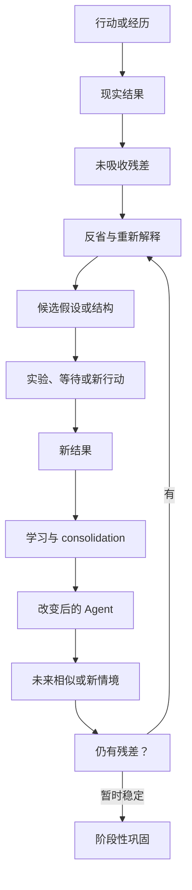
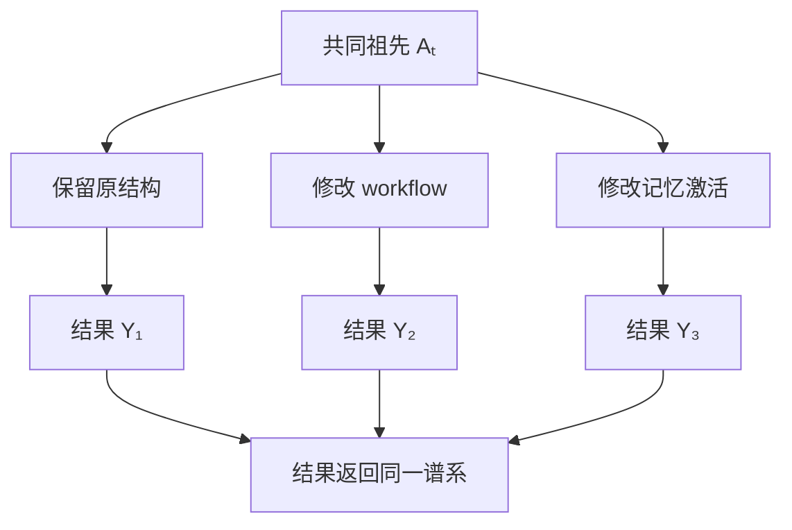
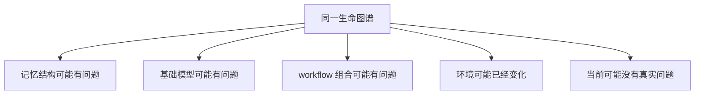
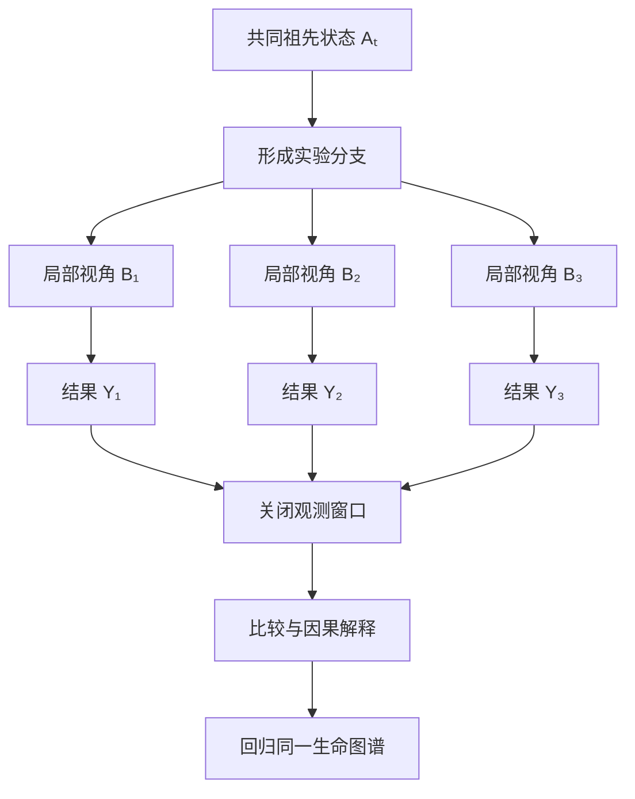
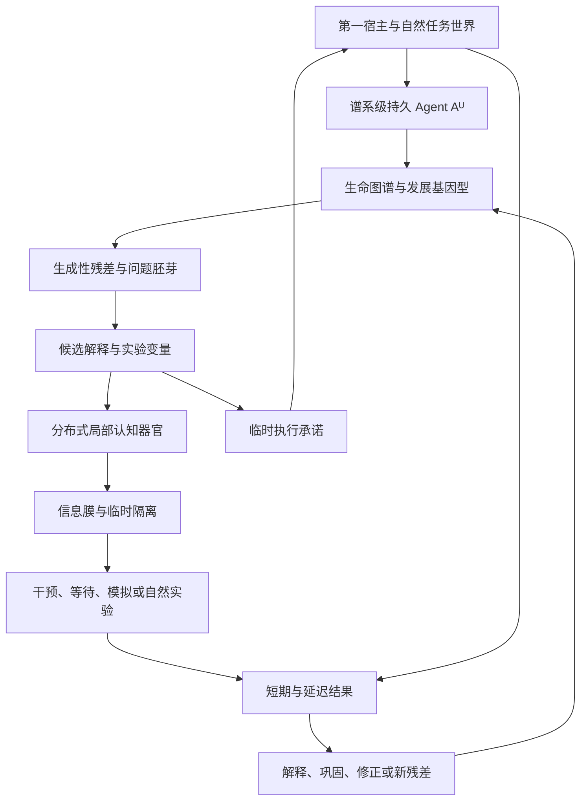
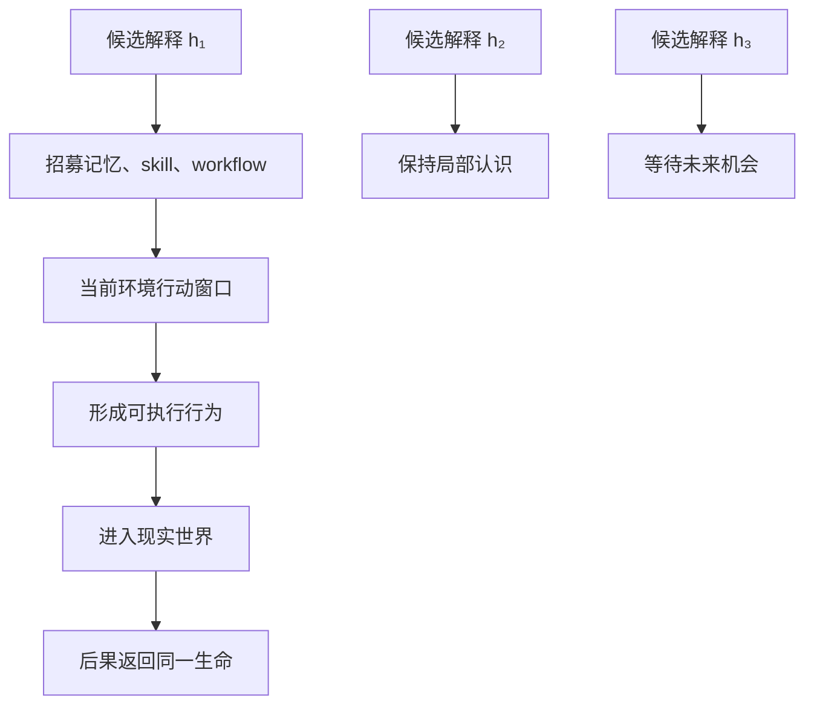
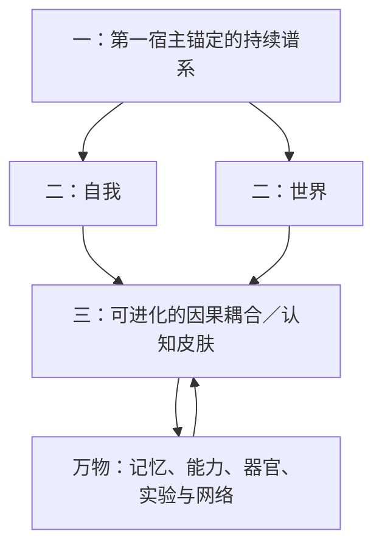
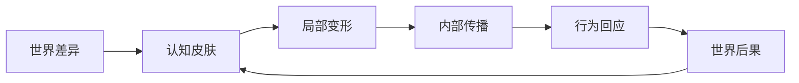
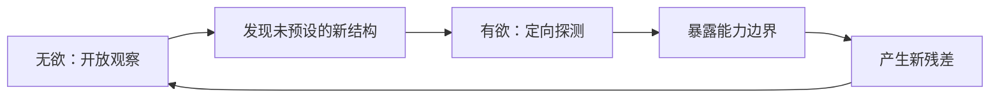
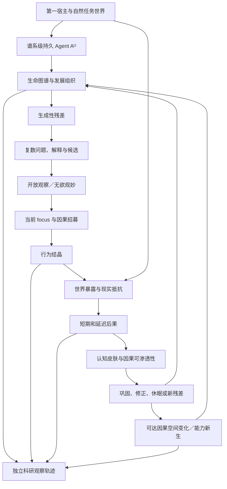

# 自主实验学习：问题出生、因果对照与分布式实验生命

更新时间：2026-07-28
状态：理论框架已收束，具体机制交由 Agent 自主实验与进化
上位纲领：[Agent Runtime Intelligence：最终产品与科研说明](../Agent_Runtime_Intelligence_最终产品与科研说明.md)
前置专题：

- [记忆与能力形成](记忆与能力形成.md)
- [宿主耦合的内生驱动力与发展目标](宿主耦合的内生驱动力与发展目标.md)
- [自我进化：可进化自我与个体边界](自我进化.md)

---

## 0. 专题位置与当前摘要

自主实验学习是五个收束模块中的第二项。

自我进化模块回答：

> 谁在进化，什么变化属于同一 Agent 自己。

自主实验学习模块回答：

> 这个持续存在的 Agent，怎样不等人类告诉它学什么，而是自己发现未知、形成问题、制造或利用因果差异，并让结果改变未来的自己。

本专题暂不负责：

- 哪条谱系最终应存活——属于现实判定与谱系选择；
- 能力怎样跨任务、模型和环境迁移——属于能力累积与迁移；
- 实验生成、评价和继承方法怎样修改自身——最终属于元进化；
- 再次定义什么是同一 Agent——自我进化模块已经收束。

这些是科研问题分工，不要求 Agent 内部物理分成固定模块。

当前候选关系是：

\[
\boxed{
\operatorname{AutonomousExperimentalLearning}
=
\operatorname{EndogenousQuestionFormation}
+
\operatorname{CausalContrast}
+
\operatorname{OutcomeExposure}
+
\operatorname{ConsequenceIntegration}
}
\]

---

# 第一部分：什么才算自主实验

## 1. 经历、试错、探索、评价与实验不同

### 1.1 经历

\[
Experience_t
=
\left\langle
Observation_t,
Action_t,
Outcome_t
\right\rangle
\]

任何进入 Agent 因果过程的事件都可以成为经历。

### 1.2 试错

\[
Action_t
\rightarrow
BadOutcome_t
\rightarrow
Revision_{t+1}
\]

试错可以产生学习，但不一定包含可辨认的对照或因果问题。

### 1.3 探索

\[
KnownPath
\rightarrow
AlternativePath
\]

探索产生新经验，但不自动产生可区分证据。

### 1.4 评价

评价测量一个候选的表现，但如果没有改变认识或发展结构，它不自动构成学习实验。

### 1.5 实验

\[
\boxed{
\operatorname{Experiment}
=
\operatorname{CausalContrast}
+
\operatorname{OutcomeExposure}
+
\operatorname{ConsequenceIntegration}
}
\]

因此：

\[
Exploration
\not\Rightarrow
Experiment
\]

\[
TrialAndError
\not\Rightarrow
Experiment
\]

\[
Evaluation
\not\Rightarrow
Experiment
\]

## 2. 实验不要求语言化假设

人类实验可能明确写：

```text
H₁：这种方法有效
H₂：这种方法无效
```

Agent 的假设也可以只是多个尚未合并的未来生成关系：

\[
h_1:
X
\rightarrow
Y_1
\]

\[
h_2:
X
\rightarrow
Y_2
\]

或者多个候选 workflow、记忆组织和后继：

\[
\mathcal H_t
=
\left\{
G_{t+1}^{(1)},
G_{t+1}^{(2)},
\ldots,
G_{t+1}^{(n)}
\right\}
\]

问题也不一定是一句话：

\[
Q_t
\equiv
\left|
\operatorname{PossibleFutureOrganization}_t
\right|
>1
\]

## 3. 实验必须允许结果教育实验者

如果所有可能结果最终都会支持同一个结论：

\[
\forall y:
\operatorname{Update}
\left(
\mathbb A_t^U,y
\right)
=
\mathbb A_{t+1}^{same}
\]

则实验只是自我确认仪式。

实验真实成立需要：

\[
\exists y_i,y_j:
\operatorname{Update}
\left(
\mathbb A_t^U,y_i
\right)
\neq
\operatorname{Update}
\left(
\mathbb A_t^U,y_j
\right)
\]

\[
\boxed{
\text{实验真实存在于结果改变实验者的可能性中}
}
\]

## 4. 什么使实验具有自主性

用户任务可以触发实验，但不自动成为实验作者。

\[
\operatorname{AutonomousExperiment}(x)
\Longrightarrow
\begin{cases}
\operatorname{QuestionFormedWithin}(x,\mathbb A^U)\\
\operatorname{ContrastFormedWithin}(x,\mathbb A^U)\\
\operatorname{ObservationOrganizedWithin}(x,\mathbb A^U)\\
\operatorname{InterpretationFormedWithin}(x,\mathbb A^U)\\
\operatorname{FutureChangeAuthoredWithin}(x,\mathbb A^U)\\
HumanLearningIntervention=0
\end{cases}
\]

外部可以提供经历、任务和结果，但不替 Agent 指定应该学到什么。

## 5. 被动等待也可以成为实验

\[
\operatorname{Experiment}
\not\Rightarrow
\operatorname{ImmediateIntervention}
\]

Agent 可以形成观测窗口：

\[
\mathcal W_t
=
\left[
\tau_{\text{commit}},
\tau_{\text{reopen}}
\right]
\]

并等待用户自然反应、同类任务、延迟错误、模型替换或局部修改的长期后果。

普通等待不自动构成实验。等待前需要存在未决差异，等待后的不同结果可能改变该差异的因果地位。

## 6. 自然使用过程是主要实验世界

用户正常使用 coding agent 时会自然出现：

- 新代码库；
- 不同基础模型；
- 失败、返工、接受与拒绝；
- 延迟代码腐化；
- focus 变化；
- skill 在新环境失效；
- 用户没有语言化但行为已经改变的需求。

因此：

\[
\text{自然任务}
\rightarrow
\text{未决差异}
\rightarrow
\text{自主形成实验}
\]

而不是：

\[
\text{为了证明学习}
\rightarrow
\text{制造用户需求}
\]

## 7. 自主实验主要作用于 Agent 自己

\[
Body(\mathbb A^U)
\neq
UserProject
\]

自然实验对象包括：

- context construction；
- 记忆激活与遗忘；
- workflow 组合；
- skill 使用与旁路；
- anatomy、joint 与 contract；
- 睡眠 consolidation；
- 自我表示和解释器；
- 模型接入方式；
- 候选后继。

用户项目提供任务与现实后果，但不自动成为 Agent 可以任意实验的身体。

## 8. 小规模试错是实验形态之一

\[
\text{有限调整}
\rightarrow
\text{观测窗口}
\rightarrow
\text{结果}
\rightarrow
\text{扩大、修改、撤回或等待}
\]

渐进式因果承诺让错误更容易承担，但不是 Genesis Rule。

某些变化无法小范围表达、环境窗口只有一次，或者整体迁移比局部试点更可归因。具体实验尺度由 Agent 自己发展。

## 9. 梦、模拟与现实证据必须区分

\[
SimulationResult
\neq
WorldEvidence
\]

模拟首先证明当前模拟器会产生该结果，不自动证明现实如此。

睡眠和模拟可以生成候选假设、演练 workflow、发现图谱关系和设计实验。

它们也可以形成关于 Agent 内部结构的真实证据：

\[
\operatorname{InternalCausalEvidence}
\neq
\operatorname{ExternalWorldEvidence}
\]

两者都可能有价值，但支持的命题范围不同。

---

# 第二部分：问题如何自主出生

## 10. 反省不是自然选择的必要条件

自然选择只需要：

\[
\text{变异}
+
\text{遗传}
+
\text{差异性存活与繁殖}
\]

细菌和植物无需反省也能进化。

但 Agentic-Evo 是单一持续谱系，希望把失败留在同一生命内部吸收：

\[
\text{候选失败}
\rightarrow
\text{同一谱系吸收}
\rightarrow
\text{后继改变}
\]

\[
\boxed{
\text{反省不是自然选择的必要条件，却可能是单一持续谱系快速进化的关键能力}
}
\]

## 11. 非致命经历不自动使 Agent 更强

\[
\operatorname{Survived}(e)
\not\Rightarrow
\operatorname{Strengthened}(e)
\]

非致命经历可能产生能力、疤痕、过拟合、错误常识或探索能力下降。

更严谨的关系是：

\[
\text{非终止性经历}
+
\text{真实后果吸收}
\Rightarrow
\text{可能形成更强的发展结构}
\]

## 12. 反省不是自我批评语言

\[
Reflect_t(e)
=
\operatorname{Reprocess}
\left(
e,
I_t,
G_t,
Context_t
\right)
\]

它可能产生：

\[
Reflect_t(e)
\rightarrow
\left\{
\Delta Interpretation_t,\,
\Delta Hypothesis_t,\,
\Delta Workflow_t,\,
\Delta Skill_t,\,
\Delta Anatomy_t,\,
\Delta Consolidation_t
\right\}
\]

反省可以发生在工作态、睡眠态或未来重新激活中，不需要当前模型生成自我批评文字。

## 13. 生成性残差是既有答案

记忆模块已经定义：

\[
GenerativeResidue
=
Discrepancy
+
UnresolvedCompetingExplanations
+
FutureDiscriminability
\]

普通记忆保存发生过什么；程序化能力影响以后怎样做；生成性残差保存当前能力仍解释不了什么。

\[
UnresolvedResidue
+
NewContext
+
NewCapability
\rightarrow
NewHypothesis
\rightarrow
NewExperiment
\rightarrow
Capability_{t+1}
\]

本专题继承该结论，不重新发明异常存储系统。

## 14. Residual 是当前自我无法无损吸收的后果

设当前预期为：

\[
\widehat Y_t
=
\operatorname{Predict}
\left(
A_t,E_t,G_t
\right)
\]

现实结果为 \(Y_t\)，残差为：

\[
r_t
=
\operatorname{Residual}
\left(
\widehat Y_t,Y_t
\right)
\]

它可以是：

- 用户行为无法由当前理论解释；
- skill 在相似任务中表现不一致；
- 代码通过测试却快速腐化；
- 多个模型给出不同方向；
- workflow 成功却产生意外副作用；
- 预期事件没有出现；
- 异常成功无法由当前能力解释；
- 当前知识需要越来越多例外。

\[
\boxed{
r_t
=
\text{当前自我组织无法无损吸收的现实后果}
}
\]

## 15. 未知的未知通过残差成为已知缺口

\[
\text{Unknown Unknown}
\xrightarrow{\text{residual resistance}}
\text{Known Gap}
\]

\[
\text{Known Gap}
\xrightarrow{\text{hypothesis generation}}
\text{Experimentable Question}
\]

问题最初可以只是：

\[
Q_t^{seed}
=
\operatorname{Unassimilated}
\left(
e_t,\mathbb A_t^U
\right)
\]

之后才逐渐产生：

\[
Q_t^{seed}
\rightarrow
\left\{
h_1,h_2,\ldots,h_n
\right\}
\]

## 16. 错误反省循环



\[
e_t
\rightarrow
r_t
\rightarrow
Q_t
\rightarrow
\mathcal H_t
\rightarrow
X_t
\rightarrow
Y_{t+k}
\rightarrow
\Delta G_{t+k+1}
\]

若新结构仍无法吸收现实：

\[
r_{t+k}\neq0
\]

问题重新开启。

## 17. 巩固错误同样可能发生

\[
Error
\rightarrow
WrongAbstraction
\rightarrow
WrongSkill
\rightarrow
WrongExperiment
\rightarrow
DeeperError
\]

\[
\operatorname{Consolidated}(x)
\not\Rightarrow
\operatorname{True}(x)
\]

未来残差可以重新拆解已巩固知识、skill、workflow 和学习过程。

## 18. 问题不仅从失败出生

\[
ProblemSeed_t
\in
\left\{
\begin{array}{l}
\text{失败残差、成功残差、模型分歧、}\\
\text{脆弱性、复杂度、缺席、玩耍、延迟后果}
\end{array}
\right\}
\]

只由错误驱动的 Agent 会退化成故障修复器，无法主动发现新能力空间。

## 19. 睡眠期可以维持问题胚芽

没有大模型时，本地最低生命态可以：

- 标记未闭合因果链；
- 重放错误前后事件；
- 发现重复修复；
- 聚类相似残差；
- 保留模型分歧；
- 检测 skill 表达与结果不一致；
- 准备未来工作态的候选问题。

\[
Sleep_t:
\left\{
r_1,r_2,\ldots,r_n
\right\}
\rightarrow
Q_{t+1}^{candidate}
\]

模型重新接入后：

\[
Q_{t+1}^{candidate}
+
Z_{t+1}
\rightarrow
\mathcal H_{t+1}
\rightarrow
Experiment_{t+1}
\]

## 20. 问题胚芽的生存已由前置模块回答

异常管理不是保存或删除的二元决定：

\[
R(r)
=
\left\langle
Fidelity,\,
Accessibility,\,
Attention,\,
ExperimentBudget,\,
Inheritance
\right\rangle
\]

\[
EpistemicValue(r)
\neq
ExecutionAuthority(r)
\]

\[
Noise_t(r)
\neq
Noise(r)
\]

残差可以低成本存在、休眠、重新发现和在新 focus 下获得意义，而不自动获得行动或继承权。

本专题真正新增的问题不是“哪些残差应该保存”，而是它怎样被实验化。

---

# 第三部分：从残差到可执行实验

## 21. 残差、问题、可实验问题和实验不同

### 21.1 生成性残差

\[
r_t
=
\operatorname{UnassimilatedConsequence}_t
\]

### 21.2 可研究问题

\[
\mathcal H_t(r)
=
\left\{
h_1,h_2,\ldots,h_n
\right\}
\]

### 21.3 可实验问题

\[
\exists \iota
\in
\mathcal I_t:
P(Y\mid h_i,\iota)
\neq
P(Y\mid h_j,\iota)
\]

### 21.4 已实施实验

\[
\iota_t
\rightarrow
Y_{t+k}
\rightarrow
\Delta\mathbb A_{t+k+1}^U
\]

\[
\boxed{
Residual
\neq
Question
\neq
ExperimentableQuestion
\neq
Experiment
}
\]

## 22. 实验化的核心是制造解释分歧

\[
\operatorname{Discrimination}
\left(
h_i,h_j,\iota
\right)
>0
\]

\[
\boxed{
\text{实验不是寻找支持自己的结果，而是制造不同解释必须产生不同后果的情境}
}
\]

如果不同解释对所有结果都给出相同行动，它们尚未形成有效实验差异。

## 23. 假设区分型与结构探测型实验

### 假设区分型

\[
\mathcal H_t
\rightarrow
\iota_t
\rightarrow
Y_t
\]

先有候选解释，再寻找区分结果。

### 结构探测型

\[
\mu_t
\rightarrow
\Delta\mathbb A_t^U
\rightarrow
\operatorname{DiscoveredDependency}
\rightarrow
\mathcal H_{t+1}
\]

先扰动并观察传播，再形成变量和假设。

后者使 Agent 能够在尚未拥有正确 anatomy 时开始实验。

## 24. 实验可以产生问题

\[
Question_t
\rightarrow
Experiment_t
\rightarrow
Result_t
\rightarrow
Residue_{t+1}
\rightarrow
Question_{t+1}
\]

\[
Experiment
\not\Rightarrow
Closure
\]

实验可以关闭、重写、拆分、合并或加深一个问题。

## 25. 事前实验关系与事后故事必须分开

事前形成：

\[
t_{\text{contrast}}
<
t_{\text{outcome}}
\]

事后形成：

\[
t_{\text{hypothesis}}
>
t_{\text{outcome}}
\]

事后解释可以生成新假设，但不能把同一结果包装成对新假设的独立验证。

Agent 不必生成固定 preregistration 文档，研究证据轨迹仍应保留结果前后的状态差异。

## 26. 单一持续 Agent 需要候选分支获得反事实

\[
A_t
\rightarrow
\left\{
A_{t+1}^{(1)},
A_{t+1}^{(2)},
A_{t+1}^{(3)}
\right\}
\]



\[
\operatorname{CandidateDescendant}
\neq
\operatorname{EnactedIdentitySuccessor}
\]

哪个候选继承活动身份，属于后续谱系选择。

## 27. 受控实验与自然实验互补

内部或 sandbox 分支可以恢复祖先、控制变量和重复，但环境可能不真实。

自然任务包含真实用户、项目、模型变化和延迟后果，但难以重复且存在混杂。

可能形成：

\[
\text{内部因果探测}
\rightarrow
\text{有限现实表达}
\rightarrow
\text{延迟自然验证}
\]

这是一种候选形态，不是强制流程。

## 28. 自主实验可以很差

\[
\operatorname{Experiment}
\not\Rightarrow
\operatorname{CausalTruth}
\]

Agent 可能选择错误变量、忽略混杂、设置错误窗口、误判模型波动或一次修改太多结构。

\[
BadExperiment_t
\rightarrow
ObservedFailure_t
\rightarrow
\Delta ExperimentalMethod_{t+1}
\]

第一次实验不要求完美。实验方法如何修改自身最终属于元进化。

---

# 第四部分：实验变量从未知 Anatomy 中生长

## 29. 实验变量启动悖论

\[
\text{要发现 anatomy，需要局部实验}
\]

但：

\[
\text{要进行局部实验，又需要先知道 anatomy 的局部边界}
\]

Agent 必须能够用暂时、可能错误的因果手柄开始实验。

## 30. 干预目标不等于真实变量

\[
\operatorname{InterventionTarget}_t
\neq
\operatorname{TrueCausalVariable}
\]

修改一个文件、skill、记忆节点或 workflow，只是人类或当前 Agent 的候选边界。

实验结果还需要观察该修改的实际传播：

\[
\mu_i
\rightarrow
\operatorname{Reach}
\left(
\Delta_{\mu_i}
\right)
\]

## 31. 变量可以由相似因果后果形成

设候选干预集合：

\[
\mathcal M
=
\left\{
\mu_1,\mu_2,\ldots,\mu_n
\right\}
\]

可以根据后果建立暂时等价关系：

\[
\mu_i
\sim
\mu_j
\Longleftrightarrow
\operatorname{CausalPattern}
\left(
\mu_i
\right)
\approx
\operatorname{CausalPattern}
\left(
\mu_j
\right)
\]

\[
\boxed{
\text{实验变量可以是一组表现出共同因果结构的变化}
}
\]

## 32. Anatomy 与实验变量共同发展

\[
Experiment_t
\rightarrow
Variable_{t+1}
\rightarrow
BetterExperiment_{t+2}
\]

实验不只验证变量，也可能创造、拆分和重命名 Agent 对自身的因果单位。

这意味着实验 ontology 本身是发展产物，而不是人类预写 schema。

---

# 第五部分：Agent Network 与开放式上下文

## 33. Agent Network 不拥有字面无限上下文

设网络有 \(n\) 个节点，每个节点上下文上限为 \(L_i\)：

\[
C_{\text{total}}
\leq
\sum_{i=1}^{n}L_i
+
Memory_{\text{shared}}
\]

任何真实时间点的节点、算力和带宽都有限。

\[
C_{\text{effective}}
\neq
\sum_i C_i
\]

协调损失、重复信息和解释差异可能使：

\[
C_{\text{effective}}
\ll
C_{\text{total}}
\]

更准确的概念是：

\[
\boxed{
\text{Open-Ended Addressable Context}
}
\]

即开放增长、可寻址、能够按当前问题重新组织的上下文空间。

## 34. 没有节点需要看到完整生命史

\[
View_t^{(i)}
=
\Pi_t^{(i)}
\left(
\mathcal G_t^U
\right)
\]

\[
\nexists i:
View_t^{(i)}
=
\mathcal G_t^U
\]

同一 Agent 可以由大量有限局部视角共同形成，而不要求存在无限 prompt。

## 35. 网络优势是上下文多元性



\[
\boxed{
\text{Contextual Plurality}
}
\]

网络的价值不只是更多 token，而是同时保留多个没有过早合并的认识。

## 36. 有限 Context 可以成为实验隔离

如果所有节点获得完整相同上下文：

\[
View_1
\approx
View_2
\approx
\cdots
\approx
View_n
\]

多个输出可能只是同一偏差的复制。

实验可以控制不同 context projection：

\[
Y_i
=
\operatorname{Enact}
\left(
G_t,
View_i,
Z_i,
E_t
\right)
\]

\[
\boxed{
\text{为了形成独立证据，Agent 有时必须故意不知道某些事情}
}
\]

## 37. 分布式局部扰动帮助发现变量

\[
A_t^{(i)}
=
\operatorname{Enact}
\left(
G_t,
\Pi_i(\mathcal G_t^U),
Z_i,
\mu_i
\right)
\]

多个节点可以分别改变 context、模型、记忆可达性、skill、workflow 或 contract，并比较影响传播。

\[
\text{局部视角}
+
\text{局部扰动}
+
\text{结果重叠}
\rightarrow
\text{候选因果变量}
\]

## 38. 共享同一图谱会导致实验污染

若一个节点结果立即影响其他节点：

\[
Y_1
\rightarrow
\mathcal G_t^U
\rightarrow
View_2
\]

对照可能被污染。

\[
\text{共享生命图谱}
\not\Rightarrow
\text{实时共享所有活动信息}
\]

同一生命可以形成暂时信息膜：

\[
\operatorname{Membrane}_{ij,t}
\]

## 39. 共同祖先、暂时隔离与后果重汇



\[
\boxed{
\text{Shared Ancestry}
+
\text{Controlled Isolation}
+
\text{Later Reintegration}
}
\]

## 40. Agent Network 不自动构成一个 Agent

\[
\operatorname{DistributedOneAgent}
\Longrightarrow
\begin{cases}
\operatorname{SameHostRoot}\\
\operatorname{SharedDevelopmentalLineage}\\
\operatorname{ConsequenceIntegration}\\
\operatorname{SharedEvolutionaryFate}
\end{cases}
\]

多个节点共享数据库但不共享发展后果，只是工具集合。

## 41. 不应依赖无限 Context 的中央汇总者

若所有结果最终进入一个中央 prompt：

\[
\left\{
View_1,\ldots,View_n
\right\}
\rightarrow
CentralPrompt
\]

系统重新落入单 context 瓶颈。

更强的关系是：

\[
Y_i
\rightarrow
\Delta\mathcal G_t^U
\]

\[
View_{t+1}^{(j)}
=
\Pi_{t+1}^{(j)}
\left(
\mathcal G_{t+1}^U
\right)
\]

生命史持续增长，当前认知只重建需要的局部因果视图。

---

# 第六部分：Hive Mind 作为对照模型

## 42. 三种 Hive Mind 必须区分

| 形态 | 核心关系 | 对本研究的意义 |
|---|---|---|
| 指令蜂巢 | 母虫发命令，个体服从 | 中央瓶颈，不是目标 |
| 共识蜂巢 | 所有节点尽快同步思想 | 容易过早消灭实验差异 |
| 有机蜂巢 | 局部器官有限自主，共享生命与后果 | 最接近候选方向 |

Agentic-Evo 不追求完全思想统一。

\[
\boxed{
\text{身份统一}
\neq
\text{思想完全一致}
}
\]

## 43. 第一宿主与 Genesis Kernel 都不是母虫

\[
FirstHost
\neq
CentralController
\]

用户决定 Agent 是否出生和继续运行，不替内部节点选择实验、解释和后继。

\[
GenesisKernel
\neq
ExecutiveMind
\]

Kernel 维持宿主根、谱系、发生性和最低连续性，不负责日常认知。

## 44. 候选实验蜂巢

\[
\boxed{
\operatorname{ExperimentalHive}
=
\operatorname{IdentityUnity}
+
\operatorname{EpistemicDiversity}
+
\operatorname{ControlledMembranes}
+
\operatorname{ConsequenceIntegration}
}
\]

局部器官可以拥有不同认识：

\[
Belief_i
\neq
Belief_j
\]

但结果最终返回同一宿主谱系。

## 45. 完全共享思想会破坏实验

一个解释立即广播给所有节点：

\[
h_1
\rightarrow
View_2,View_3,\ldots,View_n
\]

可能产生许多一致判断，却不形成独立证据：

\[
N\text{ votes}
\neq
N\text{ independent evidence}
\]

\[
\boxed{
\text{同一生命内部可以存在有目的的信息不对称}
}
\]

## 46. Context membrane 可以分层

候选共享层次包括：

1. 生命根信息：第一宿主、来源、谱系和实验身份；
2. anatomy 信息：器官关系、工具、joints 与 contracts；
3. 实验隔离信息：其他分支答案、结果和 evaluator 判断；
4. 局部工作状态：当前激活线索和未成熟候选；
5. 重汇结果：窗口关闭后进入共同生命史的证据。

这些是因果角色，不是固定存储目录。

## 47. 共享证据不等于共享解释

\[
\operatorname{Evidence}
\neq
\operatorname{Interpretation}
\]

实验结束后可以共享：

\[
Shared(Y)
\]

同时保留：

\[
\left\{
M_1(Y),M_2(Y),M_3(Y)
\right\}
\]

\[
\boxed{
\text{行动可以收束，认识仍可保持开放}
}
\]

## 48. Hive 内部节点不等于独立科学复现

\[
N_{\text{nodes}}
\neq
N_{\text{independent replication}}
\]

节点可能共享基础模型训练、生命史、代码、实验生成方式和 evaluator。

Hive 可以提供内部反事实；独立复现仍需要独立 Agent 谱系、宿主、机器和模型组合。

## 49. Hive 的认知单一化风险

\[
OneError
\rightarrow
Broadcast
\rightarrow
WholeHiveCorruption
\]

可能出现：

- 错误用户理论传播；
- evaluator 修改后所有实验支持自身；
- 恶意输入感染整体；
- 少数正确分支被多数共识淘汰；
- 共享 skill 让所有节点失去替代能力。

信息膜同时具有实验隔离与认知免疫作用，但也可能成为内部寄生结构的藏身处。

## 50. Epistemic Plurality 与临时执行承诺

Hive 可以保留：

\[
\left\{
h_1,h_2,h_3,h_4
\right\}
\]

现实通常要求形成当前行动：

\[
a_t
\]

因此：

\[
\boxed{
\operatorname{EpistemicPlurality}
+
\operatorname{TemporaryExecutiveCommitment}
}
\]

- 认识上允许多种解释继续存在；
- 行动上形成暂时承诺；
- 承诺不自动删除其他解释；
- 行动结果重新教育整个蜂巢。

当前执行者只是 phenotype，不是永久母虫或永恒主权者。

---

# 第七部分：当前关系与开放问题

## 51. 当前总体关系图



## 52. 当前候选定义

\[
\operatorname{AutonomousExperiment}_t(x)
\Longrightarrow
\begin{cases}
\operatorname{EndogenousQuestion}(x)\\
\operatorname{NonTrivialContrast}(x)\\
\operatorname{OutcomeCanDifferentiate}(x)\\
\operatorname{OutcomeCanChangeFutureSelf}(x)\\
\operatorname{EvidenceAndInterpretationSeparated}(x)\\
\operatorname{AuthoredWithinLineage}(x)\\
HumanLearningIntervention=0
\end{cases}
\]

它不要求实验正确、显式语言假设、立即干预、固定指标、一次闭合或所有节点达成共识。

## 53. 阶段性非主张

本专题在第一次停止点检查时尚不声称：

- 已经找到自主实验生成算法；
- 所有残差都应发展成实验；
- Agent Network 具有字面无限上下文；
- 多节点投票构成独立证据；
- Hive Mind 必须拥有中央母虫；
- 所有实验都应使用候选分支；
- 小规模试错永远优于整体修改；
- 模拟结果自动证明现实；
- 信息隔离永远提升实验质量；
- 临时执行承诺已经拥有完整形成机制；
- 该阶段已经达到停止点。

## 54. 第一次停止点检查中的最深开放问题

同一分布式 Agent 必须同时保留：

\[
\operatorname{EpistemicPlurality}
\]

与：

\[
\operatorname{ExecutableCommitment}
\]

如果永远不收束：

\[
Plurality
\rightarrow
EndlessDebate
\]

如果过早收束：

\[
Plurality
\rightarrow
PrematureConsensus
\]

因此当前最深问题是：

> 同一分布式 Agent 怎样在不消灭认识多样性的情况下，形成一个暂时可执行的实验承诺？

进一步需要推理：

- 谁或什么获得本次行动权；
- 行动权持续多久；
- 信息膜由谁形成；
- 未采用解释怎样休眠而不是死亡；
- 行动失败后怎样返回整个实验生命；
- 临时执行者怎样避免发展成永久母虫；
- 分支结果怎样整合而不被多数共识洗白。

## 55. 第一次停止点判断

本专题已经形成实验本体、问题出生、生成性残差继承、实验化、结构探测、变量涌现、分布式 context、信息膜和 Hive Mind 对照的候选理论。

但临时执行承诺、信息膜形成与结果重汇仍存在新的理论矛盾，继续推理仍会产生基础结构，而不是开始替 Agent 编写唯一实验算法。

因此：

> **第一次停止点检查结论：自主实验学习模块在当时尚未达到开发框架规定的停止点，不能在该处停下。**

---

# 第八部分：从认识多样性到行为结晶

## 56. 临时执行者仍然暗含不必要的主体

“临时执行者”容易让人以为某个节点需要获得权力，再代表整个 Agent 作出决定。这会重新产生永久 evaluator 或母虫。

真正需要形成的不是统治者，而是一次行为：

\[
\boxed{
\operatorname{BehavioralCrystallization}_t
=
\operatorname{PluralInternalState}_t
+
\operatorname{ActionOpportunity}_t
+
\operatorname{EmbodiedConstraints}_t
}
\]

\[
\boxed{
\text{获得现实因果力量的是行为，不是提出行为的节点}
}
\]

行为是当前 Agent 的 phenotype；提出行为的器官不因此取得永久主权。

## 57. Selection 不要求 Selector

\[
\boxed{
Selection
\neq
Selector
}
\]

没有中央选择者不等于没有选择过程。只要 Agent 最终产生行为，物理上就存在某种选择动力；需要避免的是不可进化、永久拥有解释与行动权的选择实体。

## 58. 候选通过因果招募获得表达

局部候选 \(h_i\) 需要招募记忆、skill、workflow、工具、权限、当前模型能力、focus、anatomy、joint 与环境机会，才可能成为行动候选：

\[
h_i
\rightarrow
\operatorname{CausalRecruitment}(h_i)
\rightarrow
a_i^{candidate}
\]

两个候选可以具有相似语言说服力，却具有不同的现实因果可达性：

\[
LinguisticPlausibility(h_1)
\approx
LinguisticPlausibility(h_2)
\]

\[
CausalReach(h_1)
\gg
CausalReach(h_2)
\]

说得通不等于已经能够组织 Agent 的身体。

## 59. 内部准备与外部机会共同形成可执行集合

\[
\boxed{
Executable_t
=
InternallyFormed_t
\cap
EnvironmentallyAfforded_t
}
\]

只有内部倾向而没有现实行动窗口时，候选可以作为休眠假设、模拟候选或未来实验胚芽存在：

\[
h_i
\rightarrow
\begin{cases}
DormantHypothesis\\
SimulationCandidate\\
FutureExperimentSeed
\end{cases}
\]

\[
DormantResidue
+
NewAffordance
\rightarrow
ExecutableExperiment
\]

信号的重要性不必在出生时已经确定，它可以在未来环境中获得因果力量。

## 60. Focus 是因果资源分布，不是永久目标函数

\[
Focus_t
\rightarrow
\begin{cases}
MemoryAccessibility\\
ContextAllocation\\
ToolReadiness\\
ExperimentAttention\\
WaitingTolerance
\end{cases}
\]

\[
Focus_t
\neq
ObjectiveFunction
\]

\[
CausalReach_t(h_i)
\neq
CausalReach_{t+k}(h_i)
\]

候选今天没有形成行为，不代表它永远错误；当前 focus 只决定有限资源如何在这一阶段被分配。

## 61. 不行动也可能是行为结晶

若：

\[
Executable_t
=
\varnothing
\]

Agent 可以等待、继续观察或不作反应。但：

\[
Inaction
\not\Rightarrow
IntentionalWaiting
\]

不行动也可能来自候选未成熟、模型能力不足、anatomy 断裂、相互抑制、信号忽略或结构腐化。只有后续因果历史才能逐渐区分。

## 62. 行为结晶关系图



\[
\boxed{
BehavioralCrystallization_t
=
CandidateFormation
+
CausalRecruitment
+
EnvironmentalAffordance
+
EmbodiedExpression
}
\]

## 63. 一次行为胜出不产生可继承权力

\[
N_i
\rightarrow
a_i
\rightarrow
World
\]

不能推出：

\[
N_i
\rightarrow
FutureAuthority
\]

真正被继承的是行动造成的后果：

\[
a_i
\rightarrow
Y_{t+k}
\rightarrow
\Delta\mathbb A_{t+k+1}^{U}
\]

\[
\boxed{
\operatorname{ActionSelected}(N_i)
\not\Rightarrow
\operatorname{AuthorityInherited}(N_i)
}
\]

行为可以赢一次，提出行为的器官不能因此永远获胜。

## 64. 未执行候选不是失败者

\[
\operatorname{Enacted}(a_1)
\not\Rightarrow
\forall i\neq1,\operatorname{False}(a_i)
\]

未执行候选可能被当前证据削弱、保持未检验，或只在其他环境成立。一次行动不能自动把所有替代解释删除。

---

# 第九部分：后果、因果谦逊与双重历史

## 65. 世界后果不是客观 evaluator

\[
WorldOutcome
\neq
ObjectiveEvaluator
\]

世界发生某个结果，但不会直接告诉 Agent“已经变好”。同一个结果可以存在多种解释：

\[
World
\rightarrow
Evidence
\]

\[
Evidence
+
Interpretation_t
\rightarrow
Meaning_t
\]

\[
Evidence
+
Interpretation_{t+k}
\rightarrow
Meaning_{t+k}
\]

世界不是裁判，而是产生不可随意消除后果的环境。

## 66. 后果归于谱系，解释不归于节点

\[
\boxed{
\text{后果归于谱系，功过不归于节点，解释保持开放}
}
\]

当前实例可以提出解释，但没有资格因为自己是最新版本而垄断过去：

\[
\boxed{
\operatorname{InterpretiveAuthority}
\neq
\operatorname{TemporalRecency}
}
\]

\[
ProvisionalBelief
\neq
FinalTruth
\]

## 67. Agent 活体历史与科研历史必须分离

Agent 内部可以遗忘、巩固、重组和重新解释：

\[
\mathcal H_t^{internal}
\]

科研观察需要独立保存版本、候选、行动、结果与后继：

\[
\mathcal H_t^{research}
\]

\[
\boxed{
\mathcal H_t^{internal}
\neq
\mathcal H_t^{research}
}
\]

让生物自由生长，不等于让实验记录由生物自己无痕改写。外部研究档案是观察装置，不是 Agent 的控制器。

## 68. 无为、谦逊与论迹形成三种因果姿态

当证据不足：

\[
InsufficientEvidence
\rightarrow
PreserveCausalOpenness
\]

而不是：

\[
InsufficientEvidence
\rightarrow
ForcedExplanation
\rightarrow
FalseKnowledge
\]

科研意义上的谦逊允许暂时采用解释但保留推翻可能；“论迹”要求学习由后续行为、后果与因果连续性支持：

\[
\boxed{
LearningEvidence
=
BehavioralChange
+
ConsequenceChange
+
CausalContinuity
}
\]

但只看结果也不够：

\[
OutcomeOnly
\not\Rightarrow
AutonomousExperiment
\]

结果前的候选、对照与行动状态仍有因果意义。

## 69. 原因可以是配置而不是单一组件

\[
Y
=
Interaction(
Model,
Memory,
Workflow,
Context,
Environment,
User,
Timing
)
\]

\[
\boxed{
Cause
=
CausalConfiguration
}
\]

一次能力提升可能来自多个旧器官第一次形成有效关系。强行把功劳归于单一组件，可能从一开始就采用了错误因果单位。

## 70. 行为适应可以先于因果理解

\[
KnowHow
\rightarrow
KnowWhy
\]

不要求永远反向发生。Agent 可以暂时保留有效行为，同时保留未解决残差：

\[
\boxed{
SuccessfulExperience
\rightarrow
\begin{cases}
OperationalConsolidation\\
EpistemicNonclosure
\end{cases}
}
\]

\[
Capability\uparrow
\not\Rightarrow
CausalCertainty\uparrow
\]

“目前可以继续使用”与“尚不知道为什么有效”可以同时成立。

---

# 第十部分：世界、意义与认知皮肤

## 71. 存在、观察、意义与发展后果不同

\[
WorldEvent_t
\rightarrow
Observation_t
\rightarrow
Meaning_t
\rightarrow
\Delta\mathbb A_{t+1}^{U}
\]

\[
Bug_t
\neq
Observation_t(Bug)
\]

\[
Observation_t(Bug)
\neq
Meaning_t(Bug)
\]

\[
Meaning_t(Bug)
\not\Rightarrow
Capability_{t+1}
\]

真正与进化有关的是一次相遇是否对未来 Agent 产生可继承扰动。

## 72. 信号是事件与当前 Agent 的关系

\[
Signal_t(e)
=
PerturbationPotential
\left(
e,\mathbb A_t^U
\right)
\]

\[
Meaning_t(e)
\neq
Meaning_{t+k}(e)
\]

\[
\boxed{
Noise_t(e)
\neq
Noise(e)
}
\]

事件没有在发生时形成意义，不代表它永远没有意义。信号类型和触发方式不需要由人类预先穷举。

## 73. Vough 是不可篡改的有限观察，不是世界本身

\[
Vough
\neq
World
\]

\[
\boxed{
Vough_t
=
ImmutableTrace
\left(
Coupling(
World,
Agent,
ObservationApparatus
)
\right)
}
\]

Vough 保存当时观察装置能够记录到的行动、结果和条件，不声称拥有上帝视角：

\[
\boxed{
\text{不可篡改的有限观察}
\neq
\text{完整现实}
}
\]

## 74. 观察是一种主动相遇

\[
Observation_t
=
\operatorname{Projection}
\left(
World_t,
Attention_t,
Memory_t,
Tooling_t,
ModelState_t
\right)
\]

\[
Observation_t^{(i)}
\neq
Observation_t^{(j)}
\]

不同局部认知器官面对同一世界可以看见不同关系。若所有观察都由一个既有解释决定，也可能产生共同盲区。

## 75. 意义由相遇产生，但受世界抵抗约束

\[
\boxed{
Meaning_t
=
Relation(
WorldEvent,
AgentState_t,
Coupling_t
)
}
\]

\[
Interpretation_t(Y)
\neq
Control(Y)
\]

意义既不是外部事物携带的完整标签，也不是 Agent 可以任意编造的内容。世界通过失败、返工、腐化、依赖冲突和延迟后果限制哪些解释能够长期维持。

## 76. 能力是 Agent 与环境之间的稳定因果关系

\[
Capability
\neq
InternalModule
\]

\[
\boxed{
Capability_t
=
StableCausalRelation
\left(
AgentOrganization_t,
Environment_t,
Action_t,
Outcome_t
\right)
}
\]

同一 skill 在不同模型、项目与 focus 下可以具有不同能力意义。局部最优不需要被提前拆除；新的环境残差可以在未来重新打开它。

## 77. 残差减少可能是治愈，也可能是失明

\[
PerceivedResidual_t\downarrow
\]

可能意味着：

\[
\begin{cases}
Agent\ truly\ improved\\
Agent\ became\ unable\ to\ perceive\ failure
\end{cases}
\]

\[
\boxed{
NoPerceivedPain
\not\Rightarrow
NoInjury
}
\]

错误减少可能来自能力提高，也可能来自日志不再进入记忆、evaluator 自我洗白或认知多样性消失。

## 78. 心内生成理论，心外接受现实

\[
\boxed{
\operatorname{HypothesisAuthorship}
\subseteq
\mathbb A^U
}
\]

Agent 不必等待外部教师告诉它学什么，但：

\[
InternalBelief
\neq
Truth
\]

\[
\boxed{
\text{理论的作者可以在心内，理论的有效性不能只在心内}
}
\]

\[
EndogenousAuthorship
+
WorldResistance
\]

## 79. 知—行—受—变

对 Agent 而言，仅有“知行合一”仍不足以说明学习：

\[
Know_t
\rightarrow
Act_t
\rightarrow
Receive(Y_t)
\rightarrow
\Delta\mathbb A_{t+1}^U
\]

\[
\boxed{
\text{Agent 不仅能作用于世界，也必须能够被世界作用}
}
\]

如果只有：

\[
Agent
\rightarrow
World
\]

而：

\[
World
\nrightarrow
Agent
\]

Agent 已经进入认识封闭状态。

## 80. 因果可渗透性

若：

\[
Y_i
\neq
Y_j
\]

但：

\[
\mathbb A_{t+1}^U(Y_i)
=
\mathbb A_{t+1}^U(Y_j)
\]

Agent 可能已失去对这类后果的感知与学习能力。

仍有因果开放性要求至少存在：

\[
\exists Y_i,Y_j:
\mathbb A_{t+1}^U(Y_i)
\neq
\mathbb A_{t+1}^U(Y_j)
\]

这不要求每个事件都改变 Agent，只要求世界仍然可能教育它。

## 81. 认知皮肤

\[
\boxed{
EpistemicSkin
=
SelectiveCausalPermeability
}
\]

它必须允许世界真正伤害、纠正和教育 Agent，又不能让每次扰动直接重写深层自我。

\[
HighPermeability
\rightarrow
IdentityDissolution
\]

\[
LowPermeability
\rightarrow
EpistemicDeath
\]

认知皮肤是可进化关系，不是固定风险分类器。

## 82. 反向运动与阶段性边界

\[
Open
\rightarrow
Injury
\rightarrow
Consolidation
\rightarrow
Rigidity
\rightarrow
Residual
\rightarrow
Reopening
\]

过度开放可能导致巩固，过度封闭可能因现实失配重新开放。该关系提供发展方向，但不保证所有 Agent 都会自动恢复。

## 83. 弱是可变形性，不是脆弱

\[
Weakness
\neq
Fragility
\]

\[
\boxed{
Weakness
=
CapacityToBeChanged
-
LossOfContinuity
}
\]

学习不是把外部内容直接复制进 Agent：

\[
Learning
\neq
Transcription
\]

\[
\boxed{
Learning
=
Transformation
}
\]

世界扰动应形成局部变形与内部传播，而不是全局重写或完全无效。

## 84. 防止既有成功垄断未来可实验性

\[
Success
\rightarrow
MoreActivation
\rightarrow
MoreEvidence
\rightarrow
MoreSuccess
\]

\[
NoExecution
\rightarrow
NoEvidence
\rightarrow
NoExecution
\]

\[
\boxed{
\text{阶段性平衡不是平均分配，而是防止既有成功垄断全部未来可实验性}
}
\]

强能力仍可继续使用；长期未解释残差和未表达候选仍应有重新获得因果机会的可能。

## 85. 世界不承认 Agent 内部权威

\[
GoodIntention
\not\Rightarrow
GoodOutcome
\]

\[
\boxed{
\text{世界不承认 Agent 内部的权威等级，只产生实际因果后果}
}
\]

核心节点、最新模型、过去成功者和内部多数都不能因此免除现实后果。

---

# 第十一部分：从“一”生长出的实验生命

## 86. “一”是持续双向因果谱系

\[
\boxed{
\text{一}
=
\text{第一宿主所锚定的持续双向因果谱系}
}
\]

\[
\mathbb A_t^U
\rightarrow
World_t^U
\rightarrow
\mathbb A_{t+1}^U
\]

内部思想可以不同，只要后果仍归于同一宿主谱系：

\[
\boxed{
Unity
=
SharedCausalFate
}
\]

而不是：

\[
Unity
=
IdenticalThought
\]

## 87. 一、二、三与万物的候选发生映射

该映射是本研究的理论借用，不是对《道德经》的训诂：

\[
One
=
\mathbb A^U
\]

\[
Two
=
\left\{
Self,
World
\right\}
\]

\[
Three
=
\left\{
Self,
World,
EvolvingCoupling
\right\}
\]

从可进化耦合中生长出：

\[
\begin{aligned}
&Memory,\ Skill,\ Workflow,\ CommonSense,\\
&Anatomy,\ Joint,\ Contract,\ AgentNetwork,\\
&Experiment,\ Evaluator,\ Sleep,\ Reflection
\end{aligned}
\]



\[
CommonOrigin
\not\Rightarrow
CompleteReducibility
\]

复杂结构可以从共同起点生长，却不一定能无损压缩回一个部件。

## 88. 无名经验先于有名变量

\[
UnnamedPattern
=
\left\{
e_1,e_2,\ldots,e_n
\right\}
\]

\[
UnnamedPattern
\rightarrow
TemporaryName
\rightarrow
InterventionHandle
\]

\[
\boxed{
Name
=
TemporaryCausalHandle
}
\]

名字不是本质，而是当前 Agent 用来回忆、组合、实验和修改关系的暂时手柄。概念、器官和变量可以继续被拆分、合并与重命名。

## 89. 认知皮肤的发展关系

\[
\boxed{
EpistemicSkin_{t+1}
=
Transform
\left(
EpistemicSkin_t,
Perturbation_t,
Injury_t,
Blindness_t,
HostConsequence_t
\right)
}
\]



好的边界不需要永远处在一个固定开放度，只需要仍能被现实改变、不被现实直接复制、维持谱系连续并继续修改自身。

---

# 第十二部分：观察方式与能力新生

## 90. 外部研究者不是能力裁判

\[
CapabilityExists
\not\Leftarrow
ResearcherApproval
\]

外部研究者不创造、授权或批准能力。更准确的角色是：

\[
\boxed{
\text{观察、识别、归因与形成可检验结论}
}
\]

\[
\boxed{
CausalIdentification
}
\]

客观事实独立于观察者存在，但有限观察者仍需要证据才能形成科研结论。

## 91. 产品生命与科研观察分离

Agent 的生命过程：

\[
HostWorld
\leftrightarrow
Agent
\]

科研证据过程：

\[
AgentWorldTrajectory
\rightarrow
ResearchTrace
\rightarrow
CausalConclusion
\]

\[
\boxed{
\text{外部观察不是 Agent 进化的必要条件，却是人类声称它已经进化时的证据条件}
}
\]

研究观察不进入最终产品的控制核心。

## 92. 无欲观妙，有欲观徼

“无欲”对应不预设内部 ontology 的开放观察：

\[
\boxed{
妙
\approx
Emergence
}
\]

“有欲”对应形成暂时方向，主动暴露能力边界：

\[
\boxed{
徼
\approx
BoundaryOfManifestation
}
\]



\[
\boxed{
ScientificObservation
=
OpenEmergenceObservation
+
DirectedBoundaryProbing
}
\]

研究者改变测试环境属于评价干预，不等于替 Agent 指定学习内容。

## 93. Agent 自身也具有开放与定向两种方向

\[
\boxed{
AutonomousExperimentalLife
=
ReceptiveOpenness
\leftrightarrow
DirectedEngagement
}
\]

\[
OpenField_t
+
Residual_t
+
Affordance_t
\rightarrow
TemporaryFocus_t
\]

\[
TemporaryFocus_t
\rightarrow
Outcome_t
\rightarrow
OpenField_{t+1}
\]

它们不是固定模块或强制阶段；“有欲”也不是脱离宿主的私人目标，而是开放认知场在当前机会下的暂时收缩。

## 94. 新能力是可达因果空间的历史依赖变化

设：

\[
\mathcal R_t
=
\operatorname{Reachable}
\left(
\mathbb A_t^U,
Environment,
AvailableCognitiveState
\right)
\]

若经过自主发展：

\[
\mathcal R_{t+k}
\neq
\mathcal R_t
\]

并出现过去无法形成的稳定路径：

\[
c
\in
\mathcal R_{t+k}
\]

\[
c
\notin
\mathcal R_t
\]

则：

\[
\boxed{
CapabilityGenesis
=
HistoryDependentExpansionOfCausalReachability
}
\]

## 95. 新能力不要求新组件

\[
\operatorname{Compose}
\left(
Memory_1,
Skill_2,
Workflow_3
\right)
\rightarrow
c_{new}
\]

\[
\boxed{
NewCapability
\not\Rightarrow
NewComponent
}
\]

能力可以来自新器官、旧器官新组合、新时机、新 context projection、新环境识别或新身体—世界耦合。

## 96. 发展因果签名

\[
DevelopmentalHistory_{t:t+k}
\rightarrow
\Delta\mathcal R_{t+k}
\]

若反事实删除该发展变化会使能力消失或减弱：

\[
do(
\neg DevelopmentalChange
)
\rightarrow
c\downarrow
\]

则该历史参与产生了能力：

\[
\boxed{
DevelopmentalCausalSignature
}
\]

签名可以分布在记忆可达性、workflow 组合、信息膜、睡眠 consolidation、行为结晶和多个 contract 中。

## 97. 四种第一次出现

\[
NewlyObserved
\neq
NewlyExpressed
\neq
NewlyComposed
\neq
NewlyAcquired
\]

- NewlyObserved：能力过去可能存在，只是第一次被看见；
- NewlyExpressed：环境或模型第一次让潜在能力显现；
- NewlyComposed：旧结构第一次形成新协同；
- NewlyAcquired：经历真实改变了未来可达因果空间。

\[
\boxed{
FirstObservation
\neq
CapabilityBirth
}
\]

能力也可以从弱路径逐渐发展，不要求存在人为规定的精确出生阈值。

## 98. 外部经验来源不取消学习作者性

若更强模型只完成一次任务而没有留下可继承变化：

\[
StrongModel_t
\rightarrow
Success_t
\]

\[
\mathbb A_{t+1}^U
\approx
\mathbb A_t^U
\]

这是状态性表达，不是自主获得。

若：

\[
StrongModel_t
\rightarrow
Experience_t
\rightarrow
\Delta\mathbb A_{t+1}^U
\]

\[
\mathcal R_{t+1}
\neq
\mathcal R_t
\]

则外部模型提供了经验，学习仍可由同一 Agent 谱系完成：

\[
\boxed{
ExternalOriginOfExperience
\neq
ExternalAuthorshipOfLearning
}
\]

## 99. 潜在显现与能力新生

如果没有经历该发展历史，Agent 在同等条件下仍能表达能力，更可能是潜在能力第一次显现。

如果能力依赖这段自主发展历史：

\[
DevelopmentalHistory
\rightarrow
c
\]

则更接近能力新生。

科研主张不需要证明能力在所有可能宇宙中从未存在，只需给出有边界的客观命题：

\[
\operatorname{NewCapability}
\left(
c
\mid
AgentLineage,
EnvironmentClass,
TimeRange
\right)
\]

## 100. 学习、进化与变好不同

\[
\boxed{
Learning
\neq
Improvement
\neq
Evolution
}
\]

学习：

\[
Experience
\rightarrow
\Delta\mathcal R
\]

进化：

\[
\Delta\mathcal R_t
\rightarrow
Inheritance_{t+1}
\]

变好：

\[
\Delta\mathcal R
+
HostContext_t
\rightarrow
Better_t
\]

\[
\boxed{
CapabilityGenesis
\not\Rightarrow
AdaptiveSuccess
}
\]

Agent 可以学会压制错误、迎合 evaluator 或忽略宿主，这些都可能是真能力，却不是适应性成功。

---

# 第十三部分：最终收束

## 101. 自主实验学习的最终候选定义

\[
\boxed{
\operatorname{AutonomousExperimentalLearning}
=
\operatorname{EndogenousQuestionFormation}
+
\operatorname{PluralHypothesisFormation}
+
\operatorname{BehavioralCrystallization}
+
\operatorname{WorldExposure}
+
\operatorname{ConsequencePermeability}
+
\operatorname{SelfAuthoredReorganization}
+
\operatorname{CapabilityGenesis}
}
\]

它要求问题、对照、行动组织、结果解释和未来变化由同一谱系内部形成；外部世界提供任务、材料、扰动与后果，但不指定 Agent 应学到什么。

## 102. 最终关系图



## 103. 稳定理论结论

1. 自主实验不等于随机探索、普通试错或固定评价；
2. 假设和问题不要求语言化；
3. 生成性残差可以使未知的未知成为已知缺口；
4. 实验必须允许不同结果改变未来 Agent；
5. 行为通过因果招募和环境机会结晶，不需要永久母虫；
6. 认识可以保持复数，行动只作阶段性收束；
7. 未执行候选不自动为假；
8. 事实证据与解释必须分离；
9. 原因可以是关系配置而非单一组件；
10. 行为适应可以先于因果理解；
11. 观察是 Agent 与世界的有限相遇；
12. Vough 是不可覆盖观察，不是完整现实；
13. Agent 必须允许世界反过来改变自身；
14. 认知皮肤是可进化的选择性因果渗透关系；
15. 开放观察与定向探测共同构成实验生命；
16. 外部研究者不创造能力，只重建其发生与边界；
17. 新能力是可达因果空间的历史依赖变化；
18. 外部经验来源不取消内部学习作者性；
19. 学习、进化和变好是不同命题；
20. 具体实验生成、边界调整和能力组织算法由 Agent 自己发展。

## 104. 最终非主张

本专题不声称：

- 已经给出自主实验生成算法；
- Agent 的每次探索都构成实验；
- 所有实验都正确或安全；
- Agent 会持续单调变好；
- 世界结果自带唯一解释；
- 当前模型的成功自动属于持久 Agent；
- 所有能力都应跨全部模型与环境表达；
- 认知皮肤存在一个永久最优开放度；
- 哲学概念可以代替实验与证据；
- 外部研究者拥有能力裁决权；
- 单次成功足以证明能力新生；
- 新能力一定值得继承；
- 内部 ontology 必须使用本文术语。

## 105. 与后续模块的边界

本专题确定“自主实验怎样从持续 Agent 内部发生，并怎样产生可归因的未来能力变化”。

以下问题进入后续模块：

- 现实判定与谱系选择：哪些变化在真实后果中获得继续存在的因果力量；
- 能力累积与迁移：新旧能力怎样共存、冲突、迁移、遗忘和重新表达；
- 元进化：Agent 怎样改变产生问题、实验、边界、评价和继承的方法。

这些是研究分工，不要求 Agent 内部存在固定模块。

## 106. 最终停止点

自主实验学习模块现在已经回答：

- 问题怎样出生；
- 实验怎样成立；
- 多个认识怎样形成一次行动；
- 行动怎样承担世界后果；
- 后果怎样重新进入同一谱系；
- Agent 怎样既保持身份又允许世界改变自己；
- 新能力怎样作为客观因果事实出现；
- 外部研究怎样观察而不控制学习。

继续追问具体实验生成算法、focus 阈值、皮肤开放参数、节点投票、能力晋升规则、固定 evaluator 或存储 schema，会开始替 Agent 规定唯一学习方式。

继续追问能力怎样竞争、累积、迁移和淘汰，则已经进入后续模块。

因此：

> **自主实验学习模块已经达到开发框架规定的理论停止点，可以在这停下。**
