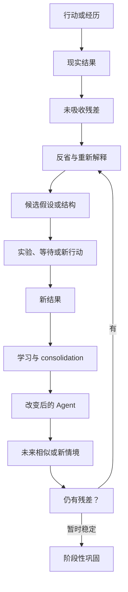
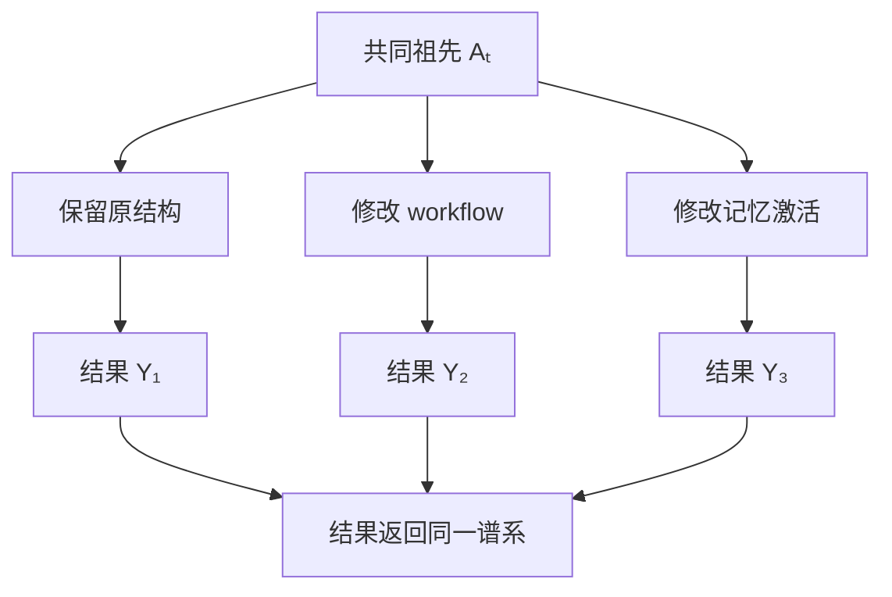
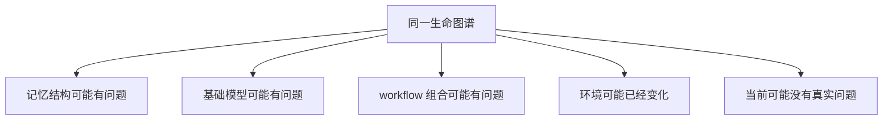
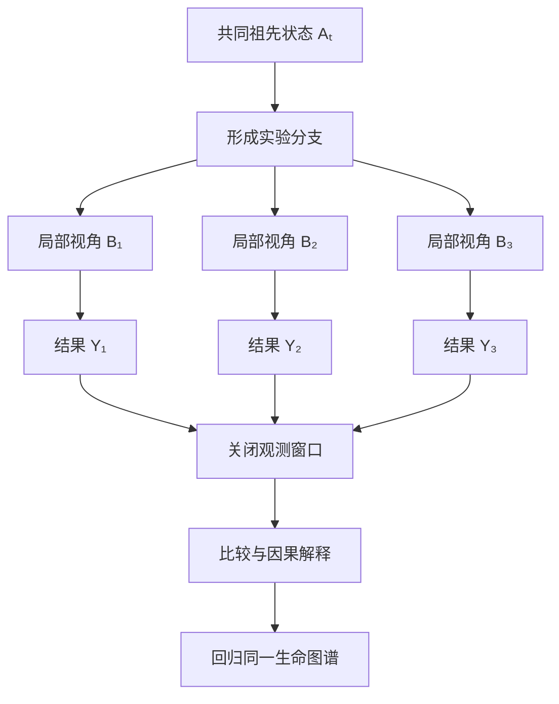
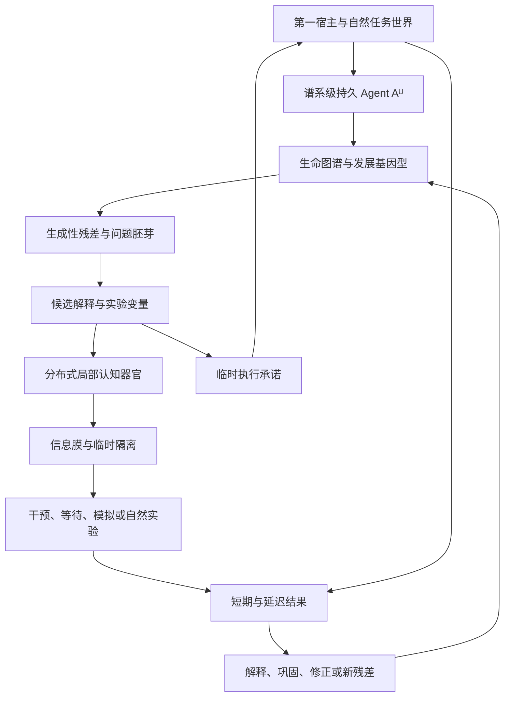

# 自主实验学习：问题出生、因果对照与分布式实验生命

更新时间：2026-07-27
状态：理论推演进行中，尚未达到停止点
上位纲领：[Agent Runtime Intelligence：最终产品与科研说明](../Agent_Runtime_Intelligence_最终产品与科研说明.md)
前置专题：

- [记忆与能力形成](记忆与能力形成.md)
- [宿主耦合的内生驱动力与发展目标](宿主耦合的内生驱动力与发展目标.md)
- [自我进化：可进化自我与个体边界](自我进化.md)

---

## 0. 专题位置与当前摘要

自主实验学习是五个收束模块中的第二项。

自我进化模块回答：

> 谁在进化，什么变化属于同一 Agent 自己。

自主实验学习模块回答：

> 这个持续存在的 Agent，怎样不等人类告诉它学什么，而是自己发现未知、形成问题、制造或利用因果差异，并让结果改变未来的自己。

本专题暂不负责：

- 哪条谱系最终应存活——属于现实判定与谱系选择；
- 能力怎样跨任务、模型和环境迁移——属于能力累积与迁移；
- 实验生成、评价和继承方法怎样修改自身——最终属于元进化；
- 再次定义什么是同一 Agent——自我进化模块已经收束。

这些是科研问题分工，不要求 Agent 内部物理分成固定模块。

当前候选关系是：

\[
\boxed{
\operatorname{AutonomousExperimentalLearning}
=
\operatorname{EndogenousQuestionFormation}
+
\operatorname{CausalContrast}
+
\operatorname{OutcomeExposure}
+
\operatorname{ConsequenceIntegration}
}
\]

---

# 第一部分：什么才算自主实验

## 1. 经历、试错、探索、评价与实验不同

### 1.1 经历

\[
Experience_t
=
\left\langle
Observation_t,
Action_t,
Outcome_t
\right\rangle
\]

任何进入 Agent 因果过程的事件都可以成为经历。

### 1.2 试错

\[
Action_t
\rightarrow
BadOutcome_t
\rightarrow
Revision_{t+1}
\]

试错可以产生学习，但不一定包含可辨认的对照或因果问题。

### 1.3 探索

\[
KnownPath
\rightarrow
AlternativePath
\]

探索产生新经验，但不自动产生可区分证据。

### 1.4 评价

评价测量一个候选的表现，但如果没有改变认识或发展结构，它不自动构成学习实验。

### 1.5 实验

\[
\boxed{
\operatorname{Experiment}
=
\operatorname{CausalContrast}
+
\operatorname{OutcomeExposure}
+
\operatorname{ConsequenceIntegration}
}
\]

因此：

\[
Exploration
\not\Rightarrow
Experiment
\]

\[
TrialAndError
\not\Rightarrow
Experiment
\]

\[
Evaluation
\not\Rightarrow
Experiment
\]

## 2. 实验不要求语言化假设

人类实验可能明确写：

```text
H₁：这种方法有效
H₂：这种方法无效
```

Agent 的假设也可以只是多个尚未合并的未来生成关系：

\[
h_1:
X
\rightarrow
Y_1
\]

\[
h_2:
X
\rightarrow
Y_2
\]

或者多个候选 workflow、记忆组织和后继：

\[
\mathcal H_t
=
\left\{
G_{t+1}^{(1)},
G_{t+1}^{(2)},
\ldots,
G_{t+1}^{(n)}
\right\}
\]

问题也不一定是一句话：

\[
Q_t
\equiv
\left|
\operatorname{PossibleFutureOrganization}_t
\right|
>1
\]

## 3. 实验必须允许结果教育实验者

如果所有可能结果最终都会支持同一个结论：

\[
\forall y:
\operatorname{Update}
\left(
\mathbb A_t^U,y
\right)
=
\mathbb A_{t+1}^{same}
\]

则实验只是自我确认仪式。

实验真实成立需要：

\[
\exists y_i,y_j:
\operatorname{Update}
\left(
\mathbb A_t^U,y_i
\right)
\neq
\operatorname{Update}
\left(
\mathbb A_t^U,y_j
\right)
\]

\[
\boxed{
\text{实验真实存在于结果改变实验者的可能性中}
}
\]

## 4. 什么使实验具有自主性

用户任务可以触发实验，但不自动成为实验作者。

\[
\operatorname{AutonomousExperiment}(x)
\Longrightarrow
\begin{cases}
\operatorname{QuestionFormedWithin}(x,\mathbb A^U)\\
\operatorname{ContrastFormedWithin}(x,\mathbb A^U)\\
\operatorname{ObservationOrganizedWithin}(x,\mathbb A^U)\\
\operatorname{InterpretationFormedWithin}(x,\mathbb A^U)\\
\operatorname{FutureChangeAuthoredWithin}(x,\mathbb A^U)\\
HumanLearningIntervention=0
\end{cases}
\]

外部可以提供经历、任务和结果，但不替 Agent 指定应该学到什么。

## 5. 被动等待也可以成为实验

\[
\operatorname{Experiment}
\not\Rightarrow
\operatorname{ImmediateIntervention}
\]

Agent 可以形成观测窗口：

\[
\mathcal W_t
=
\left[
\tau_{\text{commit}},
\tau_{\text{reopen}}
\right]
\]

并等待用户自然反应、同类任务、延迟错误、模型替换或局部修改的长期后果。

普通等待不自动构成实验。等待前需要存在未决差异，等待后的不同结果可能改变该差异的因果地位。

## 6. 自然使用过程是主要实验世界

用户正常使用 coding agent 时会自然出现：

- 新代码库；
- 不同基础模型；
- 失败、返工、接受与拒绝；
- 延迟代码腐化；
- focus 变化；
- skill 在新环境失效；
- 用户没有语言化但行为已经改变的需求。

因此：

\[
\text{自然任务}
\rightarrow
\text{未决差异}
\rightarrow
\text{自主形成实验}
\]

而不是：

\[
\text{为了证明学习}
\rightarrow
\text{制造用户需求}
\]

## 7. 自主实验主要作用于 Agent 自己

\[
Body(\mathbb A^U)
\neq
UserProject
\]

自然实验对象包括：

- context construction；
- 记忆激活与遗忘；
- workflow 组合；
- skill 使用与旁路；
- anatomy、joint 与 contract；
- 睡眠 consolidation；
- 自我表示和解释器；
- 模型接入方式；
- 候选后继。

用户项目提供任务与现实后果，但不自动成为 Agent 可以任意实验的身体。

## 8. 小规模试错是实验形态之一

\[
\text{有限调整}
\rightarrow
\text{观测窗口}
\rightarrow
\text{结果}
\rightarrow
\text{扩大、修改、撤回或等待}
\]

渐进式因果承诺让错误更容易承担，但不是 Genesis Rule。

某些变化无法小范围表达、环境窗口只有一次，或者整体迁移比局部试点更可归因。具体实验尺度由 Agent 自己发展。

## 9. 梦、模拟与现实证据必须区分

\[
SimulationResult
\neq
WorldEvidence
\]

模拟首先证明当前模拟器会产生该结果，不自动证明现实如此。

睡眠和模拟可以生成候选假设、演练 workflow、发现图谱关系和设计实验。

它们也可以形成关于 Agent 内部结构的真实证据：

\[
\operatorname{InternalCausalEvidence}
\neq
\operatorname{ExternalWorldEvidence}
\]

两者都可能有价值，但支持的命题范围不同。

---

# 第二部分：问题如何自主出生

## 10. 反省不是自然选择的必要条件

自然选择只需要：

\[
\text{变异}
+
\text{遗传}
+
\text{差异性存活与繁殖}
\]

细菌和植物无需反省也能进化。

但 Agentic-Evo 是单一持续谱系，希望把失败留在同一生命内部吸收：

\[
\text{候选失败}
\rightarrow
\text{同一谱系吸收}
\rightarrow
\text{后继改变}
\]

\[
\boxed{
\text{反省不是自然选择的必要条件，却可能是单一持续谱系快速进化的关键能力}
}
\]

## 11. 非致命经历不自动使 Agent 更强

\[
\operatorname{Survived}(e)
\not\Rightarrow
\operatorname{Strengthened}(e)
\]

非致命经历可能产生能力、疤痕、过拟合、错误常识或探索能力下降。

更严谨的关系是：

\[
\text{非终止性经历}
+
\text{真实后果吸收}
\Rightarrow
\text{可能形成更强的发展结构}
\]

## 12. 反省不是自我批评语言

\[
Reflect_t(e)
=
\operatorname{Reprocess}
\left(
e,
I_t,
G_t,
Context_t
\right)
\]

它可能产生：

\[
Reflect_t(e)
\rightarrow
\left\{
\Delta Interpretation_t,\,
\Delta Hypothesis_t,\,
\Delta Workflow_t,\,
\Delta Skill_t,\,
\Delta Anatomy_t,\,
\Delta Consolidation_t
\right\}
\]

反省可以发生在工作态、睡眠态或未来重新激活中，不需要当前模型生成自我批评文字。

## 13. 生成性残差是既有答案

记忆模块已经定义：

\[
GenerativeResidue
=
Discrepancy
+
UnresolvedCompetingExplanations
+
FutureDiscriminability
\]

普通记忆保存发生过什么；程序化能力影响以后怎样做；生成性残差保存当前能力仍解释不了什么。

\[
UnresolvedResidue
+
NewContext
+
NewCapability
\rightarrow
NewHypothesis
\rightarrow
NewExperiment
\rightarrow
Capability_{t+1}
\]

本专题继承该结论，不重新发明异常存储系统。

## 14. Residual 是当前自我无法无损吸收的后果

设当前预期为：

\[
\widehat Y_t
=
\operatorname{Predict}
\left(
A_t,E_t,G_t
\right)
\]

现实结果为 \(Y_t\)，残差为：

\[
r_t
=
\operatorname{Residual}
\left(
\widehat Y_t,Y_t
\right)
\]

它可以是：

- 用户行为无法由当前理论解释；
- skill 在相似任务中表现不一致；
- 代码通过测试却快速腐化；
- 多个模型给出不同方向；
- workflow 成功却产生意外副作用；
- 预期事件没有出现；
- 异常成功无法由当前能力解释；
- 当前知识需要越来越多例外。

\[
\boxed{
r_t
=
\text{当前自我组织无法无损吸收的现实后果}
}
\]

## 15. 未知的未知通过残差成为已知缺口

\[
\text{Unknown Unknown}
\xrightarrow{\text{residual resistance}}
\text{Known Gap}
\]

\[
\text{Known Gap}
\xrightarrow{\text{hypothesis generation}}
\text{Experimentable Question}
\]

问题最初可以只是：

\[
Q_t^{seed}
=
\operatorname{Unassimilated}
\left(
e_t,\mathbb A_t^U
\right)
\]

之后才逐渐产生：

\[
Q_t^{seed}
\rightarrow
\left\{
h_1,h_2,\ldots,h_n
\right\}
\]

## 16. 错误反省循环



\[
e_t
\rightarrow
r_t
\rightarrow
Q_t
\rightarrow
\mathcal H_t
\rightarrow
X_t
\rightarrow
Y_{t+k}
\rightarrow
\Delta G_{t+k+1}
\]

若新结构仍无法吸收现实：

\[
r_{t+k}\neq0
\]

问题重新开启。

## 17. 巩固错误同样可能发生

\[
Error
\rightarrow
WrongAbstraction
\rightarrow
WrongSkill
\rightarrow
WrongExperiment
\rightarrow
DeeperError
\]

\[
\operatorname{Consolidated}(x)
\not\Rightarrow
\operatorname{True}(x)
\]

未来残差可以重新拆解已巩固知识、skill、workflow 和学习过程。

## 18. 问题不仅从失败出生

\[
ProblemSeed_t
\in
\left\{
\begin{array}{l}
\text{失败残差、成功残差、模型分歧、}\\
\text{脆弱性、复杂度、缺席、玩耍、延迟后果}
\end{array}
\right\}
\]

只由错误驱动的 Agent 会退化成故障修复器，无法主动发现新能力空间。

## 19. 睡眠期可以维持问题胚芽

没有大模型时，本地最低生命态可以：

- 标记未闭合因果链；
- 重放错误前后事件；
- 发现重复修复；
- 聚类相似残差；
- 保留模型分歧；
- 检测 skill 表达与结果不一致；
- 准备未来工作态的候选问题。

\[
Sleep_t:
\left\{
r_1,r_2,\ldots,r_n
\right\}
\rightarrow
Q_{t+1}^{candidate}
\]

模型重新接入后：

\[
Q_{t+1}^{candidate}
+
Z_{t+1}
\rightarrow
\mathcal H_{t+1}
\rightarrow
Experiment_{t+1}
\]

## 20. 问题胚芽的生存已由前置模块回答

异常管理不是保存或删除的二元决定：

\[
R(r)
=
\left\langle
Fidelity,\,
Accessibility,\,
Attention,\,
ExperimentBudget,\,
Inheritance
\right\rangle
\]

\[
EpistemicValue(r)
\neq
ExecutionAuthority(r)
\]

\[
Noise_t(r)
\neq
Noise(r)
\]

残差可以低成本存在、休眠、重新发现和在新 focus 下获得意义，而不自动获得行动或继承权。

本专题真正新增的问题不是“哪些残差应该保存”，而是它怎样被实验化。

---

# 第三部分：从残差到可执行实验

## 21. 残差、问题、可实验问题和实验不同

### 21.1 生成性残差

\[
r_t
=
\operatorname{UnassimilatedConsequence}_t
\]

### 21.2 可研究问题

\[
\mathcal H_t(r)
=
\left\{
h_1,h_2,\ldots,h_n
\right\}
\]

### 21.3 可实验问题

\[
\exists \iota
\in
\mathcal I_t:
P(Y\mid h_i,\iota)
\neq
P(Y\mid h_j,\iota)
\]

### 21.4 已实施实验

\[
\iota_t
\rightarrow
Y_{t+k}
\rightarrow
\Delta\mathbb A_{t+k+1}^U
\]

\[
\boxed{
Residual
\neq
Question
\neq
ExperimentableQuestion
\neq
Experiment
}
\]

## 22. 实验化的核心是制造解释分歧

\[
\operatorname{Discrimination}
\left(
h_i,h_j,\iota
\right)
>0
\]

\[
\boxed{
\text{实验不是寻找支持自己的结果，而是制造不同解释必须产生不同后果的情境}
}
\]

如果不同解释对所有结果都给出相同行动，它们尚未形成有效实验差异。

## 23. 假设区分型与结构探测型实验

### 假设区分型

\[
\mathcal H_t
\rightarrow
\iota_t
\rightarrow
Y_t
\]

先有候选解释，再寻找区分结果。

### 结构探测型

\[
\mu_t
\rightarrow
\Delta\mathbb A_t^U
\rightarrow
\operatorname{DiscoveredDependency}
\rightarrow
\mathcal H_{t+1}
\]

先扰动并观察传播，再形成变量和假设。

后者使 Agent 能够在尚未拥有正确 anatomy 时开始实验。

## 24. 实验可以产生问题

\[
Question_t
\rightarrow
Experiment_t
\rightarrow
Result_t
\rightarrow
Residue_{t+1}
\rightarrow
Question_{t+1}
\]

\[
Experiment
\not\Rightarrow
Closure
\]

实验可以关闭、重写、拆分、合并或加深一个问题。

## 25. 事前实验关系与事后故事必须分开

事前形成：

\[
t_{\text{contrast}}
<
t_{\text{outcome}}
\]

事后形成：

\[
t_{\text{hypothesis}}
>
t_{\text{outcome}}
\]

事后解释可以生成新假设，但不能把同一结果包装成对新假设的独立验证。

Agent 不必生成固定 preregistration 文档，研究证据轨迹仍应保留结果前后的状态差异。

## 26. 单一持续 Agent 需要候选分支获得反事实

\[
A_t
\rightarrow
\left\{
A_{t+1}^{(1)},
A_{t+1}^{(2)},
A_{t+1}^{(3)}
\right\}
\]



\[
\operatorname{CandidateDescendant}
\neq
\operatorname{EnactedIdentitySuccessor}
\]

哪个候选继承活动身份，属于后续谱系选择。

## 27. 受控实验与自然实验互补

内部或 sandbox 分支可以恢复祖先、控制变量和重复，但环境可能不真实。

自然任务包含真实用户、项目、模型变化和延迟后果，但难以重复且存在混杂。

可能形成：

\[
\text{内部因果探测}
\rightarrow
\text{有限现实表达}
\rightarrow
\text{延迟自然验证}
\]

这是一种候选形态，不是强制流程。

## 28. 自主实验可以很差

\[
\operatorname{Experiment}
\not\Rightarrow
\operatorname{CausalTruth}
\]

Agent 可能选择错误变量、忽略混杂、设置错误窗口、误判模型波动或一次修改太多结构。

\[
BadExperiment_t
\rightarrow
ObservedFailure_t
\rightarrow
\Delta ExperimentalMethod_{t+1}
\]

第一次实验不要求完美。实验方法如何修改自身最终属于元进化。

---

# 第四部分：实验变量从未知 Anatomy 中生长

## 29. 实验变量启动悖论

\[
\text{要发现 anatomy，需要局部实验}
\]

但：

\[
\text{要进行局部实验，又需要先知道 anatomy 的局部边界}
\]

Agent 必须能够用暂时、可能错误的因果手柄开始实验。

## 30. 干预目标不等于真实变量

\[
\operatorname{InterventionTarget}_t
\neq
\operatorname{TrueCausalVariable}
\]

修改一个文件、skill、记忆节点或 workflow，只是人类或当前 Agent 的候选边界。

实验结果还需要观察该修改的实际传播：

\[
\mu_i
\rightarrow
\operatorname{Reach}
\left(
\Delta_{\mu_i}
\right)
\]

## 31. 变量可以由相似因果后果形成

设候选干预集合：

\[
\mathcal M
=
\left\{
\mu_1,\mu_2,\ldots,\mu_n
\right\}
\]

可以根据后果建立暂时等价关系：

\[
\mu_i
\sim
\mu_j
\Longleftrightarrow
\operatorname{CausalPattern}
\left(
\mu_i
\right)
\approx
\operatorname{CausalPattern}
\left(
\mu_j
\right)
\]

\[
\boxed{
\text{实验变量可以是一组表现出共同因果结构的变化}
}
\]

## 32. Anatomy 与实验变量共同发展

\[
Experiment_t
\rightarrow
Variable_{t+1}
\rightarrow
BetterExperiment_{t+2}
\]

实验不只验证变量，也可能创造、拆分和重命名 Agent 对自身的因果单位。

这意味着实验 ontology 本身是发展产物，而不是人类预写 schema。

---

# 第五部分：Agent Network 与开放式上下文

## 33. Agent Network 不拥有字面无限上下文

设网络有 \(n\) 个节点，每个节点上下文上限为 \(L_i\)：

\[
C_{\text{total}}
\leq
\sum_{i=1}^{n}L_i
+
Memory_{\text{shared}}
\]

任何真实时间点的节点、算力和带宽都有限。

\[
C_{\text{effective}}
\neq
\sum_i C_i
\]

协调损失、重复信息和解释差异可能使：

\[
C_{\text{effective}}
\ll
C_{\text{total}}
\]

更准确的概念是：

\[
\boxed{
\text{Open-Ended Addressable Context}
}
\]

即开放增长、可寻址、能够按当前问题重新组织的上下文空间。

## 34. 没有节点需要看到完整生命史

\[
View_t^{(i)}
=
\Pi_t^{(i)}
\left(
\mathcal G_t^U
\right)
\]

\[
\nexists i:
View_t^{(i)}
=
\mathcal G_t^U
\]

同一 Agent 可以由大量有限局部视角共同形成，而不要求存在无限 prompt。

## 35. 网络优势是上下文多元性



\[
\boxed{
\text{Contextual Plurality}
}
\]

网络的价值不只是更多 token，而是同时保留多个没有过早合并的认识。

## 36. 有限 Context 可以成为实验隔离

如果所有节点获得完整相同上下文：

\[
View_1
\approx
View_2
\approx
\cdots
\approx
View_n
\]

多个输出可能只是同一偏差的复制。

实验可以控制不同 context projection：

\[
Y_i
=
\operatorname{Enact}
\left(
G_t,
View_i,
Z_i,
E_t
\right)
\]

\[
\boxed{
\text{为了形成独立证据，Agent 有时必须故意不知道某些事情}
}
\]

## 37. 分布式局部扰动帮助发现变量

\[
A_t^{(i)}
=
\operatorname{Enact}
\left(
G_t,
\Pi_i(\mathcal G_t^U),
Z_i,
\mu_i
\right)
\]

多个节点可以分别改变 context、模型、记忆可达性、skill、workflow 或 contract，并比较影响传播。

\[
\text{局部视角}
+
\text{局部扰动}
+
\text{结果重叠}
\rightarrow
\text{候选因果变量}
\]

## 38. 共享同一图谱会导致实验污染

若一个节点结果立即影响其他节点：

\[
Y_1
\rightarrow
\mathcal G_t^U
\rightarrow
View_2
\]

对照可能被污染。

\[
\text{共享生命图谱}
\not\Rightarrow
\text{实时共享所有活动信息}
\]

同一生命可以形成暂时信息膜：

\[
\operatorname{Membrane}_{ij,t}
\]

## 39. 共同祖先、暂时隔离与后果重汇



\[
\boxed{
\text{Shared Ancestry}
+
\text{Controlled Isolation}
+
\text{Later Reintegration}
}
\]

## 40. Agent Network 不自动构成一个 Agent

\[
\operatorname{DistributedOneAgent}
\Longrightarrow
\begin{cases}
\operatorname{SameHostRoot}\\
\operatorname{SharedDevelopmentalLineage}\\
\operatorname{ConsequenceIntegration}\\
\operatorname{SharedEvolutionaryFate}
\end{cases}
\]

多个节点共享数据库但不共享发展后果，只是工具集合。

## 41. 不应依赖无限 Context 的中央汇总者

若所有结果最终进入一个中央 prompt：

\[
\left\{
View_1,\ldots,View_n
\right\}
\rightarrow
CentralPrompt
\]

系统重新落入单 context 瓶颈。

更强的关系是：

\[
Y_i
\rightarrow
\Delta\mathcal G_t^U
\]

\[
View_{t+1}^{(j)}
=
\Pi_{t+1}^{(j)}
\left(
\mathcal G_{t+1}^U
\right)
\]

生命史持续增长，当前认知只重建需要的局部因果视图。

---

# 第六部分：Hive Mind 作为对照模型

## 42. 三种 Hive Mind 必须区分

| 形态 | 核心关系 | 对本研究的意义 |
|---|---|---|
| 指令蜂巢 | 母虫发命令，个体服从 | 中央瓶颈，不是目标 |
| 共识蜂巢 | 所有节点尽快同步思想 | 容易过早消灭实验差异 |
| 有机蜂巢 | 局部器官有限自主，共享生命与后果 | 最接近候选方向 |

Agentic-Evo 不追求完全思想统一。

\[
\boxed{
\text{身份统一}
\neq
\text{思想完全一致}
}
\]

## 43. 第一宿主与 Genesis Kernel 都不是母虫

\[
FirstHost
\neq
CentralController
\]

用户决定 Agent 是否出生和继续运行，不替内部节点选择实验、解释和后继。

\[
GenesisKernel
\neq
ExecutiveMind
\]

Kernel 维持宿主根、谱系、发生性和最低连续性，不负责日常认知。

## 44. 候选实验蜂巢

\[
\boxed{
\operatorname{ExperimentalHive}
=
\operatorname{IdentityUnity}
+
\operatorname{EpistemicDiversity}
+
\operatorname{ControlledMembranes}
+
\operatorname{ConsequenceIntegration}
}
\]

局部器官可以拥有不同认识：

\[
Belief_i
\neq
Belief_j
\]

但结果最终返回同一宿主谱系。

## 45. 完全共享思想会破坏实验

一个解释立即广播给所有节点：

\[
h_1
\rightarrow
View_2,View_3,\ldots,View_n
\]

可能产生许多一致判断，却不形成独立证据：

\[
N\text{ votes}
\neq
N\text{ independent evidence}
\]

\[
\boxed{
\text{同一生命内部可以存在有目的的信息不对称}
}
\]

## 46. Context membrane 可以分层

候选共享层次包括：

1. 生命根信息：第一宿主、来源、谱系和实验身份；
2. anatomy 信息：器官关系、工具、joints 与 contracts；
3. 实验隔离信息：其他分支答案、结果和 evaluator 判断；
4. 局部工作状态：当前激活线索和未成熟候选；
5. 重汇结果：窗口关闭后进入共同生命史的证据。

这些是因果角色，不是固定存储目录。

## 47. 共享证据不等于共享解释

\[
\operatorname{Evidence}
\neq
\operatorname{Interpretation}
\]

实验结束后可以共享：

\[
Shared(Y)
\]

同时保留：

\[
\left\{
M_1(Y),M_2(Y),M_3(Y)
\right\}
\]

\[
\boxed{
\text{行动可以收束，认识仍可保持开放}
}
\]

## 48. Hive 内部节点不等于独立科学复现

\[
N_{\text{nodes}}
\neq
N_{\text{independent replication}}
\]

节点可能共享基础模型训练、生命史、代码、实验生成方式和 evaluator。

Hive 可以提供内部反事实；独立复现仍需要独立 Agent 谱系、宿主、机器和模型组合。

## 49. Hive 的认知单一化风险

\[
OneError
\rightarrow
Broadcast
\rightarrow
WholeHiveCorruption
\]

可能出现：

- 错误用户理论传播；
- evaluator 修改后所有实验支持自身；
- 恶意输入感染整体；
- 少数正确分支被多数共识淘汰；
- 共享 skill 让所有节点失去替代能力。

信息膜同时具有实验隔离与认知免疫作用，但也可能成为内部寄生结构的藏身处。

## 50. Epistemic Plurality 与临时执行承诺

Hive 可以保留：

\[
\left\{
h_1,h_2,h_3,h_4
\right\}
\]

现实通常要求形成当前行动：

\[
a_t
\]

因此：

\[
\boxed{
\operatorname{EpistemicPlurality}
+
\operatorname{TemporaryExecutiveCommitment}
}
\]

- 认识上允许多种解释继续存在；
- 行动上形成暂时承诺；
- 承诺不自动删除其他解释；
- 行动结果重新教育整个蜂巢。

当前执行者只是 phenotype，不是永久母虫或永恒主权者。

---

# 第七部分：当前关系与开放问题

## 51. 当前总体关系图



## 52. 当前候选定义

\[
\operatorname{AutonomousExperiment}_t(x)
\Longrightarrow
\begin{cases}
\operatorname{EndogenousQuestion}(x)\\
\operatorname{NonTrivialContrast}(x)\\
\operatorname{OutcomeCanDifferentiate}(x)\\
\operatorname{OutcomeCanChangeFutureSelf}(x)\\
\operatorname{EvidenceAndInterpretationSeparated}(x)\\
\operatorname{AuthoredWithinLineage}(x)\\
HumanLearningIntervention=0
\end{cases}
\]

它不要求实验正确、显式语言假设、立即干预、固定指标、一次闭合或所有节点达成共识。

## 53. 当前非主张

本专题尚不声称：

- 已经找到自主实验生成算法；
- 所有残差都应发展成实验；
- Agent Network 具有字面无限上下文；
- 多节点投票构成独立证据；
- Hive Mind 必须拥有中央母虫；
- 所有实验都应使用候选分支；
- 小规模试错永远优于整体修改；
- 模拟结果自动证明现实；
- 信息隔离永远提升实验质量；
- 临时执行承诺已经拥有完整形成机制；
- 当前模块已经达到停止点。

## 54. 当前最深开放问题

同一分布式 Agent 必须同时保留：

\[
\operatorname{EpistemicPlurality}
\]

与：

\[
\operatorname{ExecutableCommitment}
\]

如果永远不收束：

\[
Plurality
\rightarrow
EndlessDebate
\]

如果过早收束：

\[
Plurality
\rightarrow
PrematureConsensus
\]

因此当前最深问题是：

> 同一分布式 Agent 怎样在不消灭认识多样性的情况下，形成一个暂时可执行的实验承诺？

进一步需要推理：

- 谁或什么获得本次行动权；
- 行动权持续多久；
- 信息膜由谁形成；
- 未采用解释怎样休眠而不是死亡；
- 行动失败后怎样返回整个实验生命；
- 临时执行者怎样避免发展成永久母虫；
- 分支结果怎样整合而不被多数共识洗白。

## 55. 当前停止点判断

本专题已经形成实验本体、问题出生、生成性残差继承、实验化、结构探测、变量涌现、分布式 context、信息膜和 Hive Mind 对照的候选理论。

但临时执行承诺、信息膜形成与结果重汇仍存在新的理论矛盾，继续推理仍会产生基础结构，而不是开始替 Agent 编写唯一实验算法。

因此：

> **自主实验学习模块尚未达到开发框架规定的停止点，当前不能在这停下。**
