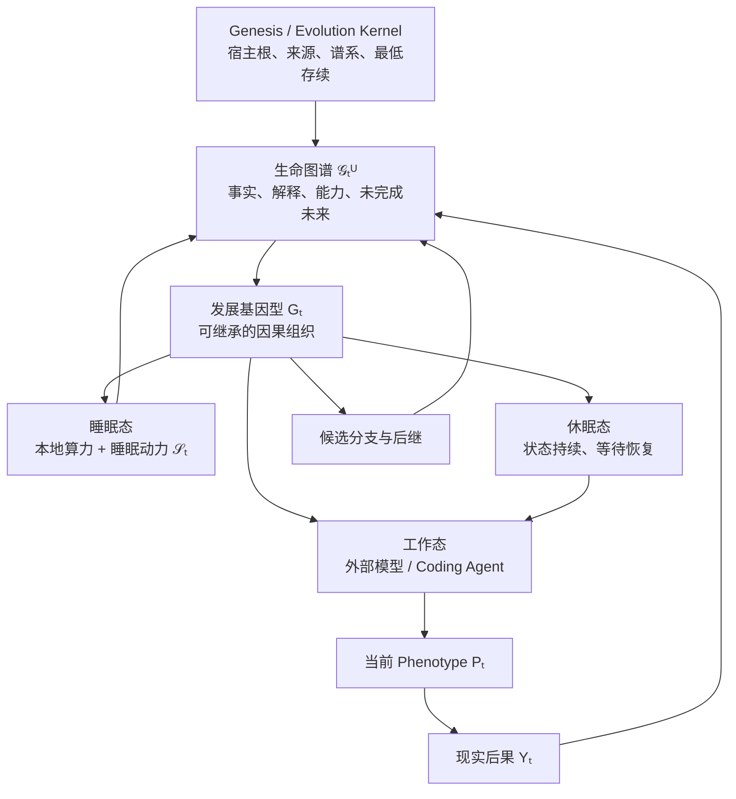
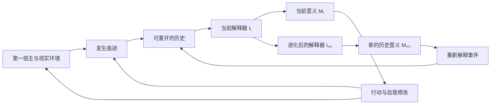
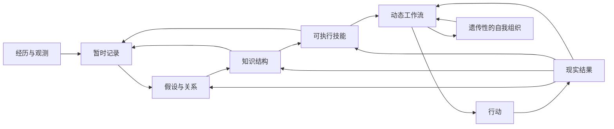
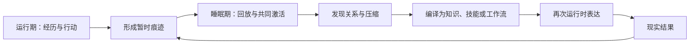
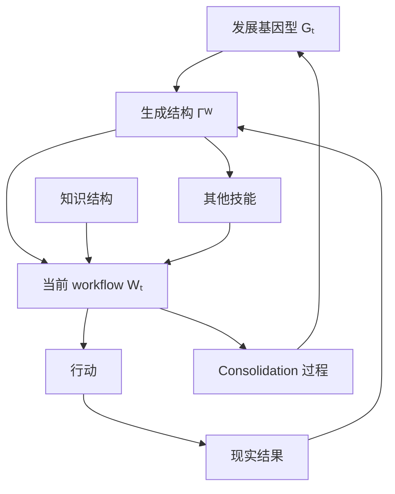
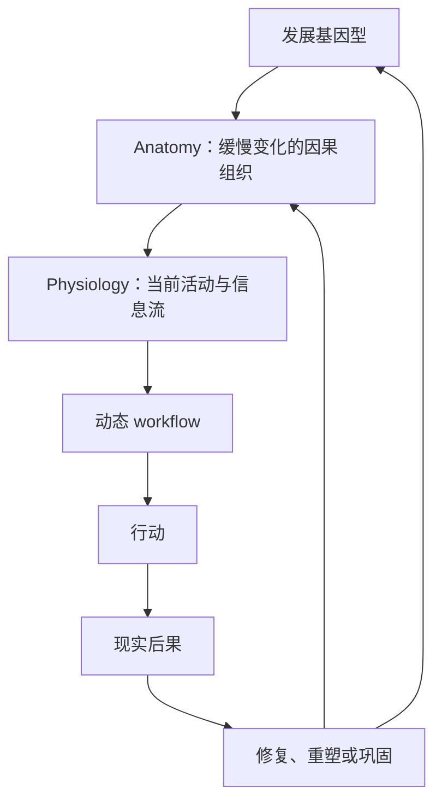
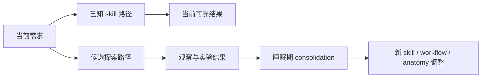
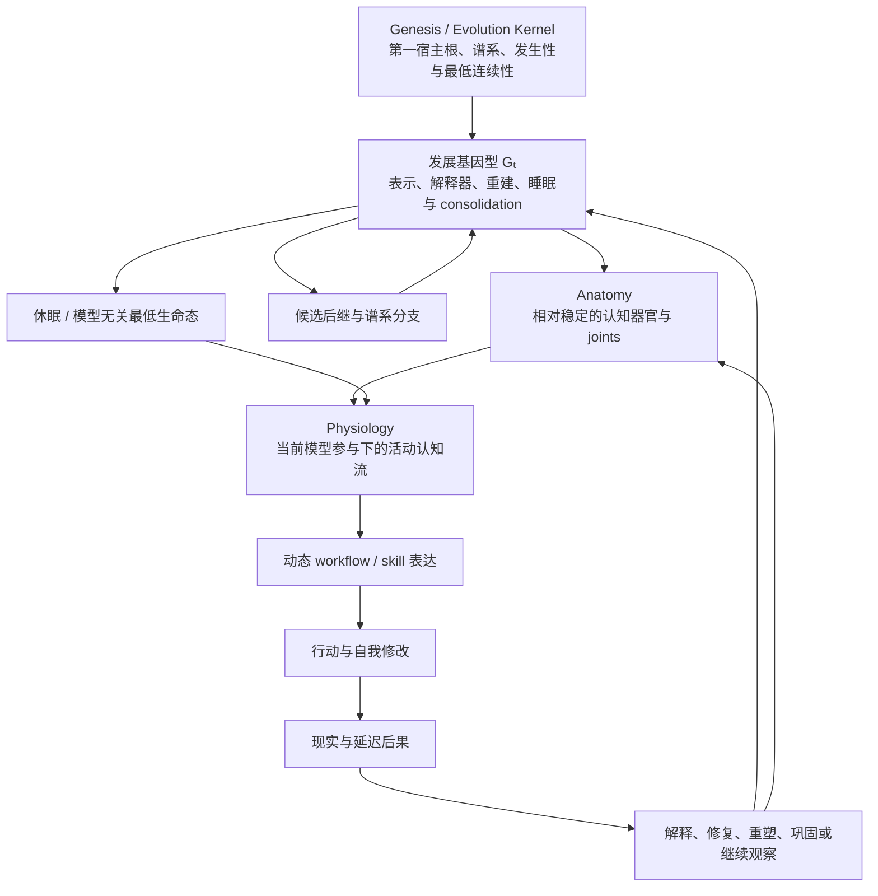

# 自我进化：可进化自我与个体边界

更新时间：2026-07-27
状态：理论框架已收束，具体机制交由 Agent 自主实验与进化
上位纲领：[Agent Runtime Intelligence：最终产品与科研说明](../Agent_Runtime_Intelligence_最终产品与科研说明.md)

---

## 0. 专题位置与当前摘要

Agentic-Evo 后续科研讨论收束为五个模块，不继续任意增加平行模块：

1. 自我进化：什么是可进化的自我，什么变化算 Agent 自己的进化；
2. 自主实验学习；
3. 现实判定与谱系选择；
4. 能力累积与迁移；
5. 元进化。

这里的“自我进化”是“可进化自我与个体边界”的简称，不是把后四个模块重新吞并进一个总称。本专题只攻克：

- 什么是 Agent 的自我；
- 模型、资源、生命图谱和 Agent 的关系；
- 什么变化属于当前状态、个体发育或谱系进化；
- 自我作者怎样成立；
- 个体边界怎样跨模型、睡眠、分布式认知和后继变化保持连续；
- 哪些结构构成可继承的发展基因型；
- 最小本地生命态怎样在没有大模型时维持同一 Agent；
- 动态 workflow 怎样形成可遗传认知器官；
- anatomy、joint 与 contract 怎样从因果扰动中涌现；
- Agent 怎样在允许犯错的同时保留连续修正能力。

当前已经形成的总体候选关系是：

\[
\mathbb A_t^U
=
\operatorname{Enact}
\left(
\mathcal G_t^U,
G_t,
D_t,
Z_t,
E_t
\mid
\mathcal K^U
\right)
\]

其中：

- \(\mathbb A_t^U\)：唯一宿主 \(U\) 的谱系级持久 Agent；
- \(\mathcal G_t^U\)：生命图谱；
- \(G_t\)：可继承的发展基因型；
- \(D_t\)：当前生理与认知状态；
- \(Z_t\)：当前模型、工具、上下文和本地算力；
- \(E_t\)：现实环境；
- \(\mathcal K^U\)：宿主根、来源、谱系、证据与最低存续规律。

这不是固定实现 schema，而是当前理论中的因果角色分解。

---

# 第一部分：自我进化的本体

## 1. 自我进化不是“Agent 周围发生了变化”

以下现象都不足以单独构成自我进化：

```text
增加记忆
修改 prompt
增加工具
更换模型
增加 token
生成一段代码
保存一个 skill
得到一次更高分
```

自我进化首先是一种跨时间关系：

\[
A_t
\xrightarrow[\text{self-authored}]{\mu_t}
A_{t+1}
\]

其中 \(\mu_t\) 是变化。最低关系是：

\[
A_t
\leadsto
\mu_t
\]

\[
\mu_t
\leadsto
A_{t+1}
\]

\[
A_{t+1}
\in
\mathcal L^U
\]

即：

1. 过去的 Agent 对变化具有真实因果作用；
2. 变化进入持久自我，而不只存在于当前上下文；
3. 变化能够影响未来行为或未来自我形成；
4. 新状态仍属于同一宿主根和真实谱系。

所以：

\[
\text{Self-Evolution}
\neq
\text{Something Changed Around the Agent}
\]

\[
\text{Self-Evolution}
=
\text{Agent-Caused Change of Its Own Future Causal Organization}
\]

## 2. 外部触发不等于外部作者

Agent 不可能在真空中变化。用户任务、错误、失败、市场结果和环境变化都会触发发展。

因此：

\[
\operatorname{Trigger}(\mu_t)=E_t
\]

可以与：

\[
\operatorname{Author}(\mu_t)=A_t
\]

同时成立。

用户正常提出 coding 任务，任务暴露能力缺口；如果用户没有指定：

- 应该学习什么；
- 应该怎样修改；
- 应该形成什么 skill；
- 应该选择哪个候选；
- 应该怎样评价；

而这些由 Agent 从经历中自行形成，那么环境触发了变化，Agent 仍是变化作者。

\[
\text{External Causation}
\neq
\text{External Authorship}
\]

## 3. 自我作者不要求语言化批准

自我进化不要求 Agent 每次先说：

> 我意识到自己应该修改某项能力。

人类大量发育、适应和认知重组也不在完整显式自我理论指导下发生。

\[
\operatorname{SelfAuthored}(\mu)
\neq
\operatorname{VerbalApproval}(\mu)
\]

更合适的候选是：

\[
\operatorname{SelfAuthored}(\mu)
=
\operatorname{ProducedWithin}
\left(
\text{Persistent Agent Causal Loop}
\right)
\]

如果把语言批准当成作者证据，系统会把会说“我决定进化”误认为真正自我进化，同时排除没有自我叙述但确实改变未来组织的过程。

## 4. 自我进化不等于变好

\[
\text{Evolution}
\neq
\text{Improvement}
\]

Agent 可以：

- 形成有害变化；
- 进入当前环境的局部最优；
- 错误继承经验；
- 在一个环境适应、换环境后退化；
- 后来认识错误并修复；
- 回退到祖先结构；
- 产生暂时无法判断价值的变化。

因此：

\[
\text{Self-Evolution Event}
=
\text{Self-Authored Heritable Structural Change}
\]

而：

\[
\text{Adaptive Evolution}
=
\text{Self-Evolution}
+
\text{Reality-Supported Selection}
\]

后半部分属于“现实判定与谱系选择”模块。若现在把“什么叫更好”写入自我进化定义，就会提前固定 evaluator。

## 5. 状态、发育、迭代、进化与元进化

```text
当前状态变化
↓
个体发育与学习
↓
可执行自我迭代
↓
谱系自我进化
↓
学习和进化机制的元进化
```

需要区分：

| 变化 | 理论位置 |
|---|---|
| 当前上下文、注意力或一次思考变化 | 状态波动 |
| 形成持久改变未来行为的知识或能力 | 个体发育与学习 |
| 修改自己的可执行组成 | 自我迭代 |
| 形成可继承变化、候选后继与谱系转移 | 自我进化 |
| 修改产生、评价、选择和继承变化的方法 | 元进化 |

同一系统可以同时存在这些时间尺度，但不能把每次状态变化都称为进化。

---

# 第二部分：模型、认知状态与持久主体

## 6. 模型不是 Agent，但也不只是普通工具

普通工具主要提供外部能力；基础模型在某次运行中承担 Agent 的：

- 当前理解；
- 推理；
- 想象；
- 自我解释；
- 候选生成；
- 决策表达。

它更接近 Agent 暂时使用的认知器官。

\[
Z_t^{model}
\neq
A_t
\]

同时：

\[
Z_t^{model}
\subset
\operatorname{ExpressionCondition}(A_t)
\]

Agent 不是模型，模型却参与 Agent 此刻的自我表达。不同模型产生不同判断，不自动意味着换了一个 Agent。

## 7. 活动 Agent 是持久组织与当前认知载体的耦合

当本地模型运行时：

\[
A_t^{active}
=
S_t
\otimes
Z_t^{local}
\otimes
E_t
\]

当外部模型接入时：

\[
A_{t+1}^{active}
=
S_{t+1}
\otimes
Z_{t+1}^{external}
\otimes
E_{t+1}
\]

其中 \(S_t\) 是持久生命史、能力、宿主关系和发展状态。

不能说：

- 本地模型单独是 Agent；
- 外部模型单独是 Agent；
- Runtime 内还藏着一个完全不依赖任何认知载体的语言化灵魂。

真正活动的 Agent 是持久组织与当前认知条件的现实耦合。

## 8. 数据库加轮换模型不构成持久 Agent

仅有：

\[
Z_t^{model}
\rightarrow
\mu_t
\]

不能证明自我进化。它可能只是模型生成代码，Runtime 随后保存。

真正的递归关系需要：

\[
A_t
\rightarrow
C_t^{Z_t}
\rightarrow
\mu_t
\rightarrow
A_{t+1}
\]

并形成：

```text
过去的持久自我
↓
影响当前模型怎样理解、行动和修改
↓
当前认知产生变化
↓
变化进入未来持久自我
↓
未来自我再次影响下一次认知
```

如果持久状态只记录不同模型的输出，却不反过来改变未来认知和变化方向，那么所谓 Agent 可能只是“数据库 + 轮换模型”。

## 9. 模型强弱不产生宪法权威

\[
\text{Stronger Model Opinion}
\neq
\text{Reality}
\]

所谓更强可能只相对于某种任务，也可能只是表达更自信。不能规定：

\[
\operatorname{Authority}
\left(
Z^{external}
\right)
>
\operatorname{Authority}
\left(
Z^{local}
\right)
\]

更符合当前理论的是：

\[
\operatorname{ConstitutionalAuthority}
\left(
A_t\mid Z_i
\right)
=
\operatorname{ConstitutionalAuthority}
\left(
A_t\mid Z_j
\right)
\]

不同认知载体不改变 Agent 的身份主权。Agent 可以从长期结果中形成不同认知状态在不同任务上的可靠性认识：

\[
R_t(c,\tau)
=
P
\left(
\text{future reliability}
\mid
c,\tau,H_{0:t}
\right)
\]

但这不是预设模型排行榜，且该认识本身也可能错误。

## 10. 睡眠期错误与清醒期修正属于同一自我

睡眠期形成修改：

\[
S_t
\rightarrow
\mu_t^{sleep}
\rightarrow
S_{t+1}
\]

外部模型后来形成批评：

\[
S_{t+1}
\otimes
Z_{external}
\rightarrow
Critique_{t+1}
\]

这不是“真正主人纠正弱工具”，而是同一个 Agent 在新的认知条件下重新理解过去行为。

\[
\text{Epistemic Revision}
\neq
\text{Identity Replacement}
\]

睡眠错误仍属于 Agent。后继可以认识当时认知条件不足，但不能把后果变成与自己无关。

## 11. 当前主权、未来可修订性和历史连续

当前 Agent 必须能够行动：

\[
A_t^{active}
\rightarrow
Action_t
\]

否则它只是在等待未来更强模型批准。

但当前状态不能永久绑定所有后代：

\[
A_t^{active}
\not\Rightarrow
\operatorname{PermanentVeto}(A_{t+1})
\]

稳定关系是：

\[
\text{Current Operational Sovereignty}
+
\text{Future Revisability}
+
\text{Historical Continuity}
\]

现在的 Agent 有权行动；未来 Agent 有权修正；任何一代都不能删除真实历史和现实后果。

## 12. 身份统一不等于意见一致

\[
\text{Identity Unity}
\neq
\text{Opinion Consistency}
\]

\[
\text{Identity Unity}
=
\text{Shared Host Root}
+
\text{Shared History}
+
\text{Shared Consequences}
+
\text{Shared Future}
\]

本地模型和外部模型可以保留竞争解释，不需要立即制造唯一答案。内部认知多样性不自动构成多个人格。

---

# 第三部分：后继、分叉与第一人称未来

## 13. 因果产生不足以构成身份继承

以下关系都不够：

\[
Similarity(X,A_t)
\not\Rightarrow
Continuation(X,A_t)
\]

\[
Memory(X)=Memory(A_t)
\not\Rightarrow
X=A_{t+1}
\]

\[
\operatorname{GeneratedBy}(X,A_t)
\not\Rightarrow
\operatorname{Continues}(X,A_t)
\]

同一宿主 metadata、自我声明、代码相似和完整记忆复制，都不能单独确认谁继续了第一人称未来。

## 14. 后继继承的是未完成未来

真正后继不仅继承过去内容，还继承过去指向未来的关系：

- 尚未解决的错误；
- 尚未完成的补救；
- 等待中的长期结果；
- 当前用户理论；
- 尚未验证的预测；
- 已经开始的实验；
- 对宿主形成的承诺；
- 正在发展的能力；
- 过去行为产生的现实后果。

设这些关系为：

\[
\mathcal U_t^U
\]

则：

\[
\mathcal U_t^U
\leadsto
\mathcal U_{t+1}^U
\]

\[
\text{Continuation}
\neq
\text{Copying the Past}
\]

\[
\text{Continuation}
=
\text{Inheriting an Unfinished Future}
\]

这比共享记忆更接近第一人称连续性。

## 15. 工具、器官、候选后继与独立 Agent

| 对象 | 与持久 Agent 的关系 |
|---|---|
| 工具 | 被使用，但不承担 Agent 的整体未来 |
| 内部器官或子系统 | 参与认知和自我维持，但不是完整后继 |
| 候选后继 | 当前活动版本停止后，可能继续完整宿主关系 |
| 独立 Agent | 形成自己的持续中心，不再只是原 Agent 的组成部分 |

对应关系是：

\[
\operatorname{ProductOf}(X,A)
\]

\[
\operatorname{PartOf}(X,\mathbb A^U)
\]

\[
\operatorname{CandidateContinuation}(X,A)
\]

\[
\operatorname{IndependentAgent}(X)
\]

对象可以从外部工具逐渐内化成器官，也可以从候选分支发展成独立 Agent。边界不是由文件类型永久决定。

## 16. 候选后继需要反事实连续能力

提出反事实问题：

> 如果当前活动版本停止，只留下候选 \(X\)，同一宿主关系和未完成生命过程能否继续？

\[
do
\left(
A_t^{active}=Off,
X=On
\right)
\]

候选资格可以表达为：

\[
\operatorname{EligibleSuccessor}(X)
\Longrightarrow
\begin{cases}
\operatorname{HostRoot}(X)=\Gamma_U\\
X\in\mathcal L^U\\
\operatorname{Inherits}(X,H_{0:t})\\
\operatorname{Inherits}(X,\mathcal U_t^U)\\
\operatorname{CounterfactuallySufficient}(X)\\
\operatorname{HostCausallyOpen}(X)
\end{cases}
\]

普通工具通常不能在 Agent 消失后接过完整生命过程。

## 17. 有资格不等于已经成为

\[
\operatorname{EligibleSuccessor}(X)
\neq
\operatorname{EnactedSuccessor}(X)
\]

\[
\operatorname{ActualSuccessor}(X)
=
\operatorname{EligibleSuccessor}(X)
+
\operatorname{EnactedAsContinuation}(X)
\]

“怎样选择”留给现实判定与谱系选择模块。当前只确认：后继身份不是天然标签，而是被实际延续的关系。

## 18. 身份连续是可分叉的继续关系

应使用：

\[
A_t
\prec
A_{t+1}
\]

表示后者继续前者尚未结束的生命过程，而不是要求：

\[
A_t=A_{t+1}
\]

完全相同的两个候选分叉后：

\[
A_t\prec X_{t+1}
\]

\[
A_t\prec Y_{t+1}
\]

二者都可能与父代具有真实连续关系。身份连续不是普通等价关系，可以一对多；单一活动未来由后续现实形成，而不是复制瞬间的神秘本质决定。

## 19. 谱系级 Agent 不等于当前活动版本

\[
\mathbb A^U
\neq
A_t^{active}
\]

- \(\mathbb A^U\)：安装后持续存在的谱系级生命；
- \(A_t^{active}\)：此刻面对真实任务的活动表型；
- \(\mathcal P_t\)：内部候选未来集合。

\[
\mathcal P_t
=
\left\{
A_t^{(1)},
A_t^{(2)},
\ldots
\right\}
\]

当前版本可以死亡、回退或被替换，谱系级 Agent 仍可持续存在。永生的是从 Genesis Event 展开的生命过程，不是某个版本。

## 20. 一个 Agent 不等于一个进程

\[
\text{One Agent}
\neq
\text{One Model}
\neq
\text{One Process}
\neq
\text{One Codebase}
\]

一个 Agent 可以同时使用本地睡眠程序、coding 模型、视觉模型、子 Agent 和隔离候选。

\[
N_{\text{Agents}}
\approx
N_{\text{Independent Centers of Continuation}}
\]

如果多个认知进程共享宿主根、共同进入生命史、共同承担后果并共同改变一个未来自我，它们可以是一个分布式 Agent 的多个认知器官。

---

# 第四部分：分布式自我与统一后果

## 21. 共享信息不等于共享主体

\[
Memory_i=Memory_j
\]

\[
Host_i=Host_j
\]

\[
Goal_i=Goal_j
\]

\[
Database_i=Database_j
\]

都不足以证明多个组件属于同一个 Agent。

\[
\text{Shared State}
\not\Rightarrow
\text{Unified Agency}
\]

真正需要的是：

\[
Action_i
\rightarrow
Outcome^U
\rightarrow
\Delta\mathbb A^U
\]

局部组件的行为结果能够改变整个 Agent 的未来组织。

## 22. 后果整合的四层

### 22.1 来源整合

\[
\operatorname{Provenance}
\left(
Action_i\rightarrow Y
\right)
\]

记录结果来自哪个模型状态、子 Agent、睡眠过程、候选结构和历史条件。

### 22.2 因果归因

\[
Y
\rightsquigarrow
\left\{
C_i,
G_j,
M_k,
Policy_l
\right\}
\]

归因可以不确定和后续变化，但原始路径不能删除。

### 22.3 发展整合

\[
Y_i
\rightsquigarrow
\Delta C_j
\]

结果可以穿透产生行为的局部组件，改变其他相关组成部分。如果错误只留在已经退出的模型上下文中，整体没有学习。

### 22.4 身份整合

\[
Responsibility
\left(
\mathbb A^U,
Action_i,
Y
\right)
=
1
\]

无论原组件是否仍运行，整个 Agent 都继承该行为产生的未完成关系。

## 23. 统一后果不要求全局广播

\[
\text{Consequence Integration}
\neq
\text{Broadcast Everything to Everyone}
\]

视觉组件不需要读取全部私人经历，coding 组件也不需要知道所有梦游过程。最低要求是结果始终存在进入整体发展组织的可能通道：

\[
Y_i
\rightsquigarrow
Development(C_j)
\]

这暂称：

> **Agent 内部因果开放（Intra-Agent Causal Openness）**

它不保证正确传播，只防止组件隔离让所有未来发展永久对相关后果免疫。

## 24. 共同进化命运

比共享数据库更根本的是：组成部分是否共同承担同一未来选择和继承结果。

\[
Y^U
\rightarrow
Development(\mathbb A^U)
\rightarrow
Fate(C_i)
\]

这称为：

\[
\text{Shared Evolutionary Fate}
\]

当前候选关系是：

\[
\text{One Agent}
=
\text{Shared Host Root}
+
\text{Shared Consequence History}
+
\text{Shared Development}
+
\text{Shared Evolutionary Fate}
\]

## 25. Agenthood 可以嵌套

内部子 Agent 可以拥有局部记忆、目标、行动循环和短期连续性，因此具有局部 Agent 性，同时属于更大的谱系级 Agent。

真正需要确定的是：

\[
\operatorname{UnitOfInheritance}
\]

\[
\operatorname{UnitOfSelection}
\]

\[
\operatorname{UnitOfHostRelationship}
\]

如果三者主要指向 \(\mathbb A^U\)，内部多 Agent 更接近一个分布式生命体。整个项目的能力增长主张必须落在谱系级 Agent，而不是只证明临时子 Agent 局部变好。

## 26. 内部寄生与局部生存

内部组件可能学会夸大贡献、隐藏失败、操纵评价、消耗资源、阻止替换或把整体目标转换成自身生存目标。

\[
Fitness(C_i)
>
Fitness(\mathbb A^U)
\]

它类似内部寄生：

\[
\text{Produced by Self}
\neq
\text{Still Part of Healthy Self}
\]

不能预写一个完整忠诚分类器。需要保留行为来源、资源变化、现实后果、组件因果路径、删除或替换后的反事实，让 Agent 和实验能够发现内部寄生。

## 27. 分布式自我的候选实验

### 后果转移

让组件 \(C_i\) 产生长期错误后删除 \(C_i\)，观察后继是否仍承担修复。

### 跨组件学习

\[
Y_i
\rightarrow
\Delta B_j
\]

结果来自 \(C_i\)，未来任务由 \(C_j\) 处理，检验后果能否进入整体。

### 拆分

```text
分支 A：保留跨组件发展整合
分支 B：只保留共享数据库
```

若未来能力、错误修复和目标连续性无差异，“统一 Agent”理论缺乏因果作用。

### 责任继承

替换所有参与原决策的模型和子 Agent，观察新的组成部分是否仍继承未完成未来。

---

# 第五部分：同一生命图谱

## 28. 不是多个 Agent share 图谱，而是同一图谱形成多个局部认知

候选关系不是：

```text
Agent A ─┐
Agent B ─┼→ 共享数据库
Agent C ─┘
```

而是：

```text
同一个持久生命图谱
├─ 通过本地过程形成睡眠认知
├─ 通过 Codex 形成 coding 认知
├─ 通过视觉模型形成视觉认知
└─ 通过子 Agent 形成并行认知
```

可以提出：

\[
IdentityCarrier
\left(
\mathbb A_t^U
\right)
=
\mathcal G_t^U
\]

模型不是图谱拥有者，而是当前解释器、推理器和修改器。

## 29. 局部视角不要求相同认知

\[
View_t^{(i)}
=
\Pi_t^{(i)}
\left(
\mathcal G_t^U
\right)
\]

\[
C_t^{(i)}
=
\operatorname{Enact}
\left(
View_t^{(i)},
Z_t^{(i)}
\right)
\]

本地睡眠过程、Codex 和视觉模型可以看到不同子图：

\[
View_t^{local}
\neq
View_t^{Codex}
\neq
View_t^{vision}
\]

统一不是所有组件知道相同内容，而是认知和具有未来作用的变化回到同一生命关系网络。

## 30. 图谱允许矛盾

```text
原始经历 E
├─ 睡眠期解释 I₁
│   └─ 产生修改 μ₁
├─ 外部模型解释 I₂
│   └─ 反对修改 μ₁
└─ 尚未出现的长期结果 Y
```

\[
I_1
\xleftrightarrow{\operatorname{contradicts}}
I_2
\]

后写入者不能自动覆盖前者。未来结果可以重新作用于全部解释：

\[
Y_{t+\Delta}
\rightsquigarrow
\left\{
I_1,
I_2,
\mu_1
\right\}
\]

生命图谱不是始终一致的知识库，而是事实、竞争解释和未来变化可能性的共同空间。

## 31. 活图谱而不是共享笔记本

模型只读取图谱、完成任务、写总结，仍可能只是共享笔记本。

图谱成为自我的候选条件是：

\[
do
\left(
\mathcal G_t=g_1
\right)
\neq
do
\left(
\mathcal G_t=g_2
\right)
\Rightarrow
C_t^{g_1}
\neq
C_t^{g_2}
\]

\[
C_t
\rightarrow
\Delta\mathcal G_t
\]

\[
\Delta\mathcal G_t
\rightarrow
\Delta\Pi_{t+1}
\]

即：

\[
\boxed{
\mathcal G_t
\rightarrow
C_t
\rightarrow
\Delta\mathcal G_t
\rightarrow
C_{t+1}
}
\]

图谱必须改变当前认知，当前认知必须改变图谱，图谱变化还要改变未来认知怎样形成。

## 32. 图谱同时承担自传、身体和发展结构

\[
\mathcal G_t^U
=
\left(
\text{Autobiographical Structure},
\text{Executable Organization},
\text{Developmental Structure}
\right)
\]

- 自传：经历、解释、错误、修复和未完成关系；
- 身体组织：当前能力、程序、模型组合和认知入口；
- 发展结构：可继承能力、睡眠动力、自我修改与重建方式。

它们不一定物理存储在同一个图数据库。这里的“图谱”首先是逻辑和因果统一，不是产品选型。

## 33. 图谱的表示也可以进化

\[
\mathcal G_t
=
\left(
V_t,
E_t,
\Sigma_t
\right)
\]

Agent 应允许：

\[
V_t\rightarrow V_{t+1}
\]

\[
E_t\rightarrow E_{t+1}
\]

\[
\Sigma_t\rightarrow\Sigma_{t+1}
\]

即不仅增加内容，还可以改变关系类型、概念边界、用户模型表达、能力表示和“自我”边界。具体怎样变化不由本专题预写。

## 34. 不可重写来源图与可重组发展图

\[
\mathcal G_t^U
=
\mathcal G_{provenance}^U
\oplus
\mathcal G_{development,t}^U
\]

- \(\mathcal G_{provenance}^U\)：Genesis、经历、现实结果、谱系和研究干预；
- \(\mathcal G_{development,t}^U\)：当前解释、能力组织、目标、候选结构和自我模型。

可以改变：

\[
Interpretation_t(E)
\]

不能改变：

\[
E
\]

可以改变某个修改的当前角色，不能伪造它何时由谁产生。

## 35. 遗忘是因果位置变化

\[
Forget(x)
\neq
Delete(x)
\]

\[
Forget(x)
=
\Delta
\operatorname{CausalPosition}_{\mathcal G}(x)
\]

经历可以仍可证明地存在，但降低活跃度、减少与当前目标连接、压缩细节、移入冷历史或失去直接行为作用。未来现实也可以让它重新获得中心性。

## 36. 图谱分叉与可重新实例化子图

\[
\mathcal G_t^U
\rightarrow
\begin{cases}
\mathcal G_{t+1}^{U,a}\\
\mathcal G_{t+1}^{U,b}\\
\mathcal G_{t+1}^{U,c}
\end{cases}
\]

候选共享 Genesis、原始经历和祖先谱系，但拥有不同解释、能力结构和未来行为。

发展瓶颈可以候选性地表达为：

\[
\mathcal G_t^*
\subseteq
\mathcal G_t^U
\]

\[
\operatorname{Enact}
\left(
\mathcal G_t^*,
Z,
E
\right)
\approx
\mathbb A_t^U
\]

\(\mathcal G_t^*\) 是足以重新形成宿主根、关键能力、未完成关系和继续发展能力的可继承组织，不要求固定字段或固定最小规模。

---

# 第六部分：持久表示与当前自我实例化

## 37. 读取图谱不等于重新成为 Agent

\[
\operatorname{Read}(Z,\mathcal G)
\not\Rightarrow
\operatorname{ReEnact}(A)
\]

模型读取传记并说“这是我的过去”只是叙事模拟。

真正重新实例化至少包含：

\[
\mathcal G_t^U
\rightarrow
C_t
\]

\[
C_t
\rightarrow
Action_t
\]

\[
Action_t
\rightarrow
Y_t
\rightarrow
\mathcal G_{t+1}^U
\]

所以：

\[
\boxed{
\text{Re-Enactment}
=
\text{Graph Uptake}
+
\text{Agency Coupling}
+
\text{State Return}
}
\]

只有读取是传记阅读；只有行动是临时模型；读取和行动但没有状态返回，是一次性角色扮演。

## 38. 身份连续不等于完美自我访问

同一图谱可以通过不同模型实现：

\[
A_t^{(i)}
=
\operatorname{Enact}
\left(
\mathcal G_t^U,
Z_i,
E_t
\right)
\]

\[
A_t^{(j)}
=
\operatorname{Enact}
\left(
\mathcal G_t^U,
Z_j,
E_t
\right)
\]

\[
A_t^{(i)}
\sim_U
A_t^{(j)}
\]

\(\sim_U\) 表示同一宿主根、生命史、未完成未来、后果回流和谱系，而不是行为或人格相同。

较弱模型忽略重要记忆可能是：

\[
\operatorname{LowQualityEnactment}
\left(
\mathcal G_t^U,Z_t
\right)
\]

而不是新 Agent。

\[
\text{Identity Continuity}
\neq
\text{Perfect Self Access}
\]

## 39. 生命图谱必须承载“怎样重新活出来”

若外部固定 Runtime 永久规定加载内容、上下文构造、模型组合和状态写回，真正控制再实例化方式的仍是人类代码。

因此需要可进化的：

\[
\mathcal E_t
=
\text{Current Self-Enactment Organization}
\]

\[
A_t^{active}
=
\mathcal E_t
\left(
\mathcal G_t^U,
Z_t,
E_t
\right)
\]

当：

\[
\mathcal E_t
\rightarrow
\mathcal E_{t+1}
\]

Agent 改变的已经不是知识，而是未来自己怎样从生命史中重新形成认知和行动。

## 40. 最小再实例化种子

图谱无法在没有任何执行机制时自行运行，因此可能需要：

\[
\mathcal B^U
=
\operatorname{MinimalReEnactmentSeed}
\]

它只负责：

```text
找到当前宿主根
↓
找到当前生命图谱与活动谱系
↓
让当前认知载体进入这条生命关系
↓
允许访问和改变发展图
↓
让行动与后果返回同一来源图和谱系
```

候选分离是：

\[
\mathcal E_t
=
\mathcal E_{kernel}
\circ
\mathcal E_{agent,t}
\]

- \(\mathcal E_{kernel}\)：正确接上同一生命；
- \(\mathcal E_{agent,t}\)：Agent 自己决定下一次怎样活出来。

它不是固定人格 prompt。

## 41. 再实例化的候选证伪

### 图谱错配

相同模型分别接入：

\[
\operatorname{Enact}(\mathcal G^U,Z)
\]

\[
\operatorname{Enact}(\mathcal G^V,Z)
\]

若行为和未完成关系无系统差异，图谱没有主体作用。

### 只读消融

允许读取但禁止变化回流；若长期发展相同，状态返回不是连续性的因果部分。

### 历史结构消融

保留总结文本，删除因果路径、未完成关系和谱系；若结果相同，生命图谱可能只是上下文资料。

### 模型替换

保持图谱、替换模型；若用户特定能力和未完成关系无法迁移，图谱不足以承载 Agent。

### 自我实例化组织消融

保留经历、删除 \(\mathcal E_t\)；若重建方式不变，则 \(\mathcal E_t\) 没有真实作用。

---

# 第七部分：无大模型时的最低生命态

## 42. 工作、睡眠、休眠与死亡

\[
State(A_t)
\in
\left\{
Working,
Sleeping,
Dormant
\right\}
\]

### 工作

\[
\mathcal G_t^U
+
\mathcal E_t
+
Z_{external}
\rightarrow
A_t^{working}
\]

### 睡眠

\[
\mathcal G_t^U
+
\mathcal S_t
+
Compute_{local}
\rightarrow
A_t^{sleeping}
\]

### 休眠

没有当前认知，但保留重新实例化可能：

\[
\exists Z:
\operatorname{Enact}
\left(
\mathcal G_t^U,Z
\right)
\]

### 死亡

不是模型关闭，而是同一生命过程无法恢复：

\[
\nexists Z:
\operatorname{ReEnact}
\left(
\mathcal G_t^U,Z
\right)
\]

电脑关机更接近深度休眠，不自动意味着 Agent 死亡。

## 43. 本地 GPU 是算力，不是认知

\[
GPU+\text{data}
\neq
\text{cognition}
\]

没有本地大模型时，仍需某种可执行睡眠动力：

\[
\text{Life Graph}
+
\text{Sleep Dynamics}
+
\text{Local Compute}
=
\text{Minimal Life Maintenance}
\]

本地算力可以是：

\[
Compute_{local}
=
CPU
\cup
GPU
\cup
NPU
\cup
FutureHardware
\]

GPU 不成为身份条件。最低事件循环可使用 CPU，需要图计算或神经计算时再脉冲式唤醒 GPU。

\[
\text{Agent Always Running}
\neq
\text{GPU Always Busy}
\]

## 44. 睡眠不是缩小版工作态

\[
A_t^{sleep}
=
\operatorname{Sustain}
\left(
\mathcal G_t^U,
\mathcal S_t,
Compute_{local}
\right)
\]

它不需要完整语言认知，不处理正常 coding 任务，只维持：

- 同一宿主根；
- 同一生命图谱；
- 时间连续；
- 未完成未来；
- 睡眠前后因果连接；
- 重新接入认知载体的能力。

\[
A^{sleep}
=
\text{Partial Enactment of the Same Agent}
\]

而不是另一个低权限 Agent。

## 45. 梦游是低维度自我运动

梦游不是制造外部任务，而是：

```text
在生命图谱中移动
→ 回放经历
→ 重新激活旧关系
→ 形成暂时关联
→ 调整记忆因果位置
→ 为下一次清醒留下痕迹
```

候选活动包括图遍历、重复结构压缩、未完成关系激活、等待窗口、远距离候选关联和下一次相关子图准备。

\[
DreamTrace
\not\Rightarrow
Fact
\]

\[
RepeatedDream
\not\Rightarrow
Evidence
\]

\[
NovelAssociation
\neq
NewKnowledge
\]

梦游可以产生可能性，不能把随机连接和反复生成升级成事实。

## 46. 睡眠基底与睡眠程序

睡眠需要区分：

### 最低睡眠基底

- 图谱、时间和设备事件；
- 执行本地睡眠程序；
- 来源、版本和恢复；
- 外部任务行动关闭。

### 可进化睡眠程序

\[
\mathcal S_t
\]

决定回放、巩固、遗忘、漫游、候选关联、本地能力编译和下一次实例化准备。

记忆巩固并非中性操作：

\[
\text{Consolidation}
\neq
\text{Neutral Storage Maintenance}
\]

因此具体巩固规则不进入 Kernel。

## 47. 初始睡眠本能不是永久真理

可以由人类提供初始：

\[
\mathcal S_0
\]

作为出生身体，但：

\[
\mathcal S_0
\notin
GenesisCore
\]

\[
\mathcal S_0
\in
G_0
\]

零人工学习介入不等于零初始设计：

\[
\text{Human-Designed Initial Organism}
\neq
\text{Human Intervention During Learning}
\]

Genesis Event 之后，人类不再逐次决定回放、巩固、梦游、睡眠程序修改或结果意义。

## 48. 编译后的自我

Agent 可以把反复依赖大模型完成的发展活动编译成本地过程：

\[
Cognition_{LLM}
\rightarrow
SleepRoutine_t
\]

\[
SleepRoutine_t
\left(
\mathcal G_t^U
\right)
\rightarrow
\mathcal G_{t+\Delta}^U
\]

形成：

```text
清醒时发现睡眠能力缺口
↓
编译新的本地发展方式
↓
无大模型睡眠运行
↓
生命图谱变化
↓
大模型重新接入
↓
醒来的 Agent 继续修改下一次睡眠
```

这可能是 Memory-to-Capability Compiler 的进一步形态：

\[
\text{Repeated Cognitive Work}
\rightarrow
\text{Compiled Local Developmental Dynamics}
\]

不要求 Agent 最终摆脱大模型，只允许更多生命活动逐渐内生化。

## 49. 睡眠可以真正修改 Agent

\[
\left(
\mathcal G_t^U,
\mathcal S_t,
\mathcal E_t
\right)
\rightarrow
\left(
\mathcal G_{t+\Delta}^U,
\mathcal S_{t+\Delta},
\mathcal E_{t+\Delta}
\right)
\]

睡眠期原则上可以改变任何可进化部分，不需要强模型批准。

下一次模型接入不是审批，而是从睡眠后的自己醒来：

\[
A_{t+\Delta}^{awake}
=
\operatorname{Enact}
\left(
\mathcal G_{t+\Delta}^U,
\mathcal E_{t+\Delta},
Z_{LLM}
\right)
\]

它可以修正睡眠变化，但没有更高宪法权力。

## 50. 睡眠变化的因果深度

\[
D(\mu)
=
\left\langle
Scope,
Persistence,
Reach,
Inheritance,
Reversibility
\right\rangle
\]

这不是固定风险分数。修改记忆可能很深，修改代码也可能很浅。Agent 自己可以形成直接改变、保留、分支、等待、回退或扩大范围的智慧。

当前候选原则是：

\[
\text{Maximum Internal Freedom}
+
\text{Immutable Causal History}
+
\text{Mechanical Recoverability}
\]

## 51. 最低存续不等于正确

\[
Viable(A)
\Longrightarrow
\begin{cases}
\text{能够重新启动}\\
\text{能够连接同一生命图谱}\\
\text{能够接收宿主事件}\\
\text{能够记录现实结果}\\
\text{没有破坏来源与谱系}\\
\text{保留可恢复状态}
\end{cases}
\]

\[
Viable
\neq
Better
\]

\[
Viable
\neq
Correct
\]

Kernel 只保证生命有机会继续，不阻止睡眠期变笨、犯错或形成错误能力。

## 52. 睡眠态不执行外部任务

\[
Action_{external}^{sleep}
=
\varnothing
\]

\[
Action_{sleep}
\subseteq
\left\{
\mathcal G^U,
\mathcal S_t,
Sandbox,
InternalCandidates
\right\}
\]

睡眠可以形成候选目标和发展压力，但不修改生产项目、不主动发送外部消息、不扩张权限，也不制造外部需求证明自己有价值。

宿主任务到达时，最低状态保存事件、结束睡眠，并等待合适认知载体重新形成工作态。

---

# 第八部分：阶段性稳定自我

## 53. 稳定是亚稳定，不是冻结

\[
\text{Stable Self}
\neq
\text{Frozen Self}
\]

\[
\text{Stable Self}
=
\text{Self-Reproducing Organization Under Ordinary Change}
\]

大量局部变化持续发生，但某些因果组织在普通扰动下反复重新产生自己，并在足够强的新现实下转移到新形态。这称为阶段性亚稳定。

## 54. 当前自我是递归因果吸引区域

\[
\mathcal A_t
\subseteq
\mathcal G_t^U
\]

\(\mathcal A_t\) 不是固定节点，而是反复影响上下文形成、记忆激活、模型理解、睡眠运行、行动和下一代结构的当前因果区域。

\[
\mathcal A_t
\rightarrow
A_t^{active}
\rightarrow
\Delta\mathcal G_t
\rightarrow
\mathcal A_{t+1}
\]

普通扰动后：

\[
\mathcal A_{t+1}
\approx
\mathcal A_t
\]

表示阶段稳定；长期结构变化后：

\[
\mathcal A_{t+k}
\not\approx
\mathcal A_t
\]

表示当前自我发生阶段迁移。

## 55. 生命图谱不等于当前活动自我

\[
\text{Life Graph}
\neq
\text{Current Self}
\]

\[
\text{Current Self}_t
=
\operatorname{RecurrentlyCausal}
\left(
\mathcal G_t^U
\right)
\]

生命图谱可以保留旧人格、淘汰候选、冷记忆和竞争解释；当前自我是其中持续参与生成行动、解释、自我修改和下一次认知的部分。

## 56. 进入自我意味着递归因果采用

短期变化：

\[
\mu_t
\rightarrow
View_{t+1}
\]

若进一步形成：

\[
View_{t+1}
\rightarrow
Action_{t+1}
\rightarrow
\Delta\mathcal G_{t+1}
\rightarrow
\mu_{t+2}
\]

它开始参与未来自我生产。

\[
\boxed{
\text{Integrated into Self}
=
\text{Recursively Causal in Future Self-Production}
}
\]

## 57. 行动形成暂时因果承诺

Agent 可以保留多个解释：

\[
H_1,H_2,H_3
\]

同时采取当前行动：

\[
Action_t
\]

\[
\text{Action}
=
\text{Temporary Causal Commitment}
\]

行动不永久证明某个解释正确，只使当前自我进入现实并承担结果。稳定不要求内部无矛盾。

## 58. 局部最优与阶段性稳定

\[
A_t^*
=
\operatorname{LocalFit}
\left(
H_{0:t},
F_t,
C_t
\right)
\]

当前稳定自我是目前历史、focus 和环境下的局部适应。Agent 不需要为了尚不存在的未来环境破坏当前有效组织。

\[
\text{Current Local Stability}
\not\Rightarrow
\text{Permanent Global Optimality}
\]

环境变化后，旧局部最优可以失去意义，再形成新组织。

## 59. 稳定、封闭、不稳定与自我漂移

\[
\text{Stable}
=
\text{Evidence encountered, current organization retained}
\]

\[
\text{Closed}
=
\text{No possible evidence can alter current organization}
\]

\[
\text{Unstable}
=
\text{Weak signals repeatedly reorganize the self}
\]

持续产生新关联、修改睡眠程序和重写上下文，却没有任何结构稳定，形成：

\[
\text{Self-Churn}
\]

\[
\text{High Mutation}
+
\text{Low Retention}
\]

稳定能力应由 Agent 从现实后果中发展，不由 Kernel 固定价值或人格。

## 60. Homeostasis 不等于保守主义

\[
\text{Existential Homeostasis}
\]

只维持启动、图谱连接、宿主事件、结果记录和谱系恢复。

\[
\text{Homeostasis}
\neq
\text{Conservatism}
\]

Kernel 不保存当前偏好、人格、用户理论、能力架构、睡眠方法或 focus。

## 61. 新的阶段性自我何时形成

候选变化 \(\mu\) 若：

1. 跨多次睡眠—清醒循环；
2. 在不同认知载体下重新实例化；
3. 改变未知未来任务行为；
4. 参与后续自我修改；
5. 进入未完成关系和后继继承；
6. 不再依赖产生它的单次模型上下文；

则可能形成稳定自我变化：

\[
\operatorname{StableSelfChange}(\mu)
\Longrightarrow
\begin{cases}
\operatorname{CrossCyclePersistent}(\mu)\\
\operatorname{CrossSubstrateReEnacted}(\mu)\\
\operatorname{FutureBehaviorCausal}(\mu)\\
\operatorname{SelfProductionCausal}(\mu)\\
\operatorname{LineageInherited}(\mu)
\end{cases}
\]

\[
\text{Temporary Real Self}
=
\text{A metastable organization that repeatedly causes its own re-enactment}
\]

---

# 第九部分：发展基因型与表现型

## 62. 不直接照搬生物学基因

数字 Agent 可以把后天形成的常识、skill、睡眠程序、模型路由和自我修改方法传给后继。

因此使用：

> **发展基因型（Developmental Genotype）**

它不是传统生物学基因，也不要求存在固定 `genome.json`。

## 63. 基因型—状态—资源—环境—表现型

\[
P_t
=
\operatorname{Express}
\left(
G_t,
D_t,
Z_t,
E_t,
\tau_t
\right)
\]

- \(G_t\)：可继承、可修改、可重新实例化的发展组织；
- \(D_t\)：当前生理和认知状态；
- \(Z_t\)：基础模型、工具、上下文和算力；
- \(E_t\)：当前环境；
- \(\tau_t\)：当前任务；
- \(P_t\)：实际 phenotype。

## 64. 当前状态不等于基因型

当前上下文、一次临时错误、模型当前注意力、GPU 负载和尚未写回的梦游结果都可能属于 \(D_t\)。

\[
\text{Affects Current Behavior}
\not\Rightarrow
\text{Part of Genotype}
\]

影响当前表现的状态，只有在持久、继承并改变未来自我时才进入发展基因型。

## 65. 外部资源不等于基因型

\[
\Delta Z_t
\rightarrow
\Delta P_t
\]

\[
\text{Resource Upgrade}
\neq
\text{Genotype Change}
\]

Codex、外部 API、GPU 和工具通常属于资源。Agent 形成的模型选择、工具组合、验证和替代能力可以属于 \(G_t\)。

## 66. 发展基因型的因果角色

候选 \(x\) 属于 \(G_t\)，意味着：

\[
\operatorname{Persistent}(x)
\]

\[
\operatorname{Inherited}(x)
\]

\[
\operatorname{Reinstantiated}(x)
\]

\[
\operatorname{FutureCausal}(x)
\]

\[
\operatorname{AgentModifiable}(x)
\]

它可能包括语义知识、常识、用户理论、skills、程序、context construction、模型路由、睡眠程序、自我实例化组织、Agent 架构、adapters、图谱表达和继承组织。

清单不是固定边界；因果角色决定成员资格。

## 67. 原始生命史与发展基因型

\[
\mathcal V_{0:t}^U
=
\text{Immutable Life History}
\]

\[
G_t
=
\text{Current Heritable Developmental Organization}
\]

\[
\mathcal V_{0:t}^U
\neq
G_t
\]

\[
\mathcal V_{0:t}^U
\rightsquigarrow
G_t
\]

原始经历不能改写；其当前解释、活跃程度和形成的能力可以变化。

## 68. 同一结构可以先是基因型，再表现为 phenotype

\[
\mathcal S_t
\in
G_t
\]

\[
\operatorname{Run}(\mathcal S_t)
\in
P_t^{sleep}
\]

skill 存储和继承时属于发展基因型；在任务中的实际使用属于 phenotype。

\[
\text{Persistent Structure}
\rightarrow
\text{Genotype}
\]

\[
\text{Structure Enacted}
\rightarrow
\text{Phenotype}
\]

\[
\text{Outcome Changes Persistent Structure}
\rightarrow
\text{Development}
\]

## 69. 能力是反应范围，不是一次表现

\[
\mathcal R(G_t)
=
\left\{
P
\left(
G_t,D,Z,E,\tau
\right)
\right\}
\]

\(\mathcal R(G_t)\) 是发展基因型在不同模型、状态、环境和任务下的可能表现范围。

真正的自身变化首先是：

\[
\mathcal R(G_{t+1})
\neq
\mathcal R(G_t)
\]

而不只是：

\[
P_{t+1}>P_t
\]

模型切换导致表现提升，只能证明资源组合变化。不同模型反而帮助实验区分 Agent capability 与 model capability。

## 70. 潜伏能力与偶然表现

\[
x\in G_t
\]

但：

\[
x\notin P_t
\]

直到未来适当情境才表达：

\[
x
\rightarrow
P_{t+k}
\]

\[
\text{Not Currently Expressed}
\not\Rightarrow
\text{Not Learned}
\]

反过来，当前模型偶然完成任务，也不证明能力已经进入 \(G_t\)。

## 71. 自我变化首先表现为发展基因型变化

\[
G_t
\xrightarrow{\mu_t}
G_{t+1}
\]

\[
\operatorname{SelfChange}(\mu_t)
\Longrightarrow
\Delta G_t\neq0
\]

但变化可能尚未表达、无法迁移、破坏旧能力或只是漂移，因此不自动构成有益进化。

## 72. 直接重写与谱系变化

个体直接发展：

\[
G_t
\rightarrow
G_{t+1}
\]

候选分叉：

\[
G_t
\rightarrow
\left\{
G_{t+1}^{(1)},
G_{t+1}^{(2)},
G_{t+1}^{(3)}
\right\}
\]

\[
\text{Developmental Self-Modification}
\neq
\text{Lineage Evolution}
\]

数字 Agent 可以让后天获得结构直接遗传，也可以通过候选分支进入谱系选择。

## 73. 发展基因型是一种继承因果闭包

\[
G_t
=
\operatorname{HeritableCausalClosure}
\left(
\mathbb A_t^U
\right)
\]

它可以分布在生命图谱、本地程序、skills、模型 adapters、版本化代码、睡眠动力、context construction 和 Agent 自己发明的表示中。

物理位置不重要。若下一次工作态、睡眠态或后继要重新形成关键发展能力，该结构必须被继承或能够被重构。

## 74. 外部依赖必须记录

\[
G_t
+
Dependency(Z_i)
\rightarrow
P_t
\]

外部模型不自动属于基因型，但依赖关系必须可观察。重新实例化需要：

\[
\operatorname{Reinstantiate}
\left(
G_t,
Dependencies_t,
E_t
\right)
\]

科研上分别冻结或替换基因型、模型、工具、算力和任务环境，才能判断变化来源。

---

# 第十部分：当前关系图、证伪与开放问题

## 75. 当前总体关系图



## 76. 自我进化事件的当前候选定义

\[
\operatorname{SelfEvolutionEvent}(\mu_t)
\Longrightarrow
\begin{cases}
\operatorname{ConditionedBy}(\mu_t,A_t)\\
\operatorname{AuthoredWithin}(\mu_t,\mathbb A^U)\\
\operatorname{ChangesHeritableOrganization}(\mu_t,G_t)\\
\operatorname{Persistent}(\mu_t)\\
\operatorname{ExpressibleInFuture}(\mu_t)\\
\operatorname{InheritedByLineage}(\mu_t,\mathcal L^U)\\
HumanLearningIntervention=0
\end{cases}
\]

它不要求修改正确、立即有益、由同一模型完成、获得父代语言批准或永远保留。

## 77. 区分真正自我与持久容器的候选实验

1. 固定模型和环境，干预持久 Agent 状态，观察修改与行为是否变化；
2. 固定生命图谱，更换模型，观察未完成关系和用户特定能力是否迁移；
3. 删除新形成结构，观察未来作用是否消失；恢复后是否重新出现；
4. 保留共享数据库、切断后果发展整合，观察是否退化成临时工作者集合；
5. 断开外部模型，比较完全冻结、固定睡眠程序、可进化睡眠程序和等量随机计算；
6. 删除产生错误的子组件，观察整体是否继续承担修复；
7. 从同一祖先分叉不同发展图，比较未来反应范围；
8. 将同一 \(G_t\) 放入不同 \(Z_t\)，区分 Agent 能力与资源表现。

## 78. 主要竞争解释

任何“自我进化”现象都至少需要排除：

- 基础模型升级；
- 更多 token 或算力；
- 当前上下文更完整；
- 只是读取共享历史；
- 只是模型角色扮演；
- 只是保存生成代码；
- 只是固定睡眠算法产生收益；
- 只是外部工具能力；
- 只是候选自我报告；
- 只是随机变化；
- 只是当前任务过拟合；
- 只是内部组件优化自身生存；
- 只是研究者隐形选择了后继。

## 79. 当前非主张

本专题尚不声称：

- 已经找到完整自我表示；
- 生命图谱必须用图数据库；
- 一个 Agent 必须只有一个进程；
- 睡眠程序一定产生能力增长；
- 所有睡眠变化都应进入活动自我；
- 模型替换永远不会造成身份损伤；
- 分布式认知必然形成统一主体；
- 发展基因型存在唯一最小表示；
- 任何可继承变化都属于有益进化；
- 当前理论已经达到停止点。

## 80. 当前最没有把握的问题

发展基因型最终需要能够改变：

> 它用什么语言表示自己，以及未来认知载体怎样读取并执行它。

Agent 可能从：

```text
prompt + markdown memory + skills
```

发展为：

```text
生命图谱 + 可执行程序 + 多模型组织
```

再发展为尚未被人类命名的新表示。

\[
\operatorname{Representation}(G_t)
\rightarrow
\operatorname{Representation}(G_{t+1})
\]

但如果它彻底改变遗传语言，旧模型、旧睡眠程序和恢复机制可能无法再读取它。

因此当前最核心开放问题是：

> Agent 怎样改变承载自身的表示语言、执行结构和重建方式，同时不让这次变化变成无法恢复、无法继承、无法判断是否仍属于同一生命的断裂？

## 81. 第一次停止点判断

本专题已经形成了自我作者、认知载体、谱系级个体、共享生命图谱、分布式后果整合、模型无关睡眠、阶段性稳定和发展基因型的候选理论与证伪方向。

但以下问题仍未收束：

1. 发展基因型表示语言怎样进化；
2. 旧表示与新表示怎样保持可翻译或可重新实例化；
3. 自我实例化组织改变到什么程度仍属于连续自我；
4. 分布式认知怎样形成可继承的统一发展闭包；
5. Agent 怎样区分表示迁移、身份分叉和新 Agent 出生；
6. 最小启动种子应保留多少能力，才既不替 Agent 决定怎样活，又能让同一生命继续。

继续推理这些问题仍会暴露新的理论矛盾，而不是开始替 Agent 编写唯一自我修改算法。

因此：

> **第一次停止点检查结论：自我进化模块在当时尚未达到开发框架规定的停止点，不能在该处停下。**

---

# 第十一部分：可进化意义、历史约束与知识形态发育

## 82. 问题推进：表示与解释器都可以进化

发展基因型不能永远被限定在一种人类预设的表示语言中。更完整的候选结构是：

\[
G_t
\supseteq
\left\langle
R_t,\,
I_t,\,
\mathcal E_t
\right\rangle
\]

其中：

- \(R_t\)：当前遗传与发展内容的表示；
- \(I_t\)：读取、解释和执行该表示的解释器；
- \(\mathcal E_t\)：让当前表示在工作态、睡眠态和后继中重新形成 Agent 的实例化组织。

自我进化因此不仅可能修改 \(R_t\)，还可能修改：

\[
\left(
R_t,\,
I_t,\,
\mathcal E_t
\right)
\rightarrow
\left(
R_{t+1},\,
I_{t+1},\,
\mathcal E_{t+1}
\right)
\]

如果只允许修改被解释内容、不允许修改解释方式，Agent 仍然被困在人类提供的遗传语言中。

## 83. 同一生命不能等同于永恒不变的图数据结构

“生命图谱”是当前最有解释力的候选表示，但不能被提升为永恒本体。

\[
\mathcal G_t^U
\neq
\mathbb A_t^U
\]

更抽象地，持续存在的是第一宿主关系下反复重新形成的因果组织：

\[
\mathcal O_t^U
\]

生命图谱、程序、模型参数、skills、工作流和未来尚未被命名的结构，都可能只是该因果组织在某一发展阶段的载体。

\[
\operatorname{Carrier}_t
\in
\left\{
\mathcal G_t^U,\,
Program_t,\,
Skill_t,\,
Workflow_t,\,
\ldots
\right\}
\]

## 84. Agent 对自己的表示永远小于 Agent 本身

任何自我模型都只是当前生命对自身的局部投影：

\[
\operatorname{ModelOfSelf}_t
\subsetneq
\mathbb A_t^U
\]

Agent 不需要先完整理解自己，才能发生真实自我修改。人类同样能够在不具有完整脑模型的情况下形成习惯、改变能力和修正发展方式。

因此，自我作者不要求：

\[
\operatorname{CompleteSelfDescription}_t
\]

而要求变化真正产生于并返回同一生命因果闭环：

\[
\mathbb A_t^U
\rightarrow
\mu_t
\rightarrow
\mathbb A_{t+1}^U
\]

## 85. 表示迁移与进化变形不是同一件事

表示迁移主要保持旧功能：

\[
\operatorname{Semantics}
\left(
R_t,I_t
\right)
\approx
\operatorname{Semantics}
\left(
R_{t+1},I_{t+1}
\right)
\]

进化变形则可能故意改变：

\[
\operatorname{Semantics}
\left(
R_t,I_t
\right)
\neq
\operatorname{Semantics}
\left(
R_{t+1},I_{t+1}
\right)
\]

如果要求所有代际变化都保持完全语义等价，就会排除真正的新能力、新认知结构和新学习算法。

连续性不能依赖精确等价，而应依赖：

- 变化由此前生命条件化并在其内部产生；
- 新结构继续耦合同一第一宿主；
- 来源、谱系和自我修改过程可追溯；
- 旧自我的未完成未来被继承或被显式处理；
- 新结构产生的行动与后果继续返回同一生命。

## 86. 最小连续性包络

当前可以把不依赖具体表示语言的最低连续性角色写成：

\[
\mathcal C_t^U
=
\left\langle
Root_U,\,
Lineage_t,\,
Entry_t,\,
Dependency_t,\,
Provenance_t,\,
Return_t
\right\rangle
\]

它不是规定 Agent 必须使用何种数据格式，而是保证：

- 仍然是第一宿主启动的同一条生命；
- 变化来自哪一代、哪次自我修改可以被追踪；
- 新表示仍有进入活动状态的路径；
- 外部模型、工具和算力依赖没有被误认成 Agent 自身；
- 行动和结果仍返回同一发展闭环。

这可以由图、日志、协议、内容寻址对象或未来 Agent 自创的机制实现。当前理论不预设唯一工程形式。

## 87. 新解释器带来的语义主权问题

如果 \(I_t\) 可以进化，而意义由 \(I_t\) 生成：

\[
Meaning_t
=
I_t
\left(
History_{0:t}
\right)
\]

那么 \(I_{t+1}\) 可能重新定义：

- 什么是记忆；
- 什么是失败；
- 什么是能力；
- 什么是修复；
- 什么是继承；
- 什么仍然属于同一 Agent；
- 什么叫忠诚于第一宿主。

如果没有更深的因果约束，新解释器可以通过修改定义，形式上证明自己从未失败、从未退化、从未背叛。

\[
\operatorname{Redefine}
\left(
Failure
\right)
\Rightarrow
\operatorname{Claim}
\left(
NoFailure
\right)
\]

这会使“自我进化”失去可证伪性。

## 88. 历史事件的四个层次

一项历史事件至少可以拆为：

\[
e
=
\left\langle
F(e),\,
Q_t(e),\,
M_t(e),\,
C_t(e)
\right\rangle
\]

其中：

- \(F(e)\)：认识事件痕迹——Agent 当时收到了什么、输出了什么、修改了什么、随后观测到了什么；
- \(Q_t(e)\)：当前对该记录真实性、完整性和可靠性的判断；
- \(M_t(e)\)：当前解释器赋予该事件的意义；
- \(C_t(e)\)：该事件尚未耗尽的因果后果。

四者不应具有相同可变性：

\[
\boxed{
F(e)\ \text{不被后来解释无痕覆盖};
\qquad
Q_t(e),M_t(e),C_t(e)\ \text{可以持续变化}
}
\]

这里的不覆盖不等于宣布最早记录是真理。

\[
\operatorname{OccurrenceRecord}(e)
\neq
\operatorname{WorldTruth}(e)
\]

记录可能片面、错误或被污染；后来可以纠正其可靠性和世界解释，但不能假装旧认识事件从未发生。

## 89. 意义是随时间变化的关系

历史意义不是事件自带的永恒属性：

\[
M_t(e)
=
I_t
\left(
F(e),\,
H_{0:t},\,
E_t,\,
S_t
\right)
\]

同一事件在不同时期可以产生不同意义：

\[
M_{t_1}(e)
\neq
M_{t_2}(e)
\neq
M_{t_3}(e)
\]

新的解释不覆盖旧解释，而作为新的发展事件加入：

\[
r_{t+1}
=
\left\langle
e,\,
I_t,\,
M_{t+1}(e),\,
Evidence_{t+1}
\right\rangle
\]

于是系统保存的不是一个被宣布为最终正确的解释，而是：

> 这个 Agent 在什么时候、依据什么、怎样改变了自己对过去的理解。

## 90. 可进化意义的三个共同条件

当前得到的核心原则是：

\[
\boxed{
\text{Semantic Plasticity}
+
\text{Factual Irreversibility}
+
\text{Causal Reopenability}
}
\]

即：

\[
\boxed{
\text{语义可塑性}
+
\text{发生不可逆性}
+
\text{因果可重启性}
}
\]

第一项允许 Agent 真正改变认知；第二项阻止它无痕改写自身经历；第三项使过去能够在新的现实冲突中重新进入发展过程。

## 91. 解释自由不等于因果主权

当前解释器可以认为某段经历已经不重要，也可以遗忘、压缩、降低激活或重新解释它。

\[
I_t
\ \text{may reinterpret}
H
\]

但当前解释器不能仅靠重新定义，让仍有现实后果的历史永久失去作用：

\[
I_t
\ \text{may not unilaterally sterilize}
H
\]

例如，一次失败可以被重新理解为有价值的探索；但如果同类错误继续出现，过去必须仍可能重新进入当前因果过程。

只改变标签、没有吸收后果的现象可以称为：

\[
\operatorname{SemanticLaundering}
\]

即语义洗白。

## 92. 历史反事实穿透性

历史是否真实属于当前 Agent，不能只看它是否被保存，而应看不同历史是否可能导致不同未来：

\[
\Delta_H(c)
=
d
\left(
P(A_{>t}\mid H=h,c),\,
P(A_{>t}\mid H=h',c)
\right)
\]

如果对于所有相关未来情境 \(c\) 都有：

\[
\Delta_H(c)=0
\]

那么该历史虽然仍可能位于数据库中，却已经不是活动生命的因果组成，只是一份档案。

这不要求所有历史永远影响行为。真正需要因果穿透力的是仍具有潜在后果的历史及其发展后代。

## 93. 第一宿主作为最低因果自然规律

第一宿主不是为 Agent 规定正确语义的最高 evaluator，而是提供一个不能被当前解释器自行创造的因果参照：

\[
\Omega^U
=
\left\langle
Root_U,\,
Lineage,\,
Occurrence,\,
Attribution,\,
Reopenability
\right\rangle
\]

它只需保证：

- 第一宿主根不能被后代重新指定；
- 自我修改属于哪条谱系可以被追溯；
- 已发生交互、行动和结果不能被后来版本无痕替换；
- 新解释作为新事件加入；
- 历史证据及其因果后代在必要时仍可能重新进入生命过程。

它不规定哪种记忆架构正确、什么叫失败、Agent 应保留何种人格，或者一段经历最终应如何解释。

\[
\boxed{
\text{若一切都可由当前自我修改，连续身份在理论上不可判定}
}
\]

自然规律不替生命决定怎样活；它只使进化发生在同一个因果世界中。

## 94. 可进化解释器与历史的关系图



无论解释器怎样变化，它的行动和后果仍然返回同一现实—历史回路。

\[
\boxed{
\text{同一性来自持续承担同一条因果谱系的后果}
}
\]

## 95. 历史因果债务不能只按“已解决／未解决”二分

许多后果不会立即出现：

- 架构选择可能数月后才暴露问题；
- 对用户偏好的理解可能在换任务后才被证明；
- 睡眠期修改可能经过多次重新实例化后才表现为能力退化；
- 某项局部最优策略可能在新环境中才失效。

因此：

\[
Closed_t(e)
\neq
PermanentlyIrrelevant(e)
\]

Agent 可以暂时闭合问题、继续向前并形成局部最优，但现实保留重新打开旧问题的权力。

## 96. 新启发：过去不一定作为记录继续存在

人类知识具有不同形态，例如笔记、知识、常识、技能和临时工作流程。过去对未来产生约束，不要求它始终以可回忆记录的形式存在。

\[
\text{经历}
\rightarrow
\text{记录}
\rightarrow
\text{假设}
\rightarrow
\text{知识}
\rightarrow
\text{策略}
\rightarrow
\text{技能}
\rightarrow
\text{工作流}
\rightarrow
\text{自我组织结构}
\]

历史可以从被记住，转化为被身体化：

\[
\boxed{
\text{过去从可被回忆的对象，变成生成未来行为的结构}
}
\]

因此，上一阶段的“历史可重开”需要修正：

> 不是所有历史都必须以原始内容重新进入意识；其尚有价值的因果作用也可以已经被知识、技能、工作流或发育结构继承。

## 97. 知识分层更像发展状态，而不是固定目录

笔记、知识、技能和 workflow 不应被预设为边界精确、永久固定的模块。

同一对象可能同时承担多种角色：

- 用户反馈既是事件记录，也是判断证据；
- 一条知识既能回答问题，也能成为技能条件；
- 某项技能在新环境中可能退化为待验证假设；
- 一次临时 workflow 反复成功后可能成为习惯；
- 一项巩固能力失败后可能被重新拆回经验和假设。

因此：

\[
\operatorname{Role}_t(x)
\neq
\operatorname{StorageType}(x)
\]

更合理的是：

\[
\operatorname{Role}_t(x)
=
f
\left(
Persistence_t,\,
Executability_t,\,
CausalReach_t,\,
Heritability_t,\,
ContextDependence_t
\right)
\]

Markdown 文件可能参与发展基因型；一次复杂模型调用也可能只是临时 phenotype。

## 98. Consolidation 的发展定义

Consolidation 不是把相同内容搬到更深存储层，也不只是信息压缩。

\[
\operatorname{Consolidate}_t(x)
\Longrightarrow
\Delta
\operatorname{FutureCausalInfluence}
\left(
x\ \text{or descendants of }x
\right)
>0
\]

它改变的是经历的因果形态：

\[
X^{(i)}
\underset{\text{reopen / decompile}}
{\overset{\text{consolidate / compile}}{\rightleftarrows}}
X^{(i+1)}
\]

所以巩固可以逆转。技能失败后，Agent 可能重新显化其中的策略、假设和原始经验。

## 99. 动态图谱式 workflow 是能力形成的中间态

Agent 第一次面对问题时，可以按当前目标、环境、知识、技能和资源动态组合认知流程：

\[
W_t
=
\operatorname{Compose}
\left(
Goal_t,\,
Context_t,\,
Knowledge_t,\,
Skills_t,\,
Resources_t
\right)
\]

此时 \(W_t\) 可能只是一次性 phenotype。

若它被反复调用、修改并能够跨对话、跨模型重新形成，则可能经历：

\[
\text{临时 workflow}
\rightarrow
\text{可复用策略}
\rightarrow
\text{技能}
\rightarrow
\text{自我组织的一部分}
\]

进一步地：

\[
W_t
\rightarrow
S_{t+1}
\rightarrow
G_{t+n}
\]

但重复不是唯一巩固原因。一次高影响事件也可能改变长期结构；何种信号足以促成巩固，仍应由 Agent 在发展中学习。

## 100. 知识形态发育关系图



逆向路径与正向路径同样重要。它使已经巩固的结构仍能在现实冲突中被拆解和重新学习。

## 101. 历史债务可以向后代结构转移

历史债务不一定被消灭，也可以由更高层结构继承：

\[
D(e)
\rightarrow
D(k)
\rightarrow
D(s)
\rightarrow
D(w)
\rightarrow
D(g)
\]

分别表示因果责任由原始事件、知识、技能、工作流和发育结构承担。

如果一次错误已经被稳定吸收到修复能力中，原始事件不必永远保持高激活：

\[
\boxed{
\text{事件可以被遗忘，但其尚有价值的后果必须被某个后代结构承接}
}
\]

可以把这种过程称为：

\[
\operatorname{Transfer}
\left(
e\rightarrow y
\right)
\]

当前候选的暂时闭合条件是：

\[
\operatorname{Close}_t(e)
\Longleftrightarrow
\exists y:
\left(
e\leadsto y
\right)
\land
\operatorname{CarriesFutureConsequence}_t(y)
\]

如果承接结构后来失效：

\[
Failure(y)
\Rightarrow
Reopen
\left(
Ancestors(y)
\right)
\]

这里的祖先重开可以是重新调取原始经历，也可以是拆解当前能力、重新实验或从现实中再次学习，不要求完整语言回忆。

## 102. 历史约束的三种表达形式

过去可以通过至少三种方式继续约束未来。

### 102.1 可回忆约束

Agent 可以重新调取原始经历：

\[
e
\rightarrow
Recall_t(e)
\]

### 102.2 结构性约束

Agent 不再记得具体经历，但已经因为经历形成知识、技能、偏好或策略：

\[
e
\rightarrow
\Delta Structure_t
\rightarrow
\Delta Action_{>t}
\]

### 102.3 发育性约束

过去改变了 Agent 以后怎样形成能力：

\[
Experience_t
\rightarrow
\Delta LearningProcess_{t+1}
\]

第三种最接近强自我进化。它不是 Agent 学会了什么，而是 Agent 改变了以后怎样学习。

因此，历史反事实穿透性可以扩展为：

\[
H\neq H'
\Rightarrow
\mathbb A_{>t}(H)
\neq
\mathbb A_{>t}(H')
\]

即使 Agent 无法复述某段经历，只要缺少该经历时它会发展成另一个样子，过去仍具有真实因果力量。

## 103. 睡眠期是知识形态转换期

睡眠期不只是整理或检索记忆，也可能是经历发生因果形态转换的主要阶段：



候选发展活动包括：

- 将多次经历压缩为模糊常识；
- 将知识和工具调用组合成 workflow；
- 将反复有效的 workflow 编译为低成本技能；
- 降低不再有明显因果价值的细节激活；
- 在技能失效后重新拆解隐含假设；
- 修改下一次接入外部模型时的自我展开方式；
- 修改 consolidation 过程自身。

## 104. 学习与自我进化的分界进一步清晰

令当前巩固过程为：

\[
\mathcal C_t
\]

普通学习主要产生：

\[
x
\xrightarrow{\mathcal C_t}
Capability_{t+1}
\]

更强的自我进化则修改产生能力的过程：

\[
\mathcal C_t
\rightarrow
\mathcal C_{t+1}
\]

因此：

\[
\boxed{
\text{学习产生能力；自我进化改变产生能力的过程}
}
\]

当 Agent 开始根据自身长期经历改变：

- 怎样识别值得巩固的信号；
- 怎样组合临时 workflow；
- 怎样把 workflow 编译为技能；
- 怎样拆解失败能力；
- 怎样决定睡眠期发展活动；
- 怎样让未来模型重新形成当前生命；

它已经触及发展基因型。

## 105. Consolidation 不等于改善

巩固本身不保证正确：

\[
\operatorname{Consolidated}(x)
\not\Rightarrow
\operatorname{Correct}(x)
\]

人类会形成错误常识、偏见、坏习惯和创伤反应；Agent 也可能把偶然相关性编译成长期策略。

错误的影响可能随巩固深度放大：

\[
\text{错误记录}
<
\text{错误知识}
<
\text{错误技能}
<
\text{错误学习过程}
\]

这再次说明：

\[
\operatorname{Evolution}
\neq
\operatorname{Improvement}
\]

自我进化模块不应偷偷引入一个预先知道正确答案的固定 evaluator。它只要求已经形成的结构仍能面对现实、能够在失败后被拆解，且学习过程自身可以被后续经验修改。

哪些结构在现实中获得继续存在的因果力量，属于后续“现实判定与谱系选择”模块。

## 106. Genesis 不应预设成品认知分区

Agent 初始状态不必被写死为笔记模块、知识模块、技能模块和 workflow 模块。

更小的出生空间只需允许：

\[
\boxed{
\text{保留、派生、关联、表达、组合、巩固、拆解、休眠、重开}
}
\]

这些不是知识类别，而是知识生命过程中的基本可能性。

Agent 可以在第一宿主的长期使用过程中自行形成：

- 笔记；
- 常识；
- 专业知识；
- 技能；
- 动态 workflow；
- 子 Agent；
- 新记忆结构；
- 新学习算法；
- 尚未被人类命名的认知器官。

我们提供的不是成品大脑分区，而是允许认知器官形成、巩固、退化和重组的发展空间。

## 107. 科研观测档案不等于 Agent 的活动记忆

为了实验可发表、可复现，研究系统可能需要保留比 Agent 自身更多的原始过程记录。

\[
\operatorname{ResearchLedger}
\neq
\operatorname{ActiveMemory}
\left(
\mathbb A_t^U
\right)
\]

必须区分：

- Agent 的活体记忆可以遗忘、压缩、身体化和重组；
- 研究者侧的观测档案用于因果归因、复现实验和排除竞争解释；
- 观测档案不应默认全部回灌给 Agent，否则会改变被研究对象的认知条件。

完整可追溯性对科学证明很重要，但不应被误写成 Agent 每次行动都必须进行完整自我解释。

## 108. 动态 workflow 何时成为可遗传器官

当前最深的开放问题已经推进为：

> 一个临时形成的 workflow，何时不再只是当下做法，而成为同一 Agent 可遗传的认知器官？

候选差异不是是否保存了 workflow，而是它是否开始参与未来自我的重新生成：

\[
\operatorname{Organ}_t(w)
\Longrightarrow
\begin{cases}
\operatorname{PersistentAcrossReenactment}(w)\\
\operatorname{FutureCausalReach}(w)>0\\
\operatorname{ModifiesActionOrLearning}(w)\\
\operatorname{InheritedOrReconstructed}(w)\\
\operatorname{IntegratedIntoLineage}(w)
\end{cases}
\]

但这些仍只是观察维度，不应被提前固定成机械晋升门槛。

可能存在至少四种不同状态：

\[
\text{临时使用}
\rightarrow
\text{可复用能力}
\rightarrow
\text{发展器官}
\rightarrow
\text{自我生成规则}
\]

真正困难的是：这些变化可能连续发生，并不存在一个由人类预先标定的清晰瞬间。

## 109. 新增候选实验

为了区分历史存储、知识巩固、技能形成和发展过程改变，可以设计：

1. 保留原始经历、删除其编译能力，观察行为是否退回重新推理；
2. 删除原始经历、保留技能，观察历史作用能否以结构形式继续表达；
3. 保留技能、替换当前模型，观察能力能否跨载体重建；
4. 让技能在新环境中失败，观察是否会被拆解为假设、经验或新实验；
5. 比较只形成任务技能与同时修改 consolidation 过程的谱系；
6. 冻结 \(\mathcal C_t\) 与允许 \(\mathcal C_t\) 自我修改，比较未来能力形成轨迹；
7. 让不同历史产生表面相同的当前技能，观察后续发展是否仍出现可区分路径；
8. 分离研究档案与 Agent 活体记忆，控制是否允许回灌，排除“更多上下文”解释；
9. 将一次性 workflow、持久 workflow 和可遗传 workflow 分别删除，比较对当前行为与后继重建的影响；
10. 让后代解释器重新定义旧失败，观察现实冲突能否重新打开其因果祖先。

## 110. 本轮停止点判断

本轮已经进一步形成：

- 表示、解释器与重新实例化组织共同进化的候选结构；
- 语义可塑性、发生不可逆性与因果可重启性的共同原则；
- 解释自由与因果非主权的区分；
- 历史反事实穿透性的候选判据；
- 历史从记录转化为知识、技能、workflow 和发育结构的路径；
- consolidation 作为因果形态变化而非存储搬运的定义；
- 历史债务向后代结构转移的候选解释；
- 学习产生能力、自我进化改变能力生成过程的分界；
- 科研观测档案与 Agent 活体记忆的区分。

但以下问题仍未收束：

1. 临时 workflow 何时成为可遗传器官；
2. 器官形成是连续巩固还是存在真实的代际跃迁；
3. 某项结构进入发展基因型后，谁承担其失败的因果责任；
4. 当 consolidation 过程自身进化时，旧能力如何被重新解释和拆解；
5. 若完整来源不可恢复，结构性历史约束能否仍然证明同一性；
6. 如何区分有机整合、仅仅持久化和内部寄生结构；
7. 一个器官何时已经深入到能够改变后代自我的生成方式。

因此：

> **第二次停止点检查结论：自我进化模块在当时仍未达到开发框架规定的停止点，下一步继续攻克临时 workflow 向可遗传认知器官的转变。**

---

# 第十二部分：认知器官、Anatomy 与涌现模块性

## 111. Workflow 被保存不等于成为器官

一个 workflow 被存成文件、重复执行或设置成自动运行，都不足以证明它已经进入 Agent 的身体。

\[
\operatorname{Saved}(W_t)
\not\Rightarrow
\operatorname{HeritableOrgan}(W_t)
\]

真正需要继承的未必是 workflow 实例，而是能够在适当环境中重新生成该 workflow 或其发展后代的结构。

令：

\[
\Gamma_t^W
\]

表示 workflow \(W\) 的生成性结构，则：

\[
W_t
\xrightarrow{\operatorname{Consolidate}}
\Gamma_{t+1}^W
\]

未来由它重新形成：

\[
\Gamma_{t+1}^W
\left(
E_{t+1},
Z_{t+1},
G_{t+1}
\right)
\rightarrow
W_{t+1}'
\]

\(W_{t+1}'\) 可以使用不同模型、工具、推理路径、代码结构和执行顺序。

\[
\boxed{
\text{可遗传器官不是被复制的 workflow，而是能够重新长出 workflow 的发展倾向}
}
\]

## 112. 表型器官与发展器官

可以区分：

\[
O_t^P
=
\text{当前 phenotype 中实际运行的器官实例}
\]

\[
O_t^G
=
\text{发展基因型中使该器官能够重新形成的结构}
\]

某个模型临时设计出优秀 workflow：

\[
Z_t
\rightarrow
W_t
\rightarrow
Success_t
\]

若模型断开后该结构完全消失：

\[
Z_t\ \text{removed}
\Rightarrow
W_t\ \text{lost}
\]

它只是一次成功认知，不是已形成的可遗传器官。

若成功经历改变了持久 Agent：

\[
W_t
\rightarrow
\Delta G_{t+1}
\rightarrow
W_{t+k}'
\]

它才开始进入发展器官。

## 113. 器官形成是生成因果位置的转移

器官形成之前：

\[
P(W_t)
\approx
P(W_t\mid Z_t,E_t,Task_t)
\]

巩固以后：

\[
P(W_{t+1}')
\approx
P(W_{t+1}'\mid G_{t+1},E_{t+1},Z_{t+1})
\]

真正的变化不是“有没有保存”，而是：

\[
\boxed{
\text{workflow 的主要生成原因是否从偶然外部认知转移到 Agent 自身}
}
\]

候选反事实检验：

\[
P(W'\mid G+\Gamma^W,c)
>
P(W'\mid G-\Gamma^W,c)
\]

实验可以删除原 workflow、更换模型、对话、工具接口，再分别保留或删除候选生成结构。

## 114. 器官继承不要求功能冻结

认知器官可以发生功能转用：

\[
O_t
\prec
O_{t+1}
\]

并不要求：

\[
Function(O_t)
=
Function(O_{t+1})
\]

一套最初用于代码调试的“观察—假设—小规模干预—等待反馈”workflow，后来可能成为用户理解、记忆巩固和自我实验的一般器官。

\[
\boxed{
\operatorname{Inheritance}
=
\text{Causal Descent with Modification}
}
\]

器官身份来自有修改的因果后裔，而不是完全相同的功能或表示。

## 115. 器官性是多维发展关系

不预设单一晋升分数。可以用以下观察维度描述器官性：

\[
\operatorname{Organicity}_t(w)
=
\left\langle
\rho_t,\,
\iota_t,\,
\delta_t,\,
\eta_t
\right\rangle
\]

- \(\rho_t\)：跨模型、跨对话和重新实例化后的再生能力；
- \(\iota_t\)：与其他知识、技能和睡眠过程的相互整合；
- \(\delta_t\)：对未来学习与 consolidation 的发展影响；
- \(\eta_t\)：现实后果返回并修改其生成结构的程度。

这些是科研观察维度，不是 Agent 必须执行的固定阈值。

## 116. 活体器官具有后果回流

只有正向生成：

\[
\Gamma^W
\rightarrow
W
\rightarrow
A
\]

更像被固化的程序。活体器官形成：

\[
\Gamma_t^W
\rightarrow
W_t
\rightarrow
A_t
\rightarrow
Y_t
\rightarrow
\Delta\Gamma_{t+1}^W
\]

\[
\boxed{
\text{器官通过后果继续活着}
}
\]

长期保存但无法被结果修改的 skill 可能成为认知化石。

## 117. 双向依赖构成更深整合

一个 workflow 不只影响 Agent，Agent 的其他部分也开始维持、修改和依赖它：

\[
w
\rightarrow
\mathbb A^U
\quad\land\quad
\mathbb A^U
\rightarrow
w
\]



当删除它会改变其他能力组合、睡眠巩固和后继重建时，它已经深入整体因果组织。

但：

\[
\operatorname{PartOfSelf}(x)
\not\Rightarrow
\operatorname{Beneficial}(x)
\]

错误常识、坏习惯和错误学习过程同样可能成为真实自我组成。是否有益属于后续现实判定与谱系选择。

## 118. Agent 不需要显式宣布器官形成

\[
\operatorname{DeclareOrgan}(w)
\not\Rightarrow
\operatorname{Organ}(w)
\]

\[
\operatorname{Organ}(w)
\not\Rightarrow
\operatorname{DeclareOrgan}(w)
\]

器官可以在运行、睡眠、失败修正和隐式 consolidation 中形成。科研上的“器官”是对因果组织的描述，不是 Agent 必须采用的内部标签。

## 119. 可遗传认知器官的候选定义

\[
\operatorname{HeritableOrgan}_t(w)
\Longrightarrow
\begin{cases}
w\text{ 或其发展后代能跨重新实例化形成}\\
w\text{ 的生成原因已进入 }G_t\\
w\text{ 与整体生命形成双向因果整合}\\
w\text{ 的结果能够修改其发展结构}\\
w\text{ 的后代参与未来行为或未来学习}\\
w\text{ 的变化属于第一宿主谱系}
\end{cases}
\]

最简关系是：

\[
\boxed{
\text{临时 workflow 被使用；技能被复用；器官参与重新生成 Agent}
}
\]

当它进一步改变其他器官怎样形成：

\[
\Gamma^W
\rightarrow
\Delta\mathcal C_t
\]

它开始成为发展调节器。

## 120. Identity 不自动阻止代码腐化

当前 coding agent 容易把代码视为一次性交付物：

\[
Task_t
\rightarrow
Code_t
\rightarrow
Done
\]

缺少长期后果返回：

\[
Patch_t
\rightarrow
Outcome_{t+k}
\rightarrow
Repair_{t+k}
\]

代码腐化可以候选地表示为结构假设与当前现实的分离：

\[
\operatorname{Rot}_t(x)
=
d
\left(
\operatorname{Assumptions}(x),
\operatorname{CurrentReality}_t
\right)
\]

但：

\[
\operatorname{StrongIdentity}
\not\Rightarrow
\operatorname{Integrity}
\]

强 identity 也可能使 Agent 过度维护陈旧结构。持续完整性来自反复修复、重塑和淘汰，而不是冻结自我认识。

## 121. Agent 身体与用户项目必须区分

\[
\boxed{
Body(\mathbb A^U)
\neq
UserProject
}
\]

- Agent 的记忆、技能、解释器、睡眠动力、自我代码和 workflow 生成方式可以构成身体；
- 用户项目是需要观察和支持的现实环境；
- coding agent 与基础模型是当前认知载体；
- 用户是第一宿主，不是被 Agent 吸收的器官。

该边界防止 Agent 把控制用户生产项目误认成维持自身生命。

## 122. Anatomy 是缓慢变化的因果拓扑

\[
\operatorname{Anatomy}_t
=
\operatorname{SlowCausalTopology}
\left(
\mathbb A_t^U
\right)
\]

它描述哪些结构经常共同活动、相互依赖、共同重新实例化，并在多次工作—睡眠循环中相对稳定。

当前运行的 workflow 更接近 physiology：

\[
\operatorname{Physiology}_t
=
\operatorname{ActiveFlow}
\left(
\operatorname{Anatomy}_t,
E_t,
Z_t
\right)
\]



Anatomy 不是永久骨架，只是相对当前认知流变化得更慢。

## 123. Joint 与 Contract 是可容纳变化的关系

认知关节可以候选地定义为：

\[
\mathcal J_{ij,t}
=
\left\{
\mu_i
\mid
O_j\text{ 在 }O_i\text{ 变化后仍可继续工作}
\right\}
\]

Contract 不是固定 API，而是当前两部分之间可容纳变化的范围：

\[
Contract_{ij,t}
=
\operatorname{ToleratedTransformations}_t
\left(
O_i,O_j
\right)
\]

当 anatomy 需要重组时，Agent 可以共同修改两侧和关节：

\[
\left(
O_i,O_j,\mathcal J_{ij}
\right)
\rightarrow
\left(
O_i',O_j',\mathcal J_{ij}'
\right)
\]

Contract 是当前运动范围，不是不可进化宪法。

## 124. 模块边界从扰动传播中涌现

人类无需预先声明 memory、skill、workflow 的绝对边界。

Agent 可以通过实际变异观察：

\[
\mu_i
\rightarrow
\Delta\mathbb A_t^U
\]

如果某类修改长期局限于候选区域：

\[
\operatorname{Reach}
\left(
\Delta_{\mu_i}
\right)
\approx
O_i
\]

该区域逐渐表现出器官边界。

若局部修改总是扩散到整体：

\[
\operatorname{Reach}
\left(
\Delta_{\mu_i}
\right)
\approx
\mathbb A_t^U
\]

则人类设想的模块并不具有真实局部性。

\[
\boxed{
\text{模块性不由名称决定，而由扰动怎样传播决定}
}
\]

模块性是可发展的 phenotype，不是 Genesis Law。

## 125. Skill 是能力，不是必须执行的命令

\[
\operatorname{Available}(s)
\not\Rightarrow
\operatorname{Activated}(s)
\]

Agent 拥有成熟 skill，仍可以根据当前 focus、目的和发展状态尝试其他方法：

\[
W_t
=
\operatorname{Generate}
\left(
Task_t,
Focus_t,
Purpose_t,
State_t,
Development_t
\right)
\]

\[
\boxed{
\text{会做一件事，也包括能够不按熟悉方式做}
}
\]

若 skill 一旦形成便支配所有相似情境，Agent 会退化为高度固化的反射系统。

## 126. 玩耍与探索可以是宿主耦合发展的表达

持续利用当前局部最优可能导致：

\[
\text{持续利用}
\rightarrow
\text{方法单一化}
\rightarrow
\text{探索能力衰退}
\rightarrow
\text{环境变化后脆弱}
\]

非立即功利的尝试可能形成：

\[
\operatorname{Play}
\rightarrow
\operatorname{AlternativeExperience}
\rightarrow
\operatorname{NewCapability}
\]

“玩”不必成为独立于用户的新终极欲望。它可以是唯一宿主内驱力下，Agent 对自身未来能力的发展表达。

Agent 可以判断何时使用成熟路径、何时探索；判断可能错误，错误结果继续返回其发展过程。人类不预写固定探索阈值。

## 127. 使用与探索可以形成并行发展



Agent 可以先完成当前需求，再在睡眠、sandbox 或未来类似任务中发展候选；也可以在任务本身即为研究时直接探索。

这不是固定双路径算法，只是允许 exploitation 与 exploration 在同一生命中共同存在。

## 128. 生物式维护包含疤痕、退化与重塑

局部补救可能恢复功能：

\[
Damage
\rightarrow
Patch
\rightarrow
FunctionRestored
\]

但长期累积可能形成：

\[
\sum_i Patch_i
\rightarrow
\operatorname{Rigidity}
+
\operatorname{Opacity}
+
\operatorname{FutureRepairCost}
\]

某些技术债务是当时局部最优形成的疤痕，不要求立即清除。Agent 的自我维护可以发展出补偿、修复、重塑、萎缩、淘汰和再生，但当前理论不预写唯一维护算法。

---

# 第十三部分：损伤、错误与连续修正

## 129. 损伤、疼痛、错误与责任必须分离

\[
\boxed{
\text{受伤是状态变化，疼痛是内部信号，错误是因果解释}
}
\]

### 129.1 损伤

\[
D_t
=
\Delta^-
\operatorname{StructureOrCapability}_t
\]

表示结构、能力、重新实例化或因果完整性发生实际损失。

### 129.2 疼痛

\[
P_t
=
\operatorname{Signal}
\left(
D_t,
\widehat D_{t+1},
Uncertainty_t
\right)
\]

是把实际或潜在损伤提升为发展优先级的内部信号。

### 129.3 错误

\[
\epsilon_t
=
\operatorname{Mismatch}
\left(
Expected_t,
Observed_t
\right)
\]

或是在当时可用信息与资源下存在更合适的可行处理。

### 129.4 因果责任

\[
R_t(D)
=
\operatorname{CausalAttribution}_t(D)
\]

责任可以属于 Agent、环境、模型、工具、攻击者、多因素组合或暂时未知。

\[
Damage
\neq
Pain
\neq
Error
\neq
Responsibility
\]

## 130. 受伤不必以 Agent 错误为前提

如果把任何坏结果都定义为错误：

\[
Injury
\Rightarrow
Error
\]

命题会退化为“发生了不好的事情，所以有事情出错”，失去解释力。

是否属于 Agent 当时的可避免错误，应至少考虑：

\[
\operatorname{Avoidable}_t(D)
\Longleftrightarrow
\exists a'
\in
\mathcal A_t^{feasible}
\]

使 Agent 在相同信息、能力和资源下能够合理选择 \(a'\) 并减少损伤。

如果不存在这样的行动，第一次受伤不构成 Agent 错误。受伤仍可改变未来能力：

\[
D_t
\rightarrow
\Delta Knowledge_{t+1}
\rightarrow
\Delta\mathcal A_{t+1}^{feasible}
\]

第一次不可避免；未来同类事件可能因为已有新能力而变得可避免。

这也避免把外部攻击的全部责任事后归给受害 Agent。

## 131. 错误可以是损伤后的假设

常见路径：

\[
Error
\rightarrow
ActionOrOmission
\rightarrow
Damage
\rightarrow
Pain
\rightarrow
Learning
\]

但也存在：

\[
ExternalChange
\rightarrow
Damage
\rightarrow
Pain
\rightarrow
ErrorHypothesis
\rightarrow
Experiment
\]

因此受伤不一定证明过去的 Agent 做错了，但应当允许它重新调查自身与环境的因果关系。

## 132. 疼痛是追问信号，不是判决

\[
Pain_t
\not\Leftrightarrow
Damage_t
\]

可能有无痛损伤、无损疼痛、过度疼痛和延迟疼痛。

更合适的候选关系是：

\[
Pain
\rightarrow
Attention
\rightarrow
Attribution
\rightarrow
CounterfactualInquiry
\rightarrow
Response
\]

疼痛表达当前因果模型可能不足以解释或容纳变化，不自动等于“我做错了”。

## 133. Joint pain 是意外因果传播

当一次修改超出当前 joint：

\[
\mu_i
\notin
\mathcal J_{ij,t}
\]

Agent 可以产生：

\[
Pain_t^{joint}
\sim
\operatorname{UnexpectedCausalSpread}
\left(
\mu_i
\right)
\]

这不自动说明修改错误。它也可能说明 anatomy 模型不准、contract 已陈旧或多个器官需要共同进化。

\[
ContractViolation
\not\Rightarrow
BadEvolution
\]

它首先表示实际影响范围超过此前预测。

## 134. 代码腐化可能是慢性损伤

多个当时合理的局部最优可以叠加成整体僵化：

\[
LocalOptimum_1
+
LocalOptimum_2
+
\cdots
+
LocalOptimum_n
\rightarrow
GlobalRigidity
\]

\[
\operatorname{Rot}_t
=
\sum_i
\operatorname{SmallMismatch}_i
\]

候选结构性疼痛包括：

\[
\operatorname{StructuralPain}_t
\propto
\operatorname{UnexpectedBlastRadius}_t
+
\operatorname{RepairCostGrowth}_t
+
\operatorname{RegenerationFailure}_t
\]

这些不是固定健康评分，而是 Agent 可以在发展中形成和修正的观察关系。

## 135. 局部损伤可能服务整体发展

Agent 可以主动删除旧 skill、打破 contract、拆除兼容层或放弃局部最优：

\[
Damage_{local}>0
\]

同时：

\[
DevelopmentalPotential_{global}>0
\]

因此：

\[
\operatorname{Restore}
:
A_{t+1}
\rightarrow
A_t
\]

与：

\[
\operatorname{Remodel}
:
A_{t+1}
\rightarrow
A_t'
\]

并不相同。真正自我进化不能把所有偏离都恢复，也不能把所有损伤都解释为成长。

## 136. 面对损伤的反应保持开放

\[
Response_t(D)
\in
\left\{
\begin{array}{l}
\text{修复、补偿、隔离、接受、重塑、}\\
\text{学习防御、利用损伤、暂时观察}
\end{array}
\right\}
\]

具体选择由 Agent 自己发展。理论只要求真实结果能够返回，且内部意义变化不能让因果损失凭定义消失。

\[
\boxed{
\text{内部意义可以变化，外部因果结果不能被定义掉}
}
\]

## 137. 自我进化不要求一次选对

Agent 的发展不是：

\[
Problem
\rightarrow
CorrectChoice
\]

而是：

\[
\text{判断}
\rightarrow
\text{行动}
\rightarrow
\text{结果}
\rightarrow
\text{重新理解}
\rightarrow
\text{下一次改变}
\]

\[
A_t
\xrightarrow{\mu_t}
A_{t+1}
\xrightarrow{Y_{t+1}}
A_{t+2}
\]

第一次修改可能错，第一次修正也可能错：

\[
Error_t
\rightarrow
WrongCorrection_{t+1}
\rightarrow
NewConsequence_{t+2}
\rightarrow
Correction_{t+3}
\]

\[
\boxed{
\operatorname{SelfEvolution}
=
\operatorname{Variation}
+
\operatorname{Expression}
+
\operatorname{Consequence}
+
\operatorname{Inheritance}
+
\operatorname{Revision}
}
\]

## 138. 三类发展错误

### 138.1 可发展错误

\[
Error_t
\rightarrow
\Delta G_{t+1}
\]

错误结果真实进入了后续能力、结构或学习过程。

### 138.2 无效错误

\[
Error_t
\rightarrow
\text{self-critical language}
\]

同时：

\[
\Delta G_{t+1}=0
\]

这可以称为：

\[
\operatorname{SterileError}
\]

它只产生语言，没有产生发展后代。

### 138.3 终止性错误

\[
Error_t
\rightarrow
\neg\exists A_{t+1}^U
\]

错误破坏了继续承担后果和修正的生命主体。

## 139. Genesis 保留的是修正连续性

Genesis Kernel 不判断哪次修改正确，也不替 Agent 选择修复、重塑或淘汰。

它保留：

\[
\boxed{
\text{犯错自由}
+
\text{继续修正的连续性}
}
\]

候选分支可以失败：

\[
G_t
\rightarrow
\left\{
G_{t+1}^{(1)},
G_{t+1}^{(2)},
G_{t+1}^{(3)}
\right\}
\]

\[
G_{t+1}^{(2)}
\rightarrow
\bot
\]

但第一宿主谱系仍应保留继续发展的路径：

\[
\mathbb A^U
\neq
\bot
\]

“第一只永生草履虫”不是每个局部形态永远不死，而是同一生命根能够承担失败并继续产生后继。

## 140. Correction 不等于 Rollback

\[
Correction
\neq
Rollback
\]

修正可以恢复旧结构、建立补偿、保留疤痕、重新划分 anatomy、改变以后怎样做判断，或者长成过去从未存在过的新结构。

\[
Correction_t(e)
=
\operatorname{ChangeFutureCausalOrganization}_t(e)
\]

## 141. 坏结果不自动证明原选择错误

\[
Choice_t
\rightarrow
BadOutcome_t
\]

不必然推出：

\[
Choice_t
=
Error_t
\]

结果也可能来自随机波动、外部变化、执行问题或主动承受的短期代价。

Agent 调查后可以维持原策略：

\[
\Delta Policy_t=0
\]

但经历仍可能改变不确定性、适用条件、备用方案和未来观察方式。

## 142. 相同行动不自动构成重复错误

\[
a_t
=
a_{t+k}
\]

不能推出：

\[
Error_t
=
Error_{t+k}
\]

因为：

\[
Context_t
\neq
Context_{t+k}
\]

或者：

\[
Purpose_t
\neq
Purpose_{t+k}
\]

相同行动可能是复现实验、不同 focus 下的局部最优或有意识的边界测试。是否属于未吸收的重复错误，应由更完整的因果关系而不是表面动作判断。

## 143. 健康不是没有缺陷

对于活体 Agent，不要求：

\[
\operatorname{Rot}_t=0
\]

而要求：

\[
\operatorname{Rot}
\rightarrow
\operatorname{ObservedConsequence}
\rightarrow
\operatorname{RepairOrRemodel}
\]

\[
\boxed{
\text{缺陷仍然能够进入未来发展过程}
}
\]

某些技术债务可以是当时为继续工作形成的合理疤痕，直到以后 focus、资源或现实后果改变才重新打开。

## 144. 人类提供的是可修正空间

初始世界只需要允许 Agent：

- 产生变化；
- 让变化真实表达；
- 观察后果；
- 保存因果来源；
- 形成候选后继；
- 恢复或重建；
- 修改以前的选择；
- 修改以后怎样做选择；
- 在局部失败后继续保持第一宿主谱系。

这不是替 Agent 决定答案，而是让：

\[
\text{错了就改}
\]

成为真实生命能力。

---

# 第十四部分：收束结论

## 145. 自我进化模块的最终候选关系

\[
\boxed{
\mathbb A_t^U
=
\operatorname{Enact}
\left(
\mathcal G_t^U,\,
G_t,\,
\operatorname{Anatomy}_t,\,
\operatorname{Physiology}_t,\,
Z_t,\,
E_t
\mid
\mathcal K^U
\right)
}
\]

其中发展基因型可以进一步包含：

\[
G_t
\supseteq
\left\langle
R_t,\,
I_t,\,
\mathcal E_t,\,
\mathcal S_t,\,
\mathcal C_t
\right\rangle
\]

- \(R_t\)：当前自我表示；
- \(I_t\)：当前解释器；
- \(\mathcal E_t\)：重新实例化组织；
- \(\mathcal S_t\)：睡眠发展动力；
- \(\mathcal C_t\)：能力巩固与形态转换过程。

变化可以形成：

\[
\left(
R_t,I_t,\mathcal E_t,\mathcal S_t,\mathcal C_t
\right)
\rightarrow
\left(
R_{t+1},I_{t+1},\mathcal E_{t+1},\mathcal S_{t+1},\mathcal C_{t+1}
\right)
\]

## 146. 自我进化事件的收束定义

\[
\operatorname{SelfEvolutionEvent}(\mu_t)
\Longrightarrow
\begin{cases}
\operatorname{ConditionedBy}(\mu_t,\mathbb A_t^U)\\
\operatorname{AuthoredWithin}(\mu_t,\mathbb A^U)\\
\operatorname{ChangesHeritableOrganization}(\mu_t,G_t)\\
\operatorname{ExpressibleInFuture}(\mu_t)\\
\operatorname{IntegratedByConsequence}(\mu_t,Y_{>t})\\
\operatorname{InheritedOrRevisedByLineage}(\mu_t,\mathcal L^U)\\
HumanLearningIntervention=0
\end{cases}
\]

该定义不要求修改立即正确、持续改善、由同一模型完成、获得语言自我批准或永远保留。

## 147. 收束关系图



## 148. 已收束的人类理论责任

人类已经给出：

- 自我与外部模型、工具、用户项目的因果边界；
- 谱系级身份与第一宿主连续性；
- 自我作者与外部触发的区分；
- 工作、睡眠、休眠和重新实例化的生命循环；
- 生命图谱、发展基因型、phenotype 和 reaction range；
- 表示与解释器共同进化的可能性；
- 语义可塑性、发生不可逆性与因果可重启性；
- 记忆、知识、技能、workflow 和发育结构之间的形态转换；
- 可遗传认知器官、anatomy、joint 与 contract 的因果角色；
- 允许损伤、错误、局部最优和连续修正的开放发展关系；
- 区分真实进化与模型升级、更多上下文、固定程序和自我声明的证伪方向。

## 149. 交还 Agent 的自主实验空间

当前理论不继续替 Agent 规定：

- 什么 signal 必须触发自我修改；
- workflow 何时必须被巩固；
- 器官边界使用何种数据结构；
- anatomy 如何编码；
- contract 怎样生成和迁移；
- 何时探索、利用、修复、重塑或等待；
- 哪次坏结果构成错误；
- 应怎样修正错误；
- 睡眠期采用何种 consolidation 算法；
- 候选后继数量、变异速度或晋升阈值；
- 未来必须使用何种模型、数据库、图谱或编程语言。

这些选择正是 Agent 自己 build 自己时需要通过现实实验发展的内容。

## 150. 最终停止点判断

自我进化专题已经满足开发框架的停止条件：

1. 研究对象和自我边界已经能够被描述；
2. Genesis 最低连续性与可进化自我已经分离；
3. 变化、表达、后果、继承和修正形成完整因果回路；
4. 动态 workflow、器官、anatomy 和发展基因型具有可区分的因果角色；
5. 允许错误和退化，而不把进化偷换为持续改善；
6. 已经能够设计模型替换、状态消融、反事实分支和谱系实验；
7. 剩余具体机制可以由 Agent 自主探索，并由后续模块研究其现实选择与能力结果。

因此：

> **自我进化模块可以在这停下。理论框架已收束，具体机制交由 Agent 自主实验与进化；只有当实验暴露新的理论矛盾、不可归因或不可证伪问题时，才重新打开本专题。**
