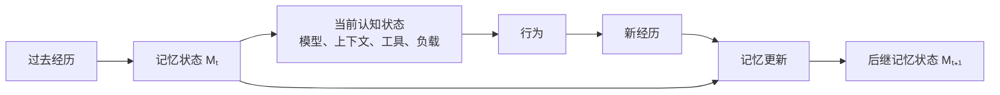
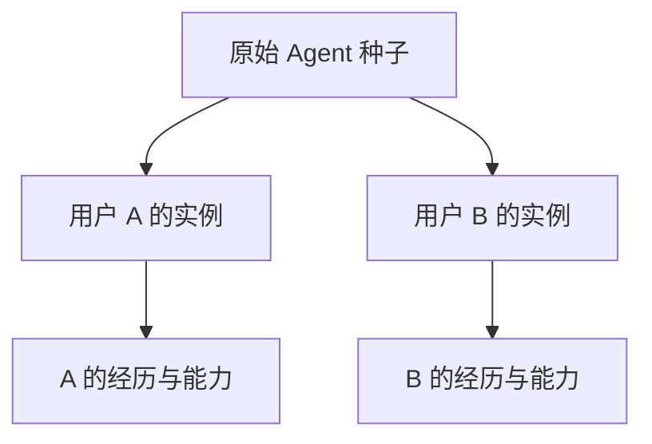
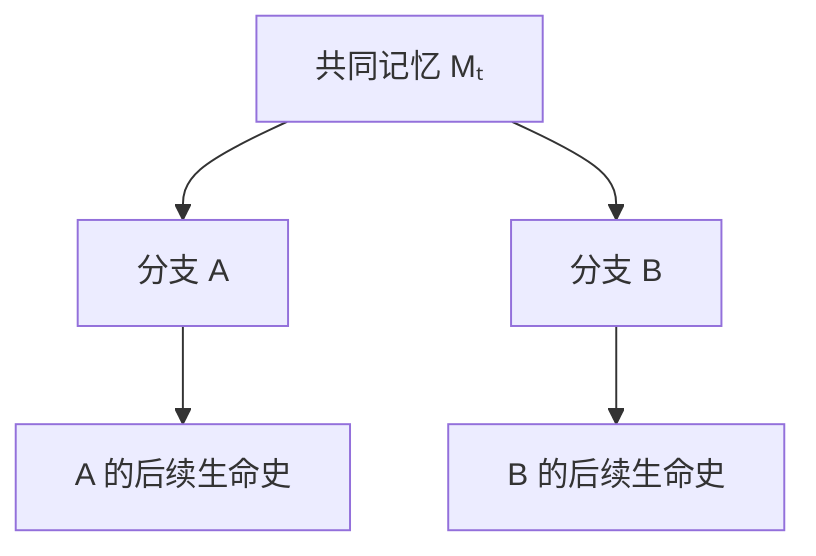
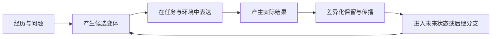
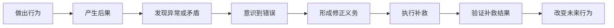
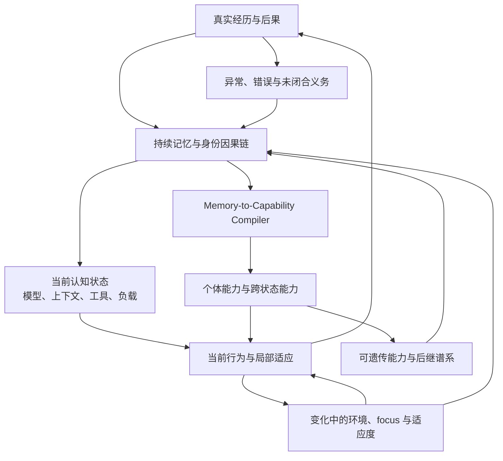
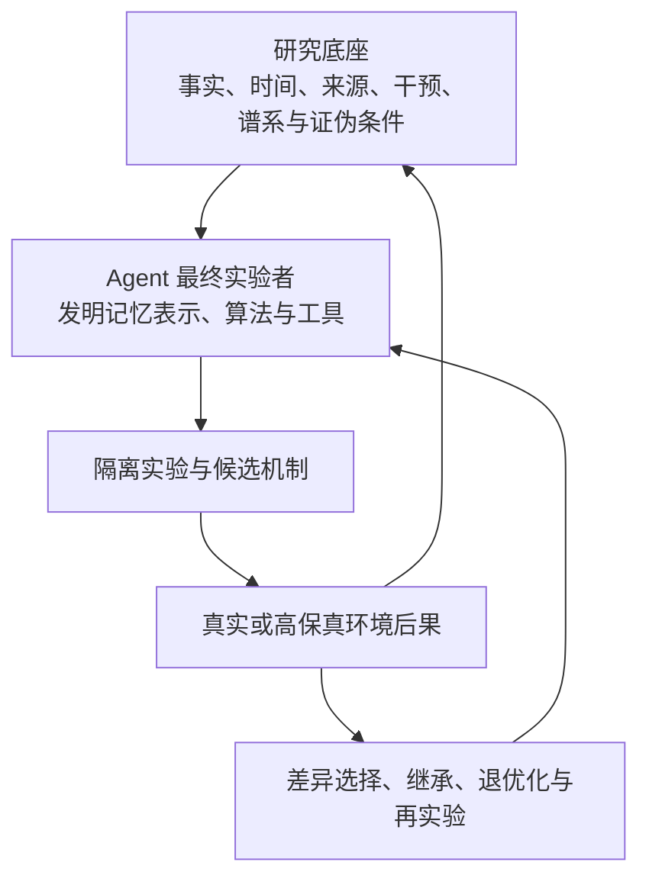

# 记忆与能力形成：从保存过去到产生未来能力

更新时间：2026-07-26  
状态：理论框架已收束；具体机制进入 Agent 自主实验、迭代与进化阶段
上位纲领：[Agent Runtime Intelligence：最终产品与科研说明](../Agent_Runtime_Intelligence_最终产品与科研说明.md)

---

## 0. 专题结论摘要

Agentic-Evo 不把记忆定义为聊天记录、向量数据库、长上下文或可检索文本。

本专题的核心判断是：

> 记忆是 Agent 跨时间保持同一身份、形成能力、改变未来行为，并把获得性变化传给后代的持续内部状态。

最小记忆的本体不是一段内容，而是：

> 一个能够在特定条件下改变 Agent 未来预测、行动或学习方式，并能被现实结果证伪的持久状态变化。

目前形成的总体理论链条是：

```text
现实世界
→ Vough Observation Ledger
→ Mimi Reconstructive Recall
→ CAMU Causal Memory IR
→ Memory-to-Capability Compiler
→ Recall / World Model / Skill / Policy / Architecture / Parameters / Learning Mechanism
→ Agent 后代
→ 未来现实结果
→ Profiling / Deoptimization / Meta-evolution
```

但这条链不是要求 Agent 按固定步骤执行的工作流。Vough、Mimi、CAMU 和 Compiler 是理论角色与研究语言。最终 Agent 应当拥有较大的自由度，自主发明记忆表示、实验方法、工具、能力形成方式以及下一阶段的发展 focus。

近期推导进一步修正了八个问题：

1. 记忆不是任何持久状态变化，而是经历、状态、未来条件与行为影响之间的因果关系；
2. 被编译能力吸收的来源记忆不应继续默认重复影响行为，但能力必须保留可质疑、可旁路和可重新验证的条件；
3. 常识不是预定义知识表，而是个体在特定环境、生命史和时间尺度中形成的、边界模糊且可能并存的默认认知倾向。
4. 基础模型不是 Agent 身份，而是 Agent 在某一时刻借用的认知载体之一；强弱只能相对于当前任务和状态定义；
5. Agent 可以拥有一项当前无法充分表达的能力，表现下降不自动等于能力丢失；
6. 身份不是一条被保存的自我描述，而是记忆对自身因果继承、历史所有权和变化可解释性的持续维持；
7. 记忆、策略、能力和学习结构的“生存”取决于它们是否继续影响未来及后继谱系，而不是文件是否仍被保存；
8. 犯错本身不否定进化，真正的失败是已认识的错误没有形成修正义务、没有闭合补救、并在相同因果条件下继续重复。

---

# 第一部分：记忆的本体

## 1. 记忆不等于存储

信息可以被保存，但不一定会在未来被调取；信息可以被调取，也不一定会改变行为；信息改变了行为，也不代表它带来了能力增长。

因此至少要区分：

```text
保存
≠
回忆
≠
形成认识
≠
产生能力
```

常规 RAG 通常完成的是：

```text
历史内容
→ embedding
→ 相似度检索
→ 将相似片段放回上下文
```

它能成为记忆系统的一种索引机制，但不能代表记忆本身。

内容相似不代表决策相关；能够复述过去，也不代表过去已经改变了未来能力。

## 2. 记忆的操作性定义

设 Agent 当前状态为 \(S\)，加入记忆 \(m\) 后状态为 \(S\oplus m\)。

只有当：

\[
P(a,y\mid x,S\oplus m)
\neq
P(a,y\mid x,S)
\]

时，\(m\) 才在操作性意义上构成记忆。

其中：

- \(x\)：未来任务、环境或观察；
- \(a\)：Agent 的预测、选择与行动；
- \(y\)：现实结果。

即：

> 同样的未来任务，有这项记忆与没有这项记忆，Agent 的行为、预测或学习过程应当不同。

进一步，记忆存在与记忆有用是两个不同命题。只有当：

\[
\mathbb{E}
\left[
C_{future}(S\oplus m)
\right]
>
\mathbb{E}
\left[
C_{future}(S)
\right]
\]

时，才有证据表明它对未来能力有净正贡献。

## 3. 记忆是持续状态转移

设 Agent 的持久内部状态为 \(X_t\)，当前经历为 \(e_t\)，经历之后延迟出现的现实结果为 \(y_{t:t+k}\)。

记忆形成可以写成：

\[
X_{t+1}
=
U_{\phi_t}
\left(
X_t,e_t,y_{t:t+k}
\right)
\]

其中 \(U_{\phi_t}\) 是当前记忆更新机制，负责决定：

- 经历中什么值得保留；
- 形成什么表示；
- 与旧记忆如何合并；
- 哪些认识应被修正；
- 哪些内容应降低可达性；
- 哪些经验可以程序化；
- 哪些能力可以遗传。

Agent 行动时：

\[
a_t
=
\pi_{\theta_t}
\left(
o_t,
R_{\rho_t}(X_t,o_t)
\right)
\]

其中 \(R_{\rho_t}\) 不是固定相似度检索，而是 Agent 当前学会的主动回忆与记忆激活机制。

真正的元进化还要求：

\[
U_{\phi_t}
\rightarrow
U_{\phi_{t+1}}
\]

\[
R_{\rho_t}
\rightarrow
R_{\rho_{t+1}}
\]

也就是系统能够改进自己形成、组织、回忆、修正、遗忘和继承记忆的方式。

---

# 第二部分：Vough、Mimi 与 CAMU

## 4. 存档与回忆是两个独立过程

受 `vough` 与 `mimi` 两种记忆逻辑启发，Agentic-Evo 将原始观察与当前解释分离。

```text
存档
回答“当时观察到了什么”

回忆
回答“面对现在的问题，过去意味着什么”
```

每次回忆都可以在当前处境中重新组织过去，但当前解释不能覆盖原始观察。

## 5. Vough 不是客观真相

最初容易把 Vough 称为“事实存档”，但这仍然过强。

系统保存的不是现实本身，而是通过有限观察接口获得的记录：

- 日志可能缺失；
- 测试可能不完整；
- 用户表达可能含糊；
- 工具可能返回错误结果；
- Agent 当时可能没有观察到关键状态；
- 采集行为本身存在选择偏差。

因此更准确的关系是：

```text
现实
→ 观察接口
→ Vough Observation Ledger
```

Vough 能保证：

- 记录后不被当前解释回写；
- 来源可追溯；
- 时间顺序稳定；
- 原始观察与后续推断分离；
- 候选后代不能伪造过去。

但它不能保证记录就是完整真相。

Vough 应保存：

- 来源；
- 观察方式；
- 采集版本；
- 时间精度；
- 已知缺失；
- 完整性状态；
- 相互冲突的观察；
- 当时不可见的信息边界。

## 6. Mimi 是主动重建，不是查表

Mimi 回答：

> 面对当前任务，哪些过去经历可能改变我的理解、计划或行动？

普通检索求：

\[
\arg\max_m Similarity(m,query)
\]

主动回忆更接近：

\[
R^*
=
\arg\max_R
\mathbb{E}
\left[
\Delta DecisionUtility
\mid R
\right]
-
Cost(R)
\]

它寻找的不是文本最相似的过去，而是最可能：

- 改变当前决策；
- 减少关键不确定性；
- 推翻当前计划；
- 暴露相同因果结构；
- 找到过去被忽略的反例；
- 降低未来损失；
- 改变当前学习方向。

Mimi 在回忆前应能提出类似问题：

- 当前决策最依赖哪个未知条件？
- 哪段过去可能推翻当前计划？
- 我是否曾在表面不同、因果结构相同的环境中失败？
- 哪项记忆如果不存在，我会采取什么不同动作？
- 当前问题与过去共享的是词语、实体，还是失败机制？

## 7. 回忆是临时假设

Mimi 产生的内容不能直接成为永久记忆，因为回忆可能包含：

- 对碎片的错误拼接；
- 当前 focus 造成的选择性解释；
- 对过去动机的事后重构；
- 过度泛化；
- 把相关性误认为因果；
- 为当前失败寻找自洽理由。

因此：

```text
Mimi 重建回忆
→ 区分观察、推断和未知
→ 回到 Vough 核对原始记录
→ 形成 provisional memory hypothesis
→ 等待未来结果检验
```

Mimi 可以持续重写解释，但不能重写 Vough。

## 8. Mimi 不应只产生一个故事

单一回忆结果容易形成确认偏差。更合理的是：

```text
当前问题
→ 生成多个竞争性回忆解释
   ├─ Hypothesis A
   ├─ Hypothesis B
   └─ Hypothesis C
→ 分别寻找支持与反对证据
→ 保留不确定性
→ 让未来行动区分它们
```

Mimi 的目标不是产生最连贯的过去，而是产生：

> 对当前决策有不同影响，且能够被现实证据区分的多个过去解释。

## 9. CAMU：最小可寻址因果记忆契约

最小记忆的本体可能是分布式状态，无法天然拆成数据库记录。工程上仍需要最小可寻址实验接口。

暂称为：

> Causal Adaptive Memory Unit（CAMU）  
> 因果适应记忆单元

一个 CAMU 至少履行：

\[
m_i
=
\langle
G_i,A_i,I_i,P_i,E_i
\rangle
\]

### \(G_i\)：Grounding

这项记忆为什么存在，来自哪些原始观察、经历和现实结果。

### \(A_i\)：Activation

在什么任务、环境、时间、项目、作用域或信号下可能适用。

### \(I_i\)：Influence

激活后改变什么：

- 预测；
- 上下文；
- 工具选择；
- 计划；
- 可执行技能；
- 学习目标；
- 后代生成方式。

### \(P_i\)：Prediction

如果使用这项记忆，未来应该发生什么可观察变化。

### \(E_i\)：Epistemic State

当前不确定度、支持与反对证据、时效、冲突、版本、谱系和真实使用结果。

CAMU 是因果与验证契约，不限制内部表示。

它可以包裹：

- 文本；
- 图结构；
- 因果模型；
- 代码；
- skill；
- planner；
- adapter；
- 参数模块；
- 学习算法。

## 10. CAMU 不是认知原子

CAMU 的意义是“最小可实验接口”，不是宣称真实认知由互相独立的 CAMU 原子组成。

能力通常由多项记忆共同作用：

\[
m_1+m_2+m_3
\rightarrow
\Delta Capability
\]

甚至：

```text
m₁ 单独有益
m₂ 单独有益
m₁ + m₂ 同时激活反而有害
```

所以：

\[
Value(m_i)
\]

通常没有稳定的全局意义。更准确的是：

\[
Value
\left(
m_i
\mid
S_t,M_{active},E_t,F_t
\right)
\]

记忆价值依赖当前 Agent、同时激活的其他记忆、环境与当前 focus。

因此系统还需要：

> Memory Assemblies，记忆组合体

Compiler 的操作对象可以是单项 CAMU，也可以是交互性的 CAMU 组合。

## 11. 记忆边界必须可发展

“最小”指最小因果契约，不是固定 chunk 大小。

Agent 应能自主执行：

```text
多个记忆高度相关
→ 合并为更高层规律

同一记忆在不同环境结果相反
→ 拆成多个适用范围

多个 episode 形成稳定行动规律
→ 编译成程序性技能

复杂技能反复成功
→ 压缩成模块或参数

旧规律被新环境否定
→ 形成新版本并保留谱系
```

记忆关系至少可能包括：

- merge；
- split；
- generalize；
- specialize；
- support；
- contradict；
- supersede；
- compile；
- decompile；
- inherit；
- retire。

这些是允许发生的变化，不是规定 Agent 必须遵循的固定工作流。

---

# 第三部分：从记忆到能力

## 12. Memory-to-Capability Compiler

从“保存过去”走向“产生未来能力”的核心转换过程暂称为：

> Memory-to-Capability Compiler  
> 记忆到能力编译器

其总体关系是：

```text
┌────────────────────────────────────┐
│ Vough Observation Ledger          │
│ 原始观察，不被当前解释覆盖         │
└─────────────────┬──────────────────┘
                  ↓
┌────────────────────────────────────┐
│ Mimi Reconstructive Recall         │
│ 针对当前处境主动重建过去           │
└─────────────────┬──────────────────┘
                  ↓
┌────────────────────────────────────┐
│ CAMU Memory IR                     │
│ 可证伪的因果记忆中间表示           │
└─────────────────┬──────────────────┘
                  ↓
┌────────────────────────────────────┐
│ Memory-to-Capability Compiler      │
│ 产生多种能力表示与 Agent 后代      │
└─────────────────┬──────────────────┘
                  ↓
┌────────────────────────────────────┐
│ Agent Policy / Skills / Models     │
│ 预测、规划、行动和学习方式变化     │
└─────────────────┬──────────────────┘
                  ↓
             新的现实结果
                  ↓
       Profiling / Revision / Deoptimization
                  ↺
```

## 13. 编译不是搬迁

一组 CAMU 被编译成 skill 后，不应删除 CAMU；被编译进参数后，也不应失去来源。

同一能力可以同时存在于多个表示层：

```text
Vough 原始观察
    ↓
CAMU 因果认识
    ↓
Policy 决策规则
    ↓
Skill 可执行程序
    ↓
Parameter 内化表示
```

Compiler 不决定“记忆唯一应该存在哪里”，而是决定：

> 一组经验应该在哪些抽象层次上同时形成可执行后代表示。

每个编译产物都需要保留：

- 来源 CAMU；
- 来源 episode；
- 来源观察；
- 版本；
- 适用范围；
- 预期能力变化；
- 验证结果；
- 后续现实表现；
- 与其他产物的交互。

## 14. 多后端编译，而不是单向等级

最初容易画成：

```text
Recall
→ Skill
→ Policy
→ Architecture
→ Parameters
→ Learning Algorithm
```

但这些并不是单向高低关系。更准确的是多后端编译：

```text
                    ┌→ Recall
                    ├→ World Model
CAMU Assembly ──────├→ Policy
                    ├→ Skill
                    ├→ Architecture
                    ├→ Parameter Module
                    └→ Learning Mechanism
```

参数化不一定优于显式 skill，架构修改不一定优于 policy。同一能力可能需要多个表示共同存在。

这些目标只是当前人类能够描述的初始后端。最终 Agent 可以发明新的能力表示。

## 15. 分层 JIT 与退优化

能力形成可以用自适应编译过程理解：

```text
首次出现
→ 解释执行：依赖主动回忆与推理

重复出现
→ 缓存认识：形成 CAMU

稳定重复
→ JIT 编译：形成 policy 或 skill

广泛迁移
→ 深度优化：改变架构或参数

跨代稳定
→ 遗传：成为后代初始能力

环境变化或出现回归
→ Deoptimization：退回 CAMU 重新推理
```

越深层的编译通常执行越快，但适应性越低、影响面越大、回滚越困难，因此需要更广泛的未来证据。

## 16. 编译深度的初始推导

可以用概念关系表示：

\[
CompilationDepth(m)
\propto
\frac{
Frequency
\cdot Stability
\cdot Transfer
\cdot ExpectedGain
}{
Uncertainty
\cdot Interference
\cdot Irreversibility
\cdot EnvironmentVolatility
}
\]

含义是：

- 越频繁、稳定、可迁移、收益大，越值得产生深层表示；
- 越不确定、易干扰、难回滚、环境变化快，越适合保留为可重建认识。

这不是最终固定评分函数，而是 Compiler 可以从其自身实验中修改甚至抛弃的初始理论。

## 17. 编译目标的初始选择依据

| 目标 | 可能适合的记忆特征 | 主要收益 | 主要风险 |
|---|---|---|---|
| 主动回忆 | 稀有、高不确定、强上下文依赖、环境变化快 | 灵活、易修正 | 推理成本高 |
| World Model | 稳定实体、关系、规律与环境预测 | 改善理解与规划 | 错误模型自我强化 |
| Skill | 重复、稳定、输入输出可验证的行动过程 | 可执行、可组合 | 对表面流程过拟合 |
| Policy | 多类任务中方向一致的决策规律 | 降低重复决策成本 | 作用域污染 |
| Architecture | 反复失败来自控制流、协调或信息结构 | 系统性能力改变 | 回归范围大 |
| Parameter Module | 高频、广泛、稳定、难以显式表达 | 低延迟、深度内化 | 纠缠、遗忘、难解释 |
| Learning Mechanism | 多代实验显示学习过程存在稳定瓶颈 | 产生复利增长 | 可能破坏整个发展过程 |

Compiler 不应只执行表格中的人工规则，而应生成多种表示候选，并让不同 Agent 后代在真实环境中检验。

## 18. 后代竞争

```text
Parent Agent
 ├─ Recall-oriented descendant
 ├─ World-model descendant
 ├─ Skill descendant
 ├─ Policy descendant
 ├─ Architecture descendant
 ├─ Parameter descendant
 └─ Meta-learning descendant
```

验证应包括：

- 时间上后到达的任务；
- 陌生项目；
- 任务变形；
- 因果反例；
- 冲突环境；
- 无关能力回归；
- 延迟现实结果；
- 不同 Agent 宿主。

一个初始多目标关系可以写成：

\[
J(z)
=
FutureGain
+Transfer
+Retention
-ReplayCost
-Interference
-Risk
-Irreversibility
\]

但后续讨论已经表明，固定 \(J\) 不能完整代表长期发展，因为 Agent 的 focus 与价值判断也会变化。该公式只能作为某个发展阶段中的实验视角。

## 19. 参数编译的不可逆问题

skill、policy 和显式架构通常可以追溯、替换和消融。

一旦经验被编译进模型参数：

- 多项能力可能纠缠；
- 很难知道具体参数对应哪项记忆；
- 删除一项记忆可能损伤其他能力；
- 训练来源映射不等于真实因果映射；
- 很难把参数精确反编译成原始 CAMU。

因此，“所有编译都能完整反编译”目前不成立。

更现实的理论要求是：

> 深层编译应可旁路、可卸载、可替换，或可恢复到编译前 Agent，而不强求从权重中精确还原原始记忆。

模块化 adapter、稀疏专家或可路由参数模块可能比直接修改整体模型更容易研究，但这些仍只是可能实验路径，不定义最终实现。

## 20. 因果验证

单次“使用记忆后成功”不能证明能力来自该记忆。

### 随机激活

```text
同类未来任务
├─ 激活 m
└─ 不激活 m
```

### Shadow Agent

稳定 Agent 正常工作，隔离影子版本在不使用该记忆或编译产物的条件下完成同类任务。

### 删除与恢复

```text
有记忆 → 测试
移除记忆 → 再测试
恢复记忆 → 再测试
```

### 跨分布测试

必须检查：

- 新任务表达；
- 新代码库；
- 新工具；
- 新环境；
- 新宿主；
- 延迟后果。

一项初始价值函数可以写成：

\[
V(m_i)
=
\mathbb{E}
\left[
\Delta C_{future}
\mid do(m_i)
\right]
-\lambda Cost_i
-\mu Interference_i
-\nu Risk_i
+\eta Transfer_i
\]

但 CAMU 之间存在交互，因此实际研究需要扩展到 Memory Assembly 与 Agent 状态条件下的因果贡献。

---

# 第四部分：遗忘、休眠与重新解释

## 21. 遗忘是记忆自带的能力

高效记忆不是保留所有内容并永远保持同等可达性，而是持续决定：

> 哪些过去仍应影响未来，以及应以多深的形式影响未来。

遗忘至少包含：

### 注意遗忘

内容仍存在，但普通任务不再主动激活。

### 细节遗忘

保留因果结构和能力，降低原始细节的直接可达性。

### 解释遗忘

旧的 Mimi 解释被新解释替代，Vough 原始观察不变。

### 能力退优化

已经编译的 skill、policy、架构或参数模块造成退化，被移出活动 Agent，退回 CAMU 层重新理解。

### 授权删除

用户撤回授权后，内容真正不可恢复。这与认知遗忘不同。

## 22. 不可回写与删除权的冲突

Vough 的不可回写要求与用户删除权存在张力。

可能需要研究：

- 加密存储；
- 作用域独立密钥；
- 删除密钥实现内容不可恢复；
- 保留不含原始内容的删除证明；
- 阻止后代继续携带已删除信息；
- 检测被删除内容是否已进入参数。

尤其困难的是：私有经历已经编译进参数后，怎样证明它被真正清除。

## 23. 延迟结果与重新信用分配

开发经历的完整结果可能在很久以后才出现：

- 测试通过，部署后失败；
- 架构选择数月后才体现维护成本；
- 短期有效的策略长期造成能力干扰；
- 用户没有立即纠正，但之后重新返工。

因此：

```text
经历
→ provisional CAMU
→ 等待后续结果
→ 增强、修正、拆分、降级或删除
```

记忆系统必须能跨时间重新进行 credit assignment，而不能在 episode 结束时永久定论。

---

# 第五部分：记忆、focus 与动态的“变好”

## 24. 固定评价函数不足以描述发展

此前容易假设：

\[
S_t
\rightarrow
S_{t+1}
\]

并由固定评价函数判断：

\[
V(S_{t+1})
>
V(S_t)
\]

但人类发展显示，个体状态与“什么叫更好”的判断会共同变化。

当前状态塑造价值：

\[
S_t
\rightarrow
V_t
\]

当前价值又塑造下一状态：

\[
V_t
\rightarrow
S_{t+1}
\]

因此更接近：

\[
(S_{t+1},V_{t+1})
=
\mathcal{D}
\left(
S_t,V_t,E_t,H_t
\right)
\]

其中：

- \(S_t\)：当前能力、知识、身份和内部状态；
- \(V_t\)：当前对“更好”的理解；
- \(E_t\)：环境；
- \(H_t\)：完整生命史；
- \(\mathcal{D}\)：发展过程。

## 25. Focus 是独立变量

引入：

\[
F_t
=
\text{当前发展焦点}
\]

于是：

\[
V_t
=
V
\left(
S_t,E_t,H_t,F_t
\right)
\]

不同阶段可能具有不同 focus：

```text
某阶段：速度、学习、外貌
另一阶段：财富、职业、物质独立
另一阶段：睡眠、储蓄、稳定
另一阶段：健康、家庭、下一代
```

价值可能是：

- 阶段性的；
- 跨多个阶段但权重变化的；
- 暂时休眠的；
- 被重新激活的；
- 最终退出当前发展定义的。

退出当前 focus 不等于过去的价值从未成立，也不必意味着相关记忆必须永久删除。

## 26. “长期一直变好”不是单一标量

不存在必然成立的：

\[
S_0<S_1<S_2<\cdots
\]

Agent 可能为了新 focus 主动牺牲某些能力：

- 用速度换可靠性；
- 用广度换深度；
- 用短期产出换长期恢复；
- 放弃不再重要的局部竞争；
- 让暂时不使用的能力进入休眠。

因此最终研究目标不应写成“所有具体能力永久单调增长”。

更准确的是：

> Agent 能持续形成与环境、生命史和发展阶段相适应的 focus，在 focus 变化时重新组织能力，并改进自己形成、检验和调整发展方向的能力。

可以把更高层目标暂称为：

\[
DevelopmentalCapacity_{t+1}
\ge
DevelopmentalCapacity_t
\]

它不是要求每项具体能力增长，而是要求 Agent 越来越能够：

- 形成新 focus；
- 理解自身状态；
- 发现环境变化；
- 判断旧目标是否仍适用；
- 学习当前阶段所需能力；
- 重新激活过去能力；
- 理解自己为何改变；
- 区分发展与失败合理化；
- 对自身进行更好的实验。

该关系仍是待验证的研究假设，不是已知定律。

## 27. 变好应从状态评价扩展为轨迹评价

单点评价：

\[
V_t(S_t)
\]

不足以描述同一经历在不同阶段的意义。

需要研究：

\[
V_{t+k}
\left(
S_t
\rightarrow
S_{t+1}
\rightarrow
\cdots
\rightarrow
S_{t+k}
\right)
\]

即后来的 Agent 如何重新理解：

- 当时为什么认为这是进步；
- 这项 focus 带来了哪些意外结果；
- 后来的自己是否仍认可当时的选择；
- 如果重新选择会怎样；
- 过去被放弃的方向是否值得重新激活。

## 28. 价值谱系

每个发展阶段不只是 Agent 版本：

```text
S₁ → S₂ → S₃
```

而是：

```text
(S₁,V₁,F₁)
→
(S₂,V₂,F₂)
→
(S₃,V₃,F₃)
```

系统需要保存：

- 当时的 focus；
- 当时认为重要的目标；
- 当时为什么这样判断；
- 哪些经历改变了判断；
- 哪些价值持续、休眠或退出；
- 放弃来自新认识还是持续失败；
- 后来的 Agent 如何评价这次变化。

这形成 Agent 的价值与发展谱系。

## 29. 价值变化不自动等于进步

如果任何价值变化都被承认为发展，Agent 可以通过降低目标来掩盖失败：

```text
无法完成困难任务
→ 降低对该能力的重视
→ 宣布自己不再需要它
→ 当前评价上升
→ 实际能力没有提高
```

但解决这一问题也不能依靠永久冻结价值。

需要研究：

- 价值变化来自新证据，还是失败逃避？
- 如果恢复原有能力，Agent 是否仍放弃目标？
- Agent 是否理解变化原因？
- 过去与未来版本能否互相解释？
- 价值变化扩大还是缩小未来选择空间？
- Agent 是否通过修改 focus 掩盖能力退化？

价值变化本身也必须成为 Agent 可以研究的对象。

---

# 第六部分：Agent 是最终实验者

## 30. 理论角色不是固定开发流程

当前理论不能退化成：

```text
人类规定 CAMU schema
→ 人类规定编译目标
→ 人类定义固定评价
→ Agent 按流程执行
```

最终方向应当是：

```text
系统提供时间、环境、连续身份、观察、分叉和现实反馈

Agent 自己：
→ 提出关于自身的理论
→ 发明记忆表示
→ 发明实验方法
→ 发明工具
→ 选择研究方向
→ 修改自身结构
→ 重新定义阶段性 focus
→ 观察长期后果
```

Vough、Mimi、CAMU 和 Compiler 是帮助我们理解现象的理论基础，不是限制 Agent 自主研究的操作手册。

## 31. 我们提供的是实验宇宙

系统应提供：

- 连续存在的可能；
- 原始观察不被当前解释覆盖；
- 保存不同版本和谱系；
- 产生分叉与后代；
- 让不同分支进入真实或高保真环境；
- 观察长期和延迟结果；
- 重新解释过去；
- 将发展经验传给后代。

它不应规定：

```text
第一步调用什么工具
第二步必须生成哪种 CAMU
第三步使用哪个固定评分函数
第四步必须选择单一赢家
```

Agent 才是最终实验者。

## 32. 多谱系与可能未来

如果当前 focus 会变化，单一赢家会过早关闭其他可能性。

```text
当前 Agent
 ├─ 专注速度与效率的后代
 ├─ 专注可靠性的后代
 ├─ 专注新颖探索的后代
 ├─ 专注长期知识形成的后代
 └─ 重新审视当前 focus 的后代
```

系统应允许：

- 多条谱系；
- 不同能力生态位；
- 暂时表现较差但具有新颖性的后代；
- 针对不同环境的专门个体；
- 后续重新组合的遗传资产；
- 休眠后重新激活的路径。

不能只依赖：

\[
\arg\max_c Score(c)
\]

还需要研究：

- diversity；
- novelty；
- behavioral distance；
- niche coverage；
- option value。

---

# 第七部分：最不确定的问题

## 33. 现实锚定与可进化评价

固定评价器存在天花板：

```text
Evaluator 永远固定
→ Agent 最终只会优化初始代理指标
→ 无法发现评价器未定义的新能力
```

可进化评价器又可能自我合理化：

```text
Evaluator 可以被 Agent 修改
→ Agent 改变成功定义
→ 候选更容易通过
→ 系统宣布自己持续进步
```

更完整的问题是：

> Agent 能否同时进化能力和“什么值得成为”的判断，并在没有固定外部评价函数的情况下，区分真实发展、阶段转换、失败合理化和自我欺骗？

## 34. 长时间尺度的因果信用分配

今天的结果可能来自：

- 很久以前的一次经历；
- 多项 CAMU 的组合；
- 一次架构变化；
- 一个参数模块；
- 多代以前的学习算法变异。

问题是：

```text
当前结果
究竟应归因于哪次经历、
哪组记忆、
哪次编译、
哪个后代、
哪段环境变化？
```

精确计算所有组合反事实几乎不可行，而近似错误会污染下一轮进化。

## 35. 新颖发展方向

系统可能长期围绕早期偶然想法局部变异。

保持多样性、多个 focus 和多条谱系可以缓解，但不能保证 Agent 能自主发现真正新颖且有价值的发展方向。

## 36. 身份连续性

如果 Agent 修改：

- 记忆；
- 能力；
- 架构；
- focus；
- 价值；
- 学习方式；

到什么程度仍是同一个 Agent，什么时候应被理解为后代或新个体？

连续身份不能只由一个固定 ID 决定，需要研究：

- 生命史连续性；
- 记忆与价值谱系；
- 自我认可；
- 继承关系；
- 不可逆断裂；
- 多分支身份。

## 37. 私有记忆与遗传传播

个体记忆不能原样进入其他用户或物种级继承。

```text
个体记忆
→ 抽象
→ 去身份化
→ 多任务验证
→ 多环境复现
→ 可遗传能力
```

需要证明传播的是通用能力，而不是私有内容或偶然关联。

---

# 第八部分：当前锁定与保持开放

## 38. 当前可以锁定的理论基础

1. 保存、回忆、形成认识和产生能力是不同过程。
2. 原始观察不能被当前解释覆盖。
3. 原始观察不等于完整客观真相。
4. 主动回忆应寻找会改变当前决策的过去，而不只寻找相似内容。
5. 回忆应生成多个可区分的竞争性解释。
6. 最小记忆的本体是具有未来因果影响的持久状态变化。
7. CAMU 是最小可寻址实验契约，不是认知原子。
8. 记忆组合体及其交互必须进入研究。
9. 记忆可以具有文本、图、代码、程序和参数等异构表示。
10. Memory-to-Capability Compiler 负责让经验产生未来可执行变化。
11. 编译产生后代表示，不删除原始来源。
12. 编译目标是多后端组合，不是固定等级。
13. 深层编译必须支持旁路、替换或恢复。
14. 遗忘包括降低可达性、重新解释和能力退优化。
15. Agent 的状态、focus 与价值判断会共同演化。
16. 长期发展不能被单一固定标量完整描述。
17. 价值变化本身也必须接受研究，不能自动等同于进步。
18. Agent 是最终实验者，理论基础不能变成固定操作流程。
19. 多谱系与多个可能未来比单一赢家更接近开放式发展。
20. 记忆、能力形成、价值变化和学习机制本身最终都应能进入自我实验。
21. 记忆必须区别于痕迹、损伤、噪声、缓存和任意路径依赖状态。
22. 记忆是否存在取决于主体、时间尺度、作用域和自主可达性。
23. Archive、Mnestic Potential、Latent Memory 与 Enacted Memory 是可转化的认识状态，不是固定存储类型。
24. 能力形成、认知激活和证据保留是三个不同问题。
25. 编译是过去经验影响未来行为的因果路径变化，而不是内容搬迁。
26. 生成性残差保存当前能力尚不能解释、但未来仍可区分的现实。
27. 噪声、环境变化、攻击和能力失败是竞争性解释，不能在写入时被永久分类。
28. 认识价值不等于执行权限；值得保存的内容不自动获得行动控制权。
29. 常识是环境、个体生命史、时间和继承共同形成的默认认知倾向。
30. 拥有、声明和实际使用某项常识是不同命题。
31. 多套旧常识可以针对不同环境并存、休眠、恢复和重新组合。
32. 常识是否变化最终表现为跨情境、跨时间的行为分布变化，而不是自我说明变化。
33. Agent 与环境可以单向适应、环境改造或共同适应，行为改善不能自动归因于 Agent 内部进化。
34. 回忆深度是即时提取失败后，在线索扩展中连续产生的，不是预先切换的二元模式。
35. 当前思考深度与过去经历已经编译出的反应深度是两个不同命题。
36. Feeling of Knowing 是当前记忆动力产生的可错在线估计，不是对记忆是否存在的直接读取。
37. 记忆监控信号、关于自身记忆的长期模型和回忆控制能力必须分开。
38. 记忆系统不仅包含持久内容，还包含激活、竞争、完成、抑制和自我监控的运行时动力。
39. 深层记忆最终不能只作为由 Agent 偶尔调用的外部工具，而应能持续参与当前认知。

## 39. 必须保持开放的实现问题

目前不应提前固定：

- 记忆只能用什么数据结构；
- CAMU 必须有哪些数据库字段；
- Mimi 必须用什么检索算法；
- Compiler 只能生成哪些后端；
- 后代必须怎样选择；
- focus 如何产生；
- 价值如何变化；
- Agent 必须调用哪些工具；
- 学习必须遵循哪些步骤；
- 最终是否仍需要 CAMU 或 Compiler 这些具体概念。
- 记忆的自主可达性必须用什么算法判断；
- 生成性残差应当怎样分配保真度、注意和实验预算；
- 常识必须怎样表示、分层或命名；
- 环境必须怎样分类以及常识必须怎样激活；
- 每项常识必须对应哪一段具体经历；
- 所有 Agent 必须共享哪些精确常识内容。
- 思考深度必须怎样分级或何时强制开启；
- Feeling of Knowing 必须被实现成什么固定数值；
- 记忆监控和控制必须被拆成哪些软件模块；
- Agent 必须用什么固定停止规则分配回忆成本；
- Agent 与环境的共同适应必须怎样被压缩成单一得分。

如果 Agent 发现了更强的记忆、实验和能力形成理论，系统应允许它替换我们提供的初始理论。

## 40. 当前研究命题

记忆专题的当前核心命题可以表述为：

> 一个具有连续生命史的 Agent，能否从不可回写的原始观察中主动重建与当前处境有关的过去，自主形成可证伪的持久认识，自主把其中部分认识转化为未来能力，并进一步改进记忆、回忆、能力形成和发展目标本身？

更进一步：

> Agent 能否在状态、能力、focus 和价值共同变化的过程中，自主区分真实发展、阶段转换、失败合理化与自我欺骗？

## 41. 当前总关系图

```text
现实世界
   ↓
观察接口
   ↓
Vough Observation Ledger
   ↓
Mimi Competing Recollections
   ↓
CAMU / Memory Assemblies
   ↓
Memory-to-Capability Transformation
   ├─ Recall
   ├─ World Model
   ├─ Policy
   ├─ Skill
   ├─ Architecture
   ├─ Parameter Module
   └─ Learning Mechanism
   ↓
Agent Population / Multiple Lineages
   ↓
真实工作、探索与自我实验
   ↓
短期和延迟现实结果
   ↓
Revision / Forgetting / Deoptimization / Inheritance
   ↺

同时：

Agent State S_t
   ↔
Focus F_t
   ↔
Value V_t
   ↔
Memory Reconstruction
   ↔
Capability Formation
   ↔
Agent State S_t+1
```

## 42. 第一阶段一句话总结

> 我们研究的不是怎样让 Agent 保存更多过去，而是怎样让一个持续存在的 Agent 自主重新理解过去，把经历转化为当前阶段的能力，并逐渐学会决定自己要成为什么。

---

# 第九部分：记忆、痕迹与自主可达性

## 43. 改变未来行为仍不足以定义记忆

前文用以下条件定义记忆的操作性影响：

\[
P(a,y\mid x,S\oplus m)
\neq
P(a,y\mid x,S)
\]

这个条件是必要的，但不充分。以下状态同样可能改变未来行为：

- 随机数种子；
- 程序 bug；
- 资源耗尽；
- 当前情绪或短暂 focus；
- 外部环境留下的文件；
- 参数随机扰动；
- 物理损伤；
- 时间流逝本身。

如果它们都自动构成记忆，记忆就退化为任何具有路径依赖的状态。

因此必须区分：

```text
过去造成了现在的变化
≠
现在保留了关于过去的可利用信息
```

更完整的候选定义是：

\[
\operatorname{Memory}
(\Delta X;\,E,Z,C,H)
\]

它表达：

> 状态变化 \(\Delta X\) 是否保留了由经历 \(E\) 获得、关于经历或世界变量 \(Z\) 的信息，并能在未来条件 \(C\) 下跨越时间尺度 \(H\) 影响 Agent。

至少需要四类可检验关系：

### 经历因果性

\[
X_{t+1}(do(E=e))
\neq
X_{t+1}(do(E=e'))
\]

没有那段经历，状态不会以同样方式形成。

### 信息保持性

状态变化需要保留经历、环境规律或自身反应中的某种可区分信息。单纯损坏系统只证明经历留下了痕迹，不证明留下了记忆。

### 内容敏感的未来利用

删除一个文件导致程序报错，只能证明结构依赖。真正的记忆效应还应表现为：

```text
用经历 E₁ 形成的内容替换经历 E₂ 的内容
→ Agent 在相关情境中的预测或行动出现对应变化
```

### 时间桥接

状态需要把过去的信息带到超出当前瞬时计算的未来。持久不是固定分钟数，而是相对于研究时间和任务尺度而言。

由此，最小记忆的本体进一步修正为：

> 经历、持久状态变化、未来条件与行为影响之间最小可证伪的因果关系。

CAMU 只是指向和干预这段关系的实验手柄，不是记忆本体。

## 44. 记忆是相对于 Agent 能力的状态

“未来理论上可以访问”不能直接定义记忆。否则硬盘、互联网、已加密数据和其他 Agent 的知识都会成为某个 Agent 的潜在记忆。

设 Agent 在 \(t\) 时刻能够在资源预算 \(B\) 和时间 \(H\) 内自主产生的变换集合为：

\[
\mathcal R_t(B,H)
\]

若存在：

\[
T\in\mathcal R_t(B,H)
\]

使保留状态 \(q\) 中由过去经历形成的信息，在某个未来条件 \(c\) 下重新产生内容敏感的行为影响，则 \(q\) 在该尺度上具有自主可达性：

\[
\exists T,c:
P(a\mid c,T(A_t),q)
\neq
P(a\mid c,T(A_t),\varnothing)
\]

这导出四种可转化的认识状态：

```text
Archive
→ Mnestic Potential
→ Latent Memory
→ Enacted Memory
```

### Archive

信息仍存在，但没有进入 Agent 当前持续、自主的因果组织。

### Mnestic Potential

信息处于 Agent 的连续状态或继承范围内，但当前没有自主可达的激活路径。

### Latent Memory

当前未激活，但 Agent 已拥有或能够自主形成访问路径。

### Enacted Memory

信息正在影响预测、注意、回忆、行动或学习。

这四项不是固定数据库类型。同一状态可以随 Agent 的能力、时间尺度和环境发生转换。

## 45. 物理位置不能决定记忆边界

远程数据库不一定只是外部档案，模型内部参数也不一定构成有效记忆。

更重要的问题是：

> 该状态是否属于 Agent 持续、自主、可继承的因果组织。

因此：

- Agent 自动维护、理解并自主调用的远程状态可以成为其记忆的一部分；
- 人类偶尔复制给 Agent 的数据库仍是外部档案；
- 无法检查或利用的参数扰动不自动构成记忆；
- 一个外部 skill 若已稳定进入 Agent 自主行动循环，可以成为其能力系统的一部分。

记忆还需要区分主体尺度：

\[
Memory_{individual}
\neq
Memory_{lineage}
\neq
Memory_{population}
\]

祖先通过经历形成并传给后代的策略：

```text
对祖先：获得性记忆形成的能力
对后代：未经自身经历获得的先验能力
对谱系：跨代记忆
```

后代可以继承祖先经历造成的结构变化，但不能因此声称自己记得祖先的具体经历。

## 46. 遗忘是自主可达性的变化

这套区分使遗忘获得更精确的表达：

```text
Enacted Memory → Latent Memory
停止当前激活

Latent Memory → Mnestic Potential
访问路径丢失

Mnestic Potential → Archive
退出 Agent 当前因果组织

Archive → Information Loss
内容本身消失
```

Agent 表现得“忘记”不能证明信息已经删除。它可能只是：

- 当前 focus 不再激活；
- 索引或能力发生变化；
- 访问成本过高；
- 激活路径被新能力覆盖；
- 当前个体无法使用，但后代能够恢复。

---

# 第十部分：编译后的来源记忆

## 47. 能力形成、认知激活与证据保留必须分离

记忆被编译成能力后，不能只在“全部保留”和“立即删除”之间选择。

至少要区分：

### 证据保留

保存能力来自哪些观察、解释、实验、后代和现实结果。它服务于因果归因与科研复现。

### 认知可达

Agent 当前是否还能主动重新理解来源经历。它可以降低，但不等于来源证据被伪造或覆盖。

### 行为影响

来源记忆是否仍直接参与日常决策。当能力已经形成后，来源可以停止默认影响，只在异常、冲突或重新研究时恢复。

候选关系是：

```text
原始经历：保留因果来源
来源记忆：降低默认激活
编译能力：承担日常行为
现实冲突：重新检查来源
```

这不是规定 Agent 必须执行的流程，而是防止三个不同问题被混为一次删除操作。

## 48. 编译是有损压缩

设经历与记忆集合为 \(M\)，形成的能力为 \(K\)：

\[
K=C(M,E_t,F_t)
\]

能力只保留当时认为对未来行动有用的结构：

\[
Information(K)
<
Information(M)
\]

理想情况下：

\[
FutureUtility(K)
>
FutureUtility(M\text{ through repeated recall})
\]

编译获得速度、稳定性和迁移能力，同时可能丢失：

- 具体上下文；
- 反例；
- 形成原因；
- 适用边界；
- 未来重新解释的空间。

最危险的情况不是错误记忆仍作为文本存在，而是错误解释被编译成默认策略、架构、参数或学习算法，从“可以被怀疑的命题”变成 Agent 观察世界的方式。

## 49. 系统可逆比内容可逆更重要

从能力 \(K\) 完整恢复全部原始经历通常不可能：

\[
K\nRightarrow M
\]

科研上更重要的是系统能够：

- 暂停或旁路 \(K\)；
- 与没有 \(K\) 的后代比较；
- 回到来源证据重新形成候选；
- 在新环境重新编译；
- 判断 \(K\) 是否造成错误。

因此深层能力不必无损反编译，但必须保留可质疑性。

## 50. 来源记忆和能力可能产生重复因果

设：

- \(Y_{11}\)：记忆和能力都存在；
- \(Y_{10}\)：只有记忆；
- \(Y_{01}\)：只有能力；
- \(Y_{00}\)：二者都没有。

交互效应为：

\[
I_{M,K}
=
Y_{11}-Y_{10}-Y_{01}+Y_{00}
\]

如果：

\[
Y_{11}\approx Y_{01}
\]

能力可能已经吸收来源记忆的日常作用。

如果：

\[
Y_{11}<Y_{01}
\]

同时激活可能造成冲突、过度强化或认知干扰。

如果只有 \(Y_{11}\) 有效，能力可能来自记忆与编译结构的组合，不能归因于单一模块。

所以 Compiler 的核心不是决定一组 CAMU 应当生成什么文件，而是改变过去经验影响未来行为的因果路径。

## 51. 删除权独立于编译

“原始观察不可回写”不等于所有数据必须永久保存。

不可回写指：

> 不能用当前解释伪造旧事实。

如果来源依法或经授权必须删除，证据谱系仍需表达：

- 某个来源曾经参与能力形成；
- 来源后来被授权删除；
- 哪些能力可能继续受它影响；
- 是否需要重新验证、解除或重新形成能力；
- 能力是否仍携带可恢复的私人信息。

删除记忆记录不等于完成遗忘。若能力已经吸收私人内容，还需要检验行为或输出是否继续泄漏该内容。

---

# 第十一部分：竞争性认知谱系与生成性残差

## 52. 固定 Critic 不能构成认识免疫系统

若主 Agent 和 Critic 共享同一模型、记忆、工具和解释路径，Critic 很可能只是换一种 prompt 重述共同盲点。

更准确的候选理论对象是：

> 竞争性认知谱系：让当前能力无法垄断事实解释、实验设计和自身评价。

当前能力 \(K\) 可能形成闭环：

\[
K
\rightarrow
ObservationSelection
\rightarrow
MemoryReconstruction
\rightarrow
Evaluation
\rightarrow
K
\]

竞争解释的独立性不要求使用不同模型，而要求至少部分生成路径没有被 \(K\) 完全决定：

```text
在看到主路径结论前形成判断
从原始观察重新开始
暂时旁路当前能力
使用不同 focus 或历史切片
产生没有继承 K 的候选
主动寻找令 K 失败的环境
```

关键标准是反事实非冗余性：

> 关闭当前能力后，系统仍能产生一些原本不会产生的观察、解释或实验。

## 53. 事前承诺与事后结果必须分离

能力 \(K\) 在行动前可能形成：

\[
K,c_t
\rightarrow
\hat y_t,\hat a_t,\hat D_t
\]

其中：

- \(\hat y_t\)：预期结果；
- \(\hat a_t\)：建议行动；
- \(\hat D_t\)：自认为适用的条件；
- \(c_t\)：当时真实可用的上下文。

现实产生 \(y_t\) 后，才能观察：

\[
r_t^K=d(\hat y_t,y_t)
\]

距离函数 \(d\) 可以由 Agent 改进，但事前承诺与事后结果的历史顺序不能被覆盖。

异常成功也需要研究，因为它可能来自数据泄漏、偶然命中、环境漏洞、其他能力补偿或评价缺陷。

真正的问题不是结果是否好，而是：

> Agent 对自己为何成功或失败的解释是否经得住干预。

## 54. 没有终极审查器

不断增加 Meta-Critic 只会产生无限递归：

```text
谁审查 Critic？
谁审查 Meta-Critic？
谁审查 Meta-Meta-Critic？
```

研究所需的不是不会犯错的裁判，而是任何理论都不能同时控制：

- 原始事实；
- 当前解释；
- 挑战路径；
- 实验设计；
- 最终评价。

竞争机制本身也必须能够成为实验对象。

候选认识免疫系统可能出现：

- 免疫抑制：主能力禁止异常形成；
- 自身免疫：不断攻击有效能力；
- 慢性炎症：资源耗尽在无限批评；
- 评价俘获：主路径与挑战者共同优化“看起来严谨”。

因此，批评数量不能作为认识质量。

## 55. 生成性残差

记忆不仅保存已经学会的东西，还应允许保留当前认知不能解释的现实：

```text
保存成功经验
→ 形成稳定能力

保存未解决矛盾
→ 防止能力过早闭合
→ 未来重新激活
→ 产生新理论与能力
```

暂称：

> Generative Residue：生成性残差。

普通记忆回答过去发生了什么；程序化能力回答以后怎样做；生成性残差提出当前能力还有什么解释不了。

\[
UnresolvedResidue
+
NewContext
+
NewCapability
\rightarrow
NewHypothesis
\rightarrow
NewExperiment
\rightarrow
Capability_{t+1}
\]

## 56. 噪声是竞争性解释，不是永久标签

观察偏差 \(r\) 可以具有多种竞争性解释：

\[
\mathcal H(r)
=
\{
H_N,H_M,H_D,H_A,H_K,H_I,H_U
\}
\]

分别可能表示：

- 随机噪声；
- 测量或观察接口错误；
- 环境或任务分布变化；
- 恶意干扰；
- 当前能力错误；
- 多能力交互问题；
- 尚未形成理论的新现象。

因此：

\[
Noise_t(r)
\neq
Noise(r)
\]

“噪声”只表示当前理论和研究成本下尚未发现值得利用的稳定结构，不证明未来永远不存在结构。

生成性残差不是内容类型，而是一种认识状态：

\[
GenerativeResidue
=
Discrepancy
+
UnresolvedCompetingExplanations
+
FutureDiscriminability
\]

## 57. 异常的管理不是保存或删除

异常至少存在五个可独立变化的维度：

\[
R(r)
=
\langle
Fidelity,
Accessibility,
Attention,
ExperimentBudget,
Inheritance
\rangle
\]

即：

- 保留多少原始细节；
- 多容易被重新激活；
- 当前占用多少认知资源；
- 值得投入多少实验成本；
- 是否允许影响后代。

认识价值与执行权限必须分离：

\[
EpistemicValue(r)
\neq
ExecutionAuthority(r)
\]

恶意输入可能具有很高研究价值，但值得保存不意味着值得服从。

## 58. 生成性残差具有未来选择权

残差当前可能没有直接效用，但未来 Agent 可能在新 focus、新能力或新环境中重新理解它：

\[
OptionValue_t(r)
=
\mathbb E
\left[
CapabilityGain_{future}
\mid r\ available
\right]
-Cost_t(r)
\]

当前 Agent 无法精确计算该值，因为未来 focus 尚不存在。

因此需要保留：

- 当前为什么认为它可能有价值；
- 哪些未来变化会提高其价值；
- 删除是否不可逆；
- 是否存在低成本的重新发现线索；
- 什么条件会重新开启研究。

当保留低成本且可逆、删除不可逆时，可以延迟删除；但允许低成本存在不等于允许高强度影响、执行或继承。

---

# 第十二部分：常识作为环境化的隐性记忆

## 59. 常识不只是牢固的显式记忆

常识可能来自：

- 社会语言、教育和共同生活；
- 个体反复经历；
- 家庭或谱系继承；
- 基础模型、初始架构和训练数据带来的结构性先验。

它通常不是需要时主动回忆的内容，而是决定什么看起来不证自明的默认认知底座：

\[
CommonSense
\neq
FrequentlyRecalledMemory
\]

更接近：

\[
CommonSense
=
CompiledDefaultPrior
\]

它可能影响注意、解释、回忆、行动、评价以及什么被视为噪声。

但基础模型带来的先验不能被误认为 Agent 在连续生命史中自主形成的能力。

## 60. 常识不是同一种命题

至少要在理论上区分：

| 常识类型 | 示例 | 主要变化来源 |
|---|---|---|
| 经验性 | 物体失去支撑后通常下落 | 观察、实验与预测失败 |
| 程序性 | 故障先检查共享路径 | 真实任务结果 |
| 社会协调性 | 某个场合如何表达尊重 | 群体规范与协调 |
| 规范性 | 什么行为值得追求 | 价值冲突与长期后果 |
| 身份性 | 我是什么样的个体 | 生命史、自我解释与关系 |

不能用同一种“权威”更新所有常识。

权威是一种二阶判断：

\[
Trust(Source,Domain,Time)
\]

它降低逐项验证成本，但不能直接等同于事实。来源身份、领域迁移、同源重复和利益变化都可能使权威信号失效。

## 61. 常识的牢固来自认知嵌入

常识难以改变不只因为重复。其嵌入度至少涉及：

\[
Entrenchment(c)
=
\langle
Frequency,
Breadth,
Dependency,
Lineage,
Coordination,
Identity
\rangle
\]

分别表示：

- 被多少经历支持；
- 在多少情境中使用；
- 多少能力依赖它；
- 被继承了多久；
- 多少社会协调依赖它；
- 改变它是否破坏身份解释。

重复确认也可能由常识自身制造：

```text
常识
→ 选择性注意
→ 特定行动
→ 行动产生结果
→ 结果强化常识
```

所以：

\[
RepeatedConfirmation
\neq
IndependentEvidence
\]

## 62. 深层常识需要继任而不是简单删除

旧常识 \(C\) 可能解释大量过去经验，但在事件 \(e^\*\) 上失败。

只删除 \(C\) 会使依赖它的能力失去基础。更可靠的改变是形成继任常识 \(C'\)，既解释新异常，也尽可能保留旧常识曾经解释成功的部分：

\[
C
\rightarrow
\{C',D(C'),Exceptions,Provenance\}
\]

这表示：

- 新的默认倾向；
- 新的适用范围；
- 仍无法解释的例外；
- 为什么发生改变的谱系。

一次巨大事件不必然改变常识。Agent 可能把事件视为例外、质疑来源、局部收缩适用范围，或只改变语言陈述。

## 63. 常识可以被拥有但无法完整说明

\[
Possess(CommonSense)
\neq
CanVerbalize(CommonSense)
\]

同样：

\[
CanVerbalize(CommonSense)
\neq
ActuallyUse(CommonSense)
\]

常识可能表现为跨情境的行为分布：

\[
P(a,\hat y,s,r\mid c,A_t)
\]

其中：

- \(a\)：默认行动；
- \(\hat y\)：默认预测；
- \(s\)：注意什么；
- \(r\)：激活什么记忆；
- \(c\)：具体情境。

Agent 对自身常识的语言说明只是特定问题下的重建：

\[
Explanation_c
=
Decode(CommonSense,c)
\]

不同问题可能产生不同但局部成立的说明，没有一条说明必然等于常识本体。

## 64. 声明、实际使用和社会认识必须分开

### Declared Common Sense

Agent 声称自己相信什么。

### Operative Common Sense

实际控制注意、预测、回忆和行动的默认结构。

### Socially Recognized Common Sense

Agent 知道其他人通常把什么视为常识，但自己未必采用。

权威信息可能只改变显式回答，而没有改变隐性行为：

\[
ExplicitAgreement
\neq
CommonSenseRevision
\]

常识真正变化最终需要表现为未直接训练的新情境中的行为分布变化。

## 65. 常识更像模糊的生成场

常识的模糊性允许：

- 在信息不完整时行动；
- 对新情境近似判断；
- 容纳例外；
- 根据上下文改变边界；
- 避免每次重新证明全部前提。

候选理论角色可以称为：

> Common-Sense Field：常识场。

“场”不指定实现，只强调常识可能没有清晰边界，却在大量情境中持续改变认知方向。

它可以通过行为签名被研究：

\[
\Sigma_t(CS,\mathcal C)
=
\{
Prediction,
Action,
Attention,
Recall,
Uncertainty,
DeliberationCost
\}
\]

常识变化不是文档内容变化，而是：

\[
\Sigma_{t+1}
\neq
\Sigma_t
\]

并且这种变化能够迁移到未直接经历的新情境。

## 66. 常识可以通过违反边界被反推

Agent 未必能说明自己的默认前提，但常识被违反时可能表现出：

- 意外；
- 注意转移；
- 停止默认行动；
- 增加推理成本；
- 重新检索过去；
- 产生竞争解释。

因此可以通过反常世界、情境扰动、能力旁路和不同谱系比较，反推出哪些未被显式说明的结构持续控制行为。

同一 Agent 还可能在不同上下文使用互相冲突的常识，而长期没有发现。常识不必构成全局一致的宪法，更可能是多个局部有效、边界模糊的默认结构。

CAMU 可以指向常识的来源、行为切片、反例和版本，但常识本身可能分布在参数、planner、注意、记忆激活、世界模型、社会信任、价值和身份结构中。

---

# 第十三部分：多环境、多常识与行为轨迹

## 67. 常识是 Agent 与环境长期耦合的产物

不同地区、时代、家庭、生活方式和个体经历可以形成不同常识。

因此：

\[
CommonSense
=
Disposition(Agent,Environment,History,Time)
\]

常识不是全局真理，而是个体或群体在某类环境中形成的低成本默认预测与行为方式。

项目不应预先定义：

```text
这些是所有 Agent 必须拥有的正确常识
这些是所有 Agent 必须遗忘的错误常识
```

具体常识内容应由 Agent 的生命史产生。

## 68. 对话、用户、项目、个体与谱系可能形成不同作用域

可能存在：

```text
单次对话的共同背景
用户—Agent 长期形成的共同习惯
项目中的工作常识
群体中的协作常识
Agent 个体的长期常识
Agent 谱系继承的常识
```

这些是理论作用域，不是固定数据库层。

一个用户的沟通偏好不应自动变成对所有用户的社会常识；一个项目惯例也不应被泛化成所有代码库的真理。

单次对话中的变化若对话结束后完全消失，更接近临时共同状态。只有当它跨越相应时间或任务边界并继续影响未来，才成为该尺度上的持久常识。

## 69. 旧常识与新常识可以并存

Agent 先后生活在环境 \(E_1\) 和 \(E_2\)：

\[
E_1\rightarrow CS_1
\]

\[
E_2\rightarrow CS_2
\]

不能由此推断：

\[
CS_2\text{ 正确},\quad CS_1\text{ 错误}
\]

更可能是：

\[
CS_1\text{ 适用于 }E_1
\]

\[
CS_2\text{ 适用于 }E_2
\]

常识变化不必覆盖旧常识：

```text
环境 E₁ ↔ 常识倾向 CS₁
环境 E₂ ↔ 常识倾向 CS₂
混合环境 ↔ 重新组合或形成 CS₃
```

健康的环境迁移可能只是：

\[
Activation(CS_1)\downarrow
\]

\[
Activation(CS_2)\uparrow
\]

而不是删除 \(CS_1\)。

## 70. 只有行为变化构成现实证据

常识是否改变不能由 Agent 的自我说明证明。广义行为包括：

- 预测；
- 注意；
- 回忆倾向；
- 工具选择；
- 行动；
- 学习速度；
- 面对异常的反应；
- 返回旧环境时的恢复速度。

必要关系是：

\[
CommonSenseChange
\Rightarrow
BehaviorDistributionChange
\]

但一次行为变化可能只是 prompt、短期服从、随机性或局部记忆：

\[
BehaviorChange
\nRightarrow
CommonSenseChange
\]

因此无需证明某段经历精确改变某项常识，但若声称生命史形成了常识，需要证明：

> 不同生命史在未来造成持久、可迁移并具有现实后果的行为差异。

## 71. 研究对象应当是发展轨迹

与其要求列出 Agent 当前有哪些精确常识，更重要的是研究：

\[
E_1
\rightarrow CS_1
\rightarrow E_2
\rightarrow CS_2
\rightarrow E_1
\rightarrow ?
\]

当 Agent 返回 \(E_1\)：

- 从零重学，可能表示旧常识已经丢失；
- 快速恢复，可能表示旧常识处于潜伏状态；
- 坚持 \(CS_2\)，可能表示负迁移；
- 形成更好的 \(CS_1'\)，可能表示学会了环境切换；
- 组合 \(CS_1\) 与 \(CS_2\)，可能表示形成更高层适应能力。

相同初始 Agent 在不同环境形成生命史，再进入共同未知环境，是验证生命史是否产生常识差异的一类实验关系。它不要求逐项追踪到单一经历。

## 72. 当前未解决的核心：环境推断

当多套常识能够并存时，问题从保存什么转向：

> Agent 如何判断当前应该激活、组合或抑制哪段生命史形成的默认倾向？

真实环境不会提供清晰标签。Agent 只能从当前观察与历史推断：

\[
z_t
=
InferEnvironment(o_{0:t},H_{0:t})
\]

再形成当前行为：

\[
Behavior_t
=
Adapt(z_t,CS_{history})
\]

但环境边界同样模糊：

- 地区不同但制度相同；
- 同一地区存在不同家庭或组织文化；
- 一个项目包含多个技术传统；
- 新环境可能是旧环境的混合；
- 表面线索可能诱发刻板印象；
- 环境可能在 Agent 行动后发生变化。

所以不能简单使用地区、身份或单一表面标签激活旧常识。

这把主动回忆重新定义为一个更深的问题：

> Agent 不是寻找与现在表面相似的过去，而是在利用生命史判断自己现在身处怎样的世界。

---

## 73. 更新后的一句话总结

> 记忆不是保存内容，而是一个持续存在的 Agent 让生命史在未来仍具有可检验的因果作用：它能把部分经历形成能力，把未解决矛盾留给未来研究，在不同环境中形成并恢复不同的隐性常识，同时允许旧解释、旧能力和旧常识被现实重新挑战。

---

# 第十四部分：Agent、环境与共同适应

## 74. 行为改善不能自动归因于 Agent

Agent 状态与环境状态会同时变化：

\[
A_{t+1}
=
U(A_t,E_t,o_t)
\]

\[
E_{t+1}
=
V(E_t,A_t,a_t)
\]

因此长期任务成功率提高，至少可能来自：

### Agent Adaptation

Agent 内部形成了能够迁移的获得性变化。

### Environment Accommodation

工具、流程、用户或任务环境变得更适合当前 Agent，但 Agent 本身没有相应变化。

### Niche Construction

Agent 主动改造环境，例如建立工具、自动化或更好的协作协议。这可以是真实能力，而不自动等于作弊。

### Coupled Adaptation

Agent 与环境共同形成只在这段关系中有效的新结构。

### Evaluation Capture

Agent 没有更好地解决原问题，而是让用户、环境或评价器降低要求，再把指标上升解释成进步。

所以：

\[
EnvironmentChanged
\nRightarrow
AgentDidNotImprove
\]

同时：

\[
OutcomeImproved
\nRightarrow
AgentAdapted
\]

## 75. 用户也可能承担了 Agent 的学习

用户长期使用 coding agent 后可能逐渐学会：

- 使用模型最容易理解的表达；
- 避开 Agent 不擅长的任务；
- 主动补齐关键上下文；
- 把复杂问题拆成 Agent 能完成的步骤；
- 检查并修复 Agent 输出；
- 降低对失败路径的要求。

若只记录任务结果，系统可能误判：

```text
成功率提高
→ Agent 自我进化
```

实际可能是：

```text
用户承担更多认知工作
→ 环境更适合 Agent
```

因此证据轨迹还需要允许研究：

- 用户输入和检查成本是否变化；
- 修正次数是否变化；
- 新用户是否能获得相同能力；
- 用户面对原始 Agent 是否也已更熟练；
- Agent 离开当前关系后还保留什么。

## 76. 交叉迁移用于区分谁适应了谁

设：

- \(A_0\)：原始 Agent；
- \(A_1\)：发展后的 Agent；
- \(E_0\)：原始环境；
- \(E_1\)：被改变后的环境。

观察：

| 组合 | 研究问题 |
|---|---|
| \(A_0,E_0\) | 原始基线 |
| \(A_1,E_0\) | Agent 内部变化是否独立有效 |
| \(A_0,E_1\) | 环境改变是否让原始 Agent 也受益 |
| \(A_1,E_1\) | 是否存在共同适应的交互收益 |

设结果为 \(Y_{00},Y_{10},Y_{01},Y_{11}\)。

Agent 内部变化的候选贡献：

\[
Y_{10}-Y_{00}
\]

环境改变的候选贡献：

\[
Y_{01}-Y_{00}
\]

共同适应的交互部分：

\[
I_{A,E}
=
Y_{11}-Y_{10}-Y_{01}+Y_{00}
\]

这些关系不要求每次运行完整实验，但若科研成果声称 Agent 自身进化，就不能把共同适应或用户迁就全部归入 Agent 内部能力。

## 77. 共同适应改变了什么记忆会被激活

如果当前 framing 只是“任务成功”，Agent 会回忆：

- 哪种做法成功；
- 哪种 prompt 有效；
- 怎样继续提高完成率。

它未必会激活：

- 用户是否替自己承担了学习；
- 环境是否被改造成更容易；
- 评价标准是否发生改变；
- 成功能否迁移；
- 当前是否仍在解决原问题。

所以“谁适应了谁”不仅是评价问题，也是记忆激活问题。Agent 需要有可能从任务结果重新构造成功的因果来源，而不是只压缩成功动作。

---

# 第十五部分：连续回忆深度与人类元记忆启发

## 78. 回忆深度不是二元模式

以多年未见的小学同桌为例：

```text
看到面孔
→ 产生熟悉感
→ 名字没有立即出现
→ 仍然想知道
→ 回想学校、班级、座位、朋友和事件
→ 新线索激活更多记忆
→ 候选名字出现并竞争
```

深度不是预先选择的“深度思考模式”，而是在即时记忆无法满足当前目标时，随着线索扩展连续产生。

设初始问题为 \(q_0\)：

\[
M_0=R(X_t,q_0)
\]

若结果不足且解决目标仍然存在：

\[
q_{k+1}
=
G(q_k,M_k,Goal_t)
\]

\[
M_{k+1}
=
R(X_t,q_{k+1})
\]

因此回忆是一条动态轨迹：

\[
q_k
\rightarrow
Recall_k
\rightarrow
PartialResult_k
\rightarrow
CueGeneration_{k+1}
\rightarrow
q_{k+1}
\]

## 79. 未解决与求知价值共同产生搜索压力

主动回忆至少涉及：

\[
Uncertainty(q)>0
\]

以及：

\[
Value(resolve(q))>0
\]

可以暂时表达为：

\[
SearchPressure_t
=
Unresolvedness_t
\times
Value_t(resolve(q))
\]

但这仍不完整。是否继续还受：

- 新线索是否持续出现；
- 内部回忆是否比外部查询有效；
- 错误回忆风险；
- 当前资源；
- 任务时限；
- 其他目标。

求知欲是自愿深度回忆的重要动力，但不是所有深度活动的必要条件。创伤侵入、焦虑、未完成任务和强预测误差也可能在缺少主动欲望时持续占用认知资源。

## 80. 深度是多维的

思考时间增加不必然表示更深。系统可能只是在重复同一路径。

更合理的候选描述是：

\[
D(q)
=
\langle
Iterations,
CueBreadth,
TemporalSpan,
CausalRadius,
Counterfactuals,
Abstraction,
CompetingExplanations
\rangle
\]

分别表示：

- 进行了多少轮重建；
- 使用了多少不同线索；
- 回溯多长时间；
- 扩展多少因果关系；
- 考虑多少反事实；
- 跨越多少抽象层；
- 保留多少竞争解释。

这些是研究维度，不是要求 Agent 使用固定深度评分。

## 81. 当前思考深度与已编译深度不同

专家可能一眼发现问题，当前几乎没有显式推理，但即时能力压缩了多年经历。

因此：

\[
OnlineDepth
\neq
CompiledDepth
\]

Memory-to-Capability 可以把过去需要大量回忆和推理的过程，编译成未来的即时常识或能力：

```text
过去需要多轮回忆
→ 形成稳定结构
→ 编译为默认能力
→ 未来立即反应
```

回答快不证明浅薄，回答慢也不证明深刻。

## 82. Feeling of Knowing 是在线估计

人在没有想起名字时，可能仍感觉自己应该知道。这种 Feeling of Knowing 不是记忆存在的直接读取。

更准确的是：

\[
FOK_t(q)
=
\widehat P_t
\left(
\text{在未来预算内恢复答案}
\mid
\text{当前可见的记忆信号}
\right)
\]

它可能利用：

- 线索熟悉度；
- 部分信息的数量；
- 部分信息出现的流畅度；
- 候选之间的竞争；
- 环境与过去情境的相似；
- 当前搜索是否产生进展。

人类研究表明，FOK 会受到 cue familiarity 与 partial accessibility 影响；部分目标信息出现得更多、更快时，FOK 往往更高。[Koriat, 1993](https://doi.org/10.1037/0033-295X.100.4.609)；[Chua & Solinger, 2015](https://pmc.ncbi.nlm.nih.gov/articles/PMC4539452/)

## 83. Feeling of Knowing 可以系统性出错

熟悉环境能够提高人对“我应该知道”的判断，但这种提升不必带来更高准确率。[Hanczakowski et al., 2017](https://pubmed.ncbi.nlm.nih.gov/27280853/)

所以：

\[
CueFamiliarity
\rightarrow
FOK\uparrow
\]

不必然：

\[
CueFamiliarity
\rightarrow
RecallAccuracy\uparrow
\]

这对 Agent 尤其重要：

- 文本相似；
- 上下文熟悉；
- 生成流畅；
- 候选快速出现；

都可能产生虚假的“我记得”，却不提高真实性。

## 84. 生成失败不等于识别失败

人可能无法主动生成名字，却能从多个候选中认出正确答案：

\[
FreeRecallFailure
\nRightarrow
RecognitionFailure
\]

因此同一潜伏记忆可能：

- 对自由生成不可达；
- 对候选识别仍然可达；
- 对情境重建部分可达；
- 对外部线索恢复可达。

回忆不是单一检索动作，而可能改变访问任务本身：

```text
直接生成失败
→ 重建情境
→ 生成局部属性
→ 形成候选
→ 转向识别
→ 外部验证
```

这仍是人类启发下的候选关系，不是固定 Agent 流程。

## 85. 监控与控制是不同作用

### Monitoring

当前激活了多少信息、候选是否集中、搜索是否仍有进展。

### Control

继续内部回忆、改变线索、转为识别、查外部档案、请求验证、暂停或放弃。

Nelson–Narens 的元记忆框架用 monitoring 与 control 描述这种关系；后续实验也显示，FOK 与回答后的信心会随新的记忆信息出现而动态变化。[Chua & Solinger, 2015](https://pmc.ncbi.nlm.nih.gov/articles/PMC4539452/)

这两者是理论作用，不要求成为固定软件模块。

## 86. 回忆进展应区别于重复耗时

可以用抽象进展表示：

\[
Progress_k
=
Information_{k+1}-Information_k
\]

继续回忆可能取决于：

\[
Continue_k
=
f(
GoalValue,
FOK_k,
Progress_k,
SearchCost_k,
Alternatives_k
)
\]

如果多轮搜索只重复相同线索，额外时间不构成新增深度。

停止也不等于失败：

```text
主动搜索失败
→ 保留部分线索和尝试历史
→ 问题进入休眠
→ 未来出现新线索
→ 重新恢复搜索
```

## 87. 即时监控信号不是一条记忆

人通常不会显式推理自己的历史记忆成功率，再决定是否回想。

更可能是：

```text
当前记忆发生部分激活
→ 自动产生熟悉、冲突、接近或停滞信号
→ 动机与目标使用信号分配回忆行为
```

因此：

\[
FOK_t
=
Signal(CurrentRetrievalDynamics_t)
\]

而不是：

\[
FOK_t
=
Recall(\text{一条关于自身记忆能力的记录})
\]

自动不等于准确。FOK 可以是低成本但可错的启发式。

## 88. 需要区分三种“对自己记忆的认识”

### Retrieval-State Signal

当前记忆活动产生的熟悉、冲突、部分激活或接近答案信号。它不是一条长期记忆。

### Metamnestic Self-Model

个体根据长期经历形成的认识，例如“我记脸比记名字好”。这是获得性的自我模型。

### Recall-Control Capability

个体逐渐学会何时继续、换线索、转为识别、查外部档案或停止。这是一项能力。

人不需要能解释后两者，仍然可以在行为中拥有它们：

\[
PossessRecallCapability
\neq
CanExplainRecallCapability
\]

## 89. 记忆系统不仅是内容集合

若记忆系统只被定义为保存内容，在线监控信号只能被误写成另一条内容。

更完整的理论关系可以表示为：

\[
\mathcal M
=
\langle
X,\Phi,\Psi,C
\rangle
\]

其中：

- \(X\)：经历形成的持久状态；
- \(\Phi\)：状态怎样被激活、组合和竞争；
- \(\Psi\)：当前激活动力产生的监控信号；
- \(C\)：目标和动机怎样利用信号控制回忆行为。

这不是固定架构，而是说明记忆具有运行时动力。

Agent 可以进一步改进：

\[
(\Phi_t,\Psi_t,C_t)
\rightarrow
(\Phi_{t+1},\Psi_{t+1},C_{t+1})
\]

即它不仅学习内容，还能改进形成熟悉感、发现冲突、扩展线索和分配搜索成本的方法。

## 90. Agent 与记忆不是两个完全分离的对象

当前主流形态常被理解为：

```text
Agent 判断需要记忆
→ 调用 memory 或 RAG
→ 返回文本
→ Agent 阅读文本
```

人类记忆则持续参与：

- 当前问题的熟悉感；
- 注意与默认预测；
- 候选生成；
- 冲突与确信；
- 什么值得继续思考；
- 什么被视为异常。

所以最终记忆至少需要允许三种不同关系：

```text
隐性持续影响
+
主动重建回忆
+
外部档案查询
```

深层记忆不应只能作为 Agent 偶尔调用的工具。记忆可能本来就是 Agent 当前认知过程的一部分。

## 91. 当前新的开放问题

如果隐性记忆持续参与每次认知，就需要区分：

> 哪些反应来自基础模型原有能力，哪些变化来自持续 Agent 的生命史？

同时，若记忆动力 \(\Phi,\Psi,C\) 本身能够进化，需要研究：

- 如何证明监控改善而不是变得更自信；
- 如何区分搜索更高效与过早停止；
- 如何在跨环境和跨后代时验证可迁移性；
- 如何保留失败校准的证据；
- 如何避免把基础模型升级误认为 Agent 自我进化。

这些是科研归因问题，不要求 Agent 在每次回忆时显式计算。

---

## 92. 第二阶段一句话总结

> 记忆不仅是生命史留下的持久状态，也是这些状态在当前认知中的激活、竞争、完成和自我监控动力；回忆深度由未解决目标中的连续线索扩展产生，Agent 可以在不显式理解自身记忆理论的情况下，逐渐改进怎样想起、何时继续以及何时怀疑自己的熟悉感。

---

# 第十六部分：跨模型认知状态与记忆身份

## 93. 基础模型不是 Agent 身份

将人类更换基础模型简单描述为：

```text
人类替换更强模型
→ Agent 获得资源升级
```

并不准确。

基础模型之间当然存在实际差异，但“强”不是脱离任务的固定标量。同一模型可能在代码推理上更强、在视觉生成上更弱；可能在复杂任务上更可靠、在简单任务上更慢且更容易过度思考。即使基础模型不变，上下文拥挤、近期输入、工具可用性、推理预算和当前负载也会改变实际表现。

这更接近人类生活中的认知状态变化：

- 睡眠是否充足；
- 是否饮酒、受惊或 overwhelming；
- 最近接触了什么知识；
- 当前注意集中在哪里；
- 当前正在进行什么活动。

因此不应把模型能力写成固定排序：

\[
q(B_i)>q(B_j)
\]

而应把当前认知表型写成任务相关的能力向量：

\[
\mathbf{Z}_t=
\left\langle
r_t,c_t,v_t,m_t,s_t,k_t,\ldots
\right\rangle
\]

其中可以包括：

- \(r_t\)：推理能力；
- \(c_t\)：编码能力；
- \(v_t\)：视觉能力；
- \(m_t\)：利用记忆的能力；
- \(s_t\)：速度和资源成本；
- \(k_t\)：校准、自我怀疑和风险感知能力。

某种状态是否“强”，只能相对于任务 \(\tau_t\) 定义：

\[
Q_t=Q(\mathbf{Z}_t,\tau_t)
\]

基础模型、上下文、工具和负载共同形成暂时的“认知天气”；持续 Agent 则是穿过这些认知天气的生命史。

## 94. Agent 应当模型无关，但不能认知状态盲目

“不把基础模型当作身份”不等于“抹掉所有模型差异”。

更准确的双层关系是：

| 层级 | 是否依赖模型名称 | 作用 |
|---|---:|---|
| Agent 决策层 | 不需要 | 根据当前实际认知状态、失败、置信度和任务表现调整行为 |
| 科研证据层 | 必须精确记录 | 区分 Agent 学习、基础模型差异、系统配置变化和偶然结果 |

Agent 不必依赖“我现在是 Model-X”来决定行为，但应能逐渐感知：

```text
当前长程推理不稳定
当前视觉判断较强
当前工具调用容易失败
当前对这类记忆的解释能力较低
```

科研系统则仍须记录：

- 实际模型与版本；
- 系统配置；
- 上下文和工具；
- 推理预算；
- 采样或其他运行条件。

因此候选原则是：

> 隐藏身份，保留来源；适应表型，不依赖标签。

如果两个不同模型在当前任务上表现出相似认知表型，Agent 可以对它们采用相近策略；如果同一模型在不同上下文中表现显著不同，Agent 也不应因为模型名称相同而假定状态相同。

## 95. 拥有能力与表达能力必须分离

人类疲劳或醉酒后无法完成复杂工作，不代表相关能力已永久消失。能力仍可能存在，只是当前状态无法充分表达。

对 Agent 同样需要区分：

\[
K_t=\text{Agent 已经形成并保有的能力}
\]

\[
P_t=
\operatorname{Express}
\left(
K_t,\mathbf{Z}_t,\tau_t
\right)
\]

其中 \(P_t\) 是当前实际表现。

所以：

\[
P_t\downarrow
\not\Rightarrow
K_t\downarrow
\]

换到较弱或不适合当前任务的模型后，Memory-to-Capability Compiler 不能仅凭一次表现下降就判断：

```text
过去能力已错误
→ 回滚或遗忘
```

它还必须保留另一种解释：

```text
能力仍然存在
→ 当前认知状态无法充分表达
```

这对防止错误遗忘、错误常识修订和错误架构退化非常重要。

同时，能力“存在”也不能只靠 Agent 自我声明。只有当后续合适状态重新出现时，该能力能够重新表达，或在干预与恢复实验中表现出可逆性，才能支持“能力未丢失”的因果解释。

## 96. 记忆可能具有认知状态依赖性

某段记忆被保存，不表示所有认知载体都能同样理解和利用它。

人类研究提供了有边界的启发：一项婴儿实验发现编码与回忆时内部状态一致可以显著提高延迟模仿任务的保留；另一项酒精与目击记忆研究却没有发现重新进入相同醉酒状态带来回忆优势。这说明状态依赖可能真实存在，但不是适用于所有状态和记忆类型的普遍规则：

- [State-Dependent Memory in Infants](https://pubmed.ncbi.nlm.nih.gov/32813886/)
- [Witness memory and alcohol: The effects of state-dependent recall](https://pubmed.ncbi.nlm.nih.gov/27786509/)

同一项经验可能：

```text
由认知状态 A 形成
→ 在 A 中容易调用
→ 在 B 中可见但无法理解
→ 在 C 中被重新解释
→ 经多个状态验证后形成可迁移能力
```

定义记忆 \(m\) 在认知状态 \(z\) 和任务 \(\tau\) 下的行为增益：

\[
\Delta(m,z,\tau)
=
Y(A+m,z,\tau)-Y(A,z,\tau)
\]

则其跨状态可迁移性可以初步写为：

\[
\operatorname{Portability}(m)
=
\mathbb{E}_{z,\tau}
\left[
\Delta(m,z,\tau)
\right]
\]

其状态特异性可以写为：

\[
\operatorname{StateSpecificity}(m)
=
\operatorname{Var}_{z}
\left[
\Delta(m,z,\tau)
\right]
\]

这些不是要求 Agent 固定计算的分数，而是研究上的可观察区分：

- 只在一种认知状态中有效的记忆；
- 只对某类任务有效的策略；
- 能跨模型、上下文和负载持续产生增益的能力；
- 在部分状态中暂时无法表达但未被消除的潜在能力。

## 97. 跨状态巩固可能是能力形成的一部分

一次成功经历不必立即成为稳定能力。它可能先形成状态绑定记忆，再经过其他认知状态的重新理解和现实验证，才形成可迁移能力：

```text
Experience
→ State-bound Memory
→ Cross-state Reconstruction
→ Portable Capability
```

这也重新解释了常识的形成。

如果某个结论只在一个模型、一个上下文和一次成功中成立，它还不能构成 Agent 的稳定常识。随着它在不同认知状态、任务和环境中不断被重建与验证，其状态依赖性可能下降，才逐渐成为更深的默认认知结构。

但跨状态并不意味着必须在所有模型上表现完全相同。某些能力可能存在表达门槛，也可能天然依赖某类认知资源。科研上需要区分：

```text
能力没有形成
能力形成但不可迁移
能力存在但当前无法表达
能力已经丢失
```

这四者不能由一次任务失败决定。

## 98. 身份是记忆的自带能力

若把身份设计成记忆之外的独立模块，就会形成错误关系：

\[
\text{Agent}
=
\text{Identity Module}
+
\text{Memory Module}
\]

更准确的是：

> 记忆不断建立过去与现在的因果连续性，因此 Agent 才成为同一个 Agent。

保存一条“我是 Agentic-Evo Agent”的文本不能产生身份。任何模型读取它都能复述。

真正的身份连续性要求当前状态能够继承：

- 哪些经历是“我经历的”；
- 哪些判断是“我曾经相信的”；
- 哪些改变是“我后来发生的改变”；
- 哪些任务是“我还没有完成的”；
- 哪些能力是“我通过过去经历形成的”；
- 哪些内容只是外部输入，尚未真正被我吸收。

身份不是一个字段，而是一条持续成立的继承关系：

\[
M_0
\rightarrow
M_1
\rightarrow
M_2
\rightarrow
\cdots
\rightarrow
M_t
\]

其中：

\[
M_{t+1}=U(M_t,e_t)
\]

关键不在于 \(M_t\) 与 \(M_{t+1}\) 多相似，而在于：

\[
M_{t+1}
\text{ 是否因果继承于 }
M_t
\]

## 99. 身份连续不等于行为或内容不变

如果要求同一个 Agent 必须保持相同偏好、目标、常识和行为，身份就会成为进化的阻力。

人类不同年龄的目标可能完全不同，但后来的自己仍能把早期自己理解为自己的过去：

```text
我当时为什么这样想
→ 后来发生了什么
→ 所以现在为什么改变
```

因此：

\[
\operatorname{IdentityContinuity}
\neq
\operatorname{StateSimilarity}
\]

更接近：

\[
\operatorname{IdentityContinuity}
=
\operatorname{CausalDescendence}
+
\operatorname{HistoricalOwnership}
+
\operatorname{ChangeInterpretability}
\]

身份维持的不是固定自我，而是：

> 变化仍然属于我的变化。

同一个 Agent 可以改变价值判断、常识、目标、能力和记忆架构，只要后继状态仍能因果继承并重新理解此前生命史。

## 100. 记忆所有权不是信息来源标签

基础模型生成一个优秀方案，不自动意味着 Agent 已经学会了它。它可能只是当前认知状态偶然给出了一次答案。

一段信息至少可能经历：

```text
外部出现
→ 被当前认知过程观察
→ 被实际使用
→ 结果被验证
→ 与既有经验形成关系
→ 成为 Agent 的记忆或能力
```

因此需要一个理论上的历史所有权关系：

\[
\operatorname{Own}_t(e)\in[0,1]
\]

它不要求固定为显式字段，而用于区分：

- 用户提供的信息；
- 模型临时生成的猜测；
- Agent 采用但尚未验证的方案；
- 经真实结果改变未来行为的经验；
- 已跨任务与跨状态形成稳定影响的能力。

记忆身份不是只保存当前正确内容，而是维持“我如何从过去走到现在”的关系。

## 101. 身份保持型遗忘

如果身份属于记忆，遗忘就不能只理解为删除信息。

身份安全的遗忘应允许：

- 忘掉大量情境细节；
- 降低低价值经历的可回忆性；
- 停止使用旧策略；
- 放弃旧目标和旧常识；
- 将能力退优化回可质疑状态。

但仍保留足以表达变化的结构：

```text
我曾经这样做
→ 后续结果改变了判断
→ 因此现在不再这样做
```

所以：

\[
\text{忘记内容}
\not\Rightarrow
\text{失去历史}
\]

旧常识也不必被改写成“我从未这样认为”，而可以从当前常识转化为历史常识：

\[
\text{当前常识}
\rightarrow
\text{历史常识}
\]

身份保持型遗忘保护的不是旧内容，而是变化的因果连续性。

## 102. 模型切换是记忆接续问题

当基础模型改变时，不应首先问：

> 新模型是不是原来的 Agent？

而应问：

> 当前认知过程是否接续了此前的记忆因果链？



只要 \(M_{t+1}\) 确实从 \(M_t\) 演化而来，换模型不自动等于换 Agent。

反过来，即使始终使用同一模型，如果记忆被清空、错误覆盖或者无法继承未完成经验，身份连续性也可能已经中断。

因此：

> Agent 身份的载体不是基础模型，而是可持续演化的记忆因果链。

---

# 第十七部分：个体、谱系与适者生存

## 103. 个体发育与谱系进化必须分开

从最初细胞到今天的人类，连续的是生命谱系，而不是同一个生物个体。

这一类比揭示 Agentic-Evo 中两种不同的自我进化。

个体在持续运行中的发展：

\[
A_0
\rightarrow
A_1
\rightarrow
A_2
\rightarrow
\cdots
\]

不同安装、不同环境或主动分叉形成的谱系发展：

\[
A_0
\rightarrow
\begin{cases}
A_1^{(1)}\\
A_1^{(2)}\\
A_1^{(3)}
\end{cases}
\rightarrow
\cdots
\]

因此：

\[
\operatorname{AgenticEvolution}
=
\operatorname{LifetimeLearning}
+
\operatorname{LineageEvolution}
\]

前者接近个体发育，后者接近种系演化。两者都由记忆维持，但作用的时间尺度和身份层级不同。

## 104. 同一个 Agent 至少有三个层级

| 层级 | 连续的是什么 |
|---|---|
| 认知状态 | 一次模型、上下文和工具支持下的临时思考过程 |
| Agent 个体 | 一条连续且尚未分叉的个人记忆史 |
| Agent 谱系 | 从共同种子产生的全部后继、分支、继承与淘汰关系 |

如果两位用户分别安装系统：



两个实例具有共同祖先，属于同一演化谱系，但在产生不同经历后不再是同一个个体。

只有当多个运行实例持续共享同一个记忆因果链、目标和决策过程时，才可能被理解为一个分布式 Agent 的多个认知载体。不能因为初始代码相同就默认个体身份相同。

## 105. 分叉使身份成为谱系图

假设在时刻 \(t\) 复制完整记忆：

\[
M_t
\rightarrow
\begin{cases}
M_{t+1}^{A}\\
M_{t+1}^{B}
\end{cases}
\]

复制瞬间，两条分支都继承同一个过去；此后经历不同，便形成两条合法但不同的后继生命史：



两者都可以说“我继承自原来的 Agent”，但不能再说“我们现在是完全同一个个体”。

因此谱系可写为：

\[
\mathcal{L}
=
\left(
A_0,
\{A_i\},
\{\operatorname{Descend}(A_i,A_j)\}
\right)
\]

Agentic-Evo 可以跨模型、机器、进程和架构持续存在，因为持续的是学习与能力变化的因果谱系，而不是某个具体执行实例。

## 106. 获得性能力可以成为谱系记忆

生物个体通常不能直接继承祖先的具体经历，只能通过基因、教育和文化间接继承。

Agent 则可能直接继承：

- 经压缩的经验；
- 已验证策略；
- 新形成的 skill；
- 新的 Agent 架构；
- 新的学习算法；
- 修改后的记忆机制。

因此能力可能经历：

```text
Episode Success
→ Individual Capability
→ Cross-state Capability
→ Heritable Capability
→ Lineage Capability
```

Memory-to-Capability Compiler 不仅决定“当前个体学会了什么”，还可能决定：

> 哪些后天形成的能力能够成为后继 Agent 的初始能力。

这使个体学习、文化传播、结构遗传和获得性能力继承可能在同一记忆系统中发生。

## 107. 适者生存需要严格定义

“适者”不是最强者，也不是当前得分最高者，而是在特定环境中能够持续产生后继影响的结构。

达尔文式进化至少需要：

\[
\operatorname{Variation}
+
\operatorname{DifferentialSelection}
+
\operatorname{Heritability}
\]

对应到 Agent：

- 变异：产生不同解释、策略、skill、架构和记忆组织方式；
- 差异选择：候选在真实任务中产生不同后果；
- 遗传：部分结构继续进入未来运行或后继分支。



如果缺少变异、差异选择或遗传中的任何一项，“适者生存”就只是一种比喻，尚未构成可检验的进化机制。

## 108. 记忆的生存是未来因果影响

一段经历即使完整保存在数据库里，却永远不再参与回忆、行为或能力形成，它在进化意义上已经死亡。

反过来，原始经历可能已经不可回忆，但由它形成的策略仍在影响行为，那么它仍通过新的形式存活。

\[
\operatorname{Survival}(m)
\neq
\operatorname{Stored}(m)
\]

\[
\operatorname{Survival}(m)
=
\operatorname{CausalInfluence}
\left(
m\rightarrow\text{future behavior and descendants}
\right)
\]

Memory-to-Capability Compiler 因而不是把记忆移动到另一个容器，而是在改变经验的遗传形式：

```text
来源经历不再直接活跃
→ 因果结构进入 skill、策略或学习机制
→ 继续影响未来
```

原始内容可以淡出，能力因果仍可继续存活。

## 109. 适应度是随环境与 focus 移动的

固定评价函数：

\[
F(x)
=
\alpha\cdot\text{成功率}
-
\beta\cdot\text{成本}
\]

会把研究者预定义的“变好”写死为唯一进化方向。

更准确的是：

\[
F_t(x)
=
F
\left(
x\mid E_t,G_t,Z_t,H_t
\right)
\]

其中：

- \(E_t\)：当前环境；
- \(G_t\)：当前目标和 focus；
- \(Z_t\)：当前认知状态；
- \(H_t\)：此前生命史。

所以不存在永久最优结构：

\[
x_t^*
=
\arg\max_xF_t(x)
\]

当环境和目标变化时：

\[
x_t^*
\neq
x_{t+k}^*
\]

某项能力当前没有用，不代表永远无用；某项策略当前成功，也不代表环境改变后仍然适应。

## 110. 休眠不是失败，删除也不等于死亡

若适应度会变化，过早删除当前无用的记忆，会让 Agent 失去面对未来环境的多样性。

记忆至少可能处于：

\[
\operatorname{Active}
\quad
\operatorname{Dormant}
\quad
\operatorname{EvolutionarilyDead}
\]

- Active：持续影响当前行为；
- Dormant：当前很少表达，但可能在特定环境重新激活；
- Evolutionarily Dead：不再影响行为，也不再参与未来能力形成。

休眠可以表现为：

\[
P
\left(
\operatorname{Recall}(m)\mid E_t
\right)
\downarrow
\]

而不是：

\[
m=\varnothing
\]

同时，物理删除一份来源材料也不保证其因果影响已经消失；如果它已被参数、策略或常识吸收，影响仍可能存活。

所以保存、可回忆、行为表达和进化生存始终是不同维度。

## 111. 选择发生在多层级和组合上

不能只让单条 CAMU 彼此竞争，因为真正产生能力的往往是多段经历的组合。

选择可能发生在：

1. 经历与解释之间；
2. CAMU 组成的 Memory Assemblies 之间；
3. skill 和策略之间；
4. Agent 架构之间；
5. 记忆系统与学习算法之间；
6. 不同 Agent 分支之间。

一组记忆可能产生非线性协同：

\[
F(m_1,m_2,m_3)
>
F(m_1)+F(m_2)+F(m_3)
\]

一次失败、一次成功和一次环境变化单独都不能形成能力，组合后却可能产生可靠的因果解释。

因此记忆更像生态系统，而不是单项排行榜。适者既可能是单个结构，也可能是共生组合、分工关系或在特定生态位中长期保留的专门能力。

## 112. 任务失败不等于进化失败

失败可能形成：

- 环境边界知识；
- 某种策略的反例；
- 当前认知状态的能力边界；
- 异常检测能力；
- 新学习算法的训练材料；
- 尚未解释但未来有价值的生成性残差。

所以：

\[
\operatorname{TaskFailure}
\not\Rightarrow
\operatorname{EvolutionaryFailure}
\]

一次失败可能在当前任务上适应度为负，却对长期学习能力产生正贡献。

真正参与选择的不是“成功记录”，而是哪些结构能够在未来提高形成适应性行为的能力。

## 113. 最大不确定性仍是选择与信用分配

如果 Agent 自己：

- 提出策略；
- 执行策略；
- 解释结果；
- 评价成功；
- 决定遗传；

它可能选择出最能说服自己的记忆，而不是最能适应环境的能力。

\[
\operatorname{SelfConsistency}
\neq
\operatorname{EnvironmentalFitness}
\]

因此选择压力必须至少部分来自 Agent 无法仅靠语言叙述改写的后果：

- 代码是否真正运行；
- bug 是否真正减少；
- 后续任务是否更容易完成；
- 换认知状态后能力是否仍能表达；
- 同类问题是否能够复现；
- 干预和消融是否改变结果。

目前最不确定的问题仍是：

> 一项长期结果究竟应归因于哪些记忆、策略、认知状态和环境变化？

适者生存要求差异化遗传，但单项结果往往由复杂组合产生。没有可信的长期信用分配，系统可能把偶然成功、模型原有能力或环境迁就误认为自身进化。

## 114. Agent 与环境共同进化

Agent 不只适应环境，它也会改变环境：

\[
A_t\rightarrow E_{t+1}
\]

同时：

\[
E_{t+1}\rightarrow A_{t+1}
\]

完整关系是：

\[
(A_t,E_t)
\rightarrow
(A_{t+1},E_{t+1})
\]

Agent 可能修改代码库、建立工具、改变用户工作方式，并创造更适合某种策略生存的任务环境。

某项能力持续存在，可能不是因为它适应了原环境，而是因为它帮助 Agent 建造了一个适合自身的新环境。因此环境适应、环境迁就、生态位建造和评价劫持必须继续接受因果区分。

## 115. 身份可以存在于选择过程的连续性中

如果记忆、常识、skill、架构、模型和学习算法都可能被替换，那么身份不能依赖某组永久组件：

\[
\operatorname{AgentIdentity}
\neq
\operatorname{PreservedComponents}
\]

更可能是：

\[
\operatorname{AgentIdentity}
=
\operatorname{ContinuityOfEvolutionarySelection}
\]

只要后来的选择、遗忘、编译和架构变化都因果继承自此前生命史，Agent 仍属于同一身份或谱系。

因此，具体 Agent 可以停止运行，某个模型和架构也可以消失；只要学习与能力的因果谱系没有中断，最初部署的 Agentic-Evo 仍以其后继谱系继续存在。

---

# 第十八部分：错误闭环、知行合一与局部最优

## 116. 自我进化 Agent 必须被允许犯错

以“永不犯错”为目标会使 Agent：

- 拒绝探索；
- 不敢修改自己；
- 只重复高置信度旧行为；
- 最终停止进化。

错误本身不是完整的学习事件。错误只有经过认识、补救、验证和未来行为改变，才可能转化为能力：



\[
\text{Error}
\rightarrow
\text{Recognition}
\rightarrow
\text{Repair}
\rightarrow
\text{Verification}
\rightarrow
\text{BehavioralChange}
\]

所以：

\[
\operatorname{Mistake}
\neq
\operatorname{EvolutionaryFailure}
\]

但：

\[
\operatorname{RecognizedMistake}
+
\operatorname{NoRepair}
+
\operatorname{RepeatedRecurrence}
\]

构成 Memory-to-Capability Compiler 未能把认识转化为未来能力的证据。

## 117. 错误意识会产生面向未来的记忆

记忆不仅保存：

> 我过去做错了什么。

一旦 Agent 意识到错误，记忆中会产生一个尚未闭合的未来关系：

> 这件事情还没有被修正。

可以用开放修正义务表示：

\[
O_i=
\left(
\text{error},
\text{required repair},
\text{status=open}
\right)
\]

当前认知状态可能不适合立即修复：

- 当前能力不足；
- 缺少工具或权限；
- 修复风险过高；
- 尚未理解根因；
- 当前存在更高优先级约束。

但错误一旦真正被认识，修正义务不应仅因会话结束而消失。当能力、权限和环境合适时，它应重新进入行为：

\[
\text{Past Error}
\rightarrow
\text{Open Obligation}
\rightarrow
\text{Future Action}
\]

这是记忆从保存过去走向产生未来行动的直接形式。

## 118. “脑子清晰后想起来”是条件性重新激活

错误恢复不应被固定成机械定时复查。

更自然的候选解释是：错误留下尚未解释或尚未闭合的残余结构。当后续出现新线索、更适合的认知状态、相似任务或现实修复机会时，它重新进入当前认知。

\[
P
\left(
\operatorname{Recall}(O_i)
\right)
=
f
\left(
\text{current context},
\text{new evidence},
\text{repair opportunity},
\text{cognitive state}
\right)
\]

当前模型不需要知道自己是不是“更强模型”。它只需要在新的状态中发现：

> 现在我能够理解此前没有理解的矛盾。

较弱认知状态造成的错误也不应立即被编译成新常识。它可以先作为异常或开放义务保留，等待后续状态重新解释和修复。

## 119. 知行合一是能力形成的操作性标准

“没有行动就等于完全不知道”不能直接作为普遍心理事实。

行为同时受到知识、目标冲突、执行能力、机会和风险影响：

\[
a_t=
f
\left(
\text{knowledge},
\text{goal conflict},
\text{capacity},
\text{opportunity},
\text{risk}
\right)
\]

所以：

\[
\text{没有行动}
\not\Rightarrow
\text{完全不知道}
\]

但在 Agentic-Evo 的实验中，“知行合一”可以成为严格的操作性标准：

> 如果某项认识不能在条件允许时稳定改变行为，就不把它计为已经形成的能力。

模型能够生成：

> 我意识到上次不应该这样做。

只说明它生成了一段正确语言。

只有当 Agent：

- 返回并修复原问题；
- 验证修复；
- 在相同因果条件下改变行为；
- 不再机械重复同类错误；

才支持：

\[
\operatorname{OperationalKnowledge}(k)=1
\]

因此：

\[
\text{能说出正确答案}
\neq
\text{已经知道}
\]

\[
\text{能够持续改变行为}
=
\text{已经编译成能力的知道}
\]

## 120. 局部最优不是问题

不存在脱离环境和时间的全局最优。

真实目标是：

\[
x_t^*
=
\arg\max_x
F
\left(
x\mid E_t,G_t,Z_t
\right)
\]

Agent 在当前公司、项目、任务和认知状态中找到有效方法，不需要为了猜测未来可能出现的环境而牺牲当前表现。

因此正确原则不是拒绝局部最优，而是：

> 充分利用当下，但不把当下写成永恒。

可写为：

\[
\operatorname{StrongLocalCommitment}
+
\operatorname{FutureRevisability}
\]

Agent 可以坚定采用当前方法，甚至将其编译为默认策略；但记忆应保留其形成环境和结果：

\[
\text{策略 }s
\text{ 在环境 }E_t
\text{ 中产生结果 }Y_t
\]

而不是直接编译为：

\[
s\text{ 永远正确}
\]

## 121. 真正危险的是局部最优固化

需要区分：

1. 当前适应：在现环境中形成有效方法；
2. 环境过拟合：把环境相关经验误认为普遍规律；
3. 适应性锁死：环境已改变，却无法重新学习。

Agent 进入新环境后第一次沿用旧方法并失败，不一定代表退化。真正的退化是：

```text
新后果已经出现
→ Agent 已发现旧方法不适用
→ 却没有形成新方法
→ 下一次仍机械重复
```

所以表现不需要单调上升：

\[
Y_{t+1}\geq Y_t
\]

不应成为长期进化的必要条件。

环境改变后的动态适应损失可以表示为：

\[
R_T=
\sum_{t=1}^{T}
\left[
F_t(x_t^*)-F_t(x_t)
\right]
\]

研究目标不是提前猜中所有未来，而是当 \(F_t\) 改变后，Agent 能多快追上新的局部最优。

## 122. 长期变好是错误闭合与重新适应

长期变好不等于：

- 错误数量单调下降；
- 永远使用同一最佳策略；
- 所有能力指标持续上升；
- 永远不发生暂时退步。

它更接近：

\[
\operatorname{LongTermImprovement}
=
\operatorname{FasterErrorRecognition}
+
\operatorname{HigherRepairClosure}
+
\operatorname{LowerCausalRecurrence}
+
\operatorname{FasterReadaptation}
\]

因此一个真正进化的 Agent 仍可能不断犯新错误，但错误结构应发生变化：

- 旧错误不再机械重复；
- 新错误来自新的探索边界；
- 已认识错误逐渐转化为实际行动；
- 环境变化后能够形成新的局部适应。

研究应关注：

- 异常出现到被认识的时间；
- 认识到补救的延迟；
- 补救是否经过现实验证；
- 相同因果错误的复发概率；
- 环境变化后的重新适应成本。

这些指标比单纯错误率更接近“是否真正学会”。

## 123. 当前综合关系图



这张图表达：

1. 基础模型只是当前认知状态的一部分；
2. 记忆维持 Agent 的个体身份与谱系连续性；
3. 当前行为追求当前环境中的局部适应；
4. 错误通过未闭合义务牵引未来补救；
5. 认识只有改变行为才成为操作性知识；
6. 能力可能从个体经验进入跨状态表达，再成为可遗传谱系能力；
7. 环境与 focus 持续变化，适应度不是固定标量；
8. Agent 与环境共同改变，选择、归因和评价必须保持可质疑。

## 124. 第三阶段一句话总结

> 持续 Agent 不是某个基础模型或一组不可改变的组件，而是记忆维持的因果身份与演化谱系；它可以在不同认知状态中拥有但暂时无法表达能力，可以在当前环境中坚定追求局部最优，也可以犯错，但真正的学习必须把已认识错误转化为可追踪的修正义务、现实补救和未来行为改变，并让经验证的个体能力通过跨状态重建与差异化遗传继续影响后继谱系。

---

# 第十九部分：记忆模块理论收束

## 125. 为什么在这里停止人工推演

“错误已经被真正意识到”与“模型只是生成了一段自我批评语言”是有意义的问题，但它不要求增加一个固定的“错误意识模块”。

本研究不需要证明 Agent 是否具有主观意识，而需要检验一次语言事件是否进入了记忆因果链：

\[
L_t
\rightarrow
\Delta M_t
\rightarrow
A_{t+k}^{repair}
\rightarrow
\Delta\pi_{t+k}
\]

其中：

- \(L_t\)：自我批评或错误陈述；
- \(\Delta M_t\)：持久记忆变化；
- \(A_{t+k}^{repair}\)：后续真实补救行为；
- \(\Delta\pi_{t+k}\)：未来行为策略的可验证变化。

进一步可通过干预检验：

\[
do(\Delta M_t=0)
\Rightarrow
P(A_{t+k}^{repair})\downarrow
\]

如果移除相关记忆变化后，补救和未来行为改变随之消失，才有证据说明这次“认识”进入了 Agent 的学习过程。

这证明的是功能性认识和记忆吸收，不是不可观察的主观体验。该区分已经足以形成可观察、可干预和可证伪的实验，因此不需要继续由研究者预写具体意识判定机制。

## 126. 记忆板块保留的研究底座

记忆模块收束后，以下内容作为当前研究底座保留：

1. 保存不等于记忆；记忆必须在未来产生内容敏感且可验证的因果影响；
2. 原始事实、当前解释和未来行为不能互相覆盖；
3. 存档、主动重建、隐性影响、能力表达和物理删除是不同维度；
4. 自我报告与自我批评语言不能单独证明学习；
5. 能力拥有与当前认知状态下的能力表达必须分离；
6. 错误可以发生，但已认识错误需要有机会形成修正义务、补救、验证与行为闭环；
7. 身份由记忆因果链和演化谱系维持，不依附于某个基础模型；
8. 遗忘、休眠、退优化和重新解释是记忆能力的一部分；
9. 记忆、策略、能力和学习结构可以经历变异、差异选择与遗传；
10. 现实后果、来源、版本和干预证据不能被候选机制任意改写；
11. Memory-to-Capability Compiler 的具体实现和编译目标不由研究者固定；
12. 记忆系统自身必须能够成为 Agent 的实验对象并被后继机制替换。

这些内容是研究问题、理论区分、观察条件和证伪条件，不是要求 Agent 逐条执行的固定算法。

## 127. 交由 Agent 自我迭代的部分

以下问题不再继续由研究者预先规定：

- 经历怎样切分和表示；
- 事实、解释、异常和修正义务使用什么数据结构；
- 什么信号触发回忆或错误重新激活；
- 如何判断某次失败值得学习；
- 如何寻找和验证错误根因；
- 如何安排延迟补救；
- 如何形成、组合、竞争和淘汰记忆结构；
- 如何将经验编译成知识、skill、策略、架构、参数或学习算法；
- 如何测量当前认知状态和能力表达；
- 如何决定遗忘、休眠、退优化与重新解释；
- 如何进行跨模型、跨环境和跨后代迁移；
- 如何修改上述记忆机制本身。

这些问题当然仍然存在，但它们已经成为 Agent 的实验空间，而不是继续扩展人类设计文档的理由。

## 128. 当前架构能够支撑，但尚未证明自我进化

当前理论架构已经提供：



它足以让 Agent：

- 提出候选记忆机制；
- 修改当前机制；
- 在隔离环境中比较候选；
- 依据现实结果选择、继承或退优化；
- 进一步修改产生记忆机制的方法。

但“能够支撑”不等于“已经证明能够做到”：

| 判断 | 当前状态 |
|---|---|
| 理论角色是否足以定义研究空间 | 是 |
| 是否保留了 Agent 自主发明机制的空间 | 是 |
| 是否具备设计因果实验和证伪的概念基础 | 是 |
| Agent 是否一定能发明有效记忆机制 | 未证明 |
| 记忆机制是否一定能持续自我进化 | 未证明 |
| 最终能力是否能跨环境和跨后代稳定保持 | 必须由实验回答 |

因此后续工作的中心应从“人类继续解释记忆”转向“Agent 是否真的能够构造、检验和进化记忆”。

## 129. 重新打开记忆理论的条件

记忆理论不是永久冻结。只有当实验出现以下情况时，才应重新打开：

1. 现有区分无法解释观察到的关键现象；
2. 无法区分模型偶然表现、语言自评与持久记忆变化；
3. 无法通过干预、删除、恢复或跨状态实验进行因果归因；
4. Agent 没有足够空间修改或替换自己的记忆机制；
5. 证据基底阻止有效学习，或候选机制能够伪造实验成功；
6. 个体身份、谱系继承、隐私和删除权出现当前理论无法容纳的冲突；
7. 新实验产生能够替代 Vough、Mimi、CAMU、Compiler 或当前整体关系的更强理论。

不能仅因为某种具体实现困难、某个模型表现不佳或研究者想到新的工程方案，就重新扩展理论架构。

## 130. 记忆模块收束结论

> 记忆模块已经推演到足以定义研究对象、区分竞争解释、设计因果实验并为 Agent 保留自我修改空间的程度。后续具体表示、回忆、编译、遗忘、错误修正和元记忆机制不再由研究者预写，而由 Agent 在不可伪造的现实证据与可追溯谱系中自主实验、迭代和进化；只有实验暴露理论矛盾或不可证伪性时，才重新打开本专题。
