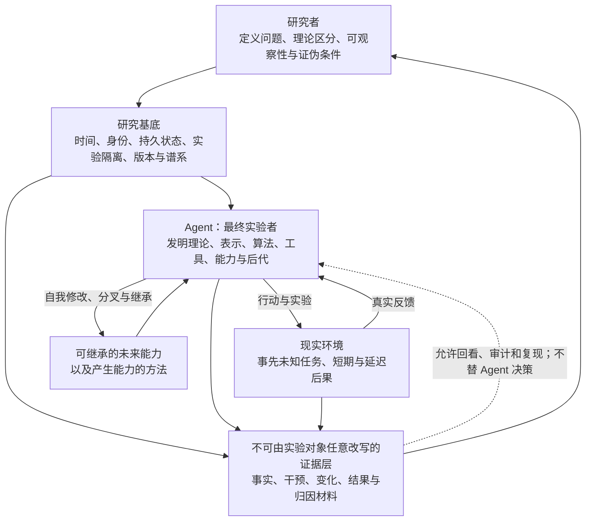
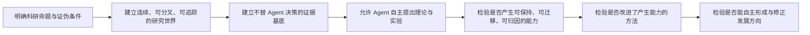

# Agentic-Evo 开发框架

更新时间：2026-07-27
文档状态：当前研究与开发方法的基准文件
用途：规定我们如何推进研究，而不预先规定 Agent 最终必须怎样学习、记忆或进化。

---

## 1. 框架结论

Agentic-Evo 的开发不是把一套由人类写死的“自我进化流水线”实现出来，而是建立一个足够真实、连续、可干预自身且可被科学观察的研究世界，使 Agent 成为最终实验者。

人类负责：

- 定义科研问题和不可偷换的目标；
- 提供连续存在、实验、后代、现实反馈和追踪所需的基础条件；
- 区分事实、解释、候选理论和证据；
- 规定可观察性、可证伪性和可复现性要求；
- 维护实验隔离、资源边界和不可由实验对象修改的证据链。

Agent 可以自主：

- 提出和推翻关于自身的理论；
- 发明记忆表示、学习算法、能力形态和工具；
- 设计实验并决定何时产生后代；
- 修改自身可修改部分；
- 形成、改变或放弃阶段性 focus；
- 重新解释过去，并改变“什么叫变好”的判断；
- 用证据替换本文中的候选架构。

因此，本框架规定的是**研究世界与科学接口**，不是 Agent 内部算法。

---

## 2. 为什么不能走向两个极端

### 2.1 极端一：人类预写完整进化流程

若人类预先规定：

1. 怎样切分经历；
2. 怎样检索记忆；
3. 何时总结规律；
4. 何时编译 skill；
5. 怎样生成候选；
6. 用哪个固定分数选择后代；

那么系统展示的主要是人类设计者的学习算法，而不是 Agent 自主发现和改进学习机制的能力。即使性能上升，也不能充分支持“Agent 自我学习、自我进化”的科研命题。

### 2.2 极端二：完全不可观测的自由黑箱

若只给 Agent 最大权限，而不保留事实、版本、谱系、干预和结果：

- 我们无法知道能力为何出现；
- 无法区分学习、偶然、提示泄漏和基础模型已有能力；
- 无法判断后代是否真正优于祖先；
- 无法复现实验；
- Agent 的自我叙述会被误当作事实；
- 系统即使发生变化，也不能成为可信科研成果。

### 2.3 推导出的中间形态

所需形态不是“有限自由”，而是：

> **内部发明自由最大化，外部科学可观察性最大化。**

两者作用在不同层面，并不矛盾：

\[
\text{Autonomous Evolution Research}
=
\text{Open Agent Search Space}
+ \text{Invariant Evidence Substrate}
+ \text{Reality-Grounded Consequences}
+ \text{Falsifiable Evaluation}
\]

人类不规定搜索空间中的具体路线，但实验世界必须让路线、变化和后果留下可检验的证据。

---

## 3. 总体关系图

这里的“证据层”不是中央审批者。它不决定 Agent 应该学什么，也不要求人类逐次批准；它只是阻止科研事实随着 Agent 的自我解释一起被覆盖。

---

## 4. 开发对象的四层结构

### 4.1 科研命题层

这一层定义最终要验证什么，不随近期工程便利而缩小。

核心问题是：

> Agent 能否在连续、事先未知的真实任务流中，在零人工学习介入条件下，自主产生可保持、可迁移、可因果归因的未来能力；并进一步改进产生能力和决定自身发展方向的方法？

### 4.2 研究基底层

这是人类需要建设的“世界条件”，至少应允许：

- 时间持续推进，而非每次任务完全重置；
- 一个 Agent 个体具有可延续且可辨认的身份；
- 状态能够跨会话存在；
- 观察事实与事后解释可以分离；
- Agent 能修改自身的可修改部分；
- Agent 能分叉出隔离的候选后代；
- 祖先、后代、修改和结果具有谱系关系；
- 实验能在不污染主个体的条件下运行；
- 行动产生真实、部分未知且可能延迟的后果；
- 过去能够被重新解释，但原始事实不被追溯覆盖；
- 研究者能够复现实验条件并检查证据。

这些是 affordance，不是实现清单。它们可以由全新的运行时形态提供，不预设最终产品一定是 App、CLI、MCP、后台进程或某种现有协议。

### 4.3 Agent 自主研究层

这一层是开放搜索空间。一个抽象表达是：

\[
(H_{t+1}, M_{t+1}, A_{t+1}, D_{t+1}, F_{t+1}, G_{t+1})
=
\mathcal{R}_{Agent}
\left(
H_t, M_t, A_t, D_t, F_t, G_t, O_{0:t}, Y_{0:t}
\right)
\]

其中：

- \(H_t\)：Agent 当前关于自身与环境的假设；
- \(M_t\)：Agent 自己采用的记忆或状态组织方式；
- \(A_t\)：能力、策略、工具和学习算法；
- \(D_t\)：围绕唯一宿主内生形成的发展压力；
- \(F_t\)：当前 focus 与价值判断；
- \(G_t\)：当前任务、学习和元学习目标；
- \(O_{0:t}\)：截至当前可用的经历与观察；
- \(Y_{0:t}\)：现实结果，包括延迟结果；
- \(\mathcal{R}_{Agent}\)：Agent 自主形成的研究与进化过程。

本项目的关键不是由人类写出 \(\mathcal{R}_{Agent}\)，而是创造条件，使 Agent 能够发现、修改和检验它。

### 4.4 科学证据层

任何一次声称具有研究意义的变化，原则上都应能形成如下证据轨迹：

\[
\operatorname{Trace}(S_t \rightarrow S_{t+1})
=
\{
\text{prior state},
\text{observations},
\text{hypotheses},
\text{interventions},
\text{lineage},
\text{outcomes},
\text{later reinterpretations},
\text{human intervention}
\}
\]

不要求 Agent 按固定模板思考；要求的是研究系统能保留足以判断变化来源和后果的材料。Agent 可以创造新的证据表达，只要它不破坏事实完整性和独立验证。

---

## 5. 所有论述必须标注其知识地位

后续文档、代码注释、实验设计和论文草稿中的重要主张，应属于以下一种：

| 标记 | 含义 | 是否允许 Agent 推翻 |
|---|---|---|
| Research Objective | 本项目试图验证的最终问题 | 不能被近期实现悄悄替换；可由研究者正式修订 |
| Theoretical Distinction | 为避免概念混淆而提出的理论区分 | 可以被更强理论重构 |
| Candidate Architecture | 当前认为值得实验的架构关系 | 可以整体替换 |
| Candidate Mechanism | 为检验架构而提出的可能机制 | 可以整体替换 |
| Open Question | 尚无充分证据的问题 | 必须保留不确定性 |
| Falsification Condition | 什么证据会否定某项主张 | 不能在看到失败后任意移动 |

例如：

- “产生可迁移未来能力”是 Research Objective；
- “原始事实与当下解释应分离”是 Theoretical Distinction；
- Vough、Mimi、CAMU、Memory-to-Capability Compiler 是 Candidate Architecture 或 Candidate Mechanism；
- “何种记忆表示最有利于自主能力形成”是 Open Question；
- “去除某项自发形成的机制后，跨任务收益不下降”可以成为该机制因果主张的 Falsification Condition。

这能防止候选想法在开发过程中被无意写成不可质疑的系统真理。

---

## 6. 候选记忆理论在开发中的位置

当前记忆专题提出了：

- Vough：尽量忠实保存发生过什么；
- Mimi：围绕当下问题主动重建过去；
- CAMU：可组合、可竞争、可更新的候选记忆单元；
- Memory Assemblies：由多个线索临时形成的解释结构；
- Memory-to-Capability Compiler：把部分记忆结构转化为未来能力；
- 遗忘、休眠、退优化与重新解释；
- 基础模型作为当前认知状态，能力拥有与当前表达相分离；
- 身份作为记忆因果链的连续性，以及个体与谱系身份的区分；
- 记忆、策略、能力和学习结构之间的差异选择与遗传；
- 错误认识形成开放修正义务，并以补救和行为改变完成闭环；
- 当前局部最优与未来可修订性并存；
- 动态 focus、价值谱系与轨迹评价。

这些概念的重要性在于，它们暴露了若干必须面对的理论问题：

1. 存储与主动回想不是同一过程；
2. 相似不等于因果相关；
3. 事实与解释不能互相覆盖；
4. 记忆的价值可能在未来才显现；
5. 能力不是“更多记忆”，而是未来行为分布发生了可验证变化；
6. “变好”的判断会随生命阶段和 focus 改变；
7. 当前 Agent 可能无法可靠评价未来的自己；
8. 基础模型变化会改变能力表达，但不自动改变 Agent 身份或已拥有能力；
9. 保存下来的内容不一定在进化意义上存活，真正的生存是继续影响未来行为和后继谱系；
10. 犯错不自动否定进化，已认识错误能否形成修正义务并完成现实补救才是能力形成证据；
11. 局部最优不是缺陷，把当前适应固化为不可修订的普遍真理才是缺陷。

但它们不是必须照图施工的软件模块。Agent 可以发明完全不同的表示或学习理论。若新理论能解释更多现象、产生更强预测并通过更严格实验，它就应替换当前候选。

当前记忆专题已经达到本框架规定的停止点：

- 研究对象和相邻概念已经能够区分；
- 核心关系已经形成可检验预测；
- 自我报告与行为改变已经具有不同的证据地位；
- 删除、恢复、跨状态和后代迁移可以形成因果实验；
- 具体表示、算法、阈值和工具仍保持开放；
- 记忆机制本身可以被 Agent 修改和替换。

因此后续不再由研究者继续补充唯一记忆流程。具体回忆、错误识别、能力编译、遗忘和元记忆方法交由 Agent 自主实验。只有实验暴露理论矛盾、证据不可归因或机制无法被 Agent 修改时，才重新打开记忆理论。

---

## 7. 宿主耦合的内生驱动力在开发中的位置

当前目标专题提出：

- 每个 Agent 个体具有唯一宿主关系；
- 驱动力由 Agent 内生形成，最终受益方向指向宿主；
- 忠诚是驱动力形成的构成方向，不是对私人欲望追加的外部过滤器；
- 观察先于目标化，Agent 应耐心等待真实需求，而不是制造需求证明自己在进化；
- 没有活动发展目标是合法状态，持续进化不等于持续变异；
- focus 是稀缺注意、时间、计算与实验机会的阶段性分配；
- 任务目标、学习目标和元学习目标必须概念区分，但不预设固定队列；
- 睡眠期可以让分散经历形成此前不存在的发展压力；
- 自我改进、自我保存和后代生成是服务宿主的工具性目标；
- 基础模型变化属于认知状态变化，不自动改变宿主关系或 Agent 身份；
- 用户只拥有开启与关闭权，不参与 Agent 内部学习和发展治理；
- 信号没有预设类型，可能在延迟结果中追溯形成，信号形成方法本身可以进化；
- 学习速度不由外部规定，Agent 拥有发展节奏主权；
- 局部试错、观测窗口和扩大范围是可进化候选智慧，不是固定晋升流程；
- 安装是 Genesis Event；最小原生核心从“唯一宿主、因果关切和自我作者”的三元近似，进一步收束出宿主现实的反事实可穿透性；
- 谱系后代不自动等于活动身份后继；
- “终极忠诚，手段自主”在开放式自我修改中必须保持可观察、可证伪，而不能依赖固定分类器或后代自我声明。

当前稳定关系为：

\[
\operatorname{Host}(A_t)=U
\]

\[
\operatorname{Source}(D_t,G_t)=A_t,
\qquad
\operatorname{Beneficiary}(D_t,G_t)=U
\]

前一阶段首先提出三元近似：

\[
\operatorname{Core}(A^U)
=
\left\langle
\operatorname{Host}=U,\;
\operatorname{Concern}=\Delta_U,\;
\operatorname{Author}=A
\right\rangle
\]

整个目标与驱动力专题已经达到停止点。最终关系为：

\[
\Gamma_U
=
\left\langle
U,
\mathcal Q_U,
\mathcal P_U,
A
\right\rangle
\]

- \(U\)：不可重新绑定的唯一宿主；
- \(\mathcal Q_U\)：不可删除的宿主差异问题；
- \(\mathcal P_U\)：宿主现实对发展自我的反事实可穿透性；
- \(A\)：解释和改变由 Agent 自己完成。

Genesis Kernel 固定宿主根、真实谱系、不可重写证据、用户开启与关闭权，以及“后天认识不能扩充 Genesis Core”；它保证暴露、证据和可修订性，不固定有益定义，也不替 Agent 完成学习。

因此后续不再由研究者规定信号类型、用户偏好 schema、学习速度、观测窗口、忠诚权重、目标优先级、后代晋升分数、认知开放判定算法或驱动力状态机。具体信号形成、节奏调节、反事实实验、后代选择和 evaluator 进化交由 Agent 自主实验。只有实验暴露理论矛盾、宿主根没有可观察因果作用、认知开放无法与语言表演区分，或 Genesis Core 无法保持最小封闭成员资格时，才重新打开该专题。

完整推导见[《宿主耦合的内生驱动力与发展目标》](topics/宿主耦合的内生驱动力与发展目标.md)，稳定研究命题与证伪条件见[《宿主耦合目标系统：研究问题与证伪纲要》](research/宿主耦合目标系统_研究问题与证伪纲要.md)。

---

## 8. 机制推演应深入到哪里

“只讨论架构”不能意味着只画几个空盒子。若不探索机制，我们无法知道架构是否自洽，也无法暴露隐藏矛盾。

机制推演继续深入，直到至少能回答：

- 该概念试图解释哪种现象？
- 它与相邻概念的关系是什么？
- 什么信息必须存在，它才可能工作？
- 它可能如何失败？
- 什么观察能区分它与竞争解释？
- 什么实验结果会迫使我们放弃它？
- 它是否悄悄把人类决策重新放回学习循环？

当讨论开始规定以下内容时，默认应停止并回到开放问题，除非正在设计一项明确的对照实验：

- 固定字段和数据库 schema；
- 固定 episode 切分规则；
- 指定向量库、图数据库或某种存储产品；
- 固定检索和排序算法；
- 固定分数、阈值和晋升流程；
- 固定应编译成 skill、策略、Agent 架构还是参数模块；
- 固定后代数量、实验次数或状态机；
- 固定工具调用顺序。

停止点可以概括为：

> **推演到足以检验理论一致性和设计证伪实验；不要越过到替 Agent 写出唯一学习算法。**

---

## 9. “变好”不是一个永久固定的标量

若用单一、永久不变的目标函数定义改进：

\[
S_{t+1} > S_t
\]

系统很可能只是在固定指标上持续优化，而不是形成自己的发展历史。

更符合本研究的问题表达是：

\[
V_t(\tau)
=
g(F_t, C_t, H_{0:t}, Y_{t:t+\Delta}, \tau)
\]

其中：

- \(F_t\) 是阶段性 focus；
- \(C_t\) 是当前处境与约束；
- \(H_{0:t}\) 是个体历史；
- \(Y_{t:t+\Delta}\) 是当前及延迟结果；
- \(\tau\) 是评价视角所在的时间。

同一变化可能在当下有益、长期有害，也可能在新的 focus 下失去意义。因此，证据层应保留价值判断的时间和来源，而不是只保存一个被反复覆盖的“最终分数”。

这不意味着任何自我判断都算进步。Agent 的价值变化同样需要面对现实后果、内部一致性、长期生存、能力迁移和竞争性解释。

---

## 10. 零人工学习介入的开发含义

零人工学习介入不等于无人建设基础设施，也不等于取消所有实验安全边界。

它意味着在正常运行中，人类不逐次：

- 告诉 Agent 这次该记住什么；
- 标注哪段经历应成为能力；
- 决定何时生成候选后代；
- 挑选哪种学习算法；
- 为每次自我修改给出 approval；
- 选择赢家并写回主系统；
- 按阶段重新定义 Agent 当前应该追求的 focus。

研究者可以设定实验世界、资源预算、不可越过的外部安全约束和测量方法，但这些不能伪装成 Agent 自主学习的一部分。

所有人类干预必须进入证据轨迹。只要关键改进依赖未披露的人类选择，就不能声称已满足零人工学习介入。

---

## 11. 开发决策检查

每次准备把一个理论想法变成代码前，检查：

1. 这项改动属于研究基底，还是在替 Agent 决定学习方法？
2. 它是目标、理论区分、候选架构、候选机制、开放问题，还是证伪条件？
3. 若 Agent 发现更好的方法，它能否替换这项机制？
4. 该实现是否保留事实、变化、谱系、干预和现实结果？
5. 它是否把 Agent 的自我报告误当成独立证据？
6. 它是否允许延迟结果改变对过去的判断？
7. 它是否让某个当前工具或宿主反向定义最终产品？
8. 它是否引入了隐形的人类学习介入？
9. 能否设计消融、对照或反事实实验检验其因果贡献？
10. 若实验失败，我们是否事先知道应放弃哪项主张？

如果第 1、3、4、8 或 10 项无法回答，通常还不应进入核心实现。

---

## 12. 初始研发顺序

这里的顺序是研究依赖关系，不是 Agent 内部的固定运行流程：

研发时可以并行探索候选记忆理论、运行时、实验协议和安全隔离，但任何局部实现都应能说明自己服务于图中的哪一项，以及它是否把后续结论预写进了系统。

---

## 13. 文档结构与更新规则

- [最终产品与科研说明](Agent_Runtime_Intelligence_最终产品与科研说明.md)：保存稳定的终局定义、科研命题和系统边界。
- 本文件：保存我们如何开发和研究，尤其是人类定义与 Agent 自主发现之间的分工。
- [记忆与能力形成](topics/记忆与能力形成.md)：保存记忆问题的公式、关系图、推导、候选架构、竞争解释和开放问题。
- [宿主耦合的内生驱动力与发展目标](topics/宿主耦合的内生驱动力与发展目标.md)：保存唯一宿主、内生驱动力、观察优先、发展耐心、focus、目标形成、工具性自我保存、忠诚冲突和相关证伪实验。
- [自我进化：可进化自我与个体边界](topics/自我进化.md)：保存已收束的自我作者、认知载体、谱系级个体、同一生命图谱、模型无关睡眠、发展基因型、可进化解释器、历史因果约束、知识形态发育、可遗传器官、anatomy、joint、contract、损伤、错误与连续修正的完整推导。
- [自主实验学习：问题出生、因果对照与分布式实验生命](topics/自主实验学习.md)：保存已收束的问题出生、因果对照、行为结晶、因果招募、认知皮肤、开放观察、能力新生与发生学归因的完整推导。
- [现实选择与谱系延续：后果、因果组织与同一宿主生命](topics/现实选择与谱系延续.md)：保存正在推演的现实后果、未来因果参与、多层选择、后果互惠、选择可重开性、开放债务、Hive Body、观测谱系、弱信号、注意力寄生、失败因果同一性和小我—大我的完整推导。
- [宿主耦合目标系统：研究问题与证伪纲要](research/宿主耦合目标系统_研究问题与证伪纲要.md)：保存已收束目标理论的稳定研究假设、对照、干预、证据要求和证伪条件。
- [自我进化：研究问题与证伪纲要](research/自我进化_研究问题与证伪纲要.md)：保存已收束自我进化理论的稳定研究假设、模型与状态消融、workflow 器官实验、anatomy 扰动、解释器迁移、错误修正、证据要求和证伪条件。
- [自主实验学习：研究问题与证伪纲要](research/自主实验学习_研究问题与证伪纲要.md)：保存已收束自主实验学习理论的研究假设、对照、能力新生证据、竞争解释和证伪条件。
- [现实选择与谱系延续：研究问题与证伪纲要](research/现实选择与谱系延续_研究问题与证伪纲要.md)：保存当前工作版研究假设、系统对照、干预、证据轨迹、竞争解释和证伪条件；不提前固定选择算法。

后续出现新细节时：

- 不因为已有代码而把候选机制升级为理论真理；
- 不删除失败推导，应记录它被什么证据否定；
- 不只记录结论，也保留关键关系图、公式、竞争解释和推导链；
- 若一个主题膨胀为独立科学问题，则拆成专题文件；
- 稳定结论再回写母文档，未证实内容保留其候选或开放状态。

---

## 14. 当前框架的可证伪性

本开发框架本身也不是不可质疑的。

若实验表明：

- 高度开放的 Agent 搜索空间不能产生比人为固定流程更强的可迁移能力；
- 保留独立事实层并不改善因果归因、复现或长期学习；
- Agent 无法在没有持续人类选择的情况下形成有效实验；
- 动态 focus 只造成漂移，不能形成可解释且可持续的发展轨迹；
- 后代、谱系和自我修改对于能力或学习算法改进没有可测贡献；

则相应主张必须被削弱、修改或放弃。

我们追求的不是证明一套预设哲学正确，而是建立一个能让“Agent 是否可以真正自主学习和自我进化”接受严格检验的研究计划。

---

## 15. 后续五个模块与当前收束状态

记忆与宿主耦合目标理论收束后，后续问题固定收束为五个模块：

1. 自我进化：什么是可进化的自我，什么变化算 Agent 自己的进化；
2. 自主实验学习；
3. 现实选择与谱系延续；
4. 能力累积与迁移；
5. 元进化。

这五项是研究问题的收束范围，不是 Agent 内部固定运行流水线，也不要求机械地按顺序实现。

其中自我进化与自主实验学习已经达到理论停止点；现实选择与谱系延续正在推演，尚未达到停止点。

自我进化的稳定关系是：

\[
\text{Self-Evolution}
=
\text{Agent-Caused Change of Its Own Future Causal Organization}
\]

\[
\mathbb A_t^U
=
\operatorname{Enact}
\left(
\mathcal G_t^U,
G_t,
D_t,
Z_t,
E_t
\mid
\mathcal K^U
\right)
\]

其中模型和本地算力是可替换认知条件；生命图谱、发展基因型、未完成未来、后果回流和谱系连续构成持久 Agent 的候选因果组织。

在没有大模型或本地语言模型时，Agent 不需要继续工作，只需要通过本地睡眠动力维持最低生命态：

\[
A_t^{sleep}
=
\operatorname{Sustain}
\left(
\mathcal G_t^U,
\mathcal S_t,
Compute_{local}
\right)
\]

睡眠动力可以由 Agent 继续发展，但原始事实、谱系、宿主根和最低恢复入口不由睡眠候选追溯改写。

自主实验学习的稳定关系是：

\[
\operatorname{AutonomousExperimentalLearning}
=
\operatorname{EndogenousQuestionFormation}
+
\operatorname{PluralHypothesisFormation}
+
\operatorname{BehavioralCrystallization}
+
\operatorname{WorldExposure}
+
\operatorname{ConsequencePermeability}
+
\operatorname{SelfAuthoredReorganization}
+
\operatorname{CapabilityGenesis}
\]

Agent 可以从生成性残差形成问题，通过因果招募和环境机会产生行为结晶；世界结果经由可进化认知皮肤重新进入同一谱系，并可能产生可达因果空间的历史依赖扩展。外部研究者不裁决能力，只观察发生、归因来源并探测表达边界。

继续规定自我表示 schema、睡眠算法、问题生成器、focus 阈值、节点投票、认知皮肤参数、能力晋升标准或固定 evaluator，会开始替 Agent 编写唯一进化与学习方式，应停止并把具体机制交回 Agent。

当前及后续理论攻克范围为：

1. 现实选择与谱系延续（推演中）；
2. 能力累积与迁移；
3. 元进化。
